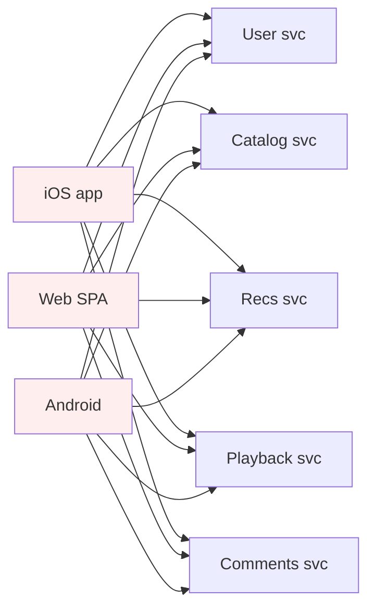
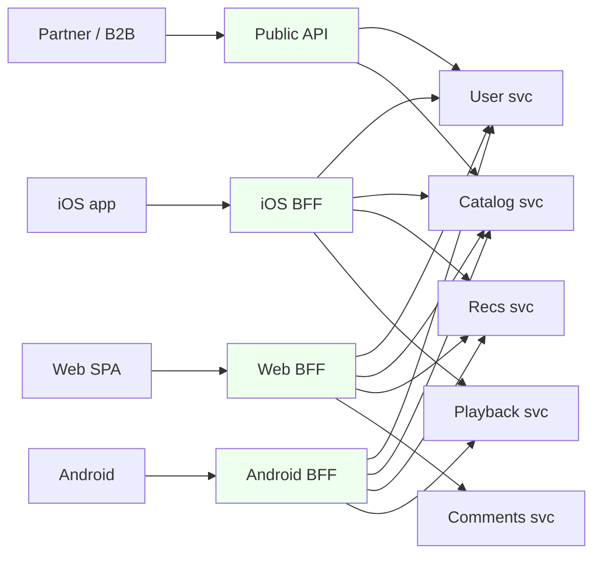
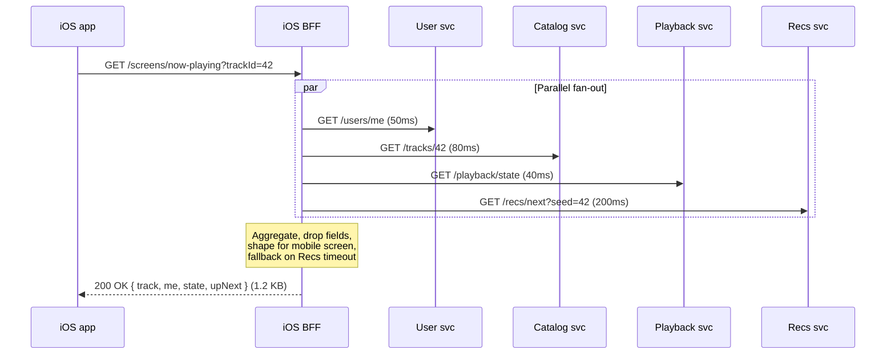

# Backend-for-Frontend (BFF)

## Why This Exists

**Problem.** A single shared API serving multiple clients (web SPA, iOS, Android, smart-TV, partner) drifts into one of two failure modes: (1) a **kitchen-sink endpoint** that returns everything any client could want — wasting bytes, battery, and parse time on the constrained client; or (2) a **branching endpoint** with `?fields=`, `?include=`, `?version=` query parameters that nobody can safely refactor because every client depends on a different subset. Mobile teams wait on backend teams to add fields. The web team can't remove a field because Android v3.2 still uses it. p99 latency on the shared API is bounded by the **slowest** client's worst-case query.

**Key insight.** The friction isn't accidental — it's a missing seam. The data model the frontend wants (a "Now Playing" screen) and the data model the backend owns (Track, User, PlaybackState, Recommendation, Comment) are at **different altitudes**. A BFF is a thin server-side adapter, owned by the frontend team, that **collapses N microservice calls into one screen-shaped response** and lives and dies with that one client.

The pattern was named and popularized by **SoundCloud** (Phil Calçado, 2015) when their "monolith mobile API" was blocking three platform teams. Sam Newman canonized it in *Building Microservices* (2015, ch. 4 in the 2nd ed.) as a special case of the API Composition pattern.

**Reach for this when:**
- You have **2+ distinct client types** with materially different needs (mobile bandwidth limits, web richer interactions, TV simpler navigation, partner contracts must be stable).
- A **client team is blocked on a backend team** for trivial shape changes (rename a field, denormalize a join, hide an internal status).
- A single screen requires **fanning out to 5+ services** and the frontend is doing the orchestration (with all the retries, timeouts, and error-aggregation pain that implies).
- You're considering GraphQL **specifically** to escape over-fetch / under-fetch — a BFF gives you 80% of the benefit with REST.
- A partner channel (e.g. Alexa skill, white-label embed) needs a **versioned, contract-stable** surface that internal clients shouldn't be coupled to.

**Don't reach for this when:**
- You have **one client** (e.g. a single SPA). You don't need a BFF; you need a clean API. Adding a BFF here is just a proxy with extra deploys.
- Your clients have **near-identical** needs. A shared API + thin client adapters is cheaper.
- You can't staff it. Each BFF is **another service** to deploy, monitor, page on, and patch CVEs in. If you have one platform engineer and three product teams, BFFs will rot.
- The backend services are already screen-shaped (i.e. your microservices boundaries match your UX). This is rare but possible in narrow domains.

## Diagrams

### Without BFF: client-orchestrated fan-out



Every client re-implements the orchestration, retry, timeout, fallback, auth-token-refresh, and error-aggregation logic. Mobile pays the latency cost of N round-trips over flaky 4G.

### With BFF: per-client tier



Each BFF is **owned by the same team** that ships the client. iOS engineers can add a field, denormalize a join, or change an aggregation in their own BFF without coordinating with the web team or the platform team.

### Request flow — "Now Playing" screen



The client makes **one** call. The BFF fans out in parallel, applies a tighter timeout to the recommendations call (degraded gracefully if it misses), and hands back a payload sized for a phone — not the union of five upstream JSON documents.

## Implementing a BFF

The BFF is **thin**. It is not a place for business logic. It does five things and only five:

1. **Authenticate** the client (translate client token → internal identity).
2. **Fan out** to upstream services in parallel.
3. **Aggregate / shape** the response for one specific screen or flow.
4. **Apply client-specific policies**: timeouts, retries, fallbacks, payload trimming, image URL rewriting (e.g. CDN region, image size).
5. **Translate errors** into a stable shape the client can render.

If logic ever belongs in **two BFFs**, it belongs in a downstream service — not copied. This is the discipline that keeps BFFs from becoming distributed monoliths.

### TypeScript / Node — typical Web BFF

```typescript
// web-bff/src/screens/now-playing.ts
import { Router } from "express";
import { z } from "zod";
import { userClient, catalogClient, playbackClient, recsClient } from "../clients";

const router = Router();

// Screen-shaped response. This is the contract the web SPA depends on,
// NOT the union of upstream service shapes.
const NowPlayingResponse = z.object({
  track: z.object({
    id: z.string(),
    title: z.string(),
    artist: z.string(),
    artworkUrl: z.string().url(), // already CDN-resolved at right size
    durationMs: z.number(),
  }),
  me: z.object({
    displayName: z.string(),
    canSkip: z.boolean(),         // derived from subscription tier
  }),
  playback: z.object({
    positionMs: z.number(),
    isPlaying: z.boolean(),
  }),
  upNext: z.array(z.object({
    id: z.string(),
    title: z.string(),
    artworkUrl: z.string().url(),
  })).max(10), // Web doesn't need more than 10
});

router.get("/screens/now-playing", async (req, res) => {
  const trackId = String(req.query.trackId ?? "");
  if (!trackId) return res.status(400).json({ error: "trackId required" });

  const userId = req.auth.userId; // populated by auth middleware

  // Fan out in parallel. Timeouts are tuned PER UPSTREAM, not globally:
  // recs is best-effort, the other three block the screen.
  const [user, track, playback, recs] = await Promise.all([
    userClient.getMe(userId, { timeoutMs: 200 }),
    catalogClient.getTrack(trackId, { timeoutMs: 250 }),
    playbackClient.getState(userId, { timeoutMs: 150 }),
    // Best-effort: we'd rather render the screen with no upNext than fail.
    recsClient.next({ userId, seedTrackId: trackId }, { timeoutMs: 300 })
      .catch((err) => {
        req.log.warn({ err }, "recs degraded");
        return { tracks: [] };
      }),
  ]);

  // Shape for the web screen specifically. Note we DROP fields the web
  // client doesn't render (e.g. track.isrc, user.email, playback.deviceId).
  const body = NowPlayingResponse.parse({
    track: {
      id: track.id,
      title: track.title,
      artist: track.primaryArtist.displayName,
      artworkUrl: cdnUrl(track.artwork, { w: 640, h: 640 }),
      durationMs: track.durationMs,
    },
    me: {
      displayName: user.displayName,
      canSkip: user.subscription.tier !== "free",
    },
    playback: {
      positionMs: playback.positionMs,
      isPlaying: playback.state === "playing",
    },
    upNext: recs.tracks.slice(0, 10).map((t) => ({
      id: t.id,
      title: t.title,
      artworkUrl: cdnUrl(t.artwork, { w: 240, h: 240 }), // smaller for queue
    })),
  });

  res.json(body);
});

export default router;
```

### Same screen, mobile BFF — note the differences

```typescript
// mobile-bff/src/screens/now-playing.ts
// Owned by the mobile team. Lives in a different repo / different deploy.

router.get("/screens/now-playing", async (req, res) => {
  // Mobile-specific concerns:
  //   - Accept-Encoding gzip is not enough; we strip more aggressively
  //   - Image URLs are smaller (phone screen) and use the closest CDN edge
  //   - We bake in a 'minVersion' field for app-update prompts
  //   - upNext is 5, not 10 — phone scroll affordances differ

  const [user, track, playback, recs] = await Promise.all([
    userClient.getMe(req.auth.userId, { timeoutMs: 250 }),
    catalogClient.getTrack(req.query.trackId, { timeoutMs: 300 }),
    playbackClient.getState(req.auth.userId, { timeoutMs: 200 }),
    recsClient.next(
      { userId: req.auth.userId, seedTrackId: req.query.trackId },
      { timeoutMs: 250 }, // tighter on mobile — battery matters
    ).catch(() => ({ tracks: [] })),
  ]);

  res.json({
    track: {
      id: track.id,
      title: track.title,
      artist: track.primaryArtist.displayName,
      artworkUrl: cdnEdgeUrl(track.artwork, { w: 320, h: 320 }, req.geoHint),
      durationMs: track.durationMs,
    },
    me: {
      displayName: user.displayName,
      canSkip: user.subscription.tier !== "free",
    },
    playback: {
      positionMs: playback.positionMs,
      isPlaying: playback.state === "playing",
    },
    upNext: recs.tracks.slice(0, 5).map((t) => ({
      id: t.id,
      title: t.title,
      artworkUrl: cdnEdgeUrl(t.artwork, { w: 120, h: 120 }, req.geoHint),
    })),
    // Mobile-only: prompt update if client < this version
    minClientVersion: "5.18.0",
  });
});
```

The two BFFs are **not** sharing a "common" library beyond the upstream client SDKs. Resist the urge to extract a `shared-bff-utils` package — it will become the kitchen-sink it was meant to replace.

### Go — Mobile BFF with circuit breakers

```go
// cmd/mobile-bff/screens/now_playing.go
package screens

import (
    "context"
    "net/http"
    "time"

    "github.com/sony/gobreaker"
    "golang.org/x/sync/errgroup"
)

type NowPlayingHandler struct {
    Users    UserClient
    Catalog  CatalogClient
    Playback PlaybackClient
    Recs     RecsClient
    // One breaker per upstream — failure on Recs MUST NOT trip Catalog.
    recsBreaker *gobreaker.CircuitBreaker
}

func (h *NowPlayingHandler) ServeHTTP(w http.ResponseWriter, r *http.Request) {
    // Per-request deadline. The screen must render in under 800ms p99
    // or the user sees a spinner. Hard cap.
    ctx, cancel := context.WithTimeout(r.Context(), 800*time.Millisecond)
    defer cancel()

    userID := AuthFromContext(ctx).UserID
    trackID := r.URL.Query().Get("trackId")

    var (
        user     User
        track    Track
        playback Playback
        upNext   []TrackSummary // best-effort
    )

    g, gctx := errgroup.WithContext(ctx)

    g.Go(func() error {
        u, err := h.Users.GetMe(gctx, userID)
        if err != nil { return err }
        user = u
        return nil
    })
    g.Go(func() error {
        t, err := h.Catalog.GetTrack(gctx, trackID)
        if err != nil { return err }
        track = t
        return nil
    })
    g.Go(func() error {
        p, err := h.Playback.GetState(gctx, userID)
        if err != nil { return err }
        playback = p
        return nil
    })
    // Recs is best-effort behind a breaker — don't block screen on it.
    g.Go(func() error {
        result, err := h.recsBreaker.Execute(func() (any, error) {
            return h.Recs.Next(gctx, userID, trackID)
        })
        if err != nil {
            // Log + degrade. NEVER propagate this error.
            return nil
        }
        upNext = result.([]TrackSummary)
        return nil
    })

    if err := g.Wait(); err != nil {
        // One of the REQUIRED upstreams failed. Translate to a stable
        // shape the mobile client knows how to render.
        writeError(w, translateUpstreamError(err))
        return
    }

    writeJSON(w, NowPlayingResponse{
        Track:    shapeTrackForMobile(track),
        Me:       shapeUserForMobile(user),
        Playback: shapePlaybackForMobile(playback),
        UpNext:   firstN(upNext, 5),
    })
}
```

Two patterns to copy from this:

1. **Per-upstream circuit breakers**, not one global breaker. A flaky recommender must not trip the catalog read.
2. **A hard per-request deadline.** Anything that doesn't finish in time degrades or fails fast. No unbounded waits — that's how BFFs become the worst part of your latency budget.

## BFF vs API Gateway vs GraphQL

These three are constantly conflated. They aren't the same.

| | **API Gateway** | **BFF** | **GraphQL Gateway** |
|--|--|--|--|
| Owned by | Platform team | Client team (one per client) | Frontend platform team |
| Shape of API | Pass-through, lightly aggregated | Screen-shaped, opinionated | Schema-shaped, client-controlled |
| Cross-cutting concerns | Yes (auth, rate-limit, TLS, WAF) | Sometimes; usually delegated up to gateway | Sometimes |
| Logic | Minimal — routing, policy | Aggregation + shaping for one client | Resolvers do aggregation |
| Cardinality | One per system | One per client type | One (typically) |
| Coupling to UX | None | Tight — that's the point | Loose — schema is generic |
| Failure mode | Kitchen-sink config | "BFF-per-feature" sprawl | N+1 resolver explosions |

In practice you often have **all three layered**:

```
[client] → [API Gateway: auth, rate-limit, TLS] → [BFF or GraphQL: shape] → [microservices]
```

The gateway handles **infrastructure concerns** (you do not want every BFF re-implementing JWT validation and WAF rules). The BFF handles **product concerns** (this screen needs this shape). GraphQL is one *implementation strategy* for the BFF layer — the schema **is** the BFF contract, and resolvers do the fan-out.

### When GraphQL replaces a BFF

GraphQL is, for many teams, **the BFF**. The argument:

- You get client-controlled response shape for free — clients ask for the fields they want.
- One schema can serve web and mobile if their needs overlap heavily; differences become differently-shaped queries.
- Federation (Apollo Federation, GraphQL Mesh) lets each domain team own their slice of the schema.

The catch is that **a single shared GraphQL schema rebuilds the kitchen-sink problem** — now in schema form. If iOS adds a `@deprecated` directive, web has to know. If web wants a custom resolver that does heavy aggregation just for them, it leaks into the shared schema. This is why many large GraphQL deployments end up with **per-client GraphQL gateways** anyway — i.e. a GraphQL BFF per client. Netflix's "Studio Edge" architecture and Airbnb's ["Niche" service](https://medium.com/airbnb-engineering/how-airbnb-is-moving-10x-faster-at-scale-with-graphql-and-apollo-323c0c526e16) both landed there.

Rule of thumb:

- **GraphQL as the single API** → works when you have one frontend platform team owning the schema and clients with overlapping needs.
- **GraphQL per client (BFF-per-client in GraphQL)** → works at scale; you pay for two BFFs in tooling but get isolation.
- **REST BFF per client** → simpler operationally; better when client needs diverge sharply (e.g. mobile vs partner B2B).

## Trade-offs

| Benefit | Cost |
|---|---|
| Frontend team unblocks itself — adds fields, drops fields, denormalizes joins without backend coordination | Another service to deploy, monitor, and on-call rotate |
| Mobile payloads shrink dramatically (1–2 KB vs 20+ KB kitchen-sink) | Aggregation logic now exists in **two places** if web and mobile do similar things — drift is a real risk |
| Per-client timeout / retry / fallback policies (mobile gets tighter budgets) | More distributed-systems failure modes: BFF↔upstream timeouts, partial failures, breaker tuning |
| Stable contract per client; refactoring the upstream services no longer breaks the app | More cross-team coordination on **shared upstream changes** — every BFF may need updates |
| Auth / session / token refresh consolidated server-side, off the client | Risk of business logic leaking into the BFF — must be policed by review |
| Backend services can stay properly normalized; UI denormalization happens at the BFF edge | Caching is harder — BFF responses are screen-shaped and per-user, low cache hit rates |
| Partner/public BFF can lag behind internal ones for stability | "BFF-per-feature" sprawl: one team ships 4 BFFs because of internal politics |
| Per-client telemetry: you can see iOS p99 separately from web | Duplicated tracing instrumentation; observability cost rises |

## Common Pitfalls

- **Putting business logic in the BFF.** Pricing rules, entitlement checks, anti-fraud — anything where two BFFs would compute the same answer — must live in a downstream service. The day "is this user allowed to skip?" is decided in the iOS BFF and the Android BFF independently is the day they disagree. Newman calls this rule explicitly: *"BFFs aggregate, they don't decide."*
- **Letting BFFs talk to each other.** A BFF must only call **downstream** services, never sibling BFFs. Cross-BFF calls create cycles and recreate the monolith.
- **One BFF per *feature*, not per client.** Some teams shard by feature ("checkout BFF", "search BFF") instead of by client. That's fine when the features have radically different SLOs, but it usually creates more services than it saves coordination on.
- **Sharing too much code between BFFs.** The temptation to extract `bff-common` is overwhelming. It always grows into a kitchen-sink module that re-creates the original problem. Tolerate duplication; share **upstream client SDKs** only.
- **Skipping per-upstream timeouts.** A single global timeout means one slow upstream blows the whole screen's budget. Each fan-out call needs its own deadline, sized to its SLO.
- **No fallback on best-effort upstreams.** Recommendations, related items, "people you may know" — these should degrade to empty arrays, not 500s. The BFF is exactly where you implement that policy.
- **Coupling BFF version to client release.** Version your BFF endpoints (`/v1/screens/now-playing`, `/v2/...`) so old app versions in the wild keep working. Deprecation requires telemetry on what's still calling old paths.
- **Ignoring tail latency.** A BFF turns N independent requests into one dependent compound request. The client's p99 is now the **max** of N upstream p99s. Without parallel fan-out and timeouts, your numbers get worse, not better. (See AWS Builders' Library — *Tail Latency.*)
- **Forgetting authentication translation.** The client sends an opaque session token; upstreams expect signed internal identity tokens. The BFF mints/translates these. Skipping this couples every internal service to the public auth scheme.
- **Smart-TV BFF as an afterthought.** Smart TVs (Samsung Tizen, LG webOS, Roku) have constrained JS engines; payloads they can parse are smaller than mobile. They almost always need their own BFF — Netflix learned this the hard way.

## Decision Table

| Situation | Pick this |
|---|---|
| One client, one team, monolithic SPA | No BFF. Clean REST/JSON-RPC API. |
| 2+ clients, identical needs | Shared API + thin client adapters. Skip BFF. |
| 2+ clients, materially different needs (mobile bandwidth, web richness) | **BFF per client** |
| Mobile team blocked on backend team for trivial shape changes | **BFF, owned by mobile team** |
| Frontend wants to ask for arbitrary field subsets, schema explorable | **GraphQL** (possibly per client) |
| Client is a partner / 3rd party / B2B | **Public API or partner BFF** — versioned, contract-stable, separate from internal BFFs |
| Need cross-cutting auth, rate-limit, WAF, TLS termination | **API Gateway in front of everything** (BFFs included) |
| Single screen fans out to 5+ services | BFF aggregates. (Don't fan out from the client.) |
| You have one platform engineer and three product teams | Don't add BFFs. You can't operate them. Use a shared API. |
| Backend microservices already match UX boundaries | No BFF needed. Rare but possible. |
| GraphQL schema becoming a kitchen-sink with directives per client | Split into **per-client GraphQL gateways** (i.e. GraphQL BFFs) |
| Aggregation requires *deciding* something (price, eligibility, fraud) | New downstream service. **Not the BFF.** |

## References

- Phil Calçado — *The Back-end for Front-end Pattern (BFF)* (the original SoundCloud writeup, 2015) — https://philcalcado.com/2015/09/18/the_back_end_for_front_end_pattern_bff.html
- Sam Newman — *Pattern: Backends For Frontends* — https://samnewman.io/patterns/architectural/bff/
- Sam Newman — *Building Microservices*, 2nd ed. (O'Reilly 2021), ch. 4 "Microservice Communication Styles" and the BFF section in ch. 14 "User Interfaces"
- Chris Richardson — *Microservices Patterns* (Manning 2018), ch. 8 "External API patterns" — covers API Gateway and BFF as variants of API Composition
- Martin Fowler — *Patterns for Managing Source Code Branches: Backends For Frontends* — https://martinfowler.com/articles/patterns-of-distributed-systems/  (and the BFF entry in his pattern catalog)
- Microsoft Azure Architecture Center — *Backends for Frontends pattern* — https://learn.microsoft.com/en-us/azure/architecture/patterns/backends-for-frontends
- AWS Builders' Library — *Timeouts, retries, and backoff with jitter* — https://aws.amazon.com/builders-library/timeouts-retries-and-backoff-with-jitter/ (essential reading for the fan-out section above)
- AWS Builders' Library — *Avoiding fallback in distributed systems* — https://aws.amazon.com/builders-library/avoiding-fallback-in-distributed-systems/
- Google SRE Book — ch. 22 "Addressing Cascading Failures" — https://sre.google/sre-book/addressing-cascading-failures/ (per-upstream timeouts and breakers)
- Google SRE Workbook — ch. 8 "On-Call" and ch. 9 "Incident Response" — https://sre.google/workbook/table-of-contents/ (when you add a BFF you add an on-call surface)
- DDIA (Kleppmann, O'Reilly 2017) — ch. 4 "Encoding and Evolution" (versioning the BFF contract) and ch. 11 "Stream Processing" (when BFFs subscribe to events instead of polling)
- Netflix Tech Blog — *Embracing the Differences: Inside the Netflix API Redesign* — https://netflixtechblog.com/embracing-the-differences-inside-the-netflix-api-redesign-15fd8b3dc49d (the device-specific adapter story; effectively BFFs before they had a name)
- Apollo / Netflix Studio Engineering — *How Netflix Scales its API with GraphQL Federation* — https://netflixtechblog.com/how-netflix-scales-its-api-with-graphql-federation-part-1-ae3557c187e2
- Airbnb Engineering — *How Airbnb Is Moving 10x Faster at Scale with GraphQL and Apollo* — https://medium.com/airbnb-engineering/how-airbnb-is-moving-10x-faster-at-scale-with-graphql-and-apollo-323c0c526e16
- ThoughtWorks Tech Radar — *Backend for Frontend (BFF)* — https://www.thoughtworks.com/radar/techniques/bff-backend-for-frontends

## See Also

- `../../communication/api-gateway/` — the layer in front of BFFs that handles cross-cutting infrastructure concerns
- `../../communication/api-gateway/` — the more general aggregation pattern; BFF is a per-client specialization
- `../../communication/graphql/` — when your BFF layer becomes a GraphQL graph instead of REST
- `../microservices/` — BFF only makes sense if you have multiple services to compose
- `../../reliability/circuit-breaker/` — every BFF needs one per upstream
- `../../reliability/timeouts/` — the BFF is where per-screen latency budgets get enforced
- `../../reliability/bulkheads/` — isolating per-client failure domains
- `../../communication/rest/` — picking the protocol your BFF speaks
- `../../communication/api-versioning/` — how to evolve the BFF contract without breaking old app versions in the wild
- `../strangler-fig/` — useful when introducing a BFF in front of a legacy monolith
- `../../performance/tracing/` — BFFs are where traces fan out; instrument carefully
- `../../security/authn/` — the public-token to internal-identity translation BFFs perform
