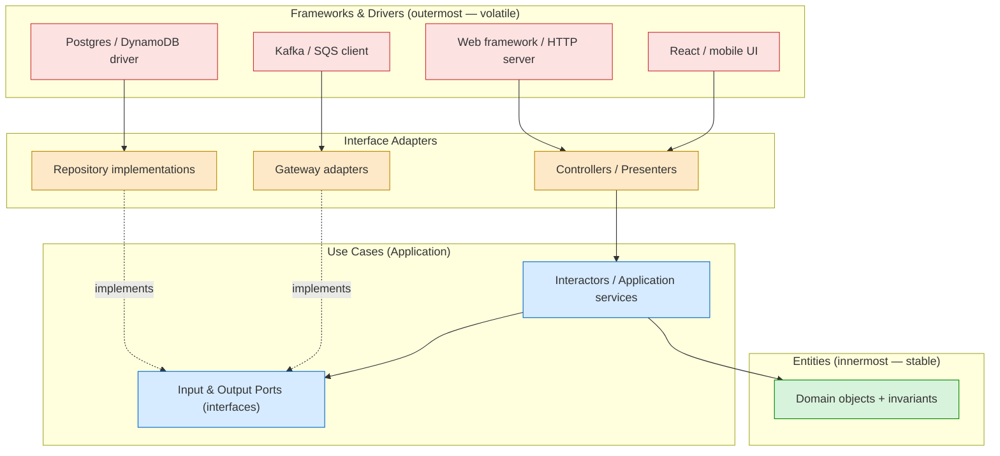
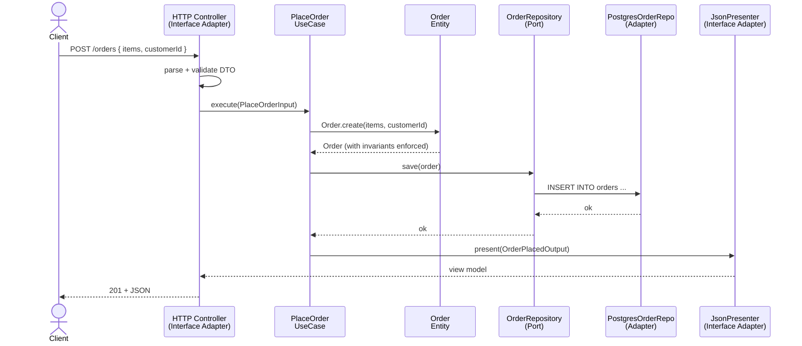

# Clean Architecture

## Why This Exists

**Problem.** Most production codebases die not from missing features but from **entanglement**. The domain logic — the actual reason the company exists — gets spread across HTTP controllers, ORM models, message-queue handlers, and cron jobs. Five years in, "change the discount rule" requires editing 11 files in 4 layers, and the only way to test it is to boot a real Kafka. The framework owns the business, instead of the other way around.

**Key insight.** The valuable, slow-changing thing in your system is the **business policy** (entities, use cases). Everything else — the web framework, the database, the message broker, the cloud provider — is a **detail that should be swappable**. Therefore: **dependencies must point inward**, from volatile concrete things (frameworks, drivers, UI) toward stable abstract things (entities). The domain must not know that HTTP, Postgres, or React exist.

This is Robert C. Martin's framing in *Clean Architecture* (2017), but it's the same idea Alistair Cockburn published as **Hexagonal Architecture / Ports & Adapters** (2005) and Jeffrey Palermo as **Onion Architecture** (2008). They're isomorphic — concentric circles, hexagons, onions, all pointing the same dependency arrow.

**Reach for this when:**
- Business logic is non-trivial and will outlive the current framework choice (it always does — Rails 2 → 7, Spring MVC → WebFlux, Express → Fastify).
- You need the same use case callable from multiple delivery mechanisms (HTTP + gRPC + CLI + scheduled job + Kafka consumer) without copy-paste.
- You want **fast unit tests** for business rules — milliseconds, no DB, no network. If your "unit tests" take 30 seconds because they boot Spring, you need this.
- The domain is rich (insurance, banking, logistics, healthcare, trading) and the rules genuinely belong to the business, not to a CRUD form.
- Multiple teams touch the codebase and you need **enforced module boundaries** so a junior can't accidentally `import psycopg2` from inside `domain/`.

**Don't reach for this when:**
- You're building a CRUD admin panel, a marketing site, a 2-week prototype, or anything where the "domain logic" is `INSERT INTO users`. The ceremony will outweigh the value 10:1.
- The team has fewer than ~3 engineers and the app fits in one developer's head. Architecture overhead is a tax paid by the team that didn't write it.
- You're optimizing for raw throughput on a tight latency budget and every layer of indirection costs measurable nanoseconds (HFT, embedded, game engines).
- The domain is genuinely thin — most "microservices" are integration glue, not domain. Don't dress up a proxy as DDD.
- You haven't yet learned the domain. Premature architecture freezes the wrong abstractions. Ship the spike first, *then* refactor when the seams emerge.

## Diagrams

### The concentric circles and the dependency rule



Read the arrows: **source code dependencies cross circle boundaries only by pointing inward**. Outer layers know about inner layers. Inner layers know nothing about outer layers — they declare **ports** (interfaces) that outer layers **implement**. This is dependency inversion, applied at the architectural level.

### Request flow through the layers



Note: the use case talks to `OrderRepository` (a port — an interface owned by the inner layer), **not** to `PostgresOrderRepo`. The adapter is injected at the composition root. This is the entire trick.

## The Four Layers, Concretely

### 1. Entities (innermost)
- **What:** Business objects with invariants. `Order`, `Money`, `Policy`, `Patient`. Pure language, zero framework imports.
- **Owns:** Critical business rules that would be true even if the company had no software (e.g., "an order's total equals the sum of line items").
- **Knows about:** Other entities, value objects, domain exceptions. Nothing else.

### 2. Use Cases (a.k.a. Interactors, Application Services)
- **What:** Application-specific orchestration. "Place an order", "Cancel a policy", "Reconcile a statement".
- **Owns:** The script of *how* the use case runs — fetch this, validate that, call the entity, persist, emit event.
- **Knows about:** Entities and ports (input/output interfaces it defines). It does **not** know about HTTP, SQL, or Kafka.

### 3. Interface Adapters
- **What:** Translators. Controllers translate HTTP → use-case input. Presenters translate use-case output → view model. Repositories translate domain objects → SQL rows. Gateways translate domain events → broker messages.
- **Owns:** Format conversion. No business rules live here.

### 4. Frameworks & Drivers (outermost)
- **What:** Spring, Django, Express, Postgres driver, AWS SDK, the React app. These are *details*. They should feel like plug-ins.

## Code: a realistic vertical slice (Python)

A "place order" use case, structured by the dependency rule. Compare this to the typical Django view that does everything in `views.py`.

```python
# ============================================================
# domain/order.py  — Entity layer.  Zero framework imports.
# ============================================================
from dataclasses import dataclass, field
from decimal import Decimal
from typing import List
from uuid import UUID, uuid4


class DomainError(Exception):
    """Raised when business invariants are violated."""


@dataclass(frozen=True)
class Money:
    amount: Decimal
    currency: str

    def __post_init__(self):
        if self.amount < 0:
            raise DomainError("Money cannot be negative")

    def __add__(self, other: "Money") -> "Money":
        if self.currency != other.currency:
            raise DomainError(f"Currency mismatch: {self.currency} vs {other.currency}")
        return Money(self.amount + other.amount, self.currency)


@dataclass(frozen=True)
class LineItem:
    sku: str
    quantity: int
    unit_price: Money

    @property
    def subtotal(self) -> Money:
        return Money(self.unit_price.amount * self.quantity, self.unit_price.currency)


@dataclass
class Order:
    id: UUID
    customer_id: UUID
    items: List[LineItem]
    status: str = "PENDING"

    @classmethod
    def create(cls, customer_id: UUID, items: List[LineItem]) -> "Order":
        # Invariant: an order must have at least one item.
        if not items:
            raise DomainError("Order must contain at least one line item")
        # Invariant: all items same currency (a real domain would model multi-currency).
        currencies = {i.unit_price.currency for i in items}
        if len(currencies) > 1:
            raise DomainError(f"Mixed currencies not allowed: {currencies}")
        return cls(id=uuid4(), customer_id=customer_id, items=list(items))

    @property
    def total(self) -> Money:
        return sum((i.subtotal for i in self.items[1:]), self.items[0].subtotal)


# ============================================================
# application/ports.py  — Use-case layer defines interfaces.
# These are owned by the INNER layer; outer layers IMPLEMENT them.
# ============================================================
from abc import ABC, abstractmethod
from typing import Optional


class OrderRepository(ABC):
    @abstractmethod
    def save(self, order: Order) -> None: ...

    @abstractmethod
    def by_id(self, order_id: UUID) -> Optional[Order]: ...


class InventoryService(ABC):
    @abstractmethod
    def reserve(self, sku: str, quantity: int) -> bool: ...


class EventPublisher(ABC):
    @abstractmethod
    def publish(self, event_type: str, payload: dict) -> None: ...


# ============================================================
# application/place_order.py  — The use case (interactor).
# ============================================================
@dataclass(frozen=True)
class PlaceOrderInput:
    customer_id: UUID
    items: List[LineItem]


@dataclass(frozen=True)
class PlaceOrderOutput:
    order_id: UUID
    total_amount: Decimal
    currency: str


class PlaceOrder:
    """Orchestrates: validate inventory -> create order -> persist -> emit event.

    Note what is NOT here: HTTP, JSON, SQL, ORMs, retry policies, logging
    frameworks. Just the application script in pure Python.
    """

    def __init__(
        self,
        orders: OrderRepository,
        inventory: InventoryService,
        events: EventPublisher,
    ):
        self._orders = orders
        self._inventory = inventory
        self._events = events

    def execute(self, cmd: PlaceOrderInput) -> PlaceOrderOutput:
        # Reserve inventory FIRST so we don't persist an order we can't fulfil.
        # (Real systems use a saga or two-phase reservation; simplified here.)
        for item in cmd.items:
            if not self._inventory.reserve(item.sku, item.quantity):
                raise DomainError(f"Insufficient inventory for {item.sku}")

        order = Order.create(cmd.customer_id, cmd.items)
        self._orders.save(order)

        self._events.publish(
            "order.placed",
            {"order_id": str(order.id), "customer_id": str(order.customer_id)},
        )
        return PlaceOrderOutput(
            order_id=order.id,
            total_amount=order.total.amount,
            currency=order.total.currency,
        )


# ============================================================
# infrastructure/postgres_order_repo.py  — Adapter (outer layer).
# This is the ONLY place SQL lives.
# ============================================================
import psycopg2
from psycopg2.extras import Json


class PostgresOrderRepository(OrderRepository):
    def __init__(self, conn_factory):
        self._conn_factory = conn_factory

    def save(self, order: Order) -> None:
        with self._conn_factory() as conn, conn.cursor() as cur:
            cur.execute(
                """INSERT INTO orders (id, customer_id, status, items)
                   VALUES (%s, %s, %s, %s)""",
                (
                    str(order.id),
                    str(order.customer_id),
                    order.status,
                    Json([
                        {"sku": i.sku, "qty": i.quantity,
                         "price": str(i.unit_price.amount),
                         "ccy": i.unit_price.currency}
                        for i in order.items
                    ]),
                ),
            )

    def by_id(self, order_id: UUID) -> Optional[Order]:
        # ... rehydrate domain object from row
        ...


# ============================================================
# interface/http_controller.py  — Interface adapter (FastAPI).
# ============================================================
from fastapi import APIRouter, HTTPException, Depends

router = APIRouter()


@router.post("/orders", status_code=201)
def place_order_endpoint(
    body: dict,                                 # parsed by FastAPI/Pydantic
    use_case: PlaceOrder = Depends(get_place_order_use_case),
):
    try:
        cmd = PlaceOrderInput(
            customer_id=UUID(body["customer_id"]),
            items=[
                LineItem(
                    sku=i["sku"],
                    quantity=i["qty"],
                    unit_price=Money(Decimal(i["price"]), i["ccy"]),
                )
                for i in body["items"]
            ],
        )
        result = use_case.execute(cmd)
    except DomainError as e:
        # Translate domain errors to HTTP. The use case knows nothing about HTTP.
        raise HTTPException(status_code=400, detail=str(e))

    return {
        "order_id": str(result.order_id),
        "total": str(result.total_amount),
        "currency": result.currency,
    }


# ============================================================
# main.py  — Composition root.  Wires concrete adapters to ports.
# This is the ONLY place that knows about every layer.
# ============================================================
def build_app():
    repo = PostgresOrderRepository(conn_factory=get_pool().getconn)
    inventory = HttpInventoryService(base_url="http://inventory.internal")
    events = KafkaPublisher(topic="orders")

    use_case = PlaceOrder(orders=repo, inventory=inventory, events=events)
    # ... wire into FastAPI app
```

### What this buys you (concretely)

**1. Tests that take 5ms, not 5 seconds.**

```python
def test_place_order_persists_and_emits_event():
    repo = InMemoryOrderRepository()
    inventory = StubInventory(always_available=True)
    events = RecordingPublisher()

    use_case = PlaceOrder(repo, inventory, events)
    out = use_case.execute(PlaceOrderInput(
        customer_id=uuid4(),
        items=[LineItem("SKU-1", 2, Money(Decimal("9.99"), "USD"))],
    ))

    assert repo.by_id(out.order_id) is not None
    assert events.published[0][0] == "order.placed"
```

No Postgres. No HTTP. No FastAPI test client. Pure logic.

**2. Swap a framework or a database without touching business code.** Replace FastAPI with Flask: rewrite the controller. Replace Postgres with DynamoDB: rewrite the repo. The use case and entity files don't change.

**3. Multi-delivery.** Want a CLI? `cli.py` constructs `PlaceOrder` and calls `.execute()`. Want a Kafka consumer that places orders from upstream events? Same. Want to expose it over gRPC? Same.

## Hexagonal, Onion, Clean — same animal

| Term | Coined by | Year | Innermost name | Distinctive vocabulary |
|------|-----------|------|----------------|------------------------|
| Ports & Adapters / Hexagonal | Alistair Cockburn | 2005 | (the application) | "ports" (interfaces), "adapters" (implementations); driving vs driven side |
| Onion Architecture | Jeffrey Palermo | 2008 | Domain Model | rings; "infrastructure" outermost |
| Clean Architecture | Robert C. Martin | 2012 (blog), 2017 (book) | Entities | concentric circles; the "Dependency Rule"; explicit "Use Cases" ring |
| DDD layered | Eric Evans | 2003 | Domain | aggregates, repositories, bounded contexts |

**They are isomorphic.** All four say: business rules in the center, infrastructure on the outside, dependencies point inward, abstractions are owned by the inner layer. Pick the vocabulary your team actually understands and stop arguing about it. Cockburn himself said the hexagon shape was just "to avoid the layer cake problem" — it doesn't mean six sides.

The most useful synthesis in practice: **Hexagonal vocabulary (ports & adapters) + DDD vocabulary (aggregates, value objects, domain events) + Clean Architecture's explicit Use Case layer**. That combination is what most modern Java/Kotlin/.NET shops mean by "clean architecture" today.

## Trade-offs

| Benefit | Cost |
|---------|------|
| Business logic is unit-testable in milliseconds, no infrastructure needed | More files per feature (interactor + ports + DTOs + adapters), often 3–5× the file count of a "Rails-style" app |
| Framework swaps are local: change the adapter, not the domain | Indirection tax: tracing a request takes more clicks; new hires take longer to "follow the wire" |
| Same use case reusable across HTTP, gRPC, CLI, queue consumer | Risk of **port explosion** — every external call gets its own interface even when one would do |
| Module boundaries enforce architectural rules (linters can fail builds on inward-pointing imports) | DTO layers feel like duplication — `OrderEntity` ↔ `OrderRow` ↔ `OrderDTO` ↔ `OrderViewModel` |
| Domain changes don't ripple into infra; infra changes don't ripple into domain | If the domain is *actually thin* (a CRUD admin panel), all this structure is dead weight |
| Onboards new domain experts faster — they read entities and use cases without learning Spring or Postgres | Easy to get **wrong**: a "use case" that returns SQL types or imports the HTTP request object silently breaks the rule |
| Architectural fitness functions become possible (ArchUnit, dependency-cruiser, import-linter) | Performance overhead is small but real — extra allocations for DTO mapping, virtual dispatch through interfaces |

## Common Pitfalls

- **Anemic domain.** Entities become bags of getters/setters; all logic ends up in "service" classes. You've built the same procedural app, just with more folders. Fix: push invariants and behavior into the entity. If `OrderService.applyDiscount(order, ...)` has logic, ask why it isn't `order.applyDiscount(...)`.

- **Leaking framework types into the domain.** `class Order { @Entity @Table("orders") private @Column id: UUID }` — congratulations, your "domain entity" is now a Hibernate annotation factory. Fix: keep persistence models separate from domain models. Yes, that's a mapping layer. That's the point.

- **The `Repository` returns SQL or ORM types.** If your `OrderRepository.findById()` returns `Optional<OrderEntity>` where `OrderEntity` is a JPA entity, the use case now transitively depends on Hibernate. Fix: repositories return domain objects.

- **Use cases that orchestrate at the wrong altitude.** A use case named `UpdateOrderFieldUseCase` that just calls `repo.update()` is not a use case — it's a CRUD endpoint cosplaying. Use cases describe **business intents** (`CancelOrderForFraud`, `RescheduleDelivery`).

- **Port-per-method disease.** Every external call gets a single-method interface. You end up with 200 interfaces. Fix: ports represent *capabilities*, not *function calls*. `PaymentGateway` has `authorize`, `capture`, `refund` — not three separate interfaces.

- **The "common" / "shared" / "core" dumping ground.** A package called `common` that everything depends on. It always devolves into a god-package. Fix: be ruthless. If something is *really* shared infrastructure (Money, Result types), keep it tiny. If it's domain, it belongs in a bounded context.

- **DI container as the architecture.** Believing that because you use Spring `@Autowired`, you have clean architecture. You don't. DI is mechanism; the dependency rule is policy. You can violate the rule with perfect DI.

- **Mocking everything.** With every collaborator behind an interface, the temptation is to mock all of them in tests. Now your tests are coupled to *implementation order of calls*, not behavior. Fix: prefer in-memory test doubles for repositories; mock only at the true I/O boundary (HTTP, broker).

- **Premature ports.** A 2-week prototype with a `IUserRepository` interface and one `PostgresUserRepository` implementation. The interface adds zero value until there's a second adapter (or a fast in-memory test double). Add it when the second use shows up. YAGNI applies to architecture too.

- **Use case bloat / "fat orchestrators".** Use cases start at 50 lines and grow to 800 because every new flow adds branches. Fix: extract domain services for shared business logic; split use cases by intent, not by URL.

- **Cross-aggregate transactions in the use case.** Use case opens a DB transaction, mutates two aggregates, and commits. The aggregates were supposed to be the consistency boundary. Fix: use a saga / outbox / domain events. See `../saga/`.

- **Treating clean architecture as a religion.** It's a *toolkit*, not a license to add ceremony. The 5-line CRUD endpoint that reads one row from one table does not need 4 interfaces and a presenter. Match depth to the value of the use case.

## Decision Table

| Situation | Use Clean Architecture? | Why / What instead |
|-----------|------------------------|--------------------|
| Rich domain, multi-year horizon, multiple delivery channels (insurance, banking, logistics, healthcare) | **Yes — full version** | Investment pays back in test speed, refactor safety, onboarding |
| SaaS B2B app, ~20 endpoints, complex billing/permissions | **Yes — pragmatic version** | Use cases + repositories + DI; skip strict 4-layer separation if domain is small |
| CRUD admin panel, internal tool, mostly forms over data | **No** | Active Record / Rails-style. Optimize for line count, not abstraction |
| Marketing site, blog, content app | **No** | Static or thin CMS-style. Architecture overhead is pure cost |
| Prototype / spike / hackathon | **No (yet)** | Ship the thing. Refactor toward clean architecture *after* the seams emerge |
| Microservice that's mostly an integration proxy | **No** | A single module with clearly named functions is fine; "ports" for an HTTP-to-HTTP forwarder is theatrical |
| HFT, embedded, game engine, low-latency video | **No** | Indirection costs measurable cycles; design for data layout, cache locality, ECS, etc. |
| Event-sourced / CQRS write side | **Yes, with adaptation** | Use cases become command handlers; entities become aggregates; pair with `../event-driven/` |
| Microservice with a real domain (pricing engine, fraud scoring, recommendation ranker) | **Yes** | The domain *is* the service. Protect it from framework churn |
| You're rewriting a tangled legacy monolith | **Yes — but incrementally** | Strangler-fig: introduce use cases at the seams; don't big-bang rewrite |
| New language/framework you don't know yet | **Not first** | Learn the framework's idioms first; over-architecting on day 1 is how you end up with `JavaInPython` |

### How to ship it without ceremony overload (a pragmatic recipe)

For most apps, you do **not** need the full ceremony. A pragmatic version that captures 80% of the value at 20% of the cost:

1. **Two folders to start: `domain/` and `app/`.** Domain has entities and value objects. App has use cases + ports. That's it. Add `infra/` and `interface/` only when you have a second adapter or a second delivery channel.
2. **Use cases are classes with one `execute()` method** — or just functions if your language is comfortable with that (Go, Rust, TypeScript). Don't over-OO.
3. **Repository ports are owned by `app/`.** Concrete repos live in `infra/`. One interface per aggregate, not per query.
4. **Skip presenters for JSON APIs.** A simple DTO mapping in the controller is fine; the elaborate "Output Port + Presenter" dance is mostly for terminal/desktop UIs.
5. **Enforce the dependency rule with a linter**, not with hope:
   - Java/Kotlin: **ArchUnit**.
   - Python: **import-linter** with layered contracts.
   - TypeScript/JS: **dependency-cruiser** or **eslint-plugin-boundaries**.
   - Rust: workspace crates + visibility.
   - Go: build tags and `internal/` packages.
   Wire it into CI. A rule that isn't enforced is a wish.
6. **Keep the composition root small.** One `main.py` / `Application.kt` / `index.ts` / `cmd/server/main.go` that wires concrete adapters. Resist hiding wiring behind frameworks until you actually feel pain.
7. **Test pyramid:** lots of fast unit tests for use cases + entities (in-memory doubles); a thin layer of integration tests for adapters (real Postgres in a container); a few end-to-end tests for the critical flows. The whole point is that the bottom of the pyramid runs in seconds.

## References

- Robert C. Martin — *Clean Architecture: A Craftsman's Guide to Software Structure and Design* (Prentice Hall, 2017). The canonical book; see esp. ch. 22 ("The Clean Architecture") and the Dependency Rule.
- Robert C. Martin — "The Clean Architecture" (blog post, 2012) — https://blog.cleancoder.com/uncle-bob/2012/08/13/the-clean-architecture.html
- Alistair Cockburn — "Hexagonal Architecture" (2005, updated) — https://alistair.cockburn.us/hexagonal-architecture/
- Jeffrey Palermo — "The Onion Architecture: Part 1" (2008) — https://jeffreypalermo.com/2008/07/the-onion-architecture-part-1/
- Eric Evans — *Domain-Driven Design: Tackling Complexity in the Heart of Software* (Addison-Wesley, 2003). Esp. Part II "The Building Blocks of a Model-Driven Design" (entities, value objects, aggregates, repositories, services).
- Vaughn Vernon — *Implementing Domain-Driven Design* (Addison-Wesley, 2013). Esp. ch. 4 (Architecture) — explicitly compares Hexagonal, Onion, and DDD layered.
- Tom Hombergs — *Get Your Hands Dirty on Clean Architecture* (Packt, 2019). The most concrete "here's how it actually looks in Java" treatment, with ArchUnit examples.
- Mark Seemann — "Layers, Onions, Ports, Adapters: it's all the same" (2013) — https://blog.ploeh.dk/2013/12/03/layers-onions-ports-adapters-its-all-the-same/
- Martin Fowler — "Presentation Domain Data Layering" — https://martinfowler.com/bliki/PresentationDomainDataLayering.html
- Martin Fowler — *Patterns of Enterprise Application Architecture* (Addison-Wesley, 2002). Repository, Service Layer, Domain Model patterns.
- Dan North — "Why Every Element of SOLID is Wrong" (CraftConf, 2017) — useful counterweight; reminds that Clean Architecture is a *tool*, not a moral framework — https://speakerdeck.com/tastapod/why-every-element-of-solid-is-wrong
- Kent Beck — "Tidy First?" (O'Reilly, 2023). On when to invest in structure vs. ship.
- Designing Data-Intensive Applications (Kleppmann, 2017) — ch. 1 ("Reliability, Scalability, Maintainability") and ch. 12 ("The Future of Data Systems") for why evolvability matters at the architecture level.
- Google SRE Workbook — ch. "Configuration Specifics" / "SRE Engagement Model" — https://sre.google/workbook/table-of-contents/ — for how production-readiness review interacts with architectural seams.
- ArchUnit (architectural fitness functions for Java) — https://www.archunit.org/
- import-linter (Python layered contracts) — https://import-linter.readthedocs.io/
- dependency-cruiser (JS/TS) — https://github.com/sverweij/dependency-cruiser

## See Also

- `../hexagonal/` — same ideas in Cockburn's vocabulary; ports & adapters specifically.
- `../layered/` — the classical 3-tier; what clean architecture is reacting against.
- `../../code-design/ddd/` — entities, aggregates, value objects, repositories — the building blocks that fill the inner circles.
- `../cqrs/` — when read and write models diverge; clean architecture pairs naturally with CQRS on the write side.
- `../event-sourcing/` — entities as event streams; aggregates as command handlers.
- `../saga/` — how use cases coordinate across services without 2PC.
- `../../code-design/testing-pyramid/` — the test strategy that clean architecture enables.
- `../../code-design/solid/` — the mechanism, not the policy.
- `../microservices/` — when each service internally uses clean architecture, but services compose via networks, not ports.
- `../modular-monolith/` — clean architecture's natural deployment shape before you split.
