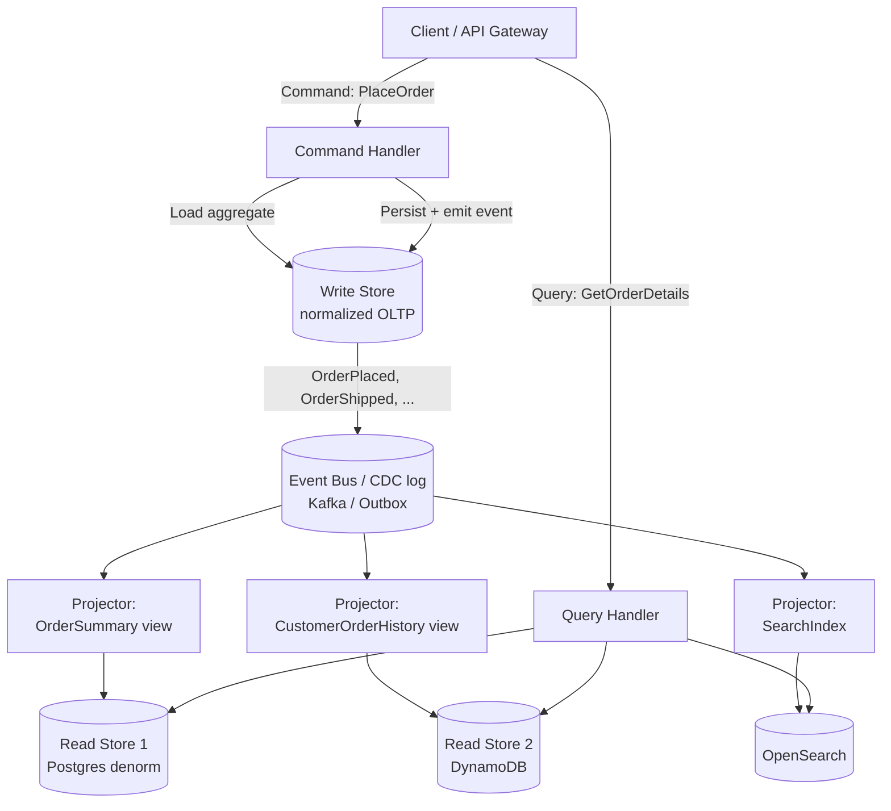
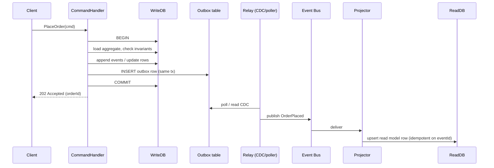
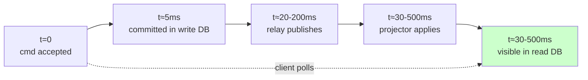

# CQRS — Command Query Responsibility Segregation

## Why This Exists

**Problem.** A single data model is asked to do two incompatible jobs. The **write side** wants normalized, transactional, invariant-protecting structures (3NF tables, aggregates with consistency boundaries). The **read side** wants denormalized, query-optimized, sometimes search-shaped or graph-shaped projections. Forcing both through one schema produces a model that is mediocre at both: writes carry redundant fields the read side wants pre-joined, reads carry expensive joins the write side has to maintain transactionally, and every new query shape (search, analytics, geo, recommendations) bolts more tension onto the same trunk.

**Key insight.** *The questions you ask are not symmetric with the changes you make.* Greg Young's reframing of Bertrand Meyer's command-query separation says: at the **architectural** level, model commands (state-changing intents) and queries (read projections) as **separate components with separate data models**, possibly separate stores, communicating via events or replication. The write model enforces invariants. The read model serves whatever shape the UI/API needs. They diverge — on purpose.

**Reach for this when:**
- One aggregate is queried in 5+ wildly different shapes (list view, detail view, search, audit log, analytics).
- Read load is 100–10,000× write load and growing (typical e-commerce, social, dashboards).
- The transactional schema can't satisfy a UX requirement without monstrous joins or N+1 fan-out.
- You already do event sourcing, or you already publish domain events — you've paid the upfront cost; CQRS is the natural payoff.
- Reporting/search/ML feature stores keep getting bolted onto the OLTP DB and are slowing it down.
- The team has multiple bounded contexts where the same "customer" or "order" needs different read shapes per context.

**Don't reach for this when:**
- The app is CRUD with a handful of well-known queries. A view, a materialized view, or a read replica solves it for 1% of the cost.
- You haven't measured. "We *might* need to scale reads" is not a reason — it's premature optimization with a 5x team-cost multiplier.
- The team is junior or distributed and can't reason about **eventual consistency**. CQRS will produce ghost bugs (user updates record, immediately reloads, sees stale data, files a P1) that destroy trust.
- You think CQRS = event sourcing. It doesn't. Conflating them and adopting both at once is the #1 failure mode (see Pitfalls).
- "Read your writes" is a hard requirement on every screen with no budget for client-side reconciliation.
- You can solve it with a materialized view, a read replica, or a denormalized cache. Try those first.

## Diagrams

### Classic two-store CQRS



### Command path (write side, with outbox to avoid dual-write)



### Read freshness window — what "eventual consistency" actually means



## Core Patterns

The rest of this skill walks through the realistic shapes of a CQRS system: command handler, write store + outbox, projector, idempotent read model upsert, and a query handler. We use Python + Postgres + Kafka because that combination shows the moving parts clearly; the patterns translate directly to Java/Spring, .NET, Go, TypeScript.

### 1. The write side: aggregate + outbox in one transaction

The single most important rule of CQRS-without-2PC: **write the domain change and the event-to-publish in the same database transaction**. Otherwise you get the dual-write problem (DB committed, broker didn't, or vice versa) and your read model silently drifts.

```python
# write_side/order_command_handler.py
from dataclasses import dataclass
from uuid import UUID, uuid4
from datetime import datetime, timezone
import json
import psycopg

@dataclass
class PlaceOrder:
    order_id: UUID
    customer_id: UUID
    items: list[dict]   # [{sku, qty, unit_price_cents}]
    idempotency_key: str

class OrderCommandHandler:
    def __init__(self, conn_str: str):
        self.conn_str = conn_str

    def handle(self, cmd: PlaceOrder) -> None:
        # Load aggregate, check invariants, persist state change AND outbox row
        # in ONE transaction. This is the linchpin of reliable CQRS.
        with psycopg.connect(self.conn_str, autocommit=False) as conn:
            with conn.cursor() as cur:
                # Idempotency: reject duplicates from retried clients.
                cur.execute(
                    "SELECT 1 FROM processed_commands WHERE idempotency_key = %s",
                    (cmd.idempotency_key,),
                )
                if cur.fetchone():
                    return  # already processed — safe no-op

                # Load aggregate (here: just check customer + compute total).
                cur.execute(
                    "SELECT status FROM customers WHERE id = %s FOR UPDATE",
                    (cmd.customer_id,),
                )
                row = cur.fetchone()
                if not row or row[0] != "active":
                    raise ValueError("customer not active")

                total_cents = sum(i["qty"] * i["unit_price_cents"] for i in cmd.items)
                if total_cents <= 0:
                    raise ValueError("empty order")

                # Persist write-model row.
                cur.execute(
                    """INSERT INTO orders (id, customer_id, total_cents, status, created_at)
                       VALUES (%s, %s, %s, 'placed', %s)""",
                    (cmd.order_id, cmd.customer_id, total_cents, datetime.now(timezone.utc)),
                )
                for item in cmd.items:
                    cur.execute(
                        """INSERT INTO order_items (order_id, sku, qty, unit_price_cents)
                           VALUES (%s, %s, %s, %s)""",
                        (cmd.order_id, item["sku"], item["qty"], item["unit_price_cents"]),
                    )

                # Outbox: SAME TRANSACTION as the state change.
                event = {
                    "eventId": str(uuid4()),
                    "eventType": "OrderPlaced",
                    "aggregateId": str(cmd.order_id),
                    "aggregateType": "Order",
                    "occurredAt": datetime.now(timezone.utc).isoformat(),
                    "version": 1,
                    "payload": {
                        "orderId": str(cmd.order_id),
                        "customerId": str(cmd.customer_id),
                        "items": cmd.items,
                        "totalCents": total_cents,
                    },
                }
                cur.execute(
                    """INSERT INTO outbox (event_id, aggregate_id, event_type, payload, created_at)
                       VALUES (%s, %s, %s, %s::jsonb, %s)""",
                    (event["eventId"], cmd.order_id, event["eventType"],
                     json.dumps(event), datetime.now(timezone.utc)),
                )

                cur.execute(
                    "INSERT INTO processed_commands (idempotency_key, processed_at) VALUES (%s, %s)",
                    (cmd.idempotency_key, datetime.now(timezone.utc)),
                )
            conn.commit()
```

The schema this assumes:

```sql
-- WRITE-SIDE schema (normalized, invariant-protecting)
CREATE TABLE customers (
    id UUID PRIMARY KEY,
    status TEXT NOT NULL CHECK (status IN ('active','suspended','closed'))
);

CREATE TABLE orders (
    id UUID PRIMARY KEY,
    customer_id UUID NOT NULL REFERENCES customers(id),
    total_cents BIGINT NOT NULL CHECK (total_cents > 0),
    status TEXT NOT NULL,
    created_at TIMESTAMPTZ NOT NULL
);

CREATE TABLE order_items (
    order_id UUID NOT NULL REFERENCES orders(id),
    sku TEXT NOT NULL,
    qty INT NOT NULL CHECK (qty > 0),
    unit_price_cents BIGINT NOT NULL,
    PRIMARY KEY (order_id, sku)
);

-- Outbox: the bridge from DB-tx to broker
CREATE TABLE outbox (
    event_id UUID PRIMARY KEY,
    aggregate_id UUID NOT NULL,
    event_type TEXT NOT NULL,
    payload JSONB NOT NULL,
    created_at TIMESTAMPTZ NOT NULL,
    published_at TIMESTAMPTZ                -- NULL = not yet sent
);
CREATE INDEX outbox_unpublished_idx ON outbox (created_at) WHERE published_at IS NULL;

-- Idempotency
CREATE TABLE processed_commands (
    idempotency_key TEXT PRIMARY KEY,
    processed_at TIMESTAMPTZ NOT NULL
);
```

### 2. The relay: outbox → bus (or use Debezium / CDC and skip writing your own)

In production prefer **Debezium + Kafka Connect** reading the WAL — it gives you exactly-once semantics relative to the DB transaction, doesn't compete with your app for connections, and survives app crashes. Roll-your-own only if you don't have a Kafka platform yet.

```python
# relay/outbox_relay.py — minimal poller, illustrative; prefer Debezium in prod.
import json, time
import psycopg
from kafka import KafkaProducer

class OutboxRelay:
    def __init__(self, conn_str: str, producer: KafkaProducer, topic: str):
        self.conn_str = conn_str
        self.producer = producer
        self.topic = topic

    def run_once(self, batch: int = 100) -> int:
        with psycopg.connect(self.conn_str, autocommit=False) as conn, conn.cursor() as cur:
            # Lock rows so multiple relay instances don't double-publish.
            cur.execute(
                """SELECT event_id, aggregate_id, event_type, payload
                     FROM outbox
                    WHERE published_at IS NULL
                    ORDER BY created_at
                    LIMIT %s
                    FOR UPDATE SKIP LOCKED""",
                (batch,),
            )
            rows = cur.fetchall()
            for event_id, agg_id, event_type, payload in rows:
                # Key by aggregate_id so per-aggregate ordering is preserved
                # within a Kafka partition. THIS MATTERS for projections that
                # apply ordered events (e.g. OrderShipped after OrderPlaced).
                self.producer.send(
                    self.topic,
                    key=str(agg_id).encode(),
                    value=json.dumps(payload).encode(),
                ).get(timeout=10)
                cur.execute(
                    "UPDATE outbox SET published_at = now() WHERE event_id = %s",
                    (event_id,),
                )
            conn.commit()
            return len(rows)

    def run_forever(self):
        while True:
            n = self.run_once()
            if n == 0:
                time.sleep(0.5)
```

### 3. The projector: idempotent, ordered read-model upsert

The projector is where the **denormalization** happens. The read store is shaped like the query, not like the domain.

```python
# read_side/order_summary_projector.py
import json
import psycopg
from kafka import KafkaConsumer

class OrderSummaryProjector:
    """
    Read model: order_summary — denormalized for the order-detail page.
    One row per order, joined with customer name, item count, total.
    """

    def __init__(self, conn_str: str, consumer: KafkaConsumer):
        self.conn_str = conn_str
        self.consumer = consumer

    def run(self):
        for msg in self.consumer:
            event = json.loads(msg.value)
            self._apply(event)
            # Commit Kafka offset only after DB write succeeds.
            self.consumer.commit()

    def _apply(self, event: dict) -> None:
        et = event["eventType"]
        with psycopg.connect(self.conn_str, autocommit=False) as conn, conn.cursor() as cur:
            # Idempotency: refuse to re-apply an event we've already seen.
            # Required because: (1) at-least-once delivery from Kafka,
            # (2) projector restarts, (3) consumer rebalance redelivery.
            cur.execute(
                "SELECT 1 FROM applied_events WHERE event_id = %s",
                (event["eventId"],),
            )
            if cur.fetchone():
                conn.commit()
                return

            if et == "OrderPlaced":
                p = event["payload"]
                cur.execute(
                    """INSERT INTO order_summary
                          (order_id, customer_id, customer_name, status,
                           item_count, total_cents, placed_at, last_event_version)
                       VALUES (%s, %s,
                               (SELECT name FROM customer_cache WHERE id = %s),
                               'placed', %s, %s, %s, %s)
                       ON CONFLICT (order_id) DO UPDATE SET
                           status = EXCLUDED.status,
                           item_count = EXCLUDED.item_count,
                           total_cents = EXCLUDED.total_cents,
                           last_event_version = EXCLUDED.last_event_version
                       WHERE order_summary.last_event_version < EXCLUDED.last_event_version""",
                    (p["orderId"], p["customerId"], p["customerId"],
                     len(p["items"]), p["totalCents"],
                     event["occurredAt"], event["version"]),
                )

            elif et == "OrderShipped":
                p = event["payload"]
                # Guard against out-of-order delivery.
                cur.execute(
                    """UPDATE order_summary
                          SET status = 'shipped',
                              shipped_at = %s,
                              last_event_version = %s
                        WHERE order_id = %s
                          AND last_event_version < %s""",
                    (event["occurredAt"], event["version"],
                     p["orderId"], event["version"]),
                )

            # Record the event so we never apply it twice.
            cur.execute(
                "INSERT INTO applied_events (event_id, applied_at) VALUES (%s, now())",
                (event["eventId"],),
            )
            conn.commit()
```

```sql
-- READ-SIDE schema (denormalized, query-shaped)
CREATE TABLE order_summary (
    order_id UUID PRIMARY KEY,
    customer_id UUID NOT NULL,
    customer_name TEXT,                       -- denormalized
    status TEXT NOT NULL,
    item_count INT NOT NULL,
    total_cents BIGINT NOT NULL,
    placed_at TIMESTAMPTZ NOT NULL,
    shipped_at TIMESTAMPTZ,
    last_event_version BIGINT NOT NULL        -- guards out-of-order updates
);
CREATE INDEX order_summary_customer_idx ON order_summary (customer_id, placed_at DESC);
CREATE INDEX order_summary_status_idx ON order_summary (status, placed_at DESC);

CREATE TABLE applied_events (
    event_id UUID PRIMARY KEY,
    applied_at TIMESTAMPTZ NOT NULL
);
```

### 4. The query side — thin, dumb, fast

Query handlers do **no** domain logic. They read the projection and shape the response. This is what makes them cheap to scale horizontally.

```python
# read_side/order_query_handler.py
class OrderQueryHandler:
    def __init__(self, conn_str: str):
        self.conn_str = conn_str

    def get_customer_orders(self, customer_id, limit=50):
        with psycopg.connect(self.conn_str) as conn, conn.cursor() as cur:
            cur.execute(
                """SELECT order_id, status, item_count, total_cents, placed_at, shipped_at
                     FROM order_summary
                    WHERE customer_id = %s
                    ORDER BY placed_at DESC
                    LIMIT %s""",
                (customer_id, limit),
            )
            return [dict(zip(
                ["orderId","status","itemCount","totalCents","placedAt","shippedAt"],
                r,
            )) for r in cur.fetchall()]
```

### 5. Handling the staleness UX problem (read-your-writes)

The classic CQRS bug: user submits a form, the command returns 202, the UI immediately fetches and shows **stale** data because the projection hasn't caught up. Three pragmatic options, in order of preference:

```typescript
// Option A: Optimistic UI — patch the cache locally, reconcile on next fetch.
async function placeOrder(cmd: PlaceOrder) {
  await api.placeOrder(cmd);                     // 202
  cache.optimisticInsert("order_summary", {      // pretend it's there
    orderId: cmd.orderId, status: "placed", ...
  });
  // background: refetch in 1s, 2s, 4s until the real row appears.
}

// Option B: Token-based read pinning. Command returns a "freshness token"
// (e.g. last write LSN or event sequence). Query side blocks/retries until
// its projection >= token. Trades latency for consistency.
const { orderId, freshnessToken } = await api.placeOrder(cmd);
const order = await api.getOrder(orderId, { minVersion: freshnessToken });

// Option C: Read-from-write store for the immediate "show me what I just did"
// page only. Yes, you're abandoning CQRS for that one read. That's fine.
```

## Trade-offs

| Benefit | Cost |
|---|---|
| Read and write models can evolve independently — new query shapes don't pressure the domain model | You now have **two schemas** (or N) and a pipeline between them — schema migrations are coordinated dances |
| Read side scales horizontally and cheaply (often just denormalized rows + index) | **Eventual consistency** is now part of every UX conversation; "I just clicked save and it's gone" bugs proliferate |
| Write model can stay small, normalized, invariant-focused — no read-shape contamination | You need an **outbox/CDC** pattern to avoid dual-write bugs (or you'll silently lose events) |
| Read store can be a different technology entirely (Postgres → Elasticsearch / Redis / DynamoDB) | Operating multiple stores: more backups, more on-call paths, more failure modes |
| Natural fit for **multiple bounded contexts** consuming the same events for different views | **Projection lag** under load (rebuild storms, consumer lag) is a new SLO you must alert on |
| Clear separation makes auth/audit easier — commands logged, queries cached | You need **idempotent projectors** with event-id dedup or replays will corrupt read state |
| Composes cleanly with **event sourcing** if you adopt that later | If you adopt CQRS *and* event sourcing simultaneously you've doubled the learning curve and tripled the failure modes |
| Enables **replay** — wipe a read model, rebuild from events, fix bugs retroactively | Replay is only safe if events are immutable and projector is pure; one impure side-effect ruins replay |
| Makes hot read-paths cheap (denormalized rows, no joins) | Cold/rare queries are *more* expensive — you may not have a projection for them |

## Common Pitfalls

- **Adopting CQRS = event sourcing.** They're separable. Greg Young himself has spent years trying to undo this conflation. CQRS without ES = "split the read DB from the write DB and project via events." Event sourcing = "the events *are* the system of record." You can do CQRS with classic snapshot tables in the write store and never store an event log. Start there.
- **Dual-write between DB and broker.** App commits to Postgres, then publishes to Kafka, then crashes. Read model is permanently behind. Fix: outbox table written in the same transaction, plus a CDC relay (Debezium) — or Kafka transactional producer with `read_committed` if your stack supports it.
- **Non-idempotent projectors.** Kafka delivers at-least-once. Consumer groups rebalance. Replay tools exist. If your projector does `UPDATE balance = balance + 100`, the first re-delivery doubles the balance. Always: dedup by `event_id`, or upsert with a monotonic `last_event_version` guard, or use idempotent ops only.
- **Out-of-order events across aggregates.** Within one aggregate, key the topic by `aggregateId` so events land in one partition and stay ordered. Across aggregates there is no global order — design read models that don't depend on it. If you need cross-aggregate ordering, use a single partition (and accept the throughput cap) or a sequencer service.
- **Treating the read model as authoritative.** Someone "fixes a bug" by manually updating the read store. Next replay erases their fix. Read models are **derived**. The write store / event log is the source of truth. Period.
- **Letting commands return query data.** `placeOrder()` returns the full Order DTO from the read store — but the projection hasn't run yet, so the API returns a 500 or stale data. Commands return command outcomes (id, version, accepted/rejected). Queries return data. Don't mix them.
- **Synchronous projection.** "We'll just write to both stores in the same request to avoid eventual consistency!" Now you have distributed transactions or unbounded latency, and one store down = both broken. Async projection is a feature.
- **Unbounded outbox.** Outbox grows forever, queries on `WHERE published_at IS NULL` get slow, vacuum suffers. Add a janitor that deletes published rows older than N days; partition by date if you must.
- **Skipping the staleness UX design.** Engineers add CQRS, then product files bugs about stale dashboards. Decide *up front* per screen: optimistic UI, token-pinned reads, or read-from-write fallback. Document it.
- **Rebuild storms.** Schema-changing the read model means re-running every event ever. With 2B events, that's a week. Mitigations: snapshots, shard the rebuild, run new projector in parallel and cut over (blue/green projection).
- **CQRS for a 5-engineer CRUD app.** This is the most common pitfall. The complexity tax is real: ~2x the moving parts, new on-call paths, eventual-consistency bug class, projector code duplication. If a materialized view solves it, use a materialized view. If a read replica solves it, use a read replica.
- **Forgetting the read model is a cache.** Treat it like one: it can be wrong, it can be rebuilt, it must not contain anything that isn't reproducible from events + reference data.

## Decision Table

| Situation | Use this | Not this | Why |
|---|---|---|---|
| Read load 5–10× write, simple queries | **Postgres read replica** | CQRS | Replica is free with your existing DB; no schema split; trivially consistent enough |
| One expensive aggregate query, infrequent writes | **Materialized view** (or `REFRESH CONCURRENTLY`) | CQRS | Same DB, same transaction model, no event pipeline |
| Hot read path, can tolerate seconds of staleness, simple shape | **Cache-aside (Redis) with TTL** | CQRS | Fewer moving parts; no projector to operate |
| Reads need search/full-text/geo that OLTP can't do | **CQRS, project to OpenSearch/Elastic** | Bolt-on Elastic with dual writes | CDC/outbox-driven projection avoids dual-write loss |
| Multiple bounded contexts need different views of the same data | **CQRS via domain events** | Shared DB | Each context owns its read model; coupling is just the event contract |
| Audit/compliance requires the full history of every change | **CQRS + event sourcing** | CQRS alone | Events are the audit log; replay is part of the architecture |
| Strong read-your-writes everywhere, low-latency UI | **Single-store CRUD or token-pinned CQRS** | Naive CQRS | Async projection violates read-your-writes by default |
| 5-person team, mostly CRUD, no scaling pain yet | **Stay on CRUD** | CQRS | Complexity tax > benefit; revisit when measured pain shows up |
| Reporting / BI choking the OLTP DB | **CDC → warehouse (Snowflake/BigQuery)** | CQRS into another OLTP | Warehouse is the right tool for analytical reads; CQRS for *operational* reads |
| Serverless, intermittent traffic, simple domain | **Single DynamoDB table with GSIs** | CQRS | DynamoDB single-table design is "CQRS-lite" via GSIs without the pipeline |
| Need to scale writes too, not just reads | **Sharding / partitioning the write side** | CQRS alone | CQRS scales reads, not writes; combine with sharding if writes are the bottleneck |

## References

- Greg Young — *CQRS Documents (canonical)* — https://cqrs.files.wordpress.com/2010/11/cqrs_documents.pdf
- Greg Young — *CQRS, Task Based UIs, Event Sourcing agh!* (the "stop conflating them" post) — https://web.archive.org/web/20190211113420/https://goodenoughsoftware.net/2012/02/02/cqrs-task-based-uis-event-sourcing-agh/
- Udi Dahan — *Clarified CQRS* — https://udidahan.com/2009/12/09/clarified-cqrs/
- Udi Dahan — *When to avoid CQRS* — https://udidahan.com/2011/04/22/when-to-avoid-cqrs/
- Martin Fowler — *CQRS* — https://martinfowler.com/bliki/CQRS.html
- Martin Fowler — *Event Sourcing* — https://martinfowler.com/eaaDev/EventSourcing.html
- Microsoft Architecture Center — *CQRS pattern* — https://learn.microsoft.com/en-us/azure/architecture/patterns/cqrs
- Microsoft Architecture Center — *Transactional Outbox pattern* — https://learn.microsoft.com/en-us/azure/architecture/patterns/transactional-outbox
- Chris Richardson — *Pattern: Transactional outbox* — https://microservices.io/patterns/data/transactional-outbox.html
- Chris Richardson — *Pattern: Command Query Responsibility Segregation* — https://microservices.io/patterns/data/cqrs.html
- Debezium — *Outbox event router* — https://debezium.io/documentation/reference/stable/transformations/outbox-event-router.html
- Kleppmann — *Designing Data-Intensive Applications*, ch. 11 (Stream Processing — "Databases and Streams") and ch. 12 (The Future of Data Systems — "Unbundling Databases"). The unbundling argument is the strongest theoretical case for CQRS.
- Kleppmann — *Turning the database inside-out with Apache Samza* — https://www.confluent.io/blog/turning-the-database-inside-out-with-apache-samza/
- Pat Helland — *Immutability Changes Everything* — https://queue.acm.org/detail.cfm?id=2884038
- Pat Helland — *Life Beyond Distributed Transactions* — https://queue.acm.org/detail.cfm?id=3025012
- AWS Builders' Library — *Challenges with distributed systems* — https://aws.amazon.com/builders-library/challenges-with-distributed-systems/
- AWS Prescriptive Guidance — *CQRS pattern* — https://docs.aws.amazon.com/prescriptive-guidance/latest/modernization-data-persistence/cqrs-pattern.html
- Confluent — *The Outbox Pattern* — https://www.confluent.io/blog/microservices-distributed-data-outbox-event-driven-architecture/
- Vaughn Vernon — *Implementing Domain-Driven Design* (CQRS chapter) — book, no canonical free URL.
- Google SRE Book, ch. 23 (Managing Critical State) — https://sre.google/sre-book/managing-critical-state/ — relevant for write-side consistency choices that CQRS amplifies.

## See Also

- `../event-sourcing/` — the natural complement; CQRS is much easier when events are first-class.
- `../event-driven/` — the broader umbrella; CQRS is a specific shape inside it.
- `../saga/` — for cross-aggregate workflows when the write side needs to coordinate.
- `../microservices/` — bounded contexts as the unit of CQRS deployment.
- `../hexagonal/` — clean separation of command/query ports.
- `../../data-systems/outbox/` — the bridge between write store and event bus.
- `../../data-systems/cdc/` — Debezium-style alternative to a hand-rolled relay.
- `../../data-systems/materialized-views/` — try this *first*; CQRS is materialized views taken to architectural extreme.
- `../../data-systems/consistency-models/` — the consistency model you've signed up for.
- `../../communication/idempotency/` — projectors and command handlers must be idempotent.
- `../../data-systems/replication/` — the cheaper, simpler alternative for read-scale-only problems.
- `../../performance/caching/` — another lower-cost alternative for hot reads.
- `../../communication/kafka-patterns/` — partitioning, ordering, consumer groups for the event bus.
- `../../code-design/ddd/` — DDD aggregates are the unit the write side enforces.
