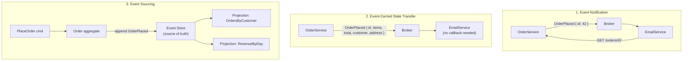
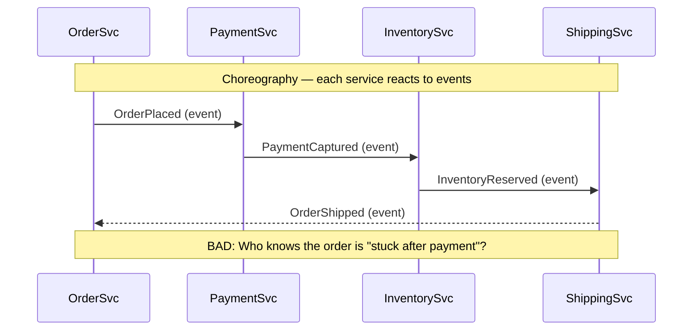
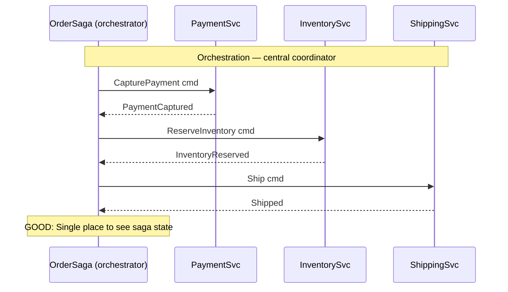
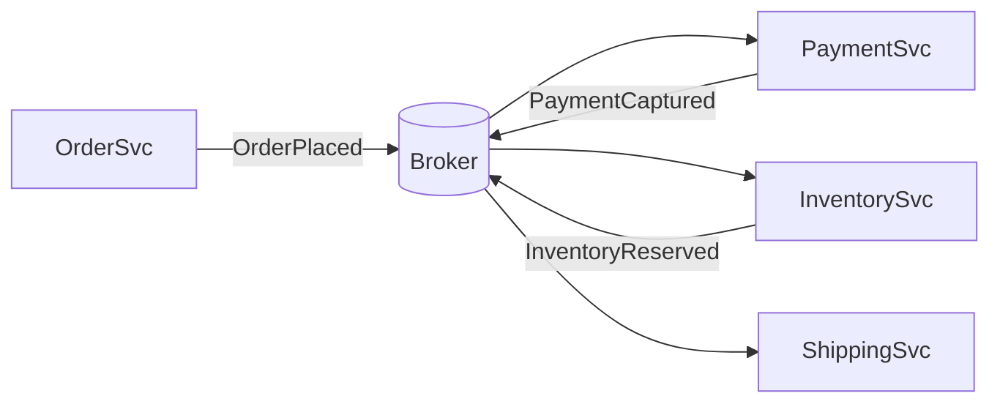
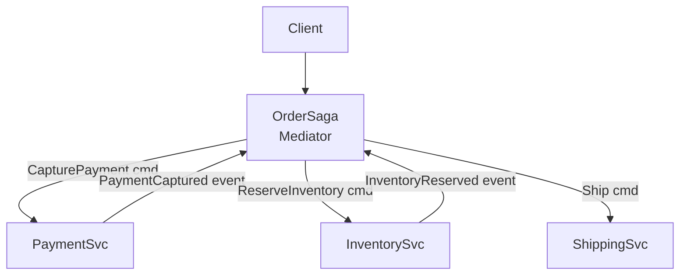

# Event-Driven Architecture

## Why This Exists

**Problem.** Synchronous request/response coupling makes systems brittle: a slow downstream service blocks the caller, a downed downstream service brings the caller down with it, and adding a new consumer to an existing flow requires modifying the producer. Worse, the producer must *know* every consumer — a coupling that calcifies as the system grows.

**Key insight.** An event is an immutable fact about something that has already happened ("OrderPlaced", "PaymentCaptured", "InventoryReserved"). Once you commit to representing state changes as events, producers stop caring who consumes them, consumers can fan out arbitrarily, and the broker absorbs temporal mismatches. You decouple in **time** (consumer can be down when event is produced), **identity** (producer doesn't know consumers), and **paradigm** (consumers can be batch jobs, stream processors, or other services).

**The tax.** You give up linearizable reads-your-writes. You inherit eventual consistency, ordering pitfalls, exactly-once mythology, and a debugging story that requires distributed tracing or you will hate your life. You also gain a new failure mode that synchronous systems literally cannot have: **silent divergence** — two services processing the same events arriving at different state because of bugs that no integration test caught.

**Reach for this when:**
- Multiple consumers need to react to the same state change and the set of consumers changes over time.
- Producer and consumer have different availability/scale profiles (web tier publishes, batch tier consumes overnight).
- You need an audit log of what happened, not just the current state.
- Workloads are bursty and you want a buffer (broker absorbs the spike).
- You're integrating heterogeneous systems where synchronous coupling would create distributed monoliths.

**Don't reach for this when:**
- You need an immediate yes/no answer (auth check, fraud decision, payment authorization). Use RPC.
- Strong consistency across services is a hard requirement (use a single transactional boundary or distributed transaction with serious operator buy-in).
- The downstream effect must be visible to the user *on this request* (request-scoped reads of just-written data).
- Two services. Maybe three. Adding Kafka for "future-proofing" a 3-service system is cargo-cult architecture.

## Diagrams

### The three event types



### Choreography vs orchestration





## The three event types — choose deliberately

This is the most important decision you'll make in EDA, and most teams blur the lines. Martin Fowler's [What do you mean by Event-Driven?](https://martinfowler.com/articles/201701-event-driven.html) distinguishes them precisely.

### 1. Event Notification

The event is a **doorbell** — "something happened, go look it up if you care."

```python
# Producer
broker.publish("orders.placed", {"order_id": 42, "occurred_at": "2026-06-05T10:00:00Z"})

# Consumer
def on_order_placed(evt):
    order = order_service.get(evt["order_id"])  # ← callback to producer
    send_confirmation_email(order.customer_email, order.items)
```

- **Pro:** Tiny payloads. Schema barely matters.
- **Con:** Consumer must call back to producer — temporal coupling sneaks back in. If `OrderService` is down when the email worker processes the notification, you've recreated the very problem you were avoiding.
- **Use when:** Notification is rare or consumers genuinely need fresh data each time (e.g., "PriceChanged" → re-fetch).

### 2. Event-Carried State Transfer (ECST)

The event carries **enough state** that the consumer can act without calling back.

```json
{
  "type": "OrderPlaced.v3",
  "order_id": 42,
  "occurred_at": "2026-06-05T10:00:00Z",
  "customer": { "id": 99, "email": "a@b.com", "name": "Alice" },
  "items": [{"sku": "A1", "qty": 2, "price_cents": 1500}],
  "shipping_address": { "...": "..." },
  "total_cents": 3000
}
```

- **Pro:** Consumer is fully decoupled. Broker outage during consumer work? Fine. Producer down? Fine. Downstream can also build local read models.
- **Con:** Schema becomes a contract. Versioning is real (see Pitfalls). Events get fat. PII spreads — every consumer has a copy of the customer email.
- **Use when:** Consumers need to act offline, or you want to flatten a producer's read load, or you're crossing a high-latency boundary (region, partner integration).

### 3. Event Sourcing

The event log **is the source of truth**. Current state is a fold over the event history.

```python
class Order:
    def __init__(self):
        self.id = None
        self.status = "new"
        self.items = []
        self.version = 0

    def apply(self, evt):
        # Pure function: (state, event) -> state
        if evt.type == "OrderPlaced":
            self.id = evt.order_id
            self.items = evt.items
            self.status = "placed"
        elif evt.type == "PaymentCaptured":
            self.status = "paid"
        elif evt.type == "OrderCancelled":
            self.status = "cancelled"
        self.version += 1
        return self

    @classmethod
    def from_history(cls, events):
        order = cls()
        for e in events:
            order.apply(e)
        return order

# Loading state
events = event_store.read_stream(f"order-{order_id}")
order = Order.from_history(events)

# Mutating state — never overwrites; always appends
new_events = order.handle(CancelOrderCmd(reason="customer request"))
event_store.append(f"order-{order_id}", new_events,
                   expected_version=order.version)  # optimistic concurrency
```

- **Pro:** Perfect audit log. Time travel ("what did the order look like at 14:32?"). Easy to add new projections after the fact (replay history into a new read model).
- **Con:** **Significant** complexity. Schema migration of historical events is a known unsolved problem — you either upcast on read, version event types, or live with old shapes forever. Snapshotting required for long-lived aggregates. CQRS usually comes along for the ride.
- **Use when:** Audit/compliance is a first-class requirement (financial systems, healthcare), or temporal queries are central to the domain, or you genuinely need to derive multiple read models from the same writes.
- **Don't use when:** You're applying it as a default. Greg Young, who literally invented the term, has spent a decade telling people not to use it for everything. Cf. [Greg Young — A Decade of DDD, CQRS, Event Sourcing](https://www.youtube.com/watch?v=LDW0QWie21s).

## Mark Richards' two EDA topologies

From *Software Architecture Patterns* (Mark Richards, O'Reilly) — every EDA falls into one of these or a hybrid.

### Broker topology (choreography)

No central coordinator. Events flow service-to-service. Each service knows only its inputs and outputs.



- **Pro:** Maximum decoupling. Easy to add a new consumer. Fast and cheap.
- **Con:** No global view of workflow state. Error handling is scattered. "Where is order 42 stuck?" requires correlating logs across N services.

### Mediator topology (orchestration)

A central component (often called *process manager* or *saga orchestrator*) holds workflow state and dispatches commands.



- **Pro:** Workflow state is observable in one place. Compensating actions (saga rollback) are explicit. Easier to reason about and modify business rules.
- **Con:** Mediator is a new failure domain. Risks becoming a "smart pipe / dumb endpoint" anti-pattern (Sam Newman: ESB redux). Mediator can become a bottleneck.

**Rule of thumb:** Use **broker** topology for simple flows where each step is genuinely independent. Use **mediator** topology when the workflow has compensating actions, conditional branches, or business stakeholders need to ask "why didn't order 42 ship?" without reading code.

## Brokers — Kafka vs RabbitMQ vs SNS/SQS

| Property | Kafka | RabbitMQ | SNS+SQS |
|---|---|---|---|
| Model | Distributed log | Smart broker, dumb consumer | Pub/sub fanout + queues |
| Ordering | Per-partition | Per-queue | FIFO queues only |
| Retention | Configurable (days→forever) | Until acked | Up to 14 days (SQS) |
| Replay | Yes — reset offset | No (once acked, gone) | Limited (DLQ + redrive) |
| Throughput ceiling | Very high (M msgs/sec) | High (100K/sec/queue ish) | High, scales transparently |
| Operational burden | High (ZK or KRaft, partitions, ISRs) | Medium | Zero (managed) |
| Killer feature | Replayable log, multi-consumer | Routing flexibility, per-msg ack | "It just works" if on AWS |
| Failure mode it hides | Slow consumer? Lag silently grows. | Queue depth grows; alarms exist. | DLQ fills; you must monitor. |

**Pick Kafka when:** the log is the integration backbone, multiple independent consumer groups read the same data, or you need replay (rebuild a read model, recover from a bug that ate state).

**Pick RabbitMQ when:** you need rich routing (topic exchanges, headers, work queues with priority), per-message acknowledgement, or you're not at "log scale."

**Pick SNS+SQS when:** you're on AWS, your scale is moderate, and you want to delete a checkbox from your operational worry list. SQS FIFO if ordering matters; standard SQS otherwise (and design idempotent consumers).

## Eventual consistency — debugging the bug class you can't unit-test

The signature symptom: **a user took an action and immediately checked the result, and saw stale data.** This is not a bug; it is the contract of EDA. But you must design around it.

### Patterns that help

```python
# 1. Read-your-own-writes via session pinning
# After write, route this user's reads to the primary for N seconds.
session.write_token = primary.write(...)
# Subsequent reads include the token; replicas check & fall back to primary if behind.

# 2. Causal token / version vector
# Producer attaches monotonic version; consumer waits or rejects if too far behind.
event = {"order_id": 42, "version": 17, ...}
if local_view.version_for(42) < event.version:
    refresh_or_wait()

# 3. Polling with deadline
def wait_for_eventual(predicate, timeout_s=5, interval_ms=100):
    deadline = time.time() + timeout_s
    while time.time() < deadline:
        if predicate():
            return True
        time.sleep(interval_ms / 1000)
    return False

# 4. Outbox pattern — atomic commit of state + event
with db.transaction():
    db.execute("UPDATE orders SET status='paid' WHERE id=%s", (oid,))
    db.execute("INSERT INTO outbox(topic, payload) VALUES (%s, %s)",
               ("orders.paid", json.dumps(payload)))
# Separate poller drains outbox → broker. Survives broker outage.
```

### The outbox pattern is non-negotiable

If you publish to the broker *and* write to your DB without using the outbox, you have a dual-write problem. The two writes are not atomic. Possible failures:

1. DB commits, broker publish fails → silent data loss to consumers.
2. Broker publishes, DB rolls back → consumers see an event for state that doesn't exist.

The **outbox pattern** writes the event to a DB table in the same transaction as the state change, then a separate process tails the outbox and publishes to the broker. This is well-documented in [Microservices.io — Transactional Outbox](https://microservices.io/patterns/data/transactional-outbox.html).

## When EDA hides bugs that direct calls would surface

This is the section nobody writes and everyone learns the hard way.

### The silent divergence bug

`OrderSvc` publishes `OrderPlaced`. `BillingSvc` and `LoyaltySvc` both consume. A bug in `LoyaltySvc` causes it to silently skip orders where `total_cents == 0`. With synchronous calls, `OrderSvc` would have gotten an HTTP 500 and surfaced the bug immediately. With async events, **the order completes, the user is happy, and loyalty points are missing.** You won't notice until a customer complains weeks later.

**Mitigation:** consumer-side dead-letter queues with alarms on DLQ depth. Aggregate metrics that should match across consumers (e.g., "orders processed by Billing" should equal "orders processed by Loyalty" within tolerance). If they drift, page someone.

### The retry storm

Consumer fails to process event → broker redelivers → consumer fails again → infinite loop. Worse, if the consumer is partially succeeding (e.g., calls a downstream API which *did* succeed but the response was lost), you get **duplicate charges, duplicate emails, duplicate inventory deductions.**

**Mitigation:**

```python
def handle(evt):
    # Idempotency key — derived from event, not generated locally
    key = f"{evt.type}:{evt.id}"
    if processed_set.contains(key):
        return ack()  # already done, just ack
    with db.transaction():
        do_work(evt)
        processed_set.add(key)  # same txn as the work
    ack()
```

Idempotency must be enforced *inside the same transaction as the side effect*, otherwise you have an outbox-shaped dual-write again.

### The "events processed out of order" bug

Kafka guarantees order **within a partition**, not across partitions. If you partition by `order_id` but consume `OrderPlaced` and `OrderCancelled` from different topics with different partition counts, you can see Cancelled before Placed.

**Mitigation:** co-partition related streams on the same key, or design events to be **commutative** (apply in any order and converge to the same state — easier said than done), or use the event's `version` field and reject out-of-order events at the consumer.

### The schema-evolution graveyard

You ship `OrderPlaced v1`. Three months later you add a `discount_code` field. A consumer was deployed before the field existed and crashes on the new payload because its parser is strict.

**Mitigation:** schema registry (Confluent, Apicurio) with explicit compatibility rules (BACKWARD = new producer + old consumer works; FORWARD = old producer + new consumer works; FULL = both). For Avro/Protobuf, define your evolution rules and *test them*. JSON-only shops: at minimum, version events (`OrderPlaced.v1`, `OrderPlaced.v2`) and never change a v1 once published.

## Trade-offs

| Benefit | Cost |
|---|---|
| Temporal decoupling — consumer can be down without affecting producer | Eventual consistency surface area; "read your write" becomes a project |
| Identity decoupling — add new consumers without touching producer | Schema becomes a public contract; versioning is forever |
| Natural buffering against bursty load | Backpressure / consumer lag becomes the new performance bottleneck |
| Audit log built in (especially with event sourcing) | Storage and replay cost; replay-during-incident is its own war story |
| Massive horizontal scale (Kafka partitions, SQS shards) | Per-partition ordering ≠ global ordering; co-partitioning required |
| Failure isolation — one bad consumer doesn't crash the producer | Failures hide; require explicit DLQ + monitoring + reconciliation jobs |
| Easy to plug in stream processing (Flink, Kafka Streams) | Operational burden of broker (Kafka especially) is real |

## Common Pitfalls

- **Dual writes without an outbox.** Writing to DB and broker without atomicity. The number-one EDA bug. Use [transactional outbox](https://microservices.io/patterns/data/transactional-outbox.html) or change-data-capture (Debezium).
- **Treating events as commands.** "OrderPlacedEvent" is a fact. "PlaceOrderCommand" is a request. Naming matters: events are past tense, commands are imperative. Mixing them creates implicit RPC over a broker — worst of both worlds.
- **Anemic events.** Publishing `{"order_id": 42}` and expecting consumers to call back. Then the producer becomes a hot read endpoint. Either commit to ECST or accept the coupling.
- **Fat events.** Embedding the entire customer record because "consumers might need it." Now PII propagates everywhere, GDPR right-to-be-forgotten is a nightmare, and you ship 4 KB events at 100K/sec because you wanted to save a callback.
- **Missing idempotency.** "At-least-once" delivery is the norm. Every consumer must handle replays. Idempotency key inside the same transaction as the side effect, or you have a duplicate-charge bug waiting.
- **No DLQ, no alarms.** Failed messages silently retry forever or get dropped. You learn about it from a customer complaint two weeks later.
- **Partition-key picked once and forgotten.** You partition by `customer_id` but later need ordering by `order_id`. Re-partitioning a live Kafka topic is a multi-day project.
- **Choreography for complex sagas.** Five services choreographing a 12-step workflow with three compensating actions. No one knows what's stuck. Switch to orchestration when the flow has more than two conditional branches.
- **Replay without idempotency review.** "Let's replay last week's events into the new consumer." If consumers aren't idempotent, you've just sent every customer 7 duplicate emails.
- **Treating EDA as a synchronous RPC replacement.** Publishing `RequestQuoteEvent` and waiting for `QuoteReadyEvent` with a 50ms SLA. Just call the API. EDA is for when you don't need synchronous response.
- **Schema lock-in.** Skipping the schema registry "for now." Six months later, you have 14 consumers with subtly different parsers, and you can't change the schema without a 3-week migration project.
- **Ordering assumptions across topics.** `PaymentCaptured` from topic A and `OrderShipped` from topic B — you cannot assume one comes before the other unless you co-partition or version explicitly.

## Decision Table

| Situation | Choice | Why |
|---|---|---|
| Need synchronous response (auth, fraud check) | RPC, not events | Caller blocks anyway; events add latency + complexity for nothing |
| Multiple consumers, same data, varying SLAs | Event notification or ECST | Decoupling pays off proportional to N consumers |
| Audit/compliance is a hard requirement | Event sourcing | Log *is* the source of truth; auditor reviews the log |
| Just want to "future-proof" with Kafka | Don't | YAGNI. Postgres LISTEN/NOTIFY or a queue solves 80% until you actually scale |
| 2-3 services, simple flow | Direct calls + retries | Broker is overkill; troubleshooting is harder |
| 5+ services, complex flow with compensation | EDA + orchestrator | Choreography breaks down; saga state must be observable |
| Heterogeneous integration (legacy + new) | EDA with broker | Broker is the integration seam; protocol translators at edges |
| Same team, same codebase, in-process events | Domain events / mediator pattern | Don't introduce a network for in-process pub/sub |
| Need replay for analytics or recovery | Kafka (or Pulsar, Kinesis) | Queue-based brokers can't replay |
| Routing logic depends on message content | RabbitMQ topic/headers exchange | Kafka has no per-message routing primitive |
| On AWS, moderate scale, want managed | SNS+SQS or EventBridge | Lowest operational burden; sufficient for most apps |
| Workflow has loops, conditionals, human approval | Workflow engine (Temporal, Step Functions) | Orchestrator with durability + retries is the right abstraction |
| ECST event > 1 MB | Reconsider | Either notification + lookup, or break the aggregate |
| Strong consistency across services required | Don't use EDA naively | Single transactional boundary, or 2PC, or accept saga compensations |

## References

- Martin Fowler — *What do you mean by "Event-Driven"?* — https://martinfowler.com/articles/201701-event-driven.html
- Martin Fowler — *Event Sourcing* — https://martinfowler.com/eaaDev/EventSourcing.html
- Mark Richards — *Software Architecture Patterns* (O'Reilly, 2nd ed.) — https://www.oreilly.com/library/view/software-architecture-patterns/9781098134280/
- Sam Newman — *Building Microservices* (O'Reilly, 2nd ed.) — ch. 4 (Communication Styles), ch. 6 (Workflow / Sagas)
- Kleppmann — *Designing Data-Intensive Applications* (O'Reilly, 2017) — ch. 11 (Stream Processing) and ch. 9 (Consistency and Consensus)
- Greg Young — *A Decade of DDD, CQRS, Event Sourcing* (talk) — https://www.youtube.com/watch?v=LDW0QWie21s
- Pat Helland — *Data on the Outside vs. Data on the Inside* — https://www.cidrdb.org/cidr2005/papers/P12.pdf
- Pat Helland — *Life Beyond Distributed Transactions* — https://queue.acm.org/detail.cfm?id=3025012
- Chris Richardson — *Microservices Patterns: Saga* — https://microservices.io/patterns/data/saga.html
- Chris Richardson — *Transactional Outbox* — https://microservices.io/patterns/data/transactional-outbox.html
- Confluent — *Kafka Documentation* — https://kafka.apache.org/documentation/
- Confluent — *Schema Registry & Compatibility* — https://docs.confluent.io/platform/current/schema-registry/avro.html
- AWS Builders' Library — *Avoiding insurmountable queue backlogs* — https://aws.amazon.com/builders-library/avoiding-insurmountable-queue-backlogs/
- AWS Builders' Library — *Reliability, constant work, and a good cup of coffee* — https://aws.amazon.com/builders-library/reliability-and-constant-work/
- Google SRE Book — ch. 22 *Addressing Cascading Failures* — https://sre.google/sre-book/addressing-cascading-failures/
- Jay Kreps — *The Log: What every software engineer should know about real-time data's unifying abstraction* — https://engineering.linkedin.com/distributed-systems/log-what-every-software-engineer-should-know-about-real-time-datas-unifying
- Tyler Akidau et al. — *The Dataflow Model* (VLDB 2015) — https://research.google/pubs/pub43864/
- Dean Wampler — *Fast Data Architectures for Streaming Applications* (O'Reilly) — https://www.oreilly.com/library/view/fast-data-architectures/9781492046752/

## See Also

- `../microservices/` — service decomposition; EDA is often its communication layer
- `../cqrs/` — almost always paired with event sourcing
- `../saga/` — orchestration vs choreography for distributed transactions
- `../hexagonal/` — events as ports; brokers as adapters
- `../../data-systems/consistency-models/` — the consistency model EDA forces on you
- `../../communication/idempotency/` — non-optional for at-least-once consumers
- `../../data-systems/outbox/` — the dual-write fix
- `../../communication/kafka-patterns/` — log-based broker deep dive
- `../../communication/message-queues/` — smart-broker deep dive
- `../../data-systems/schema-evolution/` — surviving 10 years of event versions
- `../../performance/tracing/` — without this, EDA debugging is hopeless
- `../../communication/backpressure/` — managing consumer lag before it manages you
