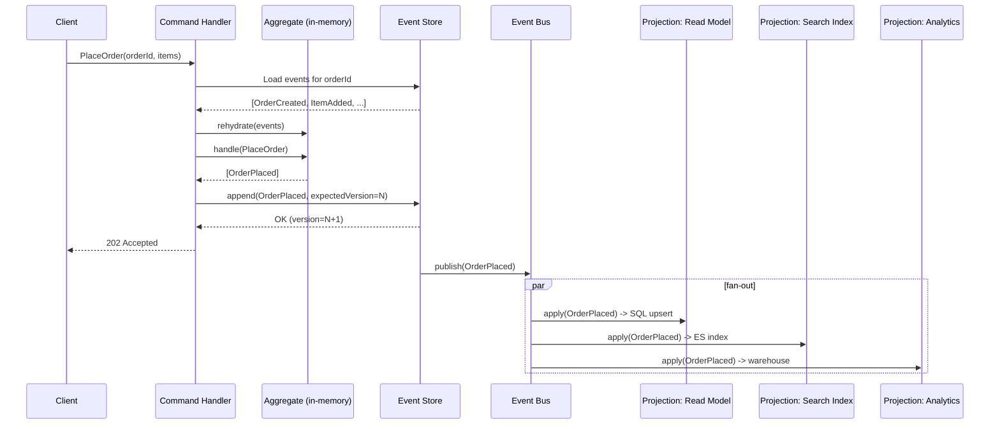
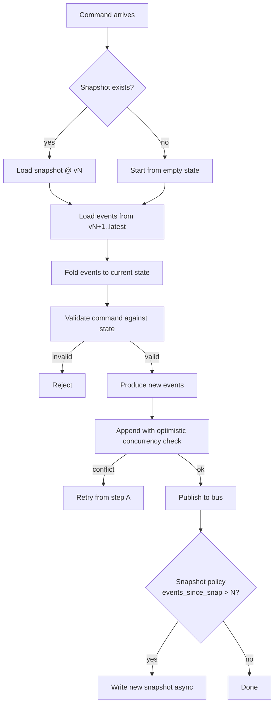

# Event Sourcing

## Why This Exists

**Problem.** Traditional CRUD persistence stores only the *current* state. Every `UPDATE` is a destructive act — the prior value is gone. When the business asks "why does this account show a $0 balance when the customer says they deposited $500 yesterday?", the database can't answer. Audit logs bolted on after the fact lie about intent (they describe what changed, not why), drift from the real schema, and get truncated by retention policies. Reconciliation becomes archaeology.

**Key insight.** The current state of any entity is a *left-fold* over the sequence of events that produced it: `state = events.reduce(apply, initialState)`. If you persist the events instead of (or in addition to) the state, you get:

- A perfect audit log **as a structural property**, not a feature you have to remember to write to.
- Time-travel: project state at any past moment by replaying up to that timestamp.
- New read models for free: replay history into a new projection (e.g. a new analytics cube, a new search index) without touching the write path.
- Corrections without lies: append a `RefundIssued` event rather than mutating `OrderStatus` from `paid` back to `unpaid`.

**Reach for this when:**

- The domain has **inherent temporality and intent** — accounting ledgers, order workflows, medical records, version control, supply-chain provenance, regulated finance.
- You need **strong audit guarantees** that survive bugs, schema migrations, and rogue ops engineers running `UPDATE` in prod.
- You need **multiple, evolving read models** of the same data (search, analytics, ML features) and CDC from a normalized DB is becoming a tar pit.
- You're already doing CQRS, or the read and write workloads have wildly different shapes.
- Compliance / forensics demand "what did the system know, when?" answers.

**Don't reach for this when:**

- The domain is **CRUD-shaped**: user profiles, configuration, content management. Storing 47 `ProfileFieldUpdated` events per user is masochism.
- There is **no audit, history, or temporal-query requirement** today and none plausibly coming. Speculative event sourcing rots into a worse RDBMS.
- The team has never built a system with **eventual consistency** between write model and read models, and the product can't tolerate stale reads even briefly.
- **GDPR / right-to-erasure** is a primary constraint and you haven't designed for crypto-shredding or event redaction (see Pitfalls).
- You'd be the first/only event-sourced service in a sea of CRUD microservices and nobody downstream knows how to consume an event stream.

If you find yourself querying the event store directly to answer business questions, you've probably mis-built the projection layer — that's a smell, not the design.

## Diagrams

### Write path: command → event → projection



### Aggregate lifecycle with snapshots



## Core implementation patterns

### 1. Event, command, aggregate (Python, idiomatic)

The aggregate is the *consistency boundary*. All invariants are enforced inside it. Events are facts in past tense; commands are intents in imperative.

```python
from __future__ import annotations
from dataclasses import dataclass, field
from datetime import datetime, timezone
from decimal import Decimal
from typing import Iterable
from uuid import UUID, uuid4

# ---------- Events: immutable facts, named in past tense ----------
@dataclass(frozen=True)
class Event:
    aggregate_id: UUID
    version: int               # monotonic per-aggregate
    occurred_at: datetime
    event_id: UUID = field(default_factory=uuid4)

@dataclass(frozen=True)
class AccountOpened(Event):
    owner: str = ""
    currency: str = "USD"

@dataclass(frozen=True)
class FundsDeposited(Event):
    amount: Decimal = Decimal(0)
    source_ref: str = ""        # bank txn id, for idempotency

@dataclass(frozen=True)
class FundsWithdrawn(Event):
    amount: Decimal = Decimal(0)
    reason: str = ""

@dataclass(frozen=True)
class AccountFrozen(Event):
    by_user: str = ""

# ---------- Commands: intents ----------
@dataclass(frozen=True)
class OpenAccount:
    aggregate_id: UUID
    owner: str
    currency: str

@dataclass(frozen=True)
class Deposit:
    aggregate_id: UUID
    amount: Decimal
    source_ref: str   # idempotency key from upstream

@dataclass(frozen=True)
class Withdraw:
    aggregate_id: UUID
    amount: Decimal
    reason: str

# ---------- Aggregate ----------
class Account:
    """
    Pure aggregate: no I/O. Commands -> events. Events mutate in-memory state.
    Invariant: balance >= 0 and not frozen for withdrawals.
    """
    def __init__(self, aggregate_id: UUID):
        self.id = aggregate_id
        self.version = 0
        self.balance = Decimal(0)
        self.currency: str | None = None
        self.frozen = False
        self.opened = False
        self._seen_sources: set[str] = set()  # for in-aggregate idempotency

    @classmethod
    def rehydrate(cls, aggregate_id: UUID, history: Iterable[Event]) -> "Account":
        agg = cls(aggregate_id)
        for e in history:
            agg._apply(e)
        return agg

    # ----- command handlers: validate then emit -----
    def open(self, cmd: OpenAccount) -> list[Event]:
        if self.opened:
            raise ValueError("already opened")
        return [self._mk(AccountOpened, owner=cmd.owner, currency=cmd.currency)]

    def deposit(self, cmd: Deposit) -> list[Event]:
        self._require_open()
        if cmd.amount <= 0:
            raise ValueError("deposit must be positive")
        if cmd.source_ref in self._seen_sources:
            return []  # idempotent: same bank txn already applied
        return [self._mk(FundsDeposited, amount=cmd.amount, source_ref=cmd.source_ref)]

    def withdraw(self, cmd: Withdraw) -> list[Event]:
        self._require_open()
        if self.frozen:
            raise ValueError("account is frozen")
        if cmd.amount <= 0:
            raise ValueError("withdrawal must be positive")
        if cmd.amount > self.balance:
            raise ValueError("insufficient funds")
        return [self._mk(FundsWithdrawn, amount=cmd.amount, reason=cmd.reason)]

    # ----- event applier: the ONLY place state changes -----
    def _apply(self, e: Event) -> None:
        match e:
            case AccountOpened():
                self.opened = True
                self.currency = e.currency
            case FundsDeposited():
                self.balance += e.amount
                self._seen_sources.add(e.source_ref)
            case FundsWithdrawn():
                self.balance -= e.amount
            case AccountFrozen():
                self.frozen = True
        self.version = e.version

    def _mk(self, cls, **kw) -> Event:
        return cls(
            aggregate_id=self.id,
            version=self.version + 1,
            occurred_at=datetime.now(timezone.utc),
            **kw,
        )

    def _require_open(self) -> None:
        if not self.opened:
            raise ValueError("account not opened")
```

Key disciplines visible above:

- **`_apply` is the only mutation site.** Command handlers return events; they don't mutate. This is what makes replay safe.
- **Version is monotonic per aggregate.** Used for optimistic concurrency on append.
- **Idempotency lives in the model**, not just the API gateway. `source_ref` makes a duplicate `Deposit` command a no-op. Bank webhooks retry; this is non-negotiable.

### 2. Append-only event store with optimistic concurrency (PostgreSQL)

Postgres is a perfectly good event store for most workloads up to several hundred million events. Don't reach for Kafka or EventStoreDB until you've measured this and run out of room.

```sql
CREATE TABLE events (
    -- global ordering for projections (gapless via SERIAL is OK on single writer;
    -- for true gapless across replicas use a sequence + transaction outbox)
    global_seq    BIGSERIAL PRIMARY KEY,
    aggregate_id  UUID        NOT NULL,
    aggregate_type TEXT       NOT NULL,
    version       INT         NOT NULL,
    event_type    TEXT        NOT NULL,
    event_schema  INT         NOT NULL DEFAULT 1,   -- for upcasters
    payload       JSONB       NOT NULL,
    metadata      JSONB       NOT NULL,             -- causation/correlation/user
    occurred_at   TIMESTAMPTZ NOT NULL DEFAULT now(),
    UNIQUE (aggregate_id, version)                  -- optimistic concurrency
);

CREATE INDEX events_by_aggregate ON events (aggregate_id, version);
CREATE INDEX events_by_type      ON events (event_type, global_seq);
```

```python
# Append: enforces no-gap, no-conflict per aggregate.
def append(conn, aggregate_id, aggregate_type, expected_version, new_events):
    with conn.transaction():
        next_v = expected_version + 1
        for e in new_events:
            try:
                conn.execute(
                    """INSERT INTO events
                       (aggregate_id, aggregate_type, version, event_type,
                        event_schema, payload, metadata)
                       VALUES (%s,%s,%s,%s,%s,%s,%s)""",
                    (aggregate_id, aggregate_type, next_v,
                     type(e).__name__, e.schema_version,
                     to_json(e), build_metadata(e)))
            except UniqueViolation:
                raise ConcurrencyConflict(aggregate_id, next_v)
            next_v += 1
```

The `UNIQUE (aggregate_id, version)` constraint is the **optimistic concurrency primitive**. If two writers both load v=42 and both try to write v=43, exactly one INSERT wins. The loser retries: reload, reapply command, append again.

### 3. Snapshots: bound the cost of replay

Replaying 100 events is fine. Replaying 5 million is not. Snapshot every N events (commonly 50–500) or on a time cadence.

```python
@dataclass
class Snapshot:
    aggregate_id: UUID
    version: int
    state: dict          # serialized aggregate state
    schema_version: int  # so old snapshots can be discarded on schema change

def load_aggregate(repo, aggregate_id) -> Account:
    snap = repo.latest_snapshot(aggregate_id)
    if snap and snap.schema_version == Account.SCHEMA_VERSION:
        agg = Account.from_snapshot(snap)
        events = repo.events_since(aggregate_id, snap.version)
    else:
        agg = Account(aggregate_id)
        events = repo.events_since(aggregate_id, 0)
    for e in events:
        agg._apply(e)
    return agg
```

**Snapshots are an optimization, not the source of truth.** Throw them all away and the system still works (slower). When you change the aggregate's structure, bump `SCHEMA_VERSION` and let snapshots be invalidated naturally.

### 4. Projections (read models) and the outbox problem

Projections are *consumers* of the event log. They are usually idempotent (keyed by `(projection_name, last_global_seq)`).

```python
def project_account_balance(conn, event):
    if event.event_type == "AccountOpened":
        conn.execute("INSERT INTO account_balance (id, owner, currency, balance) "
                     "VALUES (%s,%s,%s,0) ON CONFLICT DO NOTHING",
                     (event.aggregate_id, event.payload["owner"], event.payload["currency"]))
    elif event.event_type == "FundsDeposited":
        conn.execute("UPDATE account_balance SET balance = balance + %s WHERE id = %s",
                     (event.payload["amount"], event.aggregate_id))
    elif event.event_type == "FundsWithdrawn":
        conn.execute("UPDATE account_balance SET balance = balance - %s WHERE id = %s",
                     (event.payload["amount"], event.aggregate_id))
    # checkpoint
    conn.execute("UPDATE projection_offsets SET seq = %s WHERE name = 'account_balance'",
                 (event.global_seq,))
```

**Critical:** the event must be both stored *and* delivered to subscribers, atomically. Two common solutions:

- **Log tail as the bus.** Subscribers tail the `events` table directly (via Postgres logical replication / Debezium), and there's no separate bus. Simplest correctness model — there is only one log.

Do **not** publish from the application after committing — that's the dual-write trap and you will lose events.

### 5. Schema evolution: upcasters

Events live forever. The shape they had in 2019 must still replay correctly in 2026. You have three tools:

1. **Weak schema** — JSON with optional fields. Be permissive on read.
2. **Upcasters** — pure functions `event_v_n -> event_v_n+1` chained at load time.
3. **Copy-and-transform migration** — rare, used when upcasting is too expensive at replay time. Write a new stream from old events, switch readers, archive the old stream.

```python
# Upcaster registry. Old events come back as the latest in-memory shape.
UPCASTERS: dict[tuple[str, int], callable] = {}

def upcaster(event_type: str, from_version: int):
    def deco(fn): UPCASTERS[(event_type, from_version)] = fn; return fn
    return deco

@upcaster("FundsDeposited", from_version=1)
def _v1_to_v2(payload):
    # v1 stored amount as float; v2 as decimal string + currency
    return {
        "amount": str(round(payload["amount"], 2)),
        "source_ref": payload.get("source_ref", "legacy:" + payload["txn_id"]),
        "currency": "USD",            # all v1 deposits were USD
    }, 2  # new schema version

def deserialize(row):
    payload, schema = row.payload, row.event_schema
    while (row.event_type, schema) in UPCASTERS:
        payload, schema = UPCASTERS[(row.event_type, schema)](payload)
    return EVENT_CLASSES[row.event_type](**payload)
```

Rules:

- **Never edit a historical event in place.** Add an upcaster instead. The log is immutable; mutating it destroys the property that makes ES valuable.
- **Never delete an event type from your code.** You may rename it via upcaster, but the deserializer must still understand any type that exists in the log.
- **Test upcasters with real production fixtures.** A small zoo of historical payloads should be checked in.

### 6. GDPR and right-to-erasure: crypto-shredding

Immutable logs collide with "delete my data" laws. The pragmatic answer is **crypto-shredding**: store PII fields encrypted with a per-subject key, keep the keys in a deletable key store, and on erasure delete the key. The events remain — but the PII payload becomes ciphertext nobody can decrypt.

```python
# Pseudocode
key = key_vault.get_or_create(subject_id=user_id)
event.payload["email_ct"] = aes_gcm_encrypt(key, email)
# at erasure time:
key_vault.delete(subject_id=user_id)
# all past events referencing user_id now contain undecryptable ciphertext.
```

Caveats:

- Aggregate fields used in invariants (e.g. `currency`, `account_status`) must remain plaintext or you can't replay.
- Some regulators require *removal*, not just inability to decrypt. Discuss with counsel; some jurisdictions accept crypto-shredding, some demand redaction-in-place. If redaction is required, you must accept that replays past the redaction point produce a degraded state and design projections to tolerate `<redacted>` markers.
- Backups complicate this. The key vault deletion must also propagate to backup encryption keys, which is harder than it sounds.

This is the single largest reason event sourcing is rejected in some shops. Address it explicitly in your design doc — handwaving it gets the project killed in legal review.

### 7. Pairs naturally with CQRS

Event Sourcing on the write side and CQRS on the read side are not the same thing, but they pair like sourdough and butter:

- The aggregate enforces invariants and produces events (write model, normalized to behavior).
- Projections build *purpose-built* read models — denormalized SQL tables, search indices, OLAP cubes. Each is optimized for one query shape.
- Read and write scale independently.

You can do CQRS without ES (just two models reading the same DB). You can do ES without CQRS (replay events to rebuild a single canonical view). But once you have an event log, the cost of adding another projection drops to "write a consumer" — and that's when CQRS pays for itself.

See `../cqrs/` for the full pattern.

## Trade-offs

| Benefit | Cost |
|---|---|
| Perfect audit log as a structural property — can't be turned off, can't drift from reality | Event log grows unboundedly; storage and retention need a plan from day one |
| Time-travel: project state at any past moment | Operational queries ("show me current balance for user X") require a projection — you can't ad-hoc query like in CRUD |
| New read models cheap to add — replay history into them | Initial replay for new projections can take hours/days at scale; need bootstrapping infrastructure |
| Bug fixes can be retroactive: deploy fix, replay history, projection self-corrects | Schema evolution is non-trivial; upcasters must be maintained forever |
| Natural fit for distributed systems and event-driven integration | Eventual consistency between write and read models — UI and product must accept it |
| Idempotency and concurrency become explicit, first-class concerns | Team must learn a new mental model; CRUD habits cause severe bugs (mutating events, querying log directly) |
| Strong forensic story for security and compliance | GDPR / right-to-erasure tension; crypto-shredding adds operational complexity |
| Decouples *what happened* from *how we represent it now* — refactors are safer | Cannot "just edit a row" to fix data — corrections require compensating events, which is intellectually honest but operationally heavier |

## Common Pitfalls

- **Modeling CRUD as events.** `UserNameChanged`, `UserEmailChanged`, `UserAddressLine1Changed`. You've reinvented row-level audit at 10× the cost. Either model the *intent* (`ProfileUpdated` with a diff, or `UserRelocated`) or use plain CRUD with an audit table.
- **Querying the event store from product code.** "Just this once let's filter events by type to answer the question." Now your event store schema is a public API and you can never refactor events. Always go through a projection.
- **Forgetting idempotency at the command boundary.** Network retries, broken webhooks, and at-least-once message delivery will produce duplicate commands. Without an idempotency key in the command and a check in the aggregate, you get duplicate `FundsDeposited`. Discovered in reconciliation a week later. The customer is not pleased.
- **Mutating events to "fix" data.** Someone gets sudo on the DB and runs `UPDATE events SET payload = ...`. Now replays produce different state than the historical projection claimed at the time. The audit guarantee is gone. *Once you allow this culturally, event sourcing is a worse RDBMS.* Fix data with compensating events; treat the events table as append-only at the OS-permissions level.
- **Big-bang projection rebuilds.** "Just stop the app, truncate the read model, replay everything." Works in dev. In prod with 800M events it's an 18-hour outage. Build *swap-in* projection rebuild from day one: rebuild a new copy in parallel, atomically swap the read pointer.
- **Unbounded snapshots.** Snapshot frequency too low → slow loads. Too high → storage bloat. Profile with realistic event counts; revisit policy yearly.
- **Missing dead-letter handling for projections.** A poison event halts a projection. Without a DLQ + skip-with-alert mechanism, you discover it Monday morning when a dashboard is 72 hours stale.
- **Coupling projections to event payload structure.** Projection code that does `event.payload["foo"]["bar"][0]` breaks every time you add a field. Run upcasters first; project against canonical typed events.
- **Treating the event bus as the source of truth.** Kafka topic with 7-day retention, no event store behind it. You can never replay history, can never bootstrap a new projection past 7 days, can never recover from a projection bug. The event *log* is durable forever; the *bus* is just delivery.
- **Ignoring event ordering across aggregates.** Per-aggregate order is enforced. Cross-aggregate order is not — and projections that join across aggregates must tolerate out-of-order arrival or use the global sequence number.
- **GDPR last.** Designing crypto-shredding into the system on day one is straightforward. Bolting it on after launch involves rewriting every event class.

## Decision Table

| Situation | Use Event Sourcing? | Use instead |
|---|---|---|
| Bank ledger, brokerage, accounting | Yes — append-only is the *correct* model and regulators require audit | — |
| Order workflow with multi-step state and corrections | Yes — corrections via compensating events are clean | State machine on CRUD if history is short and corrections are rare |
| User profile / settings page | No — pure CRUD, no temporal interest | Plain RDBMS row + optional audit table |
| Content management, blog posts | Probably no | RDBMS + soft-delete + revision history table |
| IoT sensor telemetry (high-volume facts) | Use a time-series DB or log-structured store; this is "events" but not Event Sourcing on aggregates | TimescaleDB, ClickHouse, Kafka + ksqlDB |
| Multi-team integration via events, but each team owns its own DB | Maybe — could just be event-driven architecture, not full ES per service | EDA with CDC outbox; full ES only inside services that need it |
| Need to support "as-of" temporal queries (point-in-time reports) | Yes — natural fit | Bitemporal tables in SQL (heavy lift) |
| Right-to-erasure is the dominant constraint and team has no crypto-shredding experience | Reluctantly no | CRUD with auditable change log + scheduled deletion |
| Greenfield service, single small team, CRUD-shaped domain, no audit need | No — you'll regret the complexity | Plain CRUD; revisit if requirements change |
| Replacing a 15-year-old monolith where audit gaps cost real money in litigation | Yes — strangler-fig new aggregates with ES while old DB lives on | Audit triggers as a stopgap |

## References

- Martin Fowler — *Event Sourcing* — https://martinfowler.com/eaaDev/EventSourcing.html
- Martin Fowler — *CQRS* — https://martinfowler.com/bliki/CQRS.html
- Greg Young — *CQRS Documents* (canonical, foundational) — https://cqrs.files.wordpress.com/2010/11/cqrs_documents.pdf
- Greg Young — *Versioning in an Event Sourced System* — https://leanpub.com/esversioning/read (free online)
- Pat Helland — *Immutability Changes Everything* (CIDR 2015 / CACM 2016) — https://www.cidrdb.org/cidr2015/Papers/CIDR15_Paper16.pdf
- Pat Helland — *Life Beyond Distributed Transactions: An Apostate's Opinion* — https://www.ics.uci.edu/~cs223/papers/cidr07p15.pdf
- Martin Kleppmann — *Designing Data-Intensive Applications* (DDIA), ch. 11 "Stream Processing" and ch. 12 "The Future of Data Systems" — change data capture, log-based message brokers, derived data
- Martin Kleppmann — *Turning the Database Inside-Out with Apache Samza* — https://www.confluent.io/blog/turning-the-database-inside-out-with-apache-samza/
- Vaughn Vernon — *Implementing Domain-Driven Design*, ch. 8 "Domain Events" and ch. 4 "Architecture"
- Eric Evans — *Domain-Driven Design*, "Building Blocks" (aggregates, repositories) and "Strategic Design"
- Microsoft Architecture Center — *Event Sourcing pattern* — https://learn.microsoft.com/en-us/azure/architecture/patterns/event-sourcing
- AWS Prescriptive Guidance — *Event Sourcing pattern* — https://docs.aws.amazon.com/prescriptive-guidance/latest/modernization-data-persistence/event-sourcing.html
- AWS Builders' Library — *Avoiding overload in distributed systems by putting the smaller service in control* — https://aws.amazon.com/builders-library/
- Confluent — *Event Sourcing, CQRS, stream processing and Apache Kafka* — https://www.confluent.io/blog/event-sourcing-cqrs-stream-processing-apache-kafka-whats-connection/
- EventStoreDB docs — https://www.eventstore.com/docs (reference implementation; concepts apply broadly)
- Chris Richardson — *Microservices Patterns*, ch. 6 "Developing business logic with event sourcing"
- Udi Dahan — *Race Conditions Don't Exist* (on idempotency and concurrency) — https://particular.net/blog/race-conditions-dont-exist
- GDPR Article 17 — *Right to erasure* — https://gdpr-info.eu/art-17-gdpr/
- Michiel Rook — *Forgettable Payloads / crypto-shredding for GDPR* — https://www.michielrook.nl/2017/11/event-sourcing-gdpr-follow-up/

## See Also

- `../cqrs/` — natural pairing; separates command and query models
- `../../data-systems/cdc/` — when you can't do full ES, CDC gets you a partial event log
- `../../data-systems/consistency-models/` — what your read models actually offer
- `../event-driven/` — broader integration style that ES naturally feeds
