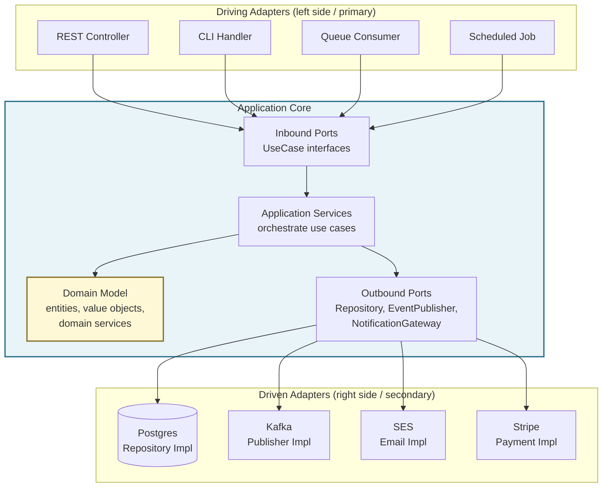
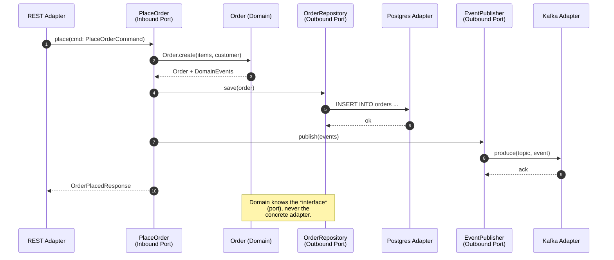

# Hexagonal Architecture (Ports and Adapters)

## Why This Exists

**Problem.** Most "layered" applications leak infrastructure into the domain. The `Order` entity inherits from `ActiveRecord::Base`, the pricing rule lives inside a Spring `@Controller`, and the discount calculation calls `httpClient.post(...)` directly. Result: you cannot unit-test the rule without spinning up Postgres, Stripe, and Redis; you cannot swap MySQL for DynamoDB without bleeding changes into 200 files; and a CVE in Jackson means rewriting the domain.

**Key insight (Cockburn, 2005).** The application has *one* inside (the domain) and *many* outsides (UI, DB, queues, third-party APIs). The inside should not know which outside is calling. **Ports** are interfaces owned by the domain that describe *what* it needs ("save an order", "publish an event", "fetch FX rate"). **Adapters** are infrastructure code that implements those ports for a specific technology (Postgres adapter, Kafka adapter, REST adapter). The dependency arrow points *inward, always*.

This is the same north star as Clean Architecture (Martin), Onion Architecture (Palermo), and DDD's "anti-corruption layer." Hexagonal is the original, simplest framing — and it predates the others by ~3 years.

**Reach for this when:**
- Domain has non-trivial rules (pricing, eligibility, scheduling, regulatory checks) that deserve isolated tests.
- You expect the IO surface to change: multi-cloud, vendor migrations, "today REST, tomorrow gRPC", or replacing a SaaS dependency.
- Multiple drivers of the same use case (HTTP API + CLI + scheduled job + queue consumer all do "place order").
- Compliance requires the domain to be auditable independent of framework code (HIPAA, PCI, banking).
- Long-lived codebases (5+ years) where framework churn dominates maintenance cost.

**Don't reach for this when:**
- CRUD app where 90% of "logic" is `SELECT ... WHERE id = ?`. The ports are ceremony; use a thin Active Record / Django pattern.
- Throwaway scripts, prototypes, or scope-bounded migrations.
- Small team (<3 engineers), short horizon (<6 months), single deployment target. The indirection cost dominates.
- Pure data pipelines / ETL where the "domain" *is* the IO transformation.

## Diagrams

The classic Cockburn picture: domain in the middle, ports on the boundary, adapters on the outside.



A request flow showing the dependency rule in action:



## Anatomy: Ports, Adapters, and the Dependency Rule

The discipline reduces to one rule:

> **Source code dependencies must point only inward, toward higher-level policy.**
> *— Robert C. Martin, "Clean Architecture" (2017), ch. 22*

Concretely: the domain package imports nothing from `infra/`, `web/`, `db/`, or `messaging/`. The infra packages import the domain (to implement its ports). Test this with `ArchUnit` (Java), `import-linter` (Python), `dependency-cruiser` (TS), or `go-arch-lint` (Go). If you don't enforce it mechanically, **it will rot in 6 months.**

### Ports come in two flavors

| Port type | Other names | Direction | Owned by | Example |
|---|---|---|---|---|
| **Inbound (driving / primary)** | Use case, application service interface | The world calls in | Application layer | `PlaceOrder.place(cmd)` |
| **Outbound (driven / secondary)** | Repository, gateway, SPI | Domain calls out | Domain or application layer | `OrderRepository.save(order)` |

The asymmetry matters: inbound ports describe *what the application can do*. Outbound ports describe *what the application needs from the world*. Both are interfaces, but they have different consumers and different stability profiles.

## Reference Implementation: Order Placement (Python)

A realistic slice — order placement with inventory check, payment authorization, and event publishing. Uses only stdlib + `dataclasses` to keep the structure visible.

### `domain/` — Pure, no IO, no framework imports

```python
# domain/order.py
from dataclasses import dataclass, field
from decimal import Decimal
from enum import Enum
from typing import List
from uuid import UUID, uuid4


class OrderStatus(Enum):
    PENDING = "pending"
    AUTHORIZED = "authorized"
    REJECTED = "rejected"


@dataclass(frozen=True)
class LineItem:
    sku: str
    quantity: int
    unit_price: Decimal

    def subtotal(self) -> Decimal:
        if self.quantity <= 0:
            raise ValueError("quantity must be positive")
        return self.unit_price * self.quantity


@dataclass
class Order:
    id: UUID
    customer_id: UUID
    items: List[LineItem]
    status: OrderStatus = OrderStatus.PENDING
    events: list = field(default_factory=list)

    @classmethod
    def place(cls, customer_id: UUID, items: List[LineItem]) -> "Order":
        if not items:
            raise ValueError("order must have at least one line item")
        order = cls(id=uuid4(), customer_id=customer_id, items=items)
        order.events.append(OrderPlaced(order_id=order.id, total=order.total()))
        return order

    def authorize(self) -> None:
        if self.status != OrderStatus.PENDING:
            raise InvalidStateTransition(self.status, OrderStatus.AUTHORIZED)
        self.status = OrderStatus.AUTHORIZED
        self.events.append(OrderAuthorized(order_id=self.id))

    def total(self) -> Decimal:
        return sum((i.subtotal() for i in self.items), start=Decimal("0"))


@dataclass(frozen=True)
class OrderPlaced:
    order_id: UUID
    total: Decimal


@dataclass(frozen=True)
class OrderAuthorized:
    order_id: UUID


class InvalidStateTransition(Exception):
    def __init__(self, frm: OrderStatus, to: OrderStatus):
        super().__init__(f"cannot transition {frm} -> {to}")
```

Notice: no SQLAlchemy, no Pydantic, no Django, no `requests`. The `Order` aggregate is the *whole point* of the system, and it imports nothing that would force a Postgres or Stripe in your unit tests.

### `application/ports.py` — Interfaces only

```python
# application/ports.py
from abc import ABC, abstractmethod
from decimal import Decimal
from typing import Optional, Protocol
from uuid import UUID

from domain.order import Order


# --- Outbound ports (the application needs these) ---

class OrderRepository(Protocol):
    def save(self, order: Order) -> None: ...
    def by_id(self, order_id: UUID) -> Optional[Order]: ...


class InventoryService(Protocol):
    def reserve(self, sku: str, quantity: int) -> bool: ...


class PaymentGateway(Protocol):
    def authorize(self, customer_id: UUID, amount: Decimal) -> bool: ...


class EventPublisher(Protocol):
    def publish(self, events: list) -> None: ...


# --- Inbound port (the world calls this) ---

class PlaceOrderUseCase(ABC):
    @abstractmethod
    def execute(self, cmd: "PlaceOrderCommand") -> "PlaceOrderResult": ...
```

### `application/place_order.py` — The orchestration

```python
# application/place_order.py
from dataclasses import dataclass
from decimal import Decimal
from typing import List
from uuid import UUID

from application.ports import (
    EventPublisher,
    InventoryService,
    OrderRepository,
    PaymentGateway,
    PlaceOrderUseCase,
)
from domain.order import LineItem, Order


@dataclass(frozen=True)
class PlaceOrderCommand:
    customer_id: UUID
    items: List[tuple[str, int, Decimal]]  # (sku, qty, unit_price)


@dataclass(frozen=True)
class PlaceOrderResult:
    order_id: UUID
    authorized: bool


class PlaceOrder(PlaceOrderUseCase):
    def __init__(
        self,
        orders: OrderRepository,
        inventory: InventoryService,
        payments: PaymentGateway,
        events: EventPublisher,
    ):
        self._orders = orders
        self._inventory = inventory
        self._payments = payments
        self._events = events

    def execute(self, cmd: PlaceOrderCommand) -> PlaceOrderResult:
        items = [LineItem(sku, qty, price) for sku, qty, price in cmd.items]

        # Reserve inventory before constructing the order — fail fast.
        for item in items:
            if not self._inventory.reserve(item.sku, item.quantity):
                raise OutOfStock(item.sku)

        order = Order.place(cmd.customer_id, items)

        if self._payments.authorize(cmd.customer_id, order.total()):
            order.authorize()

        self._orders.save(order)
        self._events.publish(order.events)
        return PlaceOrderResult(order.id, order.status.name == "AUTHORIZED")


class OutOfStock(Exception):
    pass
```

The application service is *thin*: it orchestrates ports and the domain. It contains no business rules — those live in `Order`. It contains no SQL, no HTTP — those live in adapters.

### `infrastructure/` — Adapters

```python
# infrastructure/postgres_orders.py
import json
from typing import Optional
from uuid import UUID

import psycopg  # only here, never in domain/ or application/

from domain.order import LineItem, Order, OrderStatus


class PostgresOrderRepository:
    """Driven adapter implementing OrderRepository (structurally)."""

    def __init__(self, conn: psycopg.Connection):
        self._conn = conn

    def save(self, order: Order) -> None:
        with self._conn.cursor() as cur:
            cur.execute(
                """
                INSERT INTO orders (id, customer_id, status, items_json)
                VALUES (%s, %s, %s, %s)
                ON CONFLICT (id) DO UPDATE SET status = EXCLUDED.status
                """,
                (
                    str(order.id),
                    str(order.customer_id),
                    order.status.value,
                    json.dumps(
                        [
                            {"sku": i.sku, "qty": i.quantity, "price": str(i.unit_price)}
                            for i in order.items
                        ]
                    ),
                ),
            )
        self._conn.commit()

    def by_id(self, order_id: UUID) -> Optional[Order]:
        with self._conn.cursor() as cur:
            cur.execute(
                "SELECT id, customer_id, status, items_json FROM orders WHERE id = %s",
                (str(order_id),),
            )
            row = cur.fetchone()
        if row is None:
            return None
        items = [
            LineItem(d["sku"], d["qty"], Decimal(d["price"]))
            for d in json.loads(row[3])
        ]
        return Order(
            id=UUID(row[0]),
            customer_id=UUID(row[1]),
            items=items,
            status=OrderStatus(row[2]),
        )
```

```python
# infrastructure/http_api.py — Driving adapter
from flask import Flask, request, jsonify
from application.place_order import PlaceOrder, PlaceOrderCommand


def make_app(place_order: PlaceOrder) -> Flask:
    app = Flask(__name__)

    @app.post("/orders")
    def create_order():
        body = request.get_json()
        cmd = PlaceOrderCommand(
            customer_id=UUID(body["customer_id"]),
            items=[(i["sku"], i["qty"], Decimal(i["price"])) for i in body["items"]],
        )
        result = place_order.execute(cmd)
        return jsonify({"order_id": str(result.order_id), "authorized": result.authorized}), 201

    return app
```

### `composition_root.py` — Wire it all up

```python
# composition_root.py — the ONE place that knows about everything
import psycopg

from application.place_order import PlaceOrder
from infrastructure.http_api import make_app
from infrastructure.kafka_publisher import KafkaEventPublisher
from infrastructure.postgres_orders import PostgresOrderRepository
from infrastructure.stripe_payments import StripePaymentGateway
from infrastructure.warehouse_client import WarehouseInventoryService


def build():
    conn = psycopg.connect("postgresql://...")
    place_order = PlaceOrder(
        orders=PostgresOrderRepository(conn),
        inventory=WarehouseInventoryService(api_key="..."),
        payments=StripePaymentGateway(api_key="..."),
        events=KafkaEventPublisher(brokers="kafka:9092"),
    )
    return make_app(place_order)


if __name__ == "__main__":
    build().run()
```

## Testing Without Infrastructure

The payoff: domain and application tests run in milliseconds, with no Docker, no test DB, no network.

```python
# tests/test_place_order.py
from decimal import Decimal
from uuid import uuid4

from application.place_order import PlaceOrder, PlaceOrderCommand


class FakeOrderRepository:
    def __init__(self):
        self.saved = []

    def save(self, order):
        self.saved.append(order)

    def by_id(self, _id):
        return next((o for o in self.saved if o.id == _id), None)


class StubInventory:
    def __init__(self, ok=True):
        self.ok = ok

    def reserve(self, sku, qty):
        return self.ok


class StubPayments:
    def __init__(self, ok=True):
        self.ok = ok

    def authorize(self, customer_id, amount):
        return self.ok


class CapturingPublisher:
    def __init__(self):
        self.events = []

    def publish(self, events):
        self.events.extend(events)


def test_places_and_authorizes_order():
    repo = FakeOrderRepository()
    pub = CapturingPublisher()
    uc = PlaceOrder(repo, StubInventory(), StubPayments(), pub)

    result = uc.execute(
        PlaceOrderCommand(
            customer_id=uuid4(),
            items=[("SKU-1", 2, Decimal("10.00"))],
        )
    )

    assert result.authorized is True
    assert len(repo.saved) == 1
    assert repo.saved[0].total() == Decimal("20.00")
    # Two events: OrderPlaced + OrderAuthorized
    assert len(pub.events) == 2


def test_payment_decline_leaves_order_pending():
    repo = FakeOrderRepository()
    uc = PlaceOrder(repo, StubInventory(), StubPayments(ok=False), CapturingPublisher())

    result = uc.execute(
        PlaceOrderCommand(
            customer_id=uuid4(),
            items=[("SKU-1", 1, Decimal("5.00"))],
        )
    )

    assert result.authorized is False
    assert repo.saved[0].status.value == "pending"
```

These tests cover the *interesting* behavior — pricing, state transitions, payment decline branches — with **fakes, not mocks**. Fakes are usually clearer; reserve mocks for verifying interaction protocols.

## Enforcing the Dependency Rule Mechanically

If you don't fail the build when someone imports `psycopg` from `domain/`, your hexagon will collapse into a layered mush within two quarters. Tools by language:

### Python — `import-linter`

```ini
# .importlinter
[importlinter]
root_packages = domain, application, infrastructure

[importlinter:contract:layered]
name = Hexagonal layers
type = layers
layers =
    infrastructure
    application
    domain
```

Runs in CI. Blocks PRs that violate the rule.

### Java — `ArchUnit`

```java
@AnalyzeClasses(packages = "com.acme.orders")
class HexagonalRulesTest {

    @ArchTest
    static final ArchRule domain_does_not_depend_on_infra =
        noClasses()
            .that().resideInAPackage("..domain..")
            .should().dependOnClassesThat().resideInAnyPackage(
                "..infrastructure..", "..web..", "org.springframework..", "javax.persistence.."
            );

    @ArchTest
    static final ArchRule application_does_not_depend_on_infra =
        noClasses()
            .that().resideInAPackage("..application..")
            .should().dependOnClassesThat().resideInAPackage("..infrastructure..");
}
```

### TypeScript — `dependency-cruiser`

```js
// .dependency-cruiser.cjs
module.exports = {
  forbidden: [
    {
      name: 'domain-no-infra',
      severity: 'error',
      from: { path: '^src/domain' },
      to:   { path: '^src/(infrastructure|adapters|web)' },
    },
    {
      name: 'application-no-adapters',
      severity: 'error',
      from: { path: '^src/application' },
      to:   { path: '^src/(infrastructure|adapters)' },
    },
  ],
};
```

### Go — folder layout + `go-arch-lint`

```yaml
# .go-arch-lint.yml
version: 3
workdir: .
components:
  domain:        { in: domain/** }
  application:   { in: application/** }
  infrastructure: { in: infrastructure/** }
deps:
  domain:        { mayDependOn: [] }
  application:   { mayDependOn: [domain] }
  infrastructure: { mayDependOn: [domain, application] }
```

## Trade-offs

| Benefit | Cost |
|---|---|
| Domain tests run in ms with no infra. | More files / packages — feels heavy on small projects. |
| Swap Postgres → DynamoDB by writing one new adapter. | Need a translation layer between domain entities and ORM/DB rows (the "impedance mismatch" reappears). |
| Domain survives framework upgrades (Spring 2→3, Rails 6→7). | Junior devs often "fix" the structure by importing `EntityManager` into the domain — needs enforcement. |
| Multiple drivers (HTTP, CLI, queue) reuse the same use case. | Easy to over-port: trivial CRUD wrapped in 4 layers of indirection. |
| Forces you to name use cases (`PlaceOrder`, `RefundPayment`) — better than 200-method `OrderService`. | Use case explosion in CRUD-heavy apps; need judgment about granularity. |
| Anti-corruption layer is built in — third-party API changes don't propagate inward. | Mapping code (DTO ↔ domain ↔ DB row) is real work and easy to get wrong. |
| Compatible with DDD, CQRS, event sourcing — they layer on cleanly. | Doesn't tell you *how* to model the domain — orthogonal to DDD; people often confuse the two. |

## Common Pitfalls

- **Anemic domain.** The `Order` is a struct with getters/setters; all logic lives in `OrderService`. You've moved `OrderController` → `OrderService` and called it hexagonal. The domain must hold invariants (`place()`, `authorize()`, `cancel()`), not be a data bag. *(Fowler — "Anemic Domain Model".)*

- **Leaky port types.** The `OrderRepository.save()` takes a JPA `@Entity` or a SQLAlchemy ORM object. Now Hibernate's session lifecycle leaks into the domain. Ports must speak in *domain types* (`Order`, `LineItem`), not infrastructure types.

- **One repository per table.** Hexagonal works with **aggregates**, not tables. `OrderRepository` saves a whole `Order` (including line items, addresses) atomically. Splitting into `OrderRepo` + `LineItemRepo` + `AddressRepo` recreates the leaky-table problem.

- **Adapter logic in the application service.** "Just this once, I'll call `kafkaTemplate.send()` directly because the abstraction is a pain." Six months later, half the use cases bypass the port. Once is a precedent.

- **Mocking instead of faking.** Verifying that `repo.save()` was called with a specific argument is brittle. Prefer in-memory fakes that satisfy the port contract (and reuse them across tests). Reserve mocks for protocol verification (e.g., "the email was sent exactly once").

- **The "use case" becomes a transaction script.** A `PlaceOrder` use case that's 300 lines of orchestration with no domain object in sight is a transaction script wearing a hexagon costume. Push logic down into entities and value objects.

- **Ports owned by infrastructure.** Defining `OrderRepository` in `infrastructure/` instead of the domain/application package inverts the dependency. The port belongs to the *consumer* (the domain needs it), not the implementer.

- **Skipping the composition root.** DI happens via Spring `@Autowired`/Guice annotations sprinkled across files; nobody can find where adapters are wired. One *composition root* (Mark Seemann's term) — typically `main.py` / `Application.java` — is the only place that knows the full graph.

- **Hexagonal as religion.** Wrapping `LocalDate.now()` behind a `ClockPort` for a `pingHealth()` endpoint is silly. Apply judgment: ports earn their keep when there's *change risk* (vendor swap, testing pain, multiple drivers).

- **Confusing hexagonal with microservices.** Hexagonal is *intra-service* structure. A monolith can be perfectly hexagonal; a fleet of microservices can be perfectly tangled. They are orthogonal concerns.

## Decision Table

| Situation | Choose | Why |
|---|---|---|
| Rich domain rules, long-lived service, multi-cloud or vendor-swap risk | **Hexagonal / Clean / Onion** | Worth the indirection; it's the canonical fit. |
| CRUD app, DB schema *is* the domain, single deployment target | **Active Record / Django / Rails** | Hexagonal indirection costs more than it saves. |
| Heavy read/write asymmetry, complex queries | **Hexagonal + CQRS** | Use ports for the write side; bypass them for read models with direct SQL projections. |
| Audit-heavy, "what was the state at T?" required | **Hexagonal + Event Sourcing** | Ports become event store + read model gateways. |
| Pipe-and-filter / streaming transformation | **Functional pipeline** | The transformation *is* the program; ports don't carry weight. |
| Embedded systems, hard-real-time, allocation budgets | **Layered with explicit lifecycles** | Indirection cost (vtables, allocations) matters; flatten. |
| Greenfield startup, <6 months runway | **Modular monolith, light layering** | You don't know the domain yet; over-architecting freezes the wrong abstractions. |
| Established product, scaling team across bounded contexts | **Hexagonal per context** | One hexagon per bounded context (DDD); ACL between contexts. |
| Library/SDK code | **Pure functional core + thin facade** | No "application" — clients are the drivers; ports collapse into public API. |

| Hexagonal vs. neighbor | Same idea? | Difference |
|---|---|---|
| **Clean Architecture** (Martin) | Yes | Adds explicit "use case" and "entity" layers; same dependency rule. Hexagonal is simpler. |
| **Onion Architecture** (Palermo) | Yes | Same rule; concentric onion vs. hexagon is mostly aesthetics. |
| **DDD Layered Architecture** | Compatible | DDD says *how* to model the domain; hexagonal says *how* to isolate it. Pair them. |
| **Functional Core, Imperative Shell** (Bernhardt) | Same spirit | Stronger emphasis on pure functions; weaker emphasis on explicit interfaces. |
| **Layered ("3-tier")** | No | Layered allows downward dependencies (`web → domain → db`); domain ends up depending on the DB schema. |

## References

- Alistair Cockburn — "Hexagonal Architecture" (original 2005 essay) — https://alistair.cockburn.us/hexagonal-architecture/
- Robert C. Martin — "The Clean Architecture" (blog, 2012) — https://blog.cleancoder.com/uncle-bob/2012/08/13/the-clean-architecture.html
- Robert C. Martin — *Clean Architecture* (Prentice Hall, 2017), ch. 22 "The Clean Architecture"
- Jeffrey Palermo — "The Onion Architecture: part 1" — https://jeffreypalermo.com/2008/07/the-onion-architecture-part-1/
- Eric Evans — *Domain-Driven Design* (Addison-Wesley, 2003), ch. 4 "Isolating the Domain", ch. 14 "Anti-Corruption Layer"
- Vaughn Vernon — *Implementing Domain-Driven Design* (Addison-Wesley, 2013), ch. 4 "Architecture"
- Martin Fowler — "AnemicDomainModel" — https://martinfowler.com/bliki/AnemicDomainModel.html
- Martin Fowler — *Patterns of Enterprise Application Architecture* (Addison-Wesley, 2002) — Repository, Service Layer, Active Record, Data Mapper patterns
- Mark Seemann — *Dependency Injection Principles, Practices, and Patterns* (Manning, 2nd ed. 2019) — Composition Root chapter
- Gary Bernhardt — "Boundaries" (talk, 2012) — https://www.destroyallsoftware.com/talks/boundaries
- DDIA = Kleppmann, *Designing Data-Intensive Applications* (O'Reilly, 2017) — ch. 2 "Data Models" for impedance mismatch context
- ArchUnit — https://www.archunit.org/
- import-linter — https://import-linter.readthedocs.io/
- dependency-cruiser — https://github.com/sverweij/dependency-cruiser
- AWS Builders' Library — "Workload isolation using shuffle sharding" (illustrates port boundaries at the deployment layer) — https://aws.amazon.com/builders-library/

## See Also

- `../clean-architecture/` — Uncle Bob's variant; same rule, more layer names.
- `../layered/` — the 3-tier pattern hexagonal replaces (and how to migrate).
- `../../code-design/ddd/` — entities, aggregates, value objects, domain services.
- `../cqrs/` — splitting the write side (hexagonal) from the read side.
- `../event-sourcing/` — when the outbound port is an event store.
- `../modular-monolith/` — applying hexagonal per module within a single deployable.
- `../../code-design/testing-pyramid/` — why fast domain tests change the pyramid shape.
