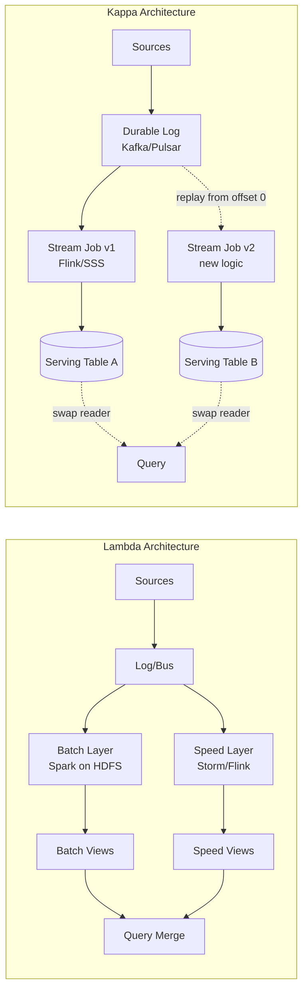
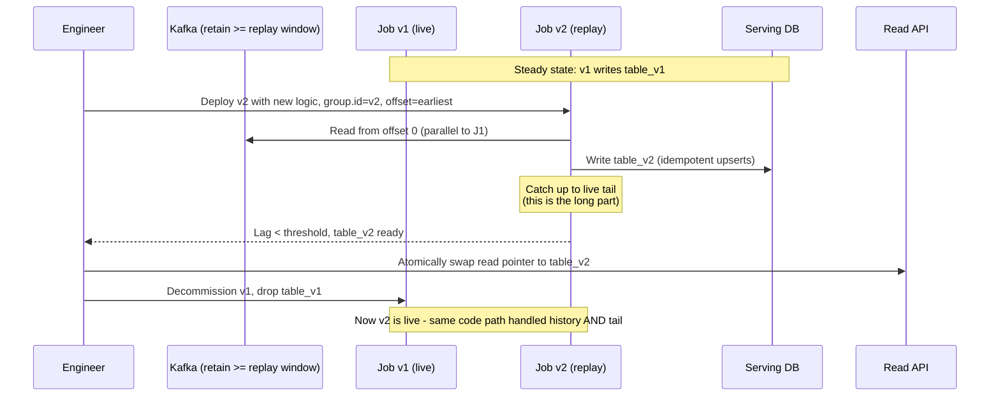
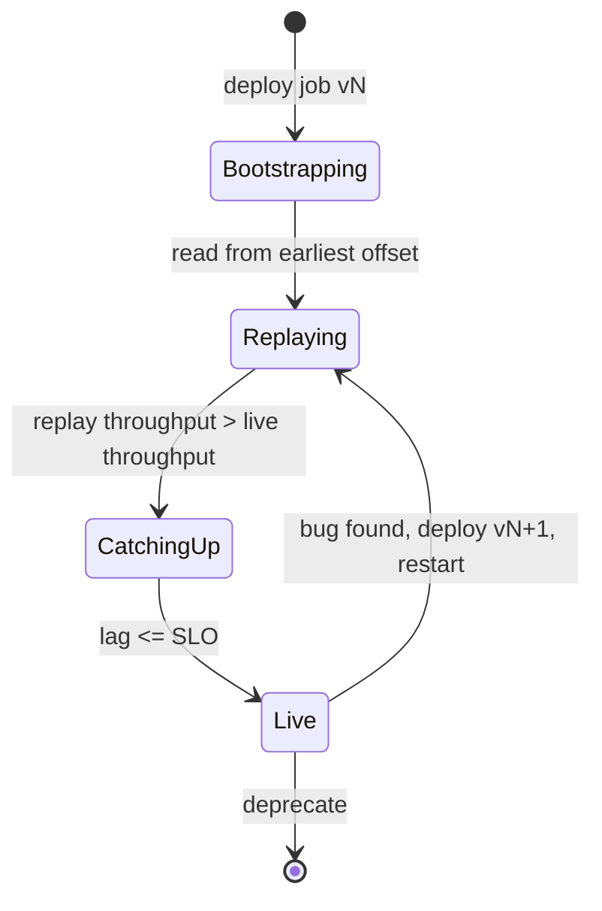
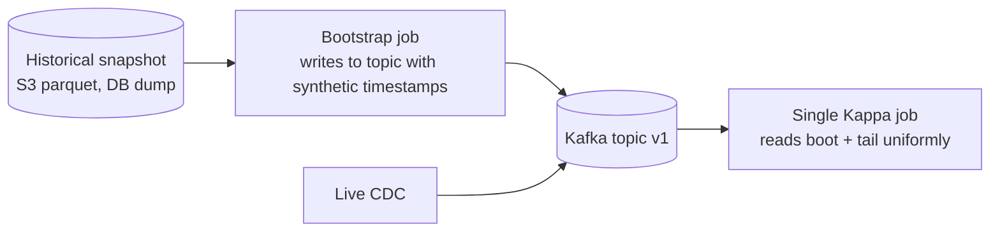

# Kappa Architecture

## Why This Exists

**Problem.** Lambda architecture (Marz, 2011) gave you two parallel pipelines: a batch layer for correctness and a speed layer for latency. Every business rule had to be implemented twice — once in MapReduce/Spark for the batch path, once in Storm/Flink for the speed path. Outputs were merged at query time. In practice, the two implementations drift, the merge logic gets gnarly, and a one-line bug fix becomes a two-week project across two codebases.

**Key insight (Jay Kreps, 2014).** If your stream processor can replay the entire history from a durable log, you don't need a separate batch layer. To "reprocess," spin up a second instance of the streaming job, point it at offset 0 of the topic, write to a new output table, then atomically swap consumers over. **One code path. One mental model. Reprocessing is just a long stream job.**

The substrate that makes this possible is a **durable, ordered, replayable log** — Kafka, Pulsar, Kinesis with extended retention, or AWS MSK. Retention is sized in terabytes-to-petabytes and weeks-to-years, not the 7-day default.

**Reach for Kappa when:**
- Your batch and streaming logic are (or want to be) the same business rules, just over different time windows.
- You have a strong streaming engine team (Flink, Spark Structured Streaming, Kafka Streams) and want to consolidate.
- Reprocessing happens often enough to matter (bug fixes, schema changes, new derived datasets) but not so often that a 4-hour replay blocks the team daily.
- Source-of-truth events are append-only and naturally event-shaped (CDC, clickstream, telemetry, IoT, payments, orders).
- You can keep raw events in the log long enough to cover your worst-case replay window.

**Don't reach for Kappa when:**
- Your "events" are actually batch dumps from a vendor that arrive once a day. You'd be cosplaying a stream.
- Replay throughput can't keep up with live throughput by a wide enough margin (rule of thumb: you want **5–10x** live ingest rate so a week of data replays in a day, not a week).
- Heavy iterative algorithms — graph PageRank, multi-pass ML training, recursive SQL — that genuinely want a batch engine. A streaming engine doing 14 passes over a windowed state is masochism.
- Compliance requires a separate "system of record" with its own immutable batch snapshots audited independently. (You can still have Kappa upstream; just don't pretend it replaces the audit pipeline.)
- Your team has zero Flink/Spark Streaming experience and a deadline next month. Kappa concentrates risk in one engine.

## Diagrams

### Lambda vs Kappa at a glance



### Reprocessing flow (the heart of Kappa)



### State of a Kappa job during replay



## Core content

### 1. Sizing the log: retention is the architecture

The single most important decision in Kappa is **how long you retain the source log**. If retention < worst-case replay window, you can't reprocess; you've quietly degraded to Lambda with extra steps.

```yaml
# Kafka topic config for a Kappa source-of-truth topic
# Real production values from a payments-events topic, ~80MB/s peak
name: payments.events.v1
partitions: 96            # sized for replay parallelism, not just live load
replication.factor: 3
min.insync.replicas: 2

# Retain 90 days — covers quarter-end reprocessing + 2 weeks of slack
retention.ms: 7776000000  # 90d
retention.bytes: -1       # don't bound by size; bound by time

# Compact + delete on a CDC table topic; keyed by primary key
# (use 'delete' only on append-only event topics)
cleanup.policy: delete

# Keep batch sizes large enough to amortize fsync
segment.bytes: 1073741824 # 1 GiB segments
segment.ms: 86400000      # roll daily

# Tiered storage offloads cold segments to S3 — non-negotiable past ~14d
# https://docs.confluent.io/platform/current/kafka/tiered-storage.html
confluent.tier.enable: true
confluent.tier.local.hotset.ms: 86400000  # keep 1d hot on broker
```

**Retention math you must do before committing to Kappa:**

```
required_retention = max(
    longest_known_bug_window,           # how long until you'd notice a calculation bug
    schema_evolution_window,            # how far back you'd reprocess on schema change
    audit_replay_window,                # regulator/customer-driven backfills
    new_derived_dataset_lookback        # joining a new sink that needs history
) * safety_factor (1.5x)
```

If that number is "30 days," tiered storage is optional. If it's "2 years," tiered storage (Confluent Tiered, Apache Kafka KIP-405, Pulsar tiered, AWS MSK Tiered) is mandatory or your broker disks will eat your budget.

### 2. The single code path — Flink example

This is the whole point. The same job runs over historical and live data. The only difference is the source's starting offset.

```java
// Flink job that computes 1-minute payment-volume aggregates
// Same JAR runs as: (a) the live job, (b) the replay job for backfill.
// Differences are entirely in StartupMode + sink table name.

public class PaymentVolumeJob {

    public static void main(String[] args) throws Exception {
        ParameterTool params = ParameterTool.fromArgs(args);
        StreamExecutionEnvironment env = StreamExecutionEnvironment.getExecutionEnvironment();

        // Checkpointing — exactly-once requires this for both live and replay
        env.enableCheckpointing(60_000, CheckpointingMode.EXACTLY_ONCE);
        env.getCheckpointConfig().setMinPauseBetweenCheckpoints(30_000);
        env.getCheckpointConfig().setTolerableCheckpointFailureNumber(3);

        // The ONLY production knob that differs between live and replay:
        OffsetsInitializer startOffsets = params.getBoolean("replay", false)
            ? OffsetsInitializer.earliest()
            : OffsetsInitializer.committedOffsets(OffsetResetStrategy.LATEST);

        KafkaSource<PaymentEvent> source = KafkaSource.<PaymentEvent>builder()
            .setBootstrapServers(params.getRequired("bootstrap.servers"))
            .setTopics("payments.events.v1")
            .setGroupId(params.getRequired("group.id"))   // distinct per job version
            .setStartingOffsets(startOffsets)
            .setValueOnlyDeserializer(new PaymentEventDeserializer())
            .build();

        DataStream<PaymentEvent> events = env.fromSource(
            source,
            // Watermarks must use EVENT TIME, not processing time.
            // Otherwise replay produces different results than live — the cardinal sin.
            WatermarkStrategy.<PaymentEvent>forBoundedOutOfOrderness(Duration.ofSeconds(30))
                .withTimestampAssigner((e, ts) -> e.eventTimeMillis())
                .withIdleness(Duration.ofMinutes(2)),
            "payments-source"
        );

        DataStream<MinuteVolume> volumes = events
            .filter(e -> e.status() == PaymentStatus.SETTLED)
            .keyBy(PaymentEvent::merchantId)
            // Tumbling event-time window — deterministic across replay
            .window(TumblingEventTimeWindows.of(Time.minutes(1)))
            // Allow late events up to 5 min — same in live and replay
            .allowedLateness(Time.minutes(5))
            .aggregate(new SumVolumeAggregator(), new MinuteVolumeWindowFn());

        // Sink table name is parametrized — replay writes to a SHADOW table.
        // Atomic swap happens at query layer (see section 4).
        String sinkTable = params.get("sink.table", "payment_volume_minute");

        volumes.sinkTo(JdbcSink.<MinuteVolume>builder()
            .withQueryStatement(
                "INSERT INTO " + sinkTable + " (merchant_id, minute_ts, volume_cents) " +
                "VALUES (?, ?, ?) " +
                // Idempotent upsert — required for replay to not double-count
                "ON CONFLICT (merchant_id, minute_ts) DO UPDATE SET volume_cents = EXCLUDED.volume_cents",
                (ps, v) -> {
                    ps.setString(1, v.merchantId());
                    ps.setTimestamp(2, Timestamp.from(v.minute()));
                    ps.setLong(3, v.volumeCents());
                })
            .withExecutionOptions(JdbcExecutionOptions.builder()
                .withBatchSize(500)
                .withBatchIntervalMs(200)
                .withMaxRetries(5)
                .build())
            .buildAtLeastOnce(connectionProvider));

        env.execute("payment-volume-" + (params.getBoolean("replay", false) ? "replay" : "live"));
    }
}
```

The non-negotiables for "one code path" to actually work:

1. **Event time, not processing time.** Replay runs at 100x speed; processing-time windows would collapse. DDIA ch. 11 ("Stream Processing") spends 20 pages on this for a reason.
2. **Idempotent sinks.** Replays will re-emit. Use upserts keyed by `(natural_key, window)`, or transactional sinks (Flink + Kafka EOS, Spark + Delta).
3. **Deterministic UDFs.** No `current_timestamp`, no `random()`, no calls to live external services that return different values today vs last quarter.
4. **Watermark + lateness policy identical.** If you change `allowedLateness` between versions, you've broken determinism — that's a v2, not the same code path.

### 3. Spark Structured Streaming variant

Same architecture, different runtime. SSS is a reasonable Kappa engine when your team already runs Spark for ML and you want one cluster.

```python
# pyspark structured streaming — same business rule, runs live or replay
from pyspark.sql import SparkSession
from pyspark.sql.functions import window, col, sum as _sum
from pyspark.sql.types import StructType, StringType, LongType, TimestampType
import argparse, sys

ap = argparse.ArgumentParser()
ap.add_argument("--replay", action="store_true")
ap.add_argument("--sink-table", default="payment_volume_minute")
ap.add_argument("--checkpoint", required=True)
args = ap.parse_args()

spark = (SparkSession.builder.appName("payment-volume").getOrCreate())

schema = (StructType()
    .add("event_id", StringType())
    .add("merchant_id", StringType())
    .add("amount_cents", LongType())
    .add("status", StringType())
    .add("event_time", TimestampType()))

# startingOffsets is the ONLY difference between live and replay.
starting = "earliest" if args.replay else "latest"

raw = (spark.readStream
    .format("kafka")
    .option("kafka.bootstrap.servers", "broker:9092")
    .option("subscribe", "payments.events.v1")
    .option("startingOffsets", starting)
    # When replaying terabytes, cap per-trigger to prevent OOM and stale watermarks
    .option("maxOffsetsPerTrigger", 10_000_000 if args.replay else 1_000_000)
    .load())

events = (raw
    .selectExpr("CAST(value AS STRING) AS json")
    .select(from_json("json", schema).alias("e"))
    .select("e.*")
    .filter(col("status") == "SETTLED")
    # Watermark must be event-time. 30s OOO matches the Flink job above.
    .withWatermark("event_time", "30 seconds"))

agg = (events
    .groupBy(window(col("event_time"), "1 minute"), col("merchant_id"))
    .agg(_sum("amount_cents").alias("volume_cents")))

# Idempotent sink — foreachBatch + MERGE INTO is the safe pattern
def upsert(batch_df, batch_id):
    (batch_df.createOrReplaceTempView("staged"))
    spark.sql(f"""
      MERGE INTO {args.sink_table} t
      USING staged s
      ON t.merchant_id = s.merchant_id AND t.minute_ts = s.window.start
      WHEN MATCHED THEN UPDATE SET volume_cents = s.volume_cents
      WHEN NOT MATCHED THEN INSERT (merchant_id, minute_ts, volume_cents)
        VALUES (s.merchant_id, s.window.start, s.volume_cents)
    """)

(agg.writeStream
    .foreachBatch(upsert)
    .option("checkpointLocation", args.checkpoint)
    # Trigger interval — leave continuous on for live, use AvailableNow for one-shot replay
    .trigger(availableNow=True if args.replay else None,
             processingTime="30 seconds" if not args.replay else None)
    .start()
    .awaitTermination())
```

`Trigger.AvailableNow` (SSS 3.3+) is a Kappa superpower: it tells SSS "process every offset that exists right now, micro-batched, then exit." That's how you do a bounded backfill with the same code that runs your unbounded live stream.

### 4. The atomic swap — making reprocessing safe

The replay job writes to a **shadow table**, not the live table. Reads switch over only after validation. Three patterns, in increasing safety:

**Pattern A — Pointer table (cheap, good enough for most analytics):**

```sql
-- A view the application reads. Updating the view is the swap.
CREATE OR REPLACE VIEW payment_volume_minute AS
  SELECT * FROM payment_volume_minute_v7;  -- swap to v8 here, atomic in PG/Snowflake
```

**Pattern B — Blue/green tables with diff gate:**

```python
# Before swap, run a correctness gate on a sample window where we expect agreement.
diff = spark.sql("""
  SELECT a.merchant_id, a.minute_ts,
         a.volume_cents AS old_v,
         b.volume_cents AS new_v
  FROM payment_volume_minute_v7 a
  FULL OUTER JOIN payment_volume_minute_v8 b
    USING (merchant_id, minute_ts)
  WHERE a.minute_ts BETWEEN '2026-05-01' AND '2026-05-07'
    AND COALESCE(a.volume_cents, -1) != COALESCE(b.volume_cents, -1)
""").count()

# Expected delta: only the rows the bug-fix was supposed to change.
# If diff != expected, BLOCK the swap and page the on-call.
assert diff <= EXPECTED_DELTA_UPPER_BOUND, f"Unexpected diff: {diff}"
```

**Pattern C — Lakehouse time travel (Delta / Iceberg / Hudi):**

```sql
-- Iceberg: replay writes a new snapshot; query references snapshot-id explicitly.
SELECT * FROM payment_volume_minute
  VERSION AS OF 12345;   -- pin to validated snapshot until promoted
-- Or roll back instantly if v8 is wrong:
CALL system.rollback_to_snapshot('payment_volume_minute', 12340);
```

Lakehouse table formats (Iceberg, Delta, Hudi) are the natural sink for Kappa because they give you cheap snapshots, time travel, and `MERGE INTO` for idempotent writes. See `../../data-systems/lakehouse/` and `../event-sourcing/`.

### 5. Replay throughput — the limit that decides the architecture

This is the section everyone who's been burned by Kappa wants you to read.

**The brutal math.** If your live ingest is 50 MB/s and your retention is 90 days, you have ~388 TB to replay. To replay that in 24 hours, the replay job must sustain **~4.5 GB/s** — about 90x live throughput. That requires:

- **Partition count** ≥ replay parallelism. Kafka throughput per consumer scales with partitions; if your topic has 24 partitions, you cap at 24 parallel readers. Plan partitions for replay, not just live load.
- **Stateful operator parallelism.** A keyed window with 10M keys + RocksDB state needs hot SSDs and RAM proportional to the working set. Replay 90 days at 90x means the state grows ~3 months in ~1 day — you must size the cluster for the *peak* state, not the live state.
- **Sink write capacity.** Postgres at 5K writes/s is fine live, embarrassing during replay. Aurora/Snowflake/ClickHouse with bulk-load paths, or a Kafka topic as sink (then a separate batch loader), are the answer.
- **Network and storage egress.** Replaying from S3 (tiered storage) is bandwidth-bounded. AWS MSK tiered fetches from S3 at ~1 GB/s per broker — your reprocessing throughput ceiling is set by S3 egress, not Kafka.

**Rule of thumb (Kreps's original blog, restated):** If a full reprocess takes longer than your bug-discovery-to-fix-tolerance window, Kappa is *aspirational* and you've drifted back toward Lambda. **A reprocess that takes 2 weeks is a reprocess nobody runs.**

### 6. Schema evolution — the day the wheels come off

Kappa's "one code path" is a lie if your code can't read events from 18 months ago. Two non-negotiable practices:

1. **Schema registry with backward-compat enforcement.** Confluent Schema Registry, AWS Glue Schema Registry, or Apicurio. Set compatibility to `BACKWARD` for sources (new code reads old data) and `FORWARD` for sinks (old code reads new data). The registry rejects breaking changes at producer publish time — *before* they poison the topic.
2. **Versioned topics, not in-place schema changes.** When you need a breaking change (rename a field, change semantics), publish to `payments.events.v2` while v1 keeps flowing. Migration becomes "dual-write for N days, dual-consume for M days, deprecate v1." Confluent's "Stream as a Table" pattern formalizes this.

```yaml
# Avro schema registered for payments.events.v1
{
  "type": "record",
  "namespace": "com.example.payments",
  "name": "PaymentEvent",
  "fields": [
    {"name": "event_id", "type": "string"},
    {"name": "merchant_id", "type": "string"},
    {"name": "amount_cents", "type": "long"},
    {"name": "status", "type": {"type": "enum", "name": "PaymentStatus",
       "symbols": ["PENDING", "SETTLED", "FAILED", "REFUNDED"]}},
    {"name": "event_time", "type": {"type": "long", "logicalType": "timestamp-millis"}},
    # Adding optional field with default = BACKWARD compatible
    {"name": "currency", "type": ["null", "string"], "default": null}
  ]
}
```

### 7. Bootstrapping state from a non-replayable source

You don't always control history. CDC from a vendor DB, a partner's API, a legacy mainframe — sometimes "offset 0" is "whatever we started capturing in 2023." For older state, the standard pattern is **bootstrap + tail**:



Debezium's "incremental snapshot" mode (Debezium 1.6+) implements this for relational sources without stopping the live CDC stream. AWS DMS does similar for RDS sources.

## Trade-offs

| Benefit                                                                  | Cost                                                                                            |
| :----------------------------------------------------------------------- | :---------------------------------------------------------------------------------------------- |
| Single code path → one team, one mental model, one test suite            | All correctness bugs are now stream-engine bugs; Flink/SSS expertise becomes critical-path      |
| Replay = redeploy → no separate batch infrastructure to maintain         | Storage cost: keeping 90d–2y of raw events in Kafka + tiered S3 is real money                   |
| Source log is the system of record → audit trail for free                | Schema discipline becomes existential; one bad producer corrupts history                        |
| Determinism via event-time + idempotent sinks → reproducible analytics   | Discipline burden on every developer; processing-time and `now()` calls are land mines          |
| Lakehouse sinks (Iceberg/Delta) make rollback cheap                      | Sink-side complexity: MERGE semantics, snapshot retention, vacuum/compaction policies           |
| Can backfill new derived datasets without touching upstream              | Replay throughput is bounded by partition count + sink write rate; sized wrong = "Kappa in name only" |
| Fewer moving parts than Lambda → fewer failure modes overall             | Concentration risk: Kafka outage + bad deploy = no live and no replay simultaneously            |
| Late data handled uniformly via watermarks                               | Watermark tuning is genuinely hard; getting allowed-lateness wrong silently drops data          |

## Common Pitfalls

- **"We have Kappa" but retention is 7 days.** You have a streaming pipeline with no replay capacity. Reprocessing requires re-ingesting from source, which means you have Lambda with extra steps. Audit retention vs. worst-case replay window before claiming Kappa.
- **Processing-time windows in a "replay-friendly" job.** Replay runs at 100x speed. Processing-time windows produce nonsensical results. Symptom: "the backfill numbers don't match what we saw live, off by orders of magnitude." Fix: every window keyed on event time, every join keyed on event time, every UDF deterministic.
- **Non-idempotent sinks.** Replay re-emits every event. Append-only sinks (raw `INSERT`, plain Kafka producer) double-count. Fix: upsert by natural key, transactional sinks (Flink + Kafka EOS, Spark + Delta), or a dedupe stage downstream.
- **Calling external services from the stream job.** External calls aren't replay-safe — the upstream service today doesn't return what it did 6 months ago. Fix: capture the response *as an event* in the log at live time, then enrich from the log during replay (the "log everything" rule).
- **Partition count sized for live load only.** Replay parallelism is capped by partitions. Live runs at 50 MB/s on 24 partitions, fine. Replay at 5 GB/s on 24 partitions = 200 MB/s/partition = brokers fall over. Size partitions for the replay scenario.
- **Schema registry in `NONE` compatibility mode.** Someone renames a field in the producer; the topic now has two incompatible Avro versions; the replay job throws on the boundary. Set compatibility to `BACKWARD` minimum, enforce at publish time.
- **No diff gate before swap.** Engineer "fixes" a bug in v2, swaps the table, application now reports 30% lower revenue. Always run a diff against v1 on a window where you expect minimal change before promoting.
- **Replay job sharing state backend with live job.** Same RocksDB checkpoint path, same group.id — replay corrupts live state and you lose both. Always isolate: distinct `group.id`, distinct checkpoint path, distinct sink table.
- **State TTL not set, replay materializes 2 years of keys in RAM.** Live job has 1M keys; replay over 2 years touches 50M keys; OOM. Set state TTL on keyed state; size cluster RAM for the replay key cardinality.
- **"We'll just rebuild from S3 if Kafka loses data."** Then you don't have Kappa, you have a batch pipeline that pretends. The log *is* the source of truth; if you can't trust it, the architecture doesn't work.
- **Forgetting that exactly-once is end-to-end or it isn't.** Flink EOS + non-transactional JDBC sink = at-least-once. Either use a transactional sink (Kafka 2PC, Iceberg writer, Delta writer) or accept at-least-once and design idempotent downstream consumers.

## Decision Table

| Situation                                                                       | Use                            | Reason                                                                                  |
| :------------------------------------------------------------------------------ | :----------------------------- | :-------------------------------------------------------------------------------------- |
| Append-only events, low-latency required, team has Flink/SSS expertise          | **Kappa**                      | Single code path wins; reprocessing covers correctness needs                            |
| Heavy iterative ML, daily cadence acceptable, batch is fine                     | **Pure batch (Spark/Airflow)** | Stream engines are bad at multi-pass iteration; no latency need                         |
| Mix of latency-sensitive and complex batch (PageRank, billing recon)            | **Lambda or Kappa + batch**    | Don't force everything through a stream engine; let batch do batch                      |
| Tiny org, no streaming experience, need it next quarter                         | **Batch first**                | Kappa concentrates risk in one engine; learn streaming on a non-critical path first     |
| Heavy regulated workload requiring independent audit pipeline                   | **Kappa upstream + batch audit**| Kappa runs live serving; daily batch reconciliation against the same log for audit     |
| Source data is daily vendor file dumps                                          | **Batch**                      | "Stream of one event per day" is just batch with extra steps                            |
| High write rate, low read rate, history matters, audit-grade                    | **Event Sourcing + Kappa**     | Domain events as the log; Kappa as the read-model builder                               |
| You need Lambda's "approximate now + correct yesterday" model and you're happy  | **Lambda**                     | Don't migrate to Kappa for ideology; only when maintenance cost of two paths exceeds it |
| Reprocess takes >2 weeks at sustainable cluster size                            | **Lambda or restructure**      | Aspirational Kappa is worse than honest Lambda                                          |
| Stream-stream joins with tight latency, large state                             | **Kappa with Flink**           | Flink's keyed state + RocksDB is the gold standard; SSS struggles at scale here         |

## References

- Jay Kreps — *Questioning the Lambda Architecture* (the original Kappa post, O'Reilly 2014) — https://www.oreilly.com/radar/questioning-the-lambda-architecture/
- Jay Kreps — *The Log: What every software engineer should know about real-time data's unifying abstraction* — https://engineering.linkedin.com/distributed-systems/log-what-every-software-engineer-should-know-about-real-time-datas-unifying
- Martin Kleppmann — *Designing Data-Intensive Applications* — ch. 11 ("Stream Processing"), ch. 12 ("The Future of Data Systems"). The Kappa-vs-Lambda discussion in ch. 12 is the canonical written treatment. O'Reilly 2017.
- Apache Flink docs — *Concepts: Stateful Stream Processing* — https://nightlies.apache.org/flink/flink-docs-stable/docs/concepts/stateful-stream-processing/
- Apache Flink docs — *Time and Watermarks* — https://nightlies.apache.org/flink/flink-docs-stable/docs/concepts/time/
- Apache Spark docs — *Structured Streaming Programming Guide* — https://spark.apache.org/docs/latest/structured-streaming-programming-guide.html
- Apache Spark — *Trigger.AvailableNow* (SPARK-36533) — https://issues.apache.org/jira/browse/SPARK-36533
- Confluent — *Tiered Storage* — https://docs.confluent.io/platform/current/kafka/tiered-storage.html
- Apache Kafka — *KIP-405: Kafka Tiered Storage* — https://cwiki.apache.org/confluence/display/KAFKA/KIP-405%3A+Kafka+Tiered+Storage
- Confluent — *Schema Registry Compatibility Types* — https://docs.confluent.io/platform/current/schema-registry/avro.html
- Debezium docs — *Incremental snapshots* — https://debezium.io/documentation/reference/stable/configuration/signalling.html
- Apache Iceberg docs — *Time Travel and Rollback* — https://iceberg.apache.org/docs/latest/spark-queries/#time-travel
- Delta Lake docs — *Time Travel* — https://docs.delta.io/latest/delta-batch.html#query-an-older-snapshot-of-a-table-time-travel
- Dean Wampler — *Fast Data Architectures for Streaming Applications* — O'Reilly 2016 — https://www.oreilly.com/library/view/fast-data-architectures/9781492048879/
- Tyler Akidau, Slava Chernyak, Reuven Lax — *Streaming Systems* — O'Reilly 2018. Definitive treatment of event time, watermarks, and triggers.
- Tyler Akidau et al. — *The Dataflow Model* (VLDB 2015) — https://research.google/pubs/the-dataflow-model-a-practical-approach-to-balancing-correctness-latency-and-cost-in-massive-scale-unbounded-out-of-order-data-processing/
- Google SRE Workbook — ch. 4 *SLO Engineering Case Studies* (relevant for reprocessing SLOs) — https://sre.google/workbook/slo-engineering-case-studies/
- Pat Helland — *Immutability Changes Everything* (CIDR 2015) — https://www.cidrdb.org/cidr2015/Papers/CIDR15_Paper16.pdf
- Martin Fowler — *Event Sourcing* — https://martinfowler.com/eaaDev/EventSourcing.html
- AWS Builders' Library — *Reliability, constant work, and a good cup of coffee* (relevant to constant-work reprocessing) — https://aws.amazon.com/builders-library/reliability-and-constant-work/

## See Also

- `../lambda-architecture/` — the architecture Kappa is reacting to; when two paths are still the right answer
- `../event-sourcing/` — the upstream pattern that produces the log Kappa consumes
- `../cqrs/` — read-side projections built by Kappa-style stream jobs
- `../../data-systems/lakehouse/` — Iceberg/Delta/Hudi as the natural sink layer for Kappa output
- `../../data-systems/cdc/` — how to bootstrap a Kappa pipeline from a relational source of truth
- `../../data-systems/outbox/` — guaranteeing the source log captures every state change
- `../../communication/idempotency/` — required reading for any replay-safe sink
