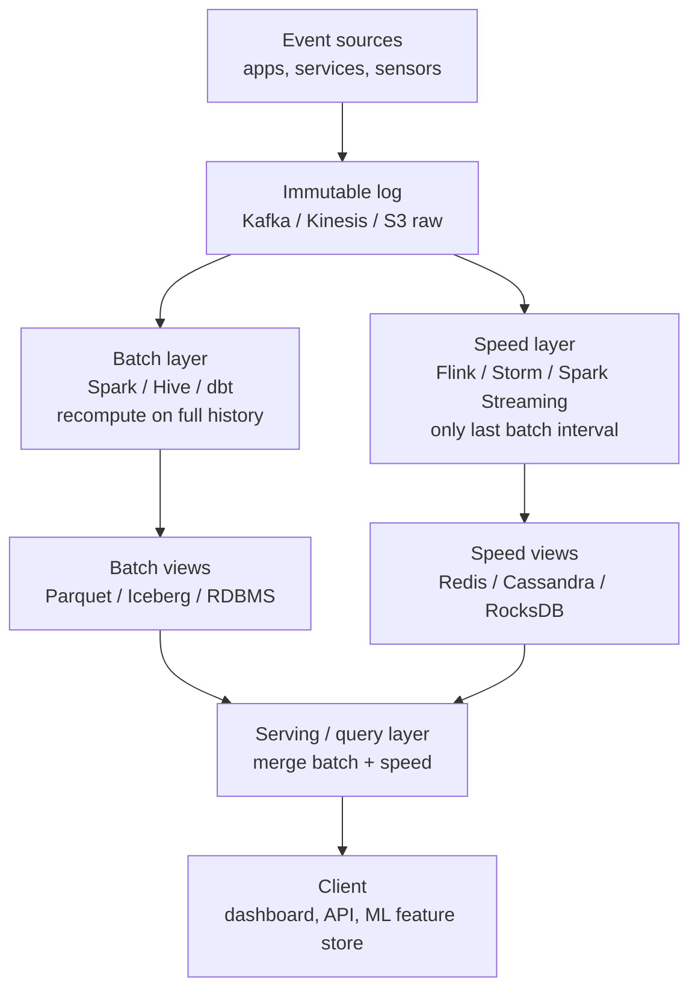
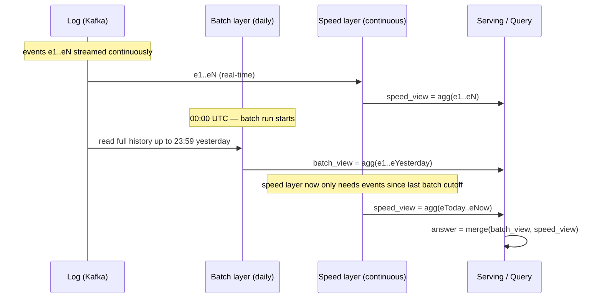

# Lambda Architecture

## Why This Exists

**Problem.** You have two conflicting requirements on the same data:

1. **Low-latency answers** — "how many active sessions right now?", fraud signals, live dashboards. Tolerance: seconds.
2. **Correct, auditable answers** — "what was GMV for May?", regulatory reporting, ML training features. Tolerance: hours, but the number must be **right**, including late events, schema changes, and bugs you discovered yesterday.

Stream processors are fast but historically struggled with: late data, exactly-once semantics, schema evolution, and **reprocessing after a logic bug**. Batch processors are correct and easy to reason about, but their freshness is measured in hours.

**Key insight (Nathan Marz, 2011).** Treat the master dataset as an **immutable, append-only log** of raw events. Compute two views in parallel:

- **Batch layer** runs over **all** historical data on a schedule (hours/daily). Output: a complete, recomputed batch view. Idempotent. If the code is buggy, fix it and rerun — the next batch view is correct.
- **Speed layer** runs over **only** the events the latest batch view doesn't yet cover. Output: a real-time view, often approximate, often incremental. Disposable: every batch tick obsoletes the speed view's claim on that window.
- **Serving layer** merges batch view + speed view at query time. The speed view's contribution is bounded — at most one batch interval — so a bug there has a bounded blast radius.

The architecture is named after the Greek letter λ because, drawn as a diagram, the two parallel paths converging at the serving layer look like the letter.

### Reach for this when

- Your **batch pipeline is the source of truth** for a regulator, finance, or ML training, and a streaming view will never be allowed to override it.
- You have a **mature batch stack already** (Spark/Hive/EMR/Snowflake) and you're bolting on real-time on top — full Kappa migration is a multi-quarter project you can't justify.
- **Reprocessing is frequent** (daily even), driven by upstream schema changes, ML feature redefinitions, or business-rule changes — and you cannot tolerate a multi-hour replay outage on the live stream.
- You need **strong, auditable correctness on long windows** (monthly aggregates, lifetime value) where the streaming engine's checkpoint/state TTL would otherwise force an unbounded state size.
- The teams owning batch and stream are organizationally separate and a unified codebase is politically infeasible — Lambda lets each team own one layer.

### Don't reach for this when

- A modern streaming engine with **event-time + watermarks + exactly-once sinks** (Flink, Kafka Streams + idempotent producers, Spark Structured Streaming, Materialize, RisingWave) can meet your correctness bar. **In 2026, this is the default — pick Kappa.**
- Your data volume is low enough that a single OLAP database (ClickHouse, DuckDB, BigQuery, Snowflake) with frequent micro-batches gives you sub-minute freshness without two pipelines.
- You don't actually need real-time. Hourly batch is fine. Don't add a speed layer because it's fashionable.
- Your team is <10 engineers. You will not staff two parallel codebases without burning out.
- Late-data tolerance is the only motivator. Watermarks + allowed lateness in Flink/Beam solve this without a second pipeline.

---

## Diagrams

### High-level data flow



### Reconciliation timeline



The critical property: at any time `T`, `batch_view` covers `[0, T - batch_lag]` and `speed_view` covers `(T - batch_lag, T]`. The speed view's window is **bounded** by the batch cadence.

---

## Core content

### The master dataset is immutable

The single rule everything else depends on: **events are facts, append-only, never mutated**. A "delete" or "correction" is a new event that supersedes the old one; the original event stays.

```python
# event schema — note the immutability discipline
@dataclass(frozen=True)
class Event:
    event_id: str        # globally unique, idempotency key
    event_time: datetime # when it actually happened (NOT ingestion time)
    ingest_time: datetime
    schema_version: int  # required — schemas WILL evolve
    payload: dict
    # NO mutable fields. Corrections come in as new events
    # with a tombstone or supersedes_id reference.
```

If you find yourself wanting to UPDATE a row in the master dataset, you've broken Lambda's premise. The whole reason batch reprocessing is safe is that the input never changes.

### Batch layer: idempotent recompute over all history

The batch job's contract: given the entire log up to time `T`, produce the batch view as a pure function of that input. Run it twice on the same input → identical output.

```python
# Spark — daily batch view of per-user session counts.
# Idempotent: rerun any day, get the same answer.

from pyspark.sql import SparkSession, functions as F

def build_batch_view(spark, raw_events_path: str, cutoff_ts: str, out_path: str):
    events = (
        spark.read.parquet(raw_events_path)
        .filter(F.col("event_time") <= F.lit(cutoff_ts))
        # critical: dedupe on event_id BEFORE aggregation.
        # The log can have duplicates (at-least-once producers).
        .dropDuplicates(["event_id"])
    )

    sessions = (
        events
        .filter(F.col("event_type") == "session_start")
        .groupBy("user_id", F.window("event_time", "1 day"))
        .agg(F.count("*").alias("session_count"))
    )

    # write atomically: write to _tmp, then rename. Readers must
    # never see a partial batch view.
    sessions.write.mode("overwrite").parquet(out_path + "/_tmp")
    # in production, use Iceberg / Delta / Hudi for atomic swap
    # instead of HDFS rename hacks.

if __name__ == "__main__":
    spark = SparkSession.builder.appName("batch-view").getOrCreate()
    build_batch_view(
        spark,
        raw_events_path="s3://lake/raw/events/",
        cutoff_ts="2026-06-04 23:59:59",
        out_path="s3://lake/views/sessions_daily/",
    )
```

Notes that matter in production:

- **Dedupe by `event_id`, not by row hash.** Producers retry; ingestion is at-least-once. If you forget this, your batch view double-counts on every retry storm.
- **Cutoff by `event_time`, not ingestion time.** Otherwise late events fall into a black hole between layers.
- **Atomic publish.** A reader must never see half a batch view. Use a table format (Iceberg, Delta, Hudi) or a "current_pointer" file the serving layer reads.
- **Versioned outputs.** Keep the last N batch views. When you discover a bug, you want to roll back, not just fix forward.

### Speed layer: bounded incremental compute

The speed layer covers only `(last_batch_cutoff, now]`. Its state size is bounded by one batch interval — that's the whole point.

```python
# Flink-style pseudocode for the speed layer.
# State TTL = batch_interval + safety_margin.
# After the next batch view publishes, this state can be dropped.

from pyflink.datastream import StreamExecutionEnvironment
from pyflink.datastream.state import ValueStateDescriptor, StateTtlConfig
from pyflink.common.time import Time

class RealtimeSessionCounter(KeyedProcessFunction):
    def open(self, ctx):
        ttl = (
            StateTtlConfig.new_builder(Time.hours(26))  # batch is daily; +2h slack
            .cleanup_incrementally(10, True)
            .build()
        )
        desc = ValueStateDescriptor("count", Types.LONG())
        desc.enable_time_to_live(ttl)
        self.count = ctx.get_state(desc)

    def process_element(self, event, ctx):
        # idempotency: the speed layer ALSO must dedupe.
        # Use a bloom filter or short-window seen-set keyed on event_id.
        if self._already_seen(event.event_id):
            return
        c = (self.count.value() or 0) + 1
        self.count.update(c)
        ctx.output(SpeedView(user_id=ctx.get_current_key(),
                             count=c,
                             as_of=event.event_time))
```

The speed layer is allowed to be:

- **Approximate.** HyperLogLog for cardinality, Count-Min Sketch for top-k. Batch will recompute exactly later.
- **Lossy on late events.** If an event arrives after the batch cutoff for its day, the speed layer can hand it to the next batch run via a "late events" topic.
- **Re-derivable.** Wipe its state, replay last batch_interval of Kafka, you're back. This is non-negotiable — it's what saves you when the speed layer crashes.

### Serving / query layer: merge with a clear precedence rule

```python
# The merge rule must be a documented invariant, not a stack of ifs.
#
# Rule: for a window [t0, t1]:
#   if t1 <= last_batch_cutoff:   answer = batch_view
#   elif t0 >  last_batch_cutoff: answer = speed_view
#   else:                          answer = batch_view([t0, cutoff])
#                                          + speed_view((cutoff, t1])
#
# The "+" operator must be associative — you're combining a corrected
# truth with an approximate increment.

def query_session_count(user_id: str, t0: datetime, t1: datetime) -> int:
    cutoff = batch_view.last_cutoff()  # cached, refreshed on batch publish

    if t1 <= cutoff:
        return batch_view.get(user_id, t0, t1)

    if t0 > cutoff:
        return speed_view.get(user_id, t0, t1)

    # straddles cutoff — split and merge
    return (
        batch_view.get(user_id, t0, cutoff)
        + speed_view.get(user_id, cutoff, t1)
    )
```

Three things break here in real systems:

1. **Cutoff skew.** The batch cutoff the serving layer thinks is current may be stale (still pointing at yesterday's run). Cache it with a short TTL and invalidate on publish.
2. **Non-additive aggregates.** `count_distinct` is not additive across windows. Either use HLL on both layers (and merge HLL sketches) or stop pretending it's additive.
3. **Schema drift.** Batch view v2 has a column the speed view v1 doesn't. The merge must tolerate column-set differences or you need a coordinated rollout.

### Reprocessing: the killer feature

The reason teams keep Lambda alive in 2026, despite Kappa being technically superior in most cases, is **reprocessing under organizational constraints**.

```bash
# Scenario: discovered a bug in session-attribution logic, in production
# for 14 days. Streaming-only Kappa would require:
#   1. spin up a parallel job with new code from offset 14d ago
#   2. wait for it to catch up (could be hours; consumer lag balloons)
#   3. atomically swap consumers — all downstream readers must handle this
#   4. hope you sized the catchup cluster right
#
# Lambda:
#   1. fix the bug in the batch job
#   2. trigger a backfill: rerun batch for the last 14 days
#      (parallelizable across days, unrelated to live traffic)
#   3. when each day's batch view republishes, serving layer atomically
#      switches to the corrected view for that window
#   4. speed layer is unchanged; its bounded window means at most one
#      batch interval is ever "wrong" by the bug, and that gets corrected
#      on the next normal batch tick.

# Backfill command in Airflow:
airflow dags backfill \
    --start-date 2026-05-22 \
    --end-date 2026-06-04 \
    --reset-dagruns \
    sessions_batch_dag
```

**This is the trade.** You pay for two codebases up front to buy: a recovery story that doesn't require pausing live traffic.

### Two-codebase pain — and how to mitigate it

The single biggest cost. Two implementations of the same business logic drift. Mitigations, in order of how often they actually work:

1. **Push logic into a shared library** (the "core abstractions" layer in Marz's *Big Data*). UDFs, stateless transforms, window functions — same JAR/wheel imported by both layers. Works for ~70% of the logic; the I/O and state shapes still differ.
2. **Generate both layers from one DSL.** Apache Beam was designed for this — write a `Pipeline`, run it on Dataflow (batch) and Flink (stream). Works when your processing is expressible in Beam's model. Doesn't work when batch needs joins/window-functions Beam streaming can't do efficiently.
3. **Property-based parity tests.** A nightly job replays the same input through both layers, asserts the outputs converge after the batch tick. Catches drift before customers do.
4. **Reduce to one layer** — Kappa. Often the right answer.

### When Lambda is justified vs Kappa

Quick decision sketch:

```
                     ┌─────────────────────────────┐
                     │ Need real-time AND          │
                     │ auditable correctness?      │
                     └──────────────┬──────────────┘
                                    │ yes
                     ┌──────────────▼──────────────┐
            ┌────────│ Can one engine (Flink, etc) │
            │ no     │ meet correctness SLO with   │
            │        │ event-time + exactly-once?  │
            │        └──────────────┬──────────────┘
            │                       │ yes → Kappa
            │
            │        ┌─────────────────────────────┐
            │ ┌──────│ Existing batch stack is the │
            │ │ yes  │ regulatory source of truth? │
            │ │      └──────────────┬──────────────┘
            │ │                     │ no
            │ │      ┌──────────────▼──────────────┐
            │ └──────│ Reprocessing is frequent &  │
            │        │ team can't tolerate replay  │
            │        │ outages?                    │
            │        └──────────────┬──────────────┘
            │                       │ yes → Lambda
            ▼                       │ no  → Kappa
         Lambda                     │
```

Jay Kreps' 2014 Kappa proposal (LinkedIn, see refs) was a direct response to Lambda's two-codebase tax. The argument: a sufficiently good log (Kafka with long retention) plus a sufficiently good stream processor (Samza/Flink) collapses both layers into one. **In 2026, that argument has won the default**, but Lambda persists where:

- The batch stack predates the streaming stack and owns regulatory reporting.
- Replay-from-log is impossible (log retention < required reprocess window, e.g. you need to recompute the last year and Kafka holds 7 days).
- The org has separate batch/stream teams and unification is political not technical.

---

## Trade-offs

| Benefit | Cost |
|---|---|
| **Correctness via batch reprocess** — bugs in business logic are recoverable by rerunning batch over immutable history. | **Two codebases** — the same logic implemented twice (batch SQL/Spark, stream Flink/Storm), drifting over time. |
| **Bounded speed-layer blast radius** — at most one batch interval of data is ever "approximate"; batch always corrects. | **Operational complexity** — two pipelines to monitor, alert on, deploy, capacity-plan. ~2× SRE load. |
| **Independent scaling of layers** — batch can use cheap spot capacity; speed layer can be sized for p99 latency. | **Reconciliation logic at query time** — the merge rule is non-trivial for non-additive aggregates (distinct counts, percentiles, top-k). |
| **Late events handled** — speed layer can forward late events to the next batch run via a side channel. | **Cutoff-skew bugs** — serving layer may use a stale `last_batch_cutoff`, double-counting events from the overlap window. |
| **Schema evolution is safer** — batch can rerun with the new schema across all history; streaming only sees forward. | **Schema drift between layers** — batch and speed views may have different columns mid-rollout; serving layer must tolerate this. |
| **Approximation is allowed in speed layer** — HLL, Count-Min Sketch, sampled top-k. Batch makes it exact. | **Approximation leaks into UX** — users see slight number wobble at every batch tick if your UI doesn't communicate the model. |
| **Replay is parallelizable** — backfill 30 days as 30 parallel batch jobs, no impact on live traffic. | **Storage cost** — keep the full immutable log forever (or for the longest reprocess window), plus N batch view versions. |
| **Familiar batch tooling** — SQL, dbt, Airflow, Spark — large hiring pool. | **Latency floor at the merge boundary** — answers for "right now" are limited by speed-layer latency; answers spanning the cutoff have a small consistency window. |

---

## Common Pitfalls

- **Mutating the master dataset.** Someone "fixes" a bad event row by UPDATEing it. Now batch reprocess produces a different answer than last time, and your audit trail is destroyed. Tombstones and supersedes-by are the only acceptable corrections.
- **Forgetting to dedupe in the batch layer.** At-least-once delivery is the default. If your batch SUM/COUNT doesn't `dropDuplicates(event_id)`, your nightly numbers are inflated by every retry storm. This bug is silent and chronic.
- **Using `current_timestamp()` instead of `event_time`** in batch SQL. Late events get assigned to the wrong day, and the speed layer's late-event side channel never reaches batch. Always partition and window by `event_time`.
- **Speed layer state without TTL.** "It's just last 24h of state" — six months later it's a 4 TB RocksDB and a stop-the-world compaction is killing your p99. The TTL is what makes the speed layer disposable; without it, you have two batch layers.
- **Non-additive aggregates merged additively.** `batch_view.distinct_users + speed_view.distinct_users` overcounts overlap. Either store HLL sketches on both layers and merge them, or query the union of the underlying sets — never simple addition.
- **Cutoff misalignment.** Batch publishes at 02:00 with cutoff `00:00:00`, but speed layer kept emitting from `23:59:30` onward. The 30-second overlap double-counts. Pin the cutoff in the published batch view metadata; serving layer reads it from there, not from a config file.
- **Backfill stomping live data.** Backfilling May reuses the same output table the live batch writes to and clobbers June's view because the partition predicate was wrong. Backfills must write to versioned, dated partitions and atomically swap pointers.
- **No parity test between layers.** Drift accumulates silently for months. The first signal is a customer asking "why does the dashboard say X and the report say Y?" — by which point both layers' code has moved 50 commits and you can't bisect. Run a daily parity job that diffs batch view vs (snapshot of speed view at batch cutoff) and pages on >ε difference.
- **Treating Kafka as the master dataset.** Kafka retention is typically 7-30 days. If your reprocess window is longer than retention, your "immutable log" is actually a sliding window. Mirror the log to S3/GCS as raw Parquet/Avro for the real master dataset; Kafka is the transport.
- **Schema-version mismatch at merge time.** Batch deploys v2 with a new column; speed layer is still v1. The merge JOIN errors out at 02:30 every night for two weeks until someone notices. Coordinated schema rollout, or a serving-layer adapter that projects to a common schema.
- **Adopting Lambda because it's "the architecture".** Marz's book is from 2015. Beam, Flink, and exactly-once Kafka post-date it. Many teams in 2018-2022 built Lambda because a blog post said to, and now run two pipelines for a workload one Flink job could handle. Re-evaluate.

---

## Decision Table

| Situation | Choose | Why |
|---|---|---|
| Greenfield real-time dashboard, single eng team, sub-minute freshness, exactly-once sinks available | **Kappa** (Flink / Spark Structured Streaming) | One codebase, modern stream engines handle late events + exactly-once well enough. |
| Existing daily batch pipeline (regulatory truth) + new real-time dashboard layered on top | **Lambda** | Don't rewrite the audited batch job; bolt a speed layer alongside. |
| Reprocess window > Kafka retention (e.g. 1 year of history, Kafka holds 7 days) | **Lambda** with S3/GCS as master log | Stream replay is impossible past retention; batch reads object storage. |
| Aggregates are simple (counts, sums) and exactly-once Kafka + Flink stateful job is feasible | **Kappa** | Lambda's two-codebase tax has no payoff here. |
| Need approximate real-time + exact historical (e.g. top-k trending, GMV by hour) | **Lambda** with HLL/CMS in speed layer | Batch produces exact; speed layer produces approximate — clearly communicated. |
| ML feature store with online serving + offline training | **Lambda-shaped** (online store + offline store with sync) | Industry standard (Feast, Tecton). The two stores ARE the two layers. |
| Single OLAP DB (ClickHouse/BigQuery/Snowflake) can hit your freshness SLO with micro-batch | **Neither — just OLAP** | If 1-5 min freshness is enough, skip stream entirely. Cheapest, simplest. |
| Materialized-view DB (Materialize, RisingWave, ksqlDB) covers the workload | **Kappa-on-DB** | Streaming SQL with strong consistency — Lambda's reconciliation is built in. |
| Two separate org units (data eng owns batch, platform owns stream) | **Lambda** (pragmatically) | Conway's Law. A unified Kappa pipeline crossing org boundaries usually fails politically. |
| Ad-tech / clickstream with billions/day, sub-second decisioning | **Kappa with snapshot** | Pure Lambda's batch lag is too slow for bidding; Kappa with periodic offline snapshots for training. |
| Financial reconciliation, T+1 settlement | **Lambda** | Batch IS the legal record; speed layer is a UX-only convenience. |

---

## References

- Nathan Marz — *How to beat the CAP theorem* (originating post, 2011) — http://nathanmarz.com/blog/how-to-beat-the-cap-theorem.html
- Nathan Marz & James Warren — *Big Data: Principles and best practices of scalable real-time data systems* (Manning, 2015). The canonical Lambda Architecture text. ISBN 978-1617290343.
- Jay Kreps — *Questioning the Lambda Architecture* (O'Reilly Radar, 2014) — https://www.oreilly.com/radar/questioning-the-lambda-architecture/  (the Kappa counter-proposal)
- Jay Kreps — *The Log: What every software engineer should know about real-time data's unifying abstraction* (LinkedIn Engineering, 2013) — https://engineering.linkedin.com/distributed-systems/log-what-every-software-engineer-should-know-about-real-time-datas-unifying
- Martin Kleppmann — *Designing Data-Intensive Applications* (O'Reilly, 2017). Especially **ch. 11 — Stream Processing** ("The Lambda architecture", "Unifying batch and stream processing") and **ch. 10 — Batch Processing** ("Beyond MapReduce").
- Tyler Akidau et al. — *The Dataflow Model: A Practical Approach to Balancing Correctness, Latency, and Cost in Massive-Scale, Unbounded, Out-of-Order Data Processing* (VLDB 2015) — https://research.google/pubs/the-dataflow-model-a-practical-approach-to-balancing-correctness-latency-and-cost-in-massive-scale-unbounded-out-of-order-data-processing/
- Tyler Akidau — *Streaming 101 / 102* (O'Reilly, 2015–2016) — https://www.oreilly.com/radar/the-world-beyond-batch-streaming-101/  and https://www.oreilly.com/radar/the-world-beyond-batch-streaming-102/
- Apache Beam — programming model documentation — https://beam.apache.org/documentation/programming-guide/
- Apache Flink — *Stateful Stream Processing* — https://nightlies.apache.org/flink/flink-docs-stable/docs/concepts/stateful-stream-processing/
- Confluent — *Streaming Data Architectures: Lambda vs Kappa* — https://www.confluent.io/learn/lambda-architecture/
- AWS Big Data Blog — *Lambda Architecture for batch and stream processing on AWS* — https://aws.amazon.com/blogs/big-data/
- AWS Builders' Library — https://aws.amazon.com/builders-library/  (general distributed-systems patterns)
- Dean Wampler — *Fast Data Architectures for Streaming Applications* (O'Reilly, 2nd ed.). Discussion of Lambda → Kappa migration paths.
- Feast — *Online vs Offline Stores* (the ML-feature-store realization of Lambda) — https://docs.feast.dev/getting-started/architecture/overview
- Pat Helland — *Immutability Changes Everything* (CIDR 2015 / CACM 2016) — https://queue.acm.org/detail.cfm?id=2884038  (foundational argument for the immutable-log substrate)

---

## See Also

- `../event-sourcing/` — the immutable-log discipline Lambda depends on, applied at the application/domain level
- `../cqrs/` — same read/write split idea applied to OLTP; Lambda is its analytics-scale cousin
- `../kappa-architecture/` — the single-stream alternative; read this side-by-side
