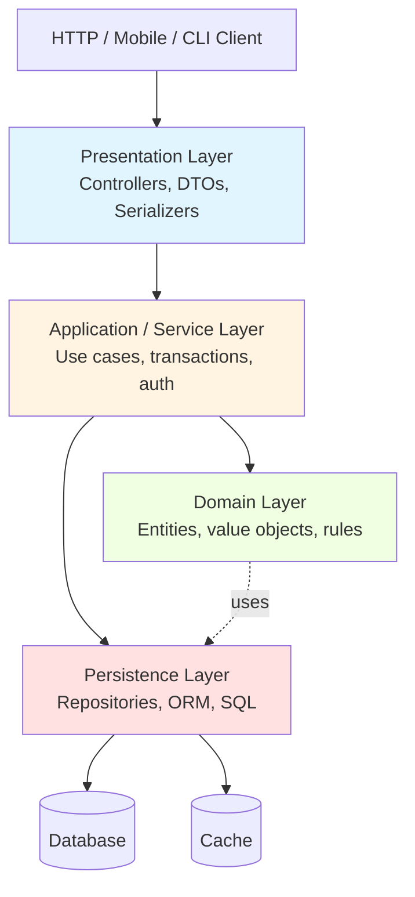
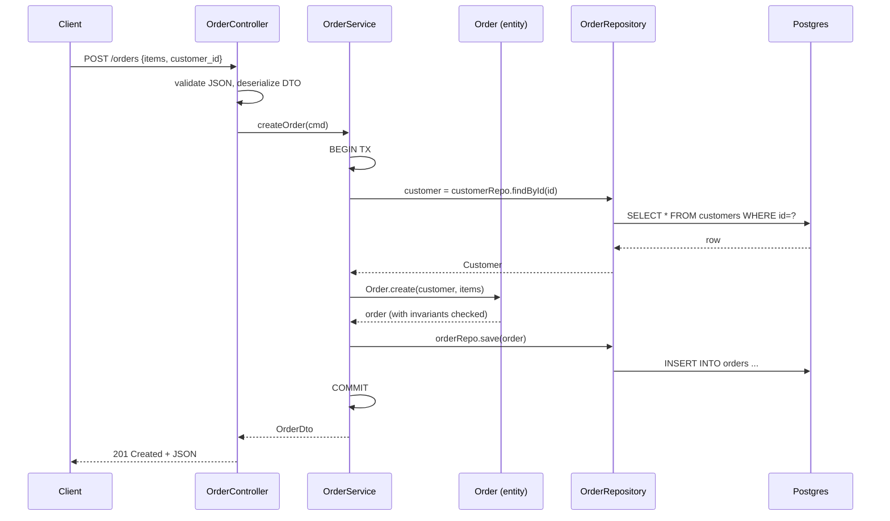

# Layered Architecture

## Why This Exists

**Problem.** When a service grows past a few endpoints, code that mixes HTTP parsing, validation, business rules, SQL, and response shaping in one function becomes unreadable, untestable, and impossible to change safely. Two developers touching the same `OrderController.create()` produce merge conflicts on every PR, and the third developer adds a fourth copy of the discount-calculation logic because the first three were buried inside controllers.

**Key insight.** Most line-of-business software is *transaction-script-shaped*: a request comes in, validate it, fetch some rows, mutate some rows, commit, return a response. Layered architecture takes that shape seriously and gives each concern a home: **presentation** (HTTP/CLI/gRPC adapter), **application/service** (use-case orchestration, transactions), **domain** (rules, invariants — sometimes thin), **persistence** (SQL, ORM, cache). Dependencies point downward only.

It is the **default** architecture for a reason: it's understood by every developer, it maps cleanly onto MVC frameworks (Spring, Rails, Django, Laravel, ASP.NET), and it gets a CRUD app to production fast. Fowler's *Patterns of Enterprise Application Architecture* (2002) catalogued it because it was already ubiquitous twenty years ago.

**Reach for this when:**
- The system is dominantly CRUD: forms, lists, detail pages, reports.
- Business rules are simple enough to fit in service methods (validate inputs, compute totals, enforce a few constraints).
- The team is small (≤ 8 devs) or new to the domain — onboarding cost matters more than purity.
- You will deploy as a single process / monolith, or a small set of services each with one database.
- Latency budget is loose (tens of ms or more); the layer indirection cost is irrelevant.

**Don't reach for this when:**
- The domain has rich invariants spanning multiple entities (financial trading, insurance underwriting, supply chain). Use **hexagonal/ports-and-adapters** with a real domain model — see `../hexagonal/` and `../../code-design/ddd/`.
- You need to swap the database, run multi-tenant with different storage backends, or test the domain without any persistence — hexagonal/clean architecture pays off here.
- The system is event-driven or stream-processing first — see `../event-driven/` and `../event-sourcing/`.
- You're building a library, framework, or compiler — layered is for I/O-shaped applications.

## Diagrams

### The classic four layers



Dependencies point **downward only**. Presentation depends on Application; Application depends on Domain and Persistence; Persistence depends on the DB driver. **Nothing in the lower layers ever imports anything from the upper layers** — that is the rule whose violation produces every layered-architecture pathology.

### Request lifecycle (sequenceDiagram)



The transaction boundary lives in the **service layer** — not in the controller (too coarse, holds a TX while parsing JSON), not in the repository (too fine, can't span multiple aggregates). This is the single most-violated rule in layered codebases.

## Core Patterns

### 1. The four layers, concretely (Python / FastAPI + SQLAlchemy)

```python
# ─────────────────────────────────────────────────────────────────
# presentation/orders_controller.py — HTTP adapter only.
# Knows about FastAPI, Pydantic, status codes. Knows NOTHING about SQL.
# ─────────────────────────────────────────────────────────────────
from fastapi import APIRouter, Depends, HTTPException
from pydantic import BaseModel
from app.application.order_service import OrderService, OrderNotFound, InvalidOrder

router = APIRouter(prefix="/orders")

class CreateOrderRequest(BaseModel):
    customer_id: str
    items: list[dict]  # {sku, qty}

class OrderResponse(BaseModel):
    id: str
    total_cents: int
    status: str

@router.post("", response_model=OrderResponse, status_code=201)
def create_order(
    body: CreateOrderRequest,
    svc: OrderService = Depends(),
):
    try:
        order = svc.create_order(body.customer_id, body.items)
    except InvalidOrder as e:
        # Translate domain error → HTTP. Domain doesn't know about HTTP.
        raise HTTPException(status_code=400, detail=str(e))
    return OrderResponse(id=order.id, total_cents=order.total_cents, status=order.status)


# ─────────────────────────────────────────────────────────────────
# application/order_service.py — orchestrates a use case.
# Owns the transaction boundary. Calls repositories and domain.
# ─────────────────────────────────────────────────────────────────
from sqlalchemy.orm import Session
from app.domain.order import Order
from app.persistence.order_repository import OrderRepository
from app.persistence.customer_repository import CustomerRepository

class InvalidOrder(Exception): ...
class OrderNotFound(Exception): ...

class OrderService:
    def __init__(self, session: Session, orders: OrderRepository, customers: CustomerRepository):
        self._session = session
        self._orders = orders
        self._customers = customers

    def create_order(self, customer_id: str, items: list[dict]) -> Order:
        # Transaction begins here, ends here. Single use case = single TX.
        with self._session.begin():
            customer = self._customers.find(customer_id)
            if customer is None:
                raise InvalidOrder(f"customer {customer_id} not found")
            if not customer.is_active:
                raise InvalidOrder("customer is not active")

            order = Order.create(customer=customer, items=items)  # invariants in domain
            self._orders.save(order)
            return order


# ─────────────────────────────────────────────────────────────────
# domain/order.py — pure Python. No ORM imports, no FastAPI, no I/O.
# Can be unit tested with zero infrastructure.
# ─────────────────────────────────────────────────────────────────
from dataclasses import dataclass, field
from uuid import uuid4
from app.domain.customer import Customer

@dataclass
class OrderLine:
    sku: str
    qty: int
    unit_price_cents: int

    @property
    def subtotal_cents(self) -> int:
        return self.qty * self.unit_price_cents

@dataclass
class Order:
    id: str
    customer_id: str
    lines: list[OrderLine]
    status: str = "PENDING"

    @classmethod
    def create(cls, customer: Customer, items: list[dict]) -> "Order":
        if not items:
            raise ValueError("order must have at least one line item")
        lines = [OrderLine(sku=i["sku"], qty=i["qty"], unit_price_cents=i["price"]) for i in items]
        if any(l.qty <= 0 for l in lines):
            raise ValueError("line quantities must be positive")
        return cls(id=str(uuid4()), customer_id=customer.id, lines=lines)

    @property
    def total_cents(self) -> int:
        return sum(l.subtotal_cents for l in self.lines)


# ─────────────────────────────────────────────────────────────────
# persistence/order_repository.py — the only place that knows SQL.
# ─────────────────────────────────────────────────────────────────
from sqlalchemy.orm import Session
from sqlalchemy import select
from app.domain.order import Order
from app.persistence.models import OrderRow, OrderLineRow  # ORM models

class OrderRepository:
    def __init__(self, session: Session):
        self._session = session

    def find(self, order_id: str) -> Order | None:
        row = self._session.get(OrderRow, order_id)
        return _to_domain(row) if row else None

    def save(self, order: Order) -> None:
        # Map domain → ORM row. The domain object never leaks into upper layers
        # carrying a live SQLAlchemy session — that is layer leakage.
        row = OrderRow(id=order.id, customer_id=order.customer_id, status=order.status)
        row.lines = [OrderLineRow(sku=l.sku, qty=l.qty, unit_price_cents=l.unit_price_cents)
                     for l in order.lines]
        self._session.merge(row)

def _to_domain(row: OrderRow) -> Order:
    return Order(id=row.id, customer_id=row.customer_id, status=row.status,
                 lines=[OrderLine(l.sku, l.qty, l.unit_price_cents) for l in row.lines])
```

The four files above are the **whole pattern**. Notice:
- `presentation/` imports `application/`. `application/` imports `domain/` and `persistence/`. `persistence/` imports `domain/`. **No reverse arrows.**
- The Pydantic `OrderResponse` is *not* the domain `Order`. They are separate types that happen to overlap. (See pitfall #1.)
- The transaction lives in the service. The repository participates in whatever TX is open.

### 2. Strict vs. relaxed layering

**Strict (closed) layering**: layer N can only call layer N−1. Presentation → Application → Domain → Persistence; presentation **may not** call persistence directly.

**Relaxed (open) layering**: layer N can call any layer below it. Presentation may call Persistence directly for a read-only "list users" endpoint that needs no business logic.

```python
# Relaxed: read-only endpoint skips the service layer.
@router.get("/users")
def list_users(repo: UserRepository = Depends()):
    return [UserDto.from_row(r) for r in repo.list_all()]
```

Most teams should pick **relaxed for queries, strict for commands**. Reads with no business logic don't benefit from a service-layer pass-through; writes always go through the service so transaction boundaries and invariants are enforced. This is also the seed of CQRS — see `../event-sourcing/`.

### 3. Transaction Script vs. Domain Model — the fork in the road

Fowler (PoEAA, ch. 2 & 9) draws a sharp distinction:

- **Transaction Script**: each use case is a procedure. Logic lives in the service layer; entities are dumb data containers (sometimes called "anemic"). Easy to read top-to-bottom. Scales poorly past ~hundreds of business rules — duplication and inconsistency creep in.
- **Domain Model**: entities own their behavior. Service layer becomes thin glue. Scales to rich domains. Higher upfront cost, requires team discipline.

```python
# ── Transaction Script style — service does everything ──
class OrderService:
    def cancel(self, order_id: str, reason: str):
        with self._session.begin():
            order = self._orders.find(order_id)
            if order is None:
                raise OrderNotFound()
            if order.status == "SHIPPED":
                raise InvalidOrder("cannot cancel shipped order")
            if order.status == "CANCELLED":
                return  # idempotent
            order.status = "CANCELLED"
            order.cancelled_reason = reason
            self._orders.save(order)
            self._notifier.send_cancellation(order.customer_id, order.id)

# ── Domain Model style — entity owns its rules ──
class Order:
    def cancel(self, reason: str) -> list[DomainEvent]:
        if self.status == "SHIPPED":
            raise InvalidOrder("cannot cancel shipped order")
        if self.status == "CANCELLED":
            return []
        self.status = "CANCELLED"
        self.cancelled_reason = reason
        return [OrderCancelled(order_id=self.id, customer_id=self.customer_id)]

class OrderService:
    def cancel(self, order_id: str, reason: str):
        with self._session.begin():
            order = self._orders.find(order_id) or _raise(OrderNotFound())
            events = order.cancel(reason)
            self._orders.save(order)
            for e in events:
                self._bus.publish(e)
```

The right choice depends on rule density. Heuristic: if your domain entities have ≤ 3 state-changing methods each and the rules fit on one screen per entity, **transaction script is fine and probably better**. If you're cramming complex invariants into service methods that are 200 lines long with nested if-statements, **graduate to a domain model**.

### 4. Layer leakage: what it looks like and how to spot it

Layer leakage is when knowledge of a lower layer escapes upward, or knowledge of an upper layer escapes downward. The five most common forms:

```python
# BAD: LEAK 1: ORM entities returned from controller.
# SQLAlchemy session detaches the object → lazy-load explosion in the JSON serializer.
@router.get("/orders/{id}")
def get(id: str, repo: OrderRepository = Depends()):
    return repo.find_row(id)  # returns OrderRow (ORM model) — leaks persistence into HTTP

# GOOD: FIX: map to a DTO at the boundary.
@router.get("/orders/{id}")
def get(id: str, svc: OrderService = Depends()):
    order = svc.find(id)
    return OrderResponse.from_domain(order)


# BAD: LEAK 2: HTTP concerns in the service layer.
class OrderService:
    def create(self, request: Request):  # FastAPI Request — service should not import this
        body = request.json()
        ...

# GOOD: FIX: controller parses, service takes plain values or a command DTO.
class OrderService:
    def create(self, customer_id: str, items: list[OrderItem]) -> Order: ...


# BAD: LEAK 3: SQL in the service.
class OrderService:
    def list_recent(self):
        return self._session.execute(text("SELECT * FROM orders WHERE created_at > now() - interval '7 days'"))

# GOOD: FIX: query method on repository.
class OrderRepository:
    def list_since(self, cutoff: datetime) -> list[Order]: ...


# BAD: LEAK 4: domain calls the database (via global session).
class Order:
    def cancel(self):
        db.session.execute("UPDATE orders SET status='CANCELLED' WHERE id=?", self.id)

# GOOD: FIX: domain mutates self, repository persists.


# BAD: LEAK 5: repository contains business rules.
class OrderRepository:
    def save(self, order: Order):
        if order.total_cents > 100000:
            order.requires_approval = True   # business rule in persistence!
        self._session.merge(_to_row(order))

# GOOD: FIX: rule belongs in Order or service.
```

Static enforcement: tools like **ArchUnit** (Java), **archlint** / **import-linter** (Python), **dependency-cruiser** (TS) can fail the build when imports cross layer boundaries. Worth setting up on day one.

```yaml
# .importlinter — Python example
[importlinter]
root_package = app
[importlinter:contract:layers]
name = Layered architecture
type = layers
layers =
    app.presentation
    app.application
    app.domain
    app.persistence
```

### 5. Repository pattern — done right and done wrong

```python
# BAD: WRONG: a "repository" that's just session.execute() with a different name.
class UserRepository:
    def execute(self, sql: str, params: dict): return self._session.execute(sql, params)

# BAD: WRONG: a generic CRUD repository with no domain meaning.
class Repository(Generic[T]):
    def get(self, id): ...
    def save(self, t: T): ...
    def delete(self, id): ...
    def find_all(self): ...   # which is then called from controllers to load 10M rows

# GOOD: RIGHT: a collection-like interface, with query methods named in domain language.
class OrderRepository:
    def find(self, id: str) -> Order | None: ...
    def save(self, order: Order) -> None: ...
    def find_pending_for_customer(self, customer_id: str) -> list[Order]: ...
    def find_overdue(self, as_of: datetime) -> Iterable[Order]: ...
```

Rule of thumb: if your repository has methods that mirror SQL verbs (`select`, `update_where`), it's not a repository, it's a thin wrapper. A real repository has methods that mirror **business questions**.

## Trade-offs

| Benefit | Cost |
|---|---|
| Universally understood — any backend dev can navigate the codebase | Encourages anemic domain models when business rules grow complex |
| Maps cleanly onto MVC frameworks (Spring, Rails, Django, .NET) | Hard layer boundaries can require boilerplate DTOs / mappers between layers |
| Clear seam for unit tests at each layer | Strict layering forces pass-through methods that add no value |
| Repository abstraction makes swapping ORM/DB feasible (rarely exercised in practice) | Most teams never actually swap the DB; the abstraction is paid-for and unused |
| Service layer is a natural transaction boundary | Use cases that span multiple services force distributed transactions or saga patterns |
| Onboarding-friendly — junior devs can ship a CRUD endpoint in a day | Senior devs writing rich domains chafe against the "service-orchestrates-anemic-entities" pattern |
| Compatible with relaxed layering for read paths | Mixed strict/relaxed conventions on one team produce inconsistency |
| Static layer-import linting catches violations at build time | Without enforcement, layers blur within 6 months on any team > 4 devs |

## Common Pitfalls

- **Anemic domain model masquerading as DDD.** Teams adopt `domain/` folders and `Entity` base classes, then put all the logic in `*Service` classes. You have layered + transaction script with extra ceremony. That's *fine* — but call it what it is, don't pretend it's DDD. Fowler called this out in 2003: "AnemicDomainModel."
- **God services.** `OrderService` grows to 4,000 lines because every order-touching feature lands there. Split by use case (`PlaceOrderService`, `CancelOrderService`, `RefundOrderService`) before it metastasizes. This is the gateway drug to CQRS / vertical slices.
- **Controllers that "just" call the repo for performance.** Someone profiles a hot endpoint, decides the service-layer indirection costs 50µs, and bypasses it. Six months later, that endpoint has business logic in the controller and the team has forgotten why the rule existed. **Either keep the rule strict, or document the relaxed-layering exception in CONTRIBUTING.md.**
- **Lazy-loading exploding in the serializer.** ORM entities returned from controllers trigger N+1 queries when the JSON serializer walks relationships. Always map to a DTO at the controller boundary, and load the data the response needs via an explicit query.
- **Transactions held across HTTP boundaries.** `@Transactional` on a controller method holds the DB transaction while the framework serializes the response, including network time. Move TX into the service. Never let TX scope outlive the use case.
- **Repository methods that return ORM cursors / `Query` objects.** Now the caller (service or controller) knows about ORM semantics. Return concrete domain objects or `list[Domain]` / `Iterable[Domain]`.
- **"Domain" entities that are SQLAlchemy / Hibernate / EF entities.** This is the active-record blur. It works, and most CRUD apps are happier with active-record than with separate domain + ORM models — but if you do it, **acknowledge that you've collapsed the domain and persistence layers**, and don't pretend you have a hexagonal architecture.
- **DTO explosion.** Every endpoint gets a `CreateXRequest`, `XResponse`, `UpdateXRequest`, `XSummaryResponse`, `XDetailResponse`. The DTO layer becomes larger than the rest of the codebase. Push back: reuse DTOs across endpoints when the schemas truly match, and lean on framework features (Pydantic field excludes, JsonView in Jackson).
- **The "service" layer is just a thin wrapper.** Every method is `return self._repo.find(id)`. You added a layer for no reason. Either delete the service for that operation (relaxed layering) or move real orchestration in.
- **Cross-aggregate transactions hidden in services.** `transferMoney(from, to)` opens one TX and updates two aggregates. Fine in a monolith, deadly when one of those aggregates moves to another service. Plan for **eventual consistency between aggregates** even within a monolith — it makes the future split painless. (See `../event-sourcing/` and saga patterns.)

## Decision Table

| If … | Use | Don't use |
|---|---|---|
| CRUD-heavy app, small/medium team, single DB | **Layered (this skill)** | Hexagonal — overkill |
| Domain has rich invariants, many state machines, regulatory constraints | Hexagonal + DDD (`../hexagonal/`, `../../code-design/ddd/`) | Layered — produces anemic god-services |
| Read paths and write paths have wildly different query shapes | CQRS (`../event-sourcing/`) | Pure layered — repository becomes split-brained |
| Need full audit trail of every state change | Event Sourcing (`../event-sourcing/`) | Layered — you'll bolt on an `audit_log` table that drifts |
| You'll run multiple persistence backends (Postgres + DynamoDB) per tenant | Hexagonal with strict ports | Layered — repository abstraction will leak |
| Greenfield service, deadline next week, three developers | **Layered, relaxed for reads** | Clean Architecture — too much boilerplate for the timeline |
| You're modeling workflows / sagas spanning many services | Orchestration / choreography patterns (`../microservices/`) | Layered alone — service layer has no concept of long-running work |
| The domain is "data in, data out" with little branching logic | **Layered + Transaction Script** | Domain Model — yields ceremony with no payoff |
| Rules are dense (insurance, trading, healthcare claims) | **Layered + Domain Model** (or hexagonal) | Transaction Script — duplication explodes |
| The service is fundamentally a stream/event processor | Stream-processing pipelines (`../event-driven/`, `../../data-systems/stream-processing/`) | Layered — request/response shape doesn't match |

## References

- Martin Fowler — *Patterns of Enterprise Application Architecture* (2002), ch. 1 ("Layering"), ch. 9 ("Domain Logic Patterns"), ch. 10 ("Data Source Architectural Patterns") — the canonical treatment. Chapter summaries: https://martinfowler.com/eaaCatalog/
- Martin Fowler — "AnemicDomainModel" — https://martinfowler.com/bliki/AnemicDomainModel.html
- Martin Fowler — "TransactionScript" — https://martinfowler.com/eaaCatalog/transactionScript.html
- Martin Fowler — "Repository" — https://martinfowler.com/eaaCatalog/repository.html
- Eric Evans — *Domain-Driven Design: Tackling Complexity in the Heart of Software* (2003), ch. 4 ("Isolating the Domain"), ch. 5 ("A Model Expressed in Software"), ch. 6 ("The Lifecycle of a Domain Object" — repositories).
- Vaughn Vernon — *Implementing Domain-Driven Design* (2013), ch. 4 ("Architecture") — compares layered, hexagonal, REST, event-driven.
- Robert C. Martin — *Clean Architecture* (2017), ch. 17–22 — the dependency-rule formalization that generalizes layered.
- Microsoft — "N-tier architecture style" — https://learn.microsoft.com/en-us/azure/architecture/guide/architecture-styles/n-tier
- Microsoft — "Common web application architectures" (eShopOnWeb / .NET) — https://learn.microsoft.com/en-us/dotnet/architecture/modern-web-apps-azure/common-web-application-architectures
- DDIA (Kleppmann, 2017) — ch. 1 ("Reliable, Scalable, and Maintainable Applications") for the operability/evolvability lens that motivates layering.
- Spring Framework Reference — "Layering your application" — https://docs.spring.io/spring-framework/reference/
- AWS Builders' Library — https://aws.amazon.com/builders-library/ — see "Avoiding overload in distributed systems" for service-layer back-pressure patterns that apply directly to layered services.
- Sam Newman — *Building Microservices* (2nd ed., 2021), ch. 2 — when a layered monolith should and shouldn't be split.
- Alistair Cockburn — "Hexagonal Architecture" (2005) — https://alistair.cockburn.us/hexagonal-architecture/ — the canonical alternative; understand it to know when layered is too weak.

## See Also

- `../hexagonal/` — ports and adapters; the upgrade path when layered's persistence coupling hurts.
- `../clean-architecture/` — Uncle Bob's dependency-rule generalization; layered-with-stricter-rules.
- `../../code-design/ddd/` — Domain-Driven Design; what to do when business rules grow past transaction script.
- `../event-sourcing/` — separate read and write models; natural next step from relaxed layering.
- `../event-driven/` — when request/response stops fitting the workload.
- `../microservices/` — when the monolith's layered services need to become independently deployable.
- `../modular-monolith/` — layered but with module boundaries inside the monolith; often a better stop than microservices.
