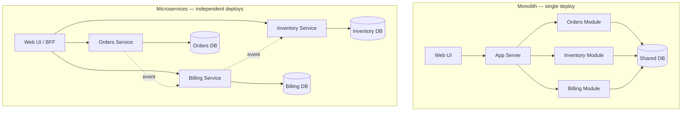
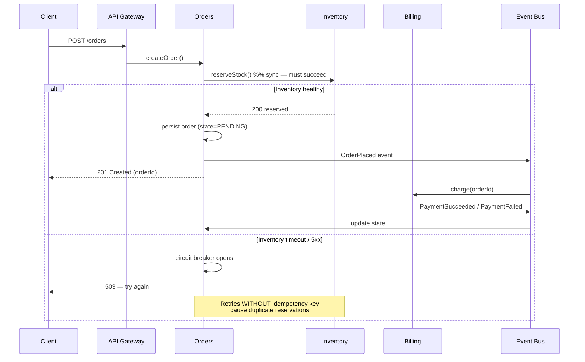

# Microservices

## Why This Exists

**Problem.** A single deployable unit (the "majestic monolith") works beautifully until it doesn't. Symptoms that push teams toward microservices:

- **Release-train contention.** Five teams want to ship Friday; one team's bug rolls back everyone's features.
- **Coupled scaling.** The checkout path is CPU-bound; the catalog is read-heavy. You're paying for both profiles on every box.
- **Blast-radius incidents.** A memory leak in the recommendation module OOM-kills the order-placement path. *"Why did checkout 500 when only the homepage carousel changed?"*
- **Conway friction.** Org has 8 teams. Codebase has 1 commit log. Merge conflicts, ownership ambiguity, and "who runs the build pipeline this week" eat a third of engineering time.
- **Data-model gridlock.** Marketing wants a denormalized analytics view; operations needs strict transactional integrity. Same schema. Endless meetings.

**Key insight.** Microservices are an **organizational scaling pattern that happens to be implemented in software**. The unit of decomposition is the **bounded context** (DDD) aligned to a team that can deploy, operate, and own data independently. If you split services without splitting teams and data, you get a **distributed monolith** — all the cost, none of the benefit.

> "If you can't build a well-structured monolith, what makes you think you can build a well-structured set of microservices?" — Simon Brown

**Reach for this when:**
- You have ≥3 teams (≥15-25 engineers) and Conway's Law is already biting.
- Distinct bounded contexts have **different rates of change, different scaling profiles, or different consistency needs**.
- You have the prerequisite plumbing: CI/CD per service, centralized observability, on-call rotations, schema evolution discipline. (Sam Newman's preconditions.)
- You can answer "who owns this data?" with a single team name per table.

**Don't reach for this when:**
- You're a startup with <10 engineers shipping a v1. **Build a modular monolith.** You can extract services later; you cannot un-fragment a wrongly-cut system without a multi-quarter rewrite.
- You have one team. Microservices give you network calls between modules that used to be function calls. You traded `NullPointerException` for `502 Bad Gateway` plus 100ms of latency.
- Your bounded contexts aren't stable yet. Splitting a service across the wrong seam costs ~10x what splitting a class costs.
- You don't have automated deploy + rollback + observability. Microservices on hand-managed infra is a beeper-on-fire generator.

## Diagrams

### Monolith vs microservices: the deployment unit



Critical detail: in the right-hand picture, **each service owns its database**. No cross-service SQL joins. Cross-context data flows via API or events — never via shared tables. This is the single most important rule and the one most often violated.

### A request and its failure modes



**Lessons baked into this diagram:**
- The synchronous call to Inventory is the **coupling point**. If Inventory is down, Orders is down. Every sync hop multiplies failure probability: `(1 - p)^n`.
- Billing is **asynchronous via events** because eventual consistency is acceptable for "did the card charge?". Orders shows `PENDING` until the event arrives. This decouples availability.
- The retry-without-idempotency-key trap on the right is how you ship duplicate charges to customers.

## Core patterns and code

### 1. Bounded contexts → service boundaries

The bounded-context boundary is where the **ubiquitous language changes meaning**. "Customer" in Sales (= prospect) is not the same as "Customer" in Billing (= account with payment method) is not the same as "Customer" in Support (= person with a ticket). Each is its own service with its own model.

**Heuristic: split when these diverge across two parts of the codebase.**

| Axis | Split signal |
|---|---|
| Rate of change | One area gets daily commits, another quarterly |
| Scaling profile | Read-heavy vs write-heavy, CPU vs IO bound, bursty vs steady |
| Consistency need | Strong (payments) vs eventual (recommendations) |
| Compliance scope | PCI / HIPAA / GDPR isolation |
| Team ownership | Two teams, two on-call rotations |
| Data lifecycle | OLTP vs analytical, hot vs cold |

If only **one** of these splits, you probably want a module, not a service.

### 2. Smart endpoints, dumb pipes (Fowler/Lewis)

The integration pipe (Kafka, RabbitMQ, HTTP) is **dumb**: it routes bytes. The endpoints are **smart**: they own validation, business logic, and state machines. Anti-pattern: ESB-era "intelligent" middleware that orchestrates business logic — you've recreated the monolith inside the bus.

```python
# Smart endpoint: Orders service owns the order state machine
# Dumb pipe: it just publishes an event; doesn't know who consumes it

class OrdersService:
    def __init__(self, db, event_bus, inventory_client):
        self.db = db
        self.bus = event_bus
        self.inventory = inventory_client

    def place_order(self, cmd: PlaceOrderCommand) -> OrderId:
        # Validate inside this service — don't trust the gateway,
        # don't ask another service for "is this allowed?"
        if cmd.total <= 0:
            raise InvalidOrder("total must be positive")

        # Idempotency: same client_request_id → same order_id, no dup.
        existing = self.db.find_by_client_request_id(cmd.client_request_id)
        if existing:
            return existing.id

        # Synchronous coupling — only for hard preconditions.
        # Anything else goes async.
        try:
            reservation = self.inventory.reserve(
                items=cmd.items,
                idempotency_key=cmd.client_request_id,  # <-- critical
                timeout_ms=500,
            )
        except InventoryUnavailable:
            # Don't half-place the order. Fail fast.
            raise OrderRejected("stock check failed")

        order = Order.new(cmd, reservation_id=reservation.id, state="PENDING")
        # Outbox pattern: write order + event in same DB tx, then publish.
        # Without this, you can persist the order and crash before publishing
        # → silent data divergence between Orders and Billing.
        with self.db.transaction() as tx:
            tx.save(order)
            tx.save_outbox_event("OrderPlaced", order.to_event())

        return order.id
```

The two non-obvious things here:

1. **Idempotency key threaded through every write.** Without it, a network retry creates two reservations and (later) two charges. This is how you get a viral Twitter thread about your company.
2. **Transactional outbox.** The order row and the "publish OrderPlaced" intent are written in one local DB transaction. A separate poller drains the outbox to the bus. Two-phase commit across DB and broker is brittle and slow; the outbox is the standard fix. (See Chris Richardson, *Microservices Patterns* ch. 3.)

### 3. Inter-service contracts: backward-compatible by default

```protobuf
// orders/v1/events.proto
// Rule: NEVER remove a field. NEVER change a field's tag. NEVER change semantics
// of an existing field. Add new fields as optional with new tags.
syntax = "proto3";

message OrderPlaced {
  string order_id           = 1;
  string customer_id        = 2;
  int64  total_minor_units  = 3;  // cents/yen — never floats for money
  string currency           = 4;  // ISO 4217
  repeated LineItem items   = 5;
  google.protobuf.Timestamp placed_at = 6;

  // Added in v1.3 — consumers on older versions will ignore safely.
  optional string promo_code = 7;
}
```

Consumer-driven contract tests (Pact, Spring Cloud Contract) catch incompatible changes before they ship. *Don't* deploy a producer change that drops a field consumers still read; the bus has no compiler.

### 4. Resilience primitives: timeout, retry, circuit breaker, bulkhead

```go
// Go example — production-grade outbound call to another service.
// All four primitives present. Missing any one is a known incident pattern.

import (
    "context"
    "time"
    "github.com/sony/gobreaker"
)

type InventoryClient struct {
    http    *http.Client
    breaker *gobreaker.CircuitBreaker
    sem     chan struct{} // bulkhead: cap concurrent calls
}

func NewInventoryClient() *InventoryClient {
    return &InventoryClient{
        // 1. TIMEOUT — never block forever. Default is "until heat death".
        http: &http.Client{Timeout: 500 * time.Millisecond},
        // 2. CIRCUIT BREAKER — stop hammering a sick dependency.
        breaker: gobreaker.NewCircuitBreaker(gobreaker.Settings{
            Name:        "inventory",
            MaxRequests: 5,
            Timeout:     30 * time.Second,
            ReadyToTrip: func(c gobreaker.Counts) bool {
                return c.ConsecutiveFailures > 5 ||
                    (c.Requests > 20 && float64(c.TotalFailures)/float64(c.Requests) > 0.5)
            },
        }),
        // 3. BULKHEAD — bounded concurrency to one dependency so a slow
        //    dep can't exhaust your goroutine/connection pool and take
        //    down unrelated paths in your own service.
        sem: make(chan struct{}, 50),
    }
}

func (c *InventoryClient) Reserve(ctx context.Context, req ReserveReq) (*ReserveResp, error) {
    select {
    case c.sem <- struct{}{}:
        defer func() { <-c.sem }()
    case <-ctx.Done():
        return nil, ctx.Err()
    }

    result, err := c.breaker.Execute(func() (interface{}, error) {
        // 4. RETRY — only on idempotent ops, with jitter, capped attempts.
        return retryWithJitter(ctx, 3, func() (*ReserveResp, error) {
            return c.callOnce(ctx, req)
        })
    })
    if err != nil {
        return nil, err
    }
    return result.(*ReserveResp), nil
}
```

Without bulkheads, a slow downstream takes down upstream services that don't even depend on the slow path. This is the **cascading-failure pattern** — see Google SRE Book ch. 22 ("Addressing Cascading Failures").

### 5. The data-ownership rule

> Each service owns its database. No other service touches that database directly. Period.

Violations and their punishments:

| Violation | Consequence |
|---|---|
| Two services share a table | You can never change the schema; deploys must coordinate; you have a distributed monolith |
| One service reads another's DB for reports | The owning service can't refactor without breaking unknown consumers |
| Cross-service join in a stored proc | Welcome to hell |
| "Just for the migration" shared DB | It will be there in 5 years |

Right answer: expose data via API, events, or a dedicated read-model populated via CDC (change data capture, e.g. Debezium → Kafka). Reporting/analytics goes through a separate **data lake / warehouse** populated by event streams, not by hitting OLTP stores.

### 6. Saga for cross-service workflows

Two-phase commit across services is impractical (locks, latency, coordinator failure). Use a **saga** — a sequence of local transactions with compensating actions on failure.

```python
# Choreographed saga for "place order" — each service reacts to events.
# Alternative is orchestrated saga (a coordinator service drives the steps);
# choose orchestrated when the workflow is complex enough that distributed
# state across services becomes hard to reason about.

# Step 1: Orders publishes OrderPlaced
# Step 2: Inventory consumes → reserves stock → publishes StockReserved (or StockReservationFailed)
# Step 3: Billing consumes StockReserved → charges card → publishes PaymentCaptured (or PaymentFailed)
# Step 4: Orders consumes PaymentCaptured → marks CONFIRMED
#
# On failure at step 3:
#   Billing publishes PaymentFailed
#   Inventory consumes → releases reservation (compensating tx)
#   Orders consumes → marks CANCELLED, notifies customer
#
# Critical: every consumer must be IDEMPOTENT. Events arrive at-least-once.

class BillingConsumer:
    def on_stock_reserved(self, event: StockReserved):
        # Idempotency: if we've already processed this saga step, no-op.
        if self.db.payment_exists(saga_id=event.saga_id):
            return
        try:
            charge = self.gateway.charge(
                amount=event.total,
                idempotency_key=event.saga_id,  # gateway-side dedup too
            )
            self.db.save_payment(saga_id=event.saga_id, charge_id=charge.id)
            self.bus.publish(PaymentCaptured(saga_id=event.saga_id))
        except CardDeclined:
            self.bus.publish(PaymentFailed(saga_id=event.saga_id, reason="declined"))
```

See *Microservices Patterns* (Richardson) ch. 4 and Pat Helland, *Life Beyond Distributed Transactions*.

### 7. Observability is non-negotiable

You traded local stack traces for distributed mysteries. Without these three pillars you cannot debug production:

1. **Distributed tracing** (OpenTelemetry → Jaeger/Tempo/X-Ray). Every request gets a `traceparent` header propagated across all hops.
2. **Structured logs** with `trace_id`, `service`, `version`, `tenant`. JSON, not free text.
3. **RED metrics per service** (Rate, Errors, Duration) + **USE metrics per resource** (Utilization, Saturation, Errors). Per-endpoint, per-version, per-region.

```yaml
# OpenTelemetry collector — minimal production config
receivers:
  otlp:
    protocols: { grpc: {endpoint: 0.0.0.0:4317}, http: {endpoint: 0.0.0.0:4318} }
processors:
  batch: {timeout: 5s, send_batch_size: 512}
  memory_limiter: {check_interval: 1s, limit_percentage: 80}
  resource:
    attributes:
      - {key: deployment.environment, from_attribute: env, action: upsert}
exporters:
  otlp/traces: {endpoint: tempo:4317, tls: {insecure: true}}
  prometheusremotewrite: {endpoint: https://prom/api/v1/write}
service:
  pipelines:
    traces:  {receivers: [otlp], processors: [memory_limiter, batch, resource], exporters: [otlp/traces]}
    metrics: {receivers: [otlp], processors: [memory_limiter, batch, resource], exporters: [prometheusremotewrite]}
```

If you cannot answer "show me every span for this user's failed checkout in the last 5 minutes" in <30s, your platform is not ready for microservices. Go back to a monolith until it is.

## Trade-offs

| Benefit | Cost |
|---|---|
| Independent deploys per team — no release-train contention | CI/CD complexity multiplies (N pipelines, N artifact stores, N deployment configs) |
| Independent scaling per workload (CPU-heavy vs IO-heavy) | Capacity planning is harder; aggregate utilization drops (idle headroom per service) |
| Fault isolation — one service's bug doesn't crash the others | Network latency replaces in-process calls (~0.1ms → 1-10ms per hop); cascading failures across hops |
| Tech-stack heterogeneity — Python for ML, Go for high-throughput, Java for legacy | Operational sprawl: N runtimes, N package managers, N security patch cycles |
| Bounded-context isolation enforces clean APIs | Distributed transactions become sagas; eventual consistency leaks into UX (`order is processing…`) |
| Smaller codebases are easier to reason about per service | Cross-cutting changes (e.g. add a tenant_id column everywhere) become 30-PR campaigns |
| Team autonomy and Conway alignment | Need platform team / golden-path tooling or every service reinvents auth/logging/deploy |
| Data ownership clarity | Reporting and analytics need a separate pipeline (CDC → warehouse) |
| Failure isolation possible | Debugging requires distributed tracing, structured logs, correlation IDs across N hops |

The honest summary: **microservices trade local complexity (a big codebase) for systemic complexity (a distributed system)**. The trade is worth it iff the org cannot move fast inside the monolith and has the platform maturity to absorb the systemic complexity.

## Common Pitfalls

- **The distributed monolith.** Services that must deploy in lockstep because of synchronous chains and shared schemas. You took on all the cost and got none of the benefit. Symptom: "we need to deploy A and B together or it breaks." Fix: backward-compatible contracts, expand-then-contract migrations, eliminate synchronous chains > 2 hops deep.
- **Premature decomposition.** Splitting before bounded contexts are stable. The wrong seam costs an order of magnitude more to fix than a wrong class boundary. Build a **modular monolith** first; extract when a context proves stable and the org demands independence.
- **Shared database.** Two services writing to the same tables = you have one service in two repos. Spotify, Uber, Amazon retail all hit this and spent years untangling.
- **Chatty APIs.** N+1 queries across a network. A page that does 50 service calls to render. Fix: BFF (backend-for-frontend) aggregation, GraphQL federation, or coarser-grained domain APIs. The network is not free.
- **No idempotency.** Retries cause duplicate orders / duplicate charges. Every write endpoint must accept an idempotency key. Every consumer must be at-least-once safe. (See Pat Helland, *Idempotence Is Not a Medical Condition*.)
- **Distributed transactions via 2PC.** Don't. Use sagas. 2PC across services is fragile, slow, and the coordinator becomes a SPOF.
- **Synchronous chains > 2 hops.** Each hop multiplies failure probability and adds latency. If A→B→C→D, the availability of A is ≤ product of all four. At 99.9% each, the chain is 99.6%. Convert tail hops to async events.
- **Versioning by accident.** Breaking a contract because "no one uses that field" — except the mobile app from 14 months ago. Use semver, deprecation windows, contract tests.
- **Logs without correlation IDs.** Debugging becomes a manual join across N log streams. Propagate `trace_id` from the edge through every hop, including async events.
- **One service per developer.** "Microservices" with 50 services for 5 engineers. Operational tax exceeds any benefit. Service count should track team count, not engineer count.
- **Skipping the platform investment.** Doing microservices without paved roads (golden-path templates, service mesh, central observability, on-call automation) means every team reinvents the wheel. The platform isn't optional; it's the price of entry.
- **Hidden coupling via events.** "Loose coupling" via events that semantically depend on each other in undocumented ways. Consumer breaks when producer makes a "minor" semantic change. Treat event schemas as APIs; version them.
- **Cross-service joins in the data layer.** Some team will write a Spark job that reads three services' production DBs to "just get the data". The owning teams can't refactor without breaking unknown consumers. Lock down DB access at the network/IAM level.

## Decision Table

| Situation | Reach for | Avoid |
|---|---|---|
| Startup, 1 team, finding product-market fit | **Monolith** (or modular monolith) | Microservices — premature; you don't know your bounded contexts yet |
| 3-10 teams, monolith deploys are coordination hell | **Microservices** along bounded contexts | Continuing to grow the monolith — Conway will defeat you |
| One slow downstream is taking out unrelated paths | **Bulkheads + circuit breakers** within current architecture | Splitting services without resilience primitives — you'll just spread the fire |
| Need strong consistency across two domains | **Keep them in one service** with one DB | Saga across services — you'll fight eventual consistency in the UX |
| Reporting / analytics on operational data | **CDC → data warehouse** (Debezium, Kafka Connect) | Querying microservice DBs directly for reports |
| Cross-service workflow with rollback semantics | **Saga** (orchestrated if complex, choreographed if simple) | 2PC / distributed transactions |
| Different scaling profile for one component | **Extract that component** as a service | Vertical-scale the whole monolith |
| Multiple teams want different tech stacks | Microservices (with a sanctioned shortlist, not a free-for-all) | Forcing one stack on everyone OR letting every team pick anything |
| You don't have central observability + CI/CD per service | **Build the platform first, then split** | Splitting services with no platform — incident hell |
| Latency-critical hot path (sub-10ms p99) | **Co-locate or merge** the services on that path | Network hops on critical path |
| Need to comply with PCI/HIPAA in part of the system | **Extract that part** to isolate compliance scope | Apply compliance controls across the whole monolith |

## References

- Sam Newman — *Building Microservices, 2nd ed.* (O'Reilly, 2021) — preconditions, decomposition patterns, evolutionary architecture. https://samnewman.io/books/building_microservices_2nd_edition/
- Sam Newman — *Monolith to Microservices* (O'Reilly, 2019) — strangler fig and incremental extraction. https://samnewman.io/books/monolith-to-microservices/
- Martin Fowler & James Lewis — *Microservices* (the canonical 2014 article, smart endpoints / dumb pipes, decentralized governance). https://martinfowler.com/articles/microservices.html
- Martin Fowler — *MonolithFirst* — why you should start with a monolith. https://martinfowler.com/bliki/MonolithFirst.html
- Eric Evans — *Domain-Driven Design* (Addison-Wesley, 2003) — bounded contexts, ubiquitous language. (No canonical free URL — cite the book.)
- Chris Richardson — *Microservices Patterns* (Manning, 2018) — saga, transactional outbox, API gateway, CQRS. https://microservices.io/patterns/index.html
- Pat Helland — *Life Beyond Distributed Transactions: An Apostate's Opinion* (CIDR 2007). https://www.ics.uci.edu/~cs223/papers/cidr07p15.pdf
- Pat Helland — *Idempotence Is Not a Medical Condition* (ACM Queue, 2012). https://queue.acm.org/detail.cfm?id=2187821
- Kleppmann — *Designing Data-Intensive Applications* (O'Reilly, 2017) — ch. 4 (Encoding & Evolution), ch. 8 (Trouble with Distributed Systems), ch. 9 (Consistency & Consensus), ch. 12 (Future of Data Systems).
- Google SRE Book — ch. 22 *Addressing Cascading Failures*. https://sre.google/sre-book/addressing-cascading-failures/
- Google SRE Book — ch. 19 *Load Balancing at the Frontend* and ch. 20 *Load Balancing in the Datacenter*. https://sre.google/sre-book/table-of-contents/
- Google SRE Workbook — ch. 11 *Managing Load*. https://sre.google/workbook/managing-load/
- AWS Builders' Library — *Avoiding Fallback in Distributed Systems* (Jacob Gabrielson). https://aws.amazon.com/builders-library/avoiding-fallback-in-distributed-systems/
- AWS Builders' Library — *Timeouts, retries, and backoff with jitter* (Marc Brooker). https://aws.amazon.com/builders-library/timeouts-retries-and-backoff-with-jitter/
- AWS Builders' Library — *Workload isolation using shuffle-sharding*. https://aws.amazon.com/builders-library/workload-isolation-using-shuffle-sharding/
- Mel Conway — *How Do Committees Invent?* (1968) — the original Conway's Law paper. https://www.melconway.com/Home/Committees_Paper.html
- Skelton & Pais — *Team Topologies* (IT Revolution, 2019) — stream-aligned, platform, enabling, complicated-subsystem teams. https://teamtopologies.com/book
- Werner Vogels — *Eventually Consistent* (ACM Queue, 2008). https://queue.acm.org/detail.cfm?id=1466448
- Adrian Cockcroft — Netflix microservices talks (resilience, chaos engineering). https://www.adrianco.com/
- Susan Fowler — *Production-Ready Microservices* (O'Reilly, 2016) — operational standards.

## See Also

- `../event-driven/` — events, Kafka, eventual consistency, choreography
- `../saga/` — orchestrated vs choreographed sagas, compensating transactions
- `../event-sourcing/` — separating reads and writes, event-sourced services
- `../service-mesh/` — Istio/Linkerd for mTLS, retries, traffic shifting
- `../../data-systems/outbox/` — atomic local-tx + event publish
- `../../performance/tracing/` — OpenTelemetry, trace propagation
