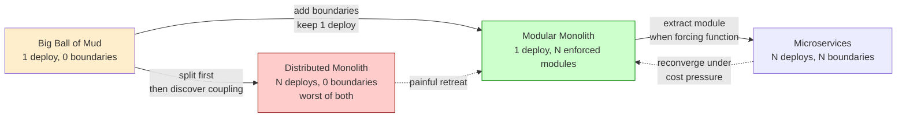
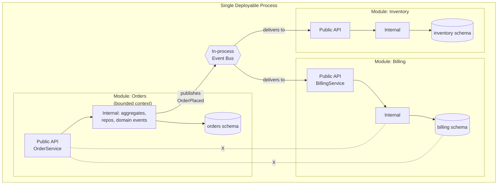
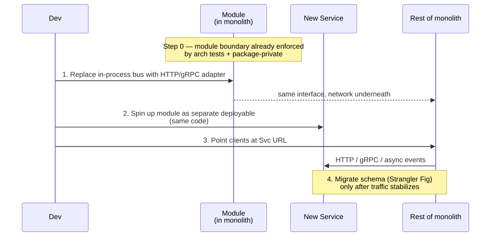

# Modular Monolith

## Why This Exists

**Problem.** Two failure modes converge on the same answer.

1. **The Big Ball of Mud.** A monolith with no internal structure. Everything imports everything. A change to invoicing breaks the cart. Onboarding takes a quarter. Deploys are terrifying because no one can predict the blast radius.
2. **The Premature Microservice.** A team splits a small app into 14 services on day one because "microservices scale". Now a single user request crosses 6 network boundaries, distributed transactions are reinvented as Sagas badly, debugging requires correlating traces across 5 repos, and the team ships slower than when it was a Rails app.

Both problems share a root cause: **lack of clear module boundaries**. Microservices solve it with the network — physical separation forces decoupling. But the network is a sledgehammer. You pay for it every request, every deploy, every on-call.

**Key insight.** The thing that actually matters is **logical** module boundaries — bounded contexts with explicit, narrow contracts and no back-channel access (no shared DB tables, no reaching into another module's internals). You can enforce those boundaries with package-private visibility, architecture tests, and code review — at compile time, with zero network cost. Deploy as one process. If a module later needs to be a service, the boundary is already there; extracting it is a refactor, not a rewrite.

This is the **modular monolith**: one deployable, many strictly-bounded modules. It is the architectural default for new systems and the migration target for both messes above.

**Reach for this when:**
- Greenfield system, team < 50 engineers, no proven need for independent scaling.
- Existing big-ball-of-mud monolith — you need boundaries before you need distribution.
- You tried microservices and it hurts: cascading failures, duplicate charges from broken distributed transactions, p99 spike when any one service GCs, ops cost dwarfs feature velocity.
- Domain is well-understood (you know the bounded contexts) but team coordination is breaking down.
- You want **optionality** — keep the door open to extract services later without committing now.

**Don't reach for this when:**
- You genuinely need independent scaling per component (e.g. one module is 100x more CPU-heavy than the rest).
- You need language polyglot (one team is Python ML, another is Rust hot-path, another is JVM).
- You have hard regulatory isolation (PCI scope reduction, data residency per region).
- Team is large enough (>~50–100 engineers) that the build/deploy pipeline of a single artifact becomes the bottleneck and **release cadence per team** is the constraint.
- You're building edge/embedded/CLI where there are no "modules" of the kind this pattern addresses.

## Diagrams

### The Spectrum



### Internal Structure



The crossed dotted lines show forbidden access: Orders **cannot** reach into Billing's internals or schema. Cross-module communication is **only** through public APIs or events.

### Extraction Path



Extraction is mechanical because the module already obeyed the rules.

## Core Content

### The Five Rules of a Modular Monolith

These are the load-bearing constraints. Violate any one and you get a distributed monolith or a ball of mud.

1. **No shared database tables across modules.** Each module owns its schema. Cross-module reads go through the other module's public API.
2. **Public API is small and explicit.** Anything not in the public API is package-private / internal. Compile-time enforcement, not "we agreed in a doc".
3. **No transitive reach-through.** If Orders depends on Billing, Orders does not get to use Billing's internal types or call Billing's repository directly.
4. **Cross-module communication is either (a) sync call to public API, or (b) async domain event.** Never a shared mutable in-memory object, never a shared cache key written by both.
5. **Architecture tests run in CI and fail the build on violation.** Without this, all four rules above decay within months.

### Java / Spring — Spring Modulith

Spring Modulith is the canonical Java implementation. A Spring Boot package becomes a "module"; sub-packages are internal by convention; cross-module type references are verified by the test framework.

```java
// src/main/java/com/acme/shop/orders/OrderService.java
package com.acme.shop.orders;

import com.acme.shop.billing.BillingService; // OK: another module's public API
// import com.acme.shop.billing.internal.InvoiceRepository; // FORBIDDEN: would fail arch test

import org.springframework.modulith.events.ApplicationModuleListener;
import org.springframework.context.ApplicationEventPublisher;

public class OrderService {

    private final OrderRepository orders;     // package-private, internal to this module
    private final ApplicationEventPublisher events;
    private final BillingService billing;     // depend on public type only

    // Sync path — used when caller must know the result.
    public OrderId place(PlaceOrder cmd) {
        var order = Order.from(cmd);
        orders.save(order);

        // Publish a domain event. Spring Modulith persists it in an event log
        // so subscribers can be transactionally consistent without 2PC.
        events.publishEvent(new OrderPlaced(order.id(), order.total()));
        return order.id();
    }
}

// src/main/java/com/acme/shop/orders/internal/OrderRepository.java
package com.acme.shop.orders.internal;
// Anything in `internal` is, by convention, not part of the public API.
// Spring Modulith's ApplicationModules verifier enforces this.
class OrderRepository { /* ... */ }
```

```java
// src/main/java/com/acme/shop/billing/OnOrderPlaced.java
package com.acme.shop.billing;

import com.acme.shop.orders.OrderPlaced; // depend on the EVENT, a stable contract
import org.springframework.modulith.events.ApplicationModuleListener;

class OnOrderPlaced {

    private final InvoiceWriter invoices;

    // @ApplicationModuleListener = @Async + @Transactional + integration with the event log.
    // The event was committed to the publisher's tx; this handler runs in its own tx.
    // If it fails, Spring Modulith retries from the durable event log.
    @ApplicationModuleListener
    void on(OrderPlaced ev) {
        invoices.draftFor(ev.orderId(), ev.total());
    }
}
```

Verification test — runs in CI, fails the build on violation:

```java
// src/test/java/com/acme/shop/ModularityTests.java
import org.springframework.modulith.core.ApplicationModules;
import org.springframework.modulith.docs.Documenter;
import org.junit.jupiter.api.Test;

class ModularityTests {

    static final ApplicationModules modules = ApplicationModules.of(ShopApplication.class);

    @Test
    void modulesRespectBoundaries() {
        // Verifies:
        //  - no module references another module's `internal` package
        //  - no cyclic dependencies between modules
        //  - exposed types are documented
        modules.verify();
    }

    @Test
    void writeDocumentation() {
        new Documenter(modules)
            .writeModulesAsPlantUml()
            .writeIndividualModulesAsPlantUml();
        // Generated diagrams live next to the code — boundaries become reviewable.
    }
}
```

### .NET — NetArchTest / ArchUnitNET

```csharp
// Tests/Architecture/ModuleBoundaryTests.cs
using NetArchTest.Rules;
using Xunit;

public class ModuleBoundaryTests
{
    [Fact]
    public void Orders_module_must_not_reference_Billing_internals()
    {
        var result = Types.InCurrentDomain()
            .That()
            .ResideInNamespace("Acme.Shop.Orders")
            .ShouldNot()
            .HaveDependencyOn("Acme.Shop.Billing.Internal")
            .GetResult();

        Assert.True(result.IsSuccessful,
            "Orders reaches into Billing.Internal: " +
            string.Join(", ", result.FailingTypeNames ?? Array.Empty<string>()));
    }

    [Fact]
    public void Domain_must_not_depend_on_infrastructure()
    {
        // Hexagonal layering inside each module.
        var result = Types.InCurrentDomain()
            .That()
            .ResideInNamespaceMatching(@"Acme\.Shop\.\w+\.Domain")
            .ShouldNot()
            .HaveDependencyOnAny("Microsoft.EntityFrameworkCore", "System.Net.Http")
            .GetResult();

        Assert.True(result.IsSuccessful);
    }

    [Fact]
    public void No_cyclic_dependencies_between_modules()
    {
        var modules = new[] { "Orders", "Billing", "Inventory", "Shipping" };
        foreach (var a in modules)
        foreach (var b in modules.Where(x => x != a))
        {
            // If A depends on B, B must not depend on A.
            // (Real check would walk the graph; this is the spirit.)
        }
    }
}
```

### Go — internal/ packages + dependency tests

Go's `internal/` directory is enforced by the compiler — it is the cleanest module boundary mechanism in mainstream languages.

```
shop/
  cmd/server/main.go              # composes modules, wires DI
  orders/
    api.go                        # exported: OrderService, OrderID, PlaceOrder, OrderPlaced
    internal/
      repository.go               # NOT importable from outside shop/orders/
      aggregate.go
  billing/
    api.go
    internal/
      invoice_writer.go
  platform/
    bus/                          # in-process event bus
    db/
```

```go
// shop/orders/api.go
package orders

import "shop/billing" // OK: public surface only

type OrderService struct {
    repo    *internal.Repository  // OK from inside shop/orders
    billing billing.API           // depend on the public interface
    bus     bus.Publisher
}

// PlaceOrder is the public entry point.
func (s *OrderService) PlaceOrder(ctx context.Context, cmd PlaceOrder) (OrderID, error) {
    o := internal.NewOrder(cmd)
    if err := s.repo.Save(ctx, o); err != nil {
        return "", err
    }
    // Publish through the in-process bus. Same shape as if it were Kafka,
    // so extracting later is a config change, not a redesign.
    s.bus.Publish(ctx, OrderPlaced{ID: o.ID, Total: o.Total})
    return o.ID, nil
}
```

```go
// shop/orders/api_arch_test.go
package orders_test

import (
    "go/build"
    "strings"
    "testing"
)

// Compile-time guarantee already prevents reaching into other modules' internal/.
// This test catches the OTHER violation: depending on a peer module's non-internal
// package that we don't want to leak through.
func TestOrders_does_not_import_billing_internals_via_friend_packages(t *testing.T) {
    pkg, err := build.Default.Import("shop/orders", "", 0)
    if err != nil { t.Fatal(err) }
    for _, imp := range pkg.Imports {
        if strings.HasPrefix(imp, "shop/billing/") &&
           !strings.HasSuffix(imp, "/billing") {
            t.Errorf("orders imports %s — only shop/billing public API is allowed", imp)
        }
    }
}
```

### Database — schema-per-module, one connection pool

The strongest physical boundary inside a single Postgres instance: **one schema per module, and the application user for module A does not have grants on module B's schema.**

```sql
-- migrations/0001_module_schemas.sql

CREATE SCHEMA orders;
CREATE SCHEMA billing;
CREATE SCHEMA inventory;

-- One DB role per module. Even though there's one process, the DB enforces isolation.
CREATE ROLE app_orders     LOGIN PASSWORD :'orders_pw';
CREATE ROLE app_billing    LOGIN PASSWORD :'billing_pw';
CREATE ROLE app_inventory  LOGIN PASSWORD :'inv_pw';

GRANT USAGE ON SCHEMA orders    TO app_orders;
GRANT USAGE ON SCHEMA billing   TO app_billing;
GRANT USAGE ON SCHEMA inventory TO app_inventory;

-- The crucial REVOKE: orders cannot read billing's tables, even by accident.
REVOKE ALL ON SCHEMA billing   FROM app_orders;
REVOKE ALL ON SCHEMA inventory FROM app_orders;
REVOKE ALL ON SCHEMA orders    FROM app_billing;
-- ... and so on.

-- Tables go in their schema only.
CREATE TABLE orders.orders (
    id        UUID PRIMARY KEY,
    customer  UUID NOT NULL,
    total     NUMERIC(12,2) NOT NULL,
    placed_at TIMESTAMPTZ NOT NULL DEFAULT now()
);

CREATE TABLE billing.invoices (
    id         UUID PRIMARY KEY,
    order_id   UUID NOT NULL,  -- a reference, NOT a foreign key across modules
    amount     NUMERIC(12,2) NOT NULL,
    status     TEXT NOT NULL
);
```

**Note the absence of a foreign key from `billing.invoices.order_id` to `orders.orders.id`.** Cross-module FKs are an anti-pattern in modular monoliths because they make extraction impossible without rewriting the schema. Treat the reference as logical, validate it on write through the API, and accept eventual consistency.

### The In-Process Event Bus (with the seam to swap to Kafka later)

```typescript
// platform/bus/bus.ts

export interface DomainEvent { readonly type: string; }

export interface Bus {
  publish<E extends DomainEvent>(e: E): Promise<void>;
  subscribe<E extends DomainEvent>(type: E["type"], handler: (e: E) => Promise<void>): void;
}

// In-process, transactional outbox flavor.
// CRITICAL: events are written to the SAME DB transaction as the state change,
// then flushed by a relay. This is the only way to avoid the dual-write problem
// (state committed, event lost — or vice versa) without 2PC.
export class OutboxBus implements Bus {
  constructor(private db: DB, private dispatcher: Dispatcher) {}

  async publish<E extends DomainEvent>(e: E): Promise<void> {
    // Caller is already inside a tx; insert into outbox table.
    await this.db.exec(
      `INSERT INTO platform.outbox(id, type, payload, created_at)
       VALUES ($1, $2, $3, now())`,
      [crypto.randomUUID(), e.type, JSON.stringify(e)]
    );
  }
  // A separate poller reads outbox rows and calls dispatcher.deliver(),
  // which routes to in-process subscribers today, and to Kafka tomorrow.
}
```

The relay/outbox pattern (see Chris Richardson's microservices.io and DDIA ch. 11) makes the in-process bus behave the same as a future distributed bus. **Decide this on day one** — retrofitting outbox semantics after you've shipped 50 event types is grim.

### Composition Root — the only place modules meet

```typescript
// cmd/server/main.ts
async function main() {
  const db = await connectDB(config.dbUrl);
  const bus = new OutboxBus(db, new InProcessDispatcher());

  // Each module exposes a factory that returns its public API.
  // Internal types stay internal — main.ts cannot see them.
  const orders    = ordersModule.create({ db, bus });
  const billing   = billingModule.create({ db, bus, orders });
  const inventory = inventoryModule.create({ db, bus });

  // Wire event subscriptions. This is also a reviewable list of
  // every cross-module coupling in the system.
  bus.subscribe("OrderPlaced", billing.onOrderPlaced);
  bus.subscribe("OrderPlaced", inventory.reserveStock);
  bus.subscribe("InvoicePaid", orders.markPaid);

  await startHttpServer({ orders, billing, inventory });
}
```

The composition root is the **only** file allowed to know about every module. If you find yourself wanting another such file, that's a smell — usually it means a missing module.

### Shopify-style Components (Rails)

Shopify, the canonical large-scale modular monolith, uses [`packwerk`](https://github.com/Shopify/packwerk) to enforce package boundaries on a Rails monolith with ~30 million LoC and thousands of engineers. The mechanism:

```
components/
  orders/
    package.yml              # declares public_path, dependencies, enforce_*
    app/public/orders/       # the public API (auto-loaded)
    app/internal/orders/     # internal models, services
    test/
  billing/
    package.yml
    app/public/billing/
    app/internal/billing/
```

```yaml
# components/orders/package.yml
enforce_dependencies: true
enforce_privacy: true
public_path: app/public/
dependencies:
  - components/billing       # explicit allowlist; anything else is a violation
```

`packwerk check` runs in CI; violations are reported as inline diffs. The same idea — **make boundaries declarative, machine-checked, and reviewable** — applies in any language. If your stack doesn't have a tool, write the arch tests yourself; they're 200 lines.

## Trade-offs

| Benefit | Cost |
|---|---|
| One deploy artifact, one binary, one log stream — debugging is local. | All teams ship on one release train; per-team release cadence is bounded by slowest test. |
| In-process calls are ~ns; cross-module calls cost what a function call costs. | You lose the "physics enforces it" guarantee — a determined developer can still bypass arch tests by disabling them. Need code-review culture. |
| One database, one connection pool, one backup, one schema-migration story. | You can't independently scale a CPU-heavy module; whole process scales together. |
| Refactoring across modules is an IDE rename, not an API versioning project. | Coupling can re-emerge at runtime (shared caches, shared static state) where compile-time tests don't see it. |
| No distributed transactions, no saga compensations, no eventual consistency tax inside the process. | If you DO eventually extract, you must add all that machinery later. Outbox/event-log on day one mitigates. |
| Onboarding: one repo, one `make run`, one debugger. | Repo grows large. Build times grow. Need to invest in test selection, incremental compilation. |
| Cost: one EC2/K8s service, one observability bill. | Single-point-of-deploy. A bad release can take down everything (mitigate with feature flags, blue/green). |
| Optionality preserved — extract any module to a service when there's a real reason. | Engineers without discipline will treat "modular monolith" as license to cut corners they wouldn't cut in microservices. Boundaries decay without enforcement. |

## Common Pitfalls

- **Shared database tables.** "Just this one join" is how it starts. Six months later, Billing has a `SELECT` from `orders.line_items` in a hot path, and you can never extract Orders. Catch it at the schema-grant level (revoke cross-schema access for the module's DB user).

- **Cross-module foreign keys.** Same problem, enforced by the database. `billing.invoices.order_id REFERENCES orders.orders(id)` looks responsible but cements the modules together. Use a logical reference and validate at write time.

- **Reaching into "internal" packages.** Java has no real package-private across sub-packages; `internal` is convention. **Without an architecture test, conventions decay in a quarter.** Add the test on day one.

- **God services.** A `UserService` that everyone depends on, exposing 47 methods. This is a missing-module smell — the user concept is leaking authn, profile, billing, preferences, and audit into one thing. Split.

- **Synchronous event handlers masquerading as async.** "We have an event bus" — but it's all `events.publish(); handler.handle();` inline. Now you have all the indirection of events with none of the decoupling. Either commit to async (with outbox) or use plain method calls and stop pretending.

- **Distributed monolith via "microservices first".** Splitting into 14 services on day one before bounded contexts are stable. You end up with chatty services that have to be deployed together because their contracts churn weekly. Sam Newman's *Building Microservices* (2nd ed) is explicit: **start monolith, extract later**. The modular monolith is the staging ground.

- **No CI enforcement.** Architecture tests that don't run in CI might as well not exist. They must fail the build, not produce a warning.

- **Mutable shared state.** A singleton config object that two modules write to. A static cache. An ambient `request_context` thread-local that modules read from each other. These are invisible to arch tests and lethal at extraction time.

- **Treating it as "a stop on the way to microservices".** It is not — it is a destination in its own right. Stripe ran a modular monolith for years past unicorn status. Shopify still does. GitHub did until well past 100M users. The forcing function for distribution often never arrives.

- **Premature event sourcing / CQRS inside modules.** A modular monolith already gives you most of the architectural clarity people seek from event sourcing. Don't add it because it sounds advanced; add it for the specific reason it solves (audit trail, temporal queries).

## Decision Table

| If you have / want… | Choose | Notes |
|---|---|---|
| New product, < 50 engineers, domain understood | **Modular monolith** | Default. Optionality preserved. |
| New product, < 50 engineers, domain unclear | Monolith (boundaries discovered later) | Don't pre-modularize what you don't understand. Refactor toward modules as bounded contexts emerge. |
| Existing big-ball-of-mud, painful deploys | **Modular monolith (refactor)** | Carve out modules in place. Don't rewrite. Strangler Fig at module level. |
| Existing distributed monolith, painful operations | **Reconverge to modular monolith** | Painful but tractable. Move services back into one process behind facades, then re-extract correctly. |
| One module needs 10x the CPU/memory of others | Extract that module; rest stays modular monolith | Independent scaling is a real forcing function. |
| Different teams need different release cadences (daily vs. quarterly) | Extract per-cadence boundary | Release train coupling becomes the bottleneck around 50–100 engineers. |
| Polyglot is required (Python ML model + Go hot path) | Per-language services + modular monolith for the rest | Don't let polyglot be a hipster choice; require a real reason. |
| Strict regulatory isolation (PCI, HIPAA, data residency) | Extract regulated module | Reduces audit scope; worth the operational cost. |
| You're "going to go microservices eventually" | **Modular monolith now** | The eventual is rarely as eventual as you think, and the boundary work pays off either way. |
| You read a blog post about how Netflix does it | Modular monolith | You are not Netflix. Netflix took ~7 years to fully decompose. |

## References

- Sam Newman — *Building Microservices*, 2nd ed (O'Reilly, 2021), ch. 3 "Splitting the Monolith" and ch. 1 on "monolith first" stance — https://samnewman.io/books/building_microservices_2nd_edition/
- Sam Newman — *Monolith to Microservices* (O'Reilly, 2019) — Strangler Fig and module extraction patterns.
- Martin Fowler — "MonolithFirst" — https://martinfowler.com/bliki/MonolithFirst.html
- Martin Fowler — "Microservice Premium" — https://martinfowler.com/bliki/MicroservicePremium.html
- Simon Brown — "Modular Monoliths" talk and writing — https://www.codingthearchitecture.com/2015/03/08/package_by_component_and_architecturally_aligned_testing.html
- Kamil Grzybek — "Modular Monolith: A Primer" — https://www.kamilgrzybek.com/blog/posts/modular-monolith-primer
- Spring Modulith reference — https://docs.spring.io/spring-modulith/reference/
- Shopify Engineering — "Deconstructing the Monolith" (packwerk origin) — https://shopify.engineering/deconstructing-monolith-designing-software-maximizes-developer-productivity
- Shopify packwerk — https://github.com/Shopify/packwerk
- Stripe Engineering — "How we built it: Stripe's payments stack" (the value of staying monolithic longer than fashion suggests).
- Eric Evans — *Domain-Driven Design* (Addison-Wesley, 2003), Part IV "Strategic Design" — bounded contexts. The conceptual foundation of "module".
- Vaughn Vernon — *Implementing Domain-Driven Design* (2013), ch. 2 on bounded contexts and ch. 13 on integrating bounded contexts.
- Kleppmann — *Designing Data-Intensive Applications* (O'Reilly, 2017): ch. 11 "Stream Processing" for outbox/event-log patterns; ch. 9 on consistency models that apply once you DO go distributed.
- Chris Richardson — Transactional Outbox pattern — https://microservices.io/patterns/data/transactional-outbox.html
- Pat Helland — "Data on the Outside vs. Data on the Inside" (CIDR 2005) — the conceptual basis for why module boundaries matter as much as service boundaries — https://www.cidrdb.org/cidr2005/papers/P12.pdf
- Pat Helland — "Life beyond Distributed Transactions: an Apostate's Opinion" (CIDR 2007) — https://www.ics.uci.edu/~cs223/papers/cidr07p15.pdf
- Robert C. Martin — *Clean Architecture* (2017), Part V on architecture — the Dependency Rule applied at module scope.
- ArchUnit (Java) — https://www.archunit.org/
- ArchUnitNET — https://github.com/TNG/ArchUnitNET
- NetArchTest — https://github.com/BenMorris/NetArchTest
- Google SRE Workbook — ch. 12 "Introducing Non-Abstract Large System Design" — https://sre.google/workbook/non-abstract-design/ — relevant for when the modular monolith is the right level of abstraction.
- AWS Builders' Library — "Avoiding fallback in distributed systems" — https://aws.amazon.com/builders-library/avoiding-fallback-in-distributed-systems/ — by way of motivating "don't be distributed unless you have to".
- DHH — "The Majestic Monolith" — https://m.signalvnoise.com/the-majestic-monolith/ — and its follow-up "The Majestic Modular Monolith".

## See Also

- `../microservices/` — when distribution is genuinely needed; how to extract modules cleanly.
- `../hexagonal/` — the layering pattern *inside* each module.
- `../event-driven/` — async communication between modules and across services.
- `../strangler-fig/` — incrementally carving modules out of a big-ball-of-mud, or services out of a modular monolith.
- `../service-mesh/` — what you'd add later, after extraction.
- `../../data-systems/outbox/` — the pattern that lets your in-process bus survive extraction.
- `../cqrs/` — when one module needs read/write split; usually overkill inside a modular monolith.
- `../../reliability/observability/` — easier in a monolith, but the patterns transfer when you extract.
- `../layered/` — the simpler ancestor; modular monolith is "layered, but with vertical slices that are also enforced".
- `../clean-architecture/` — overlapping ideas; clean architecture is one way to organize the inside of a module.
