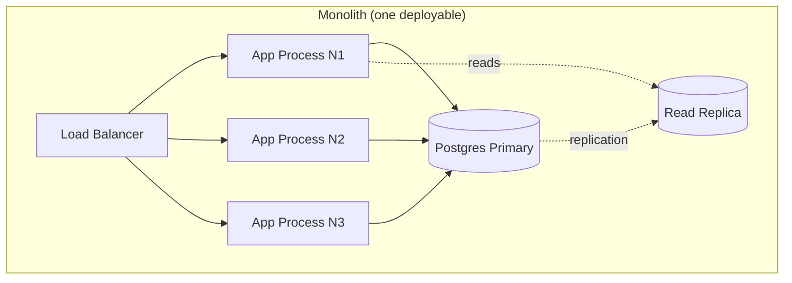
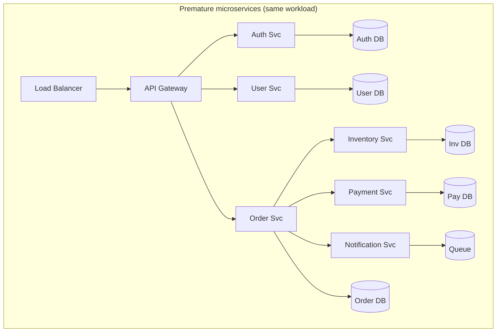
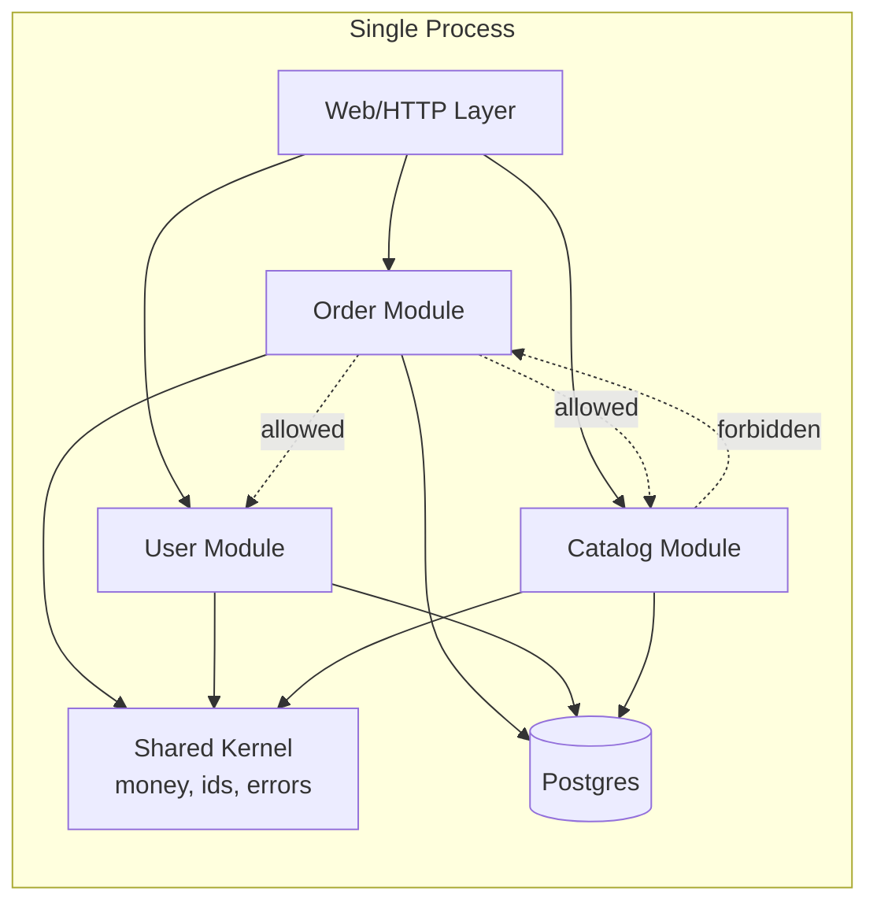

# Monolith Architecture

## Why This Exists

**Problem.** The default 2015-2020 advice — "start with microservices" — has cost the industry billions in incidental complexity. A two-person startup running 12 services, a Helm chart per environment, a service mesh, distributed traces, and a saga pattern for what should be a database transaction. Meanwhile a single Rails app with Postgres could have served 10× their traffic at 1/10 the operational cost.

**Key insight.** A monolith is not "legacy." It is a **deployment topology**, not an architecture. You can have a beautifully modular monolith (clean boundaries, dependency rules enforced at build time) and a horrifying distributed ball of mud (12 services calling each other in cycles). The shape of your code and the shape of your deployment are two different decisions. Conflating them is the original sin of mid-2010s architecture writing.

A monolith means: **one deployable artifact, one process boundary, one database (usually), one deploy pipeline**. Modules within can still have strong boundaries — they just communicate via in-process function calls instead of network RPC.

**Reach for this when:**
- You are pre-product-market-fit. The cost of a wrong domain boundary is higher than the cost of vertical scaling.
- Team size is < ~30 engineers, or modularity is good enough that 100+ engineers can work in one repo (Shopify, GitHub, Basecamp prove this is possible).
- Latency between modules matters and you can't afford 1-5 ms RPC overhead per cross-module call.
- You need transactional consistency across what would otherwise be service boundaries (orders + inventory + payments).
- Ops budget is constrained (no platform team, no SRE org). Operating one well-tuned process is dramatically cheaper than operating 20 mediocre ones.
- The problem domain is still being discovered. Boundaries you'd draw today will be wrong in 6 months. Refactoring within a monolith is a rename + move; refactoring across services is a migration project.

**Don't reach for this when:**
- A single component has a fundamentally different scaling envelope (e.g., a CPU-bound ML inference path inside an I/O-bound web app — you want to scale GPU pods independently of web pods).
- Three or more teams are blocking each other on one deploy pipeline daily — coordination cost has eaten team velocity.
- You have a regulated component (PCI cardholder data, PHI) that would force the entire monolith into the regulated boundary.
- Polyglot is non-negotiable: the ML team needs Python, the trading team needs Rust, the web team is on TypeScript. You can sometimes embed via FFI, but rarely cleanly.
- A component must be independently available — if checkout goes down, the marketing site must still serve. (Though you can solve this with read replicas + static fallbacks before splitting.)

## Diagrams

### Monolith vs. distributed: deployment topology





The monolith handles the same request with one network hop. The microservice version added six service boundaries, six databases, a queue, a gateway, and a service mesh you don't see. Every one of those edges is a place where a partial failure, retry storm, or schema drift can ruin your weekend.

### Modular monolith — internal structure



Dependency direction is enforced at build time (e.g., ArchUnit in Java, `import-linter` in Python, depcruise in TS). The catalog module cannot import from orders. If someone tries, CI fails. This is the discipline that lets a monolith scale to 100+ engineers without becoming a ball of mud.

## Core Patterns

### 1. Modular monolith: enforced boundaries

The single most important practice. Without it, a monolith degrades into a ball of mud in 18 months. With it, you can defer the microservices decision indefinitely — and when you do split, the seams are obvious.

**Python example — `import-linter` config (`.importlinter`):**

```ini
# Forbid catalog from importing orders.
# Enforced in CI: `lint-imports` exits non-zero on violation.

[importlinter]
root_package = myapp

[importlinter:contract:layers]
name = Layered architecture
type = layers
layers =
    myapp.web
    myapp.modules.orders
    myapp.modules.catalog
    myapp.modules.users
    myapp.shared

[importlinter:contract:no-cross-module]
name = Modules cannot import each other except via published APIs
type = forbidden
source_modules =
    myapp.modules.catalog
forbidden_modules =
    myapp.modules.orders.internal
    myapp.modules.users.internal
ignore_imports =
    myapp.modules.catalog.api -> myapp.modules.orders.api
```

**Java example — ArchUnit test that fails the build on layering violations:**

```java
// Run as a regular JUnit test. CI fails -> PR blocked.
@AnalyzeClasses(packages = "com.acme.shop")
class ArchitectureTest {

    @ArchTest
    static final ArchRule modulesAreIndependent =
        slices().matching("com.acme.shop.modules.(*)..")
                .should().notDependOnEachOther()
                // Allow only published APIs to be cross-module entry points.
                .ignoreDependency(
                    nameMatching(".*"),
                    nameMatching(".*\\.api\\..*")
                );

    @ArchTest
    static final ArchRule noCyclicDependencies =
        slices().matching("com.acme.shop.(*)..").should().beFreeOfCycles();

    @ArchTest
    static final ArchRule webDoesNotTouchPersistence =
        noClasses().that().resideInAPackage("..web..")
                   .should().dependOnClassesThat()
                   .resideInAPackage("..persistence..");
}
```

The rule of thumb: **a module exposes a small `api` package. Everything else under it is `internal` and other modules cannot import from it.** This is the same discipline as service boundaries — minus the network.

### 2. Deployment topology — boring is good

```yaml
# kubernetes/web-monolith.yaml
# One Deployment, one image, one process. Scale horizontally on CPU.
apiVersion: apps/v1
kind: Deployment
metadata:
  name: shop-web
spec:
  replicas: 6                       # start with N+2 for redundancy
  strategy:
    type: RollingUpdate
    rollingUpdate:
      maxUnavailable: 1             # never lose more than 1 pod at once
      maxSurge: 2                   # spin up 2 new before killing old
  selector:
    matchLabels: { app: shop-web }
  template:
    metadata:
      labels: { app: shop-web }
    spec:
      containers:
        - name: web
          image: registry.acme.com/shop:v2025.06.05
          ports:
            - { name: http, containerPort: 8080 }
          env:
            - name: DATABASE_URL
              valueFrom: { secretKeyRef: { name: db, key: url } }
            - name: PUMA_WORKERS         # process-per-core in this pod
              value: "4"
          resources:
            requests: { cpu: "1500m", memory: "1Gi" }
            limits:   { cpu: "2000m", memory: "2Gi" }
          readinessProbe:                 # block traffic until app is warm
            httpGet: { path: /healthz/ready, port: http }
            periodSeconds: 5
            failureThreshold: 3
          livenessProbe:                  # restart on deadlock
            httpGet: { path: /healthz/live, port: http }
            periodSeconds: 30
            failureThreshold: 6
---
apiVersion: autoscaling/v2
kind: HorizontalPodAutoscaler
metadata: { name: shop-web }
spec:
  scaleTargetRef:
    apiVersion: apps/v1
    kind: Deployment
    name: shop-web
  minReplicas: 6
  maxReplicas: 60
  metrics:
    - type: Resource
      resource: { name: cpu, target: { type: Utilization, averageUtilization: 60 } }
```

A monolith does not mean a single instance. You **scale horizontally** — many copies of the same process behind a load balancer. The "single deployable" property is about the **artifact**, not the **runtime**. Six pods of one image is still a monolith.

If a workload inside the monolith has a different shape (e.g., a long-running export job), run the **same image** with a different command/queue:

```yaml
# Same image. Different role. Different scaling rules.
apiVersion: apps/v1
kind: Deployment
metadata: { name: shop-worker }
spec:
  replicas: 2
  template:
    spec:
      containers:
        - name: worker
          image: registry.acme.com/shop:v2025.06.05  # SAME IMAGE
          command: ["bundle", "exec", "sidekiq"]      # different entrypoint
          resources: { requests: { cpu: "500m", memory: "1.5Gi" } }
```

This is the "majestic monolith" pattern: **one codebase, one artifact, multiple roles at deploy time**. You retain the deploy-as-one safety while letting roles scale independently.

### 3. Internal "service" interfaces — defer the split

Cross-module calls go through an interface in the calling module. This makes a future split a 2-day refactor instead of a 6-month migration.

```python
# myapp/modules/orders/api.py
# Public API. Other modules import from here, not from internal/.

from typing import Protocol
from .internal.service import OrderServiceImpl

class OrderService(Protocol):
    def place(self, user_id: str, items: list[CartItem]) -> Order: ...
    def get(self, order_id: str) -> Order | None: ...

# Single binding. Today: in-process call. Tomorrow: HTTP client.
def get_order_service() -> OrderService:
    return OrderServiceImpl()
```

```python
# myapp/modules/notifications/handler.py
# Notifications module talks to orders ONLY through the API.

from myapp.modules.orders.api import get_order_service

def on_payment_succeeded(payment_id: str) -> None:
    orders = get_order_service()
    order = orders.get(payment_id_to_order_id(payment_id))
    if order:
        send_receipt(order)
```

When you decide to extract `orders` into its own service:

1. Move `OrderServiceImpl` behind an HTTP boundary.
2. Replace `get_order_service()` with a client implementation of the same Protocol.
3. Notifications module is unchanged.

The seam was already there. You're swapping the implementation, not rewriting the consumers.

### 4. Database boundaries inside one DB

A monolith usually means one Postgres. That does **not** mean one schema. Use Postgres schemas (or table-name prefixes) to enforce ownership:

```sql
-- Each module owns its own schema. Other modules cannot reach into tables.
CREATE SCHEMA orders   AUTHORIZATION app_orders;
CREATE SCHEMA catalog  AUTHORIZATION app_catalog;
CREATE SCHEMA users    AUTHORIZATION app_users;

-- Per-module DB role with grants only to its own schema.
GRANT USAGE ON SCHEMA orders TO app_orders;
GRANT SELECT, INSERT, UPDATE, DELETE
  ON ALL TABLES IN SCHEMA orders TO app_orders;

-- Cross-module read goes through a view explicitly published by the owner.
CREATE VIEW catalog.product_summary AS
  SELECT id, sku, title, price_cents
  FROM   catalog.products
  WHERE  deleted_at IS NULL;

GRANT SELECT ON catalog.product_summary TO app_orders;
```

When you split `orders` out, the migration is mechanical: dump `orders.*`, restore into a new database, point the new service at it. No frantic hunt for cross-module joins because they never existed.

### 5. Deploy pipeline — the velocity advantage

The single most underrated benefit. With a monolith:

- **One CI run.** One green build = whole system green.
- **One deploy.** No coordinating "deploy `payments` v2.3 before `orders` v4.1, then run migration X, then deploy `cart` v1.9".
- **Trivial rollback.** `kubectl rollout undo deployment/shop-web` and you're back. No fan-out failure modes.
- **Atomic refactors.** Rename a function across 200 call sites in one PR. Try that across 12 repos.

The cost is real: a 25-minute CI pipeline blocks everyone, and a bad deploy takes the whole site down. Both are addressable (parallel test sharding, canary deploys, feature flags) and dramatically cheaper to fix than the equivalent problems in a 12-service distributed system.

```yaml
# .github/workflows/deploy.yaml — one pipeline, the whole system
name: deploy
on:
  push: { branches: [main] }

jobs:
  test:
    runs-on: ubuntu-latest
    strategy:
      matrix: { shard: [1, 2, 3, 4, 5, 6, 7, 8] }   # parallelize 8-way
    steps:
      - uses: actions/checkout@v4
      - run: ./bin/test --shard ${{ matrix.shard }}/8

  build:
    needs: test
    runs-on: ubuntu-latest
    steps:
      - uses: actions/checkout@v4
      - run: docker build -t registry.acme.com/shop:${{ github.sha }} .
      - run: docker push registry.acme.com/shop:${{ github.sha }}

  canary:
    needs: build
    runs-on: ubuntu-latest
    steps:
      # 5% of traffic for 10 min. Auto-rollback on SLO burn.
      - run: ./bin/deploy canary --image shop:${{ github.sha }} --weight 5 --bake 10m

  promote:
    needs: canary
    runs-on: ubuntu-latest
    steps:
      - run: ./bin/deploy promote --image shop:${{ github.sha }}
```

## Case Study: Shopify and the "Majestic Monolith"

Shopify's core commerce platform is a Rails monolith — one of the largest in the world. As of public talks (2019-2023): **~3M+ LOC of Ruby, hundreds of engineers, billions of requests/day**. They actively chose **not** to break it into microservices. Instead, they invested in modularity:

- **Componentization (2017-onwards).** Shopify split the monolith into ~50 internal "components" via the [`packwerk`](https://github.com/Shopify/packwerk) tool — Ruby's answer to ArchUnit. Components have public/private boundaries enforced at CI time.
- **One deploy, many roles.** Same Rails app runs as web, worker, scheduler — different processes, same image.
- **Pods architecture.** They scale by running many isolated copies of the monolith ("pods"), each serving a subset of merchants — sharding at the deployment layer, not the code layer.

The lesson: **modularity is a property of code, not of deployment topology**. Shopify proved that hundreds of engineers can ship daily on one codebase if you invest in tooling and enforce boundaries. DHH's "Majestic Monolith" essay (2016) makes the same case: Basecamp, Hey, and 37signals products are monoliths, by choice, with small teams and fast iteration.

Counter-example: Amazon famously split into services in the early 2000s, and Netflix in the early 2010s. Both at scales (thousands of engineers, hundreds of distinct businesses) and with **strong organizational pressure** (independent team budgets, two-pizza teams) where the coordination cost of a monolith would have been crushing. Use the right tool for your scale.

## Trade-offs

| Benefit | Cost |
|---|---|
| One deploy, one rollback, one CI pipeline. | A bad deploy takes the whole system down — invest in canary + flags. |
| In-process calls = nanoseconds, no network failures. | Can't independently scale a hot module — vertical scale + replicas only. |
| Transactional consistency across modules (real ACID). | Can't independently choose tech stacks per module. |
| Atomic refactors across the whole codebase. | A single CI pipeline must stay fast — test parallelization required. |
| Dramatically lower ops complexity (one runbook). | A bug in any module can OOM/crash the whole process. |
| Easy local development — `bin/dev` and you're running the whole system. | Memory footprint grows with codebase — eventually you need 4-8GB pods. |
| Defer the question of where the boundaries should be until you actually know. | Without enforced modularity, becomes a ball of mud in 18-24 months. |
| New engineers ramp on one repo, one mental model. | A long compile/boot time hurts developer feedback loop. |
| Cross-cutting concerns (auth, logging, tracing) configured once. | Dependency upgrades affect everything — no incremental migration. |

## Common Pitfalls

- **Confusing "monolith" with "ball of mud."** They are unrelated. A monolith with enforced module boundaries is healthier than a microservice mesh with cyclic dependencies. The pejorative usage of "monolith" is dishonest — push back on it.
- **No enforced boundaries.** "We'll be disciplined." You won't. Six months in, the orders module is reaching directly into the catalog module's tables. Use `packwerk` / ArchUnit / `import-linter` from day one. This is the single highest-leverage thing you can do.
- **Sharing the same DB schema across modules.** Joins everywhere. Now `orders` and `inventory` are coupled at the storage layer and can never be split without a 6-month migration. Use schemas or strict table prefixes per module from day one.
- **One process doing too many incompatible things.** A single web pod handling synchronous web requests AND running heavy background jobs AND cron tasks. Different shapes. Move long-running work into a worker process running the **same image** with a different entrypoint.
- **Premature splitting on trend, not pain.** "Microservices best practice" is not a justification. Splits should be triggered by **measurable** problems: deploy bottleneck (3+ teams blocked daily), scaling envelope mismatch (one module needs GPU, others don't), regulatory boundary (PCI scope), or independent availability requirement. If you can't name the trigger, don't split.
- **Splitting before you have boundaries.** If you can't articulate where the seams are inside the monolith, splitting will just create distributed mud. Fix the modularity first; the split becomes mechanical.
- **Skipping the canary deploy.** "It's just a monolith, push it." A bad deploy = total outage. Canary 5% for 10 minutes with auto-rollback on SLO burn is non-negotiable above ~10K req/sec.
- **CI pipeline degrading to 45+ minutes.** A 45-minute pipeline + 5 PRs/day = 4 hours of feedback latency per engineer. Parallelize tests, shard by module, run only affected tests on PR (full suite on main).
- **Memory leaks killing everyone.** A leak in any module crashes the whole pod. Run with strict memory limits, restart on OOM, monitor RSS — same as you would for any service, but with bigger blast radius.
- **Transactional thinking that won't survive a split.** If your code does a 7-table cross-module transaction, that pattern is **only viable in the monolith.** When you split, you'll need sagas/outbox. Be explicit: this transaction couples these modules forever, or until we're willing to redesign the workflow.

## Decision Table

| Situation | Pick | Why |
|---|---|---|
| 2-30 engineers, pre-product-market-fit, web/SaaS app | **Monolith (modular)** | Boundaries are guesses. Make them cheap to change. |
| 30-150 engineers, established domain, well-understood boundaries | **Modular monolith + selective extraction** | Extract only the modules with real differentiating pain (scaling, regulatory, polyglot). Keep the rest. |
| Single component needs 10× scale of others (ML inference, video transcoding) | **Monolith + extracted hot path** | Don't fragment the whole system. Extract the one component with the divergent envelope. |
| Three or more teams blocked on the same deploy pipeline daily | **Trigger to split** | Coordination cost has eaten team velocity. Now microservices pay for themselves. |
| PCI/PHI/regulatory data in one module, rest is non-regulated | **Extract regulated module** | Avoid pulling the whole monolith into compliance scope. |
| Polyglot team (Python ML + Go infra + TypeScript web) | **Multi-deployable from day one** | FFI is rarely worth it. Network boundaries are cheap when each language already has its own runtime. |
| Read-heavy public site + write-heavy admin app, same data | **Monolith + read replicas** | Solve with replicas before splitting. CQRS-lite inside the monolith. |
| Function/event-driven workload (each request short, idempotent, stateless) | **Serverless (Lambda etc.)** | Different beast — neither monolith nor microservice. Pay-per-invocation, no always-on cost. |
| Mature platform team, 200+ engineers, dozens of distinct business domains | **Service-oriented** | Coordination cost dominates. Conway's Law makes services align with team boundaries. |
| You don't know where the boundaries are yet | **Monolith. Always.** | Don't pay the cost of a split you'll regret. |

## Migration Triggers — when (and only when) to split

The split should be **boring and obvious** by the time you do it. If it's controversial, you're too early.

1. **Deploy bottleneck.** 3+ teams have been blocking each other on deploys for 4+ weeks. Velocity has measurably dropped (track PRs merged per week per team).
2. **Scaling envelope divergence.** One module is consuming >70% of pod resources but only handling 5% of requests. (Or the inverse: one module needs 10× the replicas of everything else to keep up.)
3. **Regulatory/compliance scope.** PCI cardholder data, PHI, sovereign data residency, FedRAMP — extract the regulated workload to keep the rest out of scope.
4. **Independent availability.** Module X must remain up when module Y is down (e.g., status page, marketing site). Solve with read replicas + static fallbacks first; extract only if those don't work.
5. **Polyglot necessity.** A module genuinely needs a different runtime (Python ML, Rust trading engine, Go networking). FFI is brittle; a service boundary is honest.
6. **Organizational structure.** The team owning the module is geographically/organizationally distinct enough that PR coordination is harder than service coordination. (Conway's Law in reverse.)

If the trigger is **"because microservices are best practice"** or **"to attract better engineers"** or **"so we can use Kubernetes"** — stop. Those are not triggers. Those are bad reasons that will cost you years.

## References

- DHH — *The Majestic Monolith* — https://m.signalvnoise.com/the-majestic-monolith/
- DHH — *The Majestic Monolith can become The Citadel* — https://m.signalvnoise.com/the-majestic-monolith-can-become-the-citadel/
- Shopify Engineering — *Deconstructing the Monolith: Designing Software That Maximizes Developer Productivity* — https://shopify.engineering/deconstructing-monolith-designing-software-maximizes-developer-productivity
- Shopify Engineering — *Under Deconstruction: The State of Shopify's Monolith* — https://shopify.engineering/shopify-monolith
- Shopify — `packwerk` (modular monolith enforcement for Ruby) — https://github.com/Shopify/packwerk
- Martin Fowler — *MonolithFirst* — https://martinfowler.com/bliki/MonolithFirst.html
- Martin Fowler — *Microservice Premium* — https://martinfowler.com/bliki/MicroservicePremium.html
- Sam Newman — *Building Microservices, 2nd ed.* — ch. 3 "Splitting the Monolith" (O'Reilly, 2021)
- Simon Brown — *Modular Monoliths* — https://www.codingthearchitecture.com/presentations/sa2015-modular-monoliths
- Kleppmann — *Designing Data-Intensive Applications* — ch. 1 "Reliable, Scalable, and Maintainable Applications" (DDIA, O'Reilly 2017)
- Google — *Site Reliability Engineering* — ch. 8 "Release Engineering" — https://sre.google/sre-book/release-engineering/
- Google — *The Site Reliability Workbook* — ch. 16 "Canarying Releases" — https://sre.google/workbook/canarying-releases/
- AWS Builders' Library — *Going faster with continuous delivery* — https://aws.amazon.com/builders-library/going-faster-with-continuous-delivery/
- AWS Builders' Library — *Automating safe, hands-off deployments* — https://aws.amazon.com/builders-library/automating-safe-hands-off-deployments/
- Robert C. Martin — *Clean Architecture* — Part V "Architecture", ch. 16-22 (Pearson, 2017)
- Vaughn Vernon — *Implementing Domain-Driven Design* — ch. 2 "Domains, Subdomains, and Bounded Contexts" (Addison-Wesley, 2013)
- ArchUnit (architectural rules for Java) — https://www.archunit.org/
- import-linter (architectural rules for Python) — https://import-linter.readthedocs.io/
- Kelsey Hightower (Twitter, 2020) — *"Monoliths are not dinosaurs."* — https://twitter.com/kelseyhightower/status/1206265281124728833

## See Also

- `../microservices/` — when the split is actually justified, and how to do it without creating distributed mud.
- `../modular-monolith/` — deeper dive on enforcing module boundaries inside a single deployable.
- `../event-driven/` — when modules should communicate asynchronously even within one deployable.
- `../serverless/` — the third topology: neither monolith nor microservice, pay-per-invocation.
- `../../code-design/testing-pyramid/` — keeping a monolith's CI pipeline under 15 minutes.
