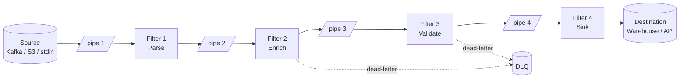
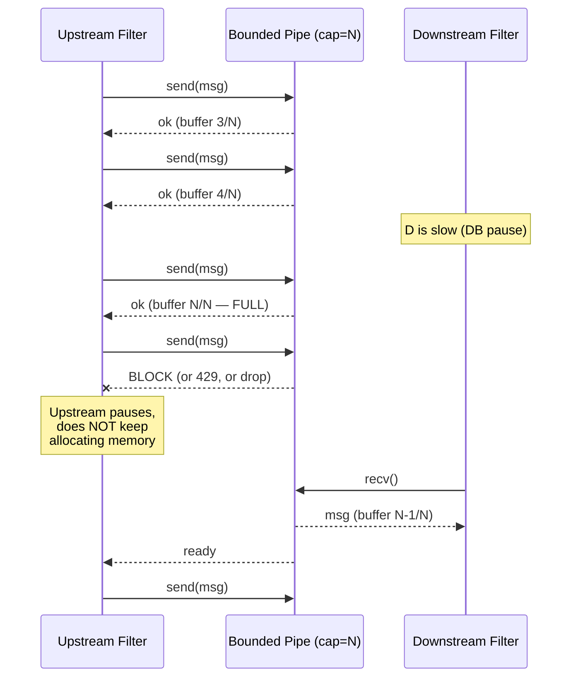
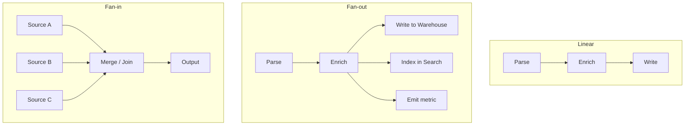

# Pipes and Filters

## Why This Exists

**The problem.** Data transformation pipelines tend to ossify. What starts as `parse → enrich → write` becomes a 2,000-line `process()` method with seventeen feature flags, three database connections, and a `try/except: pass` wrapped around a CSV parser that swallows a once-a-month encoding bug. You can't unit-test stage 4 without standing up stages 1–3. You can't scale stage 2 (the slow one) without scaling stage 1 (the cheap one). And when stage 5 (a downstream API) starts returning 503s, stages 1–4 happily keep producing work that piles up in memory until the OOM killer arrives.

**Key insight.** Treat each transformation as a **filter** — a pure-ish function with a single input stream and a single output stream — and the connections between them as **pipes** with explicit, bounded capacity. The pipe is not a method call. It is a queue (in-process channel, Kafka topic, Unix FIFO, file, S3 prefix) with a defined contract: serialization format, ordering guarantee, and a backpressure protocol. The pipe is the **architectural seam** that lets you scale, test, replace, and observe each stage independently.

**Reach for this when:**
- Stages have **wildly different cost profiles** (cheap parse, expensive ML inference, cheap write) — you want to scale them independently.
- You want **stage-level reusability** — the same parser feeds the realtime path and the nightly backfill.
- You want **stage-level testability** — given input bytes, assert output bytes; no fixtures for the whole pipeline.
- You need **resumability** — if stage 4 crashes, restart it from the pipe, not from the beginning of the world.
- The data is naturally a **stream** (logs, events, rows, files) rather than a request/response.
- You need to **mix synchronous and asynchronous** stages (CPU-bound parse + IO-bound network call) without one blocking the other.

**Don't reach for this when:**
- The transformation is **fundamentally one transaction** that must commit-or-rollback as a unit (use a saga or a DB transaction, not a pipeline).
- Stages need **arbitrary back-and-forth communication** ("did you see X earlier?") — that's a stateful service, not a filter.
- The data has **strong cross-record dependencies** that can't be windowed (e.g. graph algorithms requiring the full graph in memory) — bring it into a single process and use proper algorithms.
- The pipeline is **three lines of code** that will never grow. Don't build infrastructure for a five-step list comprehension.
- **Latency is dominated by the pipe**, not the stages. If each filter does 50µs of work and the queue hop is 5ms, you've made things worse.

## Diagrams

### The canonical shape



### Backpressure as a protocol, not an accident



### Topology variants (linear, fan-out, fan-in)



## Core patterns

### 1. The Unix model: the original (and still excellent) implementation

Doug McIlroy's 1964 memo and the eventual 1973 Unix pipe are the ur-text. Every filter reads stdin, writes stdout, and emits errors on stderr. The kernel provides a bounded byte pipe (default 64KB on Linux) that **blocks the writer when full and the reader when empty**. That blocking is the backpressure protocol.

```bash
# Logs in, top-10 IPs out. Each stage is independently testable, replaceable,
# and runs in its own process scheduled by the kernel.
zcat access-*.gz \
  | awk '$9 == 200 {print $1}' \
  | sort \
  | uniq -c \
  | sort -rn \
  | head -10
```

What's worth noting:
- `sort` will spill to disk when memory is full — a real backpressure-aware filter.
- If `head` exits, the kernel sends `SIGPIPE` upstream — propagated cancellation, for free.
- Errors don't pollute the data channel because stderr is a separate pipe.
- The contract between filters is **bytes with a delimiter** (newline). Schema mismatches show up as `awk` output looking weird, not as type errors at compile time. This is the trade-off: maximum composability, minimum static safety.

The Unix model is what every later "pipes and filters" architecture is approximating with more types and more knobs.

### 2. In-process pipes: bounded queues + worker pools (Go)

When all filters live in one process, the "pipe" is a bounded channel. The bound is the architecture — unbounded pipes are not a pipe-and-filter implementation, they're a memory leak waiting for the right input rate.

```go
// Stages connected by bounded channels. Each stage is a goroutine pool.
// The bounded channel IS the backpressure mechanism — sends block when full.
package pipeline

import (
    "context"
    "encoding/json"
    "fmt"
    "sync"
)

type RawEvent []byte
type ParsedEvent struct {
    UserID string
    Action string
    TS     int64
}
type EnrichedEvent struct {
    ParsedEvent
    Country string
}

// Parse: bytes -> ParsedEvent. Pure. Easy to unit-test.
func Parse(ctx context.Context, in <-chan RawEvent, out chan<- ParsedEvent, dlq chan<- RawEvent) {
    for {
        select {
        case <-ctx.Done():
            return
        case raw, ok := <-in:
            if !ok {
                return // upstream closed; drain done
            }
            var p ParsedEvent
            if err := json.Unmarshal(raw, &p); err != nil {
                // Poison message: route to DLQ, do NOT panic the stage.
                select {
                case dlq <- raw:
                case <-ctx.Done():
                    return
                }
                continue
            }
            select {
            case out <- p:    // blocks if downstream is full → backpressure
            case <-ctx.Done():
                return
            }
        }
    }
}

// Enrich: ParsedEvent -> EnrichedEvent. IO-bound; benefits from a wider pool.
func Enrich(ctx context.Context, geo GeoLookup, in <-chan ParsedEvent, out chan<- EnrichedEvent) {
    for {
        select {
        case <-ctx.Done():
            return
        case p, ok := <-in:
            if !ok {
                return
            }
            country, err := geo.Lookup(ctx, p.UserID)
            if err != nil {
                country = "UNKNOWN" // graceful degradation; do NOT drop
            }
            select {
            case out <- EnrichedEvent{ParsedEvent: p, Country: country}:
            case <-ctx.Done():
                return
            }
        }
    }
}

type GeoLookup interface {
    Lookup(ctx context.Context, userID string) (string, error)
}

// Topology: build it explicitly. The numbers (buffer, workers) are the knobs
// that let you tune for your real cost profile without changing filter code.
func Run(ctx context.Context, src <-chan RawEvent, sink func(EnrichedEvent) error, geo GeoLookup) error {
    parsed := make(chan ParsedEvent, 1024)   // small buffer: parse is fast
    enriched := make(chan EnrichedEvent, 256) // smaller: writers are slow
    dlq := make(chan RawEvent, 64)

    var wg sync.WaitGroup

    // Stage 1: 2 parsers (CPU-bound, only need ~ncpu)
    for i := 0; i < 2; i++ {
        wg.Add(1)
        go func() { defer wg.Done(); Parse(ctx, src, parsed, dlq) }()
    }

    // Stage 2: 32 enrichers (IO-bound, dominated by GeoLookup latency)
    var wg2 sync.WaitGroup
    for i := 0; i < 32; i++ {
        wg2.Add(1)
        go func() { defer wg2.Done(); Enrich(ctx, geo, parsed, enriched) }()
    }

    // Stage 3: serial sink (e.g., a transactional writer)
    var wg3 sync.WaitGroup
    wg3.Add(1)
    go func() {
        defer wg3.Done()
        for ev := range enriched {
            if err := sink(ev); err != nil {
                // backpressure: stop pulling so upstream queues fill and block
                fmt.Println("sink err, will retry:", err)
            }
        }
    }()

    // DLQ drainer
    go func() {
        for raw := range dlq {
            // ship to S3 / a separate Kafka topic for human review
            _ = raw
        }
    }()

    // Orderly shutdown: close pipes in order so each stage drains its input
    wg.Wait()       // parsers done
    close(parsed)
    wg2.Wait()      // enrichers done
    close(enriched)
    wg3.Wait()      // sink done
    close(dlq)
    return nil
}
```

The architectural decisions encoded above:

| Decision | Why |
|---|---|
| **Bounded** channels (1024, 256, 64) | Memory ceiling is explicit; OOM is impossible at known input rates. |
| **2 parse workers, 32 enrich workers** | Pool size matches the bottleneck: CPU-bound stages get ncpu, IO-bound get many more. |
| **DLQ as a separate pipe** | Errors don't block the data path. You can grep the DLQ a week later. |
| **`select { case <-ctx.Done() }` on every send/recv** | Cancellation propagates through the topology in ms, not minutes. |
| **Stages don't share state** | Each is testable in isolation: `Parse([]byte) -> ParsedEvent, error`. |

### 3. ETL as pipes-and-filters (Python, with explicit batch boundaries)

A common mistake in ETL is to treat the whole job as a single transaction. The Pipes-and-Filters lens says: each stage is a checkpoint. If you can land the parsed-but-unenriched data in a staging table, restart from there.

```python
# extract -> stage_raw -> parse -> stage_parsed -> enrich -> stage_enriched -> publish
# Each arrow is a durable "pipe" (table). Recovery is "rerun from the last good
# stage" instead of "rerun from S3".

from dataclasses import dataclass
from typing import Iterator
import logging

log = logging.getLogger(__name__)

@dataclass
class RawRow:
    raw_json: str
    src_offset: int  # so you can dedupe on retry

@dataclass
class ParsedRow:
    user_id: str
    action: str
    ts: int
    src_offset: int

# Filters are generators — pull-based, lazy, naturally backpressured.
def parse(rows: Iterator[RawRow]) -> Iterator[ParsedRow]:
    import json
    for r in rows:
        try:
            d = json.loads(r.raw_json)
            yield ParsedRow(d["user_id"], d["action"], int(d["ts"]), r.src_offset)
        except (ValueError, KeyError) as e:
            # Don't crash the batch on one bad row. Log + skip + count.
            log.warning("parse failed at offset=%d err=%s", r.src_offset, e)
            METRICS.increment("etl.parse.failed")

def enrich(rows: Iterator[ParsedRow], geo) -> Iterator["EnrichedRow"]:
    # Batch DB lookups instead of N+1 — the filter abstraction does NOT mean
    # one record at a time. Compose batched filters where it matters.
    BATCH = 500
    buf: list[ParsedRow] = []
    for r in rows:
        buf.append(r)
        if len(buf) >= BATCH:
            yield from _enrich_batch(buf, geo)
            buf = []
    if buf:
        yield from _enrich_batch(buf, geo)

def _enrich_batch(batch, geo):
    user_ids = [r.user_id for r in batch]
    countries = geo.bulk_lookup(user_ids)  # one round trip
    for r in batch:
        yield EnrichedRow(r, countries.get(r.user_id, "UNKNOWN"))
```

Two non-obvious points:

- **Generators are pipes.** A Python generator is a single-consumer, single-producer pipe with a buffer of one. The consumer's `next()` is the demand signal. This is enough for many ETL jobs — no thread, no queue, no Kafka.
- **Batch within filters, stream between them.** Each filter exposes a one-record-at-a-time interface (the iterator) but is free to batch internally. This is how you keep the abstraction clean while still doing 500-row INSERTs.

### 4. Kafka Streams DSL: pipes-and-filters as a topology language

Kafka Streams (and similar: Flink DataStream, Beam, Spark Structured Streaming) is pipes-and-filters made into a DSL. Each operator is a filter. Each topic — including the auto-generated repartition topics — is a pipe. The DSL is a way to declare the topology without writing the wiring code.

```java
// Java: Kafka Streams DSL. The topology is declarative — the runtime handles
// threading, repartitioning, state stores, and (crucially) backpressure.
StreamsBuilder builder = new StreamsBuilder();

KStream<String, RawEvent> raw = builder.stream(
    "events.raw",
    Consumed.with(Serdes.String(), rawEventSerde)
);

KStream<String, ParsedEvent> parsed = raw
    // map = stateless 1:1 filter
    .mapValues((k, v) -> Parser.parse(v))
    // filter = drop nulls (parse failures) — but ALSO branch them to a DLQ topic
    .filter((k, v) -> v != null);

raw.filter((k, v) -> Parser.parse(v) == null)
   .to("events.dlq");  // separate pipe for errors

KStream<String, EnrichedEvent> enriched = parsed
    // join = stateful filter against a KTable (compacted topic = state pipe)
    .leftJoin(
        builder.table("user.profile"),
        (event, profile) -> Enricher.enrich(event, profile)
    );

enriched
    .groupByKey()
    .windowedBy(TimeWindows.of(Duration.ofMinutes(5)))
    .count()
    .toStream()
    .to("events.5min_count");
```

What Kafka Streams gets right (and that you should imitate even when not using it):

- **Each stage is a topic-to-topic transformation.** That topic is durable, replayable, and observable — a real pipe.
- **Repartitioning is explicit.** When you `groupBy(newKey)`, the framework writes to an internal repartition topic — which is just another pipe, with the same guarantees as user-defined ones. There is no magic.
- **Backpressure is consumer lag.** If a downstream stage falls behind, lag grows on its input topic. Operators alarm on lag, not on memory.
- **State stores are local.** Each filter that needs state (joins, aggregations) keeps it in RocksDB on the local disk and the changelog is a compacted Kafka topic. State is not a shared database.

What Kafka Streams gets wrong (or rather, what it's expensive about):

- **Rebalance storms.** Adding/removing instances triggers a stop-the-world reassignment. With many state stores, this can take minutes. Use `static membership` and `cooperative-sticky` assignor.
- **One slow stage stalls the partition.** Streams processes a partition with one thread; a slow filter on partition 7 stops everything else on partition 7. You cannot "scale just stage 4" within Streams — you must split the topology across topics.

### 5. Log shipping: Logstash, Vector, Fluentd as pipes-and-filters servers

These are pipes-and-filters frameworks where each "filter" is a configured plugin and the topology is a YAML/Ruby/TOML file. They differ in how they handle backpressure — and this is the most common operational footgun.

```toml
# Vector: explicit topology, in-memory pipes between transforms.
# Sources -> transforms -> sinks. Each is a filter; the connection is the pipe.

[sources.app_logs]
type = "file"
include = ["/var/log/app/*.log"]
read_from = "beginning"

[transforms.parse_json]
type = "remap"
inputs = ["app_logs"]
source = '''
  . = parse_json!(.message)
  .timestamp = parse_timestamp!(.ts, "%+")
'''

[transforms.drop_health_checks]
type = "filter"
inputs = ["parse_json"]
condition = '.path != "/healthz"'

[sinks.warehouse]
type = "aws_s3"
inputs = ["drop_health_checks"]
bucket = "logs-prod"
compression = "gzip"
batch.max_bytes = 10485760
batch.timeout_secs = 300

# CRITICAL: bound the in-memory pipe and choose a behavior on overflow.
# The default "block" propagates backpressure to the source (file reader pauses).
# "drop_newest" silently drops events under load — usually wrong.
[sinks.warehouse.buffer]
type = "memory"
max_events = 50000
when_full = "block"
```

The lesson, learned painfully across many incidents: **Logstash, Fluentd, and Vector all default to in-memory buffers that grow until OOM unless you configure them**. The fix is one of:

1. **Disk-backed buffers** (Vector's `type = "disk"`, Fluentd's `buf_file`) — slower, but survive restarts and OOM.
2. **`when_full = "block"`** — propagate backpressure to the source. The source must support it (file tailers do; UDP receivers don't, by definition).
3. **A real pipe** between agent and warehouse: send to Kafka or Kinesis first, let the durable log handle buffering. Logstash/Vector becomes a thin filter, not a buffer.

### 6. Testing filters: the property the architecture buys you

The whole point of pipes-and-filters is that each filter is a function you can test without wiring up the world.

```python
# Test the filter, not the pipeline. No Kafka. No S3. No DB.
def test_parse_drops_invalid_json():
    rows = [RawRow(raw_json='not json', src_offset=1),
            RawRow(raw_json='{"user_id":"u1","action":"x","ts":1}', src_offset=2)]
    out = list(parse(iter(rows)))
    assert len(out) == 1
    assert out[0].user_id == "u1"
    assert out[0].src_offset == 2

def test_parse_handles_missing_field():
    rows = [RawRow(raw_json='{"user_id":"u1"}', src_offset=1)]
    out = list(parse(iter(rows)))
    assert out == []  # missing 'action' -> drop, don't crash

# Property test: composition is associative. The filter doesn't care if it
# gets one record or a thousand; the output is a function of the input.
@given(st.lists(st.builds(RawRow, ...)))
def test_parse_is_streaming(rows):
    eager = list(parse(iter(rows)))
    lazy = []
    g = parse(iter(rows))
    for r in g:
        lazy.append(r)
    assert eager == lazy
```

If your "filter" cannot be tested this way — if it requires a running Kafka, a populated DB, and a 30-second sleep — it's not a filter. It's a service masquerading as a filter, and you should split it.

## Trade-offs

| Benefit | Cost |
|---|---|
| Each stage is independently testable | Schema between stages becomes a contract you must version and evolve carefully |
| Each stage scales independently (different worker counts, different machines) | Operating N processes/services is more work than operating 1, and the slowest stage gates throughput regardless |
| Reusable filters across realtime + batch paths | "Once-only" semantics across a pipeline are hard — each pipe hop adds a place where a duplicate can appear |
| Backpressure makes overload predictable | Backpressure is only useful if it's actually wired end-to-end; one unbounded pipe in the middle and the property is gone |
| Failures are localized — one filter can crash without taking down others | Distributed pipelines have distributed debugging — a missing event needs to be traced across pipes; you need correlation IDs and per-pipe lag/depth metrics |
| Adding a new consumer is "just subscribe to the pipe" (fan-out) | Removing a consumer can leak messages in the pipe forever if cleanup is forgotten — every queue/topic is a thing to manage |
| Stage logic is pure(-ish) and easy to reason about | Cross-stage transactions are hard; if step 4 must atomically commit with step 1's source offset, you need an orchestrator (saga, transactional outbox), not a pipeline |
| The pipe is a natural place to inject ordering, partitioning, retry | Latency = sum of stage latencies + sum of pipe-hop latencies; for sub-ms work, the pipe overhead dominates |

## Common Pitfalls

- **Unbounded pipes.** A `chan T` (no buffer arg in Go), a `BlockingQueue` with `Integer.MAX_VALUE`, a "we'll just hold it in memory" buffer. Under sustained overload, memory grows until OOM. **Every pipe must have a finite capacity and a defined behavior at capacity** (block, drop-oldest, drop-newest, spill-to-disk, error). Pick one explicitly. Vector, Logstash, and Fluentd all default to "block, but only after a 50k-event in-memory buffer" — read the docs.

- **Backpressure that stops at a sync boundary.** Your in-process pipes block correctly. But the HTTP server in front of them returns 200 before enqueueing. Now the queue fills, in-process backpressure kicks in… and the HTTP layer keeps accepting. Backpressure must propagate **all the way back to whoever can shed load** (the load balancer, the producer, the user). If the protocol can't say "slow down" (UDP, fire-and-forget HTTP), you must drop or you must buffer to disk.

- **One slow filter starves the whole pipeline.** Easy to spot in Kafka Streams (consumer lag), easy to miss in Go (one slow goroutine, no metric, channels look fine). Emit per-stage `queue_depth`, `events_in_per_sec`, `events_out_per_sec`, `processing_time_p99`. Alarm on `events_out / events_in < 1` sustained over a minute.

- **"Poison pill" messages crash the consumer in a loop.** A message your filter cannot parse is committed back to the topic, redelivered, crashes again. **Always have a DLQ.** The rule: after K retries, route to DLQ and continue. K should be small (3 is fine). Without this, one bad event from 2017 stops your pipeline forever.

- **Implicit ordering assumptions.** "These events arrive in order" is true within a Kafka partition, untrue across partitions, untrue after a parallel filter that reorders. If stage 4 needs `created` before `updated` for a key, **either co-partition by key or buffer-and-sort**. Don't pretend ordering is free.

- **Fat filters that do three things.** Once a "filter" reads from one input, calls three APIs, decides which of two outputs to write to, and updates an in-memory cache, you've reinvented the monolith inside a pipeline. Filters should do **one transformation**. If you need branching, use a router stage.

- **Stateful filters without state ownership.** A filter that holds a `lastSeen` map will lose it on restart and will be wrong if you scale it horizontally. Either make the state local + rebuildable from a changelog (Kafka Streams style) or push the state to a real store and accept the latency.

- **No idempotency at the sinks.** Pipes-and-filters guarantees at-least-once delivery in almost every real implementation (network retries, consumer rebalances). Sinks that do `INSERT` instead of `UPSERT-by-natural-key` will produce duplicate charges, duplicate emails, double counts. Idempotency keys are not optional.

- **Schema drift between stages.** Stage 1 starts emitting `user_id` as int, stage 2 expects string. The pipe (a topic, a queue, a DB table) is the contract. Use a schema registry (Avro/Protobuf) or at minimum a versioned struct, and don't change wire formats in place.

- **"We'll just write it to a file in /tmp."** Now you have a pipe whose capacity is your disk and whose retention is whoever runs `find /tmp -mtime +1 -delete`. Pipes need owners.

- **Operator pain compounds.** Each pipe is a thing with metrics, alarms, retention, encryption, IAM, and a runbook. Five filters means five sets of those. **Before adding a stage, ask if it can be merged with a neighbor.** The cost of a stage is not the code — it's the operations.

## Decision Table

| You're choosing between... | Pick **Pipes & Filters** when... | Pick the alternative when... |
|---|---|---|
| Pipes-and-Filters vs. **Monolithic transformation function** | Stages have different scaling needs OR you want stage-level testability OR the pipeline grows over time | The whole transformation is < 200 lines, has uniform cost, and won't grow. Don't over-architect. |
| Pipes-and-Filters vs. **Orchestration (Step Functions / Airflow / Temporal)** | Data flows continuously, stages are uniform per record, and you mostly care about throughput | Each "step" is a long-running, heterogeneous task that needs human approval, retries with policy, conditional branching, and durable workflow state. Orchestrators handle workflows; pipelines handle streams. |
| Pipes-and-Filters vs. **Event-Driven / Choreography** | Stages form a clear DAG you control end-to-end; you own all of it | Independent teams own each consumer, the topology is open-ended, and stages are autonomous services that happen to share a topic |
| Pipes-and-Filters vs. **Request/Response (sync RPC chain)** | The work is naturally a stream, latency budget is 100ms+, and throughput matters more than per-record latency | A user is waiting on a result with sub-100ms latency budget — a sync chain is simpler to reason about than a pipeline |
| In-process pipes (channels) vs. **Cross-process pipes (Kafka/SQS)** | Throughput > 100k/s, total CPU fits in one box, no need to survive process restart | You need durability (replay after crash), independent deploy of stages, language polyglot, or a fan-out audience you don't control |
| Kafka Streams DSL vs. **Hand-written consumers/producers** | Topology is mostly stateless transforms + windowed aggregations; you want exactly-once and don't want to write the rebalance logic | You need fine-grained control of poll/commit, custom backpressure, or your topology has very few stages and "just a consumer" is simpler |
| Vector / Fluentd vs. **App writes directly to Kafka/Kinesis** | You don't control the source apps (legacy, third-party), or you have many sources and a small number of sinks | App teams own logging end-to-end and can adopt a SDK; the agent layer is just operational overhead |
| Pull-based pipes (consumer-driven) vs. **Push-based pipes (producer pushes downstream)** | You want backpressure to be implicit (don't pull → producer blocks) | The downstream is many subscribers and the upstream shouldn't know about them — push to a broker that handles fan-out |
| Filter-with-DLQ vs. **Crash-and-restart on bad input** | The pipeline must keep flowing even if 1 in 10,000 records is malformed | You're processing money or contracts where dropping a record is worse than stopping; make the failure loud |

## References

- **Doug McIlroy — "A Bell System Memo (1964)" + "A Quarter Century of Unix" (1994)** — origin of Unix pipes — https://www.cs.dartmouth.edu/~doug/sieve/sieve.pdf
- **Brian Kernighan & Rob Pike — "The Unix Programming Environment" (1984)** — canonical text on filters and stream-oriented design (book, no canonical free URL)
- **Martin Kleppmann — "Designing Data-Intensive Applications" (2017)** — ch. 10 (Batch Processing) and ch. 11 (Stream Processing) — pipes-and-filters lineage from Unix to Kafka Streams — https://dataintensive.net/
- **Apache Kafka Streams — Architecture documentation** — topology, repartition topics, state stores, exactly-once — https://kafka.apache.org/documentation/streams/architecture
- **Apache Kafka — KIP-447 (transactional producer/consumer for exactly-once)** — https://cwiki.apache.org/confluence/display/KAFKA/KIP-447%3A+Producer+scalability+for+exactly+once+semantics
- **Apache Flink — DataStream API & backpressure docs** — concrete model for pipes with credit-based flow control — https://nightlies.apache.org/flink/flink-docs-stable/docs/ops/monitoring/back_pressure/
- **Vector docs — Buffers and Backpressure** — https://vector.dev/docs/reference/configuration/sinks/aws_s3/#buffer
- **Fluentd — Buffer Plugin Overview** — https://docs.fluentd.org/buffer
- **Logstash — Persistent Queues** — https://www.elastic.co/guide/en/logstash/current/persistent-queues.html
- **Frank Buschmann et al. — "Pattern-Oriented Software Architecture, Vol. 1" (POSA1)** — original "Pipes and Filters" pattern catalog entry (book)
- **Gregor Hohpe & Bobby Woolf — "Enterprise Integration Patterns"** — pipes-and-filters, message channel, dead letter channel — https://www.enterpriseintegrationpatterns.com/patterns/messaging/PipesAndFilters.html
- **AWS Builders' Library — "Avoiding insurmountable queue backlogs"** (Marc Brooker) — backpressure, queue management, load shedding — https://aws.amazon.com/builders-library/avoiding-insurmountable-queue-backlogs/
- **AWS Builders' Library — "Using load shedding to avoid overload"** — https://aws.amazon.com/builders-library/using-load-shedding-to-avoid-overload/
- **Google SRE Book — ch. 22 "Addressing Cascading Failures"** — backpressure, queue depth, graceful degradation — https://sre.google/sre-book/addressing-cascading-failures/
- **Google SRE Workbook — ch. 11 "Managing Load"** — https://sre.google/workbook/managing-load/
- **Dean Wampler — "Fast Data Architectures for Streaming Applications" (O'Reilly)** — taxonomy of streaming pipeline shapes
- **Reactive Streams Specification** — async stream processing with non-blocking backpressure (the JVM standard — Akka, RxJava, Project Reactor) — https://www.reactive-streams.org/
- **Adrian Colyer — "The morning paper" — MillWheel: Fault-Tolerant Stream Processing at Internet Scale** — https://blog.acolyer.org/2015/08/19/millwheel-fault-tolerant-stream-processing-at-internet-scale/
- **Pat Helland — "Immutability Changes Everything"** — why pipelines benefit from append-only, immutable inputs — https://queue.acm.org/detail.cfm?id=2884038
- **Martin Fowler — "Streaming Topology"** (and broader EventSourcing / streaming notes) — https://martinfowler.com/articles/

## See Also

- `../event-driven/` — when stages should become independent services rather than steps in your pipeline
- `../saga/` — when "atomic across stages" matters and you can't get away with at-least-once + idempotency
- `../../communication/message-queues/` — where poison messages go to be triaged
- `../../reliability/circuit-breaker/` — protecting downstream filters from cascading failures
- `../../data-systems/stream-processing/` — patterns specific to unbounded streams (windowing, watermarks, late data)
- `../../data-systems/schema-evolution/` — versioning the contract between filters
