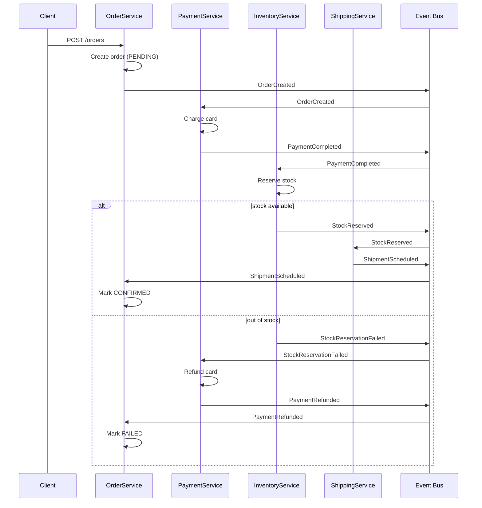
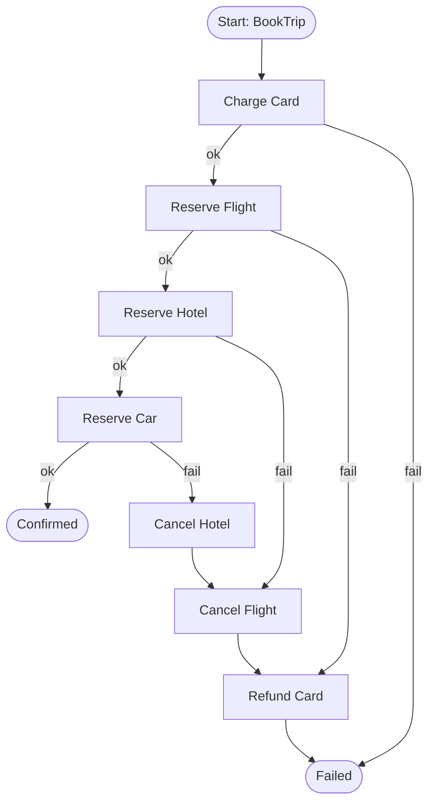
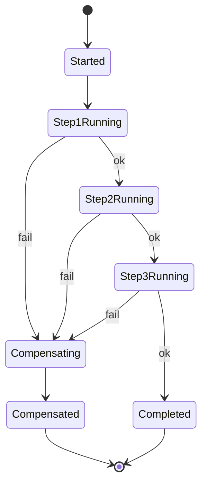

# Saga Pattern

## Why This Exists

**Problem.** A business operation spans N services, each with its own database. The user expects "all or nothing" semantics — book the flight, hotel, and car together, or none of them. But there is no distributed transaction across PostgreSQL + DynamoDB + a third-party Stripe API + an internal `Inventory` service. Two-phase commit (2PC) requires every participant to support a coordinator-controlled prepare phase, blocks resources during the prepare window, and turns any coordinator outage into a service-wide stall (Gray & Lamport, "Consensus on Transaction Commit"). In practice, microservices and external APIs simply don't speak XA.

**Key insight.** Garcia-Molina & Salem (1987) observed that long-lived transactions can be modeled as a **sequence of local transactions**, each with a **compensating action** that semantically (not physically) undoes its effect. You give up isolation (other transactions can see intermediate state) and atomicity (true rollback) in exchange for liveness, partial progress, and the ability to span heterogeneous systems. A Saga is **eventually consistent** — never atomic.

**Reach for this when:**
- A workflow crosses **service or database boundaries** and you can't run one local transaction.
- Steps include **external calls** (payment processors, shipping APIs, email) that can't participate in 2PC.
- Operations are **long-running** (seconds to days): waiting for human approval, async fulfillment, batch settlement.
- You need **observable progress** — a UI that shows "step 3 of 5: charging card."
- The business already accepts **eventual consistency** — bookings get held, then confirmed, then potentially refunded.

**Don't reach for this when:**
- All writes hit **one database**. Just use `BEGIN; ... COMMIT;`. A Saga over a single Postgres is malpractice.
- The operation is **read-heavy with one terminal write**. A Saga buys nothing.
- Compensations don't exist or are **unsafe** (you can't un-send an SMS, un-fire a missile, un-publish a tweet without strangeness). Either redesign the workflow to defer the irreversible step to the end ("pivot transaction") or use 2PC if all participants support it.
- You need **strong isolation** between concurrent workflows. Sagas are vulnerable to dirty reads and lost updates between steps; you'd be reinventing locking poorly.
- The team has **fewer than 3 services** in the transaction. A monolith with a transactional outbox is simpler and cheaper.

## Diagrams

### Choreography (event-driven, no central coordinator)



### Orchestration (central coordinator, e.g. Temporal / Step Functions)



### State machine of a single Saga instance



## Core Patterns

### 1. Orchestrated Saga in Temporal (Python)

Temporal is the de-facto orchestration engine in 2024+: durable execution, automatic retries, replay-based state, and first-class compensation. The workflow code below survives worker crashes and restarts because Temporal persists every decision to its event history.

```python
# workflow.py
from datetime import timedelta
from temporalio import workflow
from temporalio.common import RetryPolicy
from temporalio.exceptions import ActivityError

with workflow.unsafe.imports_passed_through():
    from activities import (
        charge_card, refund_card,
        reserve_flight, cancel_flight,
        reserve_hotel, cancel_hotel,
        reserve_car, cancel_car,
    )

@workflow.defn
class BookTripSaga:
    @workflow.run
    async def run(self, req: dict) -> dict:
        # Compensations run in REVERSE order — LIFO stack of "undo" callables.
        compensations = []

        # Standard retry policy: exponential backoff, but cap attempts so a
        # truly broken downstream doesn't loop forever. Temporal will preserve
        # the workflow state across retries; the activity itself must be
        # idempotent (see activities.py).
        retry = RetryPolicy(
            initial_interval=timedelta(seconds=1),
            backoff_coefficient=2.0,
            maximum_interval=timedelta(minutes=1),
            maximum_attempts=5,
        )

        try:
            charge = await workflow.execute_activity(
                charge_card,
                args=[req["user_id"], req["amount"], req["idempotency_key"]],
                start_to_close_timeout=timedelta(seconds=30),
                retry_policy=retry,
            )
            # Push compensation BEFORE the next forward step. If we crash
            # between forward step and registering its undo, we'd leak.
            compensations.append(
                lambda: workflow.execute_activity(
                    refund_card,
                    args=[charge["charge_id"]],
                    start_to_close_timeout=timedelta(seconds=30),
                    retry_policy=retry,
                )
            )

            flight = await workflow.execute_activity(
                reserve_flight,
                args=[req["flight"], req["user_id"]],
                start_to_close_timeout=timedelta(seconds=30),
                retry_policy=retry,
            )
            compensations.append(
                lambda: workflow.execute_activity(
                    cancel_flight,
                    args=[flight["reservation_id"]],
                    start_to_close_timeout=timedelta(seconds=30),
                    retry_policy=retry,
                )
            )

            hotel = await workflow.execute_activity(
                reserve_hotel,
                args=[req["hotel"], req["user_id"]],
                start_to_close_timeout=timedelta(seconds=30),
                retry_policy=retry,
            )
            compensations.append(
                lambda: workflow.execute_activity(
                    cancel_hotel,
                    args=[hotel["reservation_id"]],
                    start_to_close_timeout=timedelta(seconds=30),
                    retry_policy=retry,
                )
            )

            car = await workflow.execute_activity(
                reserve_car,
                args=[req["car"], req["user_id"]],
                start_to_close_timeout=timedelta(seconds=30),
                retry_policy=retry,
            )
            # Final step — no compensation needed if it succeeds.

            return {
                "status": "CONFIRMED",
                "charge_id": charge["charge_id"],
                "flight": flight["reservation_id"],
                "hotel": hotel["reservation_id"],
                "car": car["reservation_id"],
            }

        except ActivityError as e:
            workflow.logger.error(f"Saga failed: {e}. Compensating.")
            # Run compensations LIFO. Each compensation MUST be idempotent
            # because we may retry on transient failures, and we MUST NOT
            # let a compensation failure abort the rest — log and continue,
            # then surface to a dead-letter / human queue if any failed.
            comp_failures = []
            for undo in reversed(compensations):
                try:
                    await undo()
                except Exception as ex:
                    comp_failures.append(str(ex))
                    workflow.logger.exception("Compensation failed")

            if comp_failures:
                # Critical: a partial compensation means real-world drift.
                # Emit to an alerting topic for human intervention.
                await workflow.execute_activity(
                    "escalate_to_humans",
                    args=[{"workflow_id": workflow.info().workflow_id,
                           "errors": comp_failures}],
                    start_to_close_timeout=timedelta(seconds=10),
                )
            return {"status": "FAILED", "reason": str(e)}
```

### 2. Idempotent activity (the non-negotiable foundation)

Every Saga step MUST be idempotent. Network retries, worker crashes mid-ack, and at-least-once message delivery guarantee that you'll execute every step "1 or more times". The trick: a deduplication key persisted alongside the side effect, in the **same local transaction**.

```python
# activities.py
from temporalio import activity
import psycopg
import stripe

@activity.defn
async def charge_card(user_id: str, amount_cents: int, idempotency_key: str) -> dict:
    # Stripe natively supports idempotency keys — the same key returns the
    # same charge object even if the network ate the first response.
    # https://stripe.com/docs/api/idempotent_requests
    charge = stripe.Charge.create(
        amount=amount_cents,
        currency="usd",
        customer=user_id,
        idempotency_key=idempotency_key,
    )
    return {"charge_id": charge.id, "amount": charge.amount}


@activity.defn
async def reserve_flight(flight: dict, user_id: str) -> dict:
    # No native idempotency on the upstream API? Implement it yourself:
    # a UNIQUE constraint on (workflow_id, step_name) in your own DB.
    activity_info = activity.info()
    dedup_key = f"{activity_info.workflow_id}:reserve_flight"

    async with psycopg.AsyncConnection.connect(DSN) as conn:
        async with conn.transaction():
            # Has this step already run? If so, return the prior result.
            row = await (await conn.execute(
                "SELECT result FROM saga_step_log WHERE dedup_key = %s",
                (dedup_key,),
            )).fetchone()
            if row:
                return row[0]  # JSONB result of the prior successful run

            # Do the work.
            reservation_id = await call_flight_api(flight, user_id)
            result = {"reservation_id": reservation_id}

            # Persist the result in the SAME transaction as any local writes
            # this activity makes. If we crash after the API call but before
            # this insert, the next retry will hit the API again — which is
            # why the API itself ALSO needs idempotency.
            await conn.execute(
                "INSERT INTO saga_step_log (dedup_key, result) VALUES (%s, %s)",
                (dedup_key, json.dumps(result)),
            )
            return result
```

The two layers of idempotency (your DB log + upstream API key) are belt-and-suspenders, but both are needed: your log won't help if your activity crashes between the API call and your `INSERT`. See Pat Helland, "Idempotence is Not a Medical Condition."

### 3. Choreographed Saga via transactional outbox

When you can't or won't run an orchestrator, services react to events on a bus. The hard part is publishing the event **atomically** with the local DB write — solved by the **transactional outbox pattern** (Microservices.io / Chris Richardson).

```sql
-- Outbox table lives in the same DB as your business tables.
CREATE TABLE outbox (
  id           BIGSERIAL PRIMARY KEY,
  aggregate_id TEXT NOT NULL,
  event_type   TEXT NOT NULL,
  payload      JSONB NOT NULL,
  created_at   TIMESTAMPTZ NOT NULL DEFAULT NOW(),
  published_at TIMESTAMPTZ
);
CREATE INDEX outbox_unpublished ON outbox (id) WHERE published_at IS NULL;
```

```python
# In OrderService — write order + outbox in ONE local transaction.
async def create_order(req):
    async with db.transaction():
        order_id = await db.fetch_val(
            "INSERT INTO orders(user_id, items, status) "
            "VALUES (%s, %s, 'PENDING') RETURNING id",
            (req.user_id, req.items),
        )
        await db.execute(
            "INSERT INTO outbox(aggregate_id, event_type, payload) "
            "VALUES (%s, 'OrderCreated', %s)",
            (str(order_id), json.dumps({"order_id": order_id, **req.dict()})),
        )
    return order_id

# A separate poller / Debezium CDC stream reads `outbox` and publishes to Kafka.
# Without the outbox, you'd have a dual-write problem: the order commits but
# the Kafka publish fails, or vice versa, and the Saga silently stalls.
```

### 4. AWS Step Functions (managed orchestration with native catch/compensate)

Step Functions handles retries and "Catch" branches declaratively. The state machine itself is durable — no worker code to babysit.

```yaml
# Amazon States Language (excerpt) — book-trip.asl.yaml
StartAt: ChargeCard
States:
  ChargeCard:
    Type: Task
    Resource: arn:aws:lambda:us-east-1:1234:function:ChargeCard
    Retry:
      - ErrorEquals: [Lambda.ServiceException, Lambda.TooManyRequestsException]
        IntervalSeconds: 2
        BackoffRate: 2.0
        MaxAttempts: 5
    Catch:
      - ErrorEquals: [States.ALL]
        ResultPath: $.error
        Next: Failed
    Next: ReserveFlight

  ReserveFlight:
    Type: Task
    Resource: arn:aws:lambda:us-east-1:1234:function:ReserveFlight
    Catch:
      - ErrorEquals: [States.ALL]
        ResultPath: $.error
        Next: RefundCard
    Next: ReserveHotel

  ReserveHotel:
    Type: Task
    Resource: arn:aws:lambda:us-east-1:1234:function:ReserveHotel
    Catch:
      - ErrorEquals: [States.ALL]
        ResultPath: $.error
        Next: CancelFlight
    Next: Confirmed

  CancelFlight:
    Type: Task
    Resource: arn:aws:lambda:us-east-1:1234:function:CancelFlight
    Next: RefundCard

  RefundCard:
    Type: Task
    Resource: arn:aws:lambda:us-east-1:1234:function:RefundCard
    Next: Failed

  Confirmed:
    Type: Succeed
  Failed:
    Type: Fail
    Cause: SagaFailed
```

## Compensations vs 2PC

| Dimension | Saga (compensations) | 2PC / XA |
|---|---|---|
| **Atomicity** | None — partial states are observable | True atomic commit across participants |
| **Isolation** | None — concurrent Sagas see each other's intermediate state | Serializable (per resource manager support) |
| **Coordinator failure** | Each step is independent; orchestrator can resume from log | Coordinator outage blocks participants holding prepared locks (the "blocking problem") |
| **Heterogeneous services** | Yes — works over HTTP, Kafka, Stripe API | No — every participant must implement XA prepare/commit |
| **Latency** | Sum of step durations + retries; can be hours | Bounded by slowest prepare; typically milliseconds |
| **Throughput** | High — no global locks | Low — locks held during prepare phase |
| **Failure mode** | Compensation failure → manual intervention | Heuristic commit → silent corruption |

DDIA chapter 9 ("Consistency and Consensus") explains why 2PC's blocking property and the absence of coordinator fault tolerance make it a bad fit for microservices. Pat Helland's "Life beyond Distributed Transactions" makes the same argument from the architect's perspective.

## Trade-offs

| Benefit | Cost |
|---|---|
| Works across heterogeneous services and external APIs | Lose ACID isolation — concurrent Sagas can interleave (DDIA §7) |
| No blocking locks → high throughput | Compensations must exist and be safe — some operations aren't truly reversible |
| Each step is a small local transaction → simple per-service code | Whole system is **eventually consistent**; UI must show "pending" states |
| Orchestrator gives observability + replayability | Orchestrator is a SPOF (mitigated by Temporal/SFN being managed) |
| Choreography is decoupled, autoscalable | Choreography becomes opaque past ~5 events — debugging is "where did the chain break?" |
| Compensations are explicit business logic, not a DB feature | You write 2x the code (forward + backward) |
| Long workflows can pause for human approval, async fulfillment | State explosion: any Saga step can fail at any time → N×M error paths |
| Resilient to partial failure — Temporal/SFN auto-retry | Idempotency is mandatory; bugs here cause **duplicate charges** |

## Common Pitfalls

- **Non-idempotent steps.** A worker crashes after calling Stripe but before recording the charge_id. The Saga retries and you charge the customer twice. **Fix:** Stripe `idempotency_key` + your own `(workflow_id, step)` UNIQUE row.
- **Non-commutative compensations.** Step A holds inventory; step B reserves a discount code. B fails, A's compensation tries to release stock — but a parallel Saga has already booked it. The compensation succeeds nominally but the business invariant ("a discount can never be applied to oversold inventory") is broken. **Fix:** semantic locks (mark records `PENDING_RESERVATION` so others skip them) or pivot transactions.
- **Compensation failures.** Refund API is down for 6 hours. Your Saga is stuck "compensating." **Fix:** retry with backoff, then dead-letter to a human queue. **Never** mark the Saga "compensated" if a compensation actually failed.
- **The "send email" trap.** You can't un-send an email or un-charge a printed shipping label. **Fix:** put irreversible steps **last** (the "pivot transaction" — Garcia-Molina §4) so any failure happens before the irreversible action.
- **Dual writes without outbox.** Service writes to its DB, then publishes to Kafka. The Kafka call fails. Now state and event diverge. **Fix:** transactional outbox or change-data-capture (Debezium).
- **Saga as god object.** Putting all business rules in the orchestrator turns it into a distributed monolith. **Fix:** orchestrator decides *what* to call; services own *how* and the validation of inputs.
- **Forgetting timeouts.** A "ReserveHotel" step waits 30 days for human approval and the Saga semantics around long-held holds were never modeled. **Fix:** explicit timers; auto-compensate after threshold.
- **Choreography over too many services.** 12 services, 30 event types, no map. Adding a new step requires reading every consumer to know who's listening. **Fix:** switch to orchestration; you've outgrown choreography.
- **Compensating with an exact inverse.** Refunding $100 isn't equivalent to "never charging $100" — the customer sees the $100 hit on their statement, then the credit. **Fix:** acknowledge that compensation is *semantic*, not *physical*; document the user-visible side effects.
- **Saga over a single database.** Yes, this happens. Engineers reach for a Saga because they read about it. A multi-row transaction in Postgres handles this in 50 lines. **Fix:** use `BEGIN ... COMMIT`.

## Decision Table

| Situation | Choose | Don't |
|---|---|---|
| 1 database, 1 service | Local DB transaction | Saga |
| 2-3 services, simple flow, you own all of them | **Choreography** + transactional outbox | Orchestrator overhead |
| 5+ steps, complex branching, human approval | **Orchestration** (Temporal / Step Functions / Camunda) | Choreography (untraceable) |
| All participants speak XA, sub-second SLAs | 2PC | Saga (overkill for committed locks) |
| Steps are a mix of HTTP APIs, Kafka, Stripe, S3 | Saga | 2PC (won't work) |
| Workflow runs > 5 minutes or includes async wait | Orchestrator with durable execution (Temporal) | Step Functions Express (5-min cap) or in-process retries |
| Heavy concurrent throughput, each Saga independent | Either, with idempotency | Anything that holds DB locks across services |
| Compensations don't exist (irreversible side effects) | Pivot transaction (defer irreversible step) or redesign | Pure Saga — you'll lie about your reliability |
| Team has no observability stack | **Orchestration** (free traces, history) | Choreography (will be a black box) |
| Need to evolve schema/flow over time | Orchestration with versioned workflows | Choreography (every consumer must coordinate) |

### Choreography vs Orchestration cheat sheet

| | Choreography | Orchestration |
|---|---|---|
| Coupling | Loose — services know events | Tight — orchestrator knows the flow |
| Visibility | Hard (distributed traces required) | Easy (one workflow ID, full history) |
| Adding a step | New consumer, no central change | Edit the workflow definition |
| Failure handling | Each service handles its own | Centralized retry/compensation logic |
| Best for | Few services, stable contracts | Many services, evolving flow |
| Tools | Kafka + outbox + Debezium | Temporal, AWS Step Functions, Camunda, Cadence, Conductor |

## References

- Hector Garcia-Molina, Kenneth Salem — *Sagas* (1987, Princeton/SIGMOD) — https://www.cs.cornell.edu/andru/cs711/2002fa/reading/sagas.pdf
- Pat Helland — *Life beyond Distributed Transactions: an Apostate's Opinion* — https://www.ics.uci.edu/~cs223/papers/cidr07p15.pdf
- Pat Helland — *Idempotence Is Not a Medical Condition* — https://queue.acm.org/detail.cfm?id=2187821
- Martin Kleppmann — *Designing Data-Intensive Applications*, ch. 7 (Transactions) and ch. 9 (Consistency and Consensus). O'Reilly, 2017.
- Chris Richardson — *Microservices Patterns*, ch. 4 (Saga). Manning, 2018. Pattern catalog: https://microservices.io/patterns/data/saga.html
- Chris Richardson — *Transactional Outbox* — https://microservices.io/patterns/data/transactional-outbox.html
- Caitie McCaffrey — *Distributed Sagas: A Protocol for Coordinating Microservices* (QCon 2017) — https://www.youtube.com/watch?v=0UTOLRTwOX0
- AWS — *Step Functions: Implement the saga pattern* — https://docs.aws.amazon.com/step-functions/latest/dg/sample-project-saga.html
- AWS Builders' Library — *Reliability, constant work, and a good cup of coffee* — https://aws.amazon.com/builders-library/reliability-and-constant-work/
- Temporal — *Saga pattern* — https://docs.temporal.io/encyclopedia/application-design-patterns#saga
- Camunda — *Saga Pattern with Camunda* — https://camunda.com/blog/2019/07/saga/
- Bernd Rücker — *3 common pitfalls in microservice integration — and how to avoid them* — https://blog.bernd-ruecker.com/3-common-pitfalls-in-microservice-integration-and-how-to-avoid-them-3f27a442cd07
- Stripe API — *Idempotent Requests* — https://stripe.com/docs/api/idempotent_requests
- Jim Gray, Leslie Lamport — *Consensus on Transaction Commit* — https://www.microsoft.com/en-us/research/publication/consensus-on-transaction-commit/
- Google SRE Workbook — *Managing Load* (relevant for cascading-failure consequences of bad compensation logic) — https://sre.google/workbook/managing-load/

## See Also

- `../event-driven/` — event buses, transactional outbox, change-data-capture
- `../cqrs/` — read/write split that often coexists with Sagas
- `../microservices/` — when to split services in the first place
- `../../data-systems/distributed-transactions/` — the alternative you mostly shouldn't use
- `../../communication/idempotency/` — the foundation that makes Sagas correct
- `../../reliability/circuit-breaker/` — protect Saga steps from a sick downstream
- `../../data-systems/consistency-models/` — the consistency model Sagas live in
- `../../performance/tracing/` — required to debug choreographed Sagas
