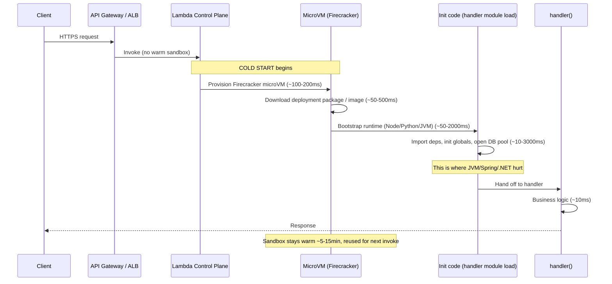
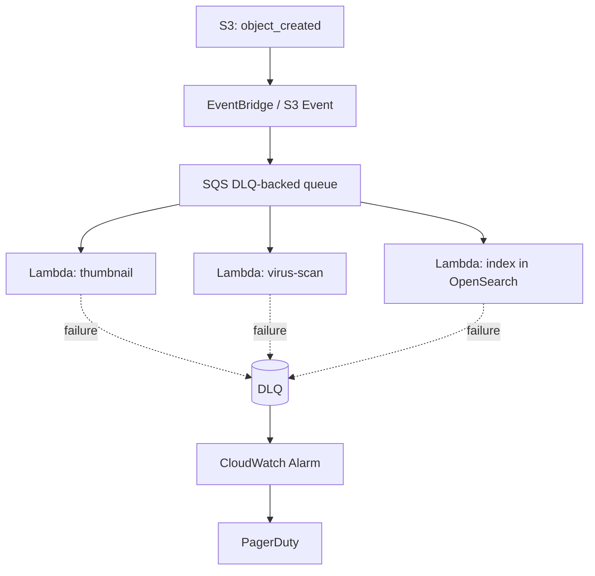
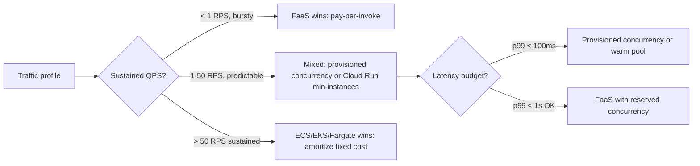
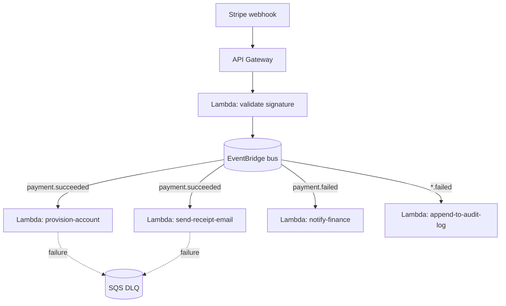

# Serverless / FaaS

## Why This Exists

**Problem.** You need to run code in response to events (HTTP, queue messages, S3 uploads, cron) without managing servers, patching OSes, or paying for idle capacity. Traditional VMs and containers leave money on the table when traffic is bursty or unpredictable. But "serverless" is also marketing slang that hides real costs: cold starts, vendor lock-in, distributed-tracing nightmares, and a per-millisecond pricing model that destroys margins above a certain steady-state QPS.

**Key insight.** Serverless is **rent vs. own**. You trade utilization risk (idle servers) for cold-start risk and per-invocation pricing. The crossover point — where owning long-lived containers beats renting Lambda by the millisecond — is roughly when sustained traffic exceeds ~1 RPS per function with non-trivial CPU/memory. Below that, FaaS wins on TCO. Above that, you're subsidizing AWS's margin.

**Reach for this when:**
- Traffic is bursty, spiky, or has long idle periods (webhooks, batch ETL, occasional cron).
- You want true pay-per-use — zero idle cost matters more than steady-state efficiency.
- The function is stateless, short (< 15 min for Lambda; Cloud Run *services* cap requests at 60 min, *jobs* run up to 168 h via `--task-timeout`), and event-driven.
- You're prototyping or building MVPs where ops time > infra cost.
- You need automatic scaling to thousands of concurrent invocations without capacity planning.
- The work is naturally event-shaped: S3 → thumbnail, Kafka → enrich → DB, Stripe webhook → idempotent ledger update.

**Don't reach for this when:**
- Steady high QPS (~> 100 RPS sustained per function) — provisioned containers (ECS/EKS/Cloud Run min-instances) are 3–10× cheaper.
- p99 latency budget < 100 ms and you can't afford cold-start tail spikes (or you'd need expensive provisioned concurrency that erases the cost advantage).
- Long-running jobs (> 15 min Lambda hard limit, > 9 min Cloud Functions gen 1).
- Heavy stateful workloads — connection pools to RDBMS, in-memory caches, websockets at scale.
- ML inference with > 250 MB models and tight latency SLOs (Lambda's 250 MB unzipped layer limit, container image limit 10 GB but cold start is brutal).
- You need OS-level control, GPU access (Lambda has no GPU; Cloud Run for GPU is recent and limited), or kernel tuning.
- Data egress dominates cost — every Lambda → RDS roundtrip is billed; an EC2 box is "free" once it's running.

## Diagrams

### Cold start anatomy (AWS Lambda, the worst case)



### Event-triggered fan-out



### When serverless wins vs. loses (cost crossover)



## The Three Big Platforms

### AWS Lambda

The 800-pound gorilla. MicroVM-based (Firecracker), 15-minute max execution, 10 GB memory, 6 MB sync payload / 256 KB async event, 250 MB unzipped deployment package (function code + all attached layers combined; container image limit is 10 GB). Billed per ms × GB-memory.

```python
# handler.py — idiomatic Lambda for SQS-triggered work
import json
import os
import logging
from typing import Any
import boto3
from aws_lambda_powertools import Logger, Tracer, Metrics
from aws_lambda_powertools.utilities.batch import BatchProcessor, EventType, process_partial_response
from aws_lambda_powertools.utilities.data_classes.sqs_event import SQSRecord

logger = Logger()
tracer = Tracer()
metrics = Metrics()

# Initialize OUTSIDE the handler — runs once per cold start, reused on warm invokes.
# This is the single biggest perf lever in Lambda. DB clients, SDK clients, ML
# models, config — all init at module load.
_dynamodb = boto3.resource("dynamodb")
_table = _dynamodb.Table(os.environ["TABLE_NAME"])
_processor = BatchProcessor(event_type=EventType.SQS)


@tracer.capture_method
def record_handler(record: SQSRecord) -> None:
    """Process a single SQS record. MUST be idempotent — SQS at-least-once."""
    body = json.loads(record.body)
    # Use the SQS message ID or a domain-level dedup key as the idempotency token.
    # Without this you WILL double-charge customers when a downstream timeout
    # causes SQS to redeliver.
    idempotency_key = record.message_id
    _table.put_item(
        Item={"pk": idempotency_key, "payload": body, "ttl": 86400},
        # Conditional write so a redelivery is a no-op, not a duplicate.
        ConditionExpression="attribute_not_exists(pk)",
    )


@logger.inject_lambda_context(log_event=False)  # log_event=True leaks PII; default off
@tracer.capture_lambda_handler
@metrics.log_metrics(capture_cold_start_metric=True)
def handler(event: dict[str, Any], context: Any) -> dict:
    # process_partial_response returns batchItemFailures so the SDK reports
    # only failed messages back to SQS — successful ones are deleted. Without
    # this, a single poison pill recycles the whole batch forever.
    return process_partial_response(
        event=event,
        record_handler=record_handler,
        processor=_processor,
        context=context,
    )
```

**Lambda gotchas you'll hit in production:**
- **VPC ENI cold start** (mostly fixed in 2019 with Hyperplane ENIs but still adds ~50–200 ms). If you don't need RDS, don't put Lambda in a VPC.
- **Connection pooling to RDBMS is fundamentally broken.** 1000 concurrent Lambdas = 1000 DB connections. Use **RDS Proxy** or, better, DynamoDB / serverless Aurora data API.
- **Provisioned concurrency** eliminates cold starts but costs ~$13/GB-month *baseline* — at that price you're paying for an idle Fargate task.
- **The 6 MB sync payload limit** kills file-upload designs. Use S3 presigned URLs and trigger Lambda from `ObjectCreated`.
- **15-minute timeout is hard.** No extensions, no negotiation. For longer jobs use Step Functions, Fargate, or Batch.

### GCP Cloud Run

The pragmatist's serverless. Container-based (you bring an image), HTTP-server model (your code is a long-running process; Google scales replicas), scale-to-zero, but each *instance* serves up to N concurrent requests (default 80, configurable up to 1000) — fundamentally different from Lambda's one-request-per-sandbox model. Billed per 100 ms × CPU/memory while a request is in flight (gen 1) or always-on if `min-instances > 0` (gen 2 also has a CPU-always-allocated mode).

```python
# main.py — Cloud Run runs your container; you serve HTTP.
from fastapi import FastAPI, Request
import os
import asyncpg
from contextlib import asynccontextmanager

# Cloud Run sends SIGTERM with a 10s grace period before killing the instance.
# Drain in-flight requests, close pools.
_pool: asyncpg.Pool | None = None


@asynccontextmanager
async def lifespan(app: FastAPI):
    global _pool
    # Cloud Run instance can serve many concurrent requests — a real connection
    # pool actually works here, unlike Lambda. Size it to your concurrency setting.
    _pool = await asyncpg.create_pool(
        os.environ["DATABASE_URL"],
        min_size=2,
        max_size=20,  # match --concurrency
    )
    yield
    await _pool.close()


app = FastAPI(lifespan=lifespan)


@app.post("/charge")
async def charge(req: Request):
    payload = await req.json()
    # Same idempotency rule as Lambda — Cloud Run won't redeliver, but Pub/Sub
    # push subscriptions will.
    async with _pool.acquire() as conn:
        await conn.execute(
            "INSERT INTO charges(idempotency_key, amount) VALUES($1, $2) "
            "ON CONFLICT (idempotency_key) DO NOTHING",
            payload["idempotency_key"],
            payload["amount"],
        )
    return {"ok": True}
```

```yaml
# cloud-run.yaml — deployment manifest
apiVersion: serving.knative.dev/v1
kind: Service
metadata:
  name: charge-api
spec:
  template:
    metadata:
      annotations:
        autoscaling.knative.dev/minScale: "0"  # scale to zero (free tier)
        autoscaling.knative.dev/maxScale: "100"
        run.googleapis.com/cpu-throttling: "true"  # cheaper, no CPU between reqs
        run.googleapis.com/execution-environment: gen2  # better networking, more memory
    spec:
      containerConcurrency: 80  # 80 concurrent reqs per instance — Lambda is 1
      timeoutSeconds: 300       # max 60min for jobs
      containers:
        - image: gcr.io/PROJECT/charge-api:GIT_SHA
          resources:
            limits:
              cpu: "1"
              memory: 512Mi
          env:
            - name: DATABASE_URL
              valueFrom:
                secretKeyRef: { name: db-url, key: latest }
```

**Why Cloud Run often beats Lambda:**
- **Concurrency model.** 80 reqs per instance means 80× fewer cold starts and 80× fewer DB connections.
- **Bring your own container** — no language runtime lottery, no layer size limits, you ship a Dockerfile.
- **Cheaper at moderate steady-state** because of multi-tenant request multiplexing.
- **gRPC and streaming work natively.** Lambda only got streaming responses in 2023 and they're awkward.

### Azure Functions

Microsoft's offering. Two runtimes (Consumption plan = true serverless, Premium plan = warm pool, App Service plan = VMs). Strongest in the .NET ecosystem and has best-in-class **Durable Functions** for long-running stateful workflows (orchestrator pattern with checkpoints in Azure Storage).

```csharp
// Durable Function orchestrator — long-running workflow without a 15-min timeout.
[FunctionName("ProcessOrderOrchestrator")]
public async Task<OrderResult> Orchestrator(
    [OrchestrationTrigger] IDurableOrchestrationContext ctx)
{
    var order = ctx.GetInput<Order>();

    // Each Activity call checkpoints state to Azure Storage. The orchestrator
    // can sleep for days, survive restarts, and resume — without holding a
    // function instance the whole time.
    await ctx.CallActivityAsync("ChargeCard", order);
    await ctx.CallActivityAsync("ReserveInventory", order);

    // Wait up to 7 days for a webhook (e.g. fulfillment confirmation).
    using var cts = new CancellationTokenSource();
    var approval = ctx.WaitForExternalEvent<bool>("FulfillmentConfirmed",
                                                  TimeSpan.FromDays(7), cts.Token);
    var timeout = ctx.CreateTimer(ctx.CurrentUtcDateTime.AddDays(7), cts.Token);
    var winner = await Task.WhenAny(approval, timeout);
    if (winner == timeout) await ctx.CallActivityAsync("RefundCard", order);

    return new OrderResult { Status = "done" };
}
```

## Cost-per-request math

This is where serverless decisions are won and lost. **Do this calculation before committing.**

### Lambda

```
Cost = (requests × $0.20/M) + (GB-seconds × $0.0000166667)
GB-seconds = (memory_MB / 1024) × duration_ms / 1000

Example: 100ms execution at 512 MB, 10M requests/month:
  request cost = 10M × $0.20/M = $2.00
  GB-s cost    = 0.5 × 0.1 × 10M × $0.0000166667 = $8.33
  TOTAL        = $10.33/month
```

That's amazing — until you hit steady-state. At **100 RPS sustained** = ~260M req/month at 100 ms / 512 MB:

```
260M × $0.20/M = $52
260M × 0.5 × 0.1 × $0.0000166667 = $216.67
TOTAL = $268.67/month, plus data transfer, plus CloudWatch logs ($0.50/GB ingested)
```

A `t4g.small` running ECS Fargate at 100 RPS handles this for ~$15/month. **18× cheaper.**

### Cloud Run

```
Cost = (CPU-seconds × $0.000018) + (GiB-seconds × $0.000002) + (requests × $0.40/M)
But: with concurrency=80, you only pay for instance-time when an instance is up,
and one instance handles 80 concurrent requests.
```

A web app at 100 RPS with 80 concurrency typically needs ~2–4 Cloud Run instances. The math collapses to roughly **$30–60/month** — beats Lambda by 4–8× at moderate load, beats Fargate at very low load, loses to Fargate above ~500 RPS.

### Rule of thumb (memorize this)

| Load profile | Choose |
|---|---|
| < 100K req/month | Lambda or Cloud Run, free tier covers it |
| 100K – 10M req/month, bursty | Lambda or Cloud Run |
| 10M – 100M req/month, predictable | Cloud Run with min-instances, or Fargate Spot |
| > 100M req/month, sustained | ECS / EKS / GKE, period |
| any volume, p99 < 50ms required | Provisioned concurrency or containers; FaaS will fight you |

## Cold start mitigation

Cold start = time from "first request hits cold sandbox" to "your handler runs". Order of magnitude:

| Runtime | Cold start (warm package) | Notes |
|---|---|---|
| Node.js (small bundle) | 100–300 ms | Minify, tree-shake, avoid heavy imports at module top |
| Python | 200–500 ms | Lazy-import inside handler if module-load is slow |
| Go (compiled) | 100–300 ms | Best of the runtimes for cold start |
| Rust | 50–200 ms | Even better |
| Java (Spring Boot) | 2,000–8,000 ms | Use SnapStart, GraalVM native, or run somewhere else |
| .NET | 1,000–3,000 ms | ReadyToRun + tiered compilation; AOT helps |
| Container image (1 GB) | 1,000–4,000 ms first pull | After that, cached on host |

**Mitigation playbook:**
1. **Right-size memory.** Lambda CPU scales linearly with memory. 1769 MB = 1 vCPU. Going from 256 MB to 1024 MB often *cuts cost* because duration drops faster than memory rises. Use [AWS Lambda Power Tuning](https://github.com/alexcasalboni/aws-lambda-power-tuning).
2. **Avoid VPC unless necessary.** Hyperplane ENI helps but isn't free.
3. **Provisioned concurrency / min-instances.** Pay for warmth. Worth it for user-facing p99-sensitive endpoints, not for async workers.
4. **Lambda SnapStart for Java.** Snapshots the JVM after init and restores it — turns 8s cold starts into 200 ms.
5. **Trim dependencies.** A 50 MB Node bundle costs ~500 ms more to cold-start than a 5 MB one.
6. **Don't put heavy clients (PyTorch, full AWS SDK v2) in the cold path.** Lazy-init them on first use, or use SDK v3 modular imports.

## Backend-as-a-Service (BaaS)

FaaS is "your code, no servers". BaaS is "we wrote the code too — you just call our API".

### Firebase

- **Firestore**: document DB, real-time listeners, decent queries. Limits: 1 write/sec/document, no JOINs, no aggregations until 2022 (still limited).
- **Firebase Auth**: dead simple, ~free at small scale, expensive at scale (Identity Platform pricing).
- **Cloud Functions for Firebase**: Lambda equivalent, triggers from Firestore writes, Auth events, Storage uploads.
- **Realtime Database**: older, JSON-tree, simpler than Firestore but limited.

**Firebase wins** for: mobile apps, prototypes, real-time chat / presence, offline sync (Firestore SDK is genuinely good).
**Firebase loses** for: relational data, complex aggregations, > 1M users (vendor lock-in starts to bite — egress and read costs scale unfavorably).

### Supabase

Postgres + GoTrue auth + PostgREST + Realtime + Storage, all open-source-ish, self-hostable. The "open-source Firebase" pitch.

- You get **real Postgres** — JOINs, indexes, JSONB, extensions (pgvector for AI, PostGIS for geo).
- Row-Level Security policies replace handwritten authz.
- **Edge Functions** are Deno-based, deployed to Cloudflare-style edge.

**Supabase wins** for: any app that benefits from a real RDBMS, teams that want a possible escape hatch (it's just Postgres — `pg_dump` and leave).
**Supabase loses** for: real-time at massive scale (their realtime layer is improving but not Pusher-grade), edge-heavy global apps, mobile-first offline (Firestore offline sync is still better).

### Lock-in spectrum

```
LOCK-IN SEVERITY (low → high)

Cloud Run (Knative-compatible)
    └── runs anywhere that has Knative
Lambda (function code in Python/Node)
    └── runtime portable; triggers/IAM/VPC are AWS-specific
Lambda (heavy use of Step Functions, EventBridge, DynamoDB streams)
    └── you're rewriting the architecture if you leave
DynamoDB / Cosmos DB / Firestore (proprietary data model)
    └── data migration is a project, not a script
```

Mitigation: **keep business logic in plain functions**, push platform glue to a thin adapter layer. The hexagonal architecture pattern earns its keep here.

## Event-triggered architectures

Serverless and event-driven are siblings, not synonyms — but most production FaaS apps end up event-driven because that's what the platforms reward.



**The hard part is not the happy path. It's:**

- **Exactly-once delivery does not exist.** All event sources are at-least-once. Build idempotent handlers or you'll double-charge customers, send duplicate emails, and create cascading data corruption.
- **Ordering is local at best.** SQS FIFO gives you per-message-group ordering; Kinesis gives you per-shard. Neither gives you global order. Design for out-of-order arrival.
- **Schema evolution.** EventBridge / SNS messages are JSON blobs. The day a producer adds a field, every consumer should still parse cleanly. Use Avro/Protobuf with a schema registry, or at minimum versioned JSON schemas.
- **Replay capability.** When (not if) a downstream Lambda has a bug and silently corrupts data, you need to replay events. EventBridge Archive + Replay, Kinesis time-travel, or SNS → S3 firehose.
- **Backpressure.** If your Lambda processes 100 msg/s but SQS delivers 1000 msg/s, queue depth grows forever. Use **reserved concurrency** to cap Lambda parallelism; alarm on `ApproximateAgeOfOldestMessage`.

## Observability gotchas

Serverless observability is **harder than monolith observability**, full stop. The tools have caught up but the failure modes are different.

1. **Distributed tracing across async boundaries breaks unless you propagate trace context.** Lambda → SQS → Lambda loses the X-Ray trace ID by default. Use AWS Lambda Powertools or OpenTelemetry's SQS instrumentation. Without this, you get fragmented traces and "ghost latency" you can't explain.

2. **CloudWatch Logs costs more than Lambda compute** at scale. $0.50/GB ingested, $0.03/GB stored. A chatty Lambda logging 5 KB per invoke at 100M invokes/month = 500 GB = **$250 in logs alone.** Sample logs aggressively; ship to S3 + Athena for cold storage.

3. **Cold start metrics are hidden.** `Init Duration` only appears in logs on cold starts. Powertools `capture_cold_start_metric=True` emits a CloudWatch metric so you can alarm on cold start rate.

4. **Lambda timeouts produce no error.** When your handler runs over the configured timeout, the runtime is killed with a SIGKILL. There is no `try/except` that catches it. The downstream caller (API Gateway, SQS) sees a generic failure. Set timeouts conservatively and emit a "near-timeout" warning at 80% of budget.

5. **Concurrent execution metrics lie.** `ConcurrentExecutions` is a *sampled* metric. The real one is `Throttles` — if it's nonzero, you're over your account limit (default 1000 concurrent across all functions in the region). This is a regional global limit, not per-function.

6. **The 256 KB async event payload limit truncates silently.** If you SNS-publish a 300 KB event, SNS rejects it but downstream observability may not surface it cleanly. Use S3 + claim check pattern for large payloads.

## Code: end-to-end pattern (idempotent webhook → fan-out)

```python
# Realistic Stripe webhook → EventBridge → multiple Lambdas
# Demonstrates: signature verification, idempotency, structured logging,
# graceful failure that triggers SQS retry not silent loss.

import hmac
import hashlib
import json
import os
import time
import boto3
from botocore.exceptions import ClientError
from aws_lambda_powertools import Logger, Metrics, Tracer
from aws_lambda_powertools.metrics import MetricUnit

logger = Logger()
metrics = Metrics()
tracer = Tracer()

eventbridge = boto3.client("events")
ddb = boto3.resource("dynamodb").Table(os.environ["IDEMPOTENCY_TABLE"])
WEBHOOK_SECRET = os.environ["STRIPE_WEBHOOK_SECRET"].encode()
EVENT_BUS = os.environ["EVENT_BUS_NAME"]


def verify_signature(payload: bytes, sig_header: str) -> bool:
    """Stripe signature verification — see https://stripe.com/docs/webhooks/signatures"""
    try:
        items = dict(p.split("=") for p in sig_header.split(","))
        ts = items["t"]
        sig = items["v1"]
    except (KeyError, ValueError):
        return False
    # Reject events older than 5 min — replay attack prevention
    if abs(time.time() - int(ts)) > 300:
        return False
    signed = f"{ts}.{payload.decode()}".encode()
    expected = hmac.new(WEBHOOK_SECRET, signed, hashlib.sha256).hexdigest()
    return hmac.compare_digest(expected, sig)


@logger.inject_lambda_context
@tracer.capture_lambda_handler
@metrics.log_metrics(capture_cold_start_metric=True)
def handler(event, context):
    body = event["body"].encode()
    sig = event["headers"].get("stripe-signature", "")

    if not verify_signature(body, sig):
        metrics.add_metric(name="InvalidSignature", unit=MetricUnit.Count, value=1)
        return {"statusCode": 400, "body": "bad signature"}

    payload = json.loads(body)
    event_id = payload["id"]   # Stripe guarantees uniqueness per event

    # Idempotency: try to claim this event_id. If it already exists, this is
    # a Stripe retry — return 200 so they stop retrying, but don't re-process.
    try:
        ddb.put_item(
            Item={"event_id": event_id, "ttl": int(time.time()) + 86400 * 7},
            ConditionExpression="attribute_not_exists(event_id)",
        )
    except ClientError as e:
        if e.response["Error"]["Code"] == "ConditionalCheckFailedException":
            logger.info("duplicate event, skipping", extra={"event_id": event_id})
            metrics.add_metric(name="DuplicateEvent", unit=MetricUnit.Count, value=1)
            return {"statusCode": 200, "body": "ok"}
        # Real error — let API Gateway return 5xx so Stripe retries
        logger.exception("ddb error")
        raise

    # Publish to EventBridge for downstream fan-out. If THIS fails, we've already
    # written the idempotency row — bad. Best fix: use DDB Streams to drive
    # EventBridge, so the write IS the publish (transactional outbox pattern).
    eventbridge.put_events(Entries=[{
        "Source": "stripe",
        "DetailType": payload["type"],
        "Detail": json.dumps(payload),
        "EventBusName": EVENT_BUS,
    }])

    return {"statusCode": 200, "body": "ok"}
```

## Trade-offs

| Benefit | Cost |
|---|---|
| Zero idle cost — pay only for executions | Per-request pricing destroys margins above ~10–100 RPS sustained |
| Auto-scaling to thousands of concurrent invocations | Account-level concurrency limits (default 1000); throttling cascades into upstream |
| No OS / patching / capacity planning | No OS access — kernel tunables, custom runtimes, GPU all limited or absent |
| Event-driven integrations are first-class (S3, SNS, EventBridge) | Vendor lock-in compounds: triggers + IAM + retry semantics + DLQ all platform-specific |
| Fast iteration — deploy a function in seconds | Local dev / testing is harder; emulators (SAM, LocalStack, Functions Framework) lag behind reality |
| Connection pooling burden lifted (each invocation isolated) | RDBMS connection storms are a real production risk; need RDS Proxy or non-relational stores |
| Per-function IAM, blast radius is tiny | Distributed tracing is required, not optional; flat log-grep workflows break down |
| Cold starts ≤ 300 ms for compiled / lightweight runtimes | Cold starts 2–10 s for JVM/.NET; provisioned concurrency erodes the cost story |
| BaaS (Firebase/Supabase) collapses weeks of auth/data work | BaaS lock-in is harder to escape than IaaS; egress and read pricing punish growth |
| Step Functions / Durable Functions enable long workflows without VMs | State machine DSL is platform-specific; debugging a stuck execution is a different skillset |

## Common Pitfalls

- **The "everything is a Lambda" cargo cult.** A REST API of 50 Lambdas behind API Gateway is 50 deploy targets, 50 IAM roles, 50 sets of cold starts, 50 places where logging differs. A single Cloud Run / Fargate container running FastAPI is often simpler and cheaper.
- **Forgetting that SQS / Kinesis / EventBridge are at-least-once.** You will see duplicate invocations. Always design idempotent handlers (idempotency key in DynamoDB / Postgres unique constraint).
- **Letting the deployment package balloon.** A 200 MB Lambda zip has a 2–5 s cold start penalty and a 5-minute deploy. Tree-shake. Use Lambda Layers for shared deps. Or switch to container images.
- **VPC Lambda + RDS without RDS Proxy.** The first traffic spike opens 1000 connections. Postgres dies. You blame Lambda. The fix is RDS Proxy or a serverless-native store.
- **Recursive invocation loops.** Lambda writes to S3, S3 triggers Lambda, Lambda writes to S3. Without a guard you get exponential invocation growth and a $30K AWS bill. Always check for the trigger condition in the handler, or scope the trigger prefix tightly.
- **Misunderstanding async invoke retries.** Async Lambda invokes retry **twice** by default with exponential backoff (up to 6 hours), then go to DLQ. If your function is non-idempotent, that's three duplicate executions per real failure.
- **Treating Step Functions / Durable Functions as a programming language.** They're checkpointed state machines with rough debugging tools. Keep activities small and pure; build the orchestration logic with eyes open.
- **Not setting timeouts on outbound HTTP calls inside the handler.** The default is often "no timeout" — your Lambda hangs, hits its execution timeout (5 min default API Gateway), API Gateway returns 504. Set explicit per-call timeouts shorter than the Lambda timeout.
- **Logging request bodies that contain PII.** Default behavior in many starter templates. Audit before deploying anywhere with regulated data.
- **Ignoring cold starts in load tests.** Synthetic load that ramps over 5 min keeps Lambda warm and looks great. Real production traffic has 3 AM idle periods that produce cold starts under the next morning's spike. Test the cold path.
- **Provisioned concurrency without alarms on `ProvisionedConcurrencyUtilization`.** You pay for warm instances whether they're used or not. If utilization is 5%, you're over-provisioned and lighting money on fire.

## Decision Table

| Situation | Choose | Why |
|---|---|---|
| Webhook receiver, < 100 req/min | Lambda + API Gateway | Cheap, scales to spikes, no idle cost |
| Internal HTTPS API, 10–500 RPS, p99 < 200ms OK | Cloud Run with `min-instances=1` | Concurrency multiplexing beats Lambda, cheaper than Fargate at this load |
| Sustained 1000+ RPS API | ECS Fargate / EKS | Serverless economics break above this |
| ML inference, 500 MB model, p99 < 100ms | SageMaker endpoint or Fargate with warm pool | Lambda cold start kills latency budget |
| Long-running data pipeline (1 hour) | Step Functions + Lambda for steps; or AWS Batch / Cloud Run jobs | Lambda 15-min cap is a hard wall |
| Stateful workflow with external waits (days) | Step Functions / Azure Durable Functions | Checkpoint-and-resume is the killer feature |
| Mobile app backend, prototype | Firebase or Supabase | Auth + DB + realtime in a weekend |
| Mobile app backend, scaling past 1M users | Migrate to managed Postgres + your own services | BaaS economics turn against you |
| Event fan-out from one source to many | EventBridge / Pub/Sub + Lambda/Cloud Run consumers | Native pattern; cheap; observable |
| Stream processing 10K+ events/sec | Kinesis / Kafka + Flink / KCL on containers | Lambda Kinesis trigger is fine to ~1K/sec, breaks down higher |
| You need GPUs | Fargate (limited), GKE, SageMaker, RunPod | Lambda has no GPU; Cloud Run GPU is preview-only |
| You need < 50 ms p99 worldwide | Cloudflare Workers / Vercel Edge / Lambda@Edge | Regional Lambda can't beat 200 ms cross-continent RTT |

## References

- AWS — *Lambda Operator's Guide / AWS Lambda Developer Guide* — https://docs.aws.amazon.com/lambda/latest/dg/welcome.html
- AWS Builders' Library — *Caching challenges and strategies* (relevant for stateless Lambda design) — https://aws.amazon.com/builders-library/caching-challenges-and-strategies/
- AWS Builders' Library — *Avoiding overload in distributed systems by putting the smaller service in control* — https://aws.amazon.com/builders-library/avoiding-overload-in-distributed-systems-by-putting-the-smaller-service-in-control/
- AWS Builders' Library — *Reliability, constant work, and a good cup of coffee* — https://aws.amazon.com/builders-library/reliability-and-constant-work/
- AWS — *Firecracker: Lightweight Virtualization for Serverless Applications* (NSDI '20) — https://www.usenix.org/conference/nsdi20/presentation/agache
- AWS — *AWS Lambda Powertools (Python)* — https://docs.powertools.aws.dev/lambda/python/latest/
- AWS — *AWS Lambda SnapStart for Java* — https://docs.aws.amazon.com/lambda/latest/dg/snapstart.html
- Google Cloud — *Cloud Run docs* — https://cloud.google.com/run/docs
- Google Cloud — *Cloud Run: Concurrency and CPU allocation* — https://cloud.google.com/run/docs/about-concurrency
- Google Cloud — *Knative Serving spec* — https://knative.dev/docs/serving/
- Microsoft — *Azure Functions documentation* — https://learn.microsoft.com/en-us/azure/azure-functions/
- Microsoft — *Durable Functions overview* — https://learn.microsoft.com/en-us/azure/azure-functions/durable/durable-functions-overview
- Mike Roberts (Symphonia) — *Serverless Architectures (martinfowler.com)* — https://martinfowler.com/articles/serverless.html
- Adrian Hornsby — *Cold start / warm start with AWS Lambda* — https://aws.amazon.com/blogs/compute/operating-lambda-performance-optimization-part-1/
- Yan Cui — *theburningmonk.com* (long-running serverless writeups) — https://theburningmonk.com/
- Google SRE Book — Chapter 22 *Addressing Cascading Failures* (relevant for Lambda concurrency throttling) — https://sre.google/sre-book/addressing-cascading-failures/
- Google SRE Workbook — Chapter 11 *Managing Load* — https://sre.google/workbook/managing-load/
- Kleppmann — *Designing Data-Intensive Applications* — Ch. 11 *Stream Processing* (event-driven architectures), Ch. 8 *The Trouble with Distributed Systems* (at-least-once delivery)
- Pat Helland — *Life beyond Distributed Transactions: an Apostate's Opinion* — https://www.ics.uci.edu/~cs223/papers/cidr07p15.pdf
- Stripe — *Building robust webhooks* — https://stripe.com/docs/webhooks
- Firebase pricing & limits — https://firebase.google.com/pricing
- Supabase architecture — https://supabase.com/docs/guides/getting-started/architecture
- Cloudflare — *Workers: How it works* (edge serverless contrast) — https://developers.cloudflare.com/workers/reference/how-workers-works/

## See Also

- `../event-driven/` — event-driven architecture patterns, choreography vs orchestration
- `../microservices/` — when to decompose vs keep a monolith; serverless is one decomposition strategy
- `../hexagonal/` — keeping business logic portable across FaaS / containers / VMs
- `../../communication/message-queues/` — SQS, Kafka, Pub/Sub patterns; backpressure; DLQs
- `../../communication/api-gateway/` — fronting Lambda / Cloud Run with a managed gateway
- `../../communication/idempotency/` — required reading for any at-least-once event handler
- `../../reliability/circuit-breaker/` — protecting downstreams from concurrency spikes
- `../../performance/tracing/` — propagating context across async serverless boundaries
- `../../reliability/observability/` — making CloudWatch / Stackdriver bearable at scale
- `../../data-systems/outbox/` — the right way to "publish event after write"
