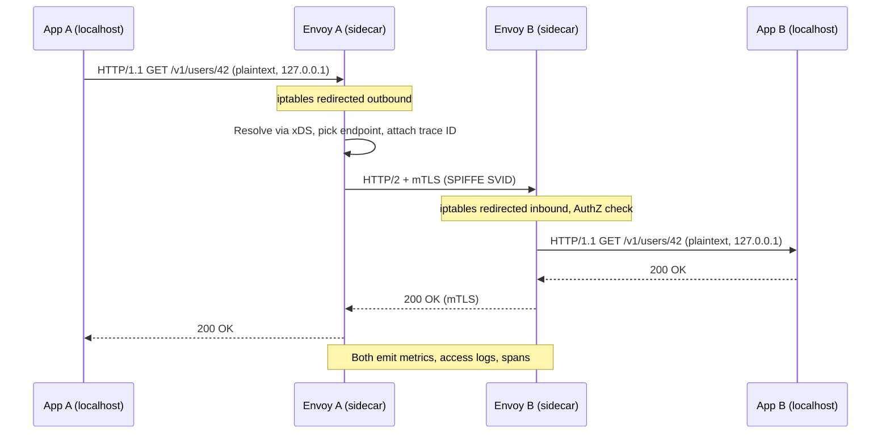
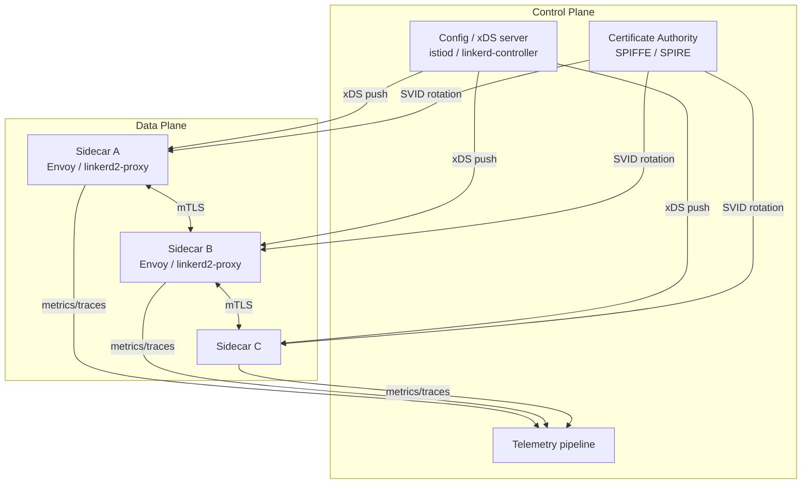
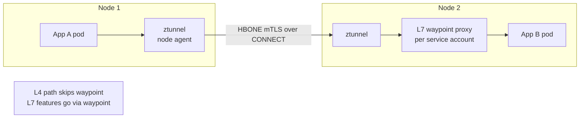

# Service Mesh

## Why This Exists

**Problem.** Once you have ~10+ services on a microservice platform, the cross-cutting reliability and security concerns multiply: every service needs mTLS, retries, timeouts, circuit breaking, structured request logging, distributed tracing headers, and traffic-shaping for safe rollouts. Implementing these *N* times across *M* language stacks (Go, Java, Node, Python, Kotlin, Rust…) creates drift, bugs, and audit nightmares. A retry-storm caused by one team setting `maxRetries=10` without a budget can DDoS your payments service.

**Key insight.** L7 networking concerns are infrastructure, not business logic. Push them into a **transparent data plane** that intercepts all service-to-service traffic, controlled by a centralized **control plane** that delivers policy via xDS (Envoy's discovery API) or similar. The application speaks plain HTTP/gRPC to localhost; the mesh handles the rest.

**Reach for this when:**
- You have **dozens of services** in the same trust boundary (a Kubernetes cluster, a fleet of VMs).
- You need **mTLS everywhere** for compliance (PCI, SOC 2, HIPAA, internal zero-trust mandates) and you can't ship TLS to every service team.
- You need **progressive delivery** — canary, blue/green, mirror traffic, header-based routing — without per-service code changes.
- You need **uniform golden signals** (RED: rate, errors, duration) and distributed tracing across polyglot stacks.
- You need **fine-grained authz** (e.g., "only `checkout` SA may call `payment.charge`") evaluated at L7.

**Don't reach for this when:**
- You have <10 services. The ops burden dwarfs the benefit. Use a library (Resilience4j, Polly, hedged-requests in your gRPC client) and a managed ingress.
- You're a serverless / Lambda shop. Mesh sidecars don't fit; use API Gateway + IAM + VPC + AWS App Mesh equivalents only if you've measured the need.
- You can't afford **+1–5ms p50 latency per hop** and ~100–300MB RAM per pod. (Ambient mode helps; see below.)
- You don't have a platform team to operate the control plane. A poorly-run Istio is worse than no mesh — broken upgrades will take the cluster down.
- Your service-to-service security model is **already** solved by VPC + IAM + per-service ALB listeners with TLS.

## Diagrams

### Sidecar mesh: data path of a single request



### Control plane / data plane split



### Ambient mode (Istio): no per-pod sidecar



## Core Patterns and Code

### Pattern 1: mTLS everywhere — declarative, not per-service

The mesh issues each workload a **SPIFFE identity** (`spiffe://cluster.local/ns/checkout/sa/checkout-sa`) and rotates X.509 certs every hour. Apps stay HTTP; the proxy upgrades to mTLS on the wire.

**Istio — strict mTLS for the whole mesh:**

```yaml
# Refuse plaintext anywhere. Set this AFTER you've verified all workloads
# have sidecars — otherwise non-meshed pods get cut off.
apiVersion: security.istio.io/v1beta1
kind: PeerAuthentication
metadata:
  name: default
  namespace: istio-system  # mesh-wide when in root namespace
spec:
  mtls:
    mode: STRICT
---
# Authorization: only the checkout service account may call payment.charge
apiVersion: security.istio.io/v1beta1
kind: AuthorizationPolicy
metadata:
  name: payment-charge-allow
  namespace: payment
spec:
  selector:
    matchLabels:
      app: payment
  action: ALLOW
  rules:
    - from:
        - source:
            principals: ["cluster.local/ns/checkout/sa/checkout-sa"]
      to:
        - operation:
            methods: ["POST"]
            paths: ["/v1/charge"]
```

**Linkerd — mTLS is on by default, no config needed.** This is Linkerd's whole pitch: opinionated, secure-by-default, no STRICT/PERMISSIVE rollout dance.

### Pattern 2: Retries with a budget (don't DDoS yourself)

Naive `retries=3` everywhere creates **retry amplification**: if A→B→C all retry 3x on failure, one failure becomes 27 attempts. Use a **retry budget** (Linkerd) or a **maxRetries cap with conditions** (Istio) and **never retry non-idempotent verbs blindly**.

**Istio VirtualService — idempotent retries only:**

```yaml
apiVersion: networking.istio.io/v1beta1
kind: VirtualService
metadata:
  name: users-vs
  namespace: users
spec:
  hosts: ["users.users.svc.cluster.local"]
  http:
    - match:
        - method: { exact: GET }
      route:
        - destination: { host: users.users.svc.cluster.local }
      retries:
        attempts: 2
        perTryTimeout: 200ms
        # Only retry on connection-level failures + 503. NEVER retry on 5xx
        # blanket — a 500 from a deduped POST should NOT be retried.
        retryOn: connect-failure,refused-stream,unavailable,reset
      timeout: 1s
    - match:
        - method: { exact: POST }
      route:
        - destination: { host: users.users.svc.cluster.local }
      # No retries on POST. If you need them, require an Idempotency-Key
      # header and have the upstream service dedupe (see ../../communication/idempotency/).
      timeout: 2s
```

**Linkerd — service-profile retry budget:**

```yaml
apiVersion: linkerd.io/v1alpha2
kind: ServiceProfile
metadata:
  name: users.users.svc.cluster.local
  namespace: users
spec:
  routes:
    - name: GET /v1/users/{id}
      condition: { method: GET, pathRegex: "/v1/users/[^/]+" }
      isRetryable: true
      timeout: 800ms
  # Budget: retries may consume at most 20% of total request volume,
  # plus 10 free retries per second to handle low-traffic edges.
  # This is the *whole point* — caps total amplification regardless of
  # how many services in a chain set isRetryable=true.
  retryBudget:
    retryRatio: 0.2
    minRetriesPerSecond: 10
    ttl: 10s
```

> **War story.** A team set `attempts: 5` on a hot path, didn't set a perTryTimeout, and a downstream slowness turned into 5x request volume against an already-saturated DB. The mesh retried *the retries*. Always set `perTryTimeout` and an outer `timeout`. The outer timeout MUST be ≤ caller's deadline minus overhead.

### Pattern 3: Traffic shifting — canary, header routing, mirror

**Canary (Istio):** route 5% of traffic to v2, 95% to v1, ratchet up while watching SLOs.

```yaml
apiVersion: networking.istio.io/v1beta1
kind: VirtualService
metadata:
  name: checkout
  namespace: checkout
spec:
  hosts: [checkout]
  http:
    # Internal QA traffic always goes to v2 — header-based routing for dogfooding
    - match:
        - headers:
            x-canary: { exact: "true" }
      route:
        - destination: { host: checkout, subset: v2 }
    # Everyone else: 95/5 split, ramp via GitOps PRs
    - route:
        - destination: { host: checkout, subset: v1 }
          weight: 95
        - destination: { host: checkout, subset: v2 }
          weight: 5
      # Mirror 10% of v1 traffic to v2 for shadow-testing reads.
      # Mirrored responses are dropped — safe for read-only paths only.
      mirror:
        host: checkout
        subset: v2
      mirrorPercentage: { value: 10.0 }
---
apiVersion: networking.istio.io/v1beta1
kind: DestinationRule
metadata: { name: checkout, namespace: checkout }
spec:
  host: checkout
  subsets:
    - name: v1
      labels: { version: v1 }
    - name: v2
      labels: { version: v2 }
  trafficPolicy:
    connectionPool:
      tcp: { maxConnections: 100 }
      http: { http2MaxRequests: 1000, maxRequestsPerConnection: 10 }
    outlierDetection:        # Eject sick pods from the load-balancing pool
      consecutive5xxErrors: 5
      interval: 10s
      baseEjectionTime: 30s
      maxEjectionPercent: 50
```

**Why mirror is dangerous on writes:** Both v1 and v2 will execute the side effect. Charge the customer twice. Restrict mirroring to GETs, or have v2 short-circuit writes when it sees `x-mirrored: true`.

### Pattern 4: Observability — golden signals for free

The sidecar emits **rate / errors / duration** for every hop without app changes. Wire it to Prometheus + Grafana + a tracing backend (Jaeger, Tempo, AWS X-Ray).

```promql
# p99 latency by source workload, destination service
histogram_quantile(0.99,
  sum by (le, source_workload, destination_service_name) (
    rate(istio_request_duration_milliseconds_bucket{
      reporter="source",
      destination_service_namespace="payment"
    }[5m])
  )
)

# Error rate as % of requests
sum(rate(istio_requests_total{response_code=~"5.."}[5m]))
  / sum(rate(istio_requests_total[5m]))
```

The mesh propagates `traceparent` (W3C Trace Context) automatically, but **the app must forward it on outbound calls** the mesh can't see (e.g., calls to managed databases, calls inside a goroutine that doesn't carry context). Don't expect free distributed tracing without app cooperation.

### Pattern 5: Circuit breaking via outlier detection

Instead of an in-app circuit breaker, the mesh ejects unhealthy endpoints from the pool. See `outlierDetection` in the DestinationRule above. Tune carefully: `consecutive5xxErrors: 5` over a fast burst can eject 50% of pods on a deploy and tip into total outage. Pair with a `maxEjectionPercent` cap.

### Pattern 6: Egress control

A mesh lets you whitelist external endpoints. **All egress through a registry** is a powerful blast-radius lever:

```yaml
apiVersion: networking.istio.io/v1beta1
kind: ServiceEntry
metadata: { name: stripe-api, namespace: payment }
spec:
  hosts: [api.stripe.com]
  ports: [{ number: 443, name: https, protocol: HTTPS }]
  resolution: DNS
  location: MESH_EXTERNAL
---
# Outbound traffic policy: REGISTRY_ONLY blocks anything not declared
apiVersion: install.istio.io/v1alpha1
kind: IstioOperator
spec:
  meshConfig:
    outboundTrafficPolicy:
      mode: REGISTRY_ONLY
```

Now an exfiltration attempt from a compromised pod fails at the egress proxy. Pair with NetworkPolicies for defense-in-depth.

## Mesh Comparison

### Istio (sidecar mode)

- **Data plane:** Envoy. Most feature-rich proxy in existence.
- **Control plane:** `istiod` (single binary since 1.5). Pushes Envoy config via xDS.
- **Strengths:** Richest L7 features, ecosystem maturity, multi-cluster, ambient mode.
- **Weaknesses:** Operational complexity. Envoy memory ~150MB/pod, +1–3ms p50 latency. Upgrades historically painful (CRDs, config drift).

### Linkerd

- **Data plane:** `linkerd2-proxy`, a Rust micro-proxy purpose-built for the mesh case (no general-purpose Envoy features).
- **Control plane:** small, written in Go.
- **Strengths:** Lightest data plane (~10MB RAM, sub-ms latency overhead), mTLS on by default, simplest ops story, CNCF graduated.
- **Weaknesses:** Fewer L7 features (no fine-grained authz language as rich as Istio's, smaller egress story). Less flexibility for the 1% of weird requirements.

### Consul Connect

- **Data plane:** Envoy (or built-in proxy).
- **Control plane:** HashiCorp Consul agents.
- **Strengths:** Best fit for **multi-runtime** environments (mix of Kubernetes, VMs, bare metal, Nomad). Strong service catalog and KV out of the box. Works across non-K8s estates better than Istio/Linkerd.
- **Weaknesses:** K8s-only deployments are usually better served by Istio/Linkerd. Licensing changes (BSL since 2023) made some teams skeptical.

### AWS App Mesh

- Envoy-based, AWS-managed control plane. Decent for ECS+EKS hybrid. **Note:** AWS announced App Mesh end of life (Sep 2026) — migrate to VPC Lattice or Istio. Don't start new projects on App Mesh.

### Istio Ambient (sidecar-less)

The newer model that addresses the sidecar tax:

- **L4 (ztunnel):** A per-node agent (one process per K8s node, not per pod) handles mTLS and L4 authz via **HBONE** (HTTP/2 CONNECT-based tunneling).
- **L7 (waypoint):** An optional Envoy deployed *per service-account* (or per namespace) handles L7 features (retries, traffic shifting, authz).

You opt **into** L7 by adding a waypoint, opt **out** by removing it. The promise is "pay for what you use" — L4-only services skip Envoy entirely.

```yaml
# Enable ambient on a namespace (no sidecar injection)
apiVersion: v1
kind: Namespace
metadata:
  name: checkout
  labels:
    istio.io/dataplane-mode: ambient
---
# Add an L7 waypoint when you need retries / traffic shifting
apiVersion: gateway.networking.k8s.io/v1
kind: Gateway
metadata:
  name: checkout-waypoint
  namespace: checkout
spec:
  gatewayClassName: istio-waypoint
  listeners:
    - name: mesh
      port: 15008
      protocol: HBONE
```

**When to choose ambient:** Large clusters where sidecar memory cost is real (1000+ pods × 150MB = 150GB just for proxies), or where pod startup time matters (init container ordering bugs are a perennial sidecar pain). **Caveat:** ambient went GA in Istio 1.22 (May 2024) but is younger and less battle-tested than sidecar mode. Audit features (some advanced policies still require waypoints).

## Trade-offs

| Benefit | Cost |
|---|---|
| mTLS everywhere with zero app code | Cert rotation outages if the CA goes bad — `istiod` becomes critical infra |
| Retries / timeouts / circuit breaking centralized | Envoy adds 1–5ms p50, 5–15ms p99 per hop; ~100–300MB RAM per pod (sidecar mode) |
| Polyglot consistency (Java, Go, Node, Python all behave identically) | App must still propagate trace headers across in-process boundaries; mesh can't see goroutine-internal calls |
| Progressive delivery (canary, mirror, header routing) without app changes | DestinationRule + VirtualService config drift is a real ops burden; needs GitOps |
| L7 authz with workload identity (SPIFFE) | Authorization policy debugging is brutal — "request denied" with no clue which rule fired |
| Uniform RED metrics, traces, access logs | Telemetry volume can explode budget; sample aggressively |
| Outlier detection ejects sick pods | Misconfigured ejection caps can take down 50% of fleet during a deploy |
| Egress control (REGISTRY_ONLY) for blast-radius limits | Every new external dependency needs a ServiceEntry — friction for app teams |
| Ambient mode reduces per-pod cost | Younger, fewer features, multi-cluster story still maturing |

## Common Pitfalls

- **Rolling out STRICT mTLS without auditing first.** Use `PERMISSIVE` mode and the mesh's own metrics to find non-mTLS traffic *before* flipping to STRICT. We've seen mesh-wide outages because a single unmeshed CronJob got cut off.
- **Retrying non-idempotent operations.** A POST that returns 500 may have already committed. Mesh-level retries on POSTs cause **duplicate charges** in payments and **double sends** in messaging. Either require Idempotency-Key headers or never retry non-GETs.
- **No retry budget across the chain.** Each hop sets `attempts=3`, the chain is 4 deep, one failure becomes 81 attempts. Use Linkerd's retry budget or Istio's hedging carefully and **measure amplification**.
- **Outer timeout > caller's deadline.** Mesh times out at 5s, caller had 3s. Mesh keeps the upstream call running, wasting capacity. Always pass deadlines down.
- **Sidecar startup race.** App container starts before sidecar is ready, makes outbound calls, gets connection refused. Use `holdApplicationUntilProxyStarts: true` (Istio) or equivalent.
- **Init container ordering.** Sidecar-injected init containers must run *after* the proxy is up if they make network calls. Common bug. Ambient mode avoids this entirely.
- **CrashLoopBackOff masquerading as a mesh problem.** When a pod crashes, the sidecar reports lots of 5xx. Check the app logs first, not the mesh.
- **Mesh upgrades take down the cluster.** CRD changes between minor versions, control plane restarts ejecting all sidecars at once. Always canary the control plane (Istio supports revisions / canary upgrades). Read release notes religiously.
- **AuthZ "deny" with no diagnostic.** Istio's RBAC is opaque to debug. Enable `RBAC` access logs early, learn the rule precedence (DENY > ALLOW > AUDIT > CUSTOM).
- **Memory pressure from access logs.** Default access logging is verbose. At 1M req/s, you generate gigabytes/minute of logs. Sample to 1% or use OpenTelemetry tail-based sampling.
- **Underestimating egress.** Apps call AWS APIs, third-party SaaS, internal legacy services on bare metal. Each needs a ServiceEntry. Forgetting causes silent fallback to host networking and bypasses mesh observability.
- **Multi-cluster complexity.** Cross-cluster mTLS, shared trust domains, cluster-local DNS — all solvable, all hard. Don't multi-cluster unless you must.
- **Treating the mesh as a security boundary by itself.** The mesh secures pod-to-pod within the trust domain. It doesn't replace WAF, DDoS protection, secrets management, or network policy. Defense-in-depth.

## Decision Table

| Situation | Reach for | Why |
|---|---|---|
| 5 services, single team, single language | **In-app library** (Resilience4j, Polly, gRPC retries) | Mesh ops cost not justified; library gives 80% of the value |
| 30+ services, polyglot, K8s, need mTLS for compliance | **Linkerd** | Lowest ops burden, mTLS by default, sub-ms latency overhead |
| 50+ services, K8s, want richest L7 features (advanced authz, header routing, multi-cluster) | **Istio (sidecar)** | Most powerful; pay the ops cost |
| 1000+ pods, sidecar RAM cost is real, willing to be on newer tech | **Istio Ambient** | Skip sidecar tax, opt in to L7 only where needed |
| Mixed K8s + VMs + Nomad, hybrid environment | **Consul Connect** | Best multi-runtime story |
| Lambda-only / serverless | **No mesh** | API Gateway + IAM + VPC; sidecars don't fit |
| AWS-only, ECS-heavy | **Istio on EKS** or **VPC Lattice** | App Mesh is EOL (Sep 2026); migrate or skip |
| Need only L4 mTLS, no L7 features | **Cilium with mTLS** or **Linkerd** | Cilium uses eBPF, no proxy data path; lighter than a mesh |
| Need only ingress, not east-west | **Ingress controller + cert-manager** | Don't deploy a mesh for north-south traffic alone |
| Need request-level authentication (JWT validation) for internal APIs | **Istio with `RequestAuthentication`** or sidecar API gateway | Mesh can validate JWT, save app code |
| Need traffic mirroring for data migration testing | **Istio with `mirror:`** (read-only paths only) | Built-in feature; trivially safe for GETs |
| Need progressive delivery with automatic rollback | **Istio + Argo Rollouts / Flagger** | Mesh provides traffic primitives, Flagger automates the SLO-driven ramp |

## References

- Istio — *Istio Architecture & Concepts* — https://istio.io/latest/docs/concepts/
- Istio — *Ambient Mesh Overview* — https://istio.io/latest/docs/ambient/overview/
- Linkerd — *Architecture* — https://linkerd.io/2/reference/architecture/
- Linkerd — *Retries and Timeouts* (retry budgets) — https://linkerd.io/2/features/retries-and-timeouts/
- HashiCorp — *Consul Service Mesh* — https://developer.hashicorp.com/consul/docs/connect
- SPIFFE / SPIRE — *Workload Identity Specification* — https://spiffe.io/docs/latest/spiffe-about/spiffe-overview/
- Envoy — *xDS Protocol* — https://www.envoyproxy.io/docs/envoy/latest/api-docs/xds_protocol
- W3C — *Trace Context (`traceparent`)* — https://www.w3.org/TR/trace-context/
- Google SRE Book — Beyer et al. — *Site Reliability Engineering*, ch. 22 (Cascading Failures), ch. 24 (Distributed Periodic Scheduling) — https://sre.google/sre-book/table-of-contents/
- Google SRE Workbook — *Implementing SLOs* (latency SLOs apply to mesh hops) — https://sre.google/workbook/table-of-contents/
- AWS Builders' Library — Marc Brooker — *Timeouts, retries, and backoff with jitter* — https://aws.amazon.com/builders-library/timeouts-retries-and-backoff-with-jitter/
- AWS Builders' Library — *Avoiding fallback in distributed systems* — https://aws.amazon.com/builders-library/avoiding-fallback-in-distributed-systems/
- Kleppmann — *Designing Data-Intensive Applications*, ch. 8 (The Trouble with Distributed Systems) and ch. 9 (Consistency and Consensus) — for the failure modes the mesh tries to paper over
- CNCF — *Service Mesh Landscape* — https://landscape.cncf.io/guide#orchestration-management--service-mesh
- William Morgan (Linkerd) — *The Service Mesh: What every software engineer needs to know* — https://buoyant.io/service-mesh-manifesto
- Solo.io — *Istio Ambient Mesh deep-dive blog series* — https://www.solo.io/blog/
- AWS — *Migrating from AWS App Mesh* (App Mesh EOL notice) — https://docs.aws.amazon.com/app-mesh/latest/userguide/what-is-app-mesh.html

## See Also

- `../../reliability/circuit-breaker/` — when to use in-app circuit breakers vs mesh outlier detection
- `../../communication/idempotency/` — required for safe retries on writes; mesh can't make POSTs idempotent
- `../../communication/api-gateway/` — north-south vs east-west; gateway + mesh combinations
- `../microservices/` — when the service count justifies a mesh
- `../../performance/tracing/` — propagating `traceparent` through app code the mesh can't see
- `../../performance/use-red-methods/` — RED/USE metrics surfaced by the mesh
