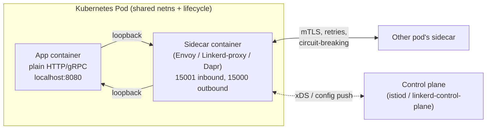
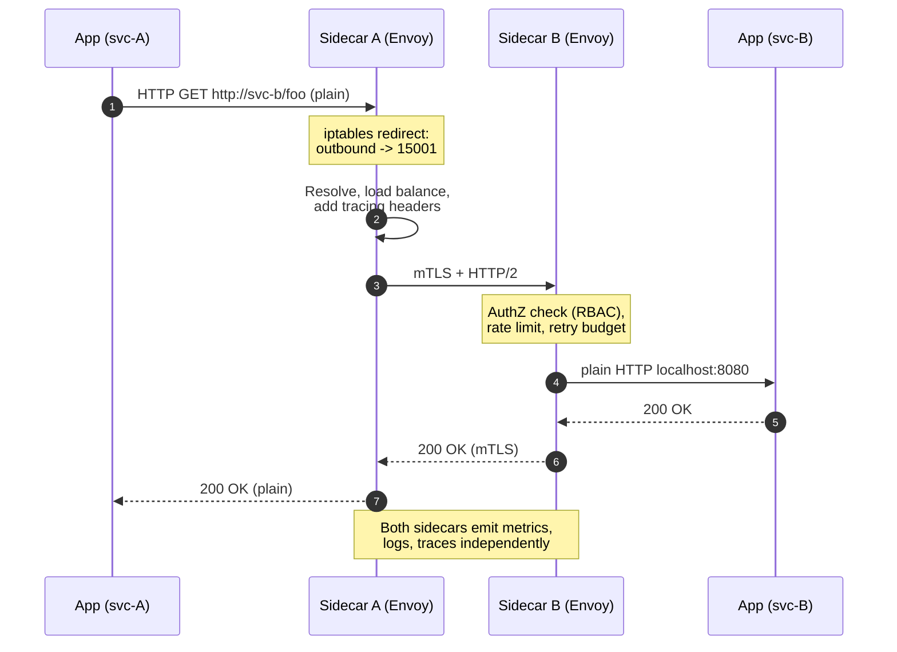
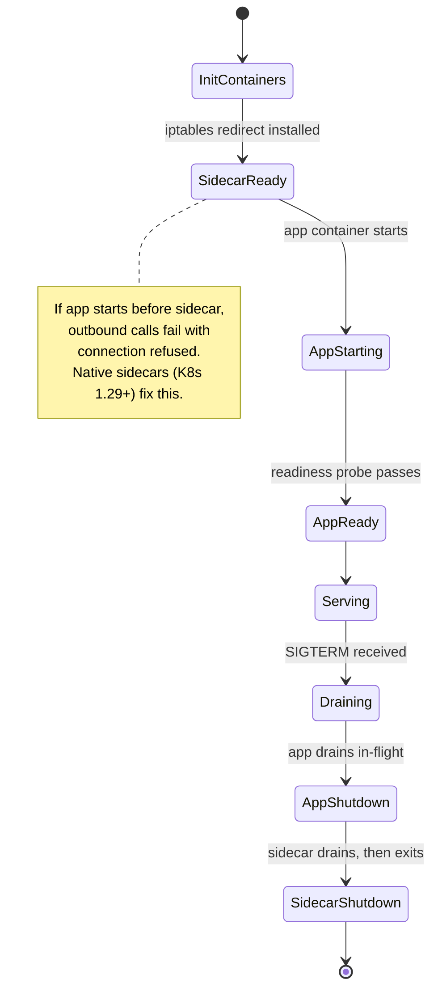

# Sidecar Pattern

## Why This Exists

**Problem.** You have N services in M languages. Every service needs the same cross-cutting capabilities: mTLS, retries with exponential backoff, circuit breakers, structured logging, metrics, secret rotation, request authorization, distributed tracing. Implementing these as libraries means N×M maintenance: a bug in the retry logic ships in five different language clients, drifts in semantics, gets patched at five different speeds. The Python client doesn't honor the deadline header. The Java client retries on `POST` (it shouldn't). The Go client logs PII because someone forgot to redact.

**Key insight.** Pull the cross-cutting concern out of the application process and run it as a **separate process co-located on the same host / pod / VM**, communicating over `localhost` (loopback) or a Unix domain socket. The app talks plain HTTP/gRPC to `127.0.0.1:port`; the sidecar handles TLS, auth, retries, telemetry on the wire. One implementation, language-agnostic, deployable independently of the app.

The sidecar shares the **fate** (lifecycle, network namespace, often filesystem) of the main container but is its own process — like a motorcycle sidecar: separate but bolted on.

**Reach for this when:**
- Polyglot fleet (3+ languages) where shared libraries become a maintenance tax.
- You need uniform mTLS / zero-trust networking across services without modifying app code.
- Cross-cutting concern is operationally expensive to roll out (security patches, retry policy changes, observability schema changes).
- You're adopting a service mesh (Istio, Linkerd, App Mesh) — the sidecar IS the data plane.
- Legacy apps you can't recompile but need to wrap in modern controls.
- Secrets / config / credential rotation must happen out of process (Vault Agent, Secrets Store CSI Driver).

**Don't reach for this when:**
- Single-language shop where a well-maintained client library is cheaper than a +50MB / +100m CPU sidecar per pod.
- Latency-sensitive hot paths where +0.5–2ms loopback hop is unacceptable (HFT, ad bidding, in-memory caches).
- Function/Lambda environments — you can't co-locate a long-running sidecar with ephemeral, request-scoped functions cleanly. (Lambda Extensions are the sidecar-shaped escape hatch.)
- Resource-constrained edge / IoT where the per-instance footprint matters.
- You only have 2–3 services. The mesh tax isn't worth it yet.

## Diagrams

### Sidecar topology — single pod



### Request flow with sidecar interception



### Lifecycle: sidecar startup ordering matters



## Concrete Patterns

The sidecar pattern shows up in three flavors. Knowing which one you're deploying changes the trade-offs.

### 1. Service-mesh data plane (Envoy, Linkerd-proxy)

The canonical case: every pod gets an L7 proxy that intercepts all inbound and outbound traffic via `iptables` rules (or eBPF in Cilium/Ambient). The proxy terminates mTLS, applies retry/timeout/circuit-breaking policy, emits metrics and traces. App code is unaware.

**Kubernetes pod spec (Istio injected):**

```yaml
apiVersion: v1
kind: Pod
metadata:
  name: orders
  annotations:
    sidecar.istio.io/inject: "true"
spec:
  containers:
    - name: orders
      image: registry.example.com/orders:v1.4.2
      ports:
        - containerPort: 8080
      env:
        # App calls peers by their k8s service name on plain HTTP.
        # Envoy intercepts and upgrades to mTLS transparently.
        - name: PAYMENTS_URL
          value: "http://payments.default.svc.cluster.local"
    # Injected by Istio mutating webhook:
    - name: istio-proxy
      image: docker.io/istio/proxyv2:1.22.0
      resources:
        requests:
          cpu: "100m"     # the tax: ~100m CPU + 50–80MB RAM per pod
          memory: "128Mi"
        limits:
          cpu: "2000m"
          memory: "1Gi"
      ports:
        - containerPort: 15090   # Envoy admin / Prometheus scrape
      readinessProbe:
        httpGet:
          path: /healthz/ready
          port: 15021
```

**Envoy config snippet (the actual policy that lives in the sidecar, not the app):**

```yaml
# This is what makes the sidecar valuable: declarative L7 policy
# pushed from the control plane via xDS. App never sees it.
static_resources:
  listeners:
    - name: outbound_payments
      address: { socket_address: { address: 0.0.0.0, port_value: 15001 } }
      filter_chains:
        - filters:
            - name: envoy.filters.network.http_connection_manager
              typed_config:
                "@type": type.googleapis.com/envoy.extensions.filters.network.http_connection_manager.v3.HttpConnectionManager
                stat_prefix: outbound_payments
                http_filters:
                  - name: envoy.filters.http.fault   # chaos engineering, free
                  - name: envoy.filters.http.router
                route_config:
                  virtual_hosts:
                    - name: payments
                      domains: ["payments.default.svc.cluster.local"]
                      routes:
                        - match: { prefix: "/" }
                          route:
                            cluster: payments_cluster
                            timeout: 2s
                            retry_policy:
                              # Retries live HERE, not in the app.
                              # Fix once, deployed everywhere via xDS.
                              retry_on: "5xx,reset,connect-failure,refused-stream"
                              num_retries: 3
                              per_try_timeout: 500ms
                              retry_back_off:
                                base_interval: 25ms
                                max_interval: 250ms
                              # Critical: budget caps total retry-induced load.
                              # Without this, retries amplify outages.
                              retry_budget:
                                budget_percent: { value: 20.0 }
                                min_retry_concurrency: 3
  clusters:
    - name: payments_cluster
      connect_timeout: 0.25s
      type: STRICT_DNS
      lb_policy: LEAST_REQUEST
      circuit_breakers:
        thresholds:
          - max_connections: 1024
            max_pending_requests: 256
            max_requests: 1024
            max_retries: 3   # cap concurrent retries — see "retry storm" pitfall
      transport_socket:
        name: envoy.transport_sockets.tls
        typed_config:
          "@type": type.googleapis.com/envoy.extensions.transport_sockets.tls.v3.UpstreamTlsContext
          common_tls_context:
            tls_certificates: [...]    # mTLS cert rotated by control plane
```

### 2. Capability sidecar (Dapr, Vault Agent, OPA, Fluent Bit)

Less about traffic interception, more about **exposing a capability over localhost**. The app calls a stable local API; the sidecar handles the messy details.

**Dapr sidecar — pub/sub without coupling to the broker:**

```python
# app.py — application code, knows nothing about Kafka/Redis/SNS
import requests, os

DAPR_HTTP = os.getenv("DAPR_HTTP_PORT", "3500")

def publish_order_created(order_id: str, payload: dict):
    # Dapr sidecar at localhost:3500 routes this to whatever broker
    # is wired in components/pubsub.yaml. Swap Kafka -> SNS without
    # touching app code.
    r = requests.post(
        f"http://localhost:{DAPR_HTTP}/v1.0/publish/orders-pubsub/order.created",
        json={"order_id": order_id, **payload},
        timeout=2.0,
    )
    r.raise_for_status()

def get_secret(name: str) -> str:
    # Same idea for secrets — Dapr abstracts Vault / AWS SM / K8s secrets.
    r = requests.get(
        f"http://localhost:{DAPR_HTTP}/v1.0/secrets/local-vault/{name}",
        timeout=1.0,
    )
    return r.json()["value"]
```

**Vault Agent sidecar — secrets injection via shared volume:**

```yaml
# Vault Agent renders templated secrets to a shared emptyDir volume.
# App reads them as files. App never holds a Vault token.
apiVersion: apps/v1
kind: Deployment
metadata: { name: api }
spec:
  template:
    metadata:
      annotations:
        vault.hashicorp.com/agent-inject: "true"
        vault.hashicorp.com/role: "api-role"
        vault.hashicorp.com/agent-inject-secret-db: "secret/data/api/db"
        vault.hashicorp.com/agent-inject-template-db: |
          {{- with secret "secret/data/api/db" -}}
          DB_USER={{ .Data.data.user }}
          DB_PASS={{ .Data.data.password }}
          {{- end }}
    spec:
      serviceAccountName: api
      containers:
        - name: api
          image: api:v2
          # Reads /vault/secrets/db on startup. Vault Agent re-renders
          # on lease expiry; app must re-read or get a SIGHUP.
          command: ["/bin/sh", "-c", ". /vault/secrets/db && exec /app/server"]
```

### 3. Policy sidecar (Open Policy Agent)

The app delegates an authorization decision to a co-located OPA process. Policies (Rego) are pulled from a bundle server; the app stays policy-free.

```rego
# policy.rego — lives in OPA, not in app code
package orders.authz

default allow := false

# Only the order owner or an admin may cancel an order.
allow if {
    input.action == "cancel_order"
    input.user.id == input.resource.owner_id
}

allow if {
    input.action == "cancel_order"
    "admin" in input.user.roles
}
```

```go
// Go service calls localhost OPA — no policy logic in the app.
type opaInput struct {
    Action   string                 `json:"action"`
    User     map[string]any         `json:"user"`
    Resource map[string]any         `json:"resource"`
}

func authorize(ctx context.Context, in opaInput) (bool, error) {
    body, _ := json.Marshal(map[string]any{"input": in})
    req, _ := http.NewRequestWithContext(ctx, "POST",
        "http://127.0.0.1:8181/v1/data/orders/authz/allow",
        bytes.NewReader(body))
    // Tight timeout: OPA is in-pod, anything > 50ms is a bug.
    ctx2, cancel := context.WithTimeout(ctx, 50*time.Millisecond)
    defer cancel()
    resp, err := http.DefaultClient.Do(req.WithContext(ctx2))
    if err != nil {
        // Fail closed for authz. Failing open is how you get on the news.
        return false, fmt.Errorf("opa unreachable: %w", err)
    }
    defer resp.Body.Close()
    var out struct{ Result bool `json:"result"` }
    return out.Result, json.NewDecoder(resp.Body).Decode(&out)
}
```

## Trade-offs

| Benefit | Cost |
|---|---|
| Polyglot uniformity — one mTLS / retry / tracing implementation across all languages | Per-pod resource tax (Envoy ~100m CPU + 50–100MB RAM; Linkerd2-proxy ~10m + 10–20MB; multiply by pod count) |
| Independent deploy & patch cycle (CVE in Envoy → roll the data plane, app untouched) | Two processes per pod doubles attack surface; sidecar bugs become app outages (the proxy IS your network) |
| App stays small and focused on business logic | +0.5–2ms p50, larger p99 tail for every hop (two extra hops per call: app→sidecar→sidecar→app) |
| Operators can change behavior (timeouts, retries, traffic shifting) without redeploying app | Operational complexity: control plane, certificate authority, xDS, version skew between data and control planes |
| Legacy apps gain mTLS/observability without code changes | Startup ordering bugs — app calls fail until sidecar is ready (mitigated by K8s native sidecars, 1.29+) |
| Mesh-level features come "free": canary by header, fault injection, mirroring | Debugging gets harder — `tcpdump` shows mTLS; you need sidecar admin endpoints (`:15000`) and access logs |
| Secret rotation without app restart (Vault Agent, SDS) | Memory-mapped / file-based secrets need app-side reload logic (SIGHUP, watchers) |
| Pluggable backends (Dapr swap Kafka↔SNS via config) | Abstraction tax — Dapr's lowest common denominator misses broker-specific features |

## Common Pitfalls

- **Retry storms via stacked retries.** App library retries 3×, sidecar retries 3×, gateway retries 3× → 27× amplification on a partial outage. **Fix:** retries live in *one* layer (preferably the sidecar), with a retry budget cap (Envoy `retry_budget`, Linkerd retry budgets default 20%). DDIA ch. 8 covers this; the SRE Workbook ch. 22 ("Managing Load") is explicit about retry amplification.
- **Sidecar starts after app, app crash-loops.** Pre-K8s 1.29, sidecar containers had no ordering guarantee. App's first outbound call hits a dead loopback, container restarts, repeat. **Fix:** use native sidecars (`restartPolicy: Always` on initContainer, K8s 1.29+ GA in 1.33), or app-side retry-on-startup, or `holdApplicationUntilProxyStarts: true` (Istio).
- **Sidecar exits before app finishes draining.** Pod gets SIGTERM, sidecar exits first, app's in-flight outbound calls fail. **Fix:** preStop hooks with sleep, or native sidecars which handle termination order.
- **Privileged init container for `iptables`.** Istio's traffic capture needs `NET_ADMIN`. In tightly-locked clusters this is forbidden. **Fix:** Istio CNI plugin (no per-pod privilege), Cilium / Ambient mesh (eBPF, no per-pod sidecar at all).
- **mTLS works, but authn/authz is wide-open.** Teams enable mTLS, declare victory, never write `AuthorizationPolicy`. Now any compromised pod can reach any service. **Fix:** default-deny `AuthorizationPolicy`, allowlist per service. BSRS ch. 6 ("Design for Understandability") and ch. 8 ("Design for Resilience") cover zero-trust networking principles.
- **Loopback isn't localhost-fast everywhere.** On some kernels / overlay networks, loopback through `iptables` redirect adds non-trivial latency. **Fix:** measure with `tcpdump -i lo` and histogram; consider Unix domain sockets for the hottest paths; consider Cilium's eBPF redirect which avoids the user-space hop for in-pod traffic.
- **"We'll just upgrade the mesh quarterly."** Envoy ships CVEs monthly; Istio's deprecation pace is real. Treat the mesh like a database — own its operational toil. **Fix:** dedicated platform team or pick a managed mesh (App Mesh, Anthos, Linkerd Buoyant Cloud).
- **Per-pod sidecar at scale = millions of dollars.** 10k pods × 100MB × $/GB-month = real money. **Fix:** evaluate Ambient mesh (Istio) or Cilium service mesh — node-level proxy instead of per-pod, ~10× cheaper at the cost of weaker tenant isolation.
- **Logs / metrics from sidecar AND app double-count.** Both emit request metrics; dashboards show 2× QPS. **Fix:** decide: app-emitted metrics for business events, sidecar-emitted for transport metrics. Document the split.
- **Dapr / abstracted-broker traps.** App is "broker-agnostic" until you need Kafka exactly-once semantics or SNS message attributes. The abstraction leaks. **Fix:** be skeptical of "swap brokers via config" claims for anything beyond simple pub/sub.

## Decision Table

| Situation | Pick | Why |
|---|---|---|
| 5+ services in 3+ languages, need uniform mTLS & retries | **Sidecar (service mesh)** | Polyglot tax dominates; one Envoy beats five language clients |
| Single-language Go monolith → microservices | **In-process library** (e.g. `go-kit`, gRPC interceptors) | Sidecar tax not justified; library is well-typed and fast |
| Hot path < 1ms budget (HFT, ad serving, cache) | **In-process** | +0.5–2ms loopback hop is fatal |
| Need zero-trust networking, can't modify legacy apps | **Sidecar** | Only option without recompiling |
| 10k+ pods, mesh cost dominates | **Ambient mesh / eBPF (Cilium)** | Node-level proxy, ~10× less RAM than per-pod sidecar |
| Function/Lambda environment | **Lambda Extensions** (sidecar-shaped, request-scoped) | Native sidecars don't fit ephemeral compute |
| Need pluggable secrets / pub-sub / state backends | **Capability sidecar (Dapr, Vault Agent)** | Abstracts infra without app changes |
| Just need TLS termination at edge | **Ingress / API gateway** (not sidecar) | Sidecar is overkill for north-south only |
| Need fine-grained authz across services | **OPA sidecar + bundle server** | Centralized policy, decentralized enforcement |
| Library mode is fine, just want one feature (e.g. tracing) | **OpenTelemetry SDK** | Library is cheaper than a process |
| 2–3 services, small team | **Library + good defaults** | Mesh complexity > current pain |
| Compliance demands cryptographic identity per workload | **Sidecar + SPIFFE/SPIRE** | Workload identity is the sidecar's killer feature |

## References

- Bilgin Ibryam — *Multi-Runtime Microservices Architecture* — https://www.infoq.com/articles/multi-runtime-microservice-architecture/
- Microsoft Cloud Design Patterns — *Sidecar* — https://learn.microsoft.com/en-us/azure/architecture/patterns/sidecar
- Kubernetes — *Sidecar Containers (native, GA 1.33)* — https://kubernetes.io/docs/concepts/workloads/pods/sidecar-containers/
- Burns & Oppenheimer — *Design Patterns for Container-based Distributed Systems* (HotCloud '16) — https://www.usenix.org/system/files/conference/hotcloud16/hotcloud16_burns.pdf
- Envoy — *Architecture Overview* — https://www.envoyproxy.io/docs/envoy/latest/intro/arch_overview/intro/intro
- Istio — *Architecture* — https://istio.io/latest/docs/ops/deployment/architecture/
- Istio — *Ambient Mesh (sidecar-less mode)* — https://istio.io/latest/docs/ambient/overview/
- Linkerd — *Architecture & micro-proxy rationale* — https://linkerd.io/2/reference/architecture/
- Dapr — *Sidecar architecture* — https://docs.dapr.io/concepts/overview/
- Open Policy Agent — *Architecture* — https://www.openpolicyagent.org/docs/latest/
- HashiCorp Vault — *Vault Agent Sidecar Injector* — https://developer.hashicorp.com/vault/docs/platform/k8s/injector
- SPIFFE / SPIRE — *Concepts* (workload identity for sidecars) — https://spiffe.io/docs/latest/spiffe-about/spiffe-concepts/
- Google SRE Workbook — *Managing Load* (retry budgets, amplification) — https://sre.google/workbook/managing-load/
- Building Secure and Reliable Systems — Ch. 6 ("Design for Understandability") and Ch. 8 ("Design for Resilience") — https://sre.google/books/building-secure-reliable-systems/
- Kleppmann — *Designing Data-Intensive Applications* — Ch. 8 ("The Trouble with Distributed Systems") on retry semantics
- AWS Builders' Library — *Timeouts, retries, and backoff with jitter* — https://aws.amazon.com/builders-library/timeouts-retries-and-backoff-with-jitter/
- AWS App Mesh — *Concepts* — https://docs.aws.amazon.com/app-mesh/latest/userguide/what-is-app-mesh.html
- Cilium — *Service Mesh (eBPF, sidecar-free)* — https://cilium.io/use-cases/service-mesh/
- Idit Levine et al. — *eBPF and the Service Mesh* (talk transcript via Solo.io) — https://www.solo.io/blog/ebpf-for-service-mesh/
- Martin Fowler — *Microservices* (cross-cutting concerns context) — https://martinfowler.com/articles/microservices.html

## See Also

- `../service-mesh/` — service mesh as the canonical multi-sidecar deployment; control plane vs data plane
- `../../communication/api-gateway/` — north-south analog of the sidecar's east-west role
- `../../reliability/bulkheads/` — failure isolation; complements sidecar circuit-breaking
- `../../reliability/circuit-breaker/` — pattern typically implemented IN the sidecar
- `../../reliability/retries-backoff/` — retry budgets, jitter, amplification — critical when retries live in the sidecar
- `../../reliability/timeouts/` — deadline propagation across sidecar hops
- `../../performance/tracing/` — sidecar-emitted spans vs app-emitted spans
- `../../reliability/observability/` — log shipping sidecars (Fluent Bit, Vector)
