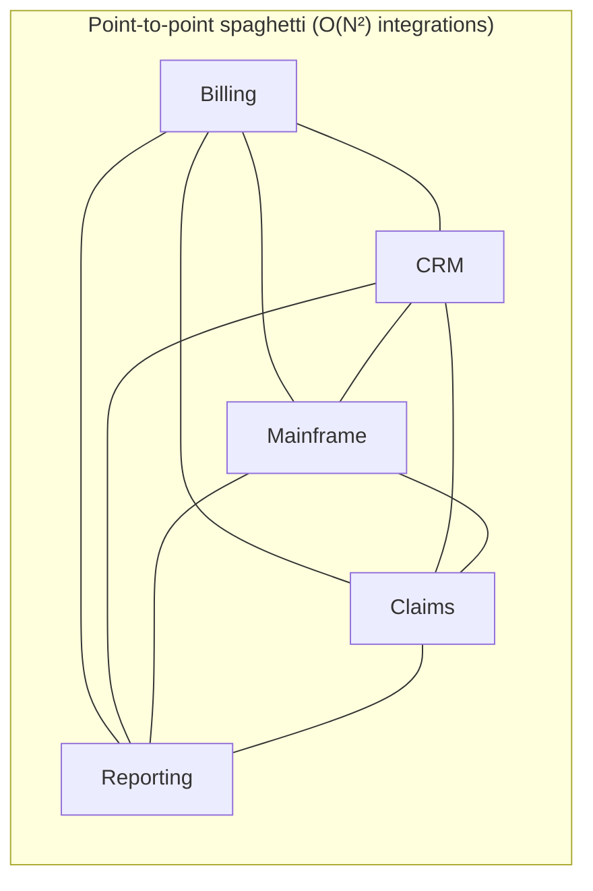
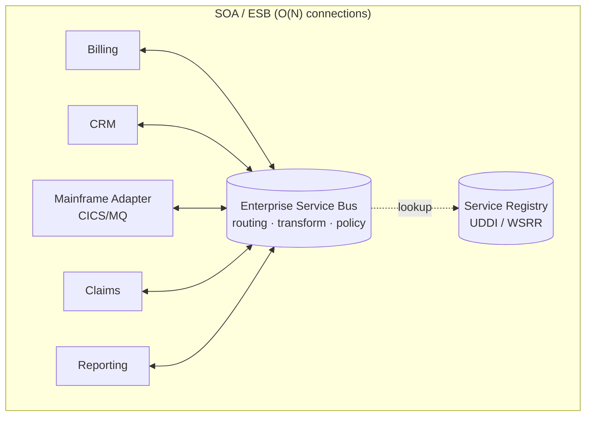
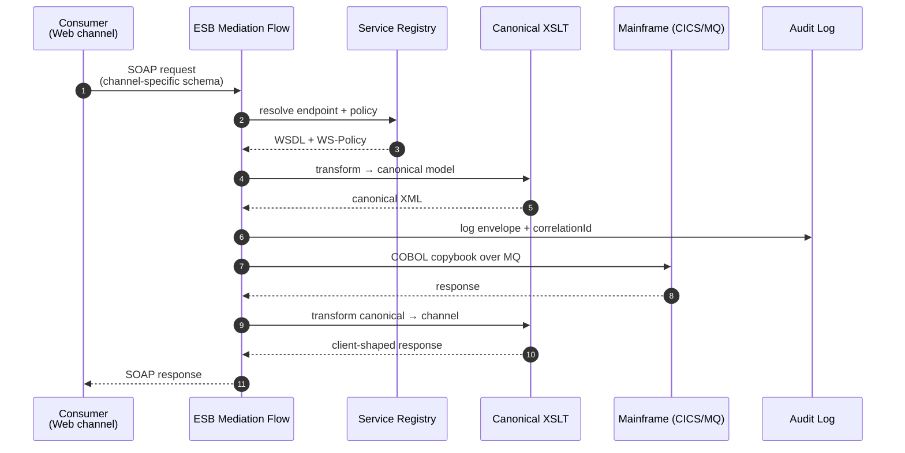
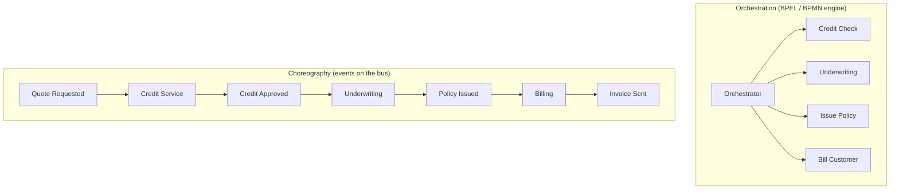

# Service-Oriented Architecture (SOA)

## Why This Exists

**Problem.** Large enterprises (banks, insurers, telcos, governments) accumulated dozens to hundreds of heterogeneous applications — mainframes, AS/400s, SAP, custom Java/.NET, packaged COTS — that needed to talk to each other. Point-to-point integration produced an O(N²) spaghetti of brittle FTP drops, DB links, and bespoke socket protocols. Every new system meant N new integrations and N new on-call rotations.

**Key insight.** Treat business capabilities (e.g., *CustomerLookup*, *PolicyQuote*, *FundsTransfer*) as **coarse-grained, contract-first services** behind a stable, versioned interface. Route all inter-service traffic through a shared **Enterprise Service Bus (ESB)** that handles transformation, protocol bridging, routing, and policy enforcement. Standardize on a **canonical data model** so you translate to/from canonical at the edges instead of N×N pairwise.

This was the dominant enterprise integration pattern from roughly 2003–2014. It still runs the back office of most Fortune 500 financial firms.

**Reach for this when:**
- You're in **banking, insurance, healthcare payer, telco BSS, or government** and inheriting an existing ESB estate (TIBCO BusinessWorks, IBM Integration Bus / WebSphere Message Broker, Oracle Service Bus, MuleSoft, webMethods).
- You must integrate **mainframe / COBOL / CICS** or packaged enterprise software (SAP, Siebel, Guidewire, Duck Creek) where the system of record won't change.
- Your organization has **strong governance** (architecture review boards, an SOA CoE, change advisory boards) and the political cost of bypassing them is high.
- Compliance regimes (SOX, PCI-DSS, HIPAA, Solvency II) demand **centralized policy enforcement, audit, and lineage** — the ESB is a natural choke point for this.
- You have **fewer than ~50 services** and they change on quarterly release trains, not daily.

**Don't reach for this when:**
- You're greenfield and want **independent deployability per team** — SOA's shared canonical model and central ESB couple release cycles. Use [microservices](../microservices/) instead.
- Your traffic profile is **internet-scale, low-latency, high-fanout** (e.g., consumer mobile, ad tech). The ESB becomes a single point of failure and a latency tax.
- Your teams are small (< 50 engineers total). The governance overhead crushes velocity.
- You need **streaming, event-driven** semantics at scale — modern [event-driven architectures](../event-driven/) on Kafka/Kinesis are a better fit than SOAP-over-JMS.
- You're tempted to call REST-over-HTTP "SOA". It isn't — that's just web services. SOA is specifically about the **bus + canonical model + governance** triad.

## Diagrams

### The two integration topologies SOA replaced





### Anatomy of a SOA request



### Orchestration vs choreography in SOA



Most enterprise SOA leans heavily on **orchestration** (BPEL, BPMN with WS-BPEL engines like Oracle SOA Suite, IBM Process Server). It's centrally observable and auditable, but creates a coordinator bottleneck. Microservices culture pushed back toward choreography for the same reasons SOA chose orchestration.

## Core Concepts in Depth

### 1. Coarse-grained services

A SOA service represents a **business capability**, not a database table. Granularity is deliberately larger than microservices because:

- Each call typically crosses an org boundary, an audit log, a transformation, and possibly a network hop into a different data center. Fine-grained chatter is expensive.
- Services are owned by **functional teams** (Underwriting, Claims, Billing) and follow a **release train** (often quarterly). You don't want 200 of them.
- The canonical model amortizes only if services are large enough to justify the translation cost.

**Rule of thumb (Thomas Erl):** A SOA service exposes ~5–30 operations covering a complete business capability. A microservice exposes ~1–5 endpoints around a bounded context.

### 2. Contract-first with WSDL / XSD

You design the **WSDL** (interface) and **XSDs** (schemas) before any code. The contract is the source of truth; servers and clients are generated from it.

```xml
<!-- ClaimService.wsdl (abridged) — contract-first design -->
<definitions xmlns="http://schemas.xmlsoap.org/wsdl/"
             xmlns:tns="http://example.com/claims/v2"
             xmlns:can="http://example.com/canonical/v3"
             targetNamespace="http://example.com/claims/v2">

  <types>
    <xsd:schema>
      <!-- Import the CANONICAL party + money types — never redefine them locally -->
      <xsd:import namespace="http://example.com/canonical/v3"
                  schemaLocation="canonical/Party-v3.xsd"/>
      <xsd:import namespace="http://example.com/canonical/v3"
                  schemaLocation="canonical/Money-v3.xsd"/>

      <xsd:element name="SubmitClaimRequest">
        <xsd:complexType>
          <xsd:sequence>
            <xsd:element name="claimant"     type="can:Party"/>
            <xsd:element name="policyNumber" type="xsd:string"/>
            <xsd:element name="lossDate"     type="xsd:date"/>
            <xsd:element name="amount"       type="can:Money"/>
            <xsd:element name="incidentCode" type="can:IncidentCode"/>
          </xsd:sequence>
        </xsd:complexType>
      </xsd:element>

      <xsd:element name="SubmitClaimResponse">
        <xsd:complexType>
          <xsd:sequence>
            <xsd:element name="claimId" type="xsd:string"/>
            <xsd:element name="status"  type="can:ClaimStatus"/>
          </xsd:sequence>
        </xsd:complexType>
      </xsd:element>
    </xsd:schema>
  </types>

  <message name="SubmitClaimIn">  <part name="body" element="tns:SubmitClaimRequest"/></message>
  <message name="SubmitClaimOut"> <part name="body" element="tns:SubmitClaimResponse"/></message>

  <portType name="ClaimPortType">
    <operation name="submitClaim">
      <input  message="tns:SubmitClaimIn"/>
      <output message="tns:SubmitClaimOut"/>
      <fault  name="businessFault" message="tns:ClaimFault"/>
    </operation>
  </portType>

  <binding name="ClaimSOAPBinding" type="tns:ClaimPortType">
    <soap:binding style="document" transport="http://schemas.xmlsoap.org/soap/http"/>
    <operation name="submitClaim">
      <soap:operation soapAction="http://example.com/claims/v2/submitClaim"/>
      <input>  <soap:body use="literal"/></input>
      <output> <soap:body use="literal"/></output>
    </operation>
  </binding>

  <service name="ClaimService">
    <port name="ClaimPort" binding="tns:ClaimSOAPBinding">
      <soap:address location="https://esb.internal/claims/v2"/>
    </port>
  </service>
</definitions>
```

**Why contract-first matters:** the WSDL becomes a binding agreement reviewed in design council. Generated stubs (JAX-WS in Java, `wsdl.exe`/`svcutil.exe` in .NET) prevent drift. The compiled stub fails fast when the schema changes — turning a runtime production incident into a compile-time error.

### 3. The canonical data model

The hardest and most political artifact in SOA. A *canonical model* (sometimes called *enterprise information model*) is a single shared vocabulary for core entities — `Party`, `Account`, `Policy`, `Money`, `Address`. Every service translates to/from it at its edge.

**Without canonical:** N services × M consumers = up to N×M pairwise mappings.
**With canonical:** N + M edge mappings.

```xml
<!-- canonical/Party-v3.xsd — one namespace, shared by all services -->
<xsd:schema targetNamespace="http://example.com/canonical/v3"
            xmlns:xsd="http://www.w3.org/2001/XMLSchema"
            elementFormDefault="qualified">

  <xsd:complexType name="Party" abstract="true">
    <xsd:sequence>
      <xsd:element name="partyId"     type="xsd:string"/>
      <xsd:element name="displayName" type="xsd:string"/>
      <xsd:element name="addresses"   type="AddressList" minOccurs="0"/>
    </xsd:sequence>
  </xsd:complexType>

  <xsd:complexType name="Person">
    <xsd:complexContent>
      <xsd:extension base="Party">
        <xsd:sequence>
          <xsd:element name="givenName"  type="xsd:string"/>
          <xsd:element name="familyName" type="xsd:string"/>
          <xsd:element name="dateOfBirth" type="xsd:date"/>
        </xsd:sequence>
      </xsd:extension>
    </xsd:complexContent>
  </xsd:complexType>

  <xsd:complexType name="Organization">
    <xsd:complexContent>
      <xsd:extension base="Party">
        <xsd:sequence>
          <xsd:element name="legalName" type="xsd:string"/>
          <xsd:element name="lei"       type="xsd:string" minOccurs="0"/>
          <xsd:element name="taxId"     type="xsd:string" minOccurs="0"/>
        </xsd:sequence>
      </xsd:extension>
    </xsd:complexContent>
  </xsd:complexType>
</xsd:schema>
```

**Canonical model failure modes (war stories):**

- **Lowest common denominator.** To get all 14 LOBs to agree, `Party.givenName` becomes optional and weakly typed, defeating the purpose.
- **Versioning paralysis.** Bumping `canonical/v3` to `v4` requires every consumer to upgrade. Teams stay on `v3` for years; you end up running both.
- **Translation tax.** Every service does `inbound XSLT → canonical → business logic → canonical → outbound XSLT`. CPU and latency add up.
- **The model becomes the architecture team's product**, not a means to an end. Watch for this — it's a culture smell.

Industry standard models that sometimes work as a starting point: **ACORD** (insurance), **ISO 20022** (financial messaging), **HL7 FHIR** (healthcare), **TM Forum SID** (telco). Adopting one beats inventing your own — a lot of cross-firm pain has been baked out of them.

### 4. The ESB

The ESB is a piece of middleware that does, at minimum:

1. **Routing** — content-based, header-based, recipient list, scatter-gather.
2. **Transformation** — XSLT, JSON-to-XML, COBOL copybook to canonical XML.
3. **Protocol bridging** — SOAP/HTTP ↔ JMS ↔ MQ ↔ FTP ↔ AS2 ↔ SAP IDoc ↔ Tuxedo.
4. **Policy enforcement** — auth, authz, message-level encryption (WS-Security), throttling, schema validation.
5. **Mediation flows** — graphical or DSL-defined pipelines per service.
6. **Reliable delivery** — store-and-forward, retry, DLQ.

```xml
<!-- A typical ESB mediation flow (vendor-agnostic pseudo-config) -->
<mediation name="submitClaim.flow" version="2.4.1">
  <inbound>
    <listener protocol="https" port="8443" path="/claims/v2"/>
    <validate schema="claims/v2/SubmitClaim.xsd" onFail="returnFault"/>
    <authenticate scheme="WS-Security/X509"/>
    <authorize role="claims-submitter"/>
  </inbound>

  <transform>
    <!-- channel-specific schema → canonical -->
    <xslt sheet="xslt/web-to-canonical.xsl"/>
    <enrich source="lookupCustomer" key="$body/claimant/partyId"
            timeout="2000ms" cacheTTL="60s"/>
  </transform>

  <route>
    <when test="$body/amount/value > 50000">
      <invoke service="HighValueClaim" timeout="30s"/>
      <onTimeout> <log level="ERROR"/> <publish queue="dlq.claims.highvalue"/> </onTimeout>
    </when>
    <otherwise>
      <invoke service="StandardClaim" timeout="10s"/>
    </otherwise>
  </route>

  <outbound>
    <xslt sheet="xslt/canonical-to-web.xsl"/>
    <audit topic="audit.claims" includeHeaders="true"/>
  </outbound>

  <onFault>
    <map to="ClaimFault"/>
    <log level="ERROR" includeStackTrace="true"/>
    <retry maxAttempts="3" backoff="exponential" jitter="true"/>
  </onFault>
</mediation>
```

**The ESB anti-pattern (a.k.a. "Erl's Lament"):** Teams put **business logic** in mediation flows. Now your business rules live across 200 XSLT files, BPEL processes, and ESB router scripts, none of which are unit-testable, version-controlled, or owned by anyone. This is the single biggest reason microservices adherents cite for rejecting SOA: *"smart endpoints, dumb pipes"* (Fowler/Lewis 2014).

The defensible position: **the ESB does mediation only.** Routing, transformation, protocol bridging, security. Business logic lives in services.

### 5. Orchestration with BPEL

WS-BPEL (Business Process Execution Language) lets you compose long-running stateful processes from services:

```xml
<!-- Loan origination: orchestrate Credit, Underwriting, Booking, Funding -->
<process name="LoanOrigination" xmlns="http://docs.oasis-open.org/wsbpel/2.0/process/executable">

  <variables>
    <variable name="application" messageType="loan:LoanApplication"/>
    <variable name="creditScore" messageType="credit:CreditResponse"/>
    <variable name="decision"    messageType="uw:UnderwritingDecision"/>
    <variable name="loanId"      type="xsd:string"/>
  </variables>

  <sequence>
    <receive partnerLink="customer" operation="submit" variable="application" createInstance="yes"/>

    <!-- Run credit and fraud checks in parallel -->
    <flow>
      <invoke partnerLink="creditBureau" operation="getScore"
              inputVariable="application" outputVariable="creditScore"/>
      <invoke partnerLink="fraudService" operation="check"
              inputVariable="application" outputVariable="fraudResult"/>
    </flow>

    <if>
      <condition>$creditScore/score &gt;= 680 and $fraudResult/risk = 'LOW'</condition>
      <sequence>
        <invoke partnerLink="underwriting" operation="decide"
                inputVariable="application" outputVariable="decision"/>
        <invoke partnerLink="bookingSystem" operation="bookLoan"
                inputVariable="decision" outputVariable="loanId"/>

        <!-- BPEL compensation: if funding fails, undo booking (saga semantics) -->
        <scope>
          <compensationHandler>
            <invoke partnerLink="bookingSystem" operation="reverseBooking"
                    inputVariable="loanId"/>
          </compensationHandler>
          <invoke partnerLink="treasury" operation="fund" inputVariable="loanId"/>
        </scope>
      </sequence>
      <else>
        <invoke partnerLink="customer" operation="reject" inputVariable="application"/>
      </else>
    </if>

    <reply partnerLink="customer" operation="submit" variable="loanId"/>
  </sequence>
</process>
```

BPEL gives you **durable execution, compensation, and a graphical audit trail** — properties that compliance auditors love and that microservices-with-Sagas have to rebuild from scratch (see [saga](../saga/)). The cost: a vendor-specific orchestration engine that's hard to unit test, hard to deploy, and a single point of failure.

Modern alternatives offering similar properties without the lock-in: **Temporal**, **AWS Step Functions**, **Camunda 8 (Zeebe)**.

### 6. Service registry and versioning

UDDI never really worked at scale, but its successor — proprietary registries like **WSRR (IBM)**, **Oracle Service Registry**, **MuleSoft Anypoint Exchange** — became the system of record for "what services exist, what versions, who owns them, what SLA, what policies apply".

**Versioning rule:** SOA tends to use `major.minor` namespaces (`http://example.com/claims/v2`) and run **multiple major versions in parallel** for years. v1 deprecation announcements are sent 18–24 months in advance. This is one of the few places SOA culture is empirically *better* than naive microservices culture, where breaking changes often ship with a Slack post.

## SOA vs Microservices: the honest comparison

This is the question every architect gets asked. The lazy answer is "microservices = SOA done right". It's not — they made different trade-offs.

| Dimension                | SOA                                      | Microservices                            |
|--------------------------|------------------------------------------|------------------------------------------|
| **Service granularity**  | Coarse (business capability, ~5–30 ops) | Fine (bounded context, ~1–5 ops)        |
| **Communication**        | ESB-mediated SOAP/JMS, BPEL orchestration | Direct HTTP/gRPC, async events, dumb pipes |
| **Data model**           | Shared canonical (XSD)                  | Per-service schema, decentralized       |
| **Transport**            | SOAP/WS-* over HTTP, JMS, MQ            | REST, gRPC, NATS, Kafka                 |
| **Schema evolution**     | Strict, governed, slow (months)         | Tolerant readers, fast (days)           |
| **Governance**           | Heavy: ARB, CoE, design council         | Light: per-team, supported by guardrails |
| **Deployment cadence**   | Quarterly release trains                | Continuous (multiple/day per service)   |
| **State of orchestration** | BPEL / BPMN engine                    | Saga via events, Temporal, Step Functions |
| **Failure isolation**    | Weak (ESB SPOF, shared DB common)       | Strong (per-service infra, bulkheads)   |
| **Ops model**            | Central middleware team                  | "You build it, you run it"              |
| **Where it shines**      | Heterogeneous legacy estate, regulated   | Cloud-native, fast-moving product orgs  |
| **Where it fails**       | Internet-scale, polyglot, fast change    | Small teams, monolithic data, weak DevOps |

The cleanest mental model: **SOA optimized for stability, governance, and integration of pre-existing systems. Microservices optimized for independent deployability and team autonomy.** Both are right answers — for different problems.

## Where SOA still appears in 2026

- **Tier-1 banks**: core ledger, payments, AML, KYC platforms — almost universally on TIBCO/IBM IIB/MuleSoft over a canonical model derived from ISO 20022.
- **Insurance carriers**: Guidewire and Duck Creek expose SOAP-first integration interfaces; brokers and reinsurers wire them up over an ESB using ACORD canonical schemas.
- **Telcos**: BSS/OSS stacks (Amdocs, Ericsson, Netcracker) expose SOAP and JMS interfaces; canonical model is TM Forum SID.
- **Healthcare payers**: claims adjudication, eligibility — HL7 v2/v3 over MLLP, often bridged through an ESB to FHIR REST at the edge.
- **Government**: tax, benefits, immigration — long mainframe replacements typically front the legacy with a SOAP layer before refactoring further.

If you're modernizing one of these estates, **don't rip out the ESB on day one.** The realistic playbook is *Strangler Fig* (Fowler): introduce a microservice or API gateway in front of the ESB, route new traffic there, leave existing flows in place, and amortize migration over years.

## Trade-offs

| Benefit                                                        | Cost                                                                 |
|---------------------------------------------------------------|---------------------------------------------------------------------|
| Reduces N×N integration to N (canonical model + ESB)          | Canonical model becomes a political bottleneck; lowest-common-denominator schemas |
| Centralized policy: auth, audit, encryption, throttling at ESB | ESB is a single point of failure; one bad mediation flow can melt the bus |
| Strong contract-first culture catches breaking changes early  | WSDL/XSD tooling is heavy; XML verbosity; SOAP envelope overhead    |
| BPEL gives durable orchestration with built-in compensation   | BPEL engines are vendor-locked, hard to unit test, hard to debug    |
| Excellent fit for heterogeneous legacy + COTS integration     | Poor fit for fast-moving product orgs; release trains kill velocity |
| Mature governance pleases auditors and regulators             | Architecture review boards become bottlenecks; "innovation by committee" |
| Long major-version support windows (years)                    | You end up running v1, v2, v3 concurrently and paying for all three |
| Mature monitoring and message-level audit out of the box      | Per-message latency includes 2× XSLT, canonical translation, ESB hop |

## Common Pitfalls

- **Putting business logic in mediation flows.** XSLT in the ESB that decides interest rates, applies discounts, or computes premiums. It's invisible to developers, untestable, and owned by no one. **Rule: ESB does mediation; services do logic.**
- **Canonical model design by committee.** 18 months of meetings produce an `Address` type with 47 optional fields and no required ones. Adopt an industry standard (ACORD/ISO 20022/SID/FHIR) instead of inventing your own.
- **Treating REST-over-HTTP as "doing SOA".** REST without a bus, canonical model, or governance is just web services. Don't claim SOA benefits without paying SOA costs.
- **ESB as the integration silver bullet for everything.** Streaming analytics, real-time bidding, mobile push — these don't belong on a SOAP/JMS bus. Use Kafka and dedicated paths.
- **Two-phase commit (XA) across the bus.** Tempting because the ESB supports it. Don't — distributed XA over WAN-bridged transaction managers has predictable production-incident behavior. Use sagas with BPEL compensation instead.
- **No versioning discipline.** Inevitably someone changes `canonical/v3` in place "just for one field". 14 consumers break Sunday morning. **Always bump the namespace; never mutate a published XSD.**
- **Architecture Review Board paralysis.** ARB becomes a quarterly bottleneck reviewing every WSDL change. The fix is *guardrails* (automated XSD diff checks, schema linters, contract tests in CI) so most changes don't need a meeting.
- **Over-investing in the canonical at the expense of edges.** A pristine canonical model with garbage adapters at every endpoint produces canonical-pristine garbage. The ETL principle applies: validate at the boundary.
- **EOD batch on the same bus as online traffic.** End-of-day reconciliation jobs scatter-gather every account; p99 for online customers spikes 50x at midnight. **Carve out a separate logical bus / partition for batch.**

## Decision Table

| Situation                                                                   | Choose            | Why                                                          |
|----------------------------------------------------------------------------|-------------------|--------------------------------------------------------------|
| Greenfield SaaS, 50–500 engineers, cloud-native                             | Microservices     | SOA governance and ESB SPOF crush you; you don't have legacy to integrate |
| Bank integrating mainframe core, 14 LOB systems, SOX/Basel auditors        | SOA               | Canonical model + ESB audit choke point + BPEL durability    |
| Insurance carrier on Guidewire/Duck Creek with reinsurance partners        | SOA (ACORD)       | Industry canonical exists; partners speak SOAP; buy don't build |
| Internet-scale consumer product, < 10ms p99 budget                          | Microservices     | ESB hop alone blows latency budget; gRPC/HTTP direct         |
| Mid-size enterprise (~50 engineers), ~10 internal systems                  | API gateway + REST | SOA is overkill; full microservices is over-engineering      |
| Need cross-service durable workflow with compensation, regulated industry  | BPEL on SOA, OR Temporal/Step Functions | Both work; SOA if you already have the engine; Temporal greenfield |
| Many heterogeneous protocols (FTP, MQ, SOAP, IDoc, EDI) to mediate          | SOA / iPaaS       | This is exactly what an ESB / iPaaS (MuleSoft, Boomi) is for |
| Real-time streaming analytics, event-sourced product                        | [Event-driven](../event-driven/) | Kafka, not JMS; SOA event support is anemic                  |
| Modernizing a legacy SOA estate                                             | Strangler Fig     | Don't rip-and-replace; route new traffic to new services, leave old flows |
| Single team, single product, < 10 services                                  | [Monolith](../monolith/) | Both SOA and microservices are over-engineering             |
| Two services that change together every release                             | Merge them        | If they always co-deploy, they're one service in disguise   |

## References

- Thomas Erl — *SOA: Principles of Service Design* (Prentice Hall, 2007). The canonical SOA reference; chapters on contract centralization, abstraction, autonomy, statelessness, discoverability, composability.
- Thomas Erl — *Service-Oriented Architecture: Analysis and Design for Services and Microservices* (2nd ed., 2016). Updated with explicit microservices comparison.
- Gregor Hohpe & Bobby Woolf — *Enterprise Integration Patterns* — https://www.enterpriseintegrationpatterns.com/ — the canonical pattern catalog for ESB / messaging mediation.
- Martin Fowler & James Lewis — *Microservices* — https://martinfowler.com/articles/microservices.html — the essay that crystallized "smart endpoints, dumb pipes" in opposition to ESB-centric SOA.
- Sam Newman — *Building Microservices* (2nd ed., O'Reilly, 2021). Ch. 1 contrasts SOA and microservices honestly; recommended over the polemics.
- OASIS WS-BPEL 2.0 specification — https://docs.oasis-open.org/wsbpel/2.0/OS/wsbpel-v2.0-OS.html — normative source for BPEL orchestration semantics.
- W3C SOAP 1.2 — https://www.w3.org/TR/soap12/ — wire format reference.
- W3C WSDL 1.1 — https://www.w3.org/TR/wsdl/ and WSDL 2.0 — https://www.w3.org/TR/wsdl20/ — interface description.
- OASIS WS-Security — https://docs.oasis-open.org/wss-m/wss/v1.1.1/os/wss-SOAPMessageSecurity-v1.1.1-os.html — message-level security model SOA relied on before mTLS became universal.
- ISO 20022 — https://www.iso20022.org/ — financial messaging canonical model used across global payments.
- ACORD standards — https://www.acord.org/standards-architecture — insurance canonical model.
- TM Forum SID (Information Framework) — https://www.tmforum.org/oda/information-systems/information-framework-sid/ — telco canonical model.
- HL7 FHIR — https://hl7.org/fhir/ — modern healthcare canonical, displacing HL7 v2/v3 in many SOA-shaped integrations.
- Pat Helland — *Life Beyond Distributed Transactions: An Apostate's Opinion* — https://queue.acm.org/detail.cfm?id=3025012 — why XA across services (a SOA temptation) doesn't survive contact with reality.
- Pat Helland — *Data on the Outside vs. Data on the Inside* — https://www.cidrdb.org/cidr2005/papers/P12.pdf — foundational essay for thinking about canonical messages vs internal data.
- Kleppmann — *Designing Data-Intensive Applications* (O'Reilly, 2017). Ch. 4 (Encoding and Evolution) — XML/SOAP/Avro/Protobuf trade-offs; Ch. 11 (Stream Processing) — why event-driven displaced JMS-centric SOA.
- Beyer et al. — *Site Reliability Engineering* — https://sre.google/sre-book/table-of-contents/ — Ch. 22 ("Addressing Cascading Failures") explains the failure modes of any shared bus including the ESB.
- AWS Builders' Library — https://aws.amazon.com/builders-library/ — multiple essays on dependency isolation and shared-fate failure relevant to ESB topology.
- Eric Newcomer & Greg Lomow — *Understanding SOA with Web Services* (Addison-Wesley, 2004). Historical reference; useful for understanding why the WS-* stack looks the way it does.

## See Also

- [`../microservices/`](../microservices/) — the architectural style that explicitly defined itself against SOA's centralization.
- [`../monolith/`](../monolith/) — often the right answer for small teams; SOA's overhead is rarely justified below ~50 engineers.
- [`../event-driven/`](../event-driven/) — the modern replacement for JMS-centric SOA messaging; Kafka-based architectures.
- [`../../communication/api-gateway/`](../../communication/api-gateway/) — the lighter-weight successor to the ESB for north-south traffic; often the strangler-fig entry point in front of a legacy bus.
- [`../service-mesh/`](../service-mesh/) — solves the cross-cutting concerns (mTLS, retries, observability) that SOA solved at the ESB, but at the L7 sidecar layer.
- [`../strangler-fig/`](../strangler-fig/) — the migration pattern for incrementally retiring an SOA estate.
- [`../hexagonal/`](../hexagonal/) — service internals that survive ESB-to-microservice migrations because business logic isn't coupled to transport.
