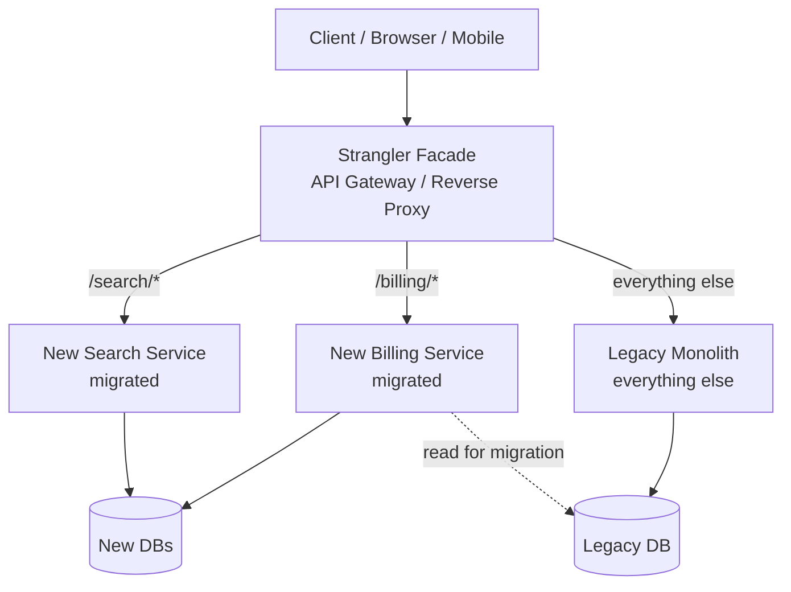
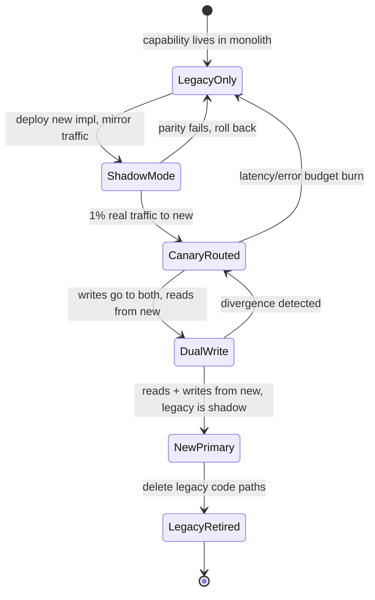
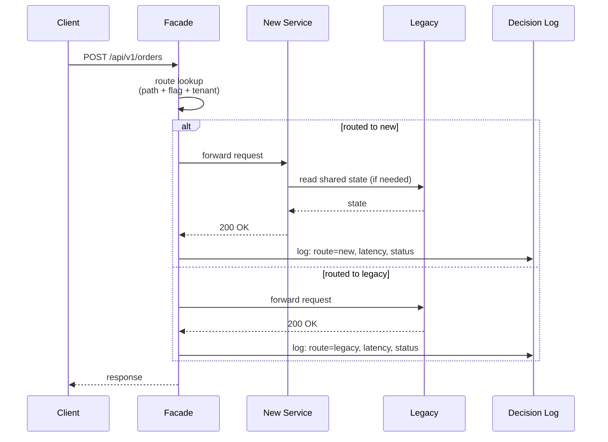
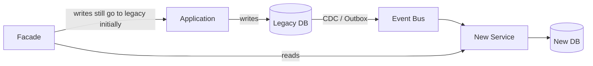

# Strangler Fig Pattern

## Why This Exists

**Problem.** You have a legacy system that is business-critical, poorly understood, and expensive to change. A full rewrite is too risky — it requires a multi-quarter freeze on the legacy system (which the business will never grant), defers value delivery, and historically fails. But leaving it alone is also untenable: every change is fragile, onboarding takes months, and the system blocks new product capabilities.

**Key insight.** You don't need to replace the whole system at once. You can put a **facade** (router, proxy, or API gateway) in front of the legacy system, then migrate **one capability at a time** behind it. Each migrated capability is routed to the new implementation; everything else still hits the legacy. Over time the new system grows around the old one and "strangles" it — exactly like the strangler fig vine that Martin Fowler observed in Australia, which germinates in the canopy of a host tree, sends roots down, and eventually replaces it.

The crucial property: **at every point in the migration, the system is in a working, releasable state.** There is no "big bang" cutover. If a migration step fails, you flip the route back.

**Reach for this when:**
- The legacy system is too risky or too poorly understood for a single-shot rewrite.
- Capabilities are reasonably **decomposable** (you can carve off "billing", "search", "auth" without ripping out a tangled core).
- You can introduce a routing layer (HTTP gateway, RPC interceptor, message router, or even an in-process facade) without unacceptable latency cost.
- The business needs continuous delivery during the migration — no maintenance windows, no feature freezes.
- You're migrating across a technology boundary (mainframe → microservices, monolith → SOA, on-prem → cloud, language X → Y).

**Don't reach for this when:**
- The legacy is **small** (< ~10k LOC, single team) — just rewrite it. Strangler fig has overhead.
- The capabilities are **non-decomposable** (e.g., a tightly-coupled real-time control loop where every component shares mutable state). You need to refactor the monolith first, then strangle.
- You can't afford the **two-system tax** (running both systems in parallel — double infrastructure, double on-call, dual writes). If your team is 3 people, this kills you.
- The legacy is going to be **retired anyway** in <6 months for business reasons. Just freeze it.
- You need to change the **data model fundamentally**. Strangler fig works best when the new system can read/write a compatible model (or you can do dual-writes); a clean-slate data redesign is closer to a rewrite-and-migrate.

## Diagrams

### High-level: facade routing during migration



### Per-capability migration lifecycle



### Request lifecycle through the facade



## Implementing the Facade

The facade is the single most important component. Get it wrong and you've added latency, a SPOF, and a debugging nightmare without delivering the migration.

### Layer-7 HTTP facade (most common)

A reverse proxy (Envoy, Nginx, HAProxy, Kong, AWS API Gateway, or a thin custom service) routes by path, header, or claim. Below is a minimal Go facade showing the shape — production systems use a battle-tested proxy, but understanding the logic matters.

```go
// strangler/facade.go
package strangler

import (
    "context"
    "errors"
    "io"
    "net/http"
    "net/http/httputil"
    "net/url"
    "strings"
    "time"
)

// Route describes how to handle a request path. The facade evaluates routes in order.
type Route struct {
    PathPrefix    string
    Target        *url.URL          // upstream (new or legacy)
    PercentToNew  int               // 0..100; only relevant when both targets exist
    LegacyTarget  *url.URL          // if non-nil, percentage-split between Target and LegacyTarget
    ShadowToNew   bool              // mirror to Target without using its response
    AllowedTenant func(string) bool // per-tenant rollout gate
}

type Facade struct {
    routes      []Route
    defaultURL  *url.URL // legacy fallback for everything not matched
    httpClient  *http.Client
    decisionLog DecisionLogger
}

// ServeHTTP is the heart of the facade. Three things matter:
//   1. The decision is *deterministic and logged* — every request says which side served it.
//   2. Errors fall back to legacy by default — the new system is opt-in until proven.
//   3. Shadow traffic is fire-and-forget; it must NEVER block or fail the live request.
func (f *Facade) ServeHTTP(w http.ResponseWriter, r *http.Request) {
    start := time.Now()
    tenant := r.Header.Get("X-Tenant-ID")

    route, target, side := f.pickRoute(r, tenant)

    if route != nil && route.ShadowToNew && side == "legacy" {
        // Mirror to the new system in the background. We MUST clone the body
        // because http.Request.Body is single-read.
        go f.shadow(r, route.Target)
    }

    proxy := httputil.NewSingleHostReverseProxy(target)
    proxy.ErrorHandler = func(rw http.ResponseWriter, req *http.Request, err error) {
        // Critical: if the new system is unreachable, fall back to legacy.
        // Otherwise the migration becomes a liability — outages in the new
        // system cause user-visible failures during a "transparent" migration.
        if side == "new" && f.defaultURL != nil {
            f.decisionLog.Log(req, "new", "failed_fallback_legacy", err)
            legacyProxy := httputil.NewSingleHostReverseProxy(f.defaultURL)
            legacyProxy.ServeHTTP(rw, req)
            return
        }
        http.Error(rw, "upstream error", http.StatusBadGateway)
    }

    proxy.ServeHTTP(w, r)
    f.decisionLog.Log(r, side, "ok", nil)
    _ = start // emit latency metric per side
}

func (f *Facade) pickRoute(r *http.Request, tenant string) (*Route, *url.URL, string) {
    for i := range f.routes {
        rt := &f.routes[i]
        if !strings.HasPrefix(r.URL.Path, rt.PathPrefix) {
            continue
        }
        if rt.AllowedTenant != nil && !rt.AllowedTenant(tenant) {
            return rt, rt.LegacyTarget, "legacy"
        }
        if rt.LegacyTarget != nil && !shouldRouteToNew(r, rt.PercentToNew) {
            return rt, rt.LegacyTarget, "legacy"
        }
        return rt, rt.Target, "new"
    }
    return nil, f.defaultURL, "legacy"
}

// shouldRouteToNew uses a deterministic hash so a given user/session sticks
// to the same side across requests — otherwise a 50/50 split flickers and
// breaks any state cached on the new side (sessions, idempotency keys, etc.).
func shouldRouteToNew(r *http.Request, pct int) bool {
    if pct >= 100 {
        return true
    }
    if pct <= 0 {
        return false
    }
    key := r.Header.Get("X-Session-ID")
    if key == "" {
        key = r.RemoteAddr
    }
    return fnv32(key)%100 < uint32(pct)
}

func (f *Facade) shadow(orig *http.Request, target *url.URL) {
    // Buffer the body so both the live and shadow requests can read it.
    // In production, cap this to prevent OOM on large uploads.
    body, _ := io.ReadAll(orig.Body)
    ctx, cancel := context.WithTimeout(context.Background(), 2*time.Second)
    defer cancel()

    req, err := http.NewRequestWithContext(ctx, orig.Method, target.String()+orig.URL.Path, strings.NewReader(string(body)))
    if err != nil {
        return
    }
    req.Header = orig.Header.Clone()
    req.Header.Set("X-Shadow", "1") // new service MUST treat shadow as read-only

    resp, err := f.httpClient.Do(req)
    if err != nil {
        return
    }
    defer resp.Body.Close()
    // Compare against legacy response asynchronously, log divergences.
    // DO NOT raise alarms on first divergence — log, sample, build a baseline.
    if errors.Is(err, context.DeadlineExceeded) {
        return
    }
}
```

Key properties to preserve:
- **Stickiness.** A given session/user routes to the same side until you explicitly migrate them. Otherwise idempotency keys, in-memory caches, and session state break.
- **Default to legacy on error.** Until the new system has earned trust, treat any failure as a reason to fall back. Audit this aggressively — a silent fallback that nobody notices is how you discover after a quarter that 30% of "migrated" traffic is still hitting legacy.
- **Decision log.** Every request emits `{path, tenant, decision, latency, status}`. Without this you cannot debug parity issues or compute "what percent is actually migrated".
- **No business logic in the facade.** It picks a route. That's it. The moment you start adding "if request is X, transform field Y" you've created a new monolith inside your facade.

### In-process facade (for libraries / SDKs)

When you can't deploy a network proxy (e.g., migrating an internal library), you do the same thing in code:

```python
# strangler/dispatcher.py
from typing import Protocol, Callable
import logging
import random

log = logging.getLogger(__name__)

class PricingEngine(Protocol):
    def quote(self, sku: str, qty: int, customer_id: str) -> "Quote": ...

class StranglerPricing:
    """In-process strangler facade for the pricing subsystem.

    The legacy engine is the source of truth; the new engine runs in shadow,
    then graduates to canary, then primary. The dispatcher is the *only*
    place that knows which engine is authoritative for a given request.
    """

    def __init__(
        self,
        legacy: PricingEngine,
        new: PricingEngine,
        is_migrated: Callable[[str], bool],   # tenant -> bool
        shadow_sample_rate: float = 0.0,
        on_divergence: Callable | None = None,
    ):
        self._legacy = legacy
        self._new = new
        self._is_migrated = is_migrated
        self._shadow = shadow_sample_rate
        self._on_div = on_divergence

    def quote(self, sku: str, qty: int, customer_id: str) -> "Quote":
        if self._is_migrated(customer_id):
            return self._new.quote(sku, qty, customer_id)

        # Legacy path. Optionally shadow to new and compare.
        result = self._legacy.quote(sku, qty, customer_id)
        if random.random() < self._shadow:
            try:
                shadow_result = self._new.quote(sku, qty, customer_id)
                if shadow_result != result and self._on_div:
                    self._on_div(sku, qty, customer_id, result, shadow_result)
            except Exception as e:
                # Shadow failures must never affect the live request.
                log.warning("shadow pricing failed: %s", e)
        return result
```

## Migration Recipes

### Recipe 1: Branch-by-abstraction inside the monolith

If the legacy code isn't behind a service boundary, you may need to refactor it to one before you can strangle. The standard move is **branch by abstraction** (Jez Humble, Continuous Delivery):

1. Identify the seam — the cluster of functions/classes you want to replace.
2. Extract an interface that all callers use.
3. Wrap the existing implementation behind that interface. **Ship this. Verify nothing broke.**
4. Build the new implementation behind the same interface.
5. Use a feature flag to switch implementations per call-site, per tenant, or per percent.
6. Once the new is at 100% with parity proven, delete the old implementation.

This is strangler fig at the **module** level rather than the service level.

### Recipe 2: Read migration before write migration

Reads are easier to migrate than writes because divergence is observable but not destructive. Pattern:

1. Dual-read: every read query goes to legacy (authoritative) and new (shadow). Compare. Log divergences.
2. Once divergence rate is < acceptable threshold for N weeks, flip primary read to new, legacy becomes shadow.
3. Now start dual-write (see Recipe 3).

### Recipe 3: Dual-write with reconciliation

The hardest part of any strangler migration is **stateful capabilities**. You need to keep both data stores consistent during the migration window.

```python
# Dual-write with async reconciliation.
# WARNING: this is "eventually consistent at best" — you need a reconciler
# job to catch divergences. Do NOT pretend it's strongly consistent.

class DualWriteOrderRepo:
    def __init__(self, legacy, new, recon_queue, mode: str):
        # mode: "legacy_primary" | "new_primary" | "new_only"
        self._legacy, self._new, self._q, self._mode = legacy, new, recon_queue, mode

    def create(self, order):
        if self._mode == "new_only":
            return self._new.create(order)

        primary, secondary = (
            (self._legacy, self._new) if self._mode == "legacy_primary"
            else (self._new, self._legacy)
        )
        result = primary.create(order)  # synchronous, fails the request on error
        try:
            secondary.create(order)
        except Exception:
            # The secondary is allowed to fail — we'll reconcile.
            # But we MUST enqueue a reconciliation task or it diverges silently.
            self._q.enqueue("recon_order", order_id=order.id, primary=primary.name)
        return result
```

Critical points:
- **Pick a primary.** Not "best of both". The primary's write succeeded; you returned 200. The secondary is best-effort + reconciler.
- **Reconciler must exist before you start.** A periodic job that scans both stores, finds divergences, and resolves them by primary-wins (or human-intervention queue).
- **Idempotency keys are mandatory.** Without them, retries on the secondary cause double-writes.
- **Schema must be compatible enough.** If new and legacy data models diverge significantly, the reconciler becomes a translation layer with bugs of its own.

### Recipe 4: Event-carried state transfer

If the legacy emits domain events (or you can add an outbox table), the new system can subscribe and build its own read model without dual-writes from the application:



This is the cleanest pattern when available. Writes stay in legacy; reads move to new; once read parity is proven, you flip writes (which now means having the new service emit events back, or doing dual-writes for the write transition).

## Trade-offs

| Benefit | Cost |
|---|---|
| Continuous delivery throughout migration; no freeze | Two systems to operate, monitor, and on-call (the **two-system tax**) |
| Risk is bounded per capability; rollback is a route flip | Facade adds latency (typically 1–10ms per hop) and a SPOF — must be HA |
| Failures are observable per route via decision log | You must build and maintain dual-read/dual-write infrastructure that gets thrown away |
| Team can learn the new stack incrementally | Engineers context-switch between two codebases for the duration |
| Business value can be delivered during migration (the new system can take new features the legacy can't) | Tempting to stop at "90% migrated" because the last 10% is the hardest — half-finished migrations are forever |
| Each step is reversible until cutover | Data divergence is silent unless you build reconciliation; reconciliation is hard |
| Works across language/platform boundaries | Cross-system transactions become eventual consistency; some workflows need redesign |

## Common Pitfalls

- **No exit criteria.** The migration drifts forever because nobody defined "done". Define from day one: "by date X, legacy module M has 0% traffic and source code is deleted." If you can't commit to that, you're not doing strangler fig — you're doing permanent dual-stack.
- **The 90% trap.** The last 10% is always the gnarliest code (batch jobs, edge cases, that one customer's special workflow). Teams declare victory at 90% and the legacy lives forever, with the two-system tax forever. Budget *more* time for the last 10% than the first 90%.
- **Facade becomes a monolith.** Routing logic creeps in: "if tenant is X and date is Y and feature flag Z, transform field A". Now your facade is the legacy. Push transforms into the new service or into a thin transformation layer with explicit ownership.
- **Silent fallback to legacy.** The facade falls back to legacy on errors but no alarm fires. Three months in you discover the new system has been broken since week two and 40% of "migrated" traffic still hits legacy. **Always alarm on fallback rate**, not just on raw errors.
- **Shadow traffic that affects state.** The new service, while in shadow mode, writes to a shared cache or queue, causing weird behavior in legacy. **Shadow mode must be pure read** — enforced by the new service rejecting `X-Shadow: 1` requests on any write path, or by giving the new service a separate datastore.
- **Dual-write without reconciliation.** Two stores drift. By the time anyone notices, you have weeks of divergence and no idea which is right. Reconcile from day one of dual-write, with alerting on divergence rate.
- **Migrating database schema and code at the same time.** Two big-bang risks at once. Strangle the code first against the legacy schema; migrate schema as a separate, smaller strangler.
- **Skipping shadow / canary because "we have tests".** Production traffic shape is always different from your test fixtures. Shadow mode catches the things you don't know to test.
- **No ownership transfer plan.** The legacy team builds the new system on the side, then "throws it over the wall" to a new team. The new team doesn't know the edge cases the old team's brain holds. Pair across teams during migration; document edge cases as you find them.
- **Routing on stateful headers that legacy doesn't set.** New system requires `X-Tenant-ID` but legacy clients don't send it. Result: random misroutes. Audit headers and add a normalization layer in the facade *before* migrating.
- **No load test of the facade.** Adding a hop changes the latency profile and connection pool dynamics. p99 latency spikes appear in production that didn't show in pre-prod. Load-test the facade with realistic traffic shapes before turning on real routing.
- **Strangling a system that's about to be retired anyway.** Burning a year of engineering on strangling something the business will sunset in 9 months. Confirm the destination, not just the desire to leave.

## Decision Table

| Situation | Use this | Use instead |
|---|---|---|
| Legacy is large (>100k LOC), business-critical, tangled, ongoing changes needed | **Strangler Fig** | — |
| Legacy is small (<10k LOC) and a single team owns it | Direct rewrite + cutover with feature flags | Strangler Fig (overhead too high) |
| Need to replace a single library/module inside an app | **Branch by Abstraction** (in-process strangler) | Network-level strangler facade |
| Capabilities are tightly coupled and can't be sliced | Refactor monolith first (extract seams), then strangle | Direct strangler (will fail at the seams) |
| Migrating data store but keeping app code | Dual-write / CDC-based migration | Strangler Fig (which is for code, not just data) |
| Migrating from one cloud / region to another, code unchanged | Blue/green or active-active migration | Strangler Fig (no need for facade routing logic) |
| Legacy will be retired in <6 months for business reasons | Freeze legacy, defer migration | Strangler Fig (won't finish before sunset) |
| You need a clean-slate data model and clean-slate code | Parallel build + bulk migration + cutover (with shadow) | Strangler Fig with dual-write (translation cost is too high) |
| Replacing one bounded context inside a microservice mesh | **Strangler Fig** at the API gateway level | Big-bang service replacement |
| Replacing a tightly-coupled real-time control system (trading, robotics) | Shadow + statistical parity + scheduled cutover | Strangler Fig with live traffic split (jitter unacceptable) |
| Migration would require dual-write across systems with strong consistency requirements | Reconsider; may need outage window or saga-based redesign first | Naive dual-write strangler (will diverge) |

## References

- Martin Fowler — *StranglerFigApplication* (the original framing) — https://martinfowler.com/bliki/StranglerFigApplication.html
- Martin Fowler — *Branch By Abstraction* — https://martinfowler.com/bliki/BranchByAbstraction.html
- Paul Hammant — *Branch by Abstraction* (canonical write-up) — https://paulhammant.com/blog/branch_by_abstraction.html
- Microsoft Azure Architecture Center — *Strangler Fig pattern* — https://learn.microsoft.com/en-us/azure/architecture/patterns/strangler-fig
- AWS Prescriptive Guidance — *Strangler fig pattern* — https://docs.aws.amazon.com/prescriptive-guidance/latest/cloud-design-patterns/strangler-fig.html
- AWS Builders' Library — *Avoiding fallback in distributed systems* (relevant to facade fallback alarming) — https://aws.amazon.com/builders-library/avoiding-fallback-in-distributed-systems/
- Sam Newman — *Monolith to Microservices* (O'Reilly, 2019), ch. 3 "Splitting the Monolith" and ch. 4 "Decomposing the Database" — strangler is the spine of this book.
- Sam Newman — *Building Microservices*, 2nd ed (O'Reilly, 2021), ch. 3 — splitting the monolith.
- Jez Humble & David Farley — *Continuous Delivery* (Addison-Wesley, 2010), ch. on "Managing Components and Dependencies" — branch by abstraction.
- Kleppmann — *Designing Data-Intensive Applications* (O'Reilly, 2017), ch. 4 "Encoding and Evolution" (schema compatibility during migration), ch. 11 "Stream Processing" (CDC for event-carried state transfer).
- Google SRE Book — ch. 27 *Reliable Product Launches at Scale* — https://sre.google/sre-book/reliable-product-launches/ (rollout, canary, rollback discipline applies directly).
- Google SRE Workbook — ch. 16 *Canarying Releases* — https://sre.google/workbook/canarying-releases/
- ThoughtWorks — *Strangler Fig Application* (Tech Radar / engineering blog references the pattern across many client engagements).
- Shopify Engineering — *Deconstructing the Monolith* — https://shopify.engineering/deconstructing-monolith-designing-software-maximizes-developer-productivity (a real-world strangler at scale).
- GitHub Engineering — *Move Fast and Fix Things* / Scientist library (for shadow-comparison testing) — https://github.com/github/scientist
- Stripe Engineering — *Online migrations at scale* — https://stripe.com/blog/online-migrations (dual-write + backfill + reconcile playbook).

## See Also

- `../../communication/api-gateway/` — the typical home for the strangler facade in a service architecture.
- `../bff/` — Backend-for-Frontend can serve as a strangler facade per client.
- `../service-mesh/` — when the facade is implemented at the mesh layer (Envoy, Istio).
- `../../data-systems/cdc/` — CDC for event-carried state transfer (Recipe 4).
- `../../data-systems/outbox/` — reliable event emission from legacy during migration.
- `../event-driven/` — when the new side is event-driven and the legacy is request/response.
- `../microservices/` — common destination architecture for monolith strangling.
- `../modular-monolith/` — sometimes the right destination instead of microservices; strangle into modules first.
- `../hexagonal/` — using ports/adapters to make seams strangleable in-process.
- `../../reliability/circuit-breaker/` — protect the facade from a flaky new service.
- `../../performance/tracing/` — essential to debug requests crossing the facade.
