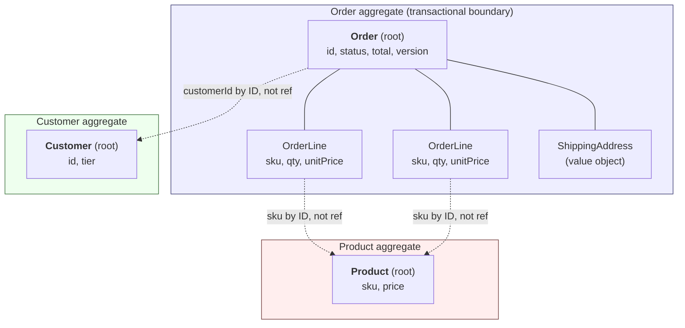
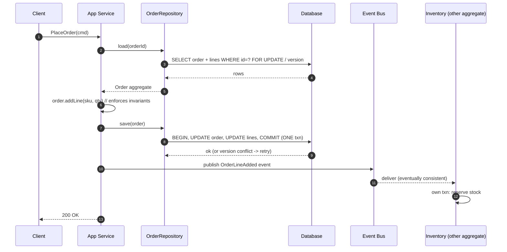

# Aggregates and Entities

## Why This Exists

**Problem.** Business rules ("an order's total must equal the sum of its lines", "a user cannot withdraw past their balance", "a sprint cannot contain more than 20 stories") have to hold *somewhere*. If you spread the data those rules touch across many independently-saved objects, two concurrent writers will violate them — silently. Pessimistic locking the whole graph kills throughput; optimistic locking everything causes constant retries; "just use a transaction" stops scaling the moment your DB shards.

**Key insight (Eric Evans, Vaughn Vernon).** Pick a small cluster of entities + value objects that must change atomically together. Wrap them behind a single root entity. Make the root the *only* externally-referenceable object. Save the whole cluster in one transaction. Reference *other* clusters by ID, never by pointer. This is the **aggregate**, and the root is the **aggregate root**. The boundary is drawn by **invariants**, not by UML containment, not by the database schema, not by what feels "natural" to a CRUD screen.

**Reach for this when:**
- You have a transactional consistency requirement that crosses two or more entities ("must sum to", "cannot exceed", "exactly one of").
- Concurrent writers on the same business object are corrupting state (lost updates, ghost rows, partial saves).
- Your domain model has become one giant graph where loading any object pulls thousands of rows.
- You're designing for eventual consistency between bounded contexts and need to know which writes are "one transaction" and which can lag.
- You're using event sourcing — aggregates are the natural event-stream unit.

**Don't reach for this when:**
- The system is genuinely CRUD with no multi-entity invariants. A flat row with optimistic concurrency (a `version` column) is fine. Aggregates add ceremony you don't need.
- The "aggregate" you're sketching contains millions of children (a `Customer` aggregate that owns every `Order` they've ever placed). That's not an aggregate — that's a query.
- You're modelling read paths. Aggregates exist for *commands*. Read models (CQRS query side) should be denormalised projections, not loaded aggregates. See `../../architecture-patterns/event-sourcing/`.
- You have one entity, no invariants beyond field validation. You don't need a root.

## Diagrams

The aggregate boundary, drawn the way Vernon recommends — small root, value objects inside, other aggregates referenced by ID only.



The transactional rule: one command, one aggregate, one transaction. Cross-aggregate effects propagate via domain events and eventual consistency.



## Vernon's Four Rules of Effective Aggregate Design

From Vaughn Vernon's *Effective Aggregate Design* (IDDD, 2011 — three-part essay, free PDFs at `dddcommunity.org`). These are the hardest-won lessons in the DDD literature. Internalise them.

1. **Model true invariants in consistency boundaries.** Only the data needed to enforce a *real* business rule belongs inside the aggregate. "We always show them together on the screen" is not an invariant. "The sum of allocations must equal the budget" is.
2. **Design small aggregates.** Prefer a root + a few value objects. If you find yourself loading collections of hundreds of children, your boundary is wrong. Small aggregates = less contention, faster loads, smaller transactions, fewer merge conflicts in event-sourced systems.
3. **Reference other aggregates by identity.** Never hold a direct object pointer (`order.customer.tier`). Hold the ID (`order.customerId`) and look up the other aggregate via its repository if you must. This is the rule that *actually* keeps aggregates small — the moment you allow direct refs, lazy-loading turns your aggregate into the whole DB.
4. **Use eventual consistency outside the boundary.** If a single user request must change state in two aggregates, do it in two transactions, glued by a domain event (or a saga / process manager). One transaction = one aggregate. If two aggregates *must* be consistent atomically, they're really one aggregate — merge them.

If you take only one rule from this skill, take rule #3. It is the rule most teams violate, and the one whose violation is most expensive.

## Identifying Aggregates From Invariants (the procedure)

Don't start from the ER diagram. Start from the invariants.

1. **List the business rules** that must be true the instant a transaction commits. Phrase each as "X must equal/cannot exceed/is exactly one of Y". Not validation rules ("email must be non-empty") — those are entity-local. Cross-entity rules.
2. **Group rules by the data they touch.** Rules that touch the same set of entities form a candidate aggregate. Rules that touch disjoint sets become separate aggregates.
3. **Pick the root** of each group: the entity through which all external references must flow. Usually the entity that "owns the lifecycle" (when it's deleted, the children are deleted).
4. **Strip out anything not needed for an invariant.** If `Order` doesn't need to know the customer's address-book to enforce "total ≤ credit-limit", the address-book is *not* in the Order aggregate. The customer's *current credit limit* might still need to be enforced — but consider whether it can be eventually consistent (snapshot it onto the order on placement, reconcile via event).
5. **Check size.** If your aggregate has unbounded collections, you've drawn it wrong. The single most common mistake is `Customer { List<Order> orders }` — *every* customer with 10 years of order history loads as one object. Reverse it: `Order` has `customerId`. Customer aggregate stays tiny.
6. **Stress-test concurrent commands.** For every command on the aggregate, ask: "If two users issue this concurrently, what's the right answer?" If the answer is "they should both succeed and the rule should still hold", you need locking/versioning *within* this aggregate. If the answer is "they should be serialised", optimistic locking on the root version is sufficient.

## Code: a worked example (Python, type-hinted)

A `SprintBacklog` aggregate. Invariant: total story points ≤ team capacity. The aggregate enforces this. Notice: stories are referenced by ID from outside; only the root is exposed; persistence is one transaction.

```python
# domain/sprint_backlog.py
from __future__ import annotations
from dataclasses import dataclass, field
from typing import Iterable
from uuid import UUID, uuid4


@dataclass(frozen=True)
class StoryRef:
    """Value object: lightweight reference to a Story (which is its OWN aggregate).
    We deliberately do NOT hold a Story object — only the id and the
    snapshot of point cost we committed to when adding it."""
    story_id: UUID
    points: int


class CapacityExceeded(Exception):
    pass


class SprintAlreadyClosed(Exception):
    pass


@dataclass
class SprintBacklog:
    """Aggregate root.

    Invariant: sum(stories.points) <= capacity_points whenever closed_at is None.
    Concurrency: optimistic — `version` is bumped on every state-changing command.
    """
    id: UUID
    team_id: UUID            # reference to Team aggregate by ID, not pointer
    capacity_points: int
    stories: list[StoryRef] = field(default_factory=list)
    closed_at: float | None = None
    version: int = 0

    # ---- factory ----------------------------------------------------------
    @classmethod
    def open(cls, team_id: UUID, capacity_points: int) -> "SprintBacklog":
        if capacity_points <= 0:
            raise ValueError("capacity must be positive")
        return cls(id=uuid4(), team_id=team_id, capacity_points=capacity_points)

    # ---- commands (the only mutators) -------------------------------------
    def add_story(self, story_id: UUID, points: int) -> None:
        self._guard_open()
        # Invariant check happens BEFORE mutation. If it fails, aggregate
        # state is unchanged and the caller sees an exception, not a corrupt
        # half-applied state.
        new_total = self._total_points() + points
        if new_total > self.capacity_points:
            raise CapacityExceeded(
                f"adding {points} would exceed capacity "
                f"({new_total} > {self.capacity_points})"
            )
        if any(s.story_id == story_id for s in self.stories):
            return  # idempotent — see Pitfalls
        self.stories.append(StoryRef(story_id, points))
        self.version += 1

    def remove_story(self, story_id: UUID) -> None:
        self._guard_open()
        before = len(self.stories)
        self.stories = [s for s in self.stories if s.story_id != story_id]
        if len(self.stories) != before:
            self.version += 1

    def close(self) -> None:
        self._guard_open()
        # No invariant on close beyond "not already closed". Closing
        # publishes a domain event the rest of the system reacts to —
        # but that event handling is OUT of this transaction.
        import time
        self.closed_at = time.time()
        self.version += 1

    # ---- queries (no mutation) --------------------------------------------
    def remaining_capacity(self) -> int:
        return self.capacity_points - self._total_points()

    # ---- internals --------------------------------------------------------
    def _total_points(self) -> int:
        return sum(s.points for s in self.stories)

    def _guard_open(self) -> None:
        if self.closed_at is not None:
            raise SprintAlreadyClosed(self.id.hex)
```

A repository that persists the *whole* aggregate in one transaction with an optimistic version check. Note: there is **no** save-the-children, save-the-root, save-the-children-again dance. One commit.

```python
# infrastructure/sprint_backlog_repo.py
import json
from uuid import UUID
from psycopg import Connection
from domain.sprint_backlog import SprintBacklog, StoryRef


class StaleAggregate(Exception):
    """Optimistic lock failed: someone else committed first. Retry."""


class SprintBacklogRepository:
    """One aggregate <-> one row (or one document). Keep it simple."""

    def __init__(self, conn: Connection) -> None:
        self.conn = conn

    def get(self, sprint_id: UUID) -> SprintBacklog:
        with self.conn.cursor() as cur:
            cur.execute(
                "SELECT team_id, capacity_points, stories, closed_at, version "
                "FROM sprint_backlog WHERE id = %s",
                (str(sprint_id),),
            )
            row = cur.fetchone()
        if row is None:
            raise KeyError(sprint_id)
        team_id, cap, stories_json, closed_at, version = row
        return SprintBacklog(
            id=sprint_id,
            team_id=UUID(team_id),
            capacity_points=cap,
            stories=[StoryRef(UUID(s["id"]), s["pts"]) for s in stories_json],
            closed_at=closed_at,
            version=version,
        )

    def save(self, agg: SprintBacklog) -> None:
        # Single statement, single transaction. The WHERE version=expected
        # clause is what makes concurrency safe — if someone else bumped
        # the row, our UPDATE affects 0 rows and we raise.
        expected_version = agg.version - 1  # version was incremented by command
        payload = json.dumps(
            [{"id": str(s.story_id), "pts": s.points} for s in agg.stories]
        )
        with self.conn.transaction(), self.conn.cursor() as cur:
            cur.execute(
                """
                INSERT INTO sprint_backlog (id, team_id, capacity_points,
                                            stories, closed_at, version)
                VALUES (%s, %s, %s, %s::jsonb, %s, %s)
                ON CONFLICT (id) DO UPDATE
                SET capacity_points = EXCLUDED.capacity_points,
                    stories         = EXCLUDED.stories,
                    closed_at       = EXCLUDED.closed_at,
                    version         = EXCLUDED.version
                WHERE sprint_backlog.version = %s
                """,
                (str(agg.id), str(agg.team_id), agg.capacity_points,
                 payload, agg.closed_at, agg.version, expected_version),
            )
            if cur.rowcount == 0 and expected_version >= 0:
                raise StaleAggregate(agg.id)
```

The application service: load → command → save. No business logic here. Cross-aggregate work happens *after* the transaction, via events.

```python
# application/add_story_to_sprint.py
from uuid import UUID
from infrastructure.sprint_backlog_repo import SprintBacklogRepository, StaleAggregate
from infrastructure.event_bus import EventBus


def add_story_to_sprint(
    repo: SprintBacklogRepository,
    bus: EventBus,
    sprint_id: UUID,
    story_id: UUID,
    points: int,
    *,
    max_retries: int = 3,
) -> None:
    for attempt in range(max_retries):
        sprint = repo.get(sprint_id)
        sprint.add_story(story_id, points)   # may raise CapacityExceeded
        try:
            repo.save(sprint)
        except StaleAggregate:
            if attempt == max_retries - 1:
                raise
            continue                          # someone else committed; reload & retry
        # Transaction committed. NOW we publish — but be aware of the
        # dual-write problem; in production use the outbox pattern.
        # See ../../data-systems/outbox/.
        bus.publish("sprint.story_added", {
            "sprint_id": str(sprint_id),
            "story_id": str(story_id),
            "points": points,
        })
        return
```

## Persistence patterns

Three serialisation choices, each with consequences.

**1. Single document / single row with JSON column.** Simplest. The whole aggregate is one row. Atomic by construction. Great for small aggregates (the rule!). Trade-off: if you ever need to query "all sprints containing story X", you're scanning JSON. That's fine — that's a *read model*, not the aggregate's job.

**2. Root row + child rows in one transaction.** Classical relational. Aggregate root → table A; children → table B with FK. Save path is `BEGIN; UPDATE A SET version=v+1 WHERE id=? AND version=v; DELETE FROM B WHERE root=?; INSERT INTO B ...; COMMIT`. The version check on the *root* is what gives optimistic concurrency for the whole aggregate. Children are not independently versioned — they're *part of* the root.

**3. Event-sourced.** The aggregate state is rebuilt by replaying events. Save path appends N events to the stream with `ExpectedVersion = lastSeenVersion`. The stream is the consistency boundary. This is the *cleanest* mapping to Vernon's rules — the stream is literally the aggregate. See `../../architecture-patterns/event-sourcing/`.

What you must **not** do:
- Save the root in one txn, the children in another. Crash window = corrupt aggregate.
- Save the children individually through their own repositories. They aren't aggregates. They have no repository.
- Lazy-load children on access. The aggregate is a *whole*. Load it whole or you can't enforce invariants.

## Size guidance (concrete numbers)

Vernon, after observing many failed designs, gives ranges. These aren't laws but they're calibrating signals.

- **Typical aggregate:** root + a handful of value objects + 0–10 entities.
- **If you have > ~100 child entities** in a single aggregate, you've almost certainly drawn the boundary wrong. The fix is usually: pull the children out into their own aggregate, refer to them by ID, and use a domain event for cross-aggregate coordination.
- **If load + save takes > 50 ms** for a non-trivial fraction of operations, your aggregate is too big.
- **If your transaction holds locks for > 100 ms** at the median, your aggregate is too big *or* your transaction is doing non-aggregate work.
- **Rule of thumb:** the aggregate should fit comfortably in your head and on one screen. If you're scrolling through child types in your IDE, split it.

## Trade-offs

| Benefit | Cost |
|---|---|
| Hard transactional consistency for invariants | Eventual consistency between aggregates — your UX must tolerate "I added a story; inventory hasn't updated yet" |
| Small load/save units, low lock duration, high throughput | More aggregates = more event/saga plumbing for cross-cutting workflows |
| Concurrency contained to a single root row's version | Every cross-aggregate operation needs a saga / process manager / outbox |
| Clear ownership: "this rule lives here" | Reads that span aggregates need a separate read model (CQRS); a single SQL JOIN won't do |
| Maps cleanly to event streams (ES) and to NoSQL document stores | Wrong boundaries are *very* expensive to undo — re-drawing aggregates means migrating data, events, APIs |
| Forces explicit naming of business rules (you cannot sneak invariants in if there's no place to put them) | Real ceremony: roots, repositories, factories, value objects, application services. CRUD apps don't need this |
| Reference-by-ID prevents the "load the whole DB" problem | Reference-by-ID means more lookups per operation; optimise with snapshots/projections, not lazy-loading |

## Common Pitfalls

- **The "Customer owns all their Orders" mistake.** The classic. `Customer.orders : List<Order>`. After a year of business, loading any customer pulls ten thousand rows. Cure: `Order` references `customerId`. There is no `customer.orders` collection on the aggregate.
- **Transactional Saga.** Doing two aggregates' work in one transaction "to keep things simple". Works on day one. Day 100, you split the database, and now you need a distributed 2PC, which you can't have, so you wrap everything in a giant lock, which doesn't scale, so you "fix it" by removing the consistency check — silently corrupting data. Cure: from day one, two aggregates = two transactions, glued by an event.
- **Loading too much "just in case".** "I might need the customer's tier." Don't. Pass it in as a command parameter, or snapshot it onto the aggregate at creation. The aggregate is a consistency boundary, not a query convenience.
- **Anaemic root, fat services.** All the logic is in `OrderService.addLine(order, sku, qty)`, and `Order` is just a bag of fields. The aggregate's whole job is to *encapsulate* invariants. If services manipulate fields directly, anyone can violate them. Cure: make fields private, expose commands, enforce rules inside the root.
- **Forgetting idempotency.** Network retries deliver the same command twice. If `addStory` isn't idempotent on `(sprintId, storyId)`, you double-book. Cure: check membership before append, or use a command/dedup key.
- **Optimistic locking without retry.** Concurrency fails should retry the load+command, not bubble 409 to the user every time. Bound the retries (3 is typical).
- **Versioning children individually.** "OrderLine has a `version` column too." No. The *root* has the version. Children are part of the aggregate. Independent versioning of children means independent concurrency, which means the root invariant is no longer protected.
- **Repository per entity.** `OrderRepository`, `OrderLineRepository`, `OrderShipmentRepository`. Wrong. One repository per aggregate root. Children are loaded and saved through the root.
- **Cross-aggregate FK with CASCADE.** Don't model cross-aggregate references as DB foreign keys with cascade-delete — that couples lifecycles you said were independent. References are by ID, integrity is enforced at the domain layer (or, for true referential integrity, at the read-model layer).
- **Aggregate as DTO.** Returning the aggregate object over the wire so the UI can render it. Now the UI is coupled to your write model. Cure: return a DTO from the read model. Aggregates are write-side.

## Decision Table

| Situation | Use this | Don't use |
|---|---|---|
| Two entities must satisfy an arithmetic invariant (`sum`, `<=`, `=`) at all times | One aggregate, one transaction | Two aggregates with cross-checks |
| Two entities are "related" but no cross-entity invariant | Two aggregates, ID reference | One big aggregate |
| Real-time read of "sum of all child orders for a customer" | Read model / projection (CQRS) | Loading Customer aggregate with all orders |
| Operation must change A then B, both must succeed | Saga / process manager + domain events | Single distributed transaction |
| Concurrent commands on the same business object | Optimistic locking on root version | Pessimistic lock on whole graph |
| Aggregate has hundreds of children that grow unboundedly | Split: children become their own aggregate | "It'll be fine, we'll paginate" |
| The "aggregate" is just a row of fields with no invariants | Skip aggregate ceremony — use Active Record / CRUD | Force the pattern anyway |
| Event-sourced system | Stream-per-aggregate, expectedVersion on append | One global stream |
| Cross-aggregate consistency is genuinely required (e.g. legal) | Reconsider the boundary — they may be one aggregate | Distributed 2PC across services |
| You're modelling a "process" (multi-step, long-running) | Process manager / saga, *not* an aggregate | A giant aggregate with `state` field for every step |

## References

- Vaughn Vernon — *Effective Aggregate Design* (3-part essay, the canonical text on this topic) — https://www.dddcommunity.org/library/vernon_2011/
- Vaughn Vernon — *Implementing Domain-Driven Design* (Addison-Wesley, 2013), chapter 10 "Aggregates".
- Eric Evans — *Domain-Driven Design: Tackling Complexity in the Heart of Software* (Addison-Wesley, 2003), chapter 6 "The Life Cycle of a Domain Object" (introduces aggregates).
- Eric Evans — *Domain-Driven Design Reference* (free PDF, 2015) — https://www.domainlanguage.com/wp-content/uploads/2016/05/DDD_Reference_2015-03.pdf
- Martin Fowler — "DDD_Aggregate" — https://martinfowler.com/bliki/DDD_Aggregate.html
- Martin Fowler — *Patterns of Enterprise Application Architecture* (Addison-Wesley, 2002) — Unit of Work, Identity Map, Optimistic Offline Lock.
- Pat Helland — *Life Beyond Distributed Transactions: An Apostate's Opinion* (CIDR 2007 / ACM Queue 2017) — argues for entity-per-transaction at scale — https://queue.acm.org/detail.cfm?id=3025012
- Greg Young — *CQRS Documents* (2010) — https://cqrs.files.wordpress.com/2010/11/cqrs_documents.pdf
- Kleppmann — *Designing Data-Intensive Applications* (O'Reilly 2017), ch. 7 "Transactions" and ch. 9 "Consistency and Consensus" — for the consistency-boundary theory underneath aggregates.
- Microsoft — *.NET Microservices: Architecture for Containerized .NET Applications* — "Designing a microservice domain model" — https://learn.microsoft.com/en-us/dotnet/architecture/microservices/microservice-ddd-cqrs-patterns/ddd-oriented-microservice
- AWS Builders' Library — *Avoiding insurmountable queue backlogs* (relevant to event-driven cross-aggregate flows) — https://aws.amazon.com/builders-library/avoiding-insurmountable-queue-backlogs/
- Udi Dahan — *Don't Delete — Just Don't* and *Clarified CQRS* — https://udidahan.com/2009/09/01/dont-delete-just-dont/

## See Also

- `../../architecture-patterns/event-sourcing/` — event streams as the natural aggregate persistence
- `../../architecture-patterns/hexagonal/` — where aggregates fit relative to ports and adapters
