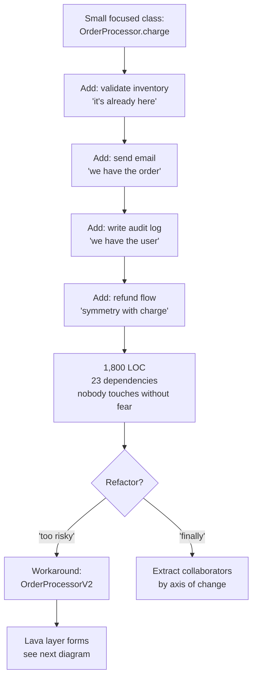
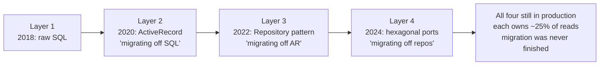
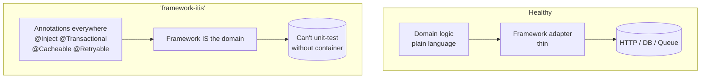

# Anti-Patterns

## Why This Exists

**Problem.** Bad code rarely arrives as a single bad decision. It arrives as a *shape* — a recurring structural failure mode that any team, in any language, on any stack, will reinvent if they don't have a name for it. Without names, you argue case-by-case forever. With names, "this is a God object" ends the argument and starts the refactor.

**Key insight.** Anti-patterns are not "bad code". They are *plausible local optima* that become global pessima. Every anti-pattern was, at the moment it was written, the path of least resistance. The God object grew because adding a method to `OrderManager` was cheaper than creating `OrderPricingPolicy`. The anemic domain was easy because anemic objects map cleanly to ORM rows. The golden hammer wins because the team already knows it. **You don't fight anti-patterns by being smarter; you fight them by making the right thing locally cheaper than the wrong thing.**

**Reach for this when:**
- Code review keeps surfacing the same complaint ("this class does too much", "why is this logic in the controller?")
- A small change cascades — one feature flag turns into seven, one bug fix breaks three tests in unrelated modules
- New hires take weeks to find where a feature actually lives, or which of five `User` classes is "the real one"
- A module has been "almost migrated" to the new pattern for 18 months and nobody can finish
- You catch yourself writing `if/else` chains on a "type" string field
- You're about to introduce a base class with one subclass "for future flexibility"

**Don't reach for this when:**
- You haven't actually read the code and measured the pain. Pattern-matching from a label ("smells like a God object") without reading the call sites produces worse refactors than leaving the mess alone.
- The code is being deleted next quarter. Anti-patterns in throwaway code are not anti-patterns; they are appropriate to lifetime.
- You're optimizing for a hypothetical reader. **Write for the reader you have, not the reader you imagine.**

## Diagrams

### The lifecycle of a God object


### How a lava layer forms


### Framework-itis: who owns the domain?


## The Anti-Patterns

### 1. God object (a.k.a. "blob class", "kitchen sink")

**Shape.** One class accumulates responsibilities until it owns the world. Symptoms: 1,000+ LOC, 15+ public methods, 10+ collaborators, every PR touches it, mocking it in tests requires a paragraph of setup.

**Why it happens.** Every individual addition is rational. The class already has the user, the order, the DB session — adding "one more thing" is locally cheap. The cost is paid by the *next* engineer.

**Detection.**
- Lines per file: anything over ~500 in a typed language deserves a look.
- Fan-in: how many other modules import this class? `grep -r "import OrderManager" | wc -l` — if it's >30, it's load-bearing.
- Methods per class. Over ~20 public methods is a strong signal.
- Co-change: pull `git log --pretty=format: --name-only | sort | uniq -c | sort -rn`. The file at the top of every commit is your God object.
- Test setup: if mocks require >10 lines of boilerplate per test, the class has too many collaborators.

```python
# Smell — God object. Every responsibility lives here.
class OrderManager:
    def __init__(self, db, mailer, payments, inventory, audit, cache, metrics, ...):
        # 9 collaborators is a tell
        ...

    def place_order(self, user_id, items): ...      # orchestration
    def charge(self, order): ...                     # payments
    def refund(self, order): ...                     # payments
    def send_confirmation(self, order): ...          # notifications
    def send_shipment_email(self, order): ...        # notifications
    def reserve_inventory(self, items): ...          # inventory
    def release_inventory(self, items): ...          # inventory
    def audit(self, action, order): ...              # compliance
    def calculate_tax(self, order, address): ...     # pricing
    def calculate_discount(self, order, user): ...   # pricing
    def is_eligible_for_promo(self, user): ...       # marketing rules
    # ... 17 more methods
```

**Refactor: extract by axis of change.** The right cleavage is *what changes together*. If pricing rules change every sprint and shipping rules change once a year, they belong in different classes. Use Fowler's "Extract Class" with a clear invariant per class.

```python
# After: collaborators each own one axis of change.
class OrderPricing:
    def calculate_total(self, order, user, address) -> Money: ...

class OrderPayments:
    def charge(self, order: Order, total: Money) -> ChargeResult: ...
    def refund(self, charge: ChargeResult, amount: Money) -> RefundResult: ...

class OrderInventory:
    def reserve(self, items): ...
    def release(self, items): ...

class OrderNotifications:
    def confirm(self, order): ...
    def shipped(self, order): ...

# The orchestrator is now thin. It coordinates; it does not compute.
class PlaceOrder:
    def __init__(self, pricing, payments, inventory, notifications, audit):
        ...
    def __call__(self, user, items) -> Order:
        order = Order.draft(user, items)
        total = self.pricing.calculate_total(order, user, user.address)
        self.inventory.reserve(items)
        try:
            charge = self.payments.charge(order, total)
        except PaymentError:
            self.inventory.release(items); raise
        self.notifications.confirm(order)
        self.audit.record("order.placed", order)
        return order.confirm(charge)
```

The orchestrator can grow long without becoming a God object — it has *one* responsibility (sequencing) and zero domain logic.

### 2. Anemic domain model

**Shape.** Domain "objects" are bags of getters and setters with no behavior. All logic lives in `*Service` classes that pass these bags around. The objects know nothing about their own invariants. The `Order` class doesn't know how to total itself; `OrderService.calculateTotal(order)` does.

**Why it happens.** ORM-driven design (Hibernate/ActiveRecord/Django ORM) makes data classes the path of least resistance. Service layers feel "clean" because they look like procedures. Tutorials reinforce this: `Controller → Service → Repository → Entity`.

**Why it's a problem.** Invariants are not enforced. Anyone can call `order.setStatus(SHIPPED)` without checking that the order was paid. State machines are scattered across services. Any bug fix requires hunting through every service that touches the entity.

```java
// Smell — anemic.
public class Order {
    private OrderStatus status;
    private List<OrderLine> lines;
    private Money total;
    // 30 getters and setters
    public OrderStatus getStatus() { return status; }
    public void setStatus(OrderStatus s) { this.status = s; }   // unguarded
    // ...
}

public class OrderService {
    public void ship(Order o) {
        if (o.getStatus() != OrderStatus.PAID)               // logic outside the model
            throw new IllegalStateException();
        o.setStatus(OrderStatus.SHIPPED);                    // anyone can bypass this
        // ...
    }
    public Money calculateTotal(Order o) { /* logic */ }     // belongs on Order
}
```

```java
// After — behavior lives with the data.
public final class Order {
    private OrderStatus status;
    private final List<OrderLine> lines;

    public Money total() {                                   // pure, on the entity
        return lines.stream().map(OrderLine::subtotal)
                   .reduce(Money.ZERO, Money::plus);
    }

    public Order ship() {                                    // state transition guarded
        if (status != OrderStatus.PAID)
            throw new IllegalOrderTransition(status, "ship");
        return new Order(/* ... */ OrderStatus.SHIPPED, lines);
    }
}
// Services orchestrate; the Order owns its rules.
```

**When anemic is fine.** DTOs at the network boundary. Read-models for queries. Database row mappers. The anti-pattern is anemic *in the domain*, not anemic at the edges.

### 3. Lava layer (a.k.a. "geological strata")

**Shape.** Multiple incompatible architectural styles coexist in one codebase, each from a different "we're modernizing" era, none ever finished. New code is written in whichever style the author last saw. Junior engineers ask "which pattern do we use?" and the honest answer is "all of them, sorry".

**Detection.** Count distinct ways your code does the same thing:
- DB access: raw SQL? ORM? Repository pattern? CQRS read-side?
- HTTP: Flask? FastAPI? gRPC? GraphQL?
- DI: constructor? service locator? annotations? globals?
- Errors: exceptions? Result types? sentinels? `(value, err)`?

If the answer to any of these is "yes, more than two of those, in production right now", you have a lava layer.

**Why it happens.** Migrations are never resourced to completion. The 80/20 rule: the team migrated the easy 80% and declared victory. The remaining 20% — the legacy revenue path, the integration with the dying vendor, the part nobody understands — never gets migrated, because nobody wants to touch it.

**Refactor.**
- **Stop the bleeding first.** Pick one style for *new* code. Block the others in lint/CI. This alone halts further accretion.
- **Strangler fig pattern** (Fowler). Wrap old behavior with new interfaces. Migrate one call site at a time. Critically: **commit to a deadline for layer removal**. Without a deadline, the strangler fig becomes another permanent layer.
- **Boundary first, internals later.** Define the new abstraction's *interface* and stabilize it before moving callers. Otherwise callers migrate to a target that keeps moving and you've created a fifth layer.

```yaml
# Concrete: codify the migration in CI so the lava cools.
# .lava-policy.yaml
allowed_for_new_code:
  - http: fastapi
  - db: sqlalchemy_2_orm
forbidden_for_new_code:
  - http: flask          # legacy, surviving routes only
  - db: raw_sql          # except in db/migrations/
  - db: sqlalchemy_1_legacy
exceptions:
  - path: src/legacy/billing/**
    until: 2026-12-31    # if this date passes, CI fails
```

### 4. Golden hammer

**Shape.** "When all you have is a hammer, everything looks like a nail." A team applies one tool/pattern/framework regardless of fit. Common forms:
- "We use Kafka for everything" (including a 10 RPS internal config-fetch)
- "Microservices for the new feature" (a feature that's three CRUD endpoints)
- "GraphQL on every internal API" (where two services with one consumer each would do REST in 1/10 the code)
- "We're a Rails shop" (so the data pipeline is Rake tasks)

**Why it happens.** Tool familiarity is real and valuable — switching costs are not zero. Hiring around a stack reinforces it. *Resume-driven development* is real too, but blame is misplaced: the deeper cause is **the cost of evaluating alternatives is high and the cost of misuse is paid by future-you**.

**Detection.** Ask: "If we were starting today, would we choose this tool for *this* problem?" If the honest answer is no for >2 of the last 5 components built, you have a golden hammer.

**Refactor.** Don't rip out the hammer; widen the toolbox.
- For each new component, write a one-page *technology decision record* (ADR) that names at least two alternatives and why they were rejected. The act of having to write the alternatives kills 80% of golden hammers.
- Set a budget: "We'll use Kafka where throughput is >X msg/s and we need replay; below that, SQS or a DB queue."

### 5. Premature abstraction

**Shape.** A base class with one subclass. A `Strategy` interface with one implementation. A "plugin system" with one plugin. Generics where types are concrete. Configuration knobs nobody turns. *"For future flexibility."*

**Why it's worse than late abstraction.** A wrong abstraction is more expensive than no abstraction. Sandi Metz: "Duplication is far cheaper than the wrong abstraction." When you abstract too early, you bake in assumptions about *the axes of variation* that turn out to be wrong; subsequent variations either don't fit (so you fork) or distort the abstraction (so it sprawls).

**Rule of three.** Wait until you have three real concrete cases before extracting. Two cases let you fool yourself; three forces honesty about what actually varies.

```python
# Smell — abstraction with one implementation.
class NotificationStrategy(ABC):
    @abstractmethod
    def send(self, user, message) -> None: ...

class EmailNotificationStrategy(NotificationStrategy):
    def send(self, user, message): self._smtp.send(user.email, message)

# That's it. One subclass. No plan for SMS. The abstraction is noise.
```

```python
# Better — start concrete; extract when you have 3 real cases.
def send_email(user, message):
    smtp.send(user.email, message)

# Six months later, when SMS, push, and Slack are all real:
class Channel(Protocol):
    def deliver(self, recipient: Recipient, msg: Message) -> DeliveryResult: ...
# Now the interface is shaped by reality, not speculation.
```

**Counter-rule.** *Boundaries* between bounded contexts (subsystems with different vocabularies) deserve abstraction even with one impl, because they're load-bearing for change. A `PaymentGateway` interface with one Stripe impl is fine — you *will* swap or add providers, and the interface protects domain code from vendor leakage. The line is: abstract for **change you're confident is coming**, not for change you can imagine.

### 6. Spaghetti code

**Shape.** Control flow with no center. Functions that call functions that mutate globals that change behavior of other functions. Conditional logic that branches on state set five frames up the stack. You can't trace what happens when X is called without reading the whole module.

**Detection.**
- Cyclomatic complexity per function >10 is a warning; >20 is a problem.
- Any global mutable state, especially "config singletons" that are written to at runtime.
- `goto`-equivalents: deep `break` in nested loops, exceptions used for control flow, callbacks that mutate the caller's state.

**Refactor.** Spaghetti is rarely "remove a goto" — it's "find the missing concept". The code branches everywhere because there's an unnamed state machine, an unnamed pipeline, or an unnamed type that, once named, collapses the branches.

```python
# Smell — the missing concept is "validation pipeline".
def process(req):
    if not req.user_id: log("no user"); return None
    user = db.user(req.user_id)
    if not user: log("user gone"); return None
    if user.banned: log("banned"); audit("banned attempt", user); return None
    if not req.items: log("empty"); return None
    for it in req.items:
        if it.qty <= 0: log("bad qty"); return None
        if not inventory.has(it): log("oos"); notify_oos(it); return None
    # ... 60 more lines of nested ifs
```

```python
# After — the pipeline is the abstraction.
def process(req):
    return (Pipeline(req)
            .step(require_user)
            .step(reject_banned)
            .step(require_items)
            .step(validate_quantities)
            .step(check_inventory)
            .step(charge)
            .run())
# Each step: pure(state) -> Ok(state) | Reject(reason). Easy to test, reorder, observe.
```

### 7. Copy-paste programming

**Shape.** The same 30 lines appear in 12 places with subtle differences. A bug fix in one is forgotten in 11. New requirements drift between copies until they're no longer recognizable as "the same thing".

**Why it's tempting.** Copying is *immediate*; abstracting takes thought. And copy-paste is honest about not yet knowing the abstraction (see Premature Abstraction above) — which is why **early copy-paste is fine**, but uncontrolled copy-paste is not.

**Detection.**
- Tools: `pmd cpd`, `simian`, `jscpd`, `dupl`. Run them; treat the report as a heat map, not a verdict.
- Co-edit signal: when a bug fix touches >3 files in the same commit and the diffs are nearly identical, those files have an extracted-function shaped hole.

**Refactor: rule-of-three plus invariant.** When you have 3+ copies, extract — but extract along the *invariant*, not the syntactic similarity. If the three copies happen to look alike but vary in meaning (one validates payments, one validates refunds, one validates chargebacks), do not merge them. They will diverge again, and the merged abstraction will become a nest of flags.

### 8. Magic numbers and strings

**Shape.** `if user.role == 3:`, `if response.status_code == 418:`, `timeout = 30`, `if event_type == "ord_v2_FINAL":`. The reader has no idea why those values; the author had to ask Slack.

**Detection.** Grep for numeric literals (excluding 0, 1, -1) and string literals in conditionals. In Python: `ast.parse` and walk for `ast.Compare` with literal RHS.

**Refactor.** Name them, *with provenance*.

```python
# Smell.
if user.role == 3 and order.total > 500:
    apply_discount(order, 0.1)

# Better.
ROLE_VIP = 3                       # users.role enum, see migration 0042
HIGH_VALUE_THRESHOLD_USD = 500     # CFO policy 2024-Q3, doc://discounts/v3
VIP_HIGH_VALUE_DISCOUNT = 0.10     # ditto

if user.role == ROLE_VIP and order.total_usd > HIGH_VALUE_THRESHOLD_USD:
    apply_discount(order, VIP_HIGH_VALUE_DISCOUNT)
```

The constants do two jobs: name the meaning, *and* point at the source of truth. Without provenance, six months later "VIP_HIGH_VALUE_DISCOUNT" is itself magic — you'll know what it does but not who decided 10%.

### 9. Primitive obsession

**Shape.** Important domain concepts are passed around as primitives. `String customerId, String orderId, BigDecimal amount, String currency` instead of `CustomerId, OrderId, Money(amount, currency)`. Type system is lying to you: `transfer(fromId, toId, amount)` accepts the args in any order and the compiler is fine with it.

**Why it bites.**
- Bugs of the form `transfer(toId, fromId, amount)` get to production.
- `Money` arithmetic without a currency type silently mixes USD and JPY.
- Validation happens repeatedly at every boundary because the type doesn't carry "validated" as a property.

```typescript
// Smell — primitives everywhere.
function transfer(fromId: string, toId: string, amount: number, currency: string): void {
    // amount in cents? in dollars? compiler doesn't know
    // currency is a string — "USD"? "usd"? "$"?
}
transfer(buyer, seller, 100, "USD");   // looks fine
transfer(seller, buyer, 100, "USD");   // also looks fine — you just sent the money the wrong way
```

```typescript
// Better — types carry meaning.
type CustomerId = string & { readonly __brand: "CustomerId" };
type Money = { amountMinor: number; currency: ISO4217 };
type ISO4217 = "USD" | "EUR" | "JPY" | /* ... */;

function transfer(from: CustomerId, to: CustomerId, money: Money): TransferResult { ... }
// Now transfer(buyer, 100, USD) — wait, that won't compile.
```

### 9b. Over-modeling — primitive obsession's evil twin

**Shape.** Every primitive is wrapped, including ones nobody confuses. `EmailAddress`, `FirstName`, `LastName`, `MiddleInitial`, `City`, `PostalCode`, `Street1`, `Street2` — each its own value object, each with its own validator, each requiring conversion at every boundary. You've replaced one problem (primitives lie) with another (mountain of ceremony for trivial values).

**Why it bites.**
- 80% of the value objects exist because of a guideline ("wrap all primitives"), not a real risk. They never catch bugs because nobody confused them in the first place.
- Serialization, ORMs, and API boundaries fight you. Every layer needs converters. PRs that should be 5 lines become 50.
- Real value objects (Money, Duration, Probability) get lost in the noise.

**Heuristic.** Wrap when *at least one* is true:
1. The primitive participates in arithmetic where units matter (Money, Duration, Distance).
2. There's a real history of bugs swapping it with a similarly typed primitive.
3. It carries invariants that can't be expressed as a simple range (well-formed UUID, valid ISO-4217, validated phone number).

`EmailAddress` is borderline (case 3, sometimes); `MiddleInitial` is not (none of the above).

### 10. Framework-itis

**Shape.** The framework owns the domain. Domain code is unreadable without knowing 14 framework annotations. Tests require booting a container. "Plain" methods are actually proxied, intercepted, transactional, retried, cached. Removing the framework is not a 6-month project — it's not possible.

**Examples.** Spring code where every class is `@Service`/`@Component` and constructors take 9 `@Autowired` deps. Django models that bake business rules into `save()` overrides triggered by signals. Rails controllers with `before_action` chains 7 deep. Django settings.py that's actually 800 lines of if-blocks deciding how the app behaves.

**Why it's worse than it looks.** It's not aesthetic. It blocks:
- **Local reasoning.** You can't predict what `order.save()` does without a graph of signals, hooks, and observers.
- **Testing.** A 2-line domain method needs a real DB and DI container to run.
- **Migration.** When the framework dies (Spring 5 → 6, Rails 5 → 7, Django 3 → 5), your domain dies with it.

**Refactor: hexagonal / ports & adapters.** Push the framework to the edges. Domain is plain language; framework is a thin wrapper.

```python
# Smell — domain logic married to the framework.
class OrderViewSet(viewsets.ModelViewSet):
    @transaction.atomic
    @ratelimit(key='ip', rate='10/m')
    @method_decorator(cache_page(60))
    def create(self, request):
        # 80 lines of domain logic, mixed with serializer access,
        # ORM calls, and DRF response building
        ...
```

```python
# After — the framework is a bouncer at the door.
# domain/place_order.py — no framework imports
def place_order(cmd: PlaceOrderCommand, deps: Deps) -> Order:
    # pure domain logic, fully unit-testable
    ...

# adapters/http/order_views.py — thin
class OrderViewSet(viewsets.ModelViewSet):
    @transaction.atomic
    def create(self, request):
        cmd = PlaceOrderCommand.from_request(request)
        order = place_order(cmd, self.deps)
        return OrderSerializer(order).data
```

The litmus test: **can your domain logic be unit-tested without booting the framework?** If not, the framework owns you, not the other way around.

## Trade-offs

| Refactor | Benefit | Cost |
|---|---|---|
| Splitting a God object | Each piece testable in isolation; PRs touch fewer files; new hires onboard faster | More files; more wiring (DI); short-term fan-out increases before it decreases |
| Pushing logic into entities (fixing anemic) | Invariants enforced at the source; fewer "forgot to validate" bugs | Harder to map to ORMs that prefer dumb rows; can fight serializers |
| Strangler-fig over rewrite | Ship value during migration; reversible at every step | Takes longer in calendar time; needs deadline discipline or becomes a lava layer |
| Adopting a non-golden-hammer tool | Right tool for problem; lower runtime cost | Hiring & training; another runtime to operate; another upgrade path |
| Late abstraction (rule of three) | Abstraction shaped by reality | More duplication in the meantime; more discipline needed at extraction time |
| Naming magic numbers | Self-documenting; centralized changes | More files of constants; risk of "constants pile" anti-pattern (constants without provenance) |
| Strong types over primitives | Compiler catches argument-order bugs; intent visible | Boilerplate; serialization friction; over-application becomes over-modeling |
| Hexagonal architecture | Domain testable without framework; framework is replaceable | More files; ceremony of mappers between layers; can itself become premature abstraction |

## Common Pitfalls

- **"We'll refactor it later."** Later is a place that doesn't exist. Either schedule the refactor on the roadmap with the same rigor as a feature, or admit the code is fine. "Later" is a way to feel responsible without being responsible.
- **Big-bang rewrites.** Joel Spolsky was right: rewriting from scratch is the single worst strategic decision a software team can make. The old code is ugly because it has been hardened by reality. Strangler-fig in production beats a perfect rewrite that ships in 18 months.
- **Pattern fundamentalism.** "Hexagonal everywhere", "DDD on the CRUD app", "every microservice gets event sourcing". The patterns are tools, not virtues. The cost of premature abstraction is real.
- **Refactoring without tests.** You will break behavior. Every refactor must have either a characterization test (Feathers) or an end-to-end smoke test that proves "the thing still does what it did". The cheapest version of this is a recorded HTTP replay.
- **Refactoring during feature work.** Mixing a refactor with a feature in one PR makes the PR un-reviewable and un-revertible. Refactor first (no behavior change), then add feature (small diff).
- **Mistaking complexity for value.** A junior engineer's first encounter with the Gang of Four book is dangerous. Patterns are *names for solutions you keep arriving at independently*, not blueprints to apply. If you're applying a pattern you didn't independently arrive at, you're probably making it worse.
- **Cargo-cult metrics.** "Cyclomatic complexity must be <10." Sometimes a 30-branch state machine is the *right* representation of a 30-state protocol. Metrics are signals, not truth. Use them to find suspects, not to convict.
- **The "one more flag" trap.** Every feature flag costs O(2^n) testing. Twelve coexistent flags is 4,096 combinations nobody tests. Have a flag *retirement* policy from the day you adopt feature flags, or you're building a lava layer with extra steps.

## Decision Table

| Situation | Reach for | Avoid |
|---|---|---|
| Class has grown to 1,500 LOC, every PR touches it | Extract Class along axes of change | "Just one more method, we'll refactor next quarter" |
| Entities are bags of getters; logic lives in `*Service`s | Move methods onto entities; enforce invariants in constructors | Rewriting the whole layer at once |
| Codebase has 4 ways to do DB access from 4 eras | Pick one for new code, lint others, schedule strangler-fig with deadline | Adding a 5th "modern" way |
| Team reaches for Kafka for a 10-RPS internal job | Use a DB-backed queue; document the threshold | "Standard stack" reflex |
| About to introduce `BaseFooStrategy` for the first concrete `Foo` | Inline the concrete; wait for case 3 | Shipping the abstraction "for flexibility" |
| Same 30-line block in 12 places, drifting | Extract to a function shaped by the invariant | Mechanical merge of syntactic similarity |
| `if status == 3` scattered across the code | Named constant *with provenance link*; consider an enum | A `constants.py` of un-sourced numbers |
| `transfer(fromId, toId, amount)` keeps having argument-swap bugs | Branded types / value objects on the IDs and the Money | Wrapping every primitive (over-modeling) |
| Domain method needs a Spring container to test | Push framework to adapters; pure domain functions | Framework annotations on every domain class |
| Code looks "ugly but works"; ticket says "clean it up" | Write a characterization test, *then* refactor | Refactoring while running production traffic with no test net |
| Class fan-in >40, co-changes with everything | God object — extract by axis of change | Renaming to make it feel less central |
| Pattern feels right but you have only 1 case | Inline; `# TODO: revisit when N>=3` | Creating the abstraction now |

## References

- Martin Fowler — *Refactoring: Improving the Design of Existing Code* (2nd ed., 2018), esp. ch. 3 "Bad Smells in Code" and the Extract Class / Move Method recipes — https://martinfowler.com/books/refactoring.html
- Martin Fowler — *AnemicDomainModel* — https://martinfowler.com/bliki/AnemicDomainModel.html
- Martin Fowler — *StranglerFigApplication* — https://martinfowler.com/bliki/StranglerFigApplication.html
- Robert C. Martin — *Clean Code* (2008), ch. 17 "Smells and Heuristics".
- Michael Feathers — *Working Effectively with Legacy Code* (2004), esp. characterization tests, seams, sprout method/class.
- Eric Evans — *Domain-Driven Design* (2003), Part II — Building Blocks of a Model-Driven Design (Entities, Value Objects, Services).
- Vaughn Vernon — *Implementing Domain-Driven Design* (2013), ch. 5–6 (Entities, Value Objects).
- Sandi Metz — *The Wrong Abstraction* — https://sandimetz.com/blog/2016/1/20/the-wrong-abstraction
- Sandi Metz — *Practical Object-Oriented Design in Ruby (POODR)*, ch. 6–7 on inheritance and composition.
- Mike Hadlow — *Lava Layer Anti-Pattern* — http://mikehadlow.blogspot.com/2014/12/the-lava-layer-anti-pattern.html
- Joel Spolsky — *Things You Should Never Do, Part I* (rewriting from scratch) — https://www.joelonsoftware.com/2000/04/06/things-you-should-never-do-part-i/
- Andy Hunt & Dave Thomas — *The Pragmatic Programmer* (20th anniversary ed., 2019), DRY and orthogonality chapters.
- Steve McConnell — *Code Complete* (2nd ed.), ch. 5–6 on design and class quality.
- Martin Fowler — *Patterns of Enterprise Application Architecture* (2002), Service Layer, Domain Model, Transaction Script.
- Alistair Cockburn — *Hexagonal architecture (Ports and Adapters)* — https://alistair.cockburn.us/hexagonal-architecture/
- Adam Tornhill — *Your Code as a Crime Scene* (2015) — co-change analysis as a pragmatic God-object detector.
- *AntiPatterns: Refactoring Software, Architectures, and Projects in Crisis* — Brown, Malveau, McCormick, Mowbray (1998). The original "anti-pattern" catalog.
- Designing Data-Intensive Applications (Kleppmann, 2017), ch. 1 ("Reliable, Scalable, and Maintainable") on operability and simplicity as anti-pattern antidotes.
- AWS Builders' Library — *Avoiding overload in distributed systems by putting the smaller service in control* — https://aws.amazon.com/builders-library/avoiding-overload-in-distributed-systems-by-putting-the-smaller-service-in-control/ (golden-hammer protection at the architecture level)
- Google SRE Workbook — *Eliminating Toil* — https://sre.google/workbook/eliminating-toil/ (operational equivalent of code anti-patterns)

## See Also

- `../solid/` — the constructive counterpart; SRP/OCP/LSP/ISP/DIP attack the same shapes from the other direction
- `../code-smells/` — finer-grained smells (long parameter list, feature envy, shotgun surgery) that often combine into the anti-patterns above
- `../refactoring-catalog/` — concrete mechanics: Extract Class, Move Method, Replace Conditional with Polymorphism, Replace Type Code with Subclasses
- `../ddd/` — entities, value objects, aggregates as cures for anemic models and primitive obsession
- `../../architecture-patterns/hexagonal/` — the standard remedy for framework-itis
- `../value-objects/` — disciplined cure for primitive obsession (and warning against over-modeling)
- `../../reliability/feature-flags/` — the "twelve coexistent flags" lava layer and how to retire flags
- `../code-review/` — naming an anti-pattern in review is the moment refactoring starts
