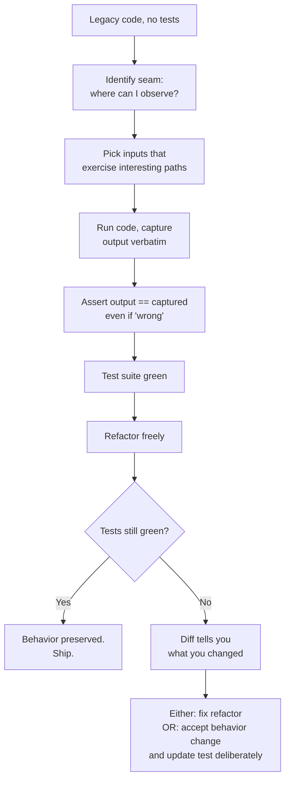
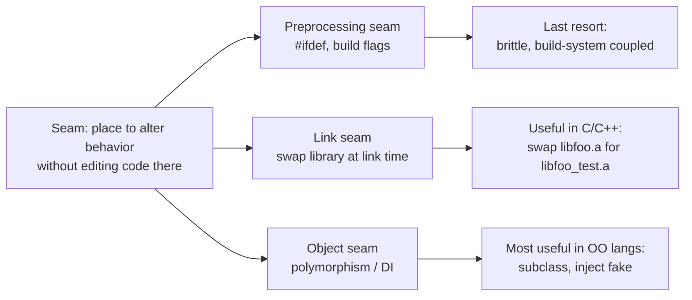

# Characterization Tests

## Why This Exists

**Problem.** You inherit code with no tests. The spec is lost, the original author left, and customers depend on the current behavior — including its bugs. Any change is Russian roulette: a "harmless" rename breaks a downstream batch job because someone parsed the log line. You can't refactor without tests, and you can't write tests without understanding the code, and you can't understand the code without changing it. Deadlock.

**Key insight.** You don't need to know what the code *should* do. You only need to know what it *does* do. A characterization test is a test that **describes the actual behavior** of an existing piece of code — not its intended behavior. You feed inputs, capture outputs (return values, side effects, log lines, DB writes), and freeze them as assertions. Now any change that alters that behavior fails loudly. The bugs are pinned down too — and that's a feature, not a bug, because customers may depend on them.

This idea comes from Michael Feathers, *Working Effectively with Legacy Code* (2004), where "legacy code" is defined provocatively as **code without tests**. The book's central move is: introduce a **seam** (a place where you can change behavior without editing the code at that location), write a characterization test through that seam, then refactor with confidence.

**Reach for this when:**
- Untested code you must modify (bugfix, feature add, dependency upgrade, language migration).
- Extracting a service from a monolith — you need a contract on the existing surface before splitting.
- Replatforming (Java → Kotlin, Python 2 → 3, on-prem → Lambda) where the new system must match the old byte-for-byte.
- Removing dead code or merging duplicated branches — you must prove no observable change.
- Reverse-engineering a black-box dependency (third-party SDK, vendor batch job).

**Don't reach for this when:**
- The code is small enough that *reading* it gives you confidence — characterization tests are overhead.
- The current behavior is so wrong that pinning it down would entrench a bug customers haven't noticed yet — fix first, test second (rare).
- The cost of capturing the behavior (e.g., hours of golden-file generation) exceeds the cost of just reading the code carefully.

---

## Diagrams

### The characterization workflow



### Seam taxonomy (Feathers)



---

## Core Technique

### Step 1 — Find a seam

A **seam** is a point in the code where you can change what happens *without editing the code at that point*. Without a seam, you have to modify the unit under test to test it — which means your "test" is testing your modifications, not the original behavior.

Common seams in modern code:

| Language | Seam type | Example |
|---|---|---|
| Java/Kotlin | Object seam | Inject a fake `Clock`, `HttpClient`, `Repository` via constructor |
| Python | Monkeypatch seam | `monkeypatch.setattr("module.requests.post", fake)` |
| Go | Interface seam | Function takes `interface{ Do(*http.Request) (*http.Response, error) }` |
| C/C++ | Link seam | Build test binary with `libfoo_fake.a` instead of `libfoo.a` |
| Any | Process seam | Run the binary as a subprocess; intercept stdin/stdout/files |

If no seam exists, **introducing one is the first refactor** — and that refactor itself is the dangerous one. Feathers calls this the "Legacy Code Dilemma": you need tests to refactor safely, but you need to refactor to add tests. Resolve it with the safest possible mechanical refactor (e.g., *Extract Method*, *Parameterize Constructor*) using only your IDE's verified rename/extract tools, not hand edits.

### Step 2 — Capture observable behavior

Run the code with realistic inputs. Record everything observable:

- Return value
- Exceptions thrown
- Side effects: DB rows written, files created, HTTP calls made, log lines emitted, metrics published
- Timing only if behavior depends on it (rare; usually you stub the clock)

The **dumb-but-honest** technique: assert against a deliberately wrong value, run the test, copy the actual value from the failure message into the assertion. This is sometimes called the **"print and pin"** loop.

### Step 3 — Assert it, even if it looks wrong

This is the part that feels uncomfortable. If the code rounds `2.5` to `2` (banker's rounding) when the spec says `3`, your characterization test asserts `2`. You are documenting reality, not aspiration. Add a comment if the behavior is suspicious; file a ticket. Don't "fix" it inside the characterization step — that's a separate, deliberate change with its own test.

---

## Code: A Worked Example

Imagine a 15-year-old pricing function in a Python monolith. No tests. You've been asked to add a new discount tier.

```python
# pricing.py — original, untouched
import datetime

def calculate_price(item, customer, now=None):
    now = now or datetime.datetime.utcnow()
    base = item["base_price"]

    # Loyalty discount
    if customer.get("years", 0) >= 5:
        base *= 0.9

    # Black Friday — yes, it's checked by month/day, not by config
    if now.month == 11 and now.day == 28:
        base *= 0.75

    # B2B discount, but only if quantity > 10
    if customer.get("type") == "b2b" and item.get("qty", 1) > 10:
        base *= 0.85

    # Tax — note the floor, not round
    tax = int(base * 0.08)
    return base + tax
```

Three branches, an integer truncation, a hard-coded date. You don't know which behaviors are intentional. **Pin them all.**

### Characterization test (pytest)

```python
# test_pricing_characterization.py
import datetime
import pytest
from pricing import calculate_price

# A frozen "now" so the date branch is deterministic.
NOT_BLACK_FRIDAY = datetime.datetime(2024, 6, 1)
BLACK_FRIDAY = datetime.datetime(2024, 11, 28)

# Each tuple: (item, customer, now, expected_price)
# `expected_price` was filled in by running the code and copying the output.
# DO NOT edit these to match what you *think* is right.
CASES = [
    # Plain customer, no discounts
    ({"base_price": 100.0}, {}, NOT_BLACK_FRIDAY, 108),

    # Loyal customer (5 years) -> 10% off
    ({"base_price": 100.0}, {"years": 5}, NOT_BLACK_FRIDAY, 97.2),

    # Loyal customer at 4 years — boundary, no discount
    ({"base_price": 100.0}, {"years": 4}, NOT_BLACK_FRIDAY, 108),

    # Black Friday on a non-loyal customer
    ({"base_price": 100.0}, {}, BLACK_FRIDAY, 81.0),

    # Black Friday + loyal — both discounts compound
    ({"base_price": 100.0}, {"years": 10}, BLACK_FRIDAY, 72.9),

    # B2B with qty > 10 — discount applies
    ({"base_price": 100.0, "qty": 11}, {"type": "b2b"}, NOT_BLACK_FRIDAY, 91.8),

    # B2B with qty == 10 — boundary, NO discount (note: > not >=)
    # This is captured behavior. It may be a bug. We pin it anyway.
    ({"base_price": 100.0, "qty": 10}, {"type": "b2b"}, NOT_BLACK_FRIDAY, 108),

    # Tax truncation — base 12.5 yields tax floor(1.0) = 1, total 13.5
    # Note: int() truncates toward zero, not banker's rounding.
    ({"base_price": 12.5}, {}, NOT_BLACK_FRIDAY, 13.5),
]

@pytest.mark.parametrize("item,customer,now,expected", CASES)
def test_pricing_pins_legacy_behavior(item, customer, now, expected):
    assert calculate_price(item, customer, now=now) == expected
```

**What this buys you.** Now you can:
1. Refactor `calculate_price` into smaller functions — tests stay green or you know exactly what you broke.
2. Add the new discount tier as a new branch — existing assertions confirm you didn't disturb anything.
3. When a stakeholder says "B2B at qty=10 should have qualified", you have a test to deliberately flip — the change is now visible and reviewable.

### Generating the cases automatically (golden-file flavor)

For larger surfaces, hand-curating cases is too slow. Generate inputs, capture outputs, and snapshot them. This is where characterization tests blur into golden tests.

```python
# generate_golden.py — run once against the legacy system
import json, itertools
from pricing import calculate_price

inputs = []
for base in [10.0, 100.0, 1234.56]:
    for years in [0, 4, 5, 20]:
        for qty in [1, 10, 11]:
            for ctype in [None, "b2c", "b2b"]:
                for month, day in [(6, 1), (11, 28)]:
                    inputs.append({
                        "item": {"base_price": base, "qty": qty},
                        "customer": {"years": years, "type": ctype},
                        "date": [2024, month, day],
                    })

import datetime
golden = []
for case in inputs:
    now = datetime.datetime(*case["date"])
    out = calculate_price(case["item"], case["customer"], now=now)
    golden.append({**case, "expected": out})

with open("pricing_golden.json", "w") as f:
    json.dump(golden, f, indent=2, sort_keys=True)
```

Then in tests:

```python
# test_pricing_golden.py
import json, datetime, pytest
from pricing import calculate_price

with open("pricing_golden.json") as f:
    GOLDEN = json.load(f)

@pytest.mark.parametrize("case", GOLDEN, ids=lambda c: json.dumps(c["item"]) + json.dumps(c["customer"]) + str(c["date"]))
def test_matches_golden(case):
    now = datetime.datetime(*case["date"])
    assert calculate_price(case["item"], case["customer"], now=now) == case["expected"]
```

If a refactor changes one cell of the table, the diff shows you exactly which inputs produce different outputs — far more useful than a single failed assertion.

---

## A Java Example with a Real Seam

Java legacy code often has constructed-internally dependencies. To characterize, you introduce a seam.

```java
// Before — untestable: clock and HTTP client are hardwired
public class FraudScorer {
    public int score(Order order) {
        Instant now = Instant.now();                                      // hidden dep
        HttpClient client = HttpClient.newHttpClient();                   // hidden dep
        // ... 200 lines of scoring logic that calls client and uses now
    }
}
```

**Step 1 — Introduce a seam via constructor parameterization** (Feathers calls this *Parameterize Constructor*). Use the IDE's "Introduce Parameter" + "Replace Constructor with Builder" refactors — these are mechanical and verified.

```java
public class FraudScorer {
    private final Clock clock;
    private final HttpClient client;

    // Existing call sites pass nothing — preserve old constructor
    public FraudScorer() {
        this(Clock.systemUTC(), HttpClient.newHttpClient());
    }

    // New seam — used only by tests
    FraudScorer(Clock clock, HttpClient client) {
        this.clock = clock;
        this.client = client;
    }

    public int score(Order order) {
        Instant now = clock.instant();
        // ... unchanged scoring logic, now uses this.clock and this.client
    }
}
```

**Step 2 — Characterize.** Inject a fake clock and a stub HTTP client. Capture outputs against representative orders.

```java
class FraudScorerCharacterizationTest {
    static final Clock FROZEN = Clock.fixed(Instant.parse("2024-06-01T00:00:00Z"), ZoneOffset.UTC);

    @Test
    void smallOrderFromKnownGoodCustomer() {
        FraudScorer scorer = new FraudScorer(FROZEN, stubReturning("OK"));
        Order o = new Order("cust-123", new BigDecimal("12.50"), "US");
        // captured by running the legacy code once
        assertEquals(7, scorer.score(o));
    }

    @Test
    void largeOrderFromNewCustomer() {
        FraudScorer scorer = new FraudScorer(FROZEN, stubReturning("RISKY"));
        Order o = new Order("cust-new", new BigDecimal("9999.99"), "NG");
        assertEquals(94, scorer.score(o));   // captured, including any quirks
    }
}
```

Now refactor the 200 lines with confidence.

---

## Characterization vs Unit vs Golden vs Approval

These overlap, but the framing differs:

| Style | Asserts what? | Source of truth | Typical scope |
|---|---|---|---|
| **Unit test** | Intended behavior from a spec | Spec/PRD/your design intent | One function/class |
| **Characterization test** | *Actual* behavior of existing code | The code itself, as it runs today | One function/class/module |
| **Golden test** | Output of a function matches a stored file | A captured "good" output, manually approved | One function over many inputs |
| **Approval test** | Same as golden, with explicit human-approval workflow (Beck/Llewellyn) | Manually approved snapshot | Often serialized object trees |
| **Snapshot test** (Jest) | UI/render output equals stored snapshot | Stored .snap file | Component output |

Characterization tests are the *intent*; golden/approval/snapshot tests are common *implementations* of that intent. You can write a characterization test as a single inline `assertEquals`, or you can store 10,000 input/output pairs as a golden file. Both are characterization in spirit.

The critical distinction from unit testing: **a unit test will fail if the code disagrees with the spec; a characterization test will fail if the code today disagrees with the code yesterday.** That's why characterization tests pin bugs — bugs are part of "the code today."

---

## Trade-offs

| Benefit | Cost |
|---|---|
| Refactor scary code with confidence | Pins bugs as "expected" — future readers may mistake assertions for spec |
| Cheap to generate (especially with golden-file capture) | Tests are brittle to *intentional* changes — every behavior change requires updating snapshots |
| Forces you to think about observable behavior, not implementation | Coverage is only as good as the inputs you chose; rare branches stay untested |
| No spec required — works on undocumented code | Doesn't tell you *why* — you still need to read code to understand intent |
| Catches accidental behavior changes during refactors | Can't catch missing-feature bugs (the code never did X, so the test doesn't assert X) |
| Compatible with any language and any test runner | Generated cases can balloon — 10MB golden files in git review become noise |
| Excellent for replatforms (parity testing) | Time-dependent / nondeterministic code requires seams before you can characterize at all |

---

## Common Pitfalls

- **Asserting what you wish were true, not what is true.** The whole point is honesty. If the code returns `null` for empty input, assert `null` — even if you'd prefer it threw. Add a TODO; don't "fix" inside the characterization.

- **Over-narrow inputs.** You picked three nice cases, refactored, tests passed — and broke production because the fourth branch (negative quantity, leap-year date, Unicode-in-name) wasn't characterized. Use property-based generation or production traffic samples when surface area is large.

- **Hidden time/randomness.** A test that calls `Instant.now()` or `Math.random()` is nondeterministic. Characterization fails when the test fails for reasons unrelated to your change. **Always inject the clock and RNG** before characterizing.

- **Tests that depend on implementation details.** If you assert "called database 4 times", any refactor that consolidates queries fails the test even though behavior is identical. Prefer **observable** behavior (final DB state, response body) over **internal** behavior (call counts) — except where the call count itself is the contract (e.g., idempotency).

- **The "all green" trap.** Coverage gives false confidence. 100% line coverage with characterization tests still misses inputs you didn't try. Mutation testing (`pitest`, `mutmut`, `cargo-mutants`) is a sharper signal: does flipping a branch cause a test to fail?

- **Refactoring the test along with the code.** When you change behavior intentionally, *update one assertion at a time and review the diff*. Don't regenerate the entire golden file — you'll mask unintended changes.

- **Forgetting to delete bug-pinning tests after the bug is fixed.** Once you fix a behavior, the test that pinned the bug becomes a regression test for the bug's *return*. Either delete it or rewrite the assertion to encode the new (correct) behavior with a comment explaining the history.

- **Treating characterization tests as documentation.** They document behavior at one point in time, including bugs. New engineers reading them will assume "this is how it should work." Mark them clearly: name files `*_characterization_test.py`, use comments like `// CAPTURED — may include bugs`, and link to a wiki page explaining the convention.

- **Characterization in a language without good seams.** Pure C with global state, FORTRAN, COBOL — link seams and process seams are sometimes the only option. Don't fight it; use shell-level golden tests (`diff actual.txt expected.txt`).

- **Capturing volatile output.** Logs containing timestamps, UUIDs, memory addresses will fail every run. Either inject deterministic generators or scrub the output before snapshotting (e.g., regex-replace UUIDs with `<UUID>` before comparing).

---

## Decision Table

| Situation | Use this approach | Not this |
|---|---|---|
| New feature, you control the spec | Unit tests / TDD | Characterization (no existing behavior to pin) |
| Untested legacy function, must refactor | **Characterization tests** | Skipping tests and "being careful" |
| Replatforming Java→Kotlin, must match byte-for-byte | **Characterization + golden files** of large input set | Hand-curated unit tests (will miss edge cases) |
| Vendor SDK behavior surprises you | **Characterization** to pin actual behavior, then file vendor ticket | Reading SDK docs (often wrong/stale) |
| Strangler-fig migration; new service must mirror old | **Shadow traffic + characterization** of divergences | Big-bang cutover with hope |
| Code so small you can read it in 5 minutes | Unit tests against intended behavior | Characterization (overkill) |
| UI component refactor | **Snapshot tests** (Jest, Storybook) — a UI-flavored characterization | Manual visual regression |
| API endpoint, want contract for clients | **Contract tests** (Pact) describing intended surface | Characterization (would pin server bugs as contract) |
| Performance-sensitive code | Characterization for correctness + benchmark for perf | Either alone |
| Code under active spec change | Unit tests; characterization will break every sprint | Characterization (treadmill) |
| Migrating data — old DB → new schema | **Parity tests**: read both, diff, characterize | Trusting the migration script |

---

## References

- Michael Feathers — *Working Effectively with Legacy Code* (Prentice Hall, 2004). Chapters 6–9 cover seams, characterization, and the dependency-breaking catalog. The canonical text. Author's site: https://michaelfeathers.silvrback.com/
- Martin Fowler — *Refactoring* (2nd ed., Addison-Wesley, 2018). Chapter 1 motivates characterization implicitly; the prerequisites section in chapter 2 ("If you don't have tests, write them first") is the bridge to Feathers. https://martinfowler.com/books/refactoring.html
- Martin Fowler — "Self Testing Code" — https://martinfowler.com/bliki/SelfTestingCode.html
- Martin Fowler — "Strangler Fig Application" (the migration pattern that most often needs characterization tests) — https://martinfowler.com/bliki/StranglerFigApplication.html
- Kent Beck — *Test-Driven Development: By Example* (Addison-Wesley, 2002). Contrasts spec-first TDD with the legacy-code style; useful to understand the divergence.
- Llewellyn Falco — Approval Tests project — https://approvaltests.com/ — practical tooling that operationalizes characterization-as-golden-file in many languages.
- Emily Bache — *The Coding Dojo Handbook* and her "Refactoring Legacy Code" katas (Gilded Rose, Tennis, Trip Service) — https://github.com/emilybache — best hands-on practice material for this skill.
- Google Testing Blog — "Testable Code" series and "Just Say No To More End-to-End Tests" — https://testing.googleblog.com/ — orthogonal but reinforces the seam idea.
- AWS Builders' Library — "Avoiding insurmountable queue backlogs" and "Going faster with continuous delivery" — https://aws.amazon.com/builders-library/ — operational context for why parity tests matter during migrations.
- *Designing Data-Intensive Applications* (Kleppmann, O'Reilly 2017) — ch. 4 (Encoding and Evolution) on backward/forward compatibility, which is what characterization tests enforce at the application layer.

---

## See Also

- `../refactoring-catalog/` — the catalog of mechanical refactors (Extract Method, Parameterize Constructor) you'll apply *after* characterization makes them safe.
- `../code-smells/` — recognizing legacy code that needs characterization before any other change.
- `../../reliability/observability/` — making "observable behavior" actually observable.
