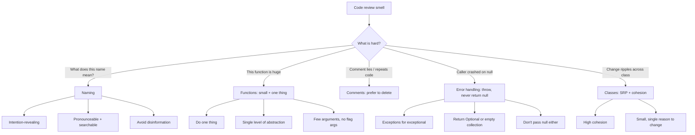
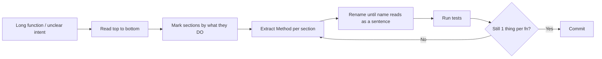

# Clean Code Principles

## Why This Exists

**Problem.** Software is read 10x more than it is written. Code that "works" but is unreadable becomes a tax on every future change: bugs hide in long functions, ambiguous names mislead reviewers, comments drift out of sync with code, `null` returns explode in callers' faces, and god-classes turn small changes into ripple-effect rewrites. Most production incidents traceable to "human error" are really *readability failures* — the engineer making the change could not see what the code actually did.

**Key insight.** Clean code is not aesthetic preference; it is **risk reduction**. A function that does one thing at one level of abstraction can be reasoned about locally. A name that reveals intent eliminates a class of misuse bugs. Throwing exceptions instead of returning sentinels removes the entire category of "forgot to check the return value" defects. Cohesion lowers the *blast radius* of any single change.

**Reach for this when:**
- A code review surfaces "I can't tell what this does without running it."
- New engineers take >1 day to make a one-line change because the surrounding function is 300 lines.
- You see `// TODO: figure out why this works` or comments that disagree with the code below them.
- Bugs cluster in functions with names like `processData`, `handleStuff`, `doIt`.
- A `NullPointerException` / `TypeError: cannot read property of null` shows up in your top-5 errors.
- Classes have grown to 2000+ lines with `if (mode == X) { ... } else if (mode == Y) { ... }` branching everywhere.

**Don't reach for this when:**
- You're optimizing a hot loop where the readable form measurably costs latency — clarity yields to *measured* performance, not imagined performance.
- You're writing a 30-line throwaway script. Clean Code's overhead pays off across teams and time; a one-shot data migration script does not need a `Customer` class hierarchy.
- The codebase has a strong, *consistent* house style that disagrees with Martin on cosmetics (e.g. function length thresholds). Consistency inside one codebase beats cross-codebase ideal.
- You're confusing "clean" with "clever." Extracting six tiny functions named `doStep1`, `doStep2`, ... can be *worse* than one straightforward 40-line function. The metric is comprehension, not LOC per function.

## Diagrams

The Clean Code reading order — symptoms → which principle to apply:



The flow of refactoring once a smell is identified — extract method is the workhorse:



## Naming: Names Are the Code's Documentation

A name is a tiny, always-on comment. If the name is right, almost no comment is needed. Martin (Clean Code, ch. 2) lists rules; in production these are the four that matter most.

### 1. Intention-revealing names

```python
# BAD: requires the reader to infer purpose from context.
d = 30  # elapsed days since last login

# GOOD: the name carries the meaning. The unit is in the name.
days_since_last_login = 30
```

```typescript
// BAD: what does `list1` mean? What's in it? Why filter?
function getThem(list1: number[][]): number[][] {
  const list2: number[][] = [];
  for (const x of list1) if (x[0] === 4) list2.push(x);
  return list2;
}

// GOOD: name + types reveal that this is a Minesweeper board scan
//   for flagged cells.
const FLAGGED = 4;

function flaggedCells(gameBoard: Cell[]): Cell[] {
  return gameBoard.filter(cell => cell.status === FLAGGED);
}
```

The second version is not "more verbose" — it is *self-documenting*. The original needed a comment to be useful at all; the cleaned-up version does not.

### 2. Avoid disinformation

```java
// BAD: `accountList` is a Set, not a List. The name lies.
Set<Account> accountList = new HashSet<>();

// GOOD: drop the type suffix unless it is a List.
Set<Account> accounts = new HashSet<>();
```

Other classic disinformation:
- `hp`, `aix`, `sco` — platform names that look like Hungarian-style hints.
- `l` (lowercase L) and `O` (capital O) — visually indistinguishable from `1` and `0`.
- `XYZControllerForEfficientHandlingOfStrings` and `XYZControllerForEfficientStorageOfStrings` — different concepts, near-identical names. A reviewer scanning a diff cannot tell them apart.

### 3. Pronounceable & searchable

```go
// BAD: cannot say it out loud, cannot grep for it without false positives.
var genymdhms time.Time

// GOOD: pronounceable, and you can grep `generationTimestamp` and find it.
var generationTimestamp time.Time
```

Single-letter names (`i`, `j`, `k`) are fine in *very* short scopes (a 3-line loop). Outside that scope they are unsearchable — `grep " e " src/` returns thousands of matches. **Length should match scope.** A loop counter is `i`. A class field that lives for the lifetime of an HTTP request is `customerId`, never `c`.

### 4. Class names are nouns; method names are verbs

`Customer`, `WikiPage`, `AddressParser` — not `Manager`, `Processor`, `Data`, `Info` (these are noise words; they reveal nothing).

`postPayment(...)`, `deletePage(...)`, `save(...)` — not `processPayment(...)` ("process" is a noise verb that hides what is actually being done).

## Functions: Small, Do One Thing, One Level of Abstraction

Martin's rule (Clean Code, ch. 3): **functions should be small. Smaller than that.** The empirical thresholds he uses:

- "Functions should hardly ever be 20 lines long."
- "Functions should do one thing. They should do it well. They should do it only."
- "Statements within a function should all be at the same level of abstraction."

Not religion — but the bias toward smaller is correct because **a small function is comprehensible in one read**, and a function you can hold in your head is one you cannot subtly break.

### Single Level of Abstraction (SLA)

Mixing levels of abstraction in one function is the most common smell in legacy code: a function reads from a socket, parses JSON, writes to Postgres, and emits a Prometheus counter. None of those things help you understand any of the others.

```python
# BAD: four levels of abstraction in one function.
#   1. orchestration ("for each order")
#   2. business rule ("if customer is gold tier")
#   3. integration ("HTTP POST to /charges")
#   4. observability ("statsd.increment")
def process_pending_orders(orders, http, db, stats):
    for order in orders:
        if order.customer.tier == "gold":
            order.discount = order.subtotal * 0.10
        body = {"amount": order.subtotal - order.discount, "currency": "USD"}
        resp = http.post("https://payments.example.com/charges", json=body)
        if resp.status_code == 200:
            db.execute(
                "UPDATE orders SET status='paid', charge_id=%s WHERE id=%s",
                (resp.json()["id"], order.id),
            )
            stats.increment("orders.charged")
        else:
            stats.increment("orders.charge_failed")
```

```python
# GOOD: top-level function reads as a sentence at one level of abstraction.
def process_pending_orders(orders, payments, orders_repo, stats):
    for order in orders:
        apply_loyalty_discount(order)
        charge_order(order, payments, orders_repo, stats)


def apply_loyalty_discount(order):
    if order.customer.tier == "gold":
        order.discount = order.subtotal * GOLD_TIER_DISCOUNT


def charge_order(order, payments, orders_repo, stats):
    result = payments.charge(order.payable_amount(), currency="USD")
    if result.succeeded:
        orders_repo.mark_paid(order.id, result.charge_id)
        stats.increment("orders.charged")
    else:
        stats.increment("orders.charge_failed")
```

Now `process_pending_orders` is a *table of contents*. To understand it I do not need to know how loyalty discounts work or how the payments API works. I can drill in only when I care about that level.

### Few arguments — and no flag arguments

> "The ideal number of arguments for a function is zero (niladic). Next comes one (monadic), followed closely by two (dyadic). Three arguments (triadic) should be avoided where possible. More than three (polyadic) requires very special justification — and then shouldn't be used anyway." — Clean Code, ch. 3

The reason is testing: each argument is a dimension of the test space. A 5-argument function with 3 meaningful values per argument needs 243 test cases to cover the cartesian product.

**Flag arguments are the worst.** A flag argument means the function does at least two things:

```java
// BAD: render(true) and render(false) are different functions wearing one name.
public void render(boolean isSuite) { ... }

// GOOD: split.
public void renderForSuite() { ... }
public void renderForSingleTest() { ... }
```

When you see `someFunction(x, y, true)` in a diff, the reviewer cannot tell what `true` means without opening the function. That is a defect waiting to happen.

### Command/Query Separation

A function should either *do* something (mutate state, command) or *answer* something (return a value, query) — not both. Functions that both mutate and return tempt callers into confusing usage:

```java
// BAD: does it set the attribute? Or check whether it exists? Both?
public boolean set(String attribute, String value);

// Caller is confusing — reads as a question, but mutates.
if (set("username", "unclebob")) { ... }

// GOOD: separate.
if (attributeExists("username")) {
    setAttribute("username", "unclebob");
}
```

## Comments: A Comment Is a Failure of Expression

Martin's strongest claim (ch. 4): **most comments are bad.** The good ones are rare. Why?

- Code changes; comments rot. The compiler does not check comments. A comment that *was* true six months ago is a *lie* now, and lies in code are worse than absence.
- A comment usually exists because the code is unclear. Fix the code instead. `// check if the employee is eligible for full benefits` ⇒ extract `if (employee.isEligibleForFullBenefits())`.

### Comments that survive scrutiny

```python
# Legal — required by license.
# Copyright (C) 2026 Acme Corp. Licensed under Apache 2.0.

# Informative when the value is non-obvious.
# Format: kebab-case, ASCII only, max 63 chars (DNS label limit).
HOSTNAME_PATTERN = re.compile(r"^[a-z0-9]([a-z0-9-]{0,61}[a-z0-9])?$")

# Warning of consequences — saves a future engineer hours.
# WARNING: do not call this in a request handler. It blocks for ~3s
# on cold cache. Run it from the warmup task at startup instead.
def rebuild_geoip_index(): ...

# TODO with a tracking ticket — has an owner and a deadline.
# TODO(JIRA-4421, 2026-Q3): replace with the new V2 SDK once stable.

# Explanation of intent that the code itself cannot capture — usually a
# subtle "why this looks wrong but is correct" note.
# We sleep 1ms here to work around a kernel bug on Linux <5.4 where
# epoll_wait returns spurious EAGAIN under high contention. See
# https://lore.kernel.org/lkml/... for the patch.
time.sleep(0.001)
```

### Comments that should be deleted

```java
// BAD: redundant — the code says exactly this.
// increment i
i++;

// BAD: misleading — at some point this used to be true. It is not now.
// Returns the customer's age in years.
public int customerAge(Customer c) {
    return c.dateOfBirth.until(LocalDate.now(), ChronoUnit.MONTHS); // months!
}

// BAD: noise — every getter does not need a comment.
/** Returns the day. */
public int getDay() { return day; }

// BAD: commented-out code. Delete it. Git remembers.
// public void oldImpl() {
//     ...
// }

// BAD: closing-brace comments. If the brace is far from its opener,
//   the function is too long. Fix the function.
}  // end while
```

Rule of thumb: **before writing a comment, try to rename a variable, extract a method, or pick a clearer type.** If those don't suffice, write the comment.

## Error Handling: Exceptions for Exceptional, Never Return null

Returning `null` (or `-1`, or `""`, or any sentinel) puts the burden of detection on every caller, forever. Inevitably one caller forgets, and you ship a crash. Martin (Clean Code, ch. 7) is unambiguous: **don't return null**, and **don't pass null** either.

### Don't return null — three idiomatic alternatives

```java
// BAD: every caller must remember the null check. Most won't.
public List<Employee> getEmployees() {
    if (department == null) return null;
    return department.employees;
}

// Caller — one missing null check away from a NullPointerException at 3am.
List<Employee> emps = getEmployees();
for (Employee e : emps) totalPay += e.pay;  // boom

// GOOD #1: empty collection — the for-loop just doesn't execute.
public List<Employee> getEmployees() {
    if (department == null) return Collections.emptyList();
    return department.employees;
}

// GOOD #2: Optional — caller cannot ignore the absence case.
public Optional<Customer> findCustomer(CustomerId id) {
    Customer c = repo.lookup(id);
    return Optional.ofNullable(c);
}

// GOOD #3: throw a domain exception when "missing" is genuinely a bug.
public Customer mustFindCustomer(CustomerId id) {
    Customer c = repo.lookup(id);
    if (c == null) throw new CustomerNotFoundException(id);
    return c;
}
```

The choice between Optional and throwing is **about whether absence is normal or exceptional**. Looking up a customer by email — empty result is normal, return Optional. Looking up a customer by primary key inside a transaction that was supposed to have created them — empty is a bug, throw.

### Exceptions for exceptional cases — but don't paper over bugs

```python
# BAD: swallow-all. Bugs disappear into the void.
try:
    charge_card(order)
except Exception:
    pass

# BAD: log-and-continue without policy. Causes silent partial failures.
try:
    charge_card(order)
except Exception as e:
    log.error("charge failed", exc_info=e)

# GOOD: catch what you actually handle, let the rest propagate.
try:
    charge_card(order)
except CardDeclinedError as e:
    notify_customer_card_declined(order.customer, e.reason)
    mark_order_payment_failed(order, reason=e.reason)
except PaymentGatewayUnavailable:
    # Retry-able — push to dead-letter queue for the worker to retry.
    enqueue_for_retry(order)
# Anything else (programming error, invariant violation) intentionally
# propagates so it surfaces in error tracking.
```

### Wrap third-party APIs

A hostile error-handling surface (third-party SDK that throws 14 different exception types, returns `None`, or returns error codes) is worth wrapping in a thin adapter so the rest of your code sees one shape of error.

```python
class PaymentGateway:
    def charge(self, amount_cents: int, currency: str) -> ChargeResult:
        try:
            resp = self._sdk.create_charge(amount=amount_cents, currency=currency)
        except sdk_lib.NetworkError as e:
            raise PaymentGatewayUnavailable() from e
        except sdk_lib.AuthError as e:
            # Auth errors are configuration bugs, not runtime errors.
            raise SystemError("payment SDK auth misconfigured") from e
        if resp.status == "declined":
            raise CardDeclinedError(reason=resp.decline_code)
        return ChargeResult(charge_id=resp.id, succeeded=True)
```

Now the rest of the codebase deals with two clean exceptions instead of fourteen leaky ones.

## Classes: Small, Cohesive, One Reason to Change

The Single Responsibility Principle (SRP) — **a class should have one, and only one, reason to change.** Cohesion is the measurement: a class is cohesive when its methods all use most of its instance variables. Low cohesion means the class is really two classes pretending to be one.

### Smell: god-class

```java
// BAD: 1400 lines, instance fields used by disjoint method clusters.
public class OrderManager {
    // fields used by pricing methods only
    private TaxTable taxTable;
    private DiscountRules discountRules;

    // fields used by shipping methods only
    private ShippingRateCalculator rates;
    private WarehouseLocator warehouses;

    // fields used by notification methods only
    private EmailClient emailClient;
    private SmsClient smsClient;

    // 60+ methods, each touching only one cluster of fields.
    public Money calculatePrice(Order o) { ... }    // uses taxTable, discountRules
    public Shipment shipOrder(Order o) { ... }       // uses rates, warehouses
    public void notifyCustomer(Order o) { ... }      // uses emailClient, smsClient
    // ...
}
```

Each method cluster only touches its own fields → **the class has three responsibilities, not one**, and any change to email-sending shouldn't risk breaking pricing tests.

```java
// GOOD: three cohesive classes. OrderService coordinates them.
public class OrderPricer {
    private final TaxTable taxTable;
    private final DiscountRules discountRules;
    public Money price(Order o) { ... }
}

public class OrderShipper {
    private final ShippingRateCalculator rates;
    private final WarehouseLocator warehouses;
    public Shipment ship(Order o) { ... }
}

public class CustomerNotifier {
    private final EmailClient emailClient;
    private final SmsClient smsClient;
    public void notify(Customer c, Notification n) { ... }
}

public class OrderService {
    private final OrderPricer pricer;
    private final OrderShipper shipper;
    private final CustomerNotifier notifier;

    public void place(Order o) {
        Money total = pricer.price(o);
        o.setTotal(total);
        Shipment s = shipper.ship(o);
        notifier.notify(o.customer(), Notification.orderShipped(s));
    }
}
```

This is also where SRP and **OCP (Open/Closed)** start to overlap: when responsibilities are split, you can extend one (e.g. add a `LoyaltyDiscountRule`) without touching shipping or notifications.

### Class organization (Clean Code, ch. 10)

A reading-order convention that pays off:

1. Public static constants
2. Private static variables
3. Private instance variables
4. Public methods (the API — what callers care about)
5. Private helpers, **placed immediately after the public method that calls them** (stepdown rule — you read top to bottom and abstraction decreases)

The stepdown rule is the class-level analogue of single-level-of-abstraction inside functions.

## Trade-offs

| Benefit | Cost |
|---|---|
| Names that reveal intent eliminate a class of bugs and make code grep-able | Renaming after the fact has churn cost; teams must agree on terminology (ubiquitous language — DDD) |
| Small functions = local reasoning, easier tests, better stack traces | More functions → more navigation; over-extraction creates "ravioli code" where you can't see the recipe for the noodles |
| No comments → no comment rot | Some intents (legal, perf workarounds, "why not the obvious approach") genuinely require comments — don't take the rule too literally |
| Throwing exceptions instead of returning null removes a defect category | Exceptions across an async/serialization boundary (gRPC, queues) need translation; not free in distributed systems |
| Cohesive classes localize change | More classes → more files, more imports; junior developers may struggle to navigate until they internalize the layout |
| Command/Query separation makes side effects auditable | More functions for state machines that genuinely need both (compare-and-swap primitives) |

## Common Pitfalls

- **Cargo-cult function extraction.** Splitting a 30-line function into ten 3-line functions named `step1`, `step2` is *worse* than the original. Extract only when each piece earns a meaningful name. If you can't name it, don't extract it.
- **Over-eager Optional everywhere.** `Optional<Optional<Customer>>` is a real thing people have shipped. Optional is for *return types*; not fields, not parameters, not collections (use empty collection instead).
- **Throwing across architectural boundaries.** A `SQLException` bubbling out of a domain service is a leak — wrap it. A panic crossing a goroutine boundary in Go takes the program down — `recover` at the boundary, return error.
- **Renaming without alignment.** One engineer renames `user` → `customer`, another renames it back to `user` two months later. Without a team-wide vocabulary (DDD: "ubiquitous language"), names oscillate. Pick one term per concept and document it.
- **Comments that lie.** Reviewer told me "the comment says we sort by created_at, but the code sorts by updated_at." That comment had survived three refactors and one full rewrite of the function. Result: a customer report ordered by the wrong column for 18 months. **Delete the comment, fix the code, or both.**
- **Returning null after promising not to.** A `List<T>` field initialized lazily — `return this.items;` — quietly returns null on the first call. Initialize collection fields eagerly to empty.
- **God-class hidden behind facades.** Splitting `OrderManager` into 8 classes that all hold a reference to the same shared `OrderState` mutable bag *did not increase cohesion*. The state is still shared. Look at fields, not file count.
- **"DRY" pushed past comprehension.** Two functions that look 80% the same but model different domain concepts should usually stay separate. Premature deduplication couples unrelated concepts and makes both harder to change. (See *A Philosophy of Software Design*, Ousterhout, ch. 9.)
- **Long argument lists "fixed" by passing a config object.** A 9-field `Options` object is a 9-argument function in disguise. The fix is to find the cohesive subset and extract a class with behavior, not just a bag.
- **War story.** A 600-line `processOrder` function with a `boolean dryRun` flag — 4 different teams independently introduced 4 different `if (dryRun)` branches over 2 years. A bug in production turned out to be: dry-run mode *did* charge the card because branch #3 was missing the flag check. The fix wasn't more careful flag handling; it was deleting the flag and shipping `processOrder` and `simulateOrder` as separate code paths.

## Decision Table

| Situation | Apply | Don't apply / Use instead |
|---|---|---|
| Variable used in a 3-line loop | `i`, `c`, `e` are fine | Don't force `currentIterationIndex` |
| Variable lives across a 100-line method | Use a full descriptive name | Don't use `c` |
| Function is 8 lines doing one thing | Leave it | Don't extract for the sake of the rule |
| Function is 80 lines mixing 3 concerns | Extract by concern, name each | Don't add comments to the long version |
| Comment explains *why* (non-obvious tradeoff, perf hack, legal) | Keep it | Don't delete reflexively |
| Comment restates *what* (`// loop over items`) | Delete it | Don't keep "for documentation" |
| Lookup that may legitimately find nothing | `Optional<T>` or empty collection | Don't return null |
| Lookup whose absence is a bug / invariant violation | Throw a domain exception | Don't return null and log |
| Class has 50 methods, fields used by disjoint subsets | Split by cohesion | Don't add a "facade" that delegates |
| Two functions look similar but model different domains | Keep them separate | Don't DRY them prematurely |
| Function name needs `And` (`saveAndNotify`) | Probably does two things — split | Don't pass a flag to suppress one half |
| You're tempted to add a `boolean` parameter | Split the function | Don't add the flag |
| Hot loop where readable form is measurably 3x slower | Keep the fast version, comment why | Don't optimize without a measurement |
| Throwaway 30-line script | Skip the class hierarchy | Don't apply enterprise patterns |

## References

- Robert C. Martin — *Clean Code: A Handbook of Agile Software Craftsmanship* (Prentice Hall, 2008). Ch. 2 (Meaningful Names), Ch. 3 (Functions), Ch. 4 (Comments), Ch. 7 (Error Handling), Ch. 10 (Classes).
- Robert C. Martin — *Clean Architecture: A Craftsman's Guide to Software Structure and Design* (Prentice Hall, 2017). Ch. 7 (SRP), Ch. 8 (OCP).
- Martin Fowler — *Refactoring: Improving the Design of Existing Code*, 2nd ed. (Addison-Wesley, 2018). The catalog of moves (Extract Function, Rename, Replace Conditional with Polymorphism) is the operational toolkit Clean Code presupposes. — https://martinfowler.com/books/refactoring.html
- Martin Fowler — "Refactoring" online catalog — https://refactoring.com/catalog/
- John Ousterhout — *A Philosophy of Software Design*, 2nd ed. (Yaknyam Press, 2021). The complementary view: optimize for cognitive complexity, beware shallow modules. Ch. 4 (Modules Should Be Deep), Ch. 9 (Better Together Or Better Apart).
- Kent Beck — *Implementation Patterns* (Addison-Wesley, 2007). The originator of much of the small-function, intention-revealing-name style.
- Andrew Hunt & David Thomas — *The Pragmatic Programmer*, 20th anniversary ed. (Addison-Wesley, 2019). DRY, orthogonality, "tell don't ask".
- Joshua Bloch — *Effective Java*, 3rd ed. (Addison-Wesley, 2018). Item 54 (return empty collections, not nulls), Item 55 (return Optionals judiciously), Item 70 (use exceptions only for exceptional conditions).
- Steve McConnell — *Code Complete*, 2nd ed. (Microsoft Press, 2004). Ch. 11 (The Power of Variable Names) — the empirical research backing intention-revealing names.
- Kleppmann — *Designing Data-Intensive Applications* (O'Reilly, 2017). Ch. 1 ("Reliability, Scalability, and Maintainability") — the operability/simplicity/evolvability framing that Clean Code supports at the codebase level.
- Google Engineering Practices — "Code Review Developer Guide" — https://google.github.io/eng-practices/review/
- Google Style Guides (a working operational example of consistent house style) — https://google.github.io/styleguide/

## See Also

- `../solid/` — SRP, OCP, LSP, ISP, DIP — the structural backbone Clean Code's class chapter assumes.
- `../code-smells/` — Fowler's catalog of smells (long method, large class, feature envy, primitive obsession) and which Clean Code rule each maps to.
- `../refactoring-catalog/` — the mechanical refactorings (Extract Method, Rename, Inline, Replace Conditional with Polymorphism) you apply when a smell is found.
- `../ddd/` — ubiquitous language (the team-wide discipline that makes "intention-revealing names" stick across a codebase).
- `../../communication/INDEX.md` — the interface-level analogues: don't return null at API boundaries, design errors as part of the contract.
- `../code-review/` — how to *review for* the smells this skill names.
