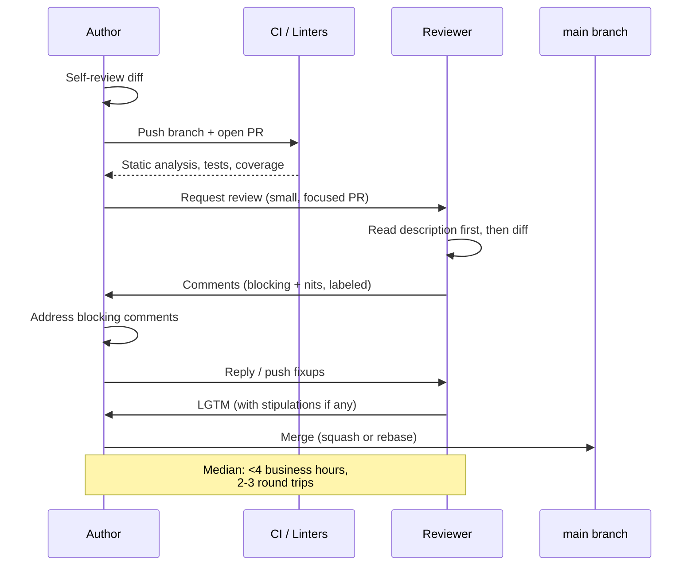
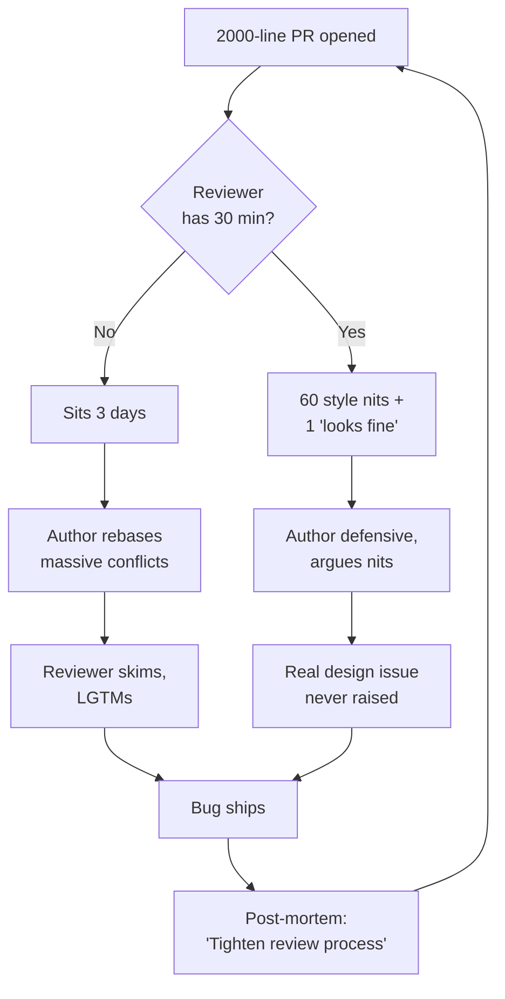

# Code Review

## Why This Exists

**Problem.** Code review is the highest-leverage quality gate most teams have, and most teams do it badly. The two failure modes are symmetric: reviews that are too slow (PRs rot for days, authors context-switch, branches diverge, momentum dies) and reviews that are too shallow (LGTM in 90 seconds on a 1500-line diff that ships a SQL injection). A third failure mode — bikeshedding on style while ignoring an unbounded retry loop — combines the worst of both.

**Key insight.** Code review is not QA. It is **a conversation between the author and a reviewer about whether this change is the right change, well-expressed, and safe to ship**. The reviewer's job is not to find every bug (tests and types do that better), but to (1) catch the things humans catch — design mistakes, missing tests, subtle correctness bugs, security/concurrency hazards, naming that lies — and (2) preserve the codebase as a readable artifact for the next person. Speed matters because the author is blocked; depth matters because shipping wins; tone matters because reviewers and authors will work together for years.

Google's internal data (Sadowski et al., "Modern Code Review at Google", ICSE-SEIP 2018) shows the median CL gets first reviewer feedback in **under an hour during business hours**, and 70% of CLs are reviewed within 4 business hours. They also found most CLs are small (~24 lines median) and most have a single reviewer. This isn't accidental — it's the equilibrium that keeps the system from collapsing under its own weight.

**Reach for this when:**
- Setting up review norms for a new team or rewriting a stale CONTRIBUTING.md.
- A PR has been open more than 24 business hours with no first response.
- Reviews regularly turn into multi-day style arguments.
- Authors are submitting 1000+ line PRs and reviewers are LGTM-ing them blind.
- A bug shipped that "should have been caught in review" — and you want a real post-mortem, not blame.
- You're a new senior reviewer and your comments keep landing as harsh.

**Don't reach for this when:**
- The problem is missing tests, not missing review — fix the test gap first.
- The problem is missing static analysis (linters, type checkers, fuzzers) — automate before you human-review.
- You're trying to use review as a substitute for design discussion that should have happened in an RFC.

## Diagrams

The healthy review loop:



What goes wrong (the slow, brittle path):



The fix: **shrink the unit of review**, **respond fast even if briefly**, and **separate blocking from non-blocking comments explicitly**.

## What Reviewers Actually Look For

A useful prioritization, roughly in order of how much human attention each deserves (machines are better at the bottom items):

1. **Design.** Does this change belong in this layer? Does it duplicate something that exists? Does the abstraction match the problem? Does it leak concerns across boundaries (e.g., an HTTP handler doing DB writes)? **This is the highest-value review work and the hardest to automate.**
2. **Functionality / correctness.** Does it do what the description says? Edge cases — empty input, max input, concurrent callers, partial failure, retry semantics, idempotency? Does it handle the error path or just the happy path?
3. **Complexity.** Could this be simpler? Over-engineering for hypothetical future requirements is a common failure. Google's guide phrases this as "is this code more complex than it needs to be?" — applied to every method, every class, every line.
4. **Tests.** Are there tests? Do they test the behavior or the implementation? Do they actually fail when you break the code (mutation-test mentally)? Are slow tests in the right tier (unit/integration/e2e)?
5. **Naming.** Does each name communicate what the thing is and isn't? `data`, `info`, `manager`, `helper` are smells. `processOrder` that also sends email is a lie.
6. **Comments.** Do they explain *why*, not *what*? Stale comments are worse than none.
7. **Style and consistency.** Mostly the linter's job. Reviewers should not enforce what `gofmt` / `prettier` / `ruff` already enforce.
8. **Documentation.** Public APIs, README updates, runbooks, ADRs for non-obvious choices.
9. **Security.** Input validation, authn/authz checks, secrets handling, injection vectors, deserialization, SSRF, dependency provenance. Worth a checklist (see `../../security/threat-modeling/`).
10. **Operational concerns.** Logs, metrics, alarms, rollback story, feature flags, migration ordering. A change that works in dev but has no observability in prod is half-done.

```python
# A pseudo-checklist a reviewer can mentally run on every diff.
# Stolen and adapted from Google's CL Author's Guide.

REVIEW_CHECKLIST = [
    # Design — most important
    "Does this code do the right thing in the right place?",
    "Does it integrate well with the rest of the system?",
    "Could it be simpler? Smaller? Done in fewer steps?",

    # Correctness
    "What happens with empty / null / max-size / negative inputs?",
    "What happens under concurrent calls or partial failure?",
    "Are there race conditions, deadlocks, or unbounded retries?",
    "Is every error path either handled or explicitly propagated?",

    # Tests
    "Are tests present, correct, sensible, and useful?",
    "Do they test behavior, not implementation details?",
    "Will they actually catch a regression?",

    # Naming & readability
    "Will a reader unfamiliar with this code understand it in 6 months?",
    "Do names lie? (e.g., getX() that mutates state)",

    # Security & ops
    "Untrusted input — validated, escaped, parameterized?",
    "Authz checked before privileged operations?",
    "Logs / metrics / alarms emitted at the right severity?",
    "Is the change reversible? Feature-flagged? Migration-safe?",
]
```

## PR Size: The Single Biggest Lever

Review quality and review speed both fall off a cliff as PR size grows. Cohen, Teleki, and Brown's analysis of SmartBear's case study at Cisco (Best Kept Secrets of Peer Code Review, 2006) found defect-detection rate per LOC reviewed peaks below ~200 LOC and degrades sharply above 400 LOC. Google's data agrees: small CLs (<100 lines) get reviewed faster *and* more thoroughly.

**Rule of thumb:** Aim for **<400 lines of meaningful diff** per PR. Hard cap at 1000. If your change is bigger, split it.

| Size | Reviewer behavior | Defect detection |
|---|---|---|
| <100 LOC | Reads carefully, often suggests design fixes | High |
| 100-400 LOC | Reads with effort, catches most issues | Good |
| 400-1000 LOC | Skims, focuses on parts they recognize | Mediocre |
| >1000 LOC | LGTMs by exhaustion or asks to split | Near zero |

Strategies for shrinking:

- **Stack PRs.** Each PR depends on the previous; reviewer reviews them in order. Tools: `git-spice`, Graphite, Phabricator stacks, ghstack.
- **Refactor first, then change behavior.** A pure-refactor PR that's "no behavior change, all tests still pass" is cheap to review. The behavior change PR that follows is then small.
- **Separate generated code, vendored code, and large data files.** They inflate the diff and trigger blind LGTMs. Use `.gitattributes` `linguist-generated=true` so GitHub collapses them.
- **Hide the import shuffle.** A second commit that just runs `goimports`/`isort` is easier than one giant mixed commit.

## Speed of Review: Why Fast Beats Thorough-but-Slow

Sadowski et al. (2018) found that at Google, **reviewer responsiveness is the strongest cultural norm of the review system**. The "Speed of Code Reviews" page in Google's Engineering Practices documentation is unusually direct: *"If you are not in the middle of a focused task, you should do a code review shortly after it comes in."*

Why fast review is a force multiplier:

1. The author is blocked. Every hour of latency is wasted velocity.
2. Authors context-switch. A PR they wrote yesterday is fresh; a PR from last Tuesday requires re-paging the whole change in.
3. Slow review breeds large PRs. If review is expensive to obtain, authors batch up changes — which makes review even worse.
4. Slow review breeds rubber-stamping. Reviewers feel bad for blocking the author, so they LGTM faster than they should.

**Norm to adopt:** First reviewer response within **one business day**, ideally within a few hours. "Response" can be a partial review, a question, or "I'll get to this by EOD" — the point is to unblock or set expectations. Full LGTM by next business day for normal-sized PRs.

This norm only works if PRs are small (see above). The two practices are inseparable.

## Tone: How to Give Feedback That Lands

Code review is one of the few places engineers regularly critique each other's work in writing, asynchronously, in front of an audience. Tone matters more here than almost anywhere else.

**Principles:**

- **Critique the code, not the author.** "This function has three responsibilities" not "you wrote this badly."
- **Ask, don't decree, when you might be wrong.** "What happens if `userId` is null here?" beats "Handle null." Most of the time you actually are uncertain — say so.
- **Justify with reasons or references.** "Prefer composition here — see [link to internal style guide §4]" beats "Don't use inheritance."
- **Distinguish opinion from policy.** "Personal preference: I'd extract this" vs "Style guide requires single-responsibility functions" land very differently.
- **Praise specifically when it's deserved.** Not as a sandwich-the-criticism trick, but because good code deserves to be acknowledged. "Nice — this state machine is much clearer than the old one" costs nothing and changes how reviews feel.
- **Default to the author's expertise.** They've thought about this code more than you have. If their solution surprises you, ask why before declaring it wrong.

**Anti-patterns to flag in yourself:**

- **The sealioning reviewer.** Endless "but what if…" comments that aren't actually grounded in real risk. Ask one focused question.
- **The drive-by stylist.** Comments only on naming and braces, never on design. Useful for a junior reviewer; not enough on its own.
- **The rewrite-it-my-way reviewer.** Comments that amount to "I would have done this differently." The bar for asking for a rewrite is "this is wrong" or "this is significantly harder to maintain," not "I prefer."
- **The ghost.** LGTMs everything in 30 seconds without comments. Worse than no review — it gives false assurance.

## Conventional Comments

A small but effective convention: **prefix each comment with its kind**, so the author can triage. Adapted from `conventionalcomments.org`:

| Prefix | Meaning | Author response expected |
|---|---|---|
| `nit:` | Minor, non-blocking. Fix if cheap, ignore otherwise. | Optional |
| `suggestion:` | I'd prefer this; willing to discuss. | Reply or address |
| `question:` | I don't understand; please clarify. | Must answer |
| `issue:` | Real bug or problem. **Blocking.** | Must address |
| `(blocking) issue:` | Same, but extra explicit. | Must address |
| `praise:` | This is good; keep doing it. | None |
| `thought:` | Just thinking aloud, no action needed. | None |
| `chore:` | Unrelated cleanup someone should do, not necessarily this PR. | Optional, tracked elsewhere |
| `todo:` | A follow-up agreed during review. | File a ticket |

Example exchange:

```text
Reviewer: issue: this releases the lock before writing the new value,
  so a concurrent reader can observe the old value forever. Move the
  unlock after the assignment, or use atomic.StoreInt64.

Reviewer: nit: rename `tmp` to `previousValue` — it's read 4 times below.

Reviewer: question: why bound the worker pool at 8 here but 16 in the
  ingest path? Is there a reason these differ?

Reviewer: praise: nice — the state machine is much clearer than the
  goto-style code it replaces.
```

The author can now triage in seconds: address the `issue`, answer the `question`, accept-or-defer the `nit`, smile at the `praise`. Compare with a wall of unlabeled comments where everything looks equally urgent.

## LGTM Hygiene

LGTM ("looks good to me") is the unit of approval. It carries weight only if it means something. Some norms that keep it honest:

1. **Don't LGTM what you didn't read.** If you skimmed, say "skim-LGTM, defer to @other on the algorithm" or just don't approve. Approving 1000 lines in 90 seconds erodes trust in approvals across the team.
2. **Two reviewers when it makes sense.** Critical paths (auth, billing, data deletion, schema migrations) deserve two pairs of eyes. Routine changes don't.
3. **LGTM with stipulations.** "LGTM with the nit on naming addressed; no need to re-review" is a useful pattern. The author lands the change after fixing the nit; the reviewer doesn't have to look again. Requires trust.
4. **Don't LGTM your own code.** Even with stacked PRs, the approval should be from someone other than the author for any non-trivial change. Many teams enforce this in branch protection.
5. **Author owns the merge.** The reviewer approves; the author merges. The reviewer is not the gatekeeper hitting the button.

## Self-Review: The Thing Authors Skip

The cheapest review is the one the author does on themselves. Before requesting review:

```bash
# What you're about to ask someone else to read
git diff origin/main...HEAD --stat
git diff origin/main...HEAD          # actually read every line

# Run your own checklist on it
# - Does the description explain WHY?
# - Are there commits that should be squashed or split?
# - Are there debug prints / TODOs / commented-out code?
# - Does CI pass locally?
# - Did you self-comment confusing parts BEFORE the reviewer asks?
```

A 10-minute self-review typically catches 30-50% of what a reviewer would have caught — including the most embarrassing "I left a `console.log` in" stuff. The reviewer's time is then spent on the things only they can find: design issues, missing context, alternative approaches.

A useful trick: leave inline comments on your *own* PR for non-obvious decisions. "Using a buffered channel of 64 here because we measured the burst rate at peak as ~50/s" is exactly the context a reviewer would otherwise have to ask for.

## Description, Title, Commits

The PR description is read more than the code. Make it carry weight.

A template that scales:

```markdown
## What
One-paragraph summary of the change. Reader should know what files matter.

## Why
The motivating problem or ticket. Link the issue/RFC. If this is "obvious",
write one sentence anyway — what's obvious to you isn't always to the reviewer.

## How
Notable design choices the reviewer should be aware of. Alternatives you
considered and rejected. Any non-obvious trade-offs.

## Test plan
- Unit tests added: ...
- Manual verification: commands you ran and what you saw
- What you did NOT test and why

## Risk / rollout
Feature-flagged? Migration order? Reversible?
```

Title format that holds up across many tools:

```
<area>: <imperative verb> <what>   (≤ 72 chars)

# Examples
auth: refresh tokens before they expire instead of after 401
billing: fix duplicate charge on retry of failed webhook
schema: add index on orders(customer_id, created_at)
```

For commits within the PR, prefer **a small number of meaningful commits** over either one squash-bomb or 47 "fix typo" commits. If you squash on merge, commit hygiene matters less; if you rebase-and-merge, treat each commit as if it were its own PR.

## Receiving Review Without Burning Out

Review is a critique of work you put effort into. It can sting. Some load-bearing habits:

- **Read all comments before responding to any.** Don't reply linearly — you'll get defensive on comment 1 and miss that comment 12 makes the same point better.
- **Sleep on harsh feedback.** If a comment makes you angry, draft a reply, don't send it, come back tomorrow. 80% of the time you'll either agree or have a calmer rebuttal.
- **Reply to every comment.** Even `nit`s. "Done", "Won't fix because X", "Filed a follow-up" — closes the loop.
- **Push back when you're right.** "I considered this approach and rejected it because…" is a legitimate reply. Senior reviewers expect pushback; juniors who never push back miss learning opportunities.
- **Escalate respectfully when you disagree.** Two reasonable engineers can disagree; bring in a third (tech lead, area expert) rather than grinding it out in PR comments.

## Trade-offs

| Benefit | Cost |
|---|---|
| Catches design and correctness bugs static analysis can't | Adds latency to every change (hours to days) |
| Spreads codebase knowledge across the team | Reviewer time is expensive (often 30%+ of senior eng time) |
| Creates a paper trail for why decisions were made | Can degenerate into bikeshedding or power dynamics |
| Improves author's code quality over time | Can demoralize authors when tone is wrong |
| Forces explicit discussion of trade-offs | Tempts teams to over-rely on review vs tests/types |
| Onboards new engineers via reading + reviewing real diffs | Hides behind LGTM theater when norms erode |
| Surfaces security and ops concerns before prod | Doesn't scale linearly — 10x team ≠ 10x review capacity |

## Common Pitfalls

- **Reviewing as gatekeeping.** Reviewers who treat review as "prove to me this is good enough" rather than "let's collaborate on shipping" create adversarial dynamics. The author and reviewer are on the same team.
- **Style debates that should be a linter rule.** If you find yourself making the same style comment three times, it's a `ruff`/`eslint`/`gofmt` rule, not a review comment.
- **Ignoring the description.** Reviewers who jump straight to the diff without reading what the change is *for* end up suggesting the author re-do work the description already explained why they didn't.
- **The "while you're in there" pile-on.** Every reviewer asks the author to fix one extra unrelated thing. The PR doubles in size and ships a week late. Push unrelated work to follow-up PRs.
- **Approving to be nice.** A reviewer who knows the change is risky but approves because they don't want conflict is failing the author and the team. If you have real concerns, voice them.
- **Reviewing only the lines that changed.** A 1-line change that violates an invariant 200 lines up is still a bug. Read enough of the surrounding code to understand the invariant.
- **Letting the PR rot.** A PR open >5 days has often diverged from main, lost context with its author, and is now harder to review than when it was fresh. Close stale PRs decisively — either land them or close them.
- **Over-relying on "the reviewer will catch it."** Tests, types, linters, fuzzers, and runtime checks scale; human review doesn't. Every bug "review should have caught" is also a bug a test would have caught — write the test.
- **Senior reviewers who never get reviewed.** Two-way review keeps the senior's code honest and signals the practice matters at every level.
- **Confusing "I would have done it differently" with "this is wrong."** Most code can be written several reasonable ways. The reviewer's job is to flag wrong, not to enforce taste.

## Decision Table

| Situation | Do this | Not this |
|---|---|---|
| Trivial refactor, single file, <50 LOC | One reviewer, fast LGTM, no template | Demand description template, two reviewers |
| Auth / billing / data-deletion change | Two reviewers, one a domain expert, security checklist | Single LGTM, normal review |
| 1500-line PR lands in your queue | Ask author to split before reviewing | Skim and LGTM |
| Author is junior, code has 8 issues | Pick the top 3, frame as questions, mentor in 1:1 | Leave 30 comments and overwhelm |
| Author is senior, you spot a real bug | Say so directly, link to evidence | Hedge with 6 layers of "maybe just a thought" |
| Style nit you have on every PR | Add a linter rule | Comment on every PR forever |
| Disagreement persists after 2 round-trips | Escalate to tech lead or sync up live (5 min call) | Argue in comments for another day |
| You're requested as reviewer but the wrong person | Reassign or add the right person, fast | Sit on it because "they'll figure it out" |
| You're the author and feedback feels harsh | Sleep on it, reply tomorrow, assume good intent | Reply angry within 5 min |
| LGTM but with a small fix needed | "LGTM after addressing the null-check; no re-review needed" | Make them request re-review for a one-liner |
| You found a bigger problem upstream of this PR | File an issue, link from this PR, don't block this PR on it | Demand the author fix the whole upstream mess |
| Generated code or vendored deps in the diff | Mark `linguist-generated`, collapse in UI | Read line-by-line |
| You're being pulled into reviews you can't keep up with | Push back on review load explicitly with your manager | Quietly LGTM faster |

## References

- Google — Engineering Practices: Code Review Developer Guide — https://google.github.io/eng-practices/review/
- Google — Speed of Code Reviews — https://google.github.io/eng-practices/review/reviewer/speed.html
- Google — How to do a code review — https://google.github.io/eng-practices/review/reviewer/
- Google — The CL author's guide — https://google.github.io/eng-practices/review/developer/
- Sadowski, Söderberg, Church, Sipko, Bacchelli — *Modern Code Review: A Case Study at Google* (ICSE-SEIP 2018) — https://sback.it/publications/icse2018seip.pdf
- Bacchelli & Bird — *Expectations, Outcomes, and Challenges of Modern Code Review* (ICSE 2013) — https://www.microsoft.com/en-us/research/publication/expectations-outcomes-and-challenges-of-modern-code-review/
- Cohen — *Best Kept Secrets of Peer Code Review* (SmartBear, 2006) — https://smartbear.com/resources/ebooks/best-kept-secrets-of-peer-code-review/
- Conventional Comments specification — https://conventionalcomments.org/
- Karl Fogel — *Producing Open Source Software*, ch. on review and patches — https://producingoss.com/
- Joel Spolsky — *The Joel Test* (item on code review / mandatory build) — https://www.joelonsoftware.com/2000/08/09/the-joel-test-12-steps-to-better-code/
- Microsoft — Code With Engineering Playbook: Code Reviews — https://microsoft.github.io/code-with-engineering-playbook/code-reviews/
- ThoughtBot — Code Review Guide — https://github.com/thoughtbot/guides/tree/main/code-review
- Gunnar Morling — *Give your PRs a chance: Write good descriptions* — https://www.morling.dev/blog/whats-in-a-good-error-message/ (general communication; same author has multiple essays on review craft)
- Will Larson — *An Engineering Leader's Guide to Code Review* — https://lethain.com/code-review-essentials-for-software-engineers/
- AWS Builders' Library — *Going Faster with Continuous Delivery* (review's role in CD) — https://aws.amazon.com/builders-library/going-faster-with-continuous-delivery/
- Beyer et al. — *Site Reliability Engineering*, ch. 8 "Release Engineering" — https://sre.google/sre-book/release-engineering/
- Beyer et al. — *Building Secure and Reliable Systems*, ch. 12 "Writing Code" and ch. 14 "Deploying Code" — https://sre.google/books/building-secure-reliable-systems/
- Martin Fowler — *Refactoring* (2nd ed., 2018), ch. 3 "Bad Smells in Code" — used as a reviewer's vocabulary
- Robert C. Martin — *Clean Code*, ch. 2 "Meaningful Names" and ch. 17 "Smells and Heuristics"

## See Also

- `../../code-design/code-smells/` — what reviewers point at when they say "smells"
