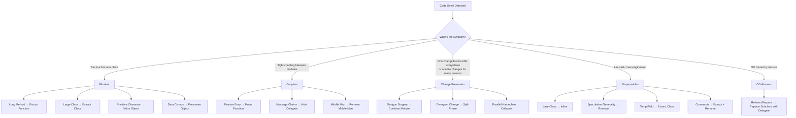
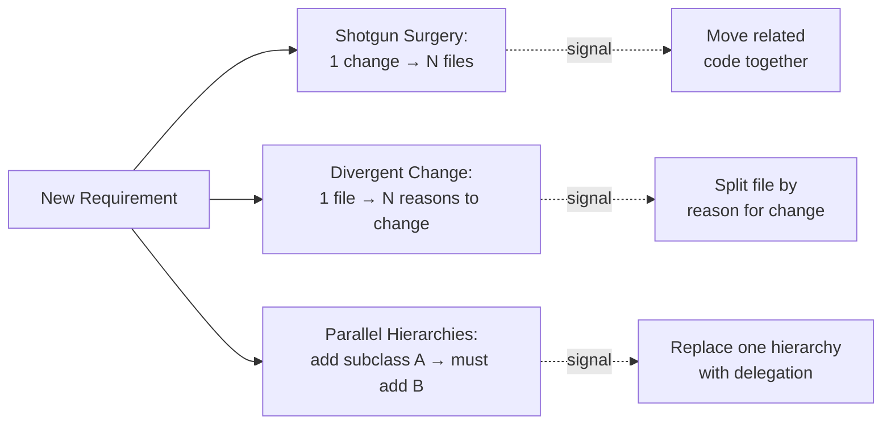

# Code Smells

## Why This Exists

**Problem.** Code rots gradually. No single commit makes a codebase unmaintainable; instead, dozens of locally-reasonable decisions accumulate until adding a feature takes a week, the new hire can't onboard, and the team starts saying "we should rewrite this." By the time the pain is loud, the refactor cost is enormous. Smells are the *early warning signal* — surface patterns that correlate with deep structural problems, named so that engineers can talk about them in code review without it feeling like a personal attack.

**Key insight (Fowler).** A smell is **not a bug**. Smelly code can be perfectly correct. A smell is a *suggestion* that something *might* be wrong with the design — a heuristic that triggers an investigation, not an automatic refactor. The right response to most smells is: "stop, name it, decide whether to refactor *now*, *later*, or *never*." Refactoring without a smell is speculation. Smells without refactoring is just complaining.

**Why a vocabulary matters.** Without shared names ("this is feature envy", "that's primitive obsession"), code review devolves into taste arguments. With names, the conversation becomes: "I see feature envy here — `Order.calculateShipping` reads five fields off `Address`. Move the method to `Address`?" That's a 30-second decision instead of a 30-minute debate.

**Reach for this when:**
- Reviewing a PR and something feels wrong but you can't articulate it.
- A bug fix requires editing many files in lockstep (shotgun surgery) or one file keeps changing for unrelated reasons (divergent change).
- A method is long enough that you scroll, or a class has so many fields you can't fit them on one screen.
- You see `String customerId` and `String customerEmail` repeated in seven method signatures (data clump / primitive obsession).
- Comments are doing the explaining the code refused to do.
- You're about to write a `// TODO: refactor` and want to know which refactor.

**Don't reach for this when:**
- The code is *already broken* — fix the bug first; refactor under green tests.
- You're chasing aesthetic perfection on code that won't change again. Smells in dead/stable code are not worth fixing; refactoring has cost and risk.
- You're tempted to pre-emptively eliminate every smell. Smells are heuristics, not rules. **Speculative generality** (over-abstraction in case someone might need it) is *itself* a smell. Don't trade one smell for another.
- The team hasn't agreed on the vocabulary yet. Drop names mid-review without a shared baseline and you'll start fights, not improve code.

This skill is a *checklist for design review*, not a linter. It pairs with `../refactoring-catalog/` (the mechanical recipes that fix each smell) and with `../solid/` (the deeper "why" behind several smells).

## The Smell → Refactor Map (at a glance)

| # | Smell | Primary refactor | Family |
|---|-------|------------------|--------|
| 1 | Long Method | Extract Function, Replace Temp with Query, Decompose Conditional | Bloaters |
| 2 | Large Class | Extract Class, Extract Subclass, Extract Module | Bloaters |
| 3 | Primitive Obsession | Replace Primitive with Object, Introduce Parameter Object, Replace Type Code with Class | Bloaters |
| 4 | Long Parameter List | Introduce Parameter Object, Preserve Whole Object, Replace Parameter with Query | Bloaters |
| 5 | Data Clumps | Extract Class, Introduce Parameter Object | Bloaters |
| 6 | Feature Envy | Move Function, Move Field, Extract Function | Couplers |
| 7 | Inappropriate Intimacy | Move Function/Field, Change Bidirectional to Unidirectional, Hide Delegate | Couplers |
| 8 | Message Chains | Hide Delegate, Extract Function + Move Function | Couplers |
| 9 | Middle Man | Remove Middle Man, Inline Function | Couplers |
| 10 | Shotgun Surgery | Move Function/Field, Combine Functions into Class/Module | Change Preventers |
| 11 | Divergent Change | Split Phase, Extract Class, Move Function | Change Preventers |
| 12 | Parallel Inheritance Hierarchies | Move Function/Field across hierarchies, Replace Inheritance with Delegation | Change Preventers |
| 13 | Lazy Class / Lazy Element | Inline Class, Inline Function, Collapse Hierarchy | Dispensables |
| 14 | Speculative Generality | Collapse Hierarchy, Inline Function, Remove Dead Code, Remove Parameter | Dispensables |
| 15 | Temporary Field | Extract Class, Introduce Special Case (Null Object) | Dispensables |
| 16 | Refused Bequest | Replace Subclass with Delegate, Push Down Method | OO-specific |
| 17 | Comments (as deodorant) | Extract Function (with self-documenting name), Rename | Dispensables |
| 18 | Mysterious Name | Rename Variable / Function / Field | Dispensables |
| 19 | Duplicated Code | Extract Function, Pull Up Method, Form Template Method | Bloaters |
| 20 | Global Data / Mutable Data | Encapsulate Variable, Combine Functions into Class | Couplers |
| 21 | Loops | Replace Loop with Pipeline | Modern addition (2nd ed.) |
| 22 | Insider Trading | Move Function, Hide Delegate | Couplers |

The original 1999 book grouped smells loosely; the 2018 second edition organizes them into the families shown above. We follow the 2nd edition.

## Diagrams

The smell families and the refactors that resolve them:



The "preventer" smells are particularly insidious because the *cost shows up only when you change the code*. Read-only code with shotgun surgery looks fine.



## The Smells

The examples below are deliberately realistic — order/billing/shipping domain, written in TypeScript and Python because they're widely readable. Translate the *pattern*, not the syntax.

### 1. Long Method

A method that doesn't fit on a screen. The 2nd edition is blunt: **"the longer a function is, the more difficult it is to understand."** Fowler reports the Beck heuristic — *whenever you feel the need to comment something, write a method instead*. The method name becomes the comment, and now it's reusable and testable.

```typescript
// SMELL — 60 lines, four levels of indentation, three reasons to change
function processOrder(order: Order): OrderResult {
  // 1) validate
  if (!order.customerId) throw new Error("missing customer");
  if (order.lines.length === 0) throw new Error("empty order");
  for (const line of order.lines) {
    if (line.qty <= 0) throw new Error(`bad qty ${line.qty}`);
    if (!line.sku) throw new Error("missing sku");
  }

  // 2) price
  let subtotal = 0;
  for (const line of order.lines) {
    const price = priceBook.get(line.sku);
    if (!price) throw new Error(`no price for ${line.sku}`);
    let lineTotal = price * line.qty;
    if (line.qty >= 10) lineTotal *= 0.95;     // bulk discount
    if (order.customerTier === "GOLD") lineTotal *= 0.9;
    subtotal += lineTotal;
  }
  const tax = subtotal * taxRate(order.shipTo.region);
  const shipping = order.shipTo.region === "US" ? 5 : 25;

  // 3) persist
  const id = db.insert("orders", { ...order, subtotal, tax, shipping });
  bus.publish("order.placed", { orderId: id, total: subtotal + tax + shipping });
  return { orderId: id, total: subtotal + tax + shipping };
}
```

```typescript
// AFTER — every step has a name, each is independently testable
function processOrder(order: Order): OrderResult {
  validate(order);
  const totals = price(order);
  return persist(order, totals);
}

function validate(order: Order): void { /* … */ }
function price(order: Order): Totals { /* … */ }
function persist(order: Order, totals: Totals): OrderResult { /* … */ }
```

Threshold heuristics that work in practice: **a method that needs a section comment is too long**; **a method whose name needs "and" is too long**; **a method with more than ~3 levels of nesting is usually too long**. Don't be religious about line counts.

### 2. Large Class

A class with too many fields, too many methods, or both. Symptom: when you describe what it does you find yourself saying "and" repeatedly. *"`Customer` stores profile data **and** computes loyalty tier **and** handles password reset **and** owns the cart."* Each "and" is a candidate for **Extract Class**.

A useful diagnostic: which fields are used by which methods? If you can partition fields into two clusters and each cluster has its own methods, you have two classes hiding in one.

### 3. Primitive Obsession

Using language primitives (`string`, `int`, `double`) for domain concepts. Money becomes `double`. Phone numbers become `string`. Customer IDs become `string`. Then validation, formatting, and arithmetic logic spreads everywhere because primitives don't carry behavior.

```python
# SMELL — every layer re-validates, re-formats, re-parses
def charge_card(amount_usd: float, customer_id: str, card: str) -> str:
    if amount_usd <= 0: raise ValueError("bad amount")
    if not customer_id.startswith("CUS_"): raise ValueError("bad cust id")
    if len(card) != 16 or not card.isdigit(): raise ValueError("bad card")
    cents = round(amount_usd * 100)               # float→int every call site
    return gateway.charge(cents, customer_id, card)
```

```python
# AFTER — invariants enforced at the boundary, once
@dataclass(frozen=True)
class Money:
    cents: int
    currency: str = "USD"
    def __post_init__(self):
        if self.cents < 0: raise ValueError("negative money")

@dataclass(frozen=True)
class CustomerId:
    value: str
    def __post_init__(self):
        if not self.value.startswith("CUS_"): raise ValueError("bad cust id")

def charge_card(amount: Money, customer: CustomerId, card: PaymentCard) -> ChargeId:
    return gateway.charge(amount, customer, card)
```

The Money type is the canonical example. Floats for currency cause real production bugs (rounding, locale, currency mixing). Half the financial-systems horror stories in the wild trace to "primitive obsession on money."

### 4. Long Parameter List

More than 3-4 parameters is suspicious. More than 6 is almost always wrong.

```typescript
// SMELL
createBooking(
  customerId: string, hotelId: string,
  startDate: Date, endDate: Date,
  roomType: string, occupancy: number,
  promoCode: string | null, currency: string, locale: string,
  notes: string,
);
```

Three usual cures, in order of preference:
1. **Preserve whole object.** If the caller already has a `BookingRequest`, pass that, not its fields.
2. **Introduce parameter object.** If parameters travel together (date range, address), make a struct.
3. **Replace parameter with query.** If `taxRate` can be looked up from `country`, don't pass both.

### 5. Data Clumps

The same group of fields appears together in multiple places: `street`, `city`, `state`, `zip`. Or `startDate`, `endDate`. Or `lat`, `lon`. **If they always travel together, they're a class.**

The diagnostic test: delete one of the fields. Does anything still make sense without it? If `startDate` without `endDate` is meaningless, you have a `DateRange`, not two parameters.

### 6. Feature Envy

A method on class A spends its time fondling fields of class B. The method is *envious* of B's data — it wants to live there.

```java
// SMELL — Order.shippingCost reads almost entirely off Address
class Order {
    Address shipTo;
    BigDecimal shippingCost(BigDecimal weight) {
        BigDecimal base = shipTo.country().equals("US") ? new BigDecimal("5.00")
                                                        : new BigDecimal("25.00");
        if (shipTo.zip().startsWith("9")) base = base.multiply(new BigDecimal("1.2"));
        if (shipTo.isPOBox())             base = base.add(new BigDecimal("3.00"));
        return base.add(weight.multiply(new BigDecimal("0.50")));
    }
}
```

```java
// AFTER — move the function next to the data
class Address {
    BigDecimal shippingCostFor(BigDecimal weight) { /* … */ }
}
class Order {
    BigDecimal shippingCost(BigDecimal weight) { return shipTo.shippingCostFor(weight); }
}
```

The exception: a method that *coordinates* across many objects (a Visitor, a strategy, a workflow) inherently touches their fields. That's not envy — that's the method's *job*. Envy is when the method belongs to A but its center of gravity is B.

### 7. Inappropriate Intimacy

Two classes that know far too much about each other's internals — accessing each other's private state, calling each other's protected methods, reaching into nested structures. The fix is usually to break the bidirectional link (Change Bidirectional to Unidirectional) or merge them (if they're really one concept).

### 8. Message Chains

`order.getCustomer().getAddress().getCity().getZipCode()`. Every dot is a navigational coupling: every link in the chain must exist for the call to work, and every change to any link breaks every caller.

```typescript
// SMELL
const zip = order.getCustomer().getAddress().getCity().getZipCode();
```

```typescript
// AFTER — Hide Delegate: ask Order, not its substructure
class Order { shippingZip(): string { return this.customer.shippingZip(); } }
```

The Law of Demeter ("only talk to your immediate neighbors") is the underlying rule. Three or more dots is a red flag — but be sensible: in fluent APIs and builder patterns, chains are *the design*. Smells aren't laws.

### 9. Middle Man

A class that does nothing but forward calls. Half its methods read `return this.delegate.foo()`. Sometimes hiding a delegate is appropriate (encapsulation). When *most* of the class is forwarding, **Remove Middle Man**: let callers talk to the real object.

The middle-man / hide-delegate pair is a classic balancing act. Hide a delegate when you might swap it. Remove the middle man when you've confirmed you won't.

### 10. Shotgun Surgery

You make one logical change ("rename `email` to `primaryEmail` everywhere") and you have to edit eight files. The signal: **logically related code is physically scattered**. Symptomatic of poor cohesion.

The fix is the *opposite* of Divergent Change: **Move Function** and **Combine Functions into Class** so the related code lives in one place.

A war story: a payments team renamed the field that determined "which 3DS challenge flow to send the user through." Eight services, three repos, four pull requests, two outages — because the routing decision was reimplemented in every service that touched it. Six months later they extracted a `ThreeDSPolicy` module; the next rename was one PR.

### 11. Divergent Change

The mirror of shotgun surgery. **One module changes for many unrelated reasons.** When marketing changes the discount rules, you edit `OrderService`. When ops changes the tax engine, you edit `OrderService`. When finance changes the GL posting rule, you edit `OrderService`. Three different stakeholders, one file.

This violates the **Single Responsibility Principle** in its most useful framing — *a module should have one reason to change*. Fix with **Split Phase** (separate the discount, tax, and GL phases), **Extract Class**, or **Move Function**.

### 12. Parallel Inheritance Hierarchies

Every time you add a subclass to one hierarchy, you have to add a corresponding subclass to another. `Employee → Engineer, Manager, Sales` parallels `EmployeeReport → EngineerReport, ManagerReport, SalesReport`. The hierarchies grow in lockstep. The fix: **make one hierarchy refer to the other** (composition), not duplicate it. Often: replace one inheritance hierarchy with delegation/strategy.

This smell is a special case of shotgun surgery (one change forces a parallel change), and is *very common* in older "GoF-heavy" codebases where every domain class spawned a Factory, Builder, Visitor, and Strategy parallel hierarchy.

### 13. Lazy Class (Lazy Element)

A class that earns less than its keep. It was extracted years ago for a reason that no longer applies, or it was speculatively created and never grew into the role. **Inline Class** — fold it back into the class that uses it.

The *lazy element* generalization (added in the 2nd edition) covers single-line methods or one-field classes that don't pay for their existence. `customerName()` that just returns `this.name` adds noise without value.

### 14. Speculative Generality

"We might need this someday." Hooks, abstract base classes, configuration knobs, plugin points — built for futures that never arrived. They make today's code harder for tomorrow's benefit that won't materialize.

YAGNI ("You Aren't Gonna Need It") is the rule of thumb. The signal: an abstraction with exactly one implementation, parameters that always take the same value, configuration that nobody has ever changed.

The cost is real. Every speculative abstraction:
- Increases the surface area readers must comprehend.
- Forces *real* future requirements to fit the speculative shape (which is usually wrong) instead of the actual shape (which you'd discover by waiting).
- Resists deletion — "but someone might be using it" — long after it's been confirmed unnecessary.

When you find it: **Collapse Hierarchy**, **Inline Function**, **Remove Dead Code**, **Remove Parameter**.

### 15. Temporary Field

A field that's only set under certain circumstances. The rest of the time it's `null` (or `0`, or `""`), and methods that touch it have to check first.

```python
# SMELL — `discountReason` is only meaningful when discount > 0
class Order:
    total: Decimal
    discount: Decimal = Decimal(0)
    discount_reason: Optional[str] = None    # null 90% of the time

    def receipt_line(self) -> str:
        if self.discount > 0:
            return f"{self.total} (discount: {self.discount} — {self.discount_reason})"
        return f"{self.total}"
```

Two cures:
- **Extract Class** — pull `discount` and `discount_reason` into a `Discount` value object that's *absent* when there is no discount, *present* (and complete) when there is.
- **Introduce Special Case (Null Object)** — supply a `NoDiscount` that responds correctly to `receipt_line()` without checks.

### 16. Refused Bequest

A subclass that inherits methods or fields it doesn't want. `Square extends Rectangle` is the textbook example: `Rectangle` exposes `setWidth`/`setHeight` independently, but `Square` must keep them equal — so it overrides one to also set the other, breaking the Liskov Substitution Principle.

The cure: **Replace Subclass with Delegate** (composition over inheritance) or **Push Down** the unwanted methods to a sibling subclass. Mild refused bequest is sometimes tolerable; *behavioral* refused bequest (the LSP-violating kind) is not — it produces real bugs.

### 17. Comments (as Deodorant)

Comments are fine. *Comments used to mask bad code are not.*

```typescript
// SMELL — the comments are doing the explaining the names refused to do
function p(x: any[]): number {
  // sum the prices of in-stock items
  let s = 0;
  for (const i of x) {
    // skip if not in stock
    if (i.q > 0) s += i.p;
  }
  return s;
}
```

```typescript
// AFTER — the names *are* the documentation
function totalInStockPrice(items: LineItem[]): Money {
  return items
    .filter(item => item.isInStock())
    .reduce((sum, item) => sum.plus(item.price), Money.zero());
}
```

Fowler's heuristic: when you feel the need to write a comment, first try to **Extract Function** with a name that captures the comment. Reserve comments for **why** (rationale, links to tickets, references to RFCs, performance trade-offs) — not **what** (which the code can show) and not **how** (which is a sign the code is too cryptic).

Good comments: explain non-obvious *why* ("we throttle here because the upstream rate-limits us at 50 RPS — see RFC-1247"), point to specs, mark known limitations, warn about future hazards.

Bad comments: re-state the code, lie because they weren't updated, attempt to explain code that should be rewritten.

### 18. Mysterious Name (added in 2nd ed.)

`x`, `tmp`, `data`, `process()`, `handle()`. Renaming is the cheapest, highest-value refactor. Fowler made it the *first* smell in the 2nd edition for a reason.

### 19. Duplicated Code

Obvious. Less obvious: **near-duplicates** that do "almost the same thing." The hard question is whether the duplication is *coincidental* (will diverge) or *essential* (will track each other forever). Premature deduplication of coincidental duplication produces speculative generality. Wait for the third occurrence (the *Rule of Three*) before extracting.

### 20. Global Data / Mutable Data

Globals are the textbook coupling smell. Mutable data is its quieter cousin: it's not global, but it's *shared* and *mutated*, which is almost as bad. **Encapsulate Variable** so reads and writes flow through a function (which can log, validate, or transition to immutability later).

### 21. Loops (controversial 2nd-ed addition)

Fowler argues that **collection pipelines** (`map`/`filter`/`reduce`, LINQ, Java streams) communicate intent better than imperative loops. Reasonable people disagree — pipelines have their own pitfalls (allocation, debuggability, lazy/eager confusion). Use the local style, but recognize when a 30-line for-loop is doing what `items.filter(…).map(…).reduce(…)` would say in three lines.

### 22. Insider Trading

Modules that "trade" data behind the back of the architecture — direct DB access from a UI layer, services reading each other's private fields. Fix: explicit interfaces, **Hide Delegate**, or merge the modules if they really are one concept.

## A Worked Example: Smells Compounding

Below is a real-shape (anonymized) controller that hits *six* smells simultaneously. This is what production-bad code actually looks like — the smells stack.

```typescript
// SMELLS PRESENT:
//   - Long Method (90+ lines)
//   - Primitive Obsession (Money as number, Email as string)
//   - Long Parameter List (8 params)
//   - Feature Envy (most logic touches `customer` and `order`)
//   - Comments as Deodorant ("// validate", "// charge", "// ship")
//   - Divergent Change (validation, pricing, persistence, notification all here)

async function checkout(
  customerId: string, items: { sku: string; qty: number }[],
  shipStreet: string, shipCity: string, shipZip: string, shipCountry: string,
  card: string, promoCode: string | null,
): Promise<{ orderId: string; total: number }> {
  // validate
  if (!customerId) throw new Error("no customer");
  if (items.length === 0) throw new Error("empty cart");
  if (card.length !== 16) throw new Error("bad card");
  // price
  let subtotal = 0;
  for (const it of items) {
    const p = await db.query("SELECT price FROM sku WHERE sku=$1", [it.sku]);
    subtotal += p.rows[0].price * it.qty;
  }
  if (promoCode === "SAVE10") subtotal *= 0.9;
  // tax
  const tax = shipCountry === "US" ? subtotal * 0.07 : subtotal * 0.20;
  // ship
  const ship = shipCountry === "US" ? 5 : 25;
  const total = subtotal + tax + ship;
  // charge
  const txnId = await stripe.charge(card, Math.round(total * 100));
  // persist
  const orderId = await db.query(
    "INSERT INTO orders (...) VALUES (...) RETURNING id", [/* … */]).then(r => r.rows[0].id);
  // notify
  const cust = await db.query("SELECT email FROM customers WHERE id=$1", [customerId]);
  await ses.send(cust.rows[0].email, "Order placed!", `Total: ${total}`);
  return { orderId, total };
}
```

After applying the chain of refactors — Extract Function, Replace Primitive with Object, Introduce Parameter Object, Move Function, Split Phase — you get something like:

```typescript
async function checkout(req: CheckoutRequest): Promise<CheckoutResult> {
  req.assertValid();
  const priced = await pricer.price(req.cart, req.promo);
  const charge = await payments.charge(req.card, priced.total);
  const order  = await orders.persist(req.customer, priced, charge);
  await notifier.confirm(order);
  return CheckoutResult.from(order);
}
```

Each step is a function that *can be read aloud*. The smells didn't go away by accident — each was named, each had a specific refactor, and the order mattered (Extract before Move; Rename before Extract; tests green between every step).

## Trade-offs

| Benefit | Cost |
|---|---|
| Shared vocabulary makes design review faster and less personal | Names without team buy-in *create* friction in review |
| Smells flag real maintenance hot-spots before they explode | Smells are heuristics, not bugs — chasing every one is waste |
| Refactoring under green tests reduces risk of design changes | Refactoring without tests *is* the risk; smell-driven refactors need a test safety net |
| Vocabulary maps directly to mechanical refactors with known steps | Mechanical application without judgment leads to over-engineering (esp. speculative generality) |
| Surfaces SOLID/cohesion violations in concrete terms | Doesn't substitute for understanding the underlying principles |
| Catches architectural decay early (shotgun surgery, divergent change) | Catches it *only* when you read with intent — smell-blindness sets in fast on familiar code |

## Common Pitfalls

- **Treating smells as rules.** "No method over 20 lines!" Long Method is a *suggestion*. A 30-line method that reads top-to-bottom in one direction is fine. A 12-line method with three nesting levels and a section comment is not.
- **Refactoring without tests.** This is how design changes become outages. Get to green first, then refactor, then commit. (See `superpowers:test-driven-development`.)
- **Refactoring on a feature branch that also adds features.** Reviewers can't see what changed. Refactor in its own commits/PRs.
- **Inventing abstractions to "fix" speculative generality you just added.** Pick a direction. If you over-abstracted last week, *delete*, don't add another layer.
- **Renaming without telling collaborators.** Mysterious-name fixes are great until your teammate's open PR has 200 conflicts. Coordinate big renames.
- **Premature deduplication.** Two methods that look alike today may diverge tomorrow. The Rule of Three: extract on the *third* duplication, not the second. The wrong abstraction is more expensive than duplication. (Sandi Metz: "duplication is far cheaper than the wrong abstraction.")
- **Using "smell" language in code review without consent.** "This is feature envy" reads as accusation if the team hasn't read Fowler. Lead with the observation ("`Order.shippingCost` mostly reads `Address` fields — what if it lived on `Address`?"), then introduce the name.
- **Fixing smells in code that's about to be deleted/replaced.** Refactoring has a cost. If the module is on the deprecation path, leave it alone.
- **Ignoring the smells *between* methods.** Long Method gets the headlines; Shotgun Surgery and Divergent Change cost more. The smells that hurt most are inter-modular.
- **Comments-as-deodorant fix gone wrong: deleting the comment without fixing the code.** The comment is the symptom; the code is the cause. Extract first, *then* the comment becomes unnecessary.

## Decision Table

| Situation | Smell | First refactor to consider | Don't bother if … |
|---|---|---|---|
| Method has section comments | Long Method + Comments | Extract Function (one per section) | The method is leaf-level and called from one place — inline the comments instead |
| Class has > ~7 fields and no obvious clustering | Large Class | List fields, draw which methods touch which, look for clusters → Extract Class | The class is a DTO/record — large field counts are fine for data carriers |
| `String customerId` etc. throughout the API | Primitive Obsession | Replace Primitive with Object (start with the most-validated one) | The "primitive" really *is* a primitive — `int count`, `bool isAdmin` |
| 3+ params that always travel together | Data Clumps | Introduce Parameter Object | Params are coincidentally co-occurring — don't bind unrelated things |
| Method on A reads many fields off B | Feature Envy | Move Function to B | The method is a coordinator/strategy and *needs* to see both — that's its job |
| `a.b().c().d().e()` | Message Chains | Hide Delegate (one level at a time) | It's a fluent/builder API — chains are the design |
| Class is mostly forwarding | Middle Man | Remove Middle Man | The middle is intentional encapsulation of a swappable backend |
| One change → many files | Shotgun Surgery | Combine Functions into Class / Move Function | The "scatter" is across truly independent bounded contexts |
| One file → many reasons to change | Divergent Change | Split Phase / Extract Class along the change axes | Phases share too much state to separate cleanly without bigger redesign |
| Add subclass A → must add B | Parallel Inheritance | Merge by composition (delegate one to the other) | The "parallel" is shallow and hierarchies are short — overhead may exceed benefit |
| Class doing too little | Lazy Class | Inline Class | It's a *boundary* class (port/adapter) — boundaries earn their keep even when small |
| Abstraction with one implementation | Speculative Generality | Inline / Collapse Hierarchy | A second implementation is *imminent and concrete* (have the ticket open?) |
| Field is `null` most of the time | Temporary Field | Extract Class or Null Object | The "temporary" state is genuinely a phase of a state machine — model it explicitly instead |
| Subclass overrides to throw / no-op | Refused Bequest | Replace Subclass with Delegate | The override is a deliberate, documented Liskov-safe specialization |
| Comment explains what code does | Comments-as-deodorant | Extract Function with the comment as the name | Comment explains *why* (rationale, ticket links, performance reasoning) — keep it |
| Variable is `tmp`, `data`, `x` | Mysterious Name | Rename | Local one-line scope where the type is the name (`for (const x of xs)` is fine) |

## When to *Not* Refactor

The 2nd-edition Fowler chapter on "When Should I Refactor" lists a few legitimate stop conditions. They're worth memorizing:

1. **It's easier to rewrite than to refactor.** If a module is small, badly designed, and has tests around its inputs/outputs, sometimes throwing it away is cheaper.
2. **The code is going away.** Don't refactor a module on the deprecation list.
3. **You're under deadline.** Fowler's controversial position: deadlines rarely justify accumulated tech debt. *But* there is a class of refactor that makes sense *only* when you'll change the same area soon. If you're not coming back, skip it.
4. **You don't have tests.** Get tests first (see `superpowers:test-driven-development`). Refactoring without tests is gambling.

## References

Primary sources, in order of relevance:

- Martin Fowler — *Refactoring: Improving the Design of Existing Code* (2nd ed., Addison-Wesley 2018), esp. Chapter 3 "Bad Smells in Code" and Chapter 4 "Building Tests" — https://martinfowler.com/books/refactoring.html
- Martin Fowler — *Refactoring* online catalog (2nd ed. companion) — https://refactoring.com/catalog/
- Kent Beck — *Smalltalk Best Practice Patterns* (Prentice Hall, 1996) — origin of "extract method" and the "self-documenting code" stance Fowler builds on.
- Robert C. Martin — *Clean Code* (Prentice Hall, 2008), Ch. 3 (Functions), Ch. 4 (Comments), Ch. 17 (Smells and Heuristics).
- Robert C. Martin — *Clean Architecture* (Prentice Hall, 2017), Part III (SOLID Principles) — for the deeper "why" behind divergent change and shotgun surgery.
- Sandi Metz — "The Wrong Abstraction" (RailsConf 2014 talk / blog) — https://sandimetz.com/blog/2016/1/20/the-wrong-abstraction
- Sandi Metz — *Practical Object-Oriented Design in Ruby* (Addison-Wesley, 2012) — Ch. 4 ("Creating Flexible Interfaces") and Ch. 9 (testing inheritance) cover refused bequest at depth.
- Michael Feathers — *Working Effectively with Legacy Code* (Prentice Hall, 2004) — refactoring smelly code *without* a test safety net.
- William Wake — *Refactoring Workbook* (Addison-Wesley, 2003) — exercises that map smells to specific code transformations.
- Joshua Bloch — *Effective Java* (3rd ed., Addison-Wesley, 2018) — Item 50 ("Make defensive copies"), Item 17 ("Minimize mutability"), Item 19 ("Design and document for inheritance or else prohibit it") cover several of the OO-specific smells.
- Sandi Metz & Katrina Owen — *99 Bottles of OOP* — long-form treatment of the iterative smell-refactor-smell cycle.
- C2 wiki — historical "code smell" page (origin of the term, attributed to Kent Beck) — https://wiki.c2.com/?CodeSmell
- Fowler — "Yagni" (essay) — https://martinfowler.com/bliki/Yagni.html — the canonical reference for the speculative-generality cure.
- Fowler — "Refactoring" overview (essay) — https://martinfowler.com/bliki/Refactoring.html
- Fowler — "TwoHardThings" (Phil Karlton naming aphorism) — https://martinfowler.com/bliki/TwoHardThings.html — bears on the Mysterious Name smell.

For the *change-preventer* family specifically (shotgun surgery, divergent change, parallel hierarchies), the SOLID-principles literature is essential — those smells *are* SRP/OCP violations expressed at the symptom level.

## See Also

- `../refactoring-catalog/` — the mechanical recipes (Extract Function, Move Function, Hide Delegate, etc.) that resolve each smell.
- `../solid/` — Single Responsibility, Open/Closed, Liskov, Interface Segregation, Dependency Inversion. Several smells (divergent change ↔ SRP, refused bequest ↔ LSP) are SOLID violations in disguise.
- `../value-objects/` — primary cure for primitive obsession and data clumps.
