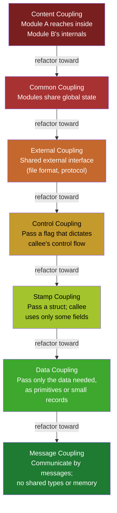
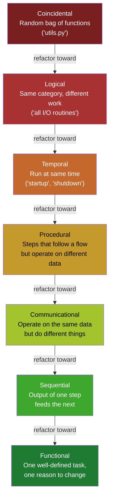
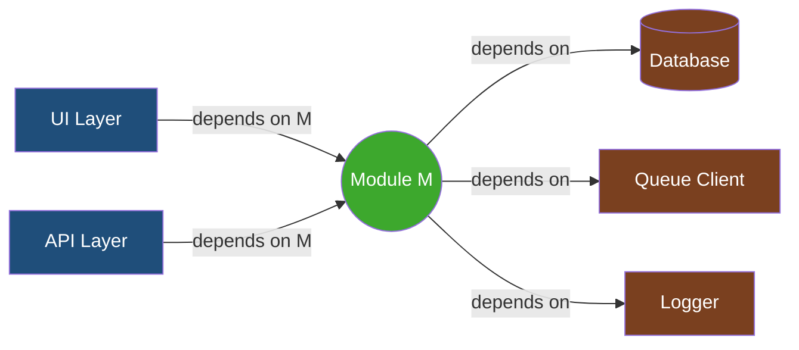

# Coupling and Cohesion

## Why This Exists

**Problem.** Two modules can have identical inputs, outputs, and test coverage and still differ by an order of magnitude in maintenance cost. The difference lives in *how* they connect to the rest of the system (coupling) and *how* tightly their internals belong together (cohesion). When teams describe code as "spaghetti", "fragile", "afraid-to-touch", or "every change is shotgun surgery", they are almost always describing **high coupling and low cohesion** — even when they don't have the vocabulary for it.

**Key insight.** Coupling and cohesion are not vague aesthetics. Stevens, Myers, and Constantine (1974) defined a *strict ordinal hierarchy* — each level of coupling is strictly worse than the one below it, each level of cohesion strictly better. A change anywhere in your codebase that moves a module up the cohesion ladder or down the coupling ladder is a defensible refactor. Anything else is taste. Treat the hierarchy as a checklist you can run during code review.

**The two design forces are inversely linked.** A module with **low cohesion** (does many unrelated things) almost necessarily has **high coupling** (every caller pulls in extra surface area they don't use). Fix cohesion first; coupling usually drops as a side effect.

**Reach for this when:**
- A bug fix in module A breaks tests in module B that "shouldn't be related"
- You can't unit-test a class without standing up a database, queue, or HTTP server
- "Where do I put this new feature?" has more than one defensible answer
- A single change requires edits across 5+ files (shotgun surgery)
- New hires take weeks to feel safe touching a particular module
- Code review keeps surfacing "but this also affects X" — and X keeps changing
- A class is named with "And", "Util", "Manager", "Helper", or "Processor"
- You're choosing between microservices, modular monolith, or package boundaries

**Don't reach for this when:**
- The system is a one-off script, prototype, or notebook with a known short half-life
- You're optimizing a hot loop — coupling/cohesion are *design* concerns, not perf concerns
- The pain is operational (deploys, monitoring, capacity) not structural
- You're debating syntax or naming conventions — those are style, not structure

## Diagrams

### The Coupling Hierarchy (worst → best)



### The Cohesion Hierarchy (worst → best)



### Afferent vs. Efferent Coupling (Robert Martin's metric)



For module M above: **Ca (afferent) = 2** (UI, API depend on M), **Ce (efferent) = 3** (M depends on DB, Q, Log). **Instability I = Ce / (Ca + Ce) = 3/5 = 0.6**. Stable modules have low I (depended-on-by-many, depend-on-few) — they should change rarely. Unstable modules have high I — they should change easily.

## The Coupling Levels (Stevens, Myers, Constantine 1974)

Listed worst to best. Each level is *strictly worse* than the next one — never argue "but my content coupling is fine here". Refactor toward data or message coupling.

### 1. Content coupling (pathological)

One module reads or writes another module's internal state, jumps into the middle of its logic, or depends on its private representation. In modern languages this looks like reflection abuse, monkey-patching, friend-class tricks, or reaching through a public API to mutate a private field.

```python
# CONTENT COUPLING — caller mutates the callee's private state
class Order:
    def __init__(self):
        self._line_items = []
        self._total = 0.0

    def add_item(self, item):
        self._line_items.append(item)
        self._total += item.price

# Somewhere else in the codebase:
order = Order()
order._line_items.append(item)   # bypasses add_item, leaves _total wrong
order._total = 99.99             # silently corrupts invariants
```

**Why it's pathological:** the callee can never refactor its internals without breaking callers. Every private field becomes a de facto public API. Bug postmortems for "the totals are wrong" take days.

**Refactor:** make the field truly private (Python `__name`, Java `private`, TS `#name`); expose intent-revealing methods (`add_item`, `apply_discount`).

### 2. Common coupling (global state)

Two or more modules share a global variable, singleton, mutable static, or process-wide cache. A change to the shared state by one module is observed by all others, often at unpredictable times.

```go
// COMMON COUPLING — shared package-level mutable state
package billing

var CurrentTaxRate float64 = 0.07  // mutated by config loader, read by invoicing,
                                   // read by reports, mutated by tests, ...

func ComputeTax(amount float64) float64 {
    return amount * CurrentTaxRate  // who set this? when? in what test?
}
```

**Symptoms:** "tests pass individually but fail when run together", "works in dev, breaks in prod", flaky CI.

**Refactor:** pass the rate as a parameter, inject a `TaxPolicy` interface, or hold it in a request-scoped context. If it must be global, make it immutable after init.

### 3. External coupling

Modules share an externally imposed format or protocol — a file layout, network protocol, hardware register layout, or third-party API schema. Less harmful than common coupling because the contract is *external* and presumably stable, but a change to the external schema ripples through every module that touches it.

```typescript
// EXTERNAL COUPLING — both modules know the on-disk CSV schema
// orders.csv:  id,customer,sku,qty,price,timestamp

// importer.ts
const [id, customer, sku, qty, price, timestamp] = line.split(',');

// reporter.ts (different module, different team)
const [id, customer, sku, qty, price, timestamp] = line.split(',');
```

**Refactor:** put the schema in *one* module (a parser / DTO / generated code from a schema). Every other module depends on the parser, not on the file layout. This converts external coupling into data coupling at the seam.

### 4. Control coupling

Caller passes a flag that controls *which branch* the callee runs. The callee's internal control flow is exposed through the parameter list.

```java
// CONTROL COUPLING — the boolean dictates which path runs
public Report generate(ReportRequest req, boolean asPdf) {
    if (asPdf) {
        // 200 lines of PDF generation
    } else {
        // 200 lines of HTML generation
    }
}

// Caller has to know the callee well enough to pick the right flag
Report r = service.generate(req, true);
```

**Why it hurts:** the caller must know *something about the callee's implementation*. If you add a third format, every caller's signature changes.

**Refactor:** strategy pattern, polymorphism, or split into two functions (`generatePdf`, `generateHtml`). Replace flag arguments with separate methods (Fowler, *Refactoring* — "Replace Parameter with Explicit Methods").

### 5. Stamp coupling (data-structured coupling)

Caller passes a *whole record* but callee uses only some fields. The callee depends on the record's *shape*, not just the data it actually uses.

```python
# STAMP COUPLING — function takes the whole User but only needs the email
def send_welcome_email(user: User) -> None:
    smtp.send(user.email, "Welcome!")
    # but the signature now depends on User's full schema —
    # adding a new required field to User breaks every test that
    # constructs a User just to call send_welcome_email
```

**Refactor:** pass only `email: str`. Or, if the caller really does have a `User` and grouping is convenient, accept a narrow protocol/interface (`HasEmail`) that exposes only what's needed.

### 6. Data coupling (the working target)

Caller passes only the primitives or narrowly-typed values the callee actually needs. The interface is minimal; either side can change internals freely.

```python
def send_welcome_email(to: str, name: str) -> None:
    smtp.send(to, f"Welcome, {name}!")
```

This is the level most well-factored code lives at. Aim here.

### 7. Message coupling (the ideal for distributed / async systems)

Modules communicate by sending messages — no shared types, no shared memory, only a wire-format contract. Each side evolves independently as long as the message contract holds. This is the level microservices, actor systems, and event-driven architectures aspire to.

```yaml
# Producer publishes, consumer subscribes — neither imports the other
topic: orders.created.v1
schema:
  order_id: string
  customer_id: string
  total_cents: integer
  currency: string  # ISO-4217
  created_at: string  # RFC3339
```

Note: **schema evolution discipline becomes the new coupling**. See `../../data-systems/schema-evolution/` and `../../communication/api-versioning/`, or treat the schema as the only shared artifact and version it explicitly.

## The Cohesion Levels (Constantine & Yourdon)

Listed worst to best. Functional cohesion is the goal; everything below it is a smell that should at minimum trigger a code-review conversation.

### 1. Coincidental cohesion

Functions are grouped together for *no reason at all*. The classic offender is `utils.py`, `helpers.go`, `MiscHelpers.java`. Code lives there because it didn't fit anywhere else, not because it belongs together.

```python
# utils.py — the graveyard
def parse_iso_date(s): ...
def slugify(s): ...
def retry_with_backoff(fn): ...
def get_user_by_email(email): ...   # touches the DB!
def render_pdf_header(doc): ...
def fibonacci(n): ...
```

**Symptom:** every team eventually has a `utils` module, every team eventually regrets it. Imports of `utils` show up in every layer, causing fan-in chaos.

**Refactor:** delete the file, move each function to the module that owns its concept. Date parsing → `dates.py`. DB lookups → repository. PDF helpers → PDF module.

### 2. Logical cohesion

Functions are grouped because they're "the same kind of thing" — all I/O, all validators, all formatters — but they don't share data or workflow. Calling code typically passes a flag to pick which one runs (which immediately introduces *control coupling*).

```python
class IO:
    def do(self, kind: str, data):
        if kind == 'file':   return self._file(data)
        if kind == 'http':   return self._http(data)
        if kind == 'socket': return self._socket(data)
```

**Refactor:** separate types/classes per backend, then introduce a common interface only if callers actually need polymorphism.

### 3. Temporal cohesion

Things grouped because they happen at the same time (`init()`, `shutdown()`, `on_request_start()`). The functions don't share data — they just run in the same lifecycle phase.

```python
def app_startup():
    load_config()
    open_db_pool()
    warm_caches()
    register_signal_handlers()
    start_metrics_exporter()
```

**Often acceptable** — startup ordering is a real concern. The smell is when temporal grouping leaks into business logic ("`process_daily()` does six unrelated batch jobs because they all run nightly").

### 4. Procedural cohesion

Functions are grouped because they execute in sequence, but they operate on different data. Common in old "transaction script" code.

```python
def handle_order_workflow(order_id):
    order = load_order(order_id)
    user  = load_user(order.user_id)         # different data
    inv   = load_inventory(order.sku)        # different data
    pdf   = render_invoice(order, user)      # yet different data
    email_pdf(user.email, pdf)               # different data again
```

**Refactor:** orchestrate at one level, delegate each step to a module that owns its data.

### 5. Communicational cohesion

Functions act on the same data structure but do unrelated operations to it.

```python
class CustomerRecord:
    def update_address(self, addr): ...
    def compute_lifetime_value(self): ...     # analytics
    def export_to_csv(self) -> str: ...       # serialization
    def generate_anniversary_email(self): ... # marketing
```

**Refactor:** keep `update_address` (a domain operation) on `CustomerRecord`; move the others to dedicated `CustomerAnalytics`, `CustomerCsvExporter`, `AnniversaryEmailComposer` services that *take* a `CustomerRecord` as input.

### 6. Sequential cohesion

Output of one operation is the input to the next, all within the same module. Often a stepping-stone toward functional cohesion.

```python
class InvoiceGenerator:
    def generate(self, order):
        line_items = self._compute_lines(order)
        totals     = self._apply_taxes(line_items)
        document   = self._render(totals)
        return document
```

**Acceptable**, especially when the steps are tightly bound to one outcome. Watch for the steps being independently useful — that's a hint to extract them.

### 7. Functional cohesion (the target)

Every element of the module contributes to a *single, well-defined task*. The module has *one reason to change* (Single Responsibility Principle is functional cohesion under a different name).

```python
class TaxCalculator:
    """Computes sales tax for a given order under a given jurisdiction.

    Single reason to change: tax rules change. Nothing else lives here."""

    def __init__(self, jurisdiction: Jurisdiction): ...
    def calculate(self, order: Order) -> Money: ...
```

## How to measure

You can argue about coupling and cohesion with vibes, but you can also measure them. Three useful metrics:

### Afferent (Ca) and efferent (Ce) coupling — Robert Martin

- **Ca (afferent / "fan-in")**: number of modules that depend *on* this module
- **Ce (efferent / "fan-out")**: number of modules this module depends on
- **Instability I = Ce / (Ca + Ce)**, range 0..1
  - I ≈ 0: maximally stable (everyone depends on you, you depend on no one) — e.g. core domain types
  - I ≈ 1: maximally unstable (you depend on lots, no one depends on you) — e.g. CLI entrypoint, request handler
- **Abstractness A = abstract types / total types**, 0..1

Martin's rule: |A + I − 1| should be small. Stable modules should be abstract (interfaces, base classes). Unstable modules should be concrete. Modules that are both stable *and* concrete (the "Zone of Pain") are hard to change. Modules that are unstable *and* abstract ("Zone of Uselessness") have no users.

Tools: `jdepend` / `pydeps` / `madge` (TS) / `go-mod-graph` + custom analysis.

### LCOM (Lack of Cohesion of Methods)

Multiple variants exist (Chidamber-Kemerer LCOM1..4, Henderson-Sellers LCOM*). The intuition: count pairs of methods in a class that share at least one instance variable vs. pairs that don't. A class where every method touches every field has LCOM = 0 (perfectly cohesive). A class where most method pairs share nothing has high LCOM (low cohesion — the class is probably two classes wearing a trench coat).

```
LCOM4 (graph-based): build a graph where methods are nodes,
edges connect methods that share a field or call each other.
LCOM4 = number of connected components.
1 = cohesive. 2+ = the class should be split into that many classes.
```

Tools: SonarQube, NDepend, `radon` (Python), CodeClimate.

### Practical signal: the "git touches" heatmap

Run `git log --name-only --pretty=format: | sort | uniq -c | sort -rn`. Files that change with high frequency *and* show up together in the same commits are coupled in practice, regardless of what the source structure suggests. Hotspots like `(billing.py, pdf_renderer.py)` always co-changing means they're coupled — even if neither imports the other.

```bash
# Find files that change together (co-change coupling proxy)
git log --pretty=format:"COMMIT %H" --name-only \
  | awk '/^COMMIT/ {next} NF' \
  | sort | uniq -c | sort -rn | head -20

# Adam Tornhill's "code as a crime scene" approach uses this signal
# to find architectural decay invisible to static analysis.
```

## Trade-offs

| Benefit | Cost |
|---|---|
| Lower coupling → modules can be tested, deployed, and reasoned about independently | More files, more interfaces, more indirection — initial cognitive overhead is higher |
| Higher cohesion → "where does this code go" has one obvious answer | Fine-grained modules can require more orchestration code at the seams |
| Message coupling enables independent deploys (microservices) | Schema evolution becomes the new bottleneck; eventual consistency surprises |
| Data coupling allows internal refactor without API breakage | Sometimes you pass 7 parameters where a record would have been 1 line |
| Functional cohesion makes ownership obvious (single reason to change) | Splitting prematurely creates "anemic" modules that are too small to reason about |
| Stable-abstract modules (low instability + high abstractness) act as architectural seams | Over-abstraction creates the "Zone of Uselessness" — interfaces with one implementation, ever |
| Measuring (Ca/Ce, LCOM, co-change) gives objective targets in code review | Metrics can be gamed; a module with LCOM=0 might still be doing the wrong thing |

## Common Pitfalls

- **The `utils.py` graveyard.** Anything named `utils`, `helpers`, `common`, `misc`, `lib`, or `shared` decays into coincidental cohesion within 6 months. Resist creating one. When you find one, the fix is to *delete* it by relocating each function to the module that owns its concept.
- **Boolean parameters as control coupling.** `generate(req, isPdf=True)`, `save(record, validate=False)`, `send(msg, async_=True)`. Every flag parameter is a control-coupling smell. Replace with explicit methods or a strategy.
- **The shared "models" module.** A central `models.py` / `entities/` directory imported by every layer (UI, API, persistence, reports) becomes external coupling on a schema. A change to one field breaks dozens of unrelated places. Prefer per-bounded-context models with explicit translation at the seams (anti-corruption layer, DDD ch. 14).
- **Stamp coupling hidden in DTOs.** Passing `User` everywhere because "it's already there" looks clean but makes `User` un-evolvable. Notice when a function uses 1-2 fields of a 30-field record and pass only those.
- **Singletons as common coupling in disguise.** A `Config.instance()` or `Logger.getInstance()` is global state with extra ceremony. Same testing pain as a global variable, plus thread-safety issues.
- **"Cohesive" classes that share data but not purpose.** A `User` class with `validate_email()`, `compute_engagement_score()`, `render_profile_html()`, and `serialize_to_protobuf()` has communicational cohesion (one reason: the data) but four reasons to change (validation rules, ranking, UI, wire format). Split it.
- **Microservices with chatty RPC.** "We split the monolith" but service A calls service B 14 times per request. You converted in-process method calls into network calls without lowering coupling — you raised the *cost* of coupling. The cohesion of the original module was higher than the cohesion of the new service boundary. (See AWS Builders' Library — "Challenges with distributed systems".)
- **Refactoring toward "abstraction" without users.** Adding an interface so "we can swap implementations later" is speculative generality. If the second implementation never arrives, you've added efferent coupling and got nothing. YAGNI.
- **Confusing low coupling with no coupling.** Two modules that share no types but both implicitly assume "user IDs are UUIDs in lowercase hex with no dashes" are coupled. Make implicit contracts explicit (types, validators, schema).
- **Optimizing LCOM in a vacuum.** A class can have LCOM = 0 (every method touches every field) and still be the wrong abstraction. Metrics direct attention; they don't make decisions.
- **Cyclic dependencies.** If `A` depends on `B` and `B` depends on `A` (directly or transitively), they are a single module pretending to be two. Either merge them or extract the shared concept into a third module both depend on (Dependency Inversion).

## Decision Table

| Symptom you observe | Most likely diagnosis | First refactor to try |
|---|---|---|
| Changing field X breaks tests in 8 files that don't mention X | Stamp coupling on a shared DTO | Narrow the function signatures; pass only what's used |
| Tests pass alone, fail in suite | Common coupling on global / singleton state | Make state immutable, or inject per-test |
| `if config.flag: do_a() else: do_b()` everywhere | Control coupling driven by config flags | Strategy pattern; resolve the flag once at the boundary |
| `utils.py` is the most-imported file | Coincidental cohesion | Delete `utils`; relocate functions to the module that owns the concept |
| Class has methods that operate on totally different fields | Low cohesion (probably 2 classes) | Split by field clusters (LCOM4 components) |
| Adding a feature needs edits in 7 places (shotgun surgery) | Logic for one concept smeared across modules | Move the smeared logic into one module (Move Method, Inline Module) |
| Module imports from 25+ other modules | High Ce (efferent coupling) — module is a "god class" | Split by responsibility; push collaborators behind interfaces |
| "We can't unit test this without a database" | Content / common coupling on infrastructure | Repository pattern + DI; depend on an interface, not the DB driver |
| Microservices A and B always change together | The original cut was wrong; cohesion crosses the service line | Merge them, or move the shared concept to a third service |
| Two modules implicitly agree on "ID format" | External coupling on an undocumented contract | Lift the contract into types/schema in one module |
| You can't decide which module owns a method | Cohesion is ambiguous; the abstraction is missing | Name the missing concept; create the module; move the method |

## When good enough is good enough

Don't refactor toward functional cohesion / message coupling reflexively. The right level depends on rate of change and blast radius:

- **Throwaway scripts**: coincidental cohesion is fine. They die before paying the tax.
- **Internal tools, single team**: data coupling + functional cohesion in a modular monolith. Don't pay the schema-evolution tax of message coupling.
- **Cross-team libraries**: aim for stable-abstract (low instability, high abstractness). Breaking changes are expensive.
- **Cross-org / cross-service**: message coupling with explicit schema versioning. The cost of synchronous coordination dwarfs the cost of schema discipline.

## References

- Stevens, Myers, Constantine — *Structured Design* (IBM Systems Journal, 1974) — the original paper defining the coupling and cohesion hierarchies — https://ieeexplore.ieee.org/document/5388187
- Constantine & Yourdon — *Structured Design: Fundamentals of a Discipline of Computer Program and Systems Design* (Prentice-Hall, 1979) — book-length treatment of the hierarchies.
- Myers — *Composite/Structured Design* (Van Nostrand Reinhold, 1978) — coined "composite design"; expanded the hierarchy.
- Robert C. Martin — *Agile Software Development, Principles, Patterns, and Practices* — defines Ca, Ce, instability, abstractness, the Zone of Pain, and the Stable Abstractions Principle. Summary at https://en.wikipedia.org/wiki/Software_package_metrics
- Robert C. Martin — *Clean Architecture* (Prentice Hall, 2017) — chapters on component cohesion (REP, CCP, CRP) and component coupling (Acyclic Dependencies, Stable Dependencies, Stable Abstractions).
- Martin Fowler — *Refactoring: Improving the Design of Existing Code* (2nd ed., 2018) — see "Replace Parameter with Explicit Methods", "Move Method", "Extract Class", "Inline Class". Catalog at https://refactoring.com/catalog/
- Robert C. Martin — *Clean Code* (Prentice Hall, 2008) — ch. 10 "Classes" covers cohesion and SRP in practical detail.
- Chidamber & Kemerer — *A Metrics Suite for Object Oriented Design* (IEEE TSE, 1994) — defines LCOM, CBO, and the original OO metrics suite — https://ieeexplore.ieee.org/document/295895
- Henderson-Sellers — *Object-Oriented Metrics: Measures of Complexity* (Prentice-Hall, 1996) — defines LCOM*.
- Adam Tornhill — *Your Code as a Crime Scene* (Pragmatic Bookshelf, 2015) — co-change analysis as a coupling proxy.
- Eric Evans — *Domain-Driven Design* (Addison-Wesley, 2003) — bounded contexts and anti-corruption layers as coupling-management strategies, ch. 14.
- Sam Newman — *Building Microservices* (2nd ed., O'Reilly, 2021) — ch. 2 "Modeling Microservices" frames service boundaries explicitly through cohesion and coupling.
- AWS Builders' Library — *Challenges with distributed systems* — https://aws.amazon.com/builders-library/challenges-with-distributed-systems/
- Google SRE Book — ch. 1 "Introduction" and ch. 22 "Addressing Cascading Failures" — coupling as a reliability concern — https://sre.google/sre-book/table-of-contents/
- Martin Fowler — *Microservices* — https://martinfowler.com/articles/microservices.html
- Martin Fowler — *Bounded Context* — https://martinfowler.com/bliki/BoundedContext.html
- Pat Helland — *Data on the Outside vs. Data on the Inside* (CIDR 2005) — message coupling and schema-as-contract — https://www.cidrdb.org/cidr2005/papers/P12.pdf
- Kleppmann — *Designing Data-Intensive Applications* (O'Reilly, 2017) — ch. 4 "Encoding and Evolution" covers schema evolution, the practical face of message coupling.

## See Also

- [../solid/](../solid/) — DIP and ISP are the OO-level instantiations of "low coupling" + "high cohesion".
- [../ddd/](../ddd/) — bounded contexts ARE high-cohesion, low-coupling clusters at the strategic level.
- [../code-smells/](../code-smells/) — Feature Envy, Inappropriate Intimacy, Shotgun Surgery are coupling/cohesion smells in disguise.
- [../refactoring-catalog/](../refactoring-catalog/) — Extract Class, Move Method, Extract Module are the day-to-day moves that fix coupling/cohesion problems.
- [../../architecture-patterns/microservices/](../../architecture-patterns/microservices/) — service boundaries are coupling/cohesion writ large; DDD bounded contexts drive the cut.
- [../../architecture-patterns/modular-monolith/](../../architecture-patterns/modular-monolith/) — package-level cohesion before paying the network-coupling tax.
- [../../data-systems/schema-evolution/](../../data-systems/schema-evolution/) — message coupling (Pat Helland's "data on the outside") in practice.
