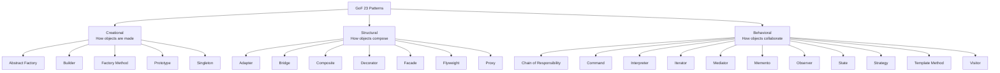

# GoF Design Patterns

## Why This Exists

**Problem.** In 1994, *Design Patterns: Elements of Reusable Object-Oriented Software* (Gamma, Helm, Johnson, Vlissides — "the Gang of Four") cataloged 23 recurring solutions to OO design problems. Three decades later, half of them are misapplied (Singleton everywhere, gratuitous AbstractFactory), a quarter are quietly built into modern languages (Iterator, Observer-as-streams, Strategy-as-lambda), and the rest still earn their keep. Engineers who've never read the book reinvent these patterns badly; engineers who only read the book apply them dogmatically.

**Key insight.** A pattern is a **named trade-off**, not a recipe. Each one trades complexity-now (an extra interface, an extra class, an extra layer) for flexibility-later (swap impls, add cases without modifying existing code, decouple lifetimes). If the "later" never arrives, you paid the cost for nothing — that's overengineering. The patterns are most useful as **vocabulary** for design discussions ("this looks like a Visitor problem, but the type set is open — let's not") and as a **diagnostic checklist** when a codebase smells.

**Reach for this when:**
- A junior says "let's use Strategy" and you need to decide if the abstraction is justified.
- A constructor takes 8+ params or instantiates 3+ collaborators (Builder / Factory / DI).
- You can't unit-test a class because it `new`s its dependencies (Factory Method / DI).
- A type hierarchy explodes combinatorially (`SUVDieselAWD`, `SUVDieselFWD`, ... — Bridge).
- An `if/elif` ladder over a type discriminator appears in 3+ places (Strategy / Visitor / polymorphism).
- You're integrating with a framework that doesn't fit your domain types (Adapter / Facade).
- An object's behavior depends on its current "mode" (State).
- You need to undo/redo, queue, log, or replay operations (Command / Memento).

**Don't reach for this when:**
- You have **one** implementation and **no concrete plan** for a second. Add the pattern when the second arrives.
- The language already provides the abstraction (Iterator in any language with `for x in ...`; Observer in any language with first-class functions or pub/sub libraries).
- You're using it as a status symbol ("look, I used Decorator!"). Pattern density is not a quality signal.
- The "flexibility" is to swap something that has never been swapped in the project's history (YAGNI — Fowler).
- You're in a small script or one-off tool. Patterns shine in **codebases that live for years and have multiple maintainers**.

## The 23, At a Glance



```mermaid
flowchart LR
  Need[I have a problem...] --> Q1{Object creation<br/>is messy?}
  Q1 -->|families of related objects| AF[Abstract Factory]
  Q1 -->|complex stepwise build| BU[Builder]
  Q1 -->|subclass picks the type| FM[Factory Method]
  Q1 -->|clone a configured instance| PR[Prototype]
  Q1 -->|exactly one instance globally| SI[Singleton<br/>(usually wrong)]

  Need --> Q2{Composing objects<br/>is awkward?}
  Q2 -->|incompatible interfaces| AD[Adapter]
  Q2 -->|abstraction × impl matrix| BR[Bridge]
  Q2 -->|tree of part-whole| CO[Composite]
  Q2 -->|stack behaviors at runtime| DE[Decorator]
  Q2 -->|simplify a subsystem| FA[Facade]
  Q2 -->|millions of fine-grained objs| FL[Flyweight]
  Q2 -->|surrogate / lazy / remote| PX[Proxy]

  Need --> Q3{Behavior changes<br/>or moves?}
  Q3 -->|swappable algorithm| ST[Strategy]
  Q3 -->|explicit state machine| SM[State]
  Q3 -->|operations on a fixed type set| VI[Visitor]
  Q3 -->|undo / queue / log requests| CM[Command]
  Q3 -->|fixed skeleton, varying steps| TM[Template Method]
  Q3 -->|N:M event coupling| OB[Observer]
  Q3 -->|reduce N:N coupling| ME[Mediator]
```

---

## Creational Patterns (5)

These patterns control **how** and **when** instances are produced. Most of them exist to break the rigid coupling that `new ConcreteThing()` introduces.

### 1. Abstract Factory

**Intent (GoF p. 87).** Provide an interface for creating *families* of related or dependent objects without specifying their concrete classes.

**Use when:** the system must work across multiple "themes" or "platforms" — e.g., a UI toolkit that produces matched Button + Window + Scrollbar for macOS *or* Windows; a database layer that produces matched Connection + Statement + ResultSet for Postgres *or* MySQL.

**Overengineered when:** you only have one family. A single concrete factory with one method does not need an abstract class above it.

```python
from abc import ABC, abstractmethod

class Button(ABC):
    @abstractmethod
    def render(self) -> str: ...

class Checkbox(ABC):
    @abstractmethod
    def render(self) -> str: ...

class MacButton(Button):
    def render(self): return "[macOS button]"
class MacCheckbox(Checkbox):
    def render(self): return "[macOS checkbox]"

class WinButton(Button):
    def render(self): return "[Win button]"
class WinCheckbox(Checkbox):
    def render(self): return "[Win checkbox]"

class GUIFactory(ABC):
    @abstractmethod
    def button(self) -> Button: ...
    @abstractmethod
    def checkbox(self) -> Checkbox: ...

class MacFactory(GUIFactory):
    def button(self): return MacButton()
    def checkbox(self): return MacCheckbox()

class WinFactory(GUIFactory):
    def button(self): return WinButton()
    def checkbox(self): return WinCheckbox()

# Client code is platform-agnostic
def render_dialog(f: GUIFactory) -> str:
    return f.button().render() + " " + f.checkbox().render()
```

**Modern note.** In languages with dependency injection containers (Spring, .NET DI, Guice, Dagger), the container *is* the abstract factory. You wire `MacFactory` or `WinFactory` once at startup and inject `Button` and `Checkbox` directly.

### 2. Builder

**Intent.** Separate the **construction** of a complex object from its **representation**, so the same construction process can create different representations.

**Use when:** an object has 5+ optional parameters; constructing it requires a sequence of steps; or the result type varies (e.g., the same recipe builds an HTML doc *or* a Markdown doc).

**Overengineered when:** you have 2-3 fields with sensible defaults — just use named arguments / a constructor.

```typescript
// Fluent Builder (the variant most code actually uses today)
class HttpRequest {
  constructor(
    readonly url: string,
    readonly method: "GET" | "POST" | "PUT" | "DELETE",
    readonly headers: Record<string, string>,
    readonly body: string | null,
    readonly timeoutMs: number,
    readonly retries: number,
  ) {}
}

class HttpRequestBuilder {
  private url = "";
  private method: HttpRequest["method"] = "GET";
  private headers: Record<string, string> = {};
  private body: string | null = null;
  private timeoutMs = 30_000;
  private retries = 0;

  to(url: string)            { this.url = url; return this; }
  method_(m: HttpRequest["method"]) { this.method = m; return this; }
  header(k: string, v: string){ this.headers[k] = v; return this; }
  jsonBody(obj: unknown)     { this.body = JSON.stringify(obj); return this.header("content-type", "application/json"); }
  timeout(ms: number)        { this.timeoutMs = ms; return this; }
  retry(n: number)           { this.retries = n; return this; }
  build(): HttpRequest {
    if (!this.url) throw new Error("url required");
    return new HttpRequest(this.url, this.method, this.headers, this.body, this.timeoutMs, this.retries);
  }
}

const req = new HttpRequestBuilder()
  .to("https://api.example.com/orders").method_("POST")
  .jsonBody({sku: "ABC", qty: 2}).timeout(5_000).retry(3).build();
```

**Modern note.** Kotlin/Scala/Python use **named/default arguments** for the same effect with less code. Java 14+ records + static factory methods cover most cases. The classic GoF Builder (with a separate Director) is rare; the **Joshua Bloch fluent builder** (*Effective Java*, item 2) dominates.

### 3. Factory Method

**Intent.** Define an interface for creating an object, but let subclasses decide which class to instantiate.

**Use when:** a base class has logic that needs to construct *something*, but doesn't know the concrete type (e.g., a `Document` class with `createPage()` deferred to `PdfDocument` vs `HtmlDocument`).

**Overengineered when:** there's no logic in the base class that uses the created object — just expose a constructor.

```java
abstract class Logger {
  abstract Sink createSink();           // factory method
  void log(String msg) {
    Sink s = createSink();              // base class uses it
    s.write(timestamp() + " " + msg);
  }
}
class FileLogger extends Logger {
  Sink createSink() { return new FileSink("/var/log/app.log"); }
}
class S3Logger extends Logger {
  Sink createSink() { return new S3Sink(bucket, key); }
}
```

**Difference from Abstract Factory.** Factory Method = **one** product, varies by subclass. Abstract Factory = **family** of products, varies by factory instance.

### 4. Prototype

**Intent.** Create new objects by **cloning** an existing prototype rather than instantiating from scratch.

**Use when:** instantiation is expensive (lots of config, network calls); you want runtime-configurable templates; the type system makes it hard to express the variants statically (e.g., game enemies parameterized over 30 stats).

**Overengineered when:** the object is cheap to construct or has clear ctor params. Also: deep-clone correctness is *hard* — a single shared mutable field becomes an aliasing bug.

```python
import copy
class Enemy:
    def __init__(self, hp, dmg, sprite, ai):
        self.hp, self.dmg, self.sprite, self.ai = hp, dmg, sprite, ai

# Configure once, clone many
goblin_template = Enemy(hp=20, dmg=3, sprite="goblin.png", ai=AggressiveAI())
spawned = [copy.deepcopy(goblin_template) for _ in range(50)]  # each independent
```

**Modern note.** JS uses prototypes natively (`Object.create`). Game engines (Unity prefabs, Unreal blueprints) are Prototype at scale.

### 5. Singleton

**Intent.** Ensure a class has only one instance and provide a global access point to it.

**Use when:** you need *exactly* one of something, lifecycle-tied to the process — e.g., a metrics registry, a connection pool. Even then, prefer **dependency injection of a single instance** over a global accessor.

**Overengineered / harmful when:** you reach for it because "globals are convenient." Singletons are global mutable state in disguise: they break testability, hide dependencies, complicate concurrency, and create initialization-order bugs across compilation units (the **C++ static initialization fiasco**).

> "Singleton is the easiest pattern to implement and the hardest to get right." — practitioner consensus; see *Clean Code* ch. 2 and Misko Hevery's *Singletons are Pathological Liars*.

```python
# Idiomatic Python: just use a module — modules are singletons
# config.py
_settings = None
def load(path: str): global _settings; _settings = parse(path)
def get() -> dict:
    if _settings is None: raise RuntimeError("config not loaded")
    return _settings
```

**Modern alternatives:** dependency-injection containers register a binding as `singleton scope`. Test frameworks then override it. You get one-instance semantics without the global accessor's costs.

---

## Structural Patterns (7)

These patterns govern **how objects are composed** to form larger structures.

### 6. Adapter (a.k.a. Wrapper)

**Intent.** Convert the interface of a class into another interface clients expect.

**Use when:** integrating a third-party library or legacy class whose API doesn't match yours; bridging a synchronous API into an async one; renaming methods to match a domain language.

**Overengineered when:** you control both sides. Just refactor.

```go
// Third-party logger we can't change
type ThirdPartyLog struct{}
func (l *ThirdPartyLog) Print(level int, fmt string, args ...any) { /*...*/ }

// Our domain interface
type Logger interface {
    Info(msg string)
    Error(msg string)
}

// Adapter
type ThirdPartyAdapter struct{ inner *ThirdPartyLog }
func (a *ThirdPartyAdapter) Info(msg string)  { a.inner.Print(1, "%s", msg) }
func (a *ThirdPartyAdapter) Error(msg string) { a.inner.Print(3, "%s", msg) }
```

### 7. Bridge

**Intent.** Decouple an abstraction from its implementation so the two can vary independently.

**Use when:** you have two orthogonal axes of variation (e.g., `Shape` × `Renderer`, `RemoteControl` × `Device`). Without Bridge, the Cartesian product becomes N×M classes (`BasicRemoteForTV`, `BasicRemoteForRadio`, `AdvancedRemoteForTV`, ...).

**Overengineered when:** there's only one axis or you have ≤ 2×2 combinations.

```typescript
// Implementor axis
interface Renderer { drawCircle(x: number, y: number, r: number): void; }
class CanvasRenderer implements Renderer { drawCircle(x, y, r) { /* HTML5 canvas */ } }
class SvgRenderer    implements Renderer { drawCircle(x, y, r) { /* SVG */ } }

// Abstraction axis — independent of how it's drawn
abstract class Shape {
  constructor(protected renderer: Renderer) {}
  abstract draw(): void;
}
class Circle extends Shape {
  constructor(r: Renderer, private x: number, private y: number, private radius: number) { super(r); }
  draw() { this.renderer.drawCircle(this.x, this.y, this.radius); }
}
// Add Square, add WebGLRenderer — no class explosion.
```

### 8. Composite

**Intent.** Compose objects into tree structures to represent part-whole hierarchies; let clients treat individual objects and compositions uniformly.

**Use when:** filesystems, DOM/AST, UI layouts, organizational charts, anything where "a thing or a group of things" needs the same operations.

**Overengineered when:** the hierarchy is shallow and fixed (depth ≤ 2).

```python
from abc import ABC, abstractmethod
from typing import List

class FsNode(ABC):
    @abstractmethod
    def size(self) -> int: ...

class File(FsNode):
    def __init__(self, n, sz): self.n, self.sz = n, sz
    def size(self): return self.sz

class Directory(FsNode):
    def __init__(self, n): self.n, self.children = n, []
    def add(self, c: FsNode): self.children.append(c); return self
    def size(self): return sum(c.size() for c in self.children)  # uniform!

root = Directory("/")
root.add(File("a.txt", 100)).add(
    Directory("sub").add(File("b.txt", 50)).add(File("c.txt", 25)))
print(root.size())  # 175
```

### 9. Decorator

**Intent.** Attach additional responsibilities to an object dynamically. A flexible alternative to subclassing.

**Use when:** you want to stack cross-cutting behaviors at runtime (compression, encryption, buffering, retries, caching, logging) — Java I/O streams are the canonical example.

**Overengineered when:** behaviors are static and known at compile time. A **mixin** or simple subclass is clearer. Watch out: decorator chains > 4 deep get hard to debug.

```python
class HttpClient:
    def get(self, url): return requests.get(url).text

class RetryDecorator:
    def __init__(self, inner, n=3): self.inner, self.n = inner, n
    def get(self, url):
        for i in range(self.n):
            try: return self.inner.get(url)
            except Exception:
                if i == self.n - 1: raise

class CacheDecorator:
    def __init__(self, inner): self.inner, self.cache = inner, {}
    def get(self, url):
        if url not in self.cache: self.cache[url] = self.inner.get(url)
        return self.cache[url]

client = CacheDecorator(RetryDecorator(HttpClient()))  # cache around retry around http
```

**Modern note.** Python decorators (`@retry`, `@cache`) are a syntactic sugar for *function* decoration. Same idea, different shape.

### 10. Facade

**Intent.** Provide a unified, simpler interface to a complex subsystem.

**Use when:** the subsystem has 10+ classes that clients shouldn't need to learn; you want to define a "convenient default" entry-point. The `requests` library is a Facade over `urllib3` + `http.client`.

**Overengineered when:** the subsystem is already small. Don't add a Facade just to "have one."

```python
# Without Facade: client touches 4 subsystems
ffmpeg = Ffmpeg(); s3 = S3Client(); db = Database(); notifier = Notifier()
def transcode_and_publish(video_id):
    src = s3.download(f"raw/{video_id}.mov")
    out = ffmpeg.transcode(src, "mp4", "720p")
    s3.upload(f"pub/{video_id}.mp4", out)
    db.set_status(video_id, "published")
    notifier.send(video_id, "ready")

# With Facade: one method, internals hidden
class VideoPipeline:
    def publish(self, video_id): ... # encapsulates all 4 calls + error handling
```

### 11. Flyweight

**Intent.** Use sharing to support large numbers of fine-grained objects efficiently. Split state into **intrinsic** (shared, immutable) and **extrinsic** (per-context, passed in).

**Use when:** millions of small objects with mostly-identical state — e.g., a text editor where each `Glyph` shares font/size but has distinct (x, y); a game where each tree shares mesh/texture but has distinct position.

**Overengineered when:** object count is in the thousands and memory isn't tight. The intrinsic/extrinsic split is intrusive.

```java
// Intrinsic: shared
final class GlyphStyle { final String font; final int size; final int color;
  GlyphStyle(String f, int s, int c) { font=f; size=s; color=c; } }

class GlyphFactory {
  private final Map<String, GlyphStyle> pool = new HashMap<>();
  GlyphStyle get(String f, int s, int c) {
    String key = f+"|"+s+"|"+c;
    return pool.computeIfAbsent(key, k -> new GlyphStyle(f, s, c));
  }
}
// Extrinsic: per-glyph (x, y, char) passed in at draw time
void draw(char ch, int x, int y, GlyphStyle style) { /* render */ }
```

**Modern note.** String interning, Java's `Integer.valueOf` cache (-128..127), CSS class deduplication — all Flyweight.

### 12. Proxy

**Intent.** Provide a surrogate or placeholder for another object to control access to it.

**Variants:**
- **Virtual proxy** — defer expensive creation (lazy loading; ORM lazy fields).
- **Remote proxy** — local stub for a remote object (gRPC stubs, Java RMI).
- **Protection proxy** — access control / authorization.
- **Smart reference** — ref-counting, locking on access.

**Use when:** you need to inject behavior on every method call to an object without modifying the object — caching, lazy init, RPC, security checks.

**Overengineered when:** a Decorator or Adapter does the job more clearly. Proxy and Decorator have the same *shape*; the *intent* differs (control access vs add behavior).

```python
class LazyImage:
    def __init__(self, path): self.path, self._real = path, None
    def _load(self):
        if self._real is None:
            print(f"loading {self.path}")  # expensive
            self._real = RealImage(self.path)
        return self._real
    def display(self): self._load().display()
```

---

## Behavioral Patterns (11)

These patterns govern **how objects communicate** and **how responsibilities are distributed**.

### 13. Chain of Responsibility

**Intent.** Pass a request along a chain of handlers; each decides to handle it or forward it.

**Use when:** middleware pipelines (HTTP), event-handling chains, approval workflows ($1k → manager, $10k → director, $100k → VP).

**Overengineered when:** the dispatch is static. A switch is clearer.

```typescript
type Handler = (req: Req, next: () => Resp) => Resp;
const auth: Handler = (req, next) => req.token ? next() : { code: 401 };
const ratelimit: Handler = (req, next) => over(req.ip) ? { code: 429 } : next();
const handler: Handler = (req, next) => ({ code: 200, body: process(req) });

const chain = [auth, ratelimit, handler];
function run(req: Req, i = 0): Resp { return chain[i](req, () => run(req, i+1)); }
```

**Modern note.** Express/Koa/ASP.NET middleware, Go's `http.Handler` chains, every web framework — Chain of Responsibility.

### 14. Command

**Intent.** Encapsulate a request as an object, letting you parameterize, queue, log, or undo it.

**Use when:** undo/redo (editors, CAD); job queues (Sidekiq, Celery); macro recording; transaction logs; CQRS write side.

**Overengineered when:** you just need to call a function. Don't wrap every method in a Command class.

```python
class Command(ABC):
    @abstractmethod
    def execute(self): ...
    @abstractmethod
    def undo(self): ...

class InsertText(Command):
    def __init__(self, doc, pos, text): self.doc, self.pos, self.text = doc, pos, text
    def execute(self): self.doc.insert(self.pos, self.text)
    def undo(self):    self.doc.delete(self.pos, len(self.text))

class History:
    def __init__(self): self.done, self.undone = [], []
    def do(self, cmd): cmd.execute(); self.done.append(cmd); self.undone.clear()
    def undo(self):
        if self.done: c = self.done.pop(); c.undo(); self.undone.append(c)
    def redo(self):
        if self.undone: c = self.undone.pop(); c.execute(); self.done.append(c)
```

### 15. Interpreter

**Intent.** Given a language, define a representation for its grammar and an interpreter that uses the representation to interpret sentences.

**Use when:** small DSLs — regex, SQL fragments, business-rule expressions, feature-flag predicates. **Rare**; modern projects reach for parser libraries (ANTLR, lark, parser combinators) or embed an existing language (Lua, Starlark).

**Overengineered when:** the "language" has < 10 productions or < 100 expressions in production. Just write code.

```python
# Mini boolean DSL
class Expr(ABC):
    @abstractmethod
    def eval(self, ctx: dict) -> bool: ...
class Var(Expr):
    def __init__(self, n): self.n = n
    def eval(self, ctx): return bool(ctx.get(self.n))
class And(Expr):
    def __init__(self, l, r): self.l, self.r = l, r
    def eval(self, ctx): return self.l.eval(ctx) and self.r.eval(ctx)
class Or(Expr):
    def __init__(self, l, r): self.l, self.r = l, r
    def eval(self, ctx): return self.l.eval(ctx) or self.r.eval(ctx)
# (premium AND active) OR vip
e = Or(And(Var("premium"), Var("active")), Var("vip"))
e.eval({"premium": True, "active": False, "vip": True})  # True
```

### 16. Iterator

**Intent.** Provide a way to access elements of an aggregate sequentially without exposing its underlying representation.

**Use when:** literally any time you traverse a collection. **This pattern won.** It's now built into every modern language.

**Modern reality.** `for x in collection` (Python), `for (T t : c)` (Java), `for x of c` (JS), `for x := range c` (Go). External iterators (`Iterator<T>`) and internal iterators (`forEach`, `map`, `filter`) coexist. The pattern is so internalized people don't think of it as a pattern.

### 17. Mediator

**Intent.** Define an object that encapsulates how a set of objects interact. Promotes loose coupling by keeping objects from referring to each other explicitly.

**Use when:** you have an N×N coupling problem — N classes each calling each other becomes O(N²) edges. A Mediator turns it into N→1 (each talks to mediator) — O(N) edges. Examples: a UI dialog where buttons disable each other based on field state; a chat room.

**Overengineered when:** N is small (≤ 4) or coupling is naturally hierarchical.

**Risk.** The mediator becomes a **god object** if it accumulates business logic. Keep it routing-only.

### 18. Memento

**Intent.** Capture and externalize an object's internal state so it can be restored later, without violating encapsulation.

**Use when:** undo, snapshots, save points, time-travel debugging, optimistic concurrency rollback.

**Overengineered when:** the object's state is already serializable and external. Just copy it.

```python
class Editor:
    def __init__(self): self._content = ""
    def type(self, s): self._content += s
    def snapshot(self) -> "Memento": return Memento(self._content)
    def restore(self, m: "Memento"): self._content = m.state

class Memento:
    def __init__(self, state): self.state = state  # opaque to client
```

### 19. Observer (Publish-Subscribe)

**Intent.** Define a one-to-many dependency between objects so that when one changes state, all dependents are notified and updated automatically.

**Use when:** event-driven UIs, reactive data flow, domain events, WebSocket fan-out, cache invalidation.

**Overengineered when:** there's a single subscriber and a single publisher in tight coupling. Just call the method.

**Pitfalls.** Memory leaks from subscribers that never unsubscribe; cycles (A observes B observes A); update storms; ordering ambiguity; exceptions in one subscriber affecting others.

```typescript
type Listener<T> = (event: T) => void;
class EventBus<T> {
  private subs = new Set<Listener<T>>();
  on(fn: Listener<T>): () => void { this.subs.add(fn); return () => this.subs.delete(fn); }
  emit(e: T) {
    for (const fn of [...this.subs]) {  // copy: subscribers may unsubscribe during emit
      try { fn(e); } catch (err) { console.error(err); }  // isolate failures
    }
  }
}
```

**Modern alternative.** Reactive streams (RxJS, Project Reactor, Akka Streams) generalize Observer with backpressure, error channels, and composition operators (`map`, `filter`, `debounce`). For domain events at distributed scale: a message broker (Kafka, SQS, NATS) — see `../../communication/message-queues/`.

### 20. State

**Intent.** Allow an object to alter its behavior when its internal state changes. The object will appear to change its class.

**Use when:** the same method behaves very differently depending on a "mode" — a connection (`Disconnected` / `Connecting` / `Connected` / `Closing`), an order (`Draft` / `Submitted` / `Paid` / `Shipped` / `Cancelled`), a TCP socket. If you find a 6-arm switch on `self.state` in 4 methods, this is your pattern.

**Overengineered when:** there are 2 states and 1 method that branches.

```python
class Order:
    def __init__(self): self._state: OrderState = Draft(self)
    def submit(self): self._state.submit()
    def pay(self):    self._state.pay()
    def ship(self):   self._state.ship()
    def cancel(self): self._state.cancel()
    def _set(self, s): self._state = s

class OrderState(ABC):
    def __init__(self, o): self.o = o
    def submit(self): raise InvalidTransition
    def pay(self):    raise InvalidTransition
    def ship(self):   raise InvalidTransition
    def cancel(self): self.o._set(Cancelled(self.o))

class Draft(OrderState):
    def submit(self): self.o._set(Submitted(self.o))
class Submitted(OrderState):
    def pay(self): self.o._set(Paid(self.o))
class Paid(OrderState):
    def ship(self): self.o._set(Shipped(self.o))
class Shipped(OrderState):
    def cancel(self): raise InvalidTransition  # too late
class Cancelled(OrderState): pass
```

### 21. Strategy

**Intent.** Define a family of algorithms, encapsulate each one, and make them interchangeable.

**Use when:** an algorithm varies independently from the clients that use it — sort comparators, compression algorithms, pricing rules, retry policies, auth schemes.

**Overengineered when:** there's only one algorithm and no concrete second one on the horizon.

**Modern collapse.** In any language with first-class functions, **a Strategy is a function**. Don't make a class hierarchy when a `Callable` works.

```python
# Classical Strategy: heavy
class CompressionStrategy(ABC):
    @abstractmethod
    def compress(self, data: bytes) -> bytes: ...
class GzipStrategy(CompressionStrategy):
    def compress(self, data): return gzip.compress(data)
class ZstdStrategy(CompressionStrategy):
    def compress(self, data): return zstd.compress(data)

# Modern equivalent: a function
def upload(data: bytes, compress: Callable[[bytes], bytes] = gzip.compress):
    s3.put(compress(data))
```

### 22. Template Method

**Intent.** Define the skeleton of an algorithm in a method, deferring some steps to subclasses. Subclasses redefine certain steps without changing the algorithm's structure.

**Use when:** you have a fixed sequence (`setUp → run → tearDown`) where steps vary — test frameworks (xUnit), build pipelines, ETL jobs, lifecycle hooks.

**Overengineered when:** a Strategy (composition over inheritance) fits. Inheritance is rigid; favor Strategy when steps are independent.

```python
class DataPipeline(ABC):
    def run(self):              # template method — fixed
        data = self.extract()
        clean = self.transform(data)
        self.load(clean)
        self.notify()           # hook with default
    @abstractmethod
    def extract(self): ...
    @abstractmethod
    def transform(self, data): ...
    @abstractmethod
    def load(self, data): ...
    def notify(self): pass      # optional override
```

### 23. Visitor

**Intent.** Represent an operation to be performed on the elements of an object structure. Lets you define a new operation without changing the classes of the elements.

**Use when:** the **set of types is closed** (a fixed AST: Add, Mul, Const, Var) and the **set of operations is open** (eval, pretty-print, optimize, type-check). Without Visitor, every new operation requires editing every node class.

**Overengineered when:** the type set is *open* (you keep adding new node types). Then Visitor is the wrong way around — adding a type forces editing every visitor. This is the **Expression Problem**: OO favors open type / closed operation; FP favors closed type / open operation. Pick the side that matches your domain.

```typescript
// Closed type set
interface Expr { accept<R>(v: Visitor<R>): R; }
class Num implements Expr { constructor(public n: number) {} accept<R>(v: Visitor<R>): R { return v.num(this); } }
class Add implements Expr { constructor(public l: Expr, public r: Expr) {} accept<R>(v: Visitor<R>): R { return v.add(this); } }
class Mul implements Expr { constructor(public l: Expr, public r: Expr) {} accept<R>(v: Visitor<R>): R { return v.mul(this); } }

// Open operation set — add EvalVisitor, PrintVisitor, OptimizeVisitor without touching Num/Add/Mul
interface Visitor<R> { num(e: Num): R; add(e: Add): R; mul(e: Mul): R; }
class EvalVisitor implements Visitor<number> {
  num(e) { return e.n; }
  add(e) { return e.l.accept(this) + e.r.accept(this); }
  mul(e) { return e.l.accept(this) * e.r.accept(this); }
}
class PrintVisitor implements Visitor<string> {
  num(e) { return `${e.n}`; }
  add(e) { return `(${e.l.accept(this)} + ${e.r.accept(this)})`; }
  mul(e) { return `(${e.l.accept(this)} * ${e.r.accept(this)})`; }
}
```

**Modern note.** In Scala/Kotlin/Rust/Swift, **sealed classes + pattern matching** subsume Visitor with less ceremony. Add a new operation = a new function with a `match`. Add a new type = the compiler tells you every match site to update.

---

## How Patterns Shifted Post-OOP

The 1994 book assumed a Smalltalk/C++ world: no closures, no generics (in C++ templates were primitive), no DI containers, no language-level pattern matching. Many patterns were paper over those gaps. After 2000, languages absorbed the patterns:

| GoF Pattern        | What replaces it in modern languages                              |
| ------------------ | ----------------------------------------------------------------- |
| Iterator           | `for ... in`, generators, `Iterable` protocol, lazy sequences     |
| Strategy           | First-class functions, lambdas, function types                    |
| Command            | Closures, partial application, message records                    |
| Observer           | Reactive streams (RxJS, Reactor), event emitters, signals         |
| Template Method    | Higher-order functions taking step callbacks                      |
| Singleton          | DI container scope, module-level state                            |
| Abstract Factory   | DI container, builder + interface                                 |
| Factory Method     | Static factory functions; constructor injection                   |
| Visitor            | Pattern matching on sealed/algebraic types                        |
| Prototype          | Built-in: JS prototypes, Python `copy.deepcopy`, Lua metatables   |
| Interpreter        | Parser combinators, ANTLR, embedded DSLs, tree-sitter             |
| Decorator          | Function decorators, middleware, mixins                           |
| Chain of Resp.     | Middleware (Express, Koa, ASP.NET), Go `http.Handler` chains      |
| Adapter, Bridge, Composite, Facade, Flyweight, Proxy, Mediator, Memento, State | Still mostly hand-rolled; they're structural enough that no language eliminates them |

**The "patterns are smells" critique.** Peter Norvig (1996) showed that 16 of the 23 patterns disappear or simplify in Lisp/Dylan because closures, multiple dispatch, and macros do the work. Paul Graham echoed this. The honest reading: **patterns describe the gap between your language and your problem.** A pattern-heavy codebase in Java is normal; the same density in Clojure or Haskell or modern Kotlin suggests you're fighting the language.

**The patterns that aged best.**
- **Adapter, Facade, Proxy, Decorator** — interface manipulation; every codebase needs them.
- **Composite, Iterator** — universal data-structure shapes.
- **State, Command** — explicit machinery that subtle conditionals only obscure.
- **Strategy, Observer** — alive, but in functional clothes.

**The patterns to use sparingly.**
- **Singleton** — usually a code smell; prefer DI.
- **Prototype** — language-built-in or use a builder.
- **Interpreter** — use a real parser.
- **Visitor** — use sum types + pattern matching where the language allows.

---

## Trade-offs

| Benefit gained                                           | Cost paid                                                                |
| -------------------------------------------------------- | ------------------------------------------------------------------------ |
| Decoupled abstraction from impl (Bridge, Strategy, Adapter) | Indirection — stack traces deeper, "find usages" needs more hops      |
| Open for extension, closed for modification (Visitor, Strategy) | Class count grows; new files to read for each variant            |
| Testability — inject fakes (Factory, Strategy, Adapter)  | More interfaces to maintain; risk of "interface for one impl" smell      |
| Runtime composition (Decorator, Chain of Responsibility) | Order-of-application bugs; harder to reason about flow statically        |
| Encapsulated state machines (State, Command)             | More objects per operation; allocation overhead in hot paths             |
| Shared common vocabulary across teams                    | Risk of pattern fundamentalism — naming things "ThingFactoryStrategy"    |
| Supports undo/redo/queue/log (Command, Memento)          | Memory cost of state snapshots; serialization complexity                 |
| Fan-out without coupling (Observer)                      | Memory leaks if listeners aren't unsubscribed; debugging fan-out is hard |

---

## Common Pitfalls

- **Patternitis.** Sprinkling patterns to demonstrate sophistication. The test: remove the pattern — does anything *concrete* break? If not, it was decorative.
- **AbstractFactoryFactoryProvider.** Stacking creational patterns without a real second variant. Speculative generality (Fowler).
- **Singleton for "convenience."** Hides dependencies, breaks tests, creates init-order bugs (especially in C++ and JVM static blocks). Use DI single-scope binding instead.
- **Visitor with an open type set.** Each new node type forces editing every visitor — you've inverted your problem. Switch to OO polymorphism (method on the node) or sum types + pattern matching.
- **Decorator stacks 6 deep.** "Where does the request actually happen?" becomes a mystery. Cap depth; document the chain; consider a single class with config flags if the variation isn't truly orthogonal.
- **Observer leaks.** Listener never unsubscribes → object retained → memory grows. Use weak references or scope-bound subscriptions; in UI frameworks, tie subscription to component lifecycle.
- **Mediator becomes God Object.** It starts as a router, accumulates business logic, ends up as a 4000-line `AppMediator`. Keep it routing-only or split it.
- **Strategy class hierarchy when a function suffices.** In Python/JS/Kotlin/Swift/Go, just pass a function. Reserve the class form for strategies with state or multiple methods.
- **State machine via boolean flags.** `isLoading && !isError && hasData` — illegal states are representable. Make it an explicit State pattern or sum type.
- **Builder for 3 fields.** Use named/default args.
- **Adapter as an excuse to not refactor.** If you control both sides, fix the API; don't paper over it forever.
- **"It's just like the book."** The book's examples are illustrative, not prescriptive. Adapt to your language and constraints.

---

## Decision Table

| Situation                                                     | Use this                          | Don't use this              | Why                                                                 |
| ------------------------------------------------------------- | --------------------------------- | --------------------------- | ------------------------------------------------------------------- |
| Family of related products varying by platform                | Abstract Factory                  | Factory Method              | Multiple products, not one                                          |
| Single product whose subclass picks the impl                  | Factory Method                    | Abstract Factory            | One product axis                                                    |
| 8+ optional construction params                               | Builder (fluent)                  | Telescoping ctors           | Readability + invariants at `build()`                               |
| Need exactly one instance, lifecycle = process                | DI container `singleton` scope    | Classic Singleton           | Testability                                                         |
| Mismatched interfaces between owned + external code           | Adapter                           | Modify the external code    | You don't own it                                                    |
| 2 axes: abstraction × implementation, both growing            | Bridge                            | Subclass per combination    | Avoid N×M class explosion                                           |
| Tree of part-whole, uniform ops                               | Composite                         | Type-checking switches      | Polymorphism subsumes the cases                                     |
| Stack runtime behaviors orthogonally                          | Decorator / middleware            | Subclass explosion          | Composition over inheritance                                        |
| Wrap subsystem with a friendlier API                          | Facade                            | Expose internals            | Encapsulation                                                       |
| Millions of fine-grained objects, mostly identical            | Flyweight                         | Naive allocation            | Memory                                                              |
| Defer expensive instantiation; cross network                  | Proxy (virtual / remote)          | Construct eagerly           | Latency / cost                                                      |
| Algorithm varies independently from clients                   | Strategy (function in modern lang) | Class hierarchy if 1 impl  | YAGNI                                                               |
| Fixed algorithm skeleton, varying steps                       | Template Method *or* Strategy      | Either-or; prefer Strategy | Composition more flexible                                           |
| Operation on closed type set, open op set                     | Visitor (or sum types + match)    | Add methods to each node    | Open op set means new ops shouldn't touch nodes                     |
| Operation on open type set, closed op set                     | Polymorphism (method on type)     | Visitor                     | New types in OO is the easy axis                                    |
| Object behavior depends on a "mode"                           | State                             | Switch on enum in 5 methods | One source of truth for transitions                                 |
| Need undo / queue / log of operations                         | Command                           | Direct method call          | Captures intent as data                                             |
| 1:N event broadcast within a process                          | Observer / event emitter          | Polling                     | Push semantics                                                      |
| 1:N events across processes / services                        | Message broker (Kafka/SQS/NATS)   | In-process Observer         | Durability, fan-out, decoupling                                     |
| Parsing a small DSL                                           | Parser combinators / ANTLR        | Hand-rolled Interpreter     | Existing tools, error reporting                                     |
| Reduce N×N coupling between widgets                           | Mediator                          | Direct refs everywhere      | Linearizes dependencies                                             |
| Snapshot object state for restore                             | Memento                           | Serialize the whole world   | Encapsulation                                                       |
| Pipeline of optional handlers each may short-circuit          | Chain of Responsibility           | One mega-method             | Composability + ordering                                            |

---

## References

**Primary sources**
- Erich Gamma, Richard Helm, Ralph Johnson, John Vlissides — *Design Patterns: Elements of Reusable Object-Oriented Software* (Addison-Wesley, 1994). The book itself. Chapters: Creational pp. 81–134; Structural pp. 135–206; Behavioral pp. 221–344.
- Joshua Bloch — *Effective Java*, 3rd ed. (Addison-Wesley, 2018). Items 1–9 cover Builder, static factories, Singleton hazards, Prototype.
- Robert C. Martin — *Clean Code* (Prentice Hall, 2008). Chapter on emergent design and the cost of premature abstraction.
- Martin Fowler — *Refactoring*, 2nd ed. (Addison-Wesley, 2018). Section on "Speculative Generality" smell — https://martinfowler.com/bliki/SpeculativeGenerality.html
- Peter Norvig — *Design Patterns in Dynamic Programming* (1996 OOPSLA tutorial). Argues 16/23 patterns simplify in dynamic languages — https://norvig.com/design-patterns/
- Paul Graham — *Revenge of the Nerds* (2002). On patterns as missing language features — http://www.paulgraham.com/icad.html
- Misko Hevery — *Singletons are Pathological Liars* (2008) — https://testing.googleblog.com/2008/08/by-miko-hevery-so-you-join-new-project.html
- Eric Freeman, Elisabeth Robson — *Head First Design Patterns*, 2nd ed. (O'Reilly, 2020). The most accessible pattern primer.

**Adjacent**
- Philip Wadler — *The Expression Problem* (1998). The fundamental tension Visitor addresses — https://homepages.inf.ed.ac.uk/wadler/papers/expression/expression.txt
- Fowler — *Patterns of Enterprise Application Architecture* (Addison-Wesley, 2003). Patterns at the system level (Repository, Unit of Work, Service Layer) — https://martinfowler.com/eaaCatalog/
- Christopher Alexander — *A Pattern Language* (1977). The original "patterns" idea, from architecture, that GoF borrowed.
- Dependency Inversion Principle (Robert C. Martin) — https://web.archive.org/web/20110714224327/http://www.objectmentor.com/resources/articles/dip.pdf
- AWS Builders' Library — https://aws.amazon.com/builders-library/ (operational patterns at distributed scale; complements GoF's in-process focus)

---

## See Also

- `../solid/` — the design principles that justify when a pattern is worth its cost
- `../refactoring-catalog/` — Fowler's catalog of refactorings that introduce/remove these patterns safely
- `../code-smells/` — the symptoms (long parameter list, switch statements, divergent change) these patterns address
- `../solid/` — modern wiring that subsumes Singleton, Abstract Factory, and Factory Method
