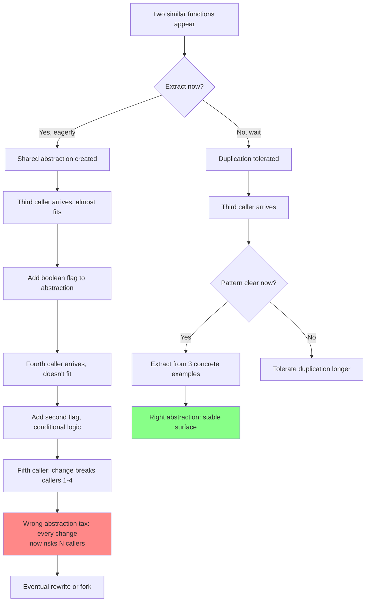
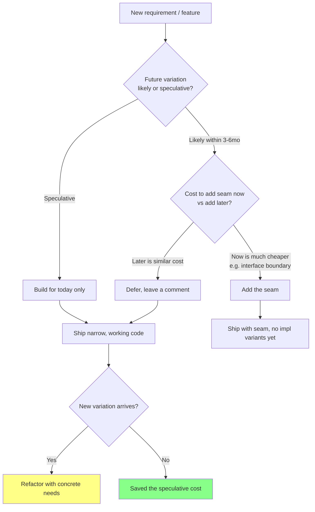

# DRY, KISS, YAGNI: Three Principles That Lie To You

## Why This Exists

**Problem.** DRY, KISS, and YAGNI are the most quoted, least understood principles in software. Every junior engineer can recite them. Every senior engineer has watched them destroy a codebase. They're not laws — they're heuristics with sharp edges, and they actively contradict each other in ways nobody warns you about.

- **DRY** says "extract common code." But premature extraction creates the **wrong abstraction**, which is more expensive than duplication.
- **KISS** says "keep it simple." But "simple" is observer-relative — simple-to-write is often complex-to-extend, and vice versa.
- **YAGNI** says "don't build for the future." But ignored architectural seams turn a 2-week change into a 6-month rewrite.

**Key insight.** These principles are about **regret minimization under uncertainty**, not absolute rules. The cost of being wrong is asymmetric and depends on which way you err:

| Principle | Cheap to undo | Expensive to undo |
|---|---|---|
| **DRY** | Removing duplication later (small refactor) | Removing a wrong abstraction (rewrites callers) |
| **KISS** | Adding complexity later (additive) | Removing complexity already depended on (subtractive) |
| **YAGNI** | Adding a feature later (additive) | Removing speculative scaffolding (kills callers) |

In all three, **the additive direction is cheap; the subtractive direction is expensive.** That asymmetry is the entire game. Default to the cheap-to-undo side.

**Reach for this when:**
- You're about to extract a "shared util" across two callers that look similar.
- A teammate proposes a config-driven framework to "make future cases easy."
- A code review thread is arguing about whether two 8-line functions should be merged.
- You inherited a codebase with `BaseAbstractFactoryAdapterImpl` and cannot understand the call graph.
- A "small" feature requires touching 14 files because of inheritance hierarchies that don't match the change.
- You're estimating a project and someone says "let's build it generically so we don't have to redo it."

**Don't reach for this when:**
- You need specific refactoring mechanics (use `../refactoring-catalog/` instead).
- You're choosing between architectural styles like microservices vs monolith.
- The duplication is **literal byte-for-byte identical** in the same module — that's just sloppy; dedupe it.
- You're working in a domain with regulatory requirements where "the same logic" is law (tax, billing) — duplication there is a real bug, not a stylistic choice.

---

## Diagrams

### The Wrong-Abstraction Lifecycle



### YAGNI vs Designing-For-Change Decision



---

## The Wrong-Abstraction Tax (DRY's Failure Mode)

Sandi Metz: **"Duplication is far cheaper than the wrong abstraction."** The full essay (cited below) is required reading. The mechanics:

1. Two functions look 80% similar. Engineer extracts a shared `process()`.
2. A third caller arrives. It's 75% similar to the abstraction. Engineer adds a `mode` parameter.
3. A fourth caller. Different in another dimension. Engineer adds another flag.
4. Now `process()` has 4 booleans, 16 implicit code paths, and changing it for caller 5 risks breaking callers 1–4.
5. **Cost of every future change scales with the number of callers, not the size of the change.**

Compare to duplication:
- 4 copies, each ~30 lines.
- Change for caller 5? Touch only caller 5's copy. Other callers are isolated.
- Cost is bounded by the size of the change, not the blast radius.

The crossover point — where dedup becomes cheaper than duplication — is **further out than your instincts say**, especially when the callers are owned by different teams or evolve at different cadences.

### Concrete example: payment processors that diverged

```python
# Year 1: looks like obvious DRY candidate.
def charge_stripe(order):
    amount_cents = order.total * 100
    return stripe.Charge.create(amount=amount_cents, currency="usd",
                                source=order.token, description=order.id)

def charge_braintree(order):
    amount_cents = order.total * 100
    return braintree.Transaction.sale({"amount": amount_cents,
                                       "payment_method_nonce": order.token,
                                       "order_id": order.id})

# Engineer "DRYs" it:
def charge(processor, order):
    amount_cents = order.total * 100
    if processor == "stripe":
        return stripe.Charge.create(amount=amount_cents, ...)
    elif processor == "braintree":
        return braintree.Transaction.sale({"amount": amount_cents, ...})

# Year 2: Stripe adds idempotency keys (mandatory for retries).
# Year 2: Braintree adds 3DS (mandatory for EU).
# Year 2: We add a third processor (Adyen) that uses minor-units-from-currency,
#         not always *100 (JPY has no minor units, KWD has 3 decimal places).
# Year 2: Refunds, partial captures, multi-currency, retries-with-jitter — all differ.

def charge(processor, order, idempotency_key=None, three_ds_token=None,
           currency=None, partial=False, retry_count=0, ...):
    # 200 lines, 11 parameters, 6 branches deep.
    # Every change risks every processor.
```

What we should have done: kept three separate implementations, extracted *only* the **truly stable** primitives (currency-to-minor-units, retry-with-jitter) into pure helpers that *don't know about processors*.

```python
# Stable, narrow, side-effect-free helpers — DRY where it actually pays:
def to_minor_units(amount_decimal, currency_code):
    exponent = ISO_4217_MINOR_UNITS[currency_code]  # JPY=0, USD=2, KWD=3
    return int(amount_decimal * (10 ** exponent))

def retry_with_jitter(fn, max_attempts=3, base_ms=100):
    # Pure, generic, no payment knowledge.
    ...

# Three processors stay separate. Each owns its quirks.
class StripeProcessor:
    def charge(self, order, idempotency_key): ...
class BraintreeProcessor:
    def charge(self, order, three_ds_token): ...
class AdyenProcessor:
    def charge(self, order): ...
```

**Rule of thumb (the Rule of Three):** Don't extract until you have **three concrete examples**, and the abstraction is obvious in hindsight. Two data points fit any line; three constrain the shape.

### How to spot the wrong abstraction

- The shared function/class has **boolean parameters that change behavior** (`is_admin`, `legacy_mode`, `skip_validation`). Each one is evidence the abstraction doesn't fit.
- Bug fixes require touching the abstraction *and* every caller.
- New callers require either a new flag or a fork.
- Reading any caller requires reading the abstraction's source to know what it actually does.
- The abstraction's name is a meaningless noun: `Manager`, `Helper`, `Util`, `Processor`, `Handler`.

---

## KISS: Simple For Whom?

KISS is the slipperiest of the three because **"simple" has no fixed referent**. Rich Hickey's "Simple Made Easy" is the canonical disambiguation: *simple* means **un-braided** (one concept, one concern), not *easy* (familiar, near-to-hand).

A 2,000-line file with no abstractions is *easy* to write but *complex* to reason about — every line can affect every other. A factory-of-builders-of-strategies is *simple* in the small (each piece is one concept) but *not easy* — you need to hold the whole graph in your head.

Practical KISS:

1. **Prefer functions to classes** until state demands otherwise.
2. **Prefer pure functions to side-effects** until you need IO.
3. **Prefer concrete types to interfaces** until you have ≥2 implementations.
4. **Prefer inlined logic to callbacks** until you need pluggability.
5. **Prefer flat code to deep nesting.** If you have 4+ indentation levels, extract.

```typescript
// Easy to write, complex to reason about: deep nesting, mixed concerns.
function processOrder(order: Order) {
  if (order.items.length > 0) {
    if (order.user.verified) {
      if (order.payment.status === "authorized") {
        for (const item of order.items) {
          if (item.inventory > 0) {
            // ... 40 more lines, 6 levels deep
          } else {
            // backorder logic mixed in
          }
        }
      } else {
        // payment retry logic mixed in
      }
    }
  }
}

// Simple (un-braided), each function does one thing.
function processOrder(order: Order) {
  assertHasItems(order);
  assertUserVerified(order.user);
  assertPaymentAuthorized(order.payment);
  const [available, backordered] = splitByInventory(order.items);
  fulfillAvailable(available);
  scheduleBackorder(backordered);
}
```

The second is **longer in line count** but **shorter in cognitive load per line**. KISS optimizes for the second metric, not the first.

### KISS anti-patterns

- **Cleverness for its own sake.** A regex that does the work of 30 lines but takes 30 minutes to read. The regex is shorter; the code is more complex.
- **One-liner chains.** `users.filter(...).map(...).reduce(...).flat().sort()` is fine until it's 11 stages deep and one stage has a side effect.
- **Implicit-everything.** Magic dependency injection, decorators that mutate global state, monkey-patches at import time. The code is shorter; the system is harder to understand.

---

## YAGNI: Speculative Generality Tax

YAGNI was named by Ron Jeffries in the XP era. The slogan compresses a hard-won lesson: **most of the variation you imagine in advance never materializes**, and the scaffolding you build for it has ongoing carrying costs.

Costs of speculative generality:
- **Code volume**: more code = more bugs, more compile time, more onboarding.
- **Misdirected abstraction**: you guessed the future wrong, so when the real requirement arrives, the seams are in the wrong places.
- **Cognitive overhead**: every reader has to understand the unused machinery to know whether their change interacts with it.
- **Test surface**: untested code paths rot; tested-but-unused code paths cost CI minutes forever.

```java
// YAGNI violation: built for "any storage backend" with one backend in 3 years.
public interface OrderStorage {
    void save(Order o);
    Order load(String id);
    List<Order> query(QueryDSL q);
}
public class OrderStorageFactory { /* picks impl from config */ }
public class PostgresOrderStorage implements OrderStorage { ... }
public class InMemoryOrderStorage implements OrderStorage { ... } // only used in tests
public class FileOrderStorage implements OrderStorage { ... }     // never used in prod
public class S3OrderStorage implements OrderStorage { ... }       // built "for the future"

// What we actually needed for 3 years:
public class OrderRepository {
    private final JdbcTemplate jdbc;
    public void save(Order o) { ... }
    public Order load(String id) { ... }
    public List<Order> findByUser(String userId) { ... } // only query we ever ran
}
```

When the second backend *does* eventually arrive, you extract the interface from two concrete implementations — and the seams are in the right place because they came from real callers, not imagined ones.

### YAGNI vs designing for change

YAGNI is **not** "ignore architecture." Some seams are nearly free to add up front and very expensive to retrofit:

| Cheap to add later (apply YAGNI, defer) | Expensive to retrofit (add the seam now) |
|---|---|
| Configurable retry counts | Process boundaries (service vs library) |
| New CLI flags | Async vs sync API contracts |
| Additional DB indexes | Wire-format / schema versioning |
| New endpoints on existing service | Multi-tenancy in the data model |
| Caching layers | Auth/authz model (per-row, per-tenant, etc.) |
| Logging verbosity | Encryption-at-rest key scoping |
| Internal code organization | Public API surface (once shipped, you own it) |

Heuristic: if reversing the decision requires **changing every caller across team boundaries**, lean toward adding the seam. If reversing requires editing one file, defer.

DDIA Chapter 1 frames this as **operability, simplicity, evolvability**. YAGNI optimizes for simplicity *now*; evolvability requires keeping reversible options open *for things you can't reverse cheaply later*.

---

## How These Principles Lie To You

### DRY's lies

1. **"This duplication is the same."** It looks the same today. The two callers serve different domains and will diverge tomorrow. Coincidental duplication is not real duplication.
2. **"Extracting will save effort."** The extraction is cheap; the **maintenance under varying requirements** is what costs you. Hunt & Thomas's *Pragmatic Programmer* (1st ed., section "The Evils of Duplication") clarifies that DRY is about **knowledge**, not about lines of text. Two functions that look the same but represent different business rules are not violations of DRY.
3. **"More DRY is better."** No. DRY has a curve with a maximum. Past the peak, every extraction costs more than it saves.

### KISS's lies

1. **"This is simple."** It's simple *to you, today*, with the context fresh. Read it again in 6 months. Read it as a new hire. Simple is observer-relative.
2. **"Fewer lines = simpler."** Wrong axis. Cognitive load per line is what matters. A 5-line function with 4 implicit dependencies is more complex than a 50-line function that's a straight pipeline.
3. **"Use the language's clever feature."** Metaclasses, decorators, operator overloading, macros — they reduce typing and increase complexity. Use them only where the alternative is clearly worse.

### YAGNI's lies

1. **"We'll add it later."** Some things are 100x cheaper to add at design time (multi-tenancy, schema versioning, async boundaries). YAGNI doesn't apply uniformly.
2. **"This is over-engineering."** Sometimes "over-engineering" is a strawman for *thinking ahead about reversibility*. The question isn't "do we need it now?" but "what's the asymmetry of being wrong?"
3. **"Just ship the MVP."** Yes — but the MVP for an internal tool used by 5 people is a different MVP than for a public API used by 10,000 customers. YAGNI is calibrated against blast radius.

---

## Trade-offs

| Benefit | Cost |
|---|---|
| DRY: single source of truth → bug fixes propagate everywhere | Wrong abstraction → bug fixes break unrelated callers |
| DRY: less code to maintain | More coupling between callers; reasoning requires more context |
| KISS: easier onboarding, faster debugging | "Simple" code may have more lines, more files |
| KISS: less hidden machinery → predictable behavior | May feel verbose to experienced authors; lacks framework leverage |
| YAGNI: less code now, faster ship | Some retrofits are 10–100x more expensive than upfront seams |
| YAGNI: avoids speculative-generality tax | Requires courage to defer "obvious" abstractions until the third example |
| Tolerated duplication: bounded blast radius for changes | Inconsistencies can drift; e.g., one validator updated, others not |
| Inlined logic: easier to read top-to-bottom | Repeated edits if the inline pattern actually is shared knowledge |

---

## Common Pitfalls

- **Extracting after two examples.** Two data points fit any curve. Wait for three. The *Pragmatic Programmer* "Rule of Three" predates Sandi Metz but expresses the same instinct.
- **Naming abstractions with generic nouns.** `OrderManager`, `DataProcessor`, `RequestHandler`. If you can't name it specifically, you don't yet understand what it abstracts. Bad name → bad abstraction.
- **Sharing code across team boundaries.** A "shared util" library owned by no team is a graveyard. When team A's bug fix breaks team B, nobody owns the resolution. Prefer duplication across team boundaries; share within.
- **Coincidental duplication.** Two `validateUser()` functions that look identical but enforce different business rules (one for signup, one for password reset). Merging them creates bugs the first time the rules diverge.
- **Extracting "for testability."** If you extract because you can't test the original, the original is probably structured wrong. Fix the structure (dependency injection, pure functions) before extracting prematurely.
- **DRY-ing config or constants in different domains.** `MAX_RETRY = 3` for the payment service and `MAX_RETRY = 3` for the email service look the same; merging them couples two unrelated knobs. Different knobs that happen to have the same value are not duplication.
- **Speculative parameterization.** Adding `Optional<T>` parameters "in case we need them" creates a combinatorial test space and hides intent. Default values lie about which combinations are tested.
- **Refactoring without callers' consent.** Extracting a shared abstraction across services that other teams depend on, without coordination, becomes an outage waiting to happen.
- **The "framework refactor."** "Let's rebuild the validators as a config-driven framework." Three months later: the framework supports 80% of cases, the remaining 20% need escape hatches, and the original code was 200 lines.
- **Confusing YAGNI with "no design."** YAGNI says "don't build speculative features." It does not say "don't think about boundaries, names, and contracts." Those cost nothing extra and pay off forever.
- **Ignoring Conway's Law.** A "shared" abstraction across teams with different release cadences is a coordination bottleneck. The right design follows the org chart for a reason.

---

## Decision Table

| Situation | Apply | Reasoning |
|---|---|---|
| Two functions look 80% similar, in same module, owned by same team | **Wait** (tolerate duplication) | Need a third example to confirm the shape; same team can refactor cheaply later |
| Two functions look 80% similar, owned by different teams | **Duplicate** | Cross-team coupling is expensive; let each team own its copy |
| Three+ concrete examples with clearly common stable core | **DRY** the core | Three points constrain the shape; abstract only the truly-shared part |
| Function has 3+ boolean parameters that change behavior | **Split** | Wrong abstraction; each boolean is a hint of a missing distinct function |
| "We might need to support X someday" | **YAGNI** (defer) | Speculation; revisit when X is concrete |
| "We will need to support X in Q3, it's on the roadmap" | **Design the seam now** | Concrete near-term need; cheaper to add up front |
| "We need to support multi-tenancy eventually" | **Add the seam now** | Retrofitting tenancy across the data model is 10–100x more expensive later |
| "Should this be a service or a library?" | **Library first** | Service boundary is hard to undo; library can be extracted later |
| "Should we add this config flag?" | **YAGNI** unless 2+ users want different values | Each flag doubles the test matrix |
| Code has 4+ levels of nesting | **KISS-extract** | Cognitive load is too high; break into named steps |
| One-liner with 5+ chained operations | **KISS-split** | Hard to debug, hard to test intermediate stages |
| "Let's make this generic / config-driven" | **Don't** until you have 3 concrete callers | Premature framework; escape hatches will dominate |
| Bug fix requires changing 6 places that "should have been DRY" | **DRY now** | The duplication has cost you; you have ≥3 callers and a clear pattern |
| Library API for external consumers | **Design carefully**, even if YAGNI in internals | Public API is hard to change; internals are not |
| Internal helper used by one caller | **YAGNI / KISS**: keep narrow | No leverage from generality |

---

## How to Apply These In Code Review

When you see a proposed abstraction, ask:

1. **How many real callers does it have today?** <3 → push back.
2. **Are the callers in the same domain / lifecycle?** No → push back.
3. **Does the abstraction's name describe what it *does*, not what it *is*?** No → push back.
4. **Does it have boolean flags that change behavior?** Yes → push back.
5. **What does the worst-case future change look like?** If it requires editing the abstraction *and* every caller, the abstraction isn't paying for itself.

When you see proposed YAGNI deferral:

1. **What's the cost to add this seam later?** If "rewrite all callers across teams" → add the seam now.
2. **Is the variation concrete (in a ticket) or speculative (in someone's head)?** Speculative → defer.
3. **Does the seam cost anything beyond a function boundary?** No → essentially free, add it.

When you see a "simple" solution:

1. **Simple for whom?** New hire reading it cold.
2. **Simple in the small or in the large?** A clever one-liner can make the system harder to understand.
3. **What's the cognitive load per line?** That's the metric, not line count.

---

## References

Primary sources:

- Sandi Metz — *The Wrong Abstraction* — https://sandimetz.com/blog/2016/1/20/the-wrong-abstraction
- Sandi Metz — RailsConf 2014 keynote *"All the Little Things"* (the duplication-vs-wrong-abstraction talk) — https://www.youtube.com/watch?v=8bZh5LMaSmE
- Andy Hunt & Dave Thomas — *The Pragmatic Programmer* (20th Anniversary Ed., Addison-Wesley 2019) — sections "The Evils of Duplication" (DRY), "Tracer Bullets," "Programming by Coincidence." Original 1999 edition introduced DRY.
- Martin Fowler — *Refactoring* (2nd ed., 2018) — chapters on "Bad Smells in Code" (esp. Speculative Generality, Duplicated Code, Long Parameter List) and "Composing Methods."
- Martin Fowler — *Yagni* — https://martinfowler.com/bliki/Yagni.html
- Martin Fowler — *PrematureGeneralization* / *SpeculativeGenerality* (bliki) — https://martinfowler.com/bliki/
- Ron Jeffries — *You're NOT gonna need it!* (XP / YAGNI origin) — https://ronjeffries.com/xprog/articles/practices/pracnotneed/
- Rich Hickey — *Simple Made Easy* (Strange Loop 2011) — https://www.infoq.com/presentations/Simple-Made-Easy/
- Kent Beck — *Tidy First?* (O'Reilly 2023) — small, reversible refactorings as a counter to over-engineering.
- Robert C. Martin — *Clean Code* (Prentice Hall 2008) — chapters on Functions, Classes, Boundaries; treat critically alongside Metz.
- Hyrum Wright — *Hyrum's Law* — https://www.hyrumslaw.com/ — relevant to public API surfaces and YAGNI calibration.
- John Ousterhout — *A Philosophy of Software Design* (2018, 2nd ed. 2021) — chapters on "Modules Should Be Deep," "Define Errors Out of Existence," "Pull Complexity Downwards." Strong counter-perspective to small-functions dogma.
- Martin Kleppmann — *Designing Data-Intensive Applications* (O'Reilly 2017) — Chapter 1 "Reliable, Scalable, and Maintainable Applications" (esp. *Evolvability* on designing for change vs YAGNI).
- Google SRE Book — Chapter 12 "Effective Troubleshooting" and Chapter 22 "Addressing Cascading Failures" — illustrate how shared abstractions amplify failures — https://sre.google/sre-book/table-of-contents/
- AWS Builders' Library — *Avoiding insurmountable queue backlogs* and *Avoiding fallback in distributed systems* — https://aws.amazon.com/builders-library/ — practical examples of where "shared" / "fallback" abstractions hurt.
- Pat Helland — *Life Beyond Distributed Transactions: An Apostate's Opinion* — https://queue.acm.org/detail.cfm?id=3025012 — on entity-scoped reasoning, indirectly informs why cross-entity DRY is risky.

---

## See Also

- `../refactoring-catalog/` — concrete mechanics for extracting, inlining, and splitting once you've decided to act.
- `../code-smells/` — the catalog (Speculative Generality, Shotgun Surgery, Long Parameter List, Divergent Change) that operationalizes these principles.
- `../../communication/INDEX.md` — public APIs are the YAGNI exception; design them carefully because they're hard to undo.
