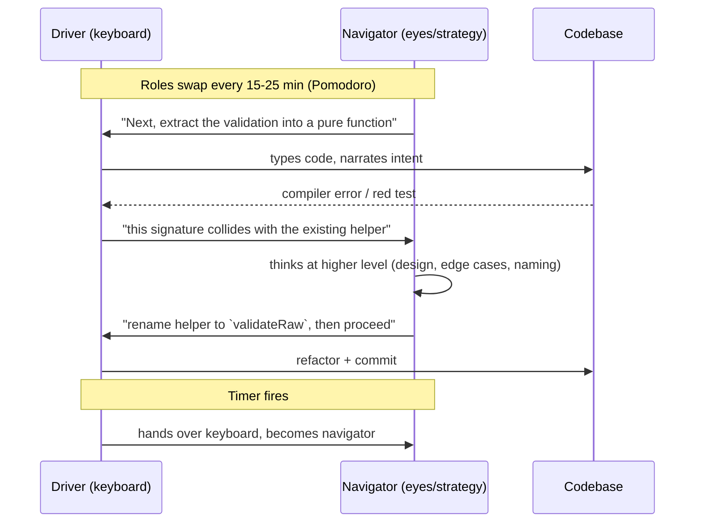
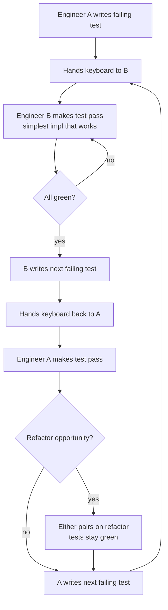
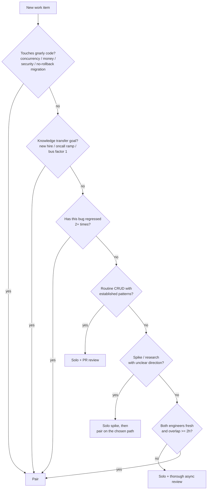

# Pair Programming

## Why This Exists

**Problem.** Code review catches surface defects but misses design errors that are baked in by the time the PR opens. Solo work on unfamiliar territory produces tunnel vision — engineers spend hours on the wrong abstraction, then defend it because the sunk cost is too painful to discard. New hires take months to ramp because reading a codebase top-down does not teach you *why* the team chose a path. Oncall responders panic at 3 AM because the runbook references a service nobody has touched in six months.

**Key insight.** Pairing is not "two people doing one person's work" — it is **continuous design review fused with execution**. The cost is roughly 1.5× engineer-hours per feature. The return is fewer defects in production, faster knowledge propagation, and a shared mental model that survives turnover. The empirical literature (Williams 2000, Cockburn & Williams 2001, Arisholm et al. 2007) consistently finds 15–60% defect reduction at 15–60% time premium, with the largest wins on **complex tasks** and the smallest (sometimes negative) wins on **trivial tasks done by experts**.

**Reach for this when:**
- You are touching **gnarly code** — concurrency, distributed consensus, financial math, security-sensitive paths, migrations with no rollback.
- A new hire or transferring engineer needs to internalize a system. Reading the wiki is not the same as watching a senior debug it.
- **Oncall ramp**: pair the next-rotation engineer with the current oncall on real pages. War stories transfer in minutes that wikis never capture.
- The bug **keeps regressing** — different engineer, same module, same class of mistake. Pairing forces a shared model.
- You are the **only** person who knows a subsystem. The bus factor is 1. Pair until it is at least 2.
- The PR loop is collapsing under review weight — 30+ comments, three round-trips. Switch to live pairing for the rewrite.
- **TDD is non-negotiable** but the team keeps skipping tests under deadline pressure. Ping-pong pairing locks the discipline in.

**Don't reach for this when:**
- Both engineers are senior and the task is **routine CRUD** with established patterns. The 1.5× cost buys nothing.
- One engineer has deep context and the other has none on a **time-critical hotfix**. Have the expert solo and pair on the postmortem.
- One participant cannot sustain attention (jet-lagged, sick, freshly post-incident). Pairing requires both brains online; otherwise it degrades to dictation.
- The work is **research/spike** with no clear direction. Pairing requires shared intent. Diverge first, converge later.
- One engineer is a **chronic interrupter** and the other is a deep-focus thinker. Fix the interpersonal pattern *before* committing to pair sessions, or the introvert burns out silently.
- The team is fully **async across many timezones**. Pairing live needs ≥2 hours of overlap; below that, prefer detailed PR review and recorded walkthroughs.

## Diagrams

### Driver/Navigator Cycle



### Ping-Pong TDD Flow



### Decision flow: pair or not



## Patterns and Practice

### 1. Driver / Navigator (the canonical mode)

The **driver** holds the keyboard, types code, and narrates *what* they are doing. The **navigator** watches the screen, holds the higher-altitude model (architecture, edge cases, the next two moves), and steers. The roles **must swap** — typically every 15–25 minutes via a visible timer (Pomodoro, `tuple-timer`, or any stopwatch).

```text
Anti-pattern: "expert dictates, junior types"
  - Junior never engages strategic thinking, just becomes a transcription machine
  - Expert never sees the gaps in their own assumptions because junior cannot push back
  - After 4 hours both are exhausted and learning is near zero

Correct: timer-enforced swap, both engineers must hold both roles
  - Junior gets to ask "wait, why?" while typing
  - Expert is forced to articulate intuition out loud (which is when intuition gets debugged)
```

**Driver responsibilities (verbatim narration):**

```python
# Driver speaking out loud while typing:
# "Okay, I'm going to extract this retry logic into a decorator.
#  Calling it `with_backoff`. Taking a max_attempts parameter,
#  defaulting to 3. Inside, I'm wrapping... wait — what should
#  happen if max_attempts is zero? Should that be an error or a no-op?"
def with_backoff(max_attempts: int = 3, base_delay: float = 0.1):
    if max_attempts < 1:
        raise ValueError("max_attempts must be >= 1")
    def decorator(fn):
        @functools.wraps(fn)
        def wrapper(*args, **kwargs):
            last_exc = None
            for attempt in range(max_attempts):
                try:
                    return fn(*args, **kwargs)
                except RetryableError as e:
                    last_exc = e
                    time.sleep(base_delay * (2 ** attempt))
            raise last_exc
        return wrapper
    return decorator
```

**Navigator responsibilities:**
- Watch for typos *but do not interrupt for them* unless they will compile and ship a real bug. Save them for natural pauses.
- Hold the **next two steps** in your head: "after this function compiles, we need a test for the zero-attempt case, and we need to thread the new parameter through the caller in `worker.py`."
- Spot **design drift**: "we just made this synchronous but the caller is in async context — let's make it `async def` instead."
- Manage the **clock**: "we have 20 minutes left in this session, we should land the test first, then push and break."

### 2. Ping-Pong TDD

Ping-pong fuses pairing with strict test-first discipline. It is the highest-friction, highest-rigor mode and is the right default for **bug fixes with regression history** and **safety-critical code**.

```text
Round 1 (Alice writes test)
  test_calculate_late_fee_returns_zero_when_paid_on_time:
    given: invoice paid on due_date
    expect: fee == 0
  -> RED (function does not exist)
  hands keyboard to Bob

Round 2 (Bob makes it pass)
  def calculate_late_fee(invoice): return 0   # simplest possible
  -> GREEN
  Bob writes next failing test:
  test_calculate_late_fee_charges_per_day_overdue:
    given: invoice 5 days overdue, daily_rate=2.00
    expect: fee == 10.00
  -> RED
  hands keyboard back to Alice

Round 3 (Alice makes it pass)
  def calculate_late_fee(invoice):
      days_late = max(0, (today() - invoice.due_date).days)
      return days_late * invoice.daily_rate
  -> GREEN
  Refactor opportunity: extract `today()` as injectable for testability.
  Both pair on the refactor (tests stay green).
  Alice writes next failing test...
```

**Why ping-pong works for regression-prone code.** Each engineer is forced to think about the *contract* (when writing the test) and the *implementation* (when making it pass) in alternation. The previous-engineer-bias — "I would have done it this way, so let me just patch this case" — is broken because you cannot edit code without first writing a test that drives it. Bugs that survive ping-pong are usually genuinely novel, not "we forgot the same edge case again."

**When to break ping-pong rhythm:**
- During pure refactoring (tests already green, both tests and code stay correct).
- When the test-writing engineer cannot articulate a failing test — that means the design is unclear. Stop, whiteboard, then resume.
- When the test framework is fighting you. Fix the test infra first, in a separate session.

### 3. Strong-Style Pairing (Llewellyn Falco)

> "For an idea to go from your head into the computer, it MUST go through someone else's hands."

The navigator does *all* the thinking; the driver is a **smart keyboard**. Useful for **steep mentoring asymmetry** (senior teaching a true beginner the syntax-and-tools layer). Less useful between peers — it suppresses the navigator's exposure to the editor and the driver's strategic muscle.

Use sparingly: maybe the first day onboarding a junior. Then graduate to balanced driver/navigator.

### 4. Mob / Ensemble Programming (3+ people)

Three or more engineers, one keyboard. Roles rotate every 5–10 minutes. Useful for:
- **System-wide refactors** where you need every team member's mental model in the room.
- **Architecture decisions** that will outlive the current feature.
- **Live incident postmortems** where reproducing the bug requires distributed knowledge.

Hard to sustain past 90 minutes. Cost scales linearly with participant count and benefit does not — usually 3 is the sweet spot, 5 is the ceiling. Beyond that, fork into smaller groups.

## Remote Pairing Tools

| Tool | Strengths | Weaknesses | Best for |
|---|---|---|---|
| **Tuple** (macOS/Linux) | Sub-100ms latency, designed for pairing, both can drive any app, low CPU, 5K screen-share, dual cursors | macOS-first (Linux beta), paid per-seat, 1:1 only (no mob) | Senior pairs on production code; native-app dev |
| **VS Code Live Share** | Free, multi-participant, follows symbols not pixels, debug session sharing, terminal sharing, audio via add-on | VS Code only, occasional sync hiccups on large monorepos, no shared mouse/keyboard outside editor | Cross-OS teams already on VS Code; mob sessions; teaching |
| **JetBrains Code With Me** | First-class IntelliJ/PyCharm/etc., refactoring travels across participants, embedded audio/video | Paid for guest hosting beyond trivial use, JetBrains-only | Java/Kotlin shops, heavy-refactor sessions |
| **tmate / tmux + SSH** | Plain terminal, free, works over flaky links, scriptable, audit-friendly | Terminal only (no GUI), no embedded video, requires both engineers comfortable in TUI | SRE/oncall pairing, server debugging, low-bandwidth |
| **Zoom + screen share** | Universal, no install, video built in | Receiving side is read-only (no remote control of editor), high latency, blurry text | Demos and architecture talks — not real pairing |
| **Pop / Pop.com** | Multi-stream HD, multi-participant, designed for pairing | Less mature than Tuple, paid | Distributed team mob sessions |

**Latency budget.** Anything over ~150ms feels laggy; over ~300ms is unusable for a driver. Test before you commit a session — a 5-minute typing test in your real editor will tell you if the link will hold up.

**Audio matters more than video.** A clear voice channel with low latency beats HD video every time. Use a headset, not laptop speakers (they cause echo cancellation to clamp the channel). Mute push-to-talk if your environment is noisy.

**Network failure mode.** Decide in advance: if the link drops mid-flow, do you (a) wait and retry, (b) one of you ships what you have, or (c) switch to async via PR? Don't decide this while you're frustrated and disconnected.

### Tuple session example (macOS)

```bash
# Host starts session
$ tuple
# Tuple opens, click "Start Session", paste the deeplink to invitee
tuple://session/abc123...

# Invitee (after install + login)
$ open "tuple://session/abc123..."

# Either side can press Cmd+Shift+T to swap who has control of mouse/keyboard
# (Tuple shows a colored ring around the active driver's cursor)
```

### VS Code Live Share example

```bash
# Host (in VS Code with Live Share extension):
#   Cmd+Shift+P -> "Live Share: Start Collaboration Session"
# Copy the share link, send via chat.

# Guest:
#   Cmd+Shift+P -> "Live Share: Join Collaboration Session"
#   Paste link, accept.

# Now both can:
# - Edit files (changes sync in real time)
# - "Follow" the other's cursor (cursor jumps to whatever file they open)
# - "Pin" yourself so the other follows you (great for navigator role)
# - Share a debug session: F5 on host, guest sees breakpoints hit live
# - Share a terminal: tasks.json -> "shareLocalServer" for port-forwarded apps
```

## Session Structure (a 4-hour pairing day)

A real pairing day is **not** "8 hours of two people staring at one screen." That is the fastest way to burn out a team. A sustainable rhythm:

```text
09:00-09:15  Sync: what are we doing today, what's the test we want green by lunch
09:15-10:35  Pair block 1 (5 Pomodoros, swap roles each)
10:35-10:50  Break — REAL break, leave the desk
10:50-12:10  Pair block 2
12:10-13:30  Lunch + solo time (email, code review, individual learning)
13:30-14:50  Pair block 3
14:50-15:05  Break
15:05-16:25  Pair block 4 — last block, save shipping/cleanup for here
16:25-17:00  Solo wrap: push, write up notes, create follow-up tickets

Total: 4 × 80min pair blocks = ~5h20m of intense pairing.
Anything past 6 hours/day of pairing degrades quality fast (Williams 2000).
```

**Do not skip breaks.** Pairing is more cognitively expensive than solo work because you are simultaneously coding and modeling another person's mental state. The fatigue compounds quietly — by hour 5 without breaks, you are shipping bugs that either of you would have caught in hour 1.

## Trade-offs

| Benefit | Cost |
|---|---|
| 15–60% defect reduction (Cockburn & Williams 2001) | 15–60% time premium (so net wins only when defect cost is high) |
| Knowledge spreads across the team — bus factor goes up | Two calendars must align; scheduling friction is real |
| Continuous design review catches architectural drift early | Disagreements that would be PR comments become live arguments — needs maturity |
| New hires ramp in weeks, not months | Senior engineers get fewer hours of deep solo work, which is where some of them produce most value |
| Shared ownership reduces "this is *my* code" defensiveness | Shared ownership can dilute accountability — "we both wrote it, neither feels responsible" |
| Forces articulation of intuition → debugs the intuition | Introverts and deep-focus types can find sustained pairing draining; ignore at your peril |
| Ping-pong locks in TDD discipline | Adds friction to spike/exploration work where tests are premature |
| Oncall ramp-up faster, fewer 3 AM panics | Live oncall pairing requires a willing senior on standby — that's a real cost on their week |
| Code style converges across the team | Personal idiosyncrasies (vim configs, key bindings) become friction points |
| Catches "stuck for hours" failure mode in minutes | Catches it by *interrupting flow* — sometimes the stuck person was 5 min from breakthrough |

## Common Pitfalls

- **Expert dictation.** Senior takes the keyboard "to save time" and never gives it back. Junior leaves the session as a passive observer. Knowledge transfer near zero. **Fix: timer-enforced swap, no exceptions.**
- **The silent navigator.** Navigator stops talking, scrolls Twitter on a second monitor, tunes out. Driver gets no review benefit. **Fix: navigator narrates the next move out loud at least every 60 seconds; if nothing comes to mind, that is itself a signal — pause and ask "where are we going?"**
- **Pairing on the wrong work.** A team mandates "all code must be paired." They pair on README typos. Engineers resent the policy. Eventually pairing gets dropped wholesale, including for the gnarly stuff where it would have helped. **Fix: pair selectively, with explicit triggers — see the decision flowchart.**
- **Marathon sessions.** "We're in flow, let's just keep going." After 4 hours without breaks, both engineers are making rookie mistakes. They commit, push, and one of them silently fixes their own bug at 11 PM. **Fix: Pomodoro timer, real breaks, hard 6-hour cap on pair time per day.**
- **Dictating to a tired co-pilot.** Driver is fresh, navigator is post-lunch and zoned out. Driver ships their first idea unchallenged. **Fix: read your partner's energy before each block. If they are gone, swap modes (let *them* drive — being driver is more engaging) or take a break.**
- **Style wars.** 20 minutes lost arguing about tabs vs spaces. **Fix: agree on tooling (formatter, linter) once, before pairing. Both editors run the same `prettier`/`black`/`gofmt` on save. The tool wins; nobody argues.**
- **The asymmetric ergonomics.** One engineer's editor has 47 custom shortcuts the other doesn't know. Driver hits a shortcut, code teleports, navigator is lost. **Fix: when pairing, prefer **default keymaps** or share dotfiles. Tuple/Live Share can paper over this but it still hurts when you alternate.**
- **Pairing the conflict-avoidant with the dominant.** Conflict-avoidant engineer agrees with everything the dominant one says, even when wrong. Dominant engineer thinks they have buy-in. Both ship a bad design and only one of them knew it was bad. **Fix: explicit norm — *navigator must voice disagreement at least once per session*. If nothing felt worth pushing back on, that is suspicious.**
- **Overusing pairing as a crutch.** Engineer who used to be productive solo now refuses to write code without a partner. Pairing has become avoidance of solo discomfort, not a tool. **Fix: pair on the gnarly 30%, solo on the rest.**
- **Underestimating remote-pairing latency.** Tokyo pairs with São Paulo over a Zoom screen-share. 800ms latency. Driver types `:wq`, sees it appear 1 second later, types it again. Now the file is closed twice and chaos ensues. **Fix: use proper pairing tools (Tuple/Live Share) over Zoom screen-share, and test latency before committing to a session.**
- **Pairing during interviews/performance reviews.** Awkwardly conflating mentorship with evaluation. **Fix: keep evaluation contexts distinct. Pairing is for shipping code together, not for grading.**
- **Forgetting to commit attribution.** All commits land under one engineer's name; the other invisible. Promotion cycle, layoffs, who-did-what becomes a fight. **Fix: use `Co-authored-by:` trailers in every commit (GitHub renders both avatars).**

```bash
# Commit message template for paired commits
git commit -m "Add retry decorator with exponential backoff

Co-authored-by: Alice Example <alice@example.com>
Co-authored-by: Bob Example <bob@example.com>
"
```

## Decision Table

| Situation | Pick this | Why |
|---|---|---|
| Bug in payment processing, has regressed twice | **Ping-pong TDD pairing** | Test-first discipline + two brains on a money bug; cost of another regression > pairing premium |
| New hire, week 1, learning the codebase | **Strong-style pairing**, then driver/navigator | Beginner needs to feel the editor; expert articulates intuition |
| Senior engineer ramping onto oncall rotation | **Live pairing on real pages**, plus shadow rotations | Runbooks miss the "wait, why is this graph weird?" intuition |
| Routine CRUD endpoint, two senior engineers | **Solo + async PR review** | Pairing premium buys nothing; both already know the pattern |
| Architecture decision affecting 5 services | **Mob session (3–5 engineers, ≤90 min)** | Shared mental model is the deliverable, not the code |
| Time-critical hotfix, only one engineer has context | **Solo by the expert, pair on the postmortem** | Live debugging on prod ≠ teaching moment; do the teaching after the fire is out |
| Spike / research with unclear direction | **Solo first**, pair on chosen path | Shared intent is a precondition for productive pairing |
| Distributed team, 1-hour daily overlap | **Async PR review + recorded walkthrough**, occasional pair block when overlap allows | Below 2h overlap, pair scheduling is more pain than gain |
| Refactor that touches 30+ files | **Mob or pair** | Decisions accumulate; lone engineer drifts off-mission halfway |
| Pure prototyping / hackathon | **Solo or loose pairing** (sit near, ask questions) | Speed > rigor; formal pairing structure adds friction |
| Security-critical code (auth, crypto, sandboxing) | **Pair (driver/navigator) with security-trained reviewer** | Defects here are catastrophic; pair cost is trivial vs incident cost |
| Documentation / READMEs | **Solo + PR review** | Writing is a serial activity; pairing on prose is awkward |
| Gnarly debugging session (heisenbug, race condition) | **Pair or rubber-duck-with-keyboard** | Verbalizing forces explicit assumptions, which is how heisenbugs die |
| Two engineers with strong personality conflict | **Don't pair until you've addressed the conflict** | Pairing amplifies interpersonal friction; will damage both work and relationship |

## References

- Williams, Laurie — "The Collaborative Software Process" (PhD dissertation, 2000) — foundational empirical study; ~15% time premium, 15% defect reduction. — https://collaboration.csc.ncsu.edu/laurie/Papers/dissertation.pdf
- Cockburn, Alistair & Williams, Laurie — "The Costs and Benefits of Pair Programming" (2001) — the canonical cost-benefit summary. — https://collaboration.csc.ncsu.edu/laurie/Papers/XPSardinia.PDF
- Arisholm, Erik et al. — "Evaluating Pair Programming with Respect to System Complexity and Programmer Expertise" (IEEE TSE, 2007) — when pairing wins (complex tasks) and when it doesn't (trivial tasks done by experts). — https://ieeexplore.ieee.org/document/4015685
- Beck, Kent — *Extreme Programming Explained* (2nd ed., 2004) — original codification of pair programming as a core XP practice.
- Falco, Llewellyn — "Strong-Style Pair Programming" — https://llewellynfalco.blogspot.com/2014/06/llewellyns-strong-style-pairing.html
- Zuill, Woody — *Mob Programming: A Whole Team Approach* (2014) — practical guide to mob/ensemble.
- Fowler, Martin — "On Pair Programming" (with Birgitta Böckeler) — https://martinfowler.com/articles/on-pair-programming.html
- Google SRE Workbook — chapter on "Training Site Reliability Engineers" (oncall ramp via shadowing/pairing). — https://sre.google/workbook/training-site-reliability-engineers/
- AWS Builders' Library — "Operational Excellence at Amazon" (mentorship and oncall handoff patterns) — https://aws.amazon.com/builders-library/
- Kleppmann, Martin — *Designing Data-Intensive Applications* (O'Reilly, 2017) — DDIA preface and ch. 1: discusses the value of cross-functional collaboration on data-system design.
- Tuple — "The Tuple Pair Programming Guide" — https://tuple.app/pair-programming-guide
- Microsoft — "Visual Studio Live Share" docs — https://learn.microsoft.com/en-us/visualstudio/liveshare/
- JetBrains — "Code With Me" docs — https://www.jetbrains.com/help/idea/code-with-me.html
- GitHub — "Creating a commit with multiple authors" — https://docs.github.com/en/pull-requests/committing-changes-to-your-project/creating-and-editing-commits/creating-a-commit-with-multiple-authors

## See Also

- `../code-review/` — async PR review patterns; the alternative to pairing when overlap is impossible
- `../refactoring-catalog/` — pairing is the safest mode for high-risk refactors
- `../code-smells/` — what the navigator should be watching for in real time
