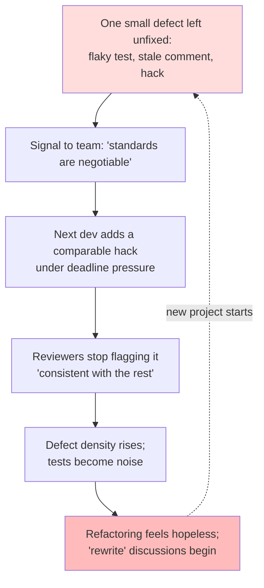
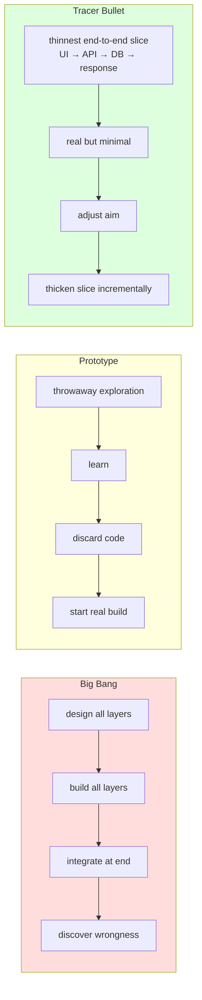
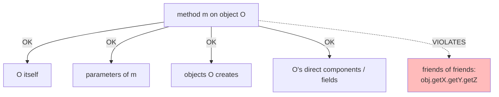

# Pragmatic Programmer Heuristics

## Why This Exists

**Problem.** Software decays. Not from a single catastrophic mistake but from a thousand small concessions: a broken test left red, a copy-pasted block "for now", a class that "knows about" three layers below it, a `// TODO: refactor` from 2019. Each individual concession is rational under deadline pressure. Their compound effect is a codebase nobody dares to change.

Hunt & Thomas's *The Pragmatic Programmer* (1999, 20th anniversary ed. 2019) is not a methodology — it's a collection of **heuristics** distilled from running real projects into the ground and learning how to stop. The heuristics are sharp because they each name a specific failure mode you've seen but couldn't articulate.

**Key insight.** Most software disasters are **slow-moving and self-inflicted**. They are not caused by missing knowledge of algorithms; they are caused by ignoring small signals (a flaky test, a coupled dependency, an "I'll fix it later" comment) until those signals compound into structural rot. Pragmatic heuristics are early-warning systems: they let you intervene while the cost is still cheap.

**Reach for this when:**
- A codebase feels "fragile" but you can't point at why — bugs appear far from where you changed code.
- Estimates keep being wrong by 3-5× and the variance is growing.
- You're about to make a "big bang" architectural decision (DB choice, framework, message bus) and want to de-risk it.
- A new feature touches 14 files and the team is debating "do it right" vs "ship it".
- Code review keeps surfacing the same defects (deep method chains, god classes, copy-paste).
- A junior says "it works, I don't know why" and you're tempted to merge it.
- You inherited a project and need a vocabulary to describe what's wrong before you can fix it.

**Don't reach for this when:**
- You need a concrete pattern (singleton vs factory vs strategy) — go to the GoF book or `../design-patterns-gof/`.
- The problem is people/process, not code (estimation, on-call, post-mortems) — see SRE Workbook.
- You're optimizing a hot path. Pragmatic heuristics improve *changeability*, not throughput.

---

## Diagrams

### How small concessions compound (the Broken Windows feedback loop)



### Tracer bullets vs. prototypes vs. big-bang delivery



### Law of Demeter — who may a method talk to?



---

## The Heuristics

### 1. Tracer Bullets

> "Tracer bullets work because they operate in the same environment and under the same constraints as the real bullets." — Hunt & Thomas, *PP* §8

A tracer bullet is the **thinnest possible end-to-end slice** of a system that exercises every layer (UI → service → data → external dependency → response) with real components, even if each component does almost nothing. Unlike a prototype (throwaway, lying), a tracer bullet is **kept and grown**.

**Why it beats big-bang design:**
- Integration risk is the dominant risk in distributed systems. Tracer bullets surface integration mismatches in week 1, not week 14.
- Stakeholders see a working system they can react to. Their feedback changes the design while it's still cheap.
- The team gets a deployment pipeline, observability, and CI on day one — not as an afterthought.

```python
# Tracer bullet for a "process refund" feature.
# Real auth, real DB hit, real downstream call — but each does the minimum.

# api/refund.py
@router.post("/refunds")
async def create_refund(req: RefundRequest, user=Depends(auth)):
    # 1. Real auth (not stubbed)
    # 2. Real DB write (one column, one row — not the full schema)
    refund_id = await db.execute(
        "INSERT INTO refunds (order_id, status) VALUES ($1, 'pending') RETURNING id",
        req.order_id,
    )
    # 3. Real call to payment gateway sandbox (not a mock)
    await payments.refund(order_id=req.order_id, amount_cents=1)  # hardcoded 1¢
    # 4. Real event emission (one consumer subscribed for smoke test)
    await events.publish("refund.created", {"id": refund_id})
    return {"id": refund_id, "status": "pending"}
```

The above is **shippable to staging on day 1**. It does not handle partial refunds, multi-currency, idempotency, fraud checks — all of those are layers we will *thicken* on top. But the wires are real.

**Tracer bullet ≠ MVP.** MVP is a product concept (what's the minimum users will pay for?). Tracer bullet is an engineering technique (what's the minimum code that proves the architecture?).

### 2. Don't Live With Broken Windows

> "Don't leave 'broken windows' (bad designs, wrong decisions, or poor code) unrepaired. Fix each one as soon as it is discovered." — Hunt & Thomas, *PP* §4

Borrowed from Wilson & Kelling's 1982 broken-windows theory of urban decay. The mechanism is **social**, not technical: when a defect persists, it signals to every subsequent contributor that defects are tolerated here. The next defect is added with less guilt. Standards collapse to the floor.

**Concrete tactics:**

```bash
# Fail CI on new TODOs without an owner+date
grep -rE 'TODO(?!\([a-z]+@[0-9]{4}-[0-9]{2}-[0-9]{2}\))' src/ && exit 1

# Track "broken window" debt explicitly — not in tickets that age out
# but in a CODEOWNERS-style file with a date
# .debt.yml
- file: src/billing/legacy_charge.py
  added: 2024-03-01
  owner: billing-team
  reason: "duplicate-charge race condition; needs idempotency key migration"
  expires: 2024-06-01   # CI fails after this date

# When a flaky test is detected, quarantine WITH a deadline, not silently
@pytest.mark.flaky(reruns=3, expires="2025-01-15")  # custom marker
def test_eventually_consistent_read(): ...
```

**The boardable claim:** if you can't afford to fix the broken window now, *board it up visibly* — make it impossible to ignore. A `# HACK` comment with no expiry is a permanent broken window. A failing CI check that says "this hack expires 2025-Q2" is a boarded window.

### 3. Orthogonality

Two components are **orthogonal** when changing one does not require changing the other. Orthogonality is what lets you reason about a module in isolation, swap implementations, and write unit tests that mean something.

> "If you write orthogonal code, you write code that has no side effects in unrelated parts of the system." — Hunt & Thomas, *PP* §10

**Diagnostic question:** *"If I change behaviour X, how many files do I have to touch?"* If the answer scales with the size of the codebase, you have non-orthogonal code.

**Anti-pattern: shotgun surgery**

```typescript
// Adding a new currency requires editing 7 files:
// - PriceFormatter.ts          (switch on currency)
// - InvoicePdfRenderer.ts      (switch on currency)
// - TaxCalculator.ts            (switch on currency)
// - CurrencyDropdown.tsx        (literal list of 4 currencies)
// - emailTemplates/receipt.hbs  (literal list)
// - tests/fixtures/orders.json  (need to add cases)
// - reports/MonthlySalesReport.ts (groupBy)
```

**Orthogonal alternative:** push the variation behind a stable interface so adding a currency means adding *one* implementation, not editing seven sites.

```typescript
interface Currency {
  code: string;            // ISO 4217
  format(cents: bigint): string;
  taxRule(region: Region): TaxRule;
}

const CURRENCIES = new Registry<Currency>();
CURRENCIES.register(new USD());
CURRENCIES.register(new EUR());
// adding JPY = one new file, no edits to consumers
```

**Orthogonality is not zero-coupling.** Orthogonality means coupling exists only along *intentional* axes. The currency registry above couples `PriceFormatter` to the `Currency` interface — that's intentional and stable. The anti-pattern coupled `PriceFormatter` to *every concrete currency* — that's shotgun surgery.

### 4. Reversibility

> "There are no final decisions." — Hunt & Thomas, *PP* §11

Pragmatic programmers treat decisions as **bets with exit options**. The cost of a decision = (probability of being wrong) × (cost of reversing). You reduce *both* factors:
- **Probability of being wrong**: tracer bullets, spikes, prototypes, A/B tests.
- **Cost of reversing**: abstraction layers, feature flags, blue-green deploys, schema migrations with backfills.

**Reversibility scale (cheapest → most expensive to undo):**

| Decision | Reversibility | Mitigation |
|---|---|---|
| Function-level refactor | High | Just refactor again. |
| Library choice within a service | Medium | Hide behind interface (ports & adapters). |
| Database schema | Low–Medium | Expand-contract migrations; never destructive in one PR. |
| Database engine choice | Low | Polyglot persistence is expensive; defer with repository pattern. |
| Public API contract | Very Low | Versioning (`/v1`, `/v2`); deprecation calendar. |
| Cross-org service boundary | Very Low | Spend weeks on the contract; tracer-bullet the integration. |

**Concrete pattern: feature flags as reversibility primitives**

```go
// Don't decide "use Redis or Memcached for session cache" — make it switchable.
type SessionStore interface {
    Get(ctx context.Context, sid string) (*Session, error)
    Set(ctx context.Context, sid string, s *Session, ttl time.Duration) error
}

func NewSessionStore(cfg Config) SessionStore {
    switch cfg.Backend {
    case "redis":     return newRedisStore(cfg.RedisURL)
    case "memcached": return newMemcachedStore(cfg.MemcachedURL)
    case "memory":    return newMemoryStore() // for tests
    }
    panic("unknown session backend")
}
```

A reversible decision pays for itself the first time the constraint changes (vendor pricing, regional latency, compliance mandate).

### 5. The Boy Scout Rule

> "Always leave the campground cleaner than you found it." — Robert Baden-Powell, popularized for code by Robert C. Martin in *Clean Code* and adopted by *The Pragmatic Programmer*.

Every commit should leave the touched code **slightly better** than before. Not "rewrite the module" — *slightly* better. Rename one variable. Extract one method. Delete one dead branch. Add one missing test.

**Why this matters more than big refactors:**
- Big refactors require political capital and a calendar window. They rarely happen.
- Continuous small improvements compound. A 1% improvement per touched file, with files touched on average every two weeks, doubles quality every ~70 weeks.
- Reviewers can assess a 20-line cleanup. They cannot meaningfully review a 2000-line "refactor".

**Discipline:** keep cleanup commits **separate** from feature commits. A reviewer should be able to revert your cleanup without losing the feature, and vice versa.

```bash
# bad: cleanup hidden inside feature PR; reviewer can't tell signal from noise
git commit -m "Add coupon support (also renamed PriceCalc, dropped dead helper, fixed log levels)"

# good: stacked commits, each minimal
git commit -m "refactor: rename PriceCalc → Pricer (no behaviour change)"
git commit -m "refactor: drop unused discountForLegacyClients helper"
git commit -m "feat: apply percentage coupons at checkout"
```

### 6. Programming By Coincidence (the anti-pattern)

> "If it works, but you don't know why, you're programming by coincidence." — Hunt & Thomas, *PP* §31

Programming by coincidence is when code **works for reasons you cannot articulate**. The classic example: you add a `sleep(100)` and the race condition disappears, so you ship it. The code is correct only by accident; tomorrow's traffic, OS scheduler, or compiler optimization will reveal that.

**Smell signs:**
- "I changed line 47 and the bug went away. I don't know why line 47 mattered."
- "We need to call `setRegion` *before* `connect`, otherwise it crashes." (undocumented ordering — why?)
- "Don't touch this; I tried to clean it up once and tests broke."
- Tests that pass only when run in a specific order.
- Heisenbugs that disappear under the debugger.

**Discipline: program deliberately.**
1. Be aware of *why* something works. If you can't explain it, you don't yet have a fix.
2. Don't rely on undocumented behaviour. If a library returns items in insertion order today, that's an implementation detail unless the contract says so.
3. Don't assume — prove. Read the code, write a test that pins the assumption, or check the spec.

```python
# Programming by coincidence:
items = some_api.fetch()
first = items[0]  # assumes ordering — does the API guarantee it?

# Deliberate:
items = some_api.fetch()
# API docs: "Order is unspecified. Sort by created_at if order matters."
items.sort(key=lambda i: i.created_at)
first = items[0]
```

**Race conditions are the canonical coincidence trap.** A race "works" because of unobservable timing. Adding sleeps moves the boundary; it does not eliminate the race. Use locks, channels, or idempotency keys — solutions that are correct by *construction*, not by *observation*.

### 7. The Law of Demeter (Principle of Least Knowledge)

Coined by Lieberherr & Holland (1989) at Northeastern; popularized by *PP* §28.

A method `m` of object `O` may only invoke methods of:
1. `O` itself,
2. parameters passed to `m`,
3. objects `m` creates,
4. objects directly held as fields of `O`,
5. (some formulations) global objects.

It may **not** invoke methods on objects *returned by* the above. The rule of thumb: **"talk to friends, not strangers."**

**The classic violation — the train wreck:**

```java
// Violation: customer is a "stranger" to OrderService.
String city = order.getCustomer().getAddress().getCity().toUpperCase();
//                  ^stranger     ^stranger     ^stranger

// Production failure mode: any of those getters returns null → NPE.
// Worse: the chain freezes the entire call site to a 4-level type hierarchy.
// Adding a "billing address vs shipping address" distinction = touching every chain.
```

**Fix — tell, don't ask:**

```java
// Move the logic to where the data lives.
class Customer {
    String shippingCityNormalized() {
        return shippingAddress.cityNormalized();
    }
}
class Address {
    String cityNormalized() {
        return city == null ? "" : city.toUpperCase(Locale.ROOT);
    }
}
// Caller:
String city = order.shippingCityNormalized();
```

**When NOT to apply Demeter rigidly:**
- **Data transfer objects / records** are explicitly bags of fields. Reaching into them is fine; that's their purpose. (Java records, Kotlin data classes, TypeScript interfaces, Go structs without methods.)
- **Builders / fluent APIs** chain by design (`StringBuilder.append(x).append(y)`). The chain is on the *same* object; it's not Demeter violation.
- **Functional pipelines** (`stream.map().filter().collect()`) are operating on a sequence-of-transformations abstraction, not "asking strangers".

The point of Demeter is to limit *behavioural* coupling — your logic should not depend on the navigational structure of someone else's object graph. Reading data fields off a passive struct is fine.

### 8. DRY — Don't Repeat Yourself

> "Every piece of knowledge must have a single, unambiguous, authoritative representation within a system." — Hunt & Thomas, *PP* §9

DRY is widely **misquoted** as "don't write the same code twice." The actual rule is about *knowledge*. Two pieces of code can look identical and still represent two different facts; deduplicating them creates a false coupling.

```python
# Looks duplicated. Is it?
def tax_for_invoice(amount): return amount * 0.07  # CA sales tax
def tax_for_payroll(amount): return amount * 0.07  # CA payroll surcharge

# These are TWO knowledge claims that happen to numerically coincide today.
# Merging them creates a bug the next time CA changes one rate but not the other.
```

vs.

```python
# Genuinely the same knowledge — duplication should be eliminated.
def normalize_email(e): return e.strip().lower()  # used in signup
def fix_email(e): return e.strip().lower()         # used in admin import
# → one function, both call sites.
```

**Sandi Metz's counter-rule:** *"Duplication is far cheaper than the wrong abstraction."* If you're not sure whether two pieces of knowledge are the same, **wait** until you have three examples. Premature deduplication forces real differences through a single API and produces flag-soup.

### 9. Estimate to Avoid Surprises

> "Estimate to avoid surprises." — Hunt & Thomas, *PP* §15

Estimates are not promises; they are **calibration exercises**. A good estimate identifies the unknowns you need to resolve before the number gets meaningful. The pragmatic process:

1. Pick units that match your accuracy. "120 days" implies precision you don't have; say "4–6 months."
2. Build a model of the system *and the process*. Note assumptions explicitly.
3. Break the estimate into pieces you can defend.
4. Track estimate vs. actual. Over time you learn your personal calibration ratio (most engineers are 1.5–3× optimistic).

```yaml
# estimate.yml — checked into the repo alongside the design doc
feature: refunds-v2
estimate: 5-8 weeks
assumptions:
  - "Existing payment-gateway client supports partial-refund API"   # validate week 1 with tracer bullet
  - "No new compliance review required"                              # confirm with legal week 1
  - "Two engineers full-time, no on-call rotation interruptions"
unknowns:
  - "Does Stripe handle multi-currency refund fees as we expect?"   # spike: 2 days
risks:
  - probability: medium
    impact: +2 weeks
    description: "Schema migration on `transactions` table requires expand-contract over a deploy window"
```

---

## Trade-offs

| Heuristic | Benefit | Cost / when it bites |
|---|---|---|
| Tracer bullets | De-risk integration; early stakeholder feedback; deployable from day 1. | Easy to mistake the bullet for "done" and start adding features without thickening the wire. Requires real environments early (cost). |
| Don't live with broken windows | Sustains velocity; signals high standards; prevents rot spirals. | Without prioritisation it becomes "fix everything always" perfectionism that blocks shipping. |
| Orthogonality | One change → one place; testable in isolation; swappable parts. | Premature interfaces add ceremony; over-decoupling produces "spaghetti through indirection". |
| Reversibility | Adapt to new constraints cheaply; lower stakes per decision. | Every abstraction has a runtime/cognitive cost; some decisions (data formats, API contracts) cannot be made reversible without leaking complexity. |
| Boy scout rule | Continuous, low-risk improvement; reviewable diffs. | Cleanup mixed with features hides defects in review; needs commit discipline. |
| Avoid programming by coincidence | Bugs become rare and reproducible; reasoning extends across people. | Slower — you must understand before changing. Tempting to skip under pressure. |
| Law of Demeter | Localized impact of refactors; fewer NPE chains; testability. | Over-applied → wrapper-hell, anaemic models, "tell don't ask" forced onto value objects where it makes no sense. |
| DRY | Single source of truth; one fix propagates. | Wrong-abstraction trap if applied to coincidentally-similar code. Worse than duplication. |

---

## Common Pitfalls

- **Tracer bullet that became the product.** Team builds the thinnest slice, declares victory, and ships it as v1. Six months later they discover that the "thinnest slice" had no auth, no rate limits, and a single-row schema that now needs to handle 50M rows. **Fix:** explicitly schedule "thickening" work — every tracer bullet should have a follow-up plan for hardening, not just feature growth.

- **Broken-window fatigue.** A team adopts "fix every broken window" as a rule, then drowns in CI failures from old TODOs. Engineers route around the rule. **Fix:** scope the rule to *new* code and to code you're already touching. Old debt goes into a tracked register with deadlines, not a gate.

- **Orthogonality cargo-cult.** Every class gets an interface "in case we swap implementations." 80% of those interfaces have one implementation and never get a second. **Fix:** introduce the interface only when (a) you have a second implementation, (b) you need it for testing, or (c) you cross a process/team boundary. YAGNI applies.

- **Reversibility theatre.** A team adds feature flags everywhere, then never removes them. The flag count grows unbounded. Code paths exist that nobody has run in 18 months. **Fix:** every flag has an expiry date enforced in CI. Removing flags is a routine chore, not a project.

- **"While I'm here" Boy Scout grenades.** A 50-line bug fix turns into a 1500-line "while I'm here, I cleaned up the module" PR. Reviewers cannot evaluate it; defects ship. **Fix:** discipline of separate commits and separate PRs.

- **Demeter-induced wrapper hell.** Every getter chain is "fixed" by adding a delegation method, producing classes with 40+ methods that just forward to another object. **Fix:** Demeter is a *smell*, not a syntax rule. The real question is "is the calling code coupled to a navigational structure?" If `order.shippingCityNormalized()` reduces real coupling, do it. If `order.id()` is just `order.getId()` renamed, you're padding.

- **DRY-induced false abstractions.** Two billing flows get merged into a `BillingProcessor` with seven boolean flags (`isBNPL`, `isSubscription`, `isMarketplace`...). Every method has nested ifs. **Fix:** when you see flag-soup, the abstraction is wrong. Split the class back along the natural seam (the booleans). Sandi Metz's "wrong abstraction" talk.

- **Programming-by-coincidence as a culture.** "Don't touch the foo module, last person who tried broke prod for a day." Knowledge becomes oral history; the team can't onboard. **Fix:** treat unexplained behaviour as a bug. Every flaky module gets a characterization-test sprint. If reading the code is hopeless, the code is the problem.

- **Estimate inflation as defence.** Burned by past over-runs, the team multiplies all estimates by 3×. Now estimates are meaningless and management routes around the team. **Fix:** track estimate vs. actual on every project; publish the calibration; argue with data, not with padding.

---

## Decision Table

| Situation | Use this heuristic | Not this |
|---|---|---|
| New system, unclear architecture, integration with 3+ services | **Tracer bullet** | Big-bang design doc → implementation. |
| New system, unclear *requirements* with users | **Throwaway prototype** (then discard) | Tracer bullet (you'll be tempted to keep it). |
| Codebase feels rotten but you can't say why | Diagnose with **broken windows** + **orthogonality** + **programming by coincidence** lenses | Full rewrite. (The same forces that produced rot will produce it again.) |
| You're about to commit to vendor X for a year | **Reversibility**: hide behind interface, plan exit cost | "We'll never need to switch." (You will.) |
| 50-line PR has scope-creep cleanup mixed in | Split: separate **boy-scout** commit + feature commit | Merge as one ("reviewer will sort it"). |
| Tests pass only when run in a specific order | **Programming by coincidence** alarm — fix root cause | Add `@FixMethodOrder`, ship. |
| `a.b().c().d().e()` chain with NPE in prod | **Demeter** — push behaviour to where data lives | Add null-checks at every link. |
| Two functions look identical | Ask: same *knowledge* or coincidence? | Auto-merge via lint rule. |
| Manager wants a 6-month plan to the day | **Estimate to avoid surprises** — give range + assumptions | Pick a number and pad it 2×. |
| You just added `sleep(100)` and the bug went away | **Programming by coincidence** — find the actual race | Ship it; add a TODO. |

---

## References

- **Hunt, Andrew; Thomas, David — *The Pragmatic Programmer: Your Journey to Mastery*, 20th Anniversary Edition (Addison-Wesley, 2019).** The canonical source for every heuristic in this skill. — https://pragprog.com/titles/tpp20/the-pragmatic-programmer-20th-anniversary-edition/
- **Lieberherr, Karl; Holland, Ian — "Assuring Good Style for Object-Oriented Programs", *IEEE Software*, Sept. 1989.** Original statement of the Law of Demeter. — https://www.ccs.neu.edu/home/lieber/LoD.html
- **Wilson, James Q.; Kelling, George — "Broken Windows", *The Atlantic*, March 1982.** Source of the broken-windows metaphor adopted by Hunt & Thomas. — https://www.theatlantic.com/magazine/archive/1982/03/broken-windows/304465/
- **Martin, Robert C. — *Clean Code: A Handbook of Agile Software Craftsmanship* (Prentice Hall, 2008).** Boy scout rule (ch. 1), function-level heuristics (ch. 3), comments smell (ch. 4).
- **Fowler, Martin — *Refactoring: Improving the Design of Existing Code*, 2nd Edition (Addison-Wesley, 2018).** Catalogues the orthogonality smells (Shotgun Surgery, Feature Envy, Inappropriate Intimacy) and their refactor moves. — https://martinfowler.com/books/refactoring.html
- **Fowler, Martin — "TellDontAsk".** Demeter as a design principle. — https://martinfowler.com/bliki/TellDontAsk.html
- **Metz, Sandi — "The Wrong Abstraction" (RailsConf 2014 / blog 2016).** Why DRY misapplied is worse than duplication. — https://sandimetz.com/blog/2016/1/20/the-wrong-abstraction
- **Beyer, Betsy et al. — *Site Reliability Engineering* (O'Reilly, 2016), ch. 11 ("Being On-Call") and ch. 15 ("Postmortem Culture").** Operational counterparts to broken-windows discipline. — https://sre.google/sre-book/table-of-contents/
- **Beyer, Betsy et al. — *The Site Reliability Workbook*, ch. "Eliminating Toil".** Engineering response to "broken windows" at scale. — https://sre.google/workbook/eliminating-toil/
- **Kleppmann, Martin — *Designing Data-Intensive Applications* (O'Reilly, 2017), ch. 1 ("Reliable, Scalable, and Maintainable Applications").** Treats orthogonality and reversibility as architectural properties (operability, simplicity, evolvability).
- **AWS Builders' Library — "Reliability, constant work, and a good cup of coffee" by Colm MacCárthaigh.** Real-world case study on reversibility and avoiding programming-by-coincidence in distributed systems. — https://aws.amazon.com/builders-library/reliability-and-constant-work/
- **Helland, Pat — "Immutability Changes Everything", *CACM* April 2016.** Reversibility as a function of immutable data — events you can replay are reversible decisions. — https://queue.acm.org/detail.cfm?id=2884038
- **Hunt, Andrew; Thomas, David — *The Pragmatic Programmer*, 1st Edition (Addison-Wesley, 1999).** The original; chapter numbering in this doc tracks the 20th-anniversary edition.

---

## See Also

- `../design-patterns-gof/` — concrete patterns (factory, strategy, observer) that *implement* orthogonality and reversibility.
- `../solid/` — SOLID overlaps Pragmatic heuristics: Single Responsibility ↔ orthogonality, Open/Closed ↔ reversibility, Dependency Inversion ↔ Demeter at module scale.
- `../refactoring-catalog/` — Fowler's catalogue: Extract Method, Move Method, Replace Conditional with Polymorphism — the surgical operations that fix Demeter and orthogonality smells.
- `../code-smells/` — Shotgun Surgery, Feature Envy, Train Wreck, Divergent Change — the named symptoms Pragmatic heuristics diagnose.
- `../../communication/idempotency/` — replaces "race condition disappeared after sleep(100)" with correct-by-construction designs.
