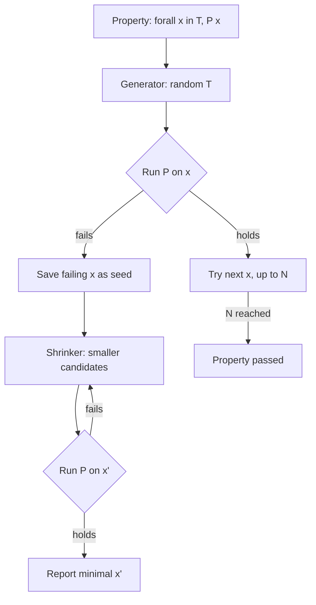
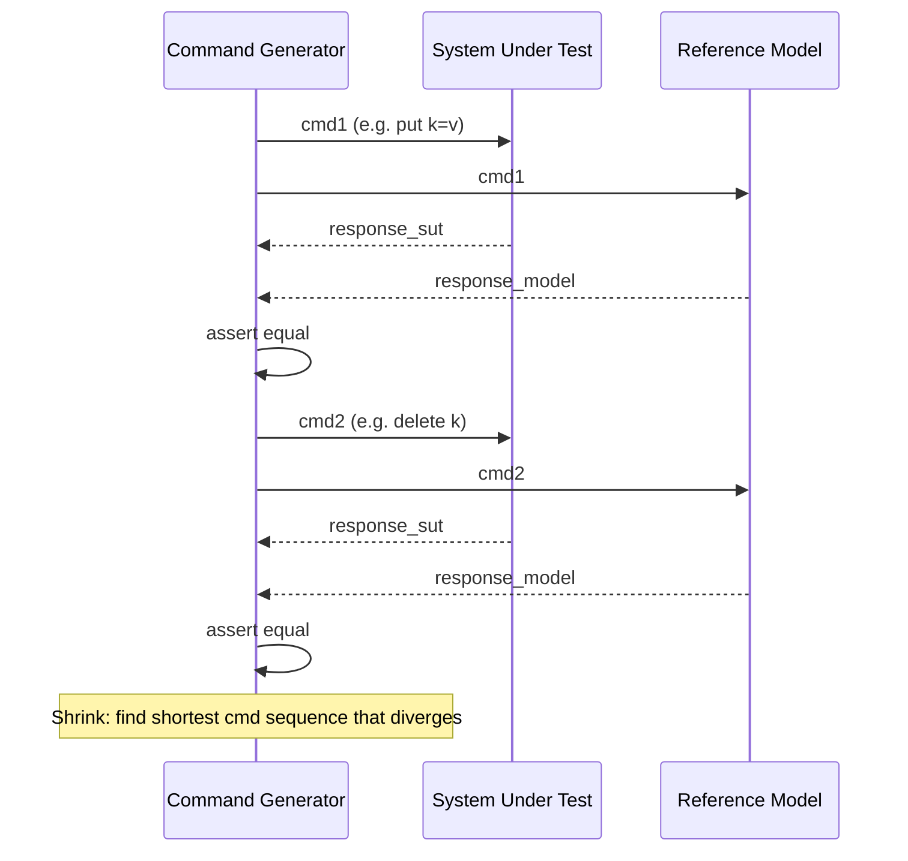

# Property-Based Testing

## Why This Exists

**Problem.** Example-based tests are bounded by the imagination of the person who wrote them. You write `assert add(2, 3) == 5` and `assert add(-1, 1) == 0`, ship it, and a year later someone discovers `add(0.1, 0.2) != 0.3`, or your sort breaks on a list of one `NaN`, or your URL parser segfaults on `http://[::1]%`. The hand-picked examples covered the cases the author thought of; production exercises the cases they didn't.

**Key insight.** Most real bugs are not "this specific input produces this specific wrong output." They are violations of *invariants* that should hold for **all** inputs in some domain. `decode(encode(x)) == x` for every `x`. `sort(sort(xs)) == sort(xs)` for every `xs`. `len(merge(a, b)) == len(a) + len(b)` for every disjoint pair. If you can state the invariant, a property-based testing (PBT) framework can generate thousands of inputs, find one that breaks the invariant, and **shrink** that input to the smallest, most readable counterexample.

The seminal QuickCheck paper (Claessen & Hughes, ICFP 2000) introduced the model: properties as universally quantified predicates, type-directed random generators, and shrinking to localize failure. Every modern PBT library — Hypothesis, fast-check, Hedgehog, ScalaCheck, jqwik, PropEr, Gopter, proptest — descends from this paper.

**Reach for this when:**
- You are writing a parser, encoder, serializer, or any function with a natural inverse (round-trip property).
- You are reimplementing or optimizing a function that has a slow but obviously-correct reference (model-based / oracle property).
- The input space is large and structured: trees, graphs, JSON, SQL, regex, dates, money, Unicode.
- The function is supposed to be idempotent, commutative, associative, monotonic, or order-independent — all easy to express, hard to cover by examples.
- You are testing a stateful API (cache, queue, state machine) where the bug is a sequence of operations, not a single call.

**Don't reach for this when:**
- The function is pure I/O or glue with no algebraic structure (`def send_slack(msg): requests.post(...)`). PBT has nothing to assert.
- The "correctness" criterion is "matches the spec the PM described in Slack" — there is no oracle, just stakeholder taste. Use examples.
- The unit under test is dominated by a single hot example you've already pinned (e.g., a regulatory-mandated calculation with a published test vector). Add the vector as a fixed example; PBT is supplementary, not replacement.
- You can't write a property that's stronger than a tautology. `assert f(x) == f(x)` is not a property; it's a smell.
- Generation cost dwarfs the bug-finding return: tightly looped numeric kernels where 10 examples already pin behavior down to ULPs.

## Diagrams

The PBT loop has two phases most engineers underestimate: **generation** (which is easy and obvious) and **shrinking** (which is what makes it usable).



Stateful / model-based testing layers a second loop on top: generate a *sequence* of commands, run them against the real system and a model, compare observable state.



## Core Patterns

### 1. The four properties you'll write 80% of the time

These are the patterns that pay for themselves on the first day. Memorize them.

| Property | Shape | Example |
|---|---|---|
| **Round-trip** | `decode(encode(x)) == x` | JSON, base64, protobuf, URL parsing |
| **Idempotency** | `f(f(x)) == f(x)` | normalize, dedupe, sort, ToS-canonicalize |
| **Invariant preservation** | `inv(f(x))` whenever `inv(x)` | balanced-tree rotations, valid-state transitions |
| **Model equivalence** | `f(x) == reference(x)` | optimized impl vs naive impl, cache vs source-of-truth |

A fifth one — **metamorphic** — shows up when you have no oracle but you do have algebraic relationships: `sort(reverse(xs)) == sort(xs)`, `len(filter(p, xs)) <= len(xs)`. This is how you test ML models and approximate algorithms.

### 2. Hypothesis (Python) — the day-to-day workhorse

Hypothesis is the most aggressive shrinker on this list and has the best ergonomics for stateful tests. It also persists failing examples to `.hypothesis/` so a flake one day becomes a regression test the next.

```python
# pip install hypothesis
from hypothesis import given, strategies as st, settings, assume, example
import json

# --- Round-trip property ---
@given(st.recursive(
    st.none() | st.booleans() | st.floats(allow_nan=False, allow_infinity=False)
              | st.text() | st.integers(),
    lambda children: st.lists(children) | st.dictionaries(st.text(), children),
    max_leaves=50,
))
@example({})            # always run the empty-dict case
@example({"k": None})   # always run the null-value case
def test_json_round_trip(value):
    """json.loads(json.dumps(x)) must equal x for any JSON-able value."""
    assert json.loads(json.dumps(value)) == value
# Hypothesis will find: floats that lose precision, dict keys that aren't strings,
# tuples that silently become lists, NaN/inf if you forgot to disallow them.

# --- Idempotency ---
def normalize_path(p: str) -> str:
    # ...some implementation...
    import os
    return os.path.normpath(p)

@given(st.text(min_size=1).filter(lambda s: "\x00" not in s))
def test_normalize_is_idempotent(p):
    assume(p.strip())  # discard inputs we don't care about
    once = normalize_path(p)
    twice = normalize_path(once)
    assert once == twice, f"normalize not idempotent: {p!r} -> {once!r} -> {twice!r}"

# --- Model-based: optimized impl vs reference ---
def fast_unique(xs):
    seen = set()
    out = []
    for x in xs:
        if x not in seen:
            seen.add(x)
            out.append(x)
    return out

def slow_reference_unique(xs):
    return [x for i, x in enumerate(xs) if x not in xs[:i]]

@given(st.lists(st.integers()))
def test_fast_unique_matches_reference(xs):
    assert fast_unique(xs) == slow_reference_unique(xs)

# --- Invariant preservation: a sorted list stays sorted after insert ---
import bisect

@given(st.lists(st.integers()).map(sorted), st.integers())
def test_bisect_insort_preserves_order(xs, x):
    bisect.insort(xs, x)
    assert xs == sorted(xs)
    assert x in xs
```

**Stateful / model-based testing in Hypothesis.** This is the single most under-used feature in the Python ecosystem. It finds bugs that no unit test can.

```python
from hypothesis.stateful import RuleBasedStateMachine, rule, invariant
from hypothesis import strategies as st

class LRUCacheUnderTest:
    """The real implementation we're testing."""
    def __init__(self, capacity): ...
    def get(self, k): ...
    def put(self, k, v): ...
    def __len__(self): ...

class LRUStateMachine(RuleBasedStateMachine):
    def __init__(self):
        super().__init__()
        self.cache = LRUCacheUnderTest(capacity=3)
        self.model = {}             # source-of-truth shadow
        self.order = []             # MRU at end
        self.capacity = 3

    @rule(k=st.integers(0, 5), v=st.integers())
    def put(self, k, v):
        self.cache.put(k, v)
        # Mirror in model
        if k in self.model:
            self.order.remove(k)
        elif len(self.model) >= self.capacity:
            evict = self.order.pop(0)
            del self.model[evict]
        self.model[k] = v
        self.order.append(k)

    @rule(k=st.integers(0, 5))
    def get(self, k):
        got = self.cache.get(k)
        expected = self.model.get(k)
        assert got == expected, f"get({k}) returned {got}, model says {expected}"
        if k in self.model:
            self.order.remove(k)
            self.order.append(k)

    @invariant()
    def size_within_capacity(self):
        assert len(self.cache) <= self.capacity

TestLRU = LRUStateMachine.TestCase
# Hypothesis will generate sequences like put(1,a), put(2,b), get(1), put(3,c), put(4,d), get(2)
# and shrink any failure to the shortest sequence that breaks the model match.
```

### 3. fast-check (TypeScript) — for Node/browser code

fast-check is the TypeScript equivalent. Same ideas, different syntax. Excellent integration with `vitest` and `jest`.

```typescript
// npm i -D fast-check
import fc from "fast-check";
import { describe, test } from "vitest";

// --- Round-trip with structured arbitraries ---
test("URLSearchParams round-trip", () => {
  fc.assert(
    fc.property(
      fc.dictionary(
        fc.string({ minLength: 1 }).filter(s => !s.includes("\0")),
        fc.string(),
      ),
      (record) => {
        const params = new URLSearchParams(record);
        const decoded = Object.fromEntries(params.entries());
        // Note: dict semantics: last write wins. We match that.
        for (const [k, v] of Object.entries(record)) {
          if (decoded[k] !== v) return false;
        }
        return true;
      },
    ),
    { numRuns: 1000 },
  );
});

// --- Model-based commands for a stateful API ---
class CounterModel { value = 0; }
class CounterReal { /* the actual implementation */ value = 0; }

class IncCommand implements fc.Command<CounterModel, CounterReal> {
  check = () => true;
  run(m: CounterModel, r: CounterReal) {
    m.value += 1;
    r.value += 1;
    if (m.value !== r.value) throw new Error(`drift: ${m.value} vs ${r.value}`);
  }
  toString = () => "inc";
}

class ResetCommand implements fc.Command<CounterModel, CounterReal> {
  check = (m: Readonly<CounterModel>) => m.value > 0;
  run(m: CounterModel, r: CounterReal) {
    m.value = 0;
    r.value = 0;
  }
  toString = () => "reset";
}

test("counter matches model", () => {
  fc.assert(
    fc.property(
      fc.commands([fc.constant(new IncCommand()), fc.constant(new ResetCommand())]),
      (cmds) => {
        const setup = () => ({ model: new CounterModel(), real: new CounterReal() });
        fc.modelRun(setup, cmds);
      },
    ),
  );
});
```

### 4. QuickCheck (Haskell) — the original

The terseness is the lesson. When you have a strong type system, properties read like the math.

```haskell
-- cabal install --lib QuickCheck
import Test.QuickCheck
import Data.List (sort)

prop_reverse_involutive :: [Int] -> Bool
prop_reverse_involutive xs = reverse (reverse xs) == xs

prop_sort_idempotent :: [Int] -> Bool
prop_sort_idempotent xs = sort (sort xs) == sort xs

prop_sort_preserves_length :: [Int] -> Bool
prop_sort_preserves_length xs = length (sort xs) == length xs

-- Conditional property: implication
prop_insert_keeps_sorted :: Int -> [Int] -> Property
prop_insert_keeps_sorted x xs =
  isSorted xs ==> isSorted (insertOrdered x xs)

-- The QuickCheck paper (Claessen & Hughes 2000) introduced this exact style.
-- Note the `==>`: it discards inputs that don't satisfy the precondition.
-- If you discard too many, QuickCheck warns ("gave up after 100 tests with 95 discards")
-- and you should switch to a generator that produces only valid inputs.

genSortedList :: Gen [Int]
genSortedList = sort <$> arbitrary

prop_insert_keeps_sorted' :: Int -> Property
prop_insert_keeps_sorted' x =
  forAll genSortedList $ \xs -> isSorted (insertOrdered x xs)
```

### 5. Hedgehog — integrated shrinking, no `Arbitrary` typeclass

Hedgehog's design lesson is **integrated shrinking**: the generator and shrinker are one value, so you can't accidentally generate something the shrinker can't shrink. QuickCheck's separate `Arbitrary`/`shrink` is a frequent source of bad shrinks. Hypothesis took the same lesson.

```haskell
-- cabal install --lib hedgehog
import Hedgehog
import qualified Hedgehog.Gen as Gen
import qualified Hedgehog.Range as Range

prop_reverse :: Property
prop_reverse = property $ do
  xs <- forAll $ Gen.list (Range.linear 0 100) (Gen.int (Range.linearBounded))
  reverse (reverse xs) === xs

-- Generators carry their own shrink tree. There is no separate `shrink` to forget.
genUser :: Gen User
genUser = User
  <$> Gen.text (Range.linear 1 32) Gen.alphaNum
  <*> Gen.int (Range.linear 0 150)
-- Hedgehog will shrink toward shorter names and smaller ages automatically.
```

### 6. Generators: the part you actually have to design

Default `arbitrary` / `anything()` generators are fine for primitives. For your domain types, you write generators by hand. The two failure modes:

- **Generator too narrow.** It only produces valid-looking inputs, and the bug lives in invalid input. (E.g., your URL generator never emits IPv6, never emits `%`-encoded bytes, never emits empty paths. Real users do all three.)
- **Generator too wide.** It produces inputs the function isn't supposed to handle, so most runs fail trivially and the actually-interesting region is under-sampled. Use `assume(...)` (Hypothesis) / `.filter(...)` (fast-check) sparingly — they discard cases, and too many discards stalls the run.

The right answer is almost always a **constructive** generator that produces only well-formed inputs by construction. To generate a sorted list, generate a list and `sort` it. To generate a valid IPv4, build it from four `int(0..255)`s. To generate a valid binary search tree, build it bottom-up.

```python
# WRONG: filter-heavy, will discard >99% of inputs
@given(st.lists(st.integers()).filter(lambda xs: xs == sorted(xs)))
def test_thing(xs): ...

# RIGHT: construct sorted lists directly
@given(st.lists(st.integers()).map(sorted))
def test_thing(xs): ...
```

For recursive structures (trees, JSON), use the framework's recursive combinator with a bounded depth — uniform random recursion will either OOM or never terminate.

### 7. Shrinking: why your counterexamples are usable

When a property fails, the framework re-runs it on progressively smaller candidates derived from the failing input until it finds the smallest one that still fails. That's why `[42, -1000000, 42]` becomes `[0, -1, 0]` in your bug report. Without shrinking, you'd get the original 50-element float list and have to bisect by hand.

Shrinking quality is the difference between PBT being delightful and being abandoned. Hypothesis and Hedgehog have integrated shrinkers that "just work." QuickCheck requires you to write `shrink` by hand for custom types — and a custom generator without a custom shrinker will produce huge, unreadable counterexamples on failure.

### 8. Reproducibility and seeds

Every framework lets you pin a seed so a CI failure is reproducible locally. **Always log the seed on failure.** Hypothesis additionally writes failing examples to `.hypothesis/examples/` and replays them first on the next run — commit this directory or you'll lose your regression corpus when CI runs on a fresh container.

```python
# pytest --hypothesis-seed=12345
# or in code:
@settings(derandomize=True)  # makes runs deterministic across machines
```

## Trade-offs

| Benefit | Cost |
|---|---|
| Finds bugs example tests miss — empty inputs, unicode, NaN, integer overflow, deeply nested structures, race conditions in stateful tests. | Test runtime grows from milliseconds to seconds-per-property. A full PBT suite can take minutes; CI budgets shift. |
| Properties are short and high-leverage: one `round_trip` line covers thousands of cases. | Writing good properties is a skill. The first one you write will be a tautology; the second will be too narrow. Plan to iterate. |
| Counterexamples are minimized by shrinking, so debugging is fast. | Bad generators (too-wide, filter-heavy) produce mostly-discarded runs and *no* failures even when bugs exist — false confidence. |
| Stateful PBT exposes ordering bugs (cache vs DB drift, retry-induced double-writes) that no unit test will find. | Stateful PBT is non-trivial to set up: you need a model, a command grammar, and an invariant. Often the model is half the work. |
| Failing examples persist as regression corpus. | The `.hypothesis/` directory needs to be committed or shared, or you lose the corpus. CI on ephemeral runners makes this awkward. |
| Forces you to articulate what your function is *supposed* to do. Often surfaces under-specified behavior before it ships. | Some functions genuinely have no algebraic structure — for those, PBT adds nothing and example tests are the right tool. |
| Seed-pinned failures are reproducible across machines. | Flaky properties (those depending on time, system entropy, FS state) become harder to debug than flaky example tests. |

## Common Pitfalls

- **Tautological properties.** `assert f(x) == f(x)` or `assert isinstance(f(x), int)` proves nothing your type system doesn't. The property must encode *behavior*, not types. If you find yourself struggling to write a non-trivial property, that's a signal — either the function has no algebraic structure (use examples) or you don't yet understand what it's supposed to do.

- **Filter-heavy generators that silently give up.** `st.lists(st.integers()).filter(lambda xs: len(xs) > 10 and sum(xs) == 100)` will discard almost every candidate. Hypothesis warns "Failed to generate after N attempts." fast-check silently runs fewer tests. Always prefer constructive generators (`compose` / `bind` / `map`) over filtered generators.

- **Forgetting the precondition leaks bugs.** `assert sort(xs)[0] <= sort(xs)[-1]` is true for non-empty `xs` but indexes out of range when `xs == []`. PBT will find `[]` on the first run. Either add `assume(len(xs) > 0)` or restrict the generator: `st.lists(st.integers(), min_size=1)`.

- **Shrinking through side effects.** If your property opens files, hits a database, or mutates global state, shrinking will replay all those effects on each candidate. Hundreds of times. Either (a) make the property pure and inject a mock, or (b) use a framework feature like Hypothesis's `@settings(deadline=None)` plus an explicit per-test fixture.

- **Floating-point equality.** `assert encode_decode(x) == x` will fail randomly on `float` because of precision. Use `math.isclose(a, b, rel_tol=1e-9)` or generate `Decimal`. Better: skip floats unless the property is specifically about float behavior.

- **Forgetting NaN.** `st.floats()` includes `NaN`, `inf`, `-inf` by default. `NaN != NaN`, so any property of the form `f(x) == f(x)` will fail on `NaN`. Either pass `allow_nan=False` or write the property using `math.isnan` checks. The default is correct — it's your code that's wrong about NaN, not the generator.

- **Time-dependent properties.** "Encrypt then decrypt" depends on a monotonic clock if your encryption is timestamp-bound. PBT will replay your test with the same clock skew on shrink and produce confusing reports. Inject the clock.

- **Order-dependent state in test runners.** pytest-xdist running properties in parallel with a shared `.hypothesis/` is a race. Either disable parallelism for PBT tests or set `HYPOTHESIS_DATABASE_FILE` per worker.

- **Treating PBT as a replacement for examples.** It isn't. Your regression test for "the bug we shipped on 2023-04-12" is an example test pinned to that exact input. PBT is what *finds* such bugs in the first place; examples *prevent regression*. Use both. Hypothesis's `@example(...)` decorator is the bridge — it forces specific inputs to run alongside the generated ones.

- **Generating syntactically-valid-but-semantically-meaningless inputs.** A JSON generator that produces `{"_id": NaN}` will find your `JSON.stringify(NaN) === "null"` bug, and that bug is real. A SQL generator that produces `SELECT * FROM "DROP TABLE users"` is hitting your input sanitizer rather than your query optimizer. Know which layer you're testing.

- **Missing the regression corpus on CI.** Hypothesis's `.hypothesis/examples/` is the single most valuable artifact PBT produces. If your CI runs in fresh containers and discards it, you lose the corpus and re-find the same bug repeatedly. Either commit it, cache it on CI, or use `hypothesis.database.GitHubArtifactDatabase` (CI plugin).

- **Shrinking takes too long.** A property over 1000-element lists with a slow predicate can shrink for minutes. Set `@settings(max_examples=200, deadline=timedelta(seconds=2))` and accept slightly weaker coverage on hot tests; reserve full runs for nightly CI.

## Decision Table

| Situation | Use this | Not this | Why |
|---|---|---|---|
| Testing `JSON.parse`/`JSON.stringify` | Round-trip property over recursive `st.recursive` / `fc.jsonValue` | A handful of fixed example strings | The interesting bugs (NaN, lone surrogates, big ints, dict ordering) are in the long tail. |
| Testing a UI button click handler | Example test with mocked DOM | PBT | No algebraic structure; correctness is "matches mockup", not invariant. |
| Optimizing a sort or hash | Model-based property: `fast_impl(xs) == reference_impl(xs)` | Benchmarks alone | You need both: PBT for correctness, benchmarks for speed. They are different tools. |
| Concurrent map / queue / cache | Stateful PBT (`RuleBasedStateMachine`, `fc.commands`) | Sequential unit tests | Concurrency bugs are sequence bugs; example tests can't enumerate the schedules that matter. |
| Regulatory calculation with published test vectors | Example tests pinned to vectors **plus** PBT for invariants | PBT alone | The vectors are the contract. PBT supplements with edge cases the regulator didn't enumerate. |
| One-shot script you'll throw away tomorrow | Skip both | PBT | Test cost > expected bug cost. PBT especially has high setup cost. |
| Cross-language port (Python → Rust) | Model-based PBT with old impl as oracle | Manual diffing | Generated inputs find the long-tail behavioral differences automatically. |
| Pure I/O / network glue | Integration tests, contract tests | PBT | No invariant to assert. PBT degenerates into checking the mock framework. |
| Migration: old schema → new schema | Round-trip + invariant: `migrate_back(migrate(x)) == x` for all rows | Sample 1000 prod rows and diff | PBT covers shapes prod hasn't seen yet (the rows you'll add tomorrow). Use both. |
| Compiler / interpreter / type checker | PBT with grammar-based generators (e.g. CSmith-style) | Hand-written test suite alone | Industry-standard: GCC, LLVM, Z3, every database all use generative testing. |
| Cryptography correctness (not security) | PBT for round-trip, idempotency, key-independence | Examples alone | Crypto APIs misuse easily; PBT finds the misuse modes. **Never** PBT-test for security; that requires formal proof or audit. |
| Testing exact float arithmetic | Examples with bit-exact comparisons | PBT with `==` on floats | PBT will keep finding "differences" that are last-bit rounding. Wrong tool. |

## References

- Claessen & Hughes — **QuickCheck: A Lightweight Tool for Random Testing of Haskell Programs** — ICFP 2000 — https://dl.acm.org/doi/10.1145/351240.351266 (the founding paper; ~30 pages, the primary source for everything else here)
- MacIver — **Hypothesis documentation** — https://hypothesis.readthedocs.io/en/latest/
- MacIver — **What is Hypothesis?** (background, design choices, integrated shrinking) — https://hypothesis.works/articles/what-is-hypothesis/
- fast-check — **Documentation** — https://fast-check.dev/
- Hedgehog — **Documentation and design rationale** — https://hedgehog.qa/
- Claessen — **Shrinking and showing functions** — Haskell Symposium 2012 — https://dl.acm.org/doi/10.1145/2364506.2364516
- Hughes — **Experiences with QuickCheck: Testing the Hard Stuff and Staying Sane** — http://publications.lib.chalmers.se/records/fulltext/232550/local_232550.pdf
- Hughes — **How QuickCheck Tests Erlang's `dets`** (the leveldb / car-network war stories) — talk: https://www.youtube.com/watch?v=zi0rHwfiX1Q
- Norell, Svensson, Hughes — **Find More Bugs with QuickCheck!** (model-based testing patterns) — https://publications.lib.chalmers.se/records/fulltext/249260/local_249260.pdf
- Yang et al. — **Finding and Understanding Bugs in C Compilers** (CSmith — generative testing applied to GCC/LLVM, 325+ bugs) — PLDI 2011 — https://www.cs.utah.edu/~regehr/papers/pldi11-preprint.pdf
- Lampropoulos & Pierce — **QuickChick: Property-Based Testing in Coq** — https://softwarefoundations.cis.upenn.edu/qc-current/toc.html
- Goldstein, Frankau, Hughes — **Property-Based Testing in Practice** (industrial usage at Jane Street, Volvo, Erlang Solutions) — ICSE 2024 — https://harrisongoldste.in/papers/icse24-pbt-in-practice.pdf
- DDIA — Kleppmann — **Designing Data-Intensive Applications**, ch. 8 "The Trouble with Distributed Systems" (motivation for stateful/model-based testing of distributed components)
- Google SRE Book — ch. 17 "Testing for Reliability" — https://sre.google/sre-book/testing-reliability/
- Hillel Wayne — **Beyond Smoke and Mirrors: Property-Based Testing** — https://www.hillelwayne.com/post/property-testing-complications/

## See Also

- `../testing-pyramid/` — where PBT fits relative to unit, integration, and end-to-end tests
- `../test-doubles/` — when you need to mock for a property test (clocks, RNG, network)
