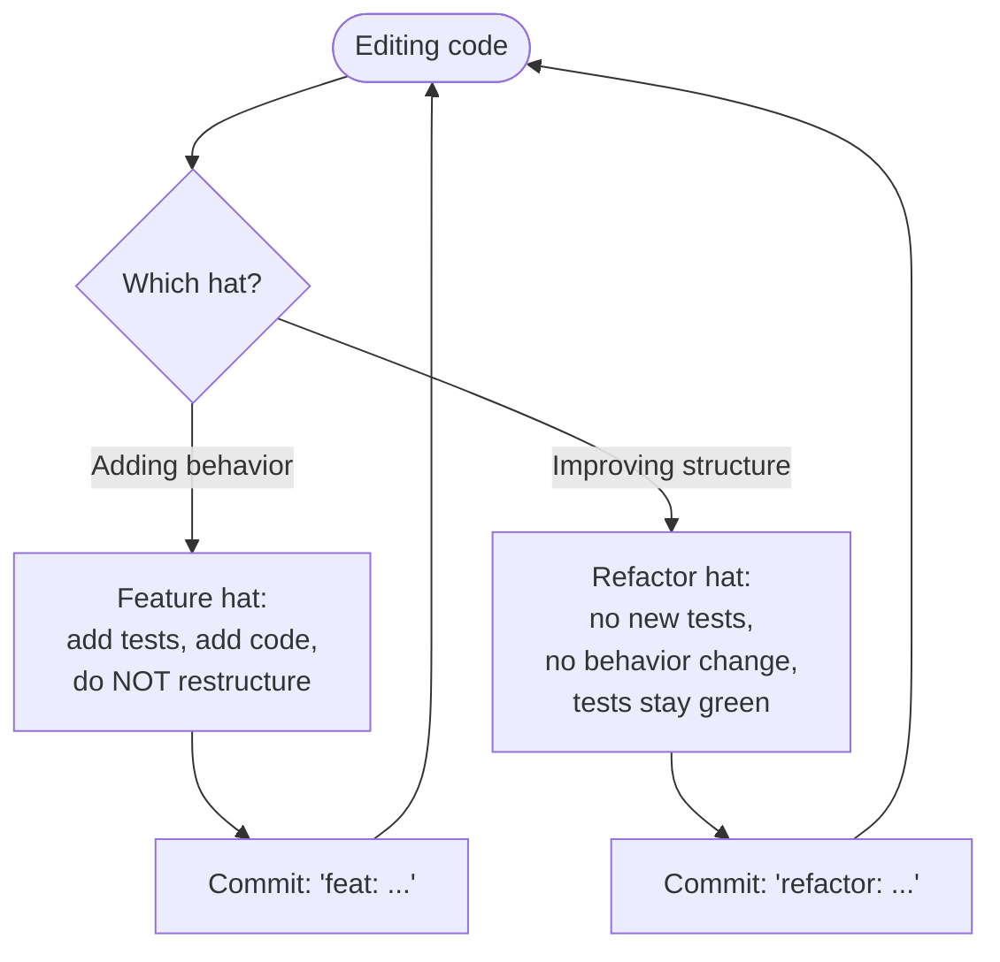
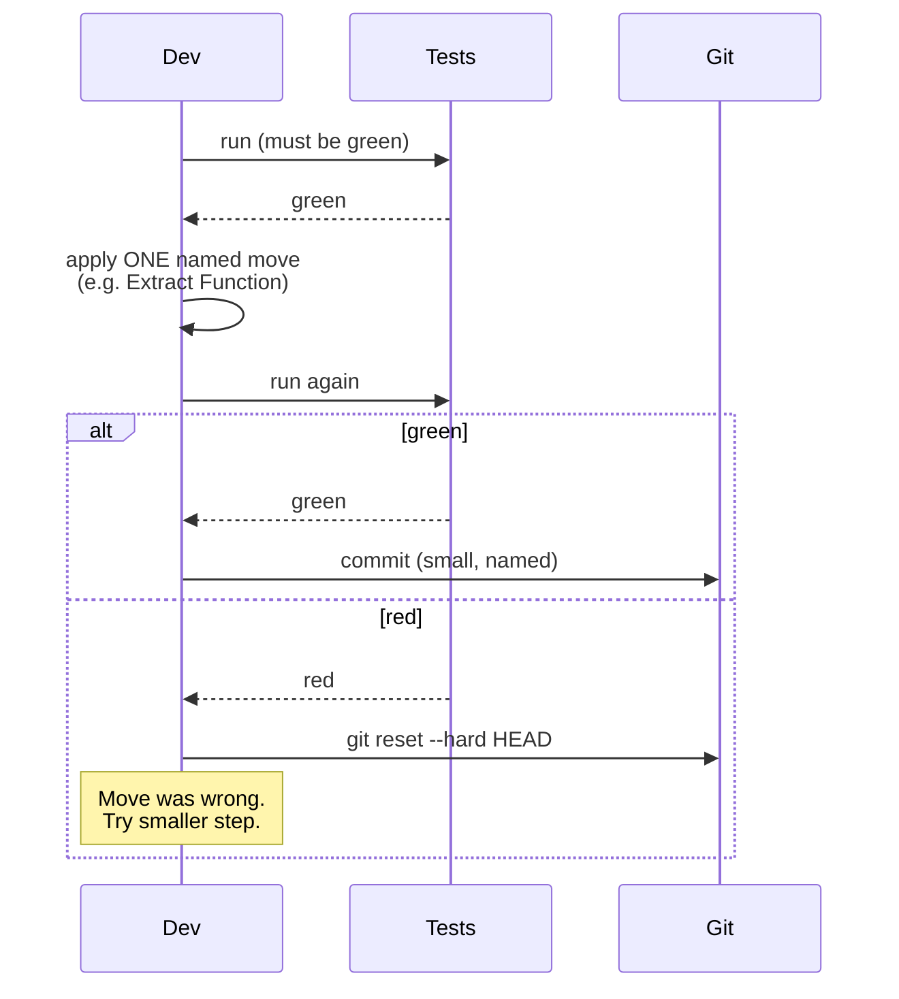

# Refactoring Catalog

## Why This Exists

**Problem.** Code rots in predictable ways: a function balloons from 5 lines to 200, a switch on `type` accretes a new case every quarter, a literal `0.0825` (sales tax) multiplies across files, a loop computes both the average and the max and the count and emits a side effect. You *know* it's wrong but rewriting wholesale risks weeks of regressions. The middle ground — small, mechanical, behavior-preserving transformations applied one at a time with tests green between each — is what Fowler calls **refactoring**.

**Key insight.** Refactoring is not "cleanup we'll do someday". It is a **disciplined technique** with named moves, each one tiny enough that a competent reviewer can verify correctness by inspection. The discipline is: (1) green tests before, (2) one named move, (3) green tests after, (4) commit. If you can't run the tests in seconds, you can't refactor — you can only rewrite.

**Reach for this when:**
- A function is longer than ~10–20 lines or you need a comment to explain what a chunk does (Extract Function).
- A `switch` / `if-else` chain dispatches on a type code and keeps growing (Replace Conditional with Polymorphism, Replace Type Code with Subclasses).
- The same literal (`86400`, `"USD"`, `0.0825`, `"admin"`) appears in 3+ places (Replace Magic Number).
- Two unrelated computations share a loop body (Split Loop) or a chain of map/filter would be clearer (Replace Loop with Pipeline).
- A field lives on the wrong class — every method that touches it crosses a boundary (Move Field).
- A handful of free functions all take the same first argument (Combine Functions into Class).
- You're about to add a feature and the existing shape fights you. **Refactor first to make the change easy, then make the easy change** (Beck).

**Don't reach for this when:**
- Tests are red, flaky, or absent. Refactoring without a safety net is rewriting with extra steps. Either add characterization tests first (Feathers, *Working Effectively with Legacy Code*) or stop.
- The code is about to be deleted. Don't polish the corpse.
- You're in the middle of a feature branch and the refactor is unrelated. **Separate refactoring commits from behavior-changing commits** — review and revert become trivial.
- Performance is the issue and the refactor changes algorithmic complexity. Measure first; refactoring catalogs are about clarity, not speed (though clarity often unlocks the optimization).
- A clean-sheet rewrite is genuinely cheaper *and* you have the budget *and* you can run old/new in parallel. Rare. Be honest.

---

## Diagrams

### The two-hat rule (Beck)



You are wearing exactly one hat at a time. Switching hats mid-edit is how regressions sneak in and how PRs become unreviewable.

### Inner loop of a single refactoring move



The reset is the point. Every refactoring move must be **trivially revertible** — if it isn't, the move was too big.

---

## The Catalog

The moves below are grouped by the smell they address. Each entry: the trigger, the mechanics (numbered, in order), a before/after, and the inverse.

### 1. Extract Function (and its inverse, Inline Function)

**Trigger.** A code fragment needs a comment to explain it; or the same fragment appears twice; or a function does two things.

**Mechanics** (Fowler 2e §6.1):
1. Create a new function named for *intent*, not implementation (`calculateOutstanding`, not `loopThroughInvoices`).
2. Copy the fragment into it.
3. Pass any locals it reads as parameters; return any locals it writes.
4. Replace the original fragment with a call.
5. Run tests. Commit.

```python
# Before
def print_owing(invoice):
    outstanding = 0
    print("***********************")
    print("**** Customer Owes ****")
    print("***********************")

    # calculate outstanding
    for order in invoice.orders:
        outstanding += order.amount

    # print details
    today = datetime.now()
    print(f"name: {invoice.customer}")
    print(f"amount: {outstanding}")
    print(f"due: {today + timedelta(days=30):%Y-%m-%d}")

# After — three small functions, each named for intent
def print_owing(invoice):
    print_banner()
    outstanding = calculate_outstanding(invoice)
    print_details(invoice, outstanding)

def print_banner():
    print("***********************")
    print("**** Customer Owes ****")
    print("***********************")

def calculate_outstanding(invoice):
    return sum(o.amount for o in invoice.orders)

def print_details(invoice, outstanding):
    today = datetime.now()
    print(f"name: {invoice.customer}")
    print(f"amount: {outstanding}")
    print(f"due: {today + timedelta(days=30):%Y-%m-%d}")
```

**Inline Function** is the reverse — when the body is as clear as the name, or when the indirection adds no value, fold the function back into its caller. Often a stepping stone before re-extracting along better seams.

### 2. Extract Variable / Inline Variable

**Trigger.** A subexpression is hard to parse, or appears twice in the same scope, or you'd like to set a breakpoint on it.

```typescript
// Before
return order.quantity * order.itemPrice -
       Math.max(0, order.quantity - 500) * order.itemPrice * 0.05 +
       Math.min(order.quantity * order.itemPrice * 0.1, 100);

// After
const basePrice    = order.quantity * order.itemPrice;
const quantityDisc = Math.max(0, order.quantity - 500) * order.itemPrice * 0.05;
const shipping     = Math.min(basePrice * 0.1, 100);
return basePrice - quantityDisc + shipping;
```

The *names* are the value. `basePrice` documents intent in a way a comment never could.

### 3. Replace Magic Number with Symbolic Constant

**Trigger.** A literal with semantic meaning appears in code. The classic offenders: `86400` (seconds in a day), `0.0825` (CA sales tax), `200` (HTTP OK), `"admin"` (role), `7` (retention days).

```go
// Before — what's 86400?
if time.Since(token.IssuedAt).Seconds() > 86400 {
    return ErrExpired
}

// After
const tokenLifetime = 24 * time.Hour
if time.Since(token.IssuedAt) > tokenLifetime {
    return ErrExpired
}
```

The risk multiplies in distributed systems: when the literal is duplicated across services, changing the policy means a coordinated multi-deploy. Centralize early.

### 4. Encapsulate Variable (a.k.a. Self-Encapsulate Field)

**Trigger.** A piece of mutable state is widely accessed and you need to add validation, logging, lazy init, or change the representation.

```java
// Before — defaultOwner is a public mutable map
public class Customer {
    public static Map<String,String> defaultOwner =
        Map.of("firstName","Martin","lastName","Fowler");
}

// After — accessors give you a place to put rules
public class Customer {
    private static Map<String,String> defaultOwner =
        Map.of("firstName","Martin","lastName","Fowler");

    public static Map<String,String> getDefaultOwner() {
        return Map.copyOf(defaultOwner); // defensive copy
    }
    public static void setDefaultOwner(Map<String,String> v) {
        defaultOwner = Map.copyOf(v);
    }
}
```

This is the prerequisite to almost every other refactoring that touches state. Without an accessor, you can't intercept the access to add behavior.

### 5. Move Field / Move Function

**Trigger.** A method on `A` repeatedly reaches into `B` (`a.b.x`, `a.b.y`, `a.b.compute()`) — Feature Envy. The method belongs on `B`. Or a field on `Order` is only used by `Customer` — it belongs on `Customer`.

```typescript
// Before — Account.overdraftCharge reaches into AccountType
class Account {
    overdraftCharge(): number {
        if (this.type.isPremium) {
            const baseCharge = 10;
            if (this.daysOverdrawn <= this.type.premiumLimit) return baseCharge;
            return baseCharge + (this.daysOverdrawn - this.type.premiumLimit) * 0.85;
        }
        return this.daysOverdrawn * 1.75;
    }
}

// After — moved to AccountType, which owns the policy
class AccountType {
    overdraftCharge(daysOverdrawn: number): number {
        if (this.isPremium) {
            const baseCharge = 10;
            if (daysOverdrawn <= this.premiumLimit) return baseCharge;
            return baseCharge + (daysOverdrawn - this.premiumLimit) * 0.85;
        }
        return daysOverdrawn * 1.75;
    }
}
class Account {
    overdraftCharge() { return this.type.overdraftCharge(this.daysOverdrawn); }
}
```

Mechanics: (1) ensure the source field/method is encapsulated, (2) copy to the target, (3) update all callers, (4) delete the source, (5) tests after each step.

### 6. Slide Statements

**Trigger.** Related code is scattered. Variables used together aren't declared together; a `let` lives 30 lines from its first use.

```python
# Before
def price(item):
    base = item.price
    discount_factor = 0.95
    if item.coupon:
        discount_factor = 0.85
    quantity = item.quantity   # used immediately below
    total = base * quantity
    return total * discount_factor

# After — sliding `quantity` next to its use, grouping discount logic
def price(item):
    base = item.price
    quantity = item.quantity
    total = base * quantity
    discount_factor = 0.85 if item.coupon else 0.95
    return total * discount_factor
```

A pure cosmetic move — but it's almost always a *prerequisite* for Extract Function, because you need the related lines adjacent before you can lift them.

### 7. Split Loop

**Trigger.** A single loop does two unrelated things. The body has two halves that don't share state.

```go
// Before — one loop, two purposes
var youngest int = math.MaxInt
var totalSalary int
for _, p := range people {
    if p.Age < youngest { youngest = p.Age }
    totalSalary += p.Salary
}

// After — two loops, each named for intent
youngest := func() int {
    m := math.MaxInt
    for _, p := range people { if p.Age < m { m = p.Age } }
    return m
}()
totalSalary := func() int {
    s := 0
    for _, p := range people { s += p.Salary }
    return s
}()
```

"But that's two passes over the data!" Yes. If the list is 50 elements, the cost is invisible. If it's 50 million, *measure first* before sacrificing clarity. In >95% of business code the answer is: split the loop, then if profiling proves the dual pass dominates, fuse it back.

### 8. Replace Loop with Pipeline

**Trigger.** A loop is doing map/filter/reduce work imperatively. The accumulator and the index obscure intent.

```typescript
// Before
const officeWorkers: string[] = [];
for (const r of rows) {
    if (r.office === "London" && r.department === "engineering") {
        officeWorkers.push(`${r.lastName}, ${r.firstName}`);
    }
}

// After
const officeWorkers = rows
    .filter(r => r.office === "London" && r.department === "engineering")
    .map(r => `${r.lastName}, ${r.firstName}`);
```

Caveats: pipelines compose poorly with early-exit logic and side effects. If the body throws, mutates external state, or short-circuits on a flag, leave the imperative loop or split it first.

### 9. Replace Conditional with Polymorphism

**Trigger.** A `switch` (or `if-else` ladder) dispatches on a type tag, *and* the same tag drives behavior in 3+ places. Adding a new variant requires editing every site.

```python
# Before — open/closed violation: every new bird needs N edits
def plumage(bird):
    if   bird.type == "European": return "average"
    elif bird.type == "African":
        return "tired" if bird.coconuts > 0 else "average"
    elif bird.type == "Norwegian Blue":
        return "beautiful" if bird.voltage > 100 else "scorched"
    else:
        raise ValueError(bird.type)

def air_speed(bird):
    if   bird.type == "European": return 35
    elif bird.type == "African":  return 40 - 2 * bird.coconuts
    elif bird.type == "Norwegian Blue":
        return 0 if bird.is_nailed else 10 + bird.voltage / 10
    else:
        raise ValueError(bird.type)

# After — each variant owns its behavior; adding a new one is one new class
class Bird:
    def plumage(self):   raise NotImplementedError
    def air_speed(self): raise NotImplementedError

class EuropeanSwallow(Bird):
    def plumage(self):   return "average"
    def air_speed(self): return 35

class AfricanSwallow(Bird):
    def __init__(self, coconuts): self.coconuts = coconuts
    def plumage(self):   return "tired" if self.coconuts > 0 else "average"
    def air_speed(self): return 40 - 2 * self.coconuts

class NorwegianBlueParrot(Bird):
    def __init__(self, voltage, is_nailed):
        self.voltage, self.is_nailed = voltage, is_nailed
    def plumage(self):
        return "beautiful" if self.voltage > 100 else "scorched"
    def air_speed(self):
        return 0 if self.is_nailed else 10 + self.voltage / 10
```

Don't apply this to a single isolated `switch`. The cost (more classes, more files, more indirection) only pays off when the dispatch repeats. **Three or more** is the rule of thumb.

### 10. Replace Type Code with Subclasses

**Trigger.** A `type` field (string or enum) gates behavior, and you've already done Replace Conditional with Polymorphism somewhere using it. Promote the type code itself to a class hierarchy.

```java
// Before
class Employee {
    private String type; // "engineer" | "manager" | "salesperson"
    Employee(String type) {
        if (!Set.of("engineer","manager","salesperson").contains(type))
            throw new IllegalArgumentException();
        this.type = type;
    }
}

// After — subclasses (or strategy objects) replace the string
abstract class Employee { /* ... */ }
class Engineer    extends Employee { /* ... */ }
class Manager     extends Employee { /* ... */ }
class Salesperson extends Employee { /* ... */ }
```

If the type can change at runtime (an engineer is promoted to manager), use the **Replace Type Code with State/Strategy** variant — keep `Employee` concrete and delegate to a swappable `EmployeeType` strategy object.

### 11. Combine Functions into Class

**Trigger.** A cluster of free functions all take the same first argument and operate on the same data. You're effectively passing `self` by hand.

```python
# Before
def base_charge(reading): ...
def tax_threshold(year):  ...
def taxable_charge(reading): return max(0, base_charge(reading) - tax_threshold(reading.year))
def calculate_charge(reading): return {"base": base_charge(reading), "taxable": taxable_charge(reading)}

# After
class Reading:
    def __init__(self, raw): self.raw = raw
    def base_charge(self):    ...
    def tax_threshold(self):  ...
    def taxable_charge(self): return max(0, self.base_charge() - self.tax_threshold())
    def calculate_charge(self):
        return {"base": self.base_charge(), "taxable": self.taxable_charge()}
```

The inverse is **Combine Functions into Transform** — when the data is immutable input/output (no behavior), build a derived record once instead of recomputing on every read.

### 12. Pull Up Field / Pull Up Method (and Push Down)

**Trigger.** Two sibling subclasses have the same field or method. Pull it up to the parent. Conversely, a method on the parent is only used by one subclass — push it down.

```kotlin
// Before
open class Employee(val name: String)
class Salesperson(name: String, val sales: Double) : Employee(name)
class Engineer(name: String, val sales: Double) : Employee(name)  // duplicated!

// After
open class Employee(val name: String, val sales: Double)
class Salesperson(name: String, sales: Double) : Employee(name, sales)
class Engineer(name: String, sales: Double)    : Employee(name, sales)
```

Mechanics: (1) ensure both fields have the same name and access pattern (rename if needed), (2) use Self-Encapsulate Field if direct access is widespread, (3) declare in parent, (4) delete from children, (5) tests.

### 13. Replace Primitive with Object (a.k.a. Whole Value)

**Trigger.** A primitive (string, int, float) carries domain meaning that gets re-validated everywhere. Phone numbers, money, percentages, IDs.

```typescript
// Before — Money as raw number, currency as raw string
function transfer(from: string, to: string, amount: number, currency: string) {
    if (amount < 0) throw new Error("negative");
    if (!["USD","EUR","GBP"].includes(currency)) throw new Error("bad ccy");
    // ... and again at every call site
}

// After
class Money {
    constructor(readonly amount: number, readonly currency: Currency) {
        if (amount < 0) throw new Error("Money cannot be negative");
    }
    add(other: Money): Money {
        if (other.currency !== this.currency)
            throw new Error("Currency mismatch");
        return new Money(this.amount + other.amount, this.currency);
    }
}
type Currency = "USD" | "EUR" | "GBP";
```

This is the gateway drug to a typed domain. Once you have `Money`, `EmailAddress`, `UserId`, the type system catches half your bugs at compile time.

### 14. Replace Nested Conditional with Guard Clauses

**Trigger.** Deeply nested `if`s where the indented branch is "the real work" and each level is a precondition.

```go
// Before
func payAmount(employee Employee) decimal.Decimal {
    var result decimal.Decimal
    if employee.IsSeparated {
        result = decimal.Zero
    } else {
        if employee.IsRetired {
            result = retirementAmount
        } else {
            result = computeNormalPayAmount(employee)
        }
    }
    return result
}

// After — guard clauses, then the happy path
func payAmount(employee Employee) decimal.Decimal {
    if employee.IsSeparated { return decimal.Zero }
    if employee.IsRetired   { return retirementAmount }
    return computeNormalPayAmount(employee)
}
```

The shape now matches the logic: "here are the special cases, then here is the main flow."

### 15. Decompose Conditional

**Trigger.** A complex condition: `if (date.before(SUMMER_START) || date.after(SUMMER_END))` — readable, but only if you slow down.

```python
# After
if not summer(date):
    charge = winter_rate * quantity + winter_service_charge
else:
    charge = summer_rate * quantity
```

Same logic, intent named.

### 16. Replace Constructor with Factory Function

**Trigger.** Construction has logic — selecting a subclass by type, returning a cached instance, validating the inputs.

```python
# Before — caller has to know the subclass map
def hire(type: str):
    if type == "engineer":   return Engineer()
    elif type == "manager":  return Manager()
    elif type == "salesperson": return Salesperson()

# After — factory hides the table; callers pass intent
class Employee:
    @classmethod
    def create(cls, type: str) -> "Employee":
        return {
            "engineer": Engineer,
            "manager": Manager,
            "salesperson": Salesperson,
        }[type]()
```

### 17. Separate Query from Modifier

**Trigger.** A function both returns a value *and* mutates state. Calling it twice gives different answers; you can't safely use it in an assertion.

```typescript
// Before
function getTotalOutstandingAndSendBill() {
    const total = customer.invoices.reduce((s, i) => s + i.amount, 0);
    sendBill(); // side effect
    return total;
}

// After
function totalOutstanding() {
    return customer.invoices.reduce((s, i) => s + i.amount, 0);
}
function sendBill() { /* ... */ }
```

Pairs with **Command-Query Separation** (Meyer): a function is *either* a query (returns a value, no side effects) *or* a command (changes state, returns nothing). Mixing them is a code smell with a name.

### 18. Parameterize Function (and inverse: Remove Flag Argument)

**Trigger.** Two functions differ only in a constant. Or: a function takes a `boolean` flag and `if (flag) {…} else {…}` — the flag is the API smell.

```python
# Before
def ten_percent_raise(p):  p.salary *= 1.10
def five_percent_raise(p): p.salary *= 1.05

# After — one function, value-parameterized
def raise_(p, factor): p.salary *= (1 + factor)

# Removing a flag — before
def deliver(order, urgent: bool):
    if urgent: ...
    else: ...

# After — two named functions
def regular_delivery(order): ...
def rush_delivery(order):    ...
```

Boolean flags hide the second function inside the first. Two named functions read better at the call site (`rush_delivery(order)` vs `deliver(order, true)`).

### 19. Preserve Whole Object

**Trigger.** A method takes 3+ values that all came from the same object. The signature lies about the dependency.

```java
// Before
boolean withinPlan = plan.withinRange(daysTempRange.low, daysTempRange.high);

// After
boolean withinPlan = plan.withinRange(daysTempRange);
```

### 20. Introduce Parameter Object

**Trigger.** The same group of parameters travels together through many functions. They are a concept; give them a name.

```typescript
// Before
function readingsOutsideRange(station, min: number, max: number) { ... }

// After
class NumberRange { constructor(public min: number, public max: number) {} }
function readingsOutsideRange(station, range: NumberRange) { ... }
```

This is also the seed of a future class with behavior — once `NumberRange` exists, `range.contains(x)` and `range.overlaps(other)` find a home.

### 21. Hide Delegate / Remove Middle Man

**Trigger.** Callers chain through `customer.getDepartment().getManager()` (Hide Delegate: give Customer a `getManager()` method). Inverse: `Customer` has a dozen pass-through methods that just call `department.X()` (Remove Middle Man: let callers go through `customer.department` directly). The choice depends on coupling — both are valid; **inconsistency** is the bug.

---

## Test-First Cadence

Refactoring without tests is rewriting blindfolded. The cadence:

1. **Find or build a safety net.** If the code under refactor has tests with adequate coverage of its public behavior, run them. If not: write **characterization tests** (Feathers, *WELC* ch. 13) — tests that pin down current behavior, not desired behavior. Use them as a tripwire while you refactor; delete or rewrite them once the structure is right and you can write proper tests.
2. **Before each move:** run tests. They must be green. If they aren't, fix that first.
3. **Apply one move.** From the catalog above, by name, in your head: "I am doing Extract Function."
4. **After the move:** run tests again. Green → commit. Red → `git reset --hard HEAD`. (No exceptions. The move was wrong.)
5. **Commit per move.** Tiny commits. The commit message names the move: `refactor: extract calculateOutstanding from printOwing`. PR review is now trivial — one diff per concept.
6. **Never mix hats.** A commit either changes behavior (and changes tests) or improves structure (and tests stay green). Both at once is unreviewable.

If tests take longer than ~10 seconds to run, you cannot afford this cadence — fix that first (test scoping, in-memory fakes, parallelization). Refactoring is dead in slow-test codebases.

---

## Trade-offs

| Benefit | Cost |
|---|---|
| Code that reads like the domain — names match concepts | Up-front time investment; refactor sprints can feel like "no progress" to PMs |
| Smaller, safer future changes (most extracted shapes welcome new behavior) | More files, more indirection — Extract Function pushed too far yields shotgun-surgery navigability problems |
| Bugs get easier to find because state is encapsulated and behavior is named | Every refactor is a churn event in `git blame` — hampers archaeology if not tagged in commit messages |
| Reviewable diffs (one move per commit) | Requires fast, deterministic tests; legacy codebases need investment first |
| The code resists rewrite-or-die spirals | Polymorphism / pipeline / object replacements have runtime cost — usually invisible, occasionally not |
| Onboarding accelerates: named functions and typed values teach the domain | Subclass explosions (Replace Type Code) can outweigh the conditional they replaced — apply only when behavior diverges in 3+ places |
| Tests improve as a side effect (you can't refactor without them) | Refactoring on a feature branch is a recipe for unmergeable diffs — separate, ship, then refactor |

---

## Common Pitfalls

- **Refactoring without tests.** The single largest source of "I refactored and broke prod." If there are no tests and you can't add them quickly, you're not refactoring — you're rewriting and praying. Stop.
- **Big-bang refactor PR.** A 4,000-line PR titled "refactor: clean up payments module" is unreviewable, unmergeable, and will rot on a branch until you abandon it. Ship every move as a separate small PR; trunk-based refactoring is the only refactoring that finishes.
- **Mixing refactor with feature work.** Reviewers can't tell which line broke the system. Bisect can't tell either. Always: refactor commit, then feature commit, on separate PRs if practical.
- **Premature polymorphism.** Replacing one `switch` with five subclasses produces *more* code, *more* navigation cost, *more* mental load. Do it when you have ≥3 dispatch sites for the same type code, or when adding a variant is a recurring task.
- **Extract Function disease.** Six-line functions calling six-line functions calling six-line functions. Each name should pull weight; if the extracted function is called once and reads no clearer than the inline version, inline it back.
- **Refactoring without a working environment.** If you can't run the tests locally in a tight loop (red/green in seconds), you can't refactor. Fix the dev environment first.
- **Renaming shared concepts in isolation.** Renaming a class without searching every consumer (across services, configs, DB columns, dashboards) breaks the world silently. Use rename refactorings the IDE can verify; for cross-service renames, deprecate-and-replace.
- **Refactoring code about to be deleted.** A common form of yak-shaving. Confirm the code has a future before investing.
- **Confusing refactoring with optimization.** Replace Loop with Pipeline can be slower in some runtimes. Split Loop is two passes. Polymorphism adds vtable indirection. None matters until profiled. *Don't pre-optimize away your refactoring.*
- **Skipping tests because "the change is obvious."** Fowler's anecdote: every refactoring expert he knows still gets bitten by skipped tests. The compiler won't catch a misnamed parameter or a swapped argument. Tests will.
- **Refactoring on a long-lived branch.** Trunk drifts, conflicts pile up, you abandon. Refactor on trunk in tiny increments behind feature flags if needed; never on a 6-week branch.

---

## Decision Table

| Situation | Refactor | Why |
|---|---|---|
| Function > 20 lines or needs a section comment | **Extract Function** | Names beat comments; comments lie |
| Tiny one-line wrapper that adds no clarity | **Inline Function** | Indirection without value is friction |
| Same literal in 3+ places with semantic meaning | **Replace Magic Number** | Single source of truth for policy |
| `switch` on type code, replicated across ≥3 sites | **Replace Conditional with Polymorphism** | Open/Closed; adding a variant becomes one class |
| `switch` in only one place | *Leave it alone* | Polymorphism's overhead exceeds the benefit |
| Field accessed by widely-separated code, needs validation | **Encapsulate Variable** | Accessor is the seam for behavior |
| Method reaches `a.b.x` repeatedly (Feature Envy) | **Move Function** to `B` | Cohesion: behavior lives with data |
| Loop computes two unrelated values | **Split Loop** | Each loop has one named purpose |
| Imperative loop is map/filter/reduce in disguise | **Replace Loop with Pipeline** | Intent legible at a glance — *unless* side effects |
| Cluster of free functions taking same first arg | **Combine Functions into Class** | They are methods; let the type system say so |
| Two siblings have identical field | **Pull Up Field** | DRY at the class level |
| Parent has method only one child uses | **Push Down Method** | Cohesion: don't make others pay for one's specialness |
| Primitive carries domain meaning re-validated everywhere | **Replace Primitive with Object** | Types catch bugs, accessors catch misuse |
| Boolean flag toggles two distinct behaviors | **Remove Flag Argument** | Two named functions read better |
| Function returns value AND mutates | **Separate Query from Modifier** | CQS: predictable to reason about |
| Deeply nested `if` with one happy path | **Replace Nested Conditional with Guard Clauses** | Match shape to logic |
| Constructor has selection logic | **Replace Constructor with Factory** | Hide the table; callers pass intent |
| 3+ params travel together | **Introduce Parameter Object** | Concept gets a name |
| Tests are red, flaky, or absent | *Stop refactoring; build the safety net first* | Without tests, this isn't refactoring |
| Code is being deleted next sprint | *Don't refactor* | Yak-shaving |
| Performance is the goal | *Profile first, then refactor for measurability* | Refactoring catalog optimizes for clarity, not speed |

---

## References

- Martin Fowler — *Refactoring: Improving the Design of Existing Code*, 2nd ed. (Addison-Wesley, 2018). Chapters 1 (worked example), 3 (smells), 6–11 (the catalog). Companion site: https://refactoring.com/
- Martin Fowler — *Refactoring* book site (catalog index): https://refactoring.com/catalog/
- Kent Beck & Martin Fowler — "Bad Smells in Code", *Refactoring* ch. 3 (also at https://refactoring.guru/refactoring/smells, summary).
- Kent Beck — "for each desired change, make the change easy (warning: this may be hard), then make the easy change" — https://twitter.com/KentBeck/status/250733358307500032
- Michael Feathers — *Working Effectively with Legacy Code* (Prentice Hall, 2004). Especially ch. 13 ("I Need to Make a Change, but I Don't Know What Tests to Write") and ch. 21–24 (sprout/wrap/seam techniques).
- Robert C. Martin — *Clean Code* (Prentice Hall, 2008), ch. 3 "Functions" and ch. 17 "Smells and Heuristics".
- Bertrand Meyer — *Object-Oriented Software Construction*, 2nd ed. (Prentice Hall, 1997). Command-Query Separation, §23.
- Ward Cunningham — "The WyCash Portfolio Management System" (OOPSLA '92) — origin of the technical-debt metaphor: https://c2.com/doc/oopsla92.html
- Joshua Kerievsky — *Refactoring to Patterns* (Addison-Wesley, 2004). Especially "Replace Type Code with Subclasses" and "Replace Conditional Logic with Strategy".
- Refactoring Guru — visual companion catalog (good cross-reference): https://refactoring.guru/refactoring/techniques

---

## See Also

- `../code-smells/` — the symptoms that trigger each refactoring in this catalog
- `../clean-code-principles/` — naming, function size, and the readability rules these moves enforce
- `../design-patterns-gof/` — Strategy, State, Template Method as common targets of Replace Type Code / Replace Conditional
- `../../communication/SKILL.md` — Command-Query Separation and Whole Value at the API surface
- `../ddd/` — Replace Primitive with Object grows naturally into Value Objects and Aggregates
