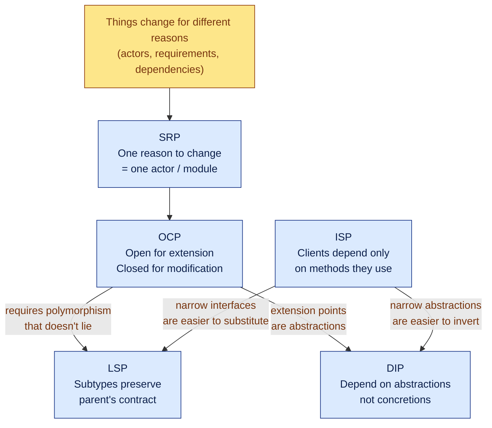
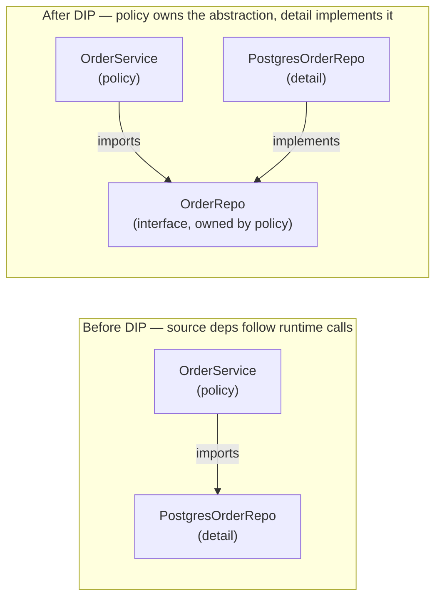
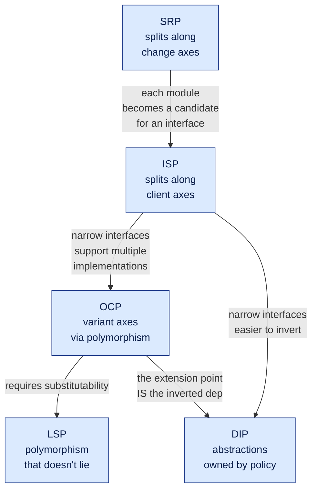

# SOLID Principles

## Why This Exists

**Problem.** Object-oriented codebases rot in characteristic ways: one class accretes responsibilities until every change risks every feature; a switch-on-type spreads across the codebase and every new variant requires shotgun surgery; a "reusable" subclass silently breaks its parent's invariants; a fat interface forces every implementer to stub half its methods; business logic depends directly on a SQL driver, so the only way to test pricing is to boot Postgres. SOLID is the five-rule heuristic Robert C. Martin extracted (1995–2003) from prior work by Bertrand Meyer, Barbara Liskov, and the GOF to name and resist these failure modes.

**Key insight.** SOLID isn't five independent rules — it's one rule (**isolate things that change for different reasons, behind stable abstractions**) refracted through five lenses:

- **SRP** — *who* changes the code (one actor / one reason).
- **OCP** — *how* you extend without editing (polymorphism over conditionals).
- **LSP** — *what* a subtype is allowed to assume vs. weaken (behavioral subtyping).
- **ISP** — *which* methods a client is forced to depend on (role interfaces, not headers).
- **DIP** — *which way* source-code dependencies point (toward abstractions, away from details).

Followed sloppily, they produce the bloated AbstractFactoryFactoryBean parodies that gave OO a bad name. Followed when the pain is real, they produce code where adding a feature touches one file and the tests run in milliseconds.

**Reach for this when:**
- A class's name needs "Manager", "Helper", "Util", or "and" to describe it.
- One bug fix routinely breaks an unrelated feature in the same module.
- Adding a new tax region / payment provider / report format means editing 14 call sites.
- Subclasses override methods to throw `UnsupportedOperationException` / `NotImplementedError`.
- Implementing an interface forces stubbing methods that don't apply.
- Unit tests can't run without a database, network, or framework container.
- A "small" change requires a coordinated deploy across three teams.

**Don't reach for this when:**
- The code is a 200-line script, a one-shot migration, or a prototype proving a hypothesis. SOLID has a fixed cost (more types, more indirection); pay it only when change rate justifies it.
- You're "designing for flexibility you might need." Premature DIP / OCP yields **speculative generality** (Fowler) — abstractions that don't match the axes of change you actually get. Wait for the second or third concrete case, then refactor.
- The language idiom is functional, data-oriented, or procedural by design (Go, Clojure, Erlang, Elixir, OCaml, embedded C). SOLID translates partially — DIP and ISP do, OCP-via-inheritance often doesn't — but forcing a Java-class-hierarchy mindset onto a `struct + funcs` codebase actively hurts.

## Diagrams

The five principles, what they constrain, and where they overlap:



How dependencies should flow once DIP is applied (the "dependency inversion" name comes from inverting the direction of the source-code arrow relative to the runtime call arrow):



## SRP — Single Responsibility Principle

Martin's mature definition (2017): *"A module should have one, and only one, reason to change"* — where **reason** means **actor**: a single person or stakeholder group that requests changes. Not "do one thing." A function that orchestrates 40 steps can be SRP-clean if all 40 serve one actor.

### Counter-example: the "and" class

```python
# Bad: serves Finance (tax math), Ops (PDF formatting), and Engineering (DB schema)
class Invoice:
    def __init__(self, line_items): self.line_items = line_items

    def calculate_tax(self, region):       # Finance owns this
        ...

    def render_pdf(self, template):        # Ops / Marketing owns this
        ...

    def save_to_database(self, conn):      # Engineering owns this
        ...
```

Three actors, one file. When Finance asks for a new VAT rule, the developer touches the same class Ops uses for layout. Merge conflicts and accidental couplings are guaranteed.

### Refactor: collapse along the actor seam

```python
# Domain — owned by Finance (rules of what an invoice IS)
@dataclass(frozen=True)
class Invoice:
    line_items: list[LineItem]
    region: Region

class TaxCalculator:                       # Finance
    def total_with_tax(self, inv: Invoice) -> Money: ...

# Presentation — owned by Ops
class InvoicePdfRenderer:                  # Ops
    def render(self, inv: Invoice, total: Money) -> bytes: ...

# Persistence — owned by platform / engineering
class InvoiceRepository(Protocol):         # Engineering
    def save(self, inv: Invoice) -> None: ...
```

Each class has one git-blame demographic. The `Invoice` data class is shared, but it's a value type — it has no behavior owned by any single actor.

### Misapplication: "one method per class"

A common over-application: every verb becomes its own class (`InvoiceTotalCalculator`, `InvoiceLineItemSummer`, `InvoiceTaxRoundingApplier`...). This is **not** SRP — it's just decomposition without judgement. The test is *who asks for the change*, not *how many verbs are in the name*. If two methods always change together for the same stakeholder, they belong together.

## OCP — Open / Closed Principle

Meyer's original (1988): *"Software entities should be open for extension, but closed for modification."* Martin's polymorphic reformulation (1996): you should be able to **add a new variant without editing existing source files**.

### Counter-example: switch-on-type that grows

```typescript
// Every new shape requires editing this function (and the next 5 that look like it).
function area(shape: Shape): number {
  switch (shape.kind) {
    case "circle":    return Math.PI * shape.r ** 2;
    case "rectangle": return shape.w * shape.h;
    case "triangle":  return 0.5 * shape.base * shape.height;
    // add "ellipse" → grep across codebase for every switch on `kind`.
  }
}
```

In a real codebase the switch isn't one function — it's `area`, `perimeter`, `serialize`, `validate`, `render`, scattered across the system. Adding `ellipse` is shotgun surgery.

### Refactor: dispatch through an abstraction

```typescript
interface Shape {
  area(): number;
  perimeter(): number;
}

class Circle    implements Shape { constructor(private r: number) {} area() { return Math.PI * this.r ** 2; } perimeter() { return 2 * Math.PI * this.r; } }
class Rectangle implements Shape { constructor(private w: number, private h: number) {} area() { return this.w * this.h; } perimeter() { return 2 * (this.w + this.h); } }
// New shape = new file. Nothing existing edits.
class Ellipse  implements Shape { /* ... */ }
```

The closed part — the dispatch logic — never changes. The open part — the set of shapes — grows by addition.

### Misapplication: speculative OCP

Don't pre-create a `PaymentProvider` interface with one implementation "in case we add Adyen someday." Until you have at least two real variants, the interface is guessed, not derived — and the guess is almost always wrong on the axis that matters (sync vs. async settlement, idempotency keys, 3DS challenges). **Rule of three**: write the concrete code twice; on the third variant, extract the abstraction from the actual commonality. (See `../refactoring-catalog/`.)

### Where OCP genuinely earns its keep

- **Plugin systems** (codecs, formatters, exporters) — third parties literally cannot edit your source.
- **High-churn variant axes** — tax rules, regulatory regions, file formats, message protocols.
- **Code that ships as a library** — every modification is a breaking change for someone.

## LSP — Liskov Substitution Principle

Liskov & Wing (1994): a subtype must be substitutable for its supertype without breaking program correctness — formally, the subtype may **weaken preconditions** and **strengthen postconditions**, but never the reverse, and must preserve all invariants and history properties.

### The classic counter-example: Square extends Rectangle

```java
class Rectangle {
  protected int w, h;
  public void setWidth(int w)  { this.w = w; }
  public void setHeight(int h) { this.h = h; }
  public int area() { return w * h; }
}

class Square extends Rectangle {       // "A square IS-A rectangle, mathematically..."
  @Override public void setWidth(int w)  { this.w = w; this.h = w; }   // strengthens postcondition
  @Override public void setHeight(int h) { this.w = h; this.h = h; }   // breaks Rectangle's contract
}

void resize(Rectangle r) {
  r.setWidth(5);
  r.setHeight(4);
  assert r.area() == 20;   // holds for Rectangle, FAILS for Square (returns 16)
}
```

Mathematics says square ⊂ rectangle. Behavioral subtyping says: a `Square` cannot be substituted for a `Rectangle` because callers assume width and height are independently mutable. The IS-A relation in OO is about **behavior**, not taxonomy.

### Real-world LSP violation: the `read-only` collection

```python
class List:
    def append(self, x): ...
    def __getitem__(self, i): ...

class ReadOnlyList(List):
    def append(self, x):
        raise NotImplementedError("read-only")   # strengthens precondition → LSP violation
```

Any function written against `List` that calls `append` will crash on `ReadOnlyList`. The fix is to invert the hierarchy: `ReadOnlyList` is the supertype, `MutableList` adds `append`. (Java's `Collections.unmodifiableList` famously gets this wrong; Scala/Kotlin/Rust split read and write interfaces.)

### LSP test in code review

For every override, ask:
1. **Preconditions** — did you require *less* than the parent? OK. *More*? Violation.
2. **Postconditions** — did you guarantee *at least* what the parent did? OK. *Less*? Violation.
3. **Exceptions** — do you throw types the parent didn't declare? Violation.
4. **Side effects** — does the override mutate state the parent doesn't, in ways callers can observe? Violation.
5. **Invariants** — class invariants must hold across the subtype's full lifecycle.

Most LSP violations resolve to **prefer composition over inheritance**: hold a `Rectangle`, don't extend it.

## ISP — Interface Segregation Principle

*"Clients should not be forced to depend on methods they do not use."* (Martin, 1996.) The defect ISP names: a fat interface couples unrelated callers through a single declaration, so a change relevant to one caller forces recompilation / redeployment / mock-stubbing on all of them.

### Counter-example: the god-interface

```go
// Every consumer must mock all 11 methods, even if it only calls Read.
type DataStore interface {
    Read(id string) ([]byte, error)
    Write(id string, b []byte) error
    Delete(id string) error
    List(prefix string) ([]string, error)
    BatchRead(ids []string) ([][]byte, error)
    BatchWrite(items map[string][]byte) error
    Backup(dst string) error
    Restore(src string) error
    Compact() error
    SetReplicationFactor(n int) error
    Stats() Stats
}
```

A read-only HTTP handler that needs only `Read` now depends on `Backup` and `SetReplicationFactor`. Tests stub 11 methods. A new method on `DataStore` triggers a recompile of every consumer.

### Refactor: role interfaces

```go
type Reader      interface { Read(id string) ([]byte, error) }
type Writer      interface { Write(id string, b []byte) error }
type Deleter     interface { Delete(id string) error }
type Lister      interface { List(prefix string) ([]string, error) }
type BatchReader interface { BatchRead(ids []string) ([][]byte, error) }
// ... etc.

type ReadWriter interface { Reader; Writer }   // compose only when callers need both

// Consumer declares the narrowest interface it needs:
func handleGet(r Reader, id string) ([]byte, error) { return r.Read(id) }
```

Go's structural typing makes this nearly free; in Java/C# you declare smaller interfaces and have implementations satisfy multiple. The point is the **client side** of the dependency: each consumer states only what it actually uses.

### Misapplication: interface explosion

The standard ISP failure mode: turning every method into its own interface. You end up with `IReader`, `IWriter`, `IBatchReader`, `IBatchWriter`, `ICompactor`, `IBackuper`, `IRestorer`, `IStatProvider`... and consumers declare `interface { IReader; IWriter; ICompactor }` everywhere. The cure is worse than the disease: signal-to-noise drops, navigation gets harder, and the abstractions don't track real client groupings.

**Heuristic**: split an interface only when you have a real client that needs the subset. ISP is **client-driven**, not symmetric. If two methods are always called by the same set of clients, they belong on the same interface.

### When ISP genuinely matters

- **Test isolation** — narrow interfaces mean small mocks. A handler that takes `Reader` is far easier to test than one that takes `*sql.DB`.
- **Plugin / SDK boundaries** — third parties shouldn't have to implement methods they don't support.
- **Cross-team APIs** — narrow interfaces reduce coordination cost; a change to `Backup` shouldn't ripple across teams that only read.

## DIP — Dependency Inversion Principle

Two parts (Martin, 1996):
1. *"High-level modules should not depend on low-level modules. Both should depend on abstractions."*
2. *"Abstractions should not depend on details. Details should depend on abstractions."*

The word **inversion** refers to inverting the *source-code* arrow relative to the conventional layered architecture. In a naive layered design, business logic imports the database driver; in DIP, the database driver implements an interface owned by the business logic.

### Counter-example: business logic chained to a vendor

```python
# pricing.py — high-level policy
import psycopg2                                       # detail leaks into policy

def calculate_discount(customer_id: int) -> Decimal:
    conn = psycopg2.connect(DSN)
    row = conn.execute("SELECT tier FROM customers WHERE id = %s", (customer_id,)).fetchone()
    return {"gold": Decimal("0.20"), "silver": Decimal("0.10")}.get(row[0], Decimal("0"))
```

Consequences: cannot unit-test pricing without Postgres. Cannot swap to DynamoDB without rewriting `pricing.py`. The pricing rules — the high-value IP — are tangled with a SQL driver.

### Refactor: invert through an abstraction owned by the policy

```python
# pricing/ports.py — owned by the high-level module
from typing import Protocol

class CustomerLookup(Protocol):
    def tier_of(self, customer_id: int) -> str: ...

# pricing/core.py — pure policy, no I/O imports
def calculate_discount(lookup: CustomerLookup, customer_id: int) -> Decimal:
    return {"gold": Decimal("0.20"), "silver": Decimal("0.10")}.get(
        lookup.tier_of(customer_id), Decimal("0")
    )

# adapters/postgres.py — detail, depends on the abstraction
class PostgresCustomerLookup:
    def __init__(self, conn): self.conn = conn
    def tier_of(self, customer_id: int) -> str:
        return self.conn.execute("SELECT tier FROM customers WHERE id = %s", (customer_id,)).fetchone()[0]

# tests — no DB needed
class FakeLookup:
    def tier_of(self, _): return "gold"

assert calculate_discount(FakeLookup(), 42) == Decimal("0.20")
```

The `CustomerLookup` protocol lives in the **pricing package** — that's the inversion. The Postgres adapter imports `pricing.ports`, not the other way around. This is the Hexagonal Architecture / Ports & Adapters / Onion / Clean Architecture insight: source-code dependencies point inward, toward policy.

### Misapplication 1: DIP for the sake of DIP

```java
// One-implementation interface, named after the concretion. Pure ceremony.
public interface UserServiceImpl { ... }       // bad name
public interface IUserService { ... }          // bad name
public class UserService implements IUserService { ... }
```

If the abstraction has exactly one implementation forever, it's not an abstraction — it's a header file. The cost is real: two files to navigate, one extra layer of indirection in stack traces, harder to grep. **Don't introduce an interface until you have a second implementation in sight** (test fake, real adapter, or alternative production implementation).

### Misapplication 2: dependency injection framework cargo cult

DI containers (Spring, Guice, Dagger, Autofac) are an *implementation technique* for DIP, not the principle itself. You can satisfy DIP with constructor parameters and zero framework. Conversely, you can have Spring everywhere and still violate DIP — if your `@Service` imports `org.postgresql.Driver`, the framework changes nothing. The principle is about *which way the source arrow points*, not whether a container wires the graph.

### Misapplication 3: abstraction owned by the wrong side

```python
# Bad: the database package defines the interface, business package imports it.
# database/repo.py
class Repository: ...

# pricing/core.py
from database.repo import Repository    # policy imports detail's abstraction
```

This is *not* DIP — the source dependency still points from policy to detail. DIP requires the **abstraction lives with the policy**, and the detail implements it.

## How the Five Principles Interact



- **SRP enables ISP**: once you've split a class along actor lines, the resulting modules are natural candidates for narrow interfaces.
- **ISP enables LSP**: a method-of-three interface is easier to honor substitutably than a god-interface.
- **OCP requires LSP**: extending via polymorphism only works if the new variant doesn't break callers' assumptions.
- **OCP and DIP are dual**: the extension point in OCP **is** the inverted abstraction in DIP. They describe the same boundary from different sides.

## A Realistic End-to-End Refactor

Before — one class, three actors, hard-coded I/O, switch-on-type:

```python
class ReportGenerator:
    def __init__(self, db_dsn): self.conn = psycopg2.connect(db_dsn)

    def generate(self, kind: str, user_id: int, format: str):
        rows = self.conn.execute("SELECT ... WHERE user_id = %s", (user_id,))
        if kind == "sales":
            data = self._summarize_sales(rows)
        elif kind == "inventory":
            data = self._summarize_inventory(rows)
        # ... 8 more elifs
        if format == "pdf":   return self._to_pdf(data)
        elif format == "csv": return self._to_csv(data)
        elif format == "html": return self._to_html(data)
        # also sends an email and updates a metrics counter
        smtplib.SMTP(...).sendmail(...)
        prometheus_counter.inc()
```

After — SRP splits actors, OCP/LSP handle variants, ISP narrows interfaces, DIP inverts I/O:

```python
# --- domain (pure) -----------------------------------------------------------
@dataclass(frozen=True)
class ReportData: ...

class ReportKind(Protocol):                         # OCP variant axis #1
    def summarize(self, rows: Iterable[Row]) -> ReportData: ...

class SalesReport: ...
class InventoryReport: ...

class ReportFormat(Protocol):                       # OCP variant axis #2
    def render(self, data: ReportData) -> bytes: ...

class PdfFormat: ...
class CsvFormat: ...

# --- ports (owned by domain — DIP) -------------------------------------------
class RowSource(Protocol):                          # ISP: narrow, only what core needs
    def rows_for_user(self, user_id: int) -> Iterable[Row]: ...

class Notifier(Protocol):
    def notify(self, user_id: int, artifact: bytes) -> None: ...

class Metrics(Protocol):
    def report_generated(self, kind: str, format: str) -> None: ...

# --- use case (orchestration, no I/O) ----------------------------------------
def generate_report(
    kind: ReportKind, fmt: ReportFormat,
    rows: RowSource, notifier: Notifier, metrics: Metrics,
    user_id: int,
) -> bytes:
    data = kind.summarize(rows.rows_for_user(user_id))
    artifact = fmt.render(data)
    notifier.notify(user_id, artifact)
    metrics.report_generated(kind.__class__.__name__, fmt.__class__.__name__)
    return artifact

# --- adapters (the only place I/O lives) -------------------------------------
class PostgresRows: ...        # implements RowSource
class SmtpNotifier: ...        # implements Notifier
class PrometheusMetrics: ...   # implements Metrics
```

The use case is testable with three fakes in microseconds. New report kinds and formats are new files. The `Notifier` interface declares what `generate_report` needs (`notify`), not what SMTP can do (`send_with_attachments`, `set_priority`, ...) — that's ISP.

## Trade-offs

| Benefit | Cost |
|---|---|
| **SRP**: bug-fix blast radius shrinks; merge conflicts drop; teams own clear modules | More files; harder to see "everything about invoices" at once; overdone → anemic micro-classes |
| **OCP**: new variants don't touch existing code; library users extend without forking | Indirection through polymorphism; speculative abstractions guess wrong axis; can't delete unused variants without breaking-change risk |
| **LSP**: polymorphism is safe — callers don't need to know subtypes | Forces honest hierarchies (often: replace inheritance with composition); harder when modeling real-world taxonomies that aren't behavioral |
| **ISP**: narrow mocks; small recompile graph; cross-team API stability | Interface explosion if applied symmetrically; navigation cost (which interface has `Read`?); duplicated declarations across languages without structural typing |
| **DIP**: testable policy; swap detail without rewriting; clear hexagonal layering | Extra layer of indirection in stack traces; more types; DI framework complexity; over-applied → one-impl interfaces with no value |
| **All five together**: change-tolerant codebases; high test velocity; clean module boundaries | Higher learning curve; juniors over-apply; cost is real before product-market fit; not free in dynamic / functional languages |

## Common Pitfalls

- **"SRP means one method per class."** No. SRP means one *actor*. Bundle methods that change together for the same stakeholder.
- **Speculative OCP / DIP.** Building an interface for "the database we might switch to" produces an abstraction shaped like the *current* database. When you switch, the abstraction leaks. Wait for the second case. (Fowler, *Refactoring* — "Speculative Generality" smell.)
- **Inheritance for code reuse.** The most common LSP violation: extending a class to grab its methods, then overriding the ones that don't fit. Use composition (`hasA` + delegation); use inheritance only when the IS-A relation is **behavioral**, not just nominal.
- **Squares and rectangles in the wild.** Common shapes: `ReadOnlyList extends List`, `ImmutablePoint extends Point`, `RestrictedUser extends User`. Each violates LSP. Invert the hierarchy or compose.
- **Interface explosion under ISP.** Splitting every method into its own interface is not segregation — it's noise. Split only when a real client needs the subset.
- **Header-file interfaces.** `class FooImpl implements IFoo` with one production implementation forever. The interface adds nothing but a file. Wait until you have a second implementation (test fake counts) before extracting.
- **DI containers as a substitute for design.** Spring/Guice can wire a non-DIP design just as easily as a DIP one. The principle is about source-import direction, not constructor injection.
- **Abstraction leaks in DIP.** A `Repository` interface that exposes `Cursor`, `ResultSet`, or vendor-specific paging is still coupled to the vendor — the leak just moved. Audit interfaces for vendor types.
- **SOLID applied to scripts.** A 200-line ETL script doesn't need ports and adapters. It needs to run correctly tomorrow. Match design weight to expected change rate.
- **God-interfaces masquerading as ISP-compliant** because they're called `Service`. Naming doesn't fix coupling. Look at the method list.
- **Confusing OCP with "never edit code."** OCP closes a *specific axis* of variation against modification. New axes still require refactoring. There's no abstraction that's open along every dimension.
- **Cargo-cult Clean Architecture.** Four concentric circles, an entire `usecases/` directory of one-method classes wrapping a single repo call. The architecture has weight only when the policy genuinely needs isolation from infrastructure.

## Decision Table

| Situation | Apply | Skip / use alternative |
|---|---|---|
| Class accreting unrelated methods, multiple stakeholders edit it | **SRP** — split by actor | If only one team ever touches it, leave it alone |
| Adding a new variant requires editing a switch in 6 places | **OCP** — polymorphic dispatch | First or second variant: keep the switch; refactor on the third |
| Subclass overrides a method to throw `NotImplementedError` | **LSP** — invert hierarchy or use composition | Don't try to make the bad inheritance work via flags |
| Implementing an interface forces stubbing 8 unused methods | **ISP** — split into role interfaces | Don't split if every real client uses every method |
| Unit-testing a class requires booting Postgres / Stripe / Kafka | **DIP** — invert the dependency | Don't if it's a thin adapter whose only job IS to call Postgres |
| Building a library for third parties | All five — your API surface is the contract | — |
| Writing a one-shot migration / 200-line script | None — keep it linear | Don't introduce ports for a script |
| Codebase is Go / Rust / functional, not class-heavy | **DIP** + **ISP** translate; **OCP-via-inheritance** doesn't | Use sum types / traits / interfaces, not class hierarchies |
| Modeling a real-world taxonomy (Animal, Mammal, Dog) | Question whether OO inheritance fits at all | Often: data + functions / sum types are cleaner |
| You're not sure which axis will change | Don't pre-abstract | Wait for the second concrete case (rule of three) |
| Single-implementation `IFoo` interfaces everywhere | Remove them | Re-introduce when a second impl appears |

## References

- Robert C. Martin — *Design Principles and Design Patterns* (2000, the paper that named SOLID) — https://web.archive.org/web/20150906155800/http://www.objectmentor.com/resources/articles/Principles_and_Patterns.pdf
- Robert C. Martin — *The Single Responsibility Principle* (Clean Coder blog, 2014) — https://blog.cleancoder.com/uncle-bob/2014/05/08/SingleReponsibilityPrinciple.html
- Robert C. Martin — *The Open-Closed Principle* (1996, original C++ Report article, archived) — https://web.archive.org/web/20060822033314/http://www.objectmentor.com/resources/articles/ocp.pdf
- Robert C. Martin — *The Liskov Substitution Principle* (1996) — https://web.archive.org/web/20151128004108/http://www.objectmentor.com/resources/articles/lsp.pdf
- Robert C. Martin — *The Interface Segregation Principle* (1996) — https://web.archive.org/web/20150905081110/http://www.objectmentor.com/resources/articles/isp.pdf
- Robert C. Martin — *The Dependency Inversion Principle* (1996) — https://web.archive.org/web/20110714224327/http://www.objectmentor.com/resources/articles/dip.pdf
- Barbara Liskov & Jeannette Wing — *A Behavioral Notion of Subtyping* — ACM TOPLAS 16(6), 1994 — https://www.cs.cmu.edu/~wing/publications/LiskovWing94.pdf
- Bertrand Meyer — *Object-Oriented Software Construction*, 2nd ed., Prentice Hall, 1997 (origin of Open/Closed and Design by Contract).
- Robert C. Martin — *Clean Architecture: A Craftsman's Guide to Software Structure and Design*, Prentice Hall, 2017 (chapters 7–11 cover SOLID; chapters on Hexagonal / Onion / Clean Architecture cover DIP at system scale).
- Martin Fowler — *Refactoring: Improving the Design of Existing Code*, 2nd ed., 2018 (smells: "Speculative Generality", "Refused Bequest" = LSP violation, "Large Class" = SRP violation).
- Martin Fowler — *InversionOfControl* — https://martinfowler.com/bliki/InversionOfControl.html
- Martin Fowler — *Inversion of Control Containers and the Dependency Injection pattern* — https://martinfowler.com/articles/injection.html
- Martin Fowler — *RoleInterface* — https://martinfowler.com/bliki/RoleInterface.html
- Alistair Cockburn — *Hexagonal Architecture* (Ports and Adapters) — https://alistair.cockburn.us/hexagonal-architecture/
- Dan North — *Why Every Element of SOLID is Wrong* (counterpoint, GOTO 2017) — https://speakerdeck.com/tastapod/why-every-element-of-solid-is-wrong (read this as a corrective; the principles are heuristics, not laws)
- Hillel Wayne — *Why is SOLID a Mess?* — https://buttondown.email/hillelwayne/archive/why-is-solid-a-mess/

## See Also

- `../../architecture-patterns/hexagonal/` — DIP applied at system scale (Ports & Adapters / Clean / Onion)
- `../../architecture-patterns/clean-architecture/` — Martin's full architecture treatment built on SOLID + DIP
