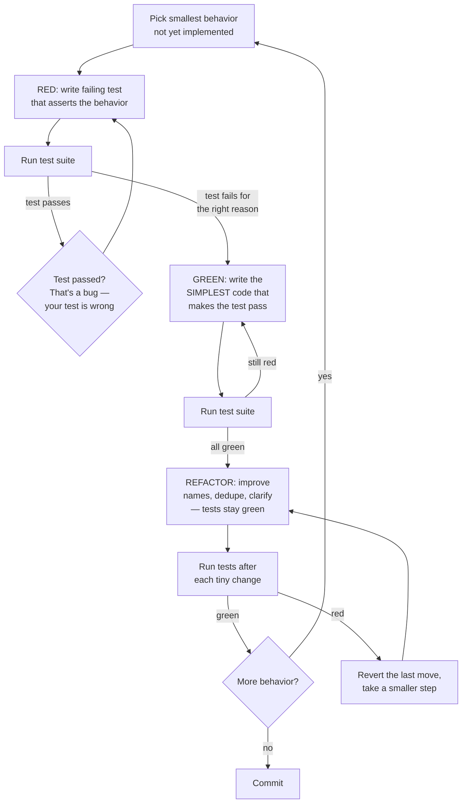
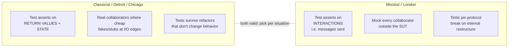
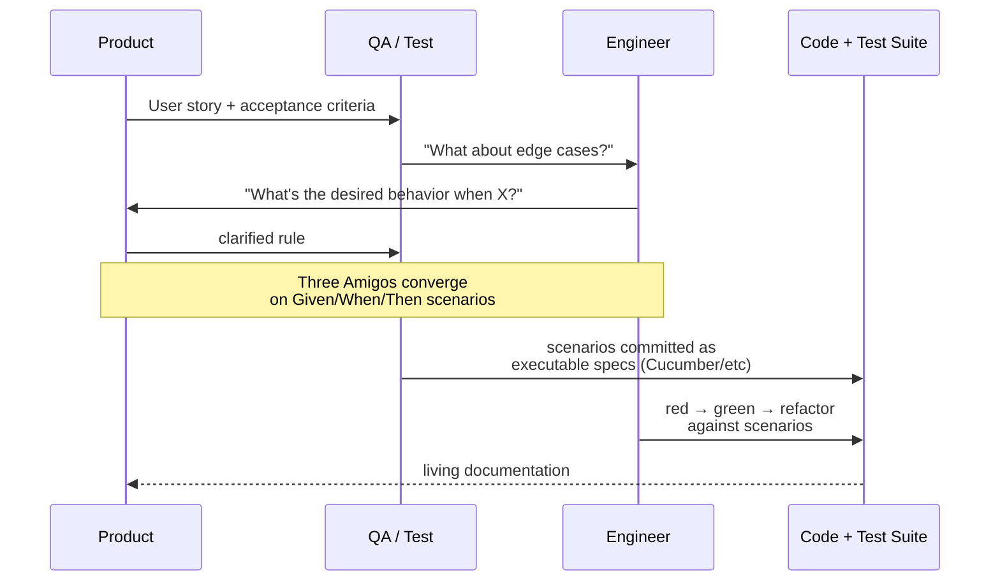

# TDD / BDD: Tests as Design Pressure

## Why This Exists

**Problem.** Most teams write tests *after* the code, in a hurry, to chase a coverage number. Those tests document what the code *does*, not what it *should do*. They pin behavior in place — including bugs — and turn every refactor into a re-write of the test suite. Meanwhile, "it works on my machine" defects keep landing in production because nothing forced the developer to think about *how the code would be observed* before they wrote it.

**Key insight.** TDD is a **design discipline** disguised as a testing practice. Writing the test first forces you to (a) name the unit, (b) decide its public contract, (c) decide its collaborators, and (d) make the unit *testable in isolation* — all before you've committed to an implementation that's painful to undo. The test suite is a side effect; the design is the product. BDD pushes the same idea up a layer: a Given/When/Then scenario forces product, QA, and engineering to agree on observable behavior before code is written.

**Reach for this when:**
- The cost of a regression is high (payments, billing, auth, data integrity, anything customer-visible).
- You're entering a refactor / re-architecture and need a safety net.
- A module has unclear or contested requirements — TDD/BDD turns ambiguity into executable specs.
- Onboarding new engineers — tests are the cheapest, most honest documentation.
- Bug fixing — write the failing test that reproduces the bug *first*, then fix.

**Don't reach for this when:**
- You're spiking / prototyping to learn whether a thing is even possible. Throw the spike away and TDD the keeper.
- The "code" is configuration with no logic (pure JSON/YAML wiring). Lint and schema-validate it; don't unit-test it.
- UI pixel-tweaks where the assertion would be a screenshot. Use visual regression tooling instead.
- The system is genuinely a research notebook and tests would calcify exploration.

## Diagrams

### The Red-Green-Refactor Loop



The loop is **the** practice. If you skip the failing-test step, you don't know your test can fail — and a test that can't fail is worthless. If you skip refactor, your design rots one feature at a time.

### Classicist (Detroit) vs Mockist (London)



Use **classicist** for pure logic, calculation, domain rules. Use **mockist** at architectural seams where the *interaction* itself is the contract (e.g. "the order service MUST publish OrderPlaced exactly once before returning").

### BDD Three Amigos Flow



The point of BDD isn't the Cucumber tooling — it's the *conversation* and the resulting shared, executable definition of done.

## The Mechanics

### A real red-green-refactor cycle (Python)

The canonical Beck example: a `Money` class for a multi-currency portfolio. Watch the steps stay tiny.

```python
# tests/test_money.py
import pytest
from money import Money

# RED #1 — smallest possible behavior: equality of two same-currency amounts
def test_equality_same_currency():
    assert Money(5, "USD") == Money(5, "USD")
    assert Money(5, "USD") != Money(6, "USD")
    assert Money(5, "USD") != Money(5, "CHF")
```

```python
# money.py — minimum to pass RED #1
from dataclasses import dataclass

@dataclass(frozen=True)
class Money:
    amount: int
    currency: str
```

`@dataclass(frozen=True)` gives equality + hash for free. We didn't write a custom `__eq__` because **we don't need one yet**. YAGNI is enforced by the test, not by willpower.

```python
# RED #2
def test_addition_same_currency():
    assert Money(5, "USD") + Money(7, "USD") == Money(12, "USD")
```

```python
# money.py — add the minimum
@dataclass(frozen=True)
class Money:
    amount: int
    currency: str

    def __add__(self, other: "Money") -> "Money":
        # WHY: only same-currency addition has obvious semantics; cross-currency
        # would require a rate, which we don't have a test for yet. Don't build it.
        assert self.currency == other.currency
        return Money(self.amount + other.amount, self.currency)
```

```python
# RED #3 — now the cross-currency case forces the design
def test_addition_different_currency_uses_bank():
    bank = Bank()
    bank.add_rate("CHF", "USD", 2)
    sum = Money(5, "USD") + Money(10, "CHF")  # noqa
    assert bank.reduce(sum, "USD") == Money(10, "USD")
```

The test made you invent **`Bank`** and the **`Sum` expression**. You wouldn't have invented those concepts pre-test; you would've crammed conversion logic into `Money` itself. The test pulled the design out.

### Same example, mockist style — when interactions ARE the contract

```python
# tests/test_order_service.py — interactions matter; we're testing a coordinator
from unittest.mock import Mock, call

def test_placing_order_charges_then_publishes_event():
    payments = Mock(spec=PaymentsClient)
    events = Mock(spec=EventBus)
    inventory = Mock(spec=InventoryClient)
    inventory.reserve.return_value = ReservationId("res-123")
    payments.charge.return_value = ChargeId("ch-456")

    svc = OrderService(payments, events, inventory)
    svc.place(Order(id="o-1", customer="c-1", items=[("sku-1", 2)], total=Money(50, "USD")))

    # Order matters: reserve first, charge second, publish last.
    # If charge fails AFTER publish, you've told customers an order shipped that didn't.
    inventory.reserve.assert_called_once_with("o-1", [("sku-1", 2)])
    payments.charge.assert_called_once_with("c-1", Money(50, "USD"))
    events.publish.assert_called_once_with(
        OrderPlaced(order_id="o-1", reservation="res-123", charge="ch-456")
    )
    # And the call ORDER:
    assert inventory.method_calls + payments.method_calls + events.method_calls == [
        call.reserve("o-1", [("sku-1", 2)]),
        call.charge("c-1", Money(50, "USD")),
        call.publish(OrderPlaced("o-1", "res-123", "ch-456")),
    ]
```

This test will **break** if you reorder operations, even if the new order produces the right final state, because the interaction order *is the contract*. That's the right call here: ordering matters in distributed workflows. It would be the *wrong* call for a pure calculation.

### Bug-fix TDD: reproduce before you repair

```python
# Production incident: customers in Türkiye saw their order totals doubled on
# 2026-04-15. The fix is one line. The test below is the receipt that we
# understand the bug — and the tripwire if it ever comes back.

def test_turkish_lira_does_not_double_apply_vat():
    # Regression for INC-8821 — VAT was applied once in pricing service and
    # again in checkout for TRY only, due to currency-specific code path.
    cart = Cart(items=[CartItem("sku-1", qty=1, unit=Money(100, "TRY"))])
    total = price_cart(cart, country="TR")
    assert total == Money(120, "TRY")  # 20% VAT, applied ONCE
```

Workflow: write this test, see it fail (red), fix, see it pass (green), commit both. The test stays in the suite forever as the regression sentinel.

### BDD: same behavior, different altitude

```gherkin
# features/checkout.feature — Cucumber/Gherkin
Feature: VAT is applied exactly once for Turkish customers

  Scenario: Customer in Türkiye buys a 100 TRY item
    Given a customer in country "TR"
    And a cart containing 1 of "sku-1" priced at 100 TRY
    When the cart is priced for checkout
    Then the displayed total is 120 TRY
    And VAT line items appear exactly once
```

```python
# features/steps/checkout_steps.py
from behave import given, when, then

@given('a customer in country "{country}"')
def step_customer(ctx, country):
    ctx.country = country

@given('a cart containing {qty:d} of "{sku}" priced at {amount:d} {currency}')
def step_cart(ctx, qty, sku, amount, currency):
    ctx.cart = Cart([CartItem(sku, qty, Money(amount, currency))])

@when('the cart is priced for checkout')
def step_price(ctx):
    ctx.total = price_cart(ctx.cart, ctx.country)
    ctx.lines = ctx.total.line_items

@then('the displayed total is {amount:d} {currency}')
def step_total(ctx, amount, currency):
    assert ctx.total.grand == Money(amount, currency)

@then('VAT line items appear exactly once')
def step_vat_once(ctx):
    assert sum(1 for li in ctx.lines if li.kind == "VAT") == 1
```

The Gherkin file is **readable by the PM** who wrote the rule. The step definitions are the engineer's harness. When the rule changes (VAT is now 18%), the Gherkin changes, and product owns the change.

### The same idea in Go

```go
// money_test.go
package money

import "testing"

// RED → GREEN → REFACTOR, table-driven from day one.
func TestAdd_SameCurrency(t *testing.T) {
    cases := []struct {
        name     string
        a, b, want Money
    }{
        {"basic", USD(5), USD(7), USD(12)},
        {"zero left", USD(0), USD(7), USD(7)},
        {"negative", USD(-3), USD(7), USD(4)},
    }
    for _, c := range cases {
        t.Run(c.name, func(t *testing.T) {
            got, err := c.a.Add(c.b)
            if err != nil {
                t.Fatalf("unexpected err: %v", err)
            }
            if got != c.want {
                t.Errorf("got %v, want %v", got, c.want)
            }
        })
    }
}

func TestAdd_CrossCurrency_ReturnsError(t *testing.T) {
    // We deliberately ERROR here instead of silently converting —
    // conversion requires a rate, which is a separate concern (Bank).
    _, err := USD(5).Add(EUR(5))
    if err == nil {
        t.Fatal("expected error for cross-currency Add without a Bank")
    }
}
```

### TypeScript / Vitest with a contract test

```typescript
// repository.contract.test.ts — contract tests apply to ALL implementations
// of UserRepository (in-memory, Postgres, Dynamo). Run them against each one.

export function userRepoContract(name: string, factory: () => UserRepository) {
  describe(`UserRepository contract: ${name}`, () => {
    let repo: UserRepository;
    beforeEach(() => { repo = factory(); });

    it("returns null for unknown user", async () => {
      expect(await repo.findById("ghost")).toBeNull();
    });

    it("round-trips a user", async () => {
      await repo.save({ id: "u-1", email: "a@b.c", createdAt: new Date(0) });
      expect(await repo.findById("u-1")).toMatchObject({ id: "u-1", email: "a@b.c" });
    });

    it("rejects duplicate id with a typed error, not a generic throw", async () => {
      await repo.save({ id: "u-1", email: "a@b.c", createdAt: new Date(0) });
      await expect(repo.save({ id: "u-1", email: "x@y.z", createdAt: new Date(1) }))
        .rejects.toBeInstanceOf(DuplicateUserError);
    });
  });
}

// Then:
userRepoContract("in-memory", () => new InMemoryUserRepo());
userRepoContract("postgres", () => new PostgresUserRepo(testPool));
```

This is the **classicist / Detroit** posture done well: the in-memory implementation IS your test double, and it's verified by the same contract as production, so it can't drift.

## Trade-offs

| Benefit | Cost |
|---|---|
| Tests written first force a testable design (small units, clear seams). | Up-front time cost: 15-35% slower on the first pass for trained teams; more for novices. |
| Each refactor is safe — green bar after every move. | Suites that over-mock break on every refactor; teams blame TDD when the real culprit is mockist abuse. |
| Bugs come with a permanent regression test attached. | Test code is real code: it must be reviewed, kept DRY, and refactored. Many teams treat tests as second-class and the suite rots. |
| BDD aligns product, QA, engineering on observable behavior before coding. | Gherkin tooling is heavy; for small teams the overhead exceeds the alignment benefit — plain `describe/it` may serve the same role. |
| Living documentation: the test suite shows intent, not just implementation. | Tests asserting on internals (private methods, log strings, exact SQL) become anchors that prevent change. |
| Mockist tests catch protocol bugs (wrong call order, wrong args) classicist misses. | Mockist tests can pass while production crashes — the mock has no opinion about whether the real collaborator behaves that way. Pair with contract / integration tests. |
| TDD shines on bug-fix work — repro test first, fix, ship the test as the safety net. | TDD is poor on UI pixel work, exploratory data analysis, and pure plumbing/config. |
| Empirical evidence (Nagappan/Maximilien/Bhat MS Research, 2008) showed 40-90% defect reduction at IBM/Microsoft sites — at a 15-35% time cost. | Same study showed gains depend heavily on team discipline; cargo-cult TDD gets the costs and none of the benefits. |

## Common Pitfalls

- **Test-after, called test-driven.** "I wrote tests for the code I just shipped." That's regression testing — fine, but it doesn't drive design and it doesn't catch the bugs you didn't think of. Real TDD: red **before** green, every time.
- **Coverage is the goal.** Once "90% line coverage" becomes the KPI, teams write `assert(thing != null)` to hit numbers. Coverage measures what was *executed*, not what was *verified*. Mutation testing (Stryker, PIT, mutmut) is a far better signal.
- **Mock everything (mockist gone wrong).** A test that mocks every dependency tells you only that *your code calls the mocks the way you told it to*. It can't tell you whether the real database actually accepts that SQL, or whether the real HTTP client serializes that body. Layer in **contract tests** and a thin tier of **integration tests against real or fake-but-faithful infrastructure** (testcontainers, localstack, in-memory engines that share a contract suite with production).
- **Tests bound to implementation, not behavior.** Asserting on private methods, exact log strings, or "called the database adapter exactly 3 times" produces a suite that screams every time you refactor. Test inputs and outputs at the public contract.
- **One enormous test per feature.** "test that checkout works end-to-end" with 40 setup lines, 20 mocks, and 8 assertions. When it fails you have no idea why. Split. Each test should fail for exactly one reason.
- **Skipping the refactor step.** "Green, ship." Six months later the module is unreadable. The R in red-green-refactor is non-optional; that's where the design improvement actually happens.
- **Treating BDD as Cucumber syntax.** The value of BDD is the **conversation** between Product / QA / Eng. If a single engineer writes the Gherkin alone, you've added a slow, awkward DSL on top of unit tests with no alignment payoff.
- **Slow suite, ignored suite.** A 25-minute test suite gets run by no one. When the feedback loop crosses ~30 seconds for the relevant slice, TDD collapses. Invest in test speed (parallelism, in-memory deps, focus selectors) the moment it slows.
- **Flaky test = delete the test.** Wrong instinct. Flake means **the system or the test has a real concurrency / time / network assumption that isn't pinned**. Diagnose; don't suppress.
- **TDD for spikes.** When you don't yet know what the code should do, tests slow you down. Spike, learn, throw away the spike, then TDD the real thing. Beck calls this *Spike Solutions*.
- **No outside-in pressure.** Teams TDD individual classes but never write a high-level acceptance test that exercises the whole flow. Result: every unit passes, the system doesn't work. Pair unit TDD with at least one acceptance / BDD scenario per user-visible behavior (the "double loop" — outer red drives inner red-green-refactor cycles).

## Decision Table

| Situation | Reach for | Don't reach for | Why |
|---|---|---|---|
| Pure logic, calculation, domain rules (pricing, tax, scheduling). | Classicist (Detroit) TDD with state assertions. | Mockist style. | The unit owns its data; assert on values, not interactions. Refactor-friendly. |
| Coordinator / orchestrator (saga, workflow, service that calls 3 collaborators in order). | Mockist TDD with interaction asserts, **plus** a contract test per real collaborator. | Pure classicist with stand-ins for everything. | The interaction sequence IS the behavior. Mock only the seams; verify shape with contract tests. |
| Bug fix in production code. | TDD: write a failing test that reproduces the bug, then fix. | Fix-then-test. | Reproduction proves you understand the bug; the test is the regression sentinel. |
| Greenfield feature with unclear product rules. | BDD Three Amigos session → Gherkin → unit TDD inside. | Engineer writes code first, asks questions later. | Forces the requirements conversation when it's cheapest to fix. |
| UI / pixel polish. | Visual regression (Percy, Chromatic, Playwright snapshots). | Unit TDD on rendered HTML. | Pixel correctness is hard to assert in code; visual diff is the right tool. |
| Throwaway spike to learn whether an approach is viable. | No tests; explore. | TDD. | Tests calcify decisions you haven't made yet. |
| Legacy code with no tests, must change. | **Characterization tests first** (Feathers): pin current behavior, then refactor under the net, then TDD new behavior. | Pure TDD as if it's greenfield. | You don't know what the system does; capture it before you change it. |
| Performance / latency work. | Benchmark-driven, not TDD. Add a regression benchmark to CI. | Pure unit TDD. | Functional tests pass at any speed; you need a separate latency oracle. |
| External API integration (3rd-party SDK). | Contract tests + recorded HTTP fixtures (VCR / Pact). | Mockist tests of your code calling their SDK. | Mocks of someone else's SDK lie freely; record real responses or use a contract. |
| Concurrency / race conditions. | Property-based tests (Hypothesis, fast-check, jqwik) + deterministic schedulers. | Example-based TDD alone. | Examples won't find the race; properties + permutation will. |

## References

Primary sources, in roughly the order a serious practitioner should read them:

- **Kent Beck — *Test-Driven Development: By Example* (Addison-Wesley, 2002)** — the canonical introduction. The Money example, red-green-refactor, the test list. https://www.oreilly.com/library/view/test-driven-development/0321146530/
- **Kent Beck — *TDD, Where Did It All Go Wrong* (talk, 2014)** — Beck himself on what people got wrong about TDD. https://www.youtube.com/watch?v=EZ05e7EMOLM
- **Dan North — *Introducing BDD* (Better Software, 2006)** — the original BDD essay; explains why BDD is TDD with a vocabulary fix. https://dannorth.net/introducing-bdd/
- **Steve Freeman & Nat Pryce — *Growing Object-Oriented Software, Guided by Tests* (Addison-Wesley, 2009)** — the canonical London-school / mockist text; outside-in TDD with the double loop. http://www.growing-object-oriented-software.com/
- **Martin Fowler — *Mocks Aren't Stubs* (2007)** — clearest treatment of classicist vs mockist; required reading before you fight about it. https://martinfowler.com/articles/mocksArentStubs.html
- **Martin Fowler — *Test Pyramid*** — distribution of unit / integration / end-to-end tests. https://martinfowler.com/bliki/TestPyramid.html
- **Martin Fowler — *Refactoring* (2nd ed., 2018)** — refactor step of TDD requires a refactor catalog. Chs. 1-3 especially.
- **Michael Feathers — *Working Effectively with Legacy Code* (Prentice Hall, 2004)** — characterization tests, seams, breaking dependencies in untested code. https://www.oreilly.com/library/view/working-effectively-with/0131177052/
- **Gerard Meszaros — *xUnit Test Patterns* (Addison-Wesley, 2007)** — the test smells dictionary (Fragile Test, Erratic Test, Mystery Guest, etc.). http://xunitpatterns.com/
- **Nagappan, Maximilien, Bhat, Williams — *Realizing Quality Improvement Through Test Driven Development: Results and Experiences of Four Industrial Teams* (Empirical Software Engineering, 2008)** — the IBM/Microsoft study. https://www.microsoft.com/en-us/research/wp-content/uploads/2009/10/Realizing-Quality-Improvement-Through-Test-Driven-Development-Results-and-Experiences-of-Four-Industrial-Teams-nagappan_tdd.pdf
- **James Shore — *The Art of Agile Development* (2nd ed., O'Reilly, 2021)** — practical TDD chapter; especially good on small steps and incremental design.
- **Google SRE Workbook — *Testing Reliability* (ch. 14)** — testing for reliability at scale; canary, integration, load. https://sre.google/workbook/testing-reliability/
- **Google Testing Blog — *Test Sizes* and *Just Say No to More End-to-End Tests*** — Google's small/medium/large taxonomy and why the pyramid is upside-down for many teams. https://testing.googleblog.com/2010/12/test-sizes.html and https://testing.googleblog.com/2015/04/just-say-no-to-more-end-to-end-tests.html
- **AWS Builders' Library — *Automating safe, hands-off deployments*** — how testing fits into a real deployment pipeline. https://aws.amazon.com/builders-library/automating-safe-hands-off-deployments/
- **Liz Keogh — BDD writings** — practical, opinionated notes on doing BDD without ceremony. https://lizkeogh.com/category/bdd/

## See Also

- `../refactoring-catalog/` — the moves you make in the *refactor* step of red-green-refactor.
- `../code-smells/` — what to look for when deciding whether to refactor at all.
- `../solid/` — TDD pressure naturally produces SOLID-shaped code (small, single-responsibility units with explicit dependencies).
- `../solid/` — testability requires injectable seams; DI is the mechanism.
- `../../architecture-patterns/hexagonal/` — ports/adapters give you the seams that make classicist TDD pleasant.
