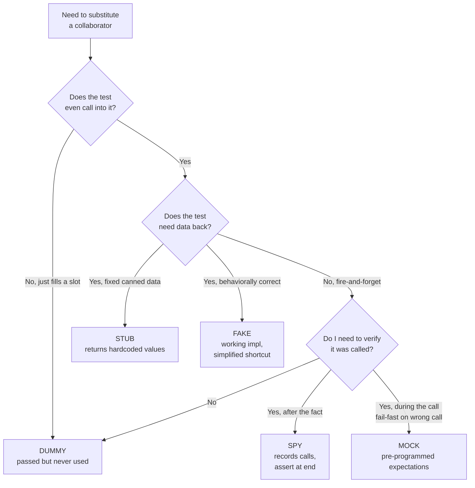
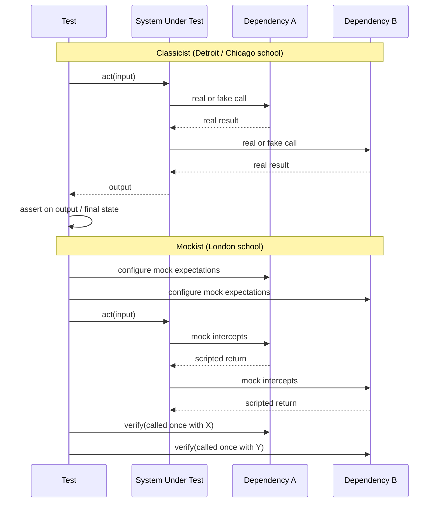

# Test Doubles

## Why This Exists

**Problem.** Production code rarely runs in isolation. It calls databases, queues, payment gateways, the system clock, the filesystem, other services. Real collaborators are slow, non-deterministic, expensive, or unavailable in CI. So tests substitute fakes — and the substitution itself becomes a defect surface. Wrong substitutions cause three failure modes that show up over and over:

1. **False green.** The test passes because the stub returns what the test expects, not what the real dependency would return. A stubbed `PaymentGateway.charge()` always returns `Success`, so the retry-on-decline path is never exercised. Production duplicates charges on the first decline.
2. **Brittle tests.** Tests assert on call sequences, argument shapes, and internal interactions. A refactor that preserves behavior but changes wiring breaks 80 tests. Engineers stop refactoring; design rots.
3. **Mock-of-mock pyramids.** A test sets up `mock_a` returning `mock_b` returning `mock_c`. The setup is longer than the production code. Reading the test tells you nothing about what the system does — only about what the test author thought it did.

**Key insight.** Gerard Meszaros distinguishes five kinds of test doubles by *purpose*, not by *library*. The library (`unittest.mock`, `Mockito`, `gomock`, `sinon`) is incidental. The decision is: do I need this collaborator to *exist* (dummy), to *return data* (stub/fake), to *record calls* (spy), or to *fail the test if called wrong* (mock)? Picking the wrong category is what creates brittleness. A stub used as a mock asserts on irrelevant interactions. A mock used as a stub causes test pollution.

**Reach for this when:**
- A test is hard to write because a collaborator is slow, networked, stateful, or non-deterministic (clock, RNG, external API, payment gateway, S3, Kafka).
- You need to verify a side effect (email sent, message published, audit log written) without coupling to delivery infrastructure.
- You're testing the *seam* between two units — error handling, retries, fallbacks — and the real collaborator can't reliably reproduce the failure.
- Test setup time crosses ~100ms per case and the suite is slowing down a dev loop.

**Don't reach for this when:**
- The collaborator is a pure function or value object — just call it.
- The collaborator's contract is the thing under test (e.g. testing your repository against a real Postgres). Use Testcontainers, not a mock.
- You'd need to reimplement the collaborator's behavior to make the fake correct (then the fake is the system under test, and you're testing your fake — see "fake fidelity" pitfall).
- You'd write more lines of mock setup than production code. That's a design smell, not a test problem.

## Diagrams

### The five test doubles by intent



### Classicist vs mockist test flow



## Meszaros's Five Doubles, Concretely

Meszaros's *xUnit Test Patterns* (2007) defined the vocabulary that the field still uses. Fowler later popularized the same five in "Mocks Aren't Stubs" and added the classicist/mockist split. Here they are with the *minimum example that makes the distinction obvious*.

### 1. Dummy — fills a parameter slot, never used

```python
# Python
def test_user_creation_does_not_send_email_when_disabled():
    dummy_mailer = object()  # any object; will never be called
    user_service = UserService(mailer=dummy_mailer, send_welcome=False)

    user = user_service.create("alice@example.com")

    assert user.email == "alice@example.com"
    # We never assert on dummy_mailer because it's never touched.
```

**When:** A constructor demands a parameter your test path doesn't exercise. The dummy exists to satisfy the type system. Don't use a `Mock()` here — it implies intent that isn't there. Use `None`, `object()`, or a typed placeholder.

### 2. Stub — returns canned answers

```python
class StubClock:
    def __init__(self, fixed_now):
        self._now = fixed_now
    def now(self):
        return self._now

def test_session_expires_after_30_minutes():
    clock = StubClock(fixed_now=datetime(2026, 1, 1, 12, 0, 0))
    session = Session(clock=clock, ttl_minutes=30)
    session.create()

    # Advance the stub
    clock._now = datetime(2026, 1, 1, 12, 31, 0)

    assert session.is_expired() is True
```

**When:** You need the collaborator to return *something*, and you don't care how it's called. Stubs are the workhorse. They make tests deterministic. They do *not* assert on calls — that's a spy/mock. If your stub starts recording calls, it's becoming a spy; name it that way.

### 3. Fake — working implementation, taken shortcuts

```python
class InMemoryUserRepo:
    """Behaviorally complete: implements the same contract as PostgresUserRepo,
    but in a dict. Suitable for unit tests of services that depend on UserRepo."""
    def __init__(self):
        self._by_id: dict[str, User] = {}
        self._by_email: dict[str, str] = {}  # email -> id

    def save(self, user: User) -> None:
        if user.email in self._by_email and self._by_email[user.email] != user.id:
            raise UniqueViolation("email")  # mirror Postgres behavior!
        self._by_id[user.id] = user
        self._by_email[user.email] = user.id

    def find_by_email(self, email: str) -> User | None:
        uid = self._by_email.get(email)
        return self._by_id.get(uid) if uid else None
```

**When:** The collaborator has enough behavior that stubs would explode (10 stubs, each for a different test case). A fake is a real, simplified implementation. The classic example is an in-memory database. **Critical rule:** the fake must enforce the same invariants as the real thing (uniqueness, ordering, transactional semantics). Otherwise it green-lights bugs that production rejects.

### 4. Spy — records calls, assert later

```python
class EmailSpy:
    def __init__(self):
        self.sent: list[tuple[str, str, str]] = []
    def send(self, to: str, subject: str, body: str) -> None:
        self.sent.append((to, subject, body))

def test_password_reset_emails_user():
    spy = EmailSpy()
    auth = AuthService(mailer=spy)

    auth.request_password_reset("alice@example.com")

    assert len(spy.sent) == 1
    to, subject, _ = spy.sent[0]
    assert to == "alice@example.com"
    assert "reset" in subject.lower()
```

**When:** The interesting fact is *that something happened*, asserted after the act. Spies are state-based assertions on call history. They're more refactor-friendly than mocks because the assertion runs after the fact — no pre-programmed expectations to invalidate.

### 5. Mock — pre-programmed with expectations, fails on miss

```python
from unittest.mock import Mock, call

def test_payment_charges_then_records_then_publishes():
    gateway = Mock(spec=PaymentGateway)
    gateway.charge.return_value = ChargeResult(id="ch_123", status="ok")
    ledger = Mock(spec=Ledger)
    bus = Mock(spec=EventBus)

    svc = CheckoutService(gateway, ledger, bus)
    svc.checkout(order_id="o1", amount_cents=2500)

    gateway.charge.assert_called_once_with(amount_cents=2500, idempotency_key="o1")
    ledger.record.assert_called_once_with("ch_123", 2500)
    bus.publish.assert_called_once()
    # If checkout() ever stops calling these, or calls them with different args,
    # the test fails. That fragility is the point — and the cost.
```

**When:** Interaction *is* the contract. The whole job of `CheckoutService` is to orchestrate three collaborators in the right order with the right arguments — there's no return value to assert on, no observable state. Mocks pin that orchestration. Use sparingly: every `assert_called_with` is a coupling to current implementation.

## Classicist vs Mockist (Detroit vs London)

This is the deepest fault line in test-double practice. Fowler's "Mocks Aren't Stubs" (2007) named it.

**Classicist (Detroit / Chicago school, Beck-style).** Test the *output* and *final state*. Use real collaborators where possible; use fakes for the slow/external ones; use mocks rarely. Tests are coarser — closer to "sociable" unit tests that exercise small clusters of objects together.

**Mockist (London school, Freeman/Pryce, "Growing Object-Oriented Software, Guided by Tests").** Test *interactions*. Mock every collaborator the SUT talks to. Each unit test exercises one class in total isolation. Tests drive interface discovery — "what does this class need to ask of its collaborators?"

| Dimension | Classicist | Mockist |
|---|---|---|
| Default double | Real / fake | Mock |
| Assertion style | Final state, return value | Call sequence, arguments |
| Test granularity | Sociable (object cluster) | Solitary (one class) |
| Refactor resilience | High — assertions on outputs survive | Low — interaction patterns are coupled |
| Bug-finding | Misses interface-contract bugs between layers | Misses integration bugs (each unit lies its way to green) |
| TDD design pressure | Less | More — forces small, role-based interfaces |
| Best for | Algorithms, value objects, state machines | Coordinator/orchestrator classes, hexagonal ports |

**Practical synthesis (the working consensus).** Most pragmatic teams are *mostly classicist with mocks at the edges*. State-and-output tests for domain logic; mocks for the ports that talk to the outside (payment gateways, email, SMS, third-party APIs); integration tests with real databases via Testcontainers. Pure London-school mocking everywhere produces tests that mirror the implementation and break on every refactor — the textbook brittleness story.

## Mock Fragility — The Failure Mode

A test is brittle when *behavior-preserving refactors break it*. Mocks are the #1 source of brittle tests. Here's the canonical pattern:

```python
# Original
def checkout(self, order):
    self.gateway.charge(order.total)
    self.ledger.record(order.id, order.total)
    self.bus.publish(OrderPaid(order.id))

# Test
gateway.charge.assert_called_once_with(99.99)
ledger.record.assert_called_once_with("o1", 99.99)
bus.publish.assert_called_once_with(OrderPaid("o1"))

# Refactor: extract a helper that does the same thing
def checkout(self, order):
    self._charge_and_record(order)
    self.bus.publish(OrderPaid(order.id))

def _charge_and_record(self, order):
    result = self.gateway.charge(order.total)
    self.ledger.record(order.id, order.total, result.id)  # added result.id

# Test now fails: ledger.record was called with 3 args, not 2.
# But the externally observable behavior is identical (or better).
```

The test *failed because the test was wrong*, not because the code was wrong. Multiply by 200 and engineers stop refactoring.

**Mitigations:**

1. **Don't mock what you don't own.** Wrap third-party APIs in your own thin port; mock the port, not the SDK. When the SDK changes, you change one wrapper, not 50 tests. (Steve Freeman, GOOS, ch. 8.)
2. **Prefer state assertions to interaction assertions.** Assert on outputs, on the spy's recorded list, on the fake's final contents — not on `assert_called_with`.
3. **Mock at architectural boundaries.** Ports/adapters (hexagonal). Don't mock collaborators that are pure-domain — call them.
4. **Use `spec=` / strict typing.** `Mock(spec=PaymentGateway)` rejects calls to nonexistent methods. Without it, a typo creates a new mock attribute and the test passes for the wrong reason.
5. **Verify behavior, not method names.** `assert order.status == "paid"` survives renames; `gateway.process.assert_called` does not.

## Fake Fidelity — The Other Failure Mode

Fakes have the opposite failure mode of mocks: not brittleness, but *wrong-and-doesn't-tell-you*.

```python
# In-memory fake forgot to enforce uniqueness
class InMemoryUserRepo:
    def __init__(self):
        self._users = []
    def save(self, user):
        self._users.append(user)  # No unique check!

# Test passes
def test_register_then_register_again_returns_existing():
    repo = InMemoryUserRepo()
    svc = SignupService(repo)
    svc.register("alice@x.com")
    user = svc.register("alice@x.com")  # should return existing
    assert user.email == "alice@x.com"  # passes, but creates duplicate

# Production: Postgres unique index throws. The whole code path is dead.
```

**Mitigations:**

1. **Contract tests.** Run the same test suite against the real implementation and the fake. If both pass, the fake is faithful to the asserted-on slice of behavior. (Wikipedia: "consumer-driven contract testing"; Eric Evans / Pact.)
2. **Use Testcontainers for the things that matter.** Postgres, Redis, Kafka — pull a real one in CI. The 5-second startup is worth catching the bug.
3. **Make the fake fail loudly on unsupported operations.** `raise NotImplementedError("InMemoryRepo doesn't implement transactions")` is better than silently succeeding.

## Practical Patterns

### Pattern 1: The clock as a dependency

```python
# WRONG: hardcoded clock, untestable
class Session:
    def is_expired(self):
        return datetime.utcnow() > self.expires_at

# RIGHT: clock injected, easily stubbed
class Session:
    def __init__(self, clock):
        self.clock = clock
    def is_expired(self):
        return self.clock.now() > self.expires_at

class SystemClock:
    def now(self): return datetime.utcnow()

class FakeClock:
    def __init__(self, now): self._now = now
    def now(self): return self._now
    def advance(self, delta): self._now += delta
```

Time, randomness, and IDs (`uuid4()`) are the three "ambient" dependencies that should *always* be injected. Otherwise tests are flaky.

### Pattern 2: Capture-and-replay for outbound HTTP

```python
# Use VCR/Polly or similar. First run hits real API, records to fixture file.
# Subsequent runs replay. The fixture is checked in.
import vcr

@vcr.use_cassette("fixtures/stripe_charge_success.yaml")
def test_charge_success():
    result = stripe_client.charge(amount=100, token="tok_visa")
    assert result.status == "succeeded"
```

Trade-off: fixtures can drift from the real API. Re-record periodically. Use this where contract changes are rare; for fast-moving APIs, prefer a contract test against a sandbox.

### Pattern 3: Test doubles for time-based code in Go

```go
// Inject a clock interface; never call time.Now() directly in production code.
type Clock interface { Now() time.Time }

type RealClock struct{}
func (RealClock) Now() time.Time { return time.Now() }

type FakeClock struct{ T time.Time }
func (f *FakeClock) Now() time.Time { return f.T }
func (f *FakeClock) Advance(d time.Duration) { f.T = f.T.Add(d) }

// In tests:
clock := &FakeClock{T: time.Date(2026, 1, 1, 0, 0, 0, 0, time.UTC)}
limiter := NewRateLimiter(clock, 10, time.Second)
// ... act
clock.Advance(2 * time.Second)
// ... assert
```

### Pattern 4: TypeScript with sinon — spy preferred over mock

```typescript
import * as sinon from "sinon";

it("publishes OrderPaid after successful charge", async () => {
  const gateway = { charge: sinon.stub().resolves({ id: "ch_1", ok: true }) };
  const bus = { publish: sinon.spy() };  // spy, not mock
  const svc = new CheckoutService(gateway, bus);

  await svc.checkout({ id: "o1", total: 99.99 });

  // Assert AFTER the act, on recorded calls — not pre-programmed expectations.
  sinon.assert.calledOnce(bus.publish);
  const event = bus.publish.firstCall.args[0];
  expect(event.type).toBe("OrderPaid");
  expect(event.orderId).toBe("o1");
});
```

The difference between this and a strict mock: the test will not fail if the production code adds a *second* publish call (say, an audit event). It only asserts that *what we care about* happened. Less brittle.

## Trade-offs

| Benefit | Cost |
|---|---|
| Tests run fast (no network, no DB) | Fakes can drift from real behavior |
| Tests deterministic (no flake from clock/RNG) | Stubbed clocks miss timezone/DST bugs |
| Easy to test error paths (force `raise`) | Easy to test paths that can't actually happen |
| Decouples tests from infrastructure | Couples tests to implementation if mocks dominate |
| London-school TDD drives interface design | London-school tests must change every refactor |
| Spies enable behavior verification cheaply | Spies on internal calls leak implementation |
| `Mock(spec=)` catches typos at test time | `Mock()` without spec hides typos as silent passes |
| Fakes (in-memory DB) faster than Testcontainers | Fakes must mirror invariants of the real thing |
| Mocks pin contract for orchestrators | Mocks of mocks of mocks = unmaintainable |

## Common Pitfalls

- **Mocking what you don't own.** Mocking `boto3.client("s3")` directly: when boto3 changes, your tests break. Wrap S3 in your own `BlobStore` port; mock the port. (GOOS, ch. 8.)
- **Mocking concrete classes instead of abstractions.** Mocking `PostgresUserRepo` instead of `UserRepo` couples tests to a specific implementation.
- **`Mock()` without `spec=`.** Typos like `mock.charg` (missing 'e') create a new attribute. Test passes; production crashes. Always pass `spec`.
- **Asserting on every call.** A test with 12 `assert_called_with` lines is testing the implementation, not the behavior. One or two interaction assertions; the rest should be state.
- **Forgetting to enforce invariants in fakes.** In-memory repo without unique constraint, in-memory queue without ordering, in-memory cache without TTL. Production has all three.
- **Stubbing the clock at module load time.** `Mock(datetime.utcnow)` patches a global. Other tests in the same file get the frozen time. Always inject; never patch globals if you can help it.
- **Mocking value objects.** `mock_user = Mock()` with `mock_user.email = "x"` — just construct a real `User`. Mocks are for collaborators with side effects, not data.
- **The "test passes, prod fails" trap with async.** Stubbing an async function that returns a coroutine vs. a future vs. a value — one of them is wrong and the test silently does nothing. Always assert the stub was *awaited*, or use a typed test double.
- **Treating mocks as documentation.** "Read the test to learn the API" works for state-based tests. With heavy mocking, you read the test and learn what the test author *thought* the API was. Different thing.
- **Refusing to use Testcontainers because mocks are "faster".** A 30-second integration test that catches a real bug beats a 30-millisecond mock test that masks it. Run integration tests on every PR; cap at a few seconds each with reused containers.
- **Verify-after-act becomes verify-during-act.** When using `mock.assert_called_with` *inside* a callback or async chain, you're assertion-racing the production code. Move the assertion to the end of the test.
- **One giant `Mock()` for the whole world.** `db = Mock()` then `db.users.find_one.return_value = ...`, `db.orders.insert.return_value = ...`. You've created an oracle that returns whatever the test wants. The test proves nothing about real database semantics.

## Decision Table

| Situation | Use this | Why |
|---|---|---|
| Test needs an object to satisfy a constructor signature, never calls it | **Dummy** (`None`, `object()`, typed placeholder) | Signals "irrelevant" to the reader |
| Need to feed the SUT specific input data; don't care about calls | **Stub** | Simplest; no assertion coupling |
| Need to verify "an email was sent" without coupling to SMTP | **Spy** | Records calls; assertion happens after act, more refactor-friendly than mock |
| Whole purpose of the unit is to orchestrate 3 collaborators in order | **Mock** with `spec=` | Interaction *is* the contract |
| Service depends on a repository in 20 tests with varied data | **Fake** (in-memory impl) | Cheaper than 20 stubs; behaviorally complete |
| Testing your repository against the real DB contract | **Real DB via Testcontainers** | A fake here would be reimplementing the SUT |
| Testing third-party API integration end-to-end | **Recorded fixtures (VCR/Polly) or sandbox** | Mocks miss real API quirks |
| Testing time-based logic (rate limit, session expiry, retry backoff) | **Fake clock, injected** | `time.sleep` in tests is forbidden |
| Testing retry/timeout/circuit-breaker logic | **Stub that raises configurable exceptions** | Real failures are hard to reproduce |
| Logic-heavy domain code (pricing, parsing, state machine) | **No double — call it** | Doubles add noise without value |
| Code under test calls a heavy ML model or LLM | **Stub** with canned outputs + a small set of real-call integration tests | Real calls in unit tests = slow + non-deterministic |
| Need to test a callback/event handler is wired correctly | **Spy** on the callback | Assert it was invoked with the right event |
| Code uses `random` or `uuid4()` | **Inject a deterministic source**; stub it | Otherwise tests flake and IDs are unreproducible |

## References

- Meszaros, Gerard — *xUnit Test Patterns: Refactoring Test Code* (Addison-Wesley, 2007). Canonical taxonomy of dummies/stubs/fakes/spies/mocks. Chapters on "Test Double Patterns" and "Test Stub" / "Mock Object" patterns. Companion site: http://xunitpatterns.com/Test%20Double.html
- Fowler, Martin — *Mocks Aren't Stubs* — https://martinfowler.com/articles/mocksArentStubs.html — defines classicist vs mockist.
- Fowler, Martin — *Test Double* — https://martinfowler.com/bliki/TestDouble.html — concise reference.
- Freeman, Steve & Pryce, Nat — *Growing Object-Oriented Software, Guided by Tests* (GOOS) (Addison-Wesley, 2009). The London-school / mockist bible. Chapter 8 ("Building on Third-Party Code") is the source of "don't mock what you don't own".
- Beck, Kent — *Test-Driven Development: By Example* (Addison-Wesley, 2002). Detroit / classicist style. Sections on "Fake It Till You Make It".
- Khorikov, Vladimir — *Unit Testing Principles, Practices, and Patterns* (Manning, 2020). Modern synthesis; argues for state-based testing over interaction-based. Chapters 4–5 on classical vs London schools.
- Fowler, Martin — *TestPyramid* — https://martinfowler.com/bliki/TestPyramid.html — context for where doubles fit in the test stack.
- Google Testing Blog — *Don't Overuse Mocks* — https://testing.googleblog.com/2013/05/testing-on-toilet-dont-overuse-mocks.html
- Google Testing Blog — *Fake Your Way to Better Tests* — https://testing.googleblog.com/2013/06/testing-on-toilet-fake-your-way-to.html
- Pact — *Consumer-Driven Contracts* — https://docs.pact.io/ — formalizes contract testing for fakes vs real services.
- Testcontainers — https://testcontainers.com/ — for the cases where a fake isn't faithful enough.
- Python `unittest.mock` docs — https://docs.python.org/3/library/unittest.mock.html — note `spec` and `autospec`.
- Mockito (Java) — https://site.mockito.org/ — and Mockito's "Don't mock what you don't own" wiki page.
- Sinon.JS — https://sinonjs.org/ — TypeScript/JavaScript spies, stubs, and mocks.
- DDIA (Kleppmann, O'Reilly 2017), ch. 7 ("Transactions") — for understanding what invariants your in-memory repo fakes need to mirror.
- Google SRE Workbook — *Canarying Releases* — https://sre.google/workbook/canarying-releases/ — context for why integration coverage matters when unit tests use doubles.

## See Also

- `../solid/` — the mechanism that makes test doubles substitutable.
- `../../architecture-patterns/hexagonal/` — ports as the natural mocking boundary.
- `../refactoring-catalog/` — refactors that mock-heavy tests block, and how to escape.
- `../code-smells/` — "test smells" overlap heavily (mystery guest, fragile test, conditional test logic).
