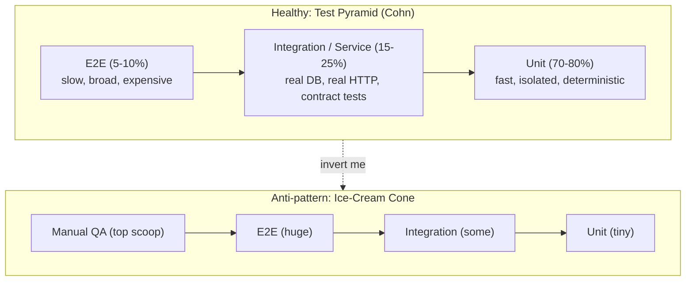
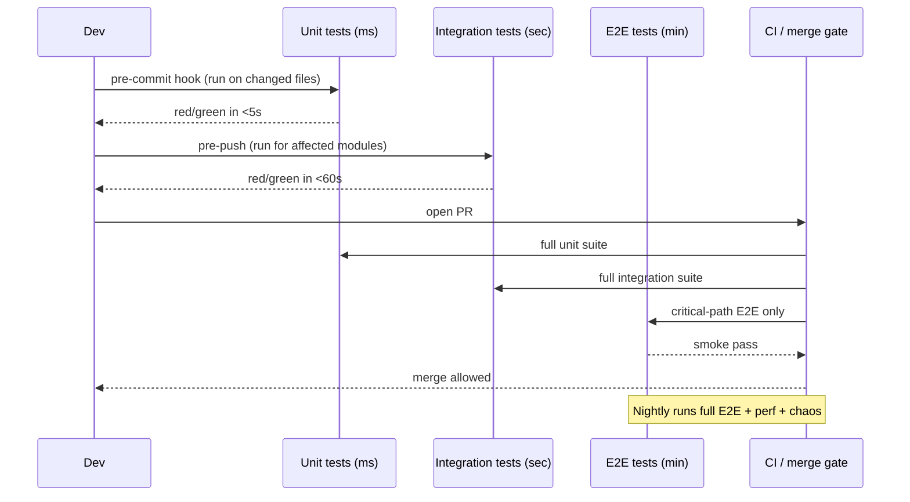
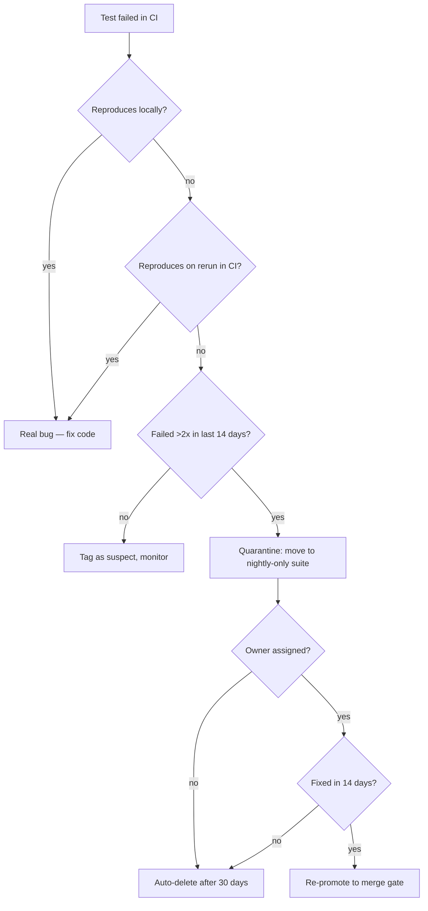
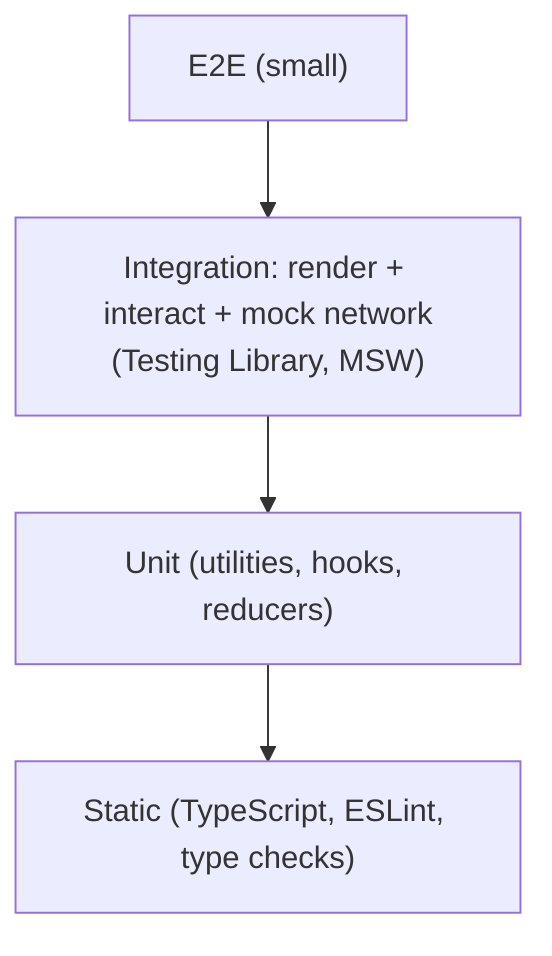

# Testing Pyramid

## Why This Exists

**Problem.** Test suites drift toward two failure modes. Either the team writes mostly end-to-end (E2E) tests because "they prove the whole thing works" — and the suite becomes a slow, flaky tax that gates every deploy (the **ice-cream cone**). Or the team writes thousands of mock-heavy unit tests that pass while the integrated system breaks in production. Both extremes destroy the signal that tests are supposed to provide: *fast, deterministic feedback that the code does what it claims*.

**Key insight.** Tests have a cost (write time, run time, maintenance) that scales with their breadth, and a confidence that scales with how much real behavior they exercise. The pyramid (Mike Cohn, *Succeeding with Agile*, 2009) says: **lots of cheap, narrow tests at the base; fewer, broader tests as you climb**. Each layer answers a different question. Unit tests answer *"is this function correct?"*. Integration tests answer *"do these pieces wire up?"*. E2E tests answer *"does a user flow work end-to-end?"*. Inverting the pyramid (more E2E than unit) inverts the cost-to-confidence ratio.

**Reach for this when:**
- Designing the test strategy for a new service or rewriting one for an existing project.
- CI is slow (>15 min for a feedback loop), flaky (>1% flake rate per run), or both.
- A green build keeps shipping bugs — *coverage is high but confidence is low*.
- The team argues about whether to mock the database, hit a real one, or use containers.
- You inherited a suite of brittle Selenium/Cypress tests and need to triage.
- Frontend team asks whether the pyramid even applies to React (spoiler: see Testing Trophy).

**Don't reach for this when:**
- You're testing a pure library with no I/O — almost everything is a unit test, and the "pyramid" is a single layer. Just write fast, focused tests.
- You're in early-stage exploratory prototyping where the design will change weekly. Write a smoke test or two, not a strategy.
- You're operating on legacy code with zero tests — start with **characterization tests** (Feathers, *Working Effectively with Legacy Code*) wherever you need to make a change. Worry about shape later.

## Diagrams

### The pyramid (and the cone it should not become)



### How a single change moves through the layers



### Triage flow for a flaky test



## Layer-by-layer: what to write, what to mock, how fast

### Unit tests — 70–80% of count, <5 ms each

**Scope:** one function, one class, one module. **No I/O.** No real network, no real DB, no real filesystem (use `tmpfs` or in-memory if absolutely needed). Pure logic, branches, error paths.

```python
# tests/unit/pricing_test.py
# Target: pure function. No fixtures, no mocks needed.

import pytest
from decimal import Decimal
from billing.pricing import compute_total, NegativeQuantityError

@pytest.mark.parametrize("qty,unit_price,tax_rate,expected", [
    (1,  Decimal("10.00"), Decimal("0.10"), Decimal("11.00")),
    (3,  Decimal("9.99"),  Decimal("0.00"), Decimal("29.97")),
    (0,  Decimal("99.00"), Decimal("0.10"), Decimal("0.00")),   # boundary
])
def test_compute_total_happy(qty, unit_price, tax_rate, expected):
    assert compute_total(qty, unit_price, tax_rate) == expected

def test_compute_total_rejects_negative_qty():
    # The error path is a behavior. Test it like any other branch.
    with pytest.raises(NegativeQuantityError):
        compute_total(-1, Decimal("10.00"), Decimal("0.10"))

def test_compute_total_uses_banker_rounding():
    # Why: finance code MUST not use default float rounding. Document the contract.
    assert compute_total(1, Decimal("0.125"), Decimal("0.0")) == Decimal("0.12")
```

**Rules of thumb:**
- If a unit test needs more than ~3 mocks, the unit under test has too many collaborators — refactor before testing.
- Test behavior, not implementation. Asserting "method `_calculate_inner` was called" couples the test to the impl and breaks on every refactor.
- Parametrize boundary cases (0, 1, max, negative, empty, unicode, very long) — that's where bugs live.

### Integration tests — 15–25% of count, <2 s each

**Scope:** a small set of real components wired together. **Real** databases (in containers), real HTTP between adjacent services (or contract tests if cross-team), real message brokers. **Mock** only what's outside your trust boundary (third-party SaaS, payment gateways).

```go
// tests/integration/order_repo_test.go
// Real Postgres in a testcontainer. ~600ms per test. Cheap insurance.

func TestOrderRepository_SavesAndRetrievesIdempotently(t *testing.T) {
    ctx := context.Background()
    pg := testpg.Start(t) // testcontainers-go, shared per package
    defer pg.Stop()

    repo := NewOrderRepository(pg.Pool)
    order := Order{ID: "ord_123", Total: 4299, IdempotencyKey: "k1"}

    // First write.
    err := repo.Save(ctx, order)
    require.NoError(t, err)

    // Second write with same idempotency key MUST NOT duplicate.
    err = repo.Save(ctx, order)
    require.NoError(t, err)

    rows, err := repo.FindByCustomer(ctx, order.CustomerID)
    require.NoError(t, err)
    require.Len(t, rows, 1, "idempotency key must dedupe at the repo layer")
}
```

**What integration tests catch that units miss:**
- SQL syntax errors, missing indexes, wrong column types, NULL handling.
- Serialization mismatches (JSON ↔ struct, protobuf field tags).
- Transaction boundaries, connection-pool exhaustion, deadlocks.
- HTTP middleware order (auth before logging, not after).

### Contract tests — the underrated middle layer

When two services talk over HTTP/gRPC and ship independently, **consumer-driven contract tests** (Pact, Spring Cloud Contract) replace fragile cross-service E2E for API compatibility. The consumer defines what it expects; the provider verifies it can deliver. Pact runs as fast as a unit test and prevents most "the API changed and broke us" outages without standing up the whole stack.

### End-to-end tests — 5–10% of count, 30 s – 5 min each

**Scope:** the whole system, real user flows, real browser (or real API client). Run **only the critical paths**: signup, login, checkout, the one flow that, if broken, costs the company money. Not every form field. Not every error toast.

```typescript
// tests/e2e/checkout.spec.ts — Playwright, runs against a deployed dev/staging env
// Total budget for this whole file: ~5 minutes. 4 tests max.

import { test, expect } from "@playwright/test";

test("guest can checkout with credit card and sees order confirmation", async ({ page }) => {
  await page.goto("/products/widget-pro");
  await page.getByRole("button", { name: "Add to cart" }).click();
  await page.getByRole("link", { name: "Checkout" }).click();

  await page.getByLabel("Email").fill("guest+e2e@example.test");
  await page.getByLabel("Card number").fill("4242 4242 4242 4242"); // Stripe test card
  await page.getByLabel("Expiry").fill("12 / 34");
  await page.getByLabel("CVC").fill("123");
  await page.getByRole("button", { name: "Pay" }).click();

  // Single high-value assertion. Don't pile on 20 detail checks here —
  // those belong in unit/integration tests for the receipt component.
  await expect(page.getByText(/order confirmed/i)).toBeVisible({ timeout: 10_000 });
});
```

**E2E discipline:**
- **Fixed test data, isolated tenants.** Never share state with manual QA or other tests.
- **Retry once, then fail.** More retries hide flakes; less retry punishes legitimate transient infra hiccups.
- **No conditional waits on `setTimeout`.** Use `waitFor` predicates tied to DOM/network state.
- **Run on every PR? Only the critical-path subset.** Full E2E goes to nightly + pre-release.

## The Testing Trophy (Kent C. Dodds — frontends are different)

For UI applications, Kent C. Dodds proposed the **Testing Trophy**: static analysis (TypeScript, ESLint) → unit → **integration (largest tier)** → E2E. The trophy's claim is that for frontend code, "integration" tests — rendering a component or screen with React Testing Library, asserting on user-visible behavior, mocking only the network — give the **best confidence per dollar**. They catch wiring bugs that pure unit tests miss, without the cost and flakiness of full-browser E2E.



The trophy is **not a contradiction** of the pyramid — it's the same idea (confidence per cost) applied to a domain where unit-testing leaf React components in isolation produces tests that pass while the page is broken. **Use the trophy for UI-heavy code; use the pyramid for backend services.** Most full-stack systems need both.

## Flaky tests: triage, quarantine, delete

A flaky test is a test that **passes and fails on the same code without changes**. Flakes are not "small problems" — they are catastrophic to trust. Once developers learn that red can mean "ignore and retry", they ignore real failures too. Google's research (see references) found that >1.5% flake rate in a suite causes engineers to stop reading test results.

### Triage rules (steal these)

1. **Auto-detect.** Run every failed test 3x in CI. If it ever passes, mark `flaky`.
2. **Quarantine, don't delete first.** Move to a separate suite that runs nightly and does NOT block merges. Tag with owner + creation date.
3. **Quarantine has a deadline.** 14 days for the owner to fix or formally accept-and-document. After 30 days unowned: **delete**. A flaky test in quarantine forever is worse than no test — it gives the illusion of coverage.
4. **Track flake rate as an SLO.** Flake budget = X% per service. Exceeding it freezes feature work until the suite is healthy. Treat it like an error budget (SRE).
5. **Never `if (env === 'ci') skip()`.** That's quarantine without the deadline. It rots forever.

### Common root causes (in order of frequency)

| Root cause | Fix |
|---|---|
| Time / clocks (`Date.now()`, `time.Now()`) | Inject a clock; freeze in tests |
| Order dependence between tests | Run in random order in CI; isolate setup |
| Shared mutable state (singletons, global DB rows) | Per-test transactions, namespaced data |
| Race conditions in async code | `await` properly; remove `sleep`; use deterministic event hooks |
| Network to real third parties | Mock at HTTP boundary (MSW, WireMock, VCR) |
| Resource exhaustion (port, file handle, memory) | Cleanup in teardown; increase CI runner size only as last resort |

## Trade-offs

| Benefit | Cost |
|---|---|
| Fast feedback (unit tests in seconds) | Need to design code for testability — pure functions, dependency injection |
| High confidence per CI minute (right-shaped pyramid) | Requires discipline to **not** write E2E for everything; reviewers must enforce |
| Cheap to run thousands of unit tests | Unit tests can pass while the integration is broken — must invest in integration layer too |
| Integration tests catch real I/O bugs | Slower; need containerized infra (Postgres, Kafka) in CI |
| E2E gives ground-truth user confidence | Slowest, flakiest, most expensive to maintain — must keep set tiny |
| Contract tests prevent cross-team API breaks | Adds Pact broker / contract storage infrastructure |
| Quarantine policy preserves trust in red builds | Requires owners + automation to enforce 14/30-day deadlines |
| Testing Trophy fits component-rich UIs | Doesn't fit backend services well — don't blindly apply everywhere |

## Common Pitfalls

- **The ice-cream cone.** "Let's just write Selenium tests, they cover everything." 18 months later: 2,000 E2E tests, 40-minute CI, 8% flake rate, no one trusts the build. Cohn warned about this in 2009. People still do it.
- **Mocking everything in unit tests.** When mocks return mocks that return mocks, you're testing your mock library, not your code. Refactor instead — too many collaborators is a design smell.
- **Confusing coverage with confidence.** 95% line coverage with assertion-free tests (`expect(thing).toBeDefined()`) is theatre. Mutation testing (Stryker, PIT) reveals which assertions actually catch bugs.
- **No integration tests because "unit tests are enough"** — then a typo in a SQL column name ships to production. Unit tests with mocked repositories cannot catch this.
- **Sharing test data across tests.** Test A creates user 42. Test B assumes user 42 exists. Run them out of order: test B fails. Run in parallel: races. Use per-test fixtures or transactional rollback.
- **Asserting on flaky things.** Don't assert on element IDs that the framework auto-generates. Don't assert on log line ordering. Don't assert on timestamps without tolerance.
- **One giant `beforeEach` that sets up everything.** New devs can't tell what each test actually depends on. Inline what's specific; share only what's truly common.
- **No test budget.** "We'll fix CI speed later." It only gets worse. Set a budget (e.g., unit suite <2 min, full PR suite <10 min) and **fail the build if exceeded**.
- **Testing implementation details.** "I refactored a private method and 50 tests broke." Tests should survive refactors that preserve behavior — that's the entire point of having them.
- **Hand-wavy E2E retries.** `retries: 5` doesn't fix flakes; it lets them rot. One retry max, and only if you log + alert on retried tests.

## Decision Table

| Situation | Test type | Why |
|---|---|---|
| Pure function, complex branching (pricing, parsing, state machine) | **Unit** (parametrized) | Fast, deterministic, every branch cheap to cover |
| Repository method against a real DB | **Integration** with testcontainers | Schema/SQL bugs are invisible to mocks |
| HTTP handler with auth, validation, business logic | **Integration** (real router + DB, fake auth provider) | Middleware ordering and validation are common bug sources |
| Two services that ship independently | **Contract tests** (Pact) | Faster than full E2E, catches API drift, no shared infra |
| Critical user flow (signup, checkout) | **E2E** (Playwright/Cypress) — 1 test per flow | Ground truth that the system works as a user sees it |
| Every form field validation rule | **Unit / component test** — NOT E2E | E2E for these is slow, flaky, and redundant |
| React component rendering and interaction | **Integration** (Testing Library, mock network with MSW) | Trophy: most confidence per ms |
| Visual regression (CSS changes shouldn't break layout) | **Visual snapshot** (Chromatic, Percy) — separate from functional tests | Different signal; review-gated |
| Performance regression | **Benchmark / load test** — NOT in PR pipeline | Different cadence, different tooling, different SLO |
| Legacy code without tests, about to change | **Characterization tests** first | Pin current behavior before refactoring |
| Async/event-driven flow (queues, webhooks) | **Integration** with real broker (LocalStack, Kafka container) | Mocking message ordering and at-least-once delivery is a trap |
| Test fails 1 time in 50 with no code change | **Quarantine immediately**; root-cause within 14 days | Trust in CI is the asset being protected |

## References

- Mike Cohn — *Succeeding with Agile: Software Development Using Scrum* (2009), ch. 16 introduces the Test Pyramid concept. Summary: https://martinfowler.com/articles/practical-test-pyramid.html
- Martin Fowler — *The Practical Test Pyramid* — https://martinfowler.com/articles/practical-test-pyramid.html
- Martin Fowler — *Test Pyramid* (bliki) — https://martinfowler.com/bliki/TestPyramid.html
- Kent C. Dodds — *The Testing Trophy and Testing Classifications* — https://kentcdodds.com/blog/the-testing-trophy-and-testing-classifications
- Kent C. Dodds — *Write tests. Not too many. Mostly integration.* — https://kentcdodds.com/blog/write-tests
- Google Testing Blog — *Flaky Tests at Google and How We Mitigate Them* — https://testing.googleblog.com/2016/05/flaky-tests-at-google-and-how-we.html
- Google Testing Blog — *Where do our flaky tests come from?* — https://testing.googleblog.com/2017/04/where-do-our-flaky-tests-come-from.html
- John Micco (Google) — *Flaky Tests at Google* (presentation/paper) — referenced in Google Testing Blog above.
- Google SRE Workbook — *Canarying Releases* and testing chapters — https://sre.google/workbook/canarying-releases/
- Michael Feathers — *Working Effectively with Legacy Code* (2004), ch. on characterization tests.
- Pact — Consumer-Driven Contract Testing — https://docs.pact.io/
- Testcontainers — https://testcontainers.com/
- React Testing Library — Guiding Principles — https://testing-library.com/docs/guiding-principles
- MSW (Mock Service Worker) — https://mswjs.io/
- Stryker Mutator (mutation testing) — https://stryker-mutator.io/
- Spotify Engineering — *Testing of Microservices* — https://engineering.atspotify.com/2018/01/testing-of-microservices/
- ThoughtWorks Technology Radar — entries on "Test pyramid" and "Snapshot tests" — https://www.thoughtworks.com/radar
- AWS Builders' Library — *Automating safe, hands-off deployments* — https://aws.amazon.com/builders-library/automating-safe-hands-off-deployments/
- Designing Data-Intensive Applications (Kleppmann, 2017) — ch. 4 on encoding/evolution motivates contract tests; ch. 11 on stream processing motivates integration testing of async flows.

## See Also

- `../code-smells/` — when too many mocks signal a design smell, refactor first
- `../refactoring-catalog/` — characterization tests as a precursor to extract-method, extract-class
- `../solid/` — testability requires injectable seams
- `../../reliability/error-budgets/` — flake rate as an SLO, not a footnote
