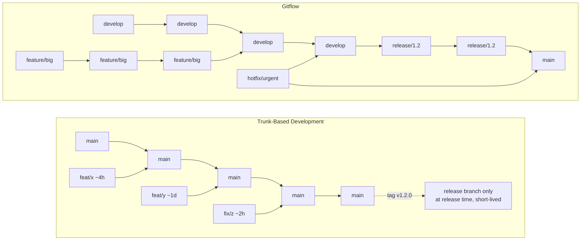
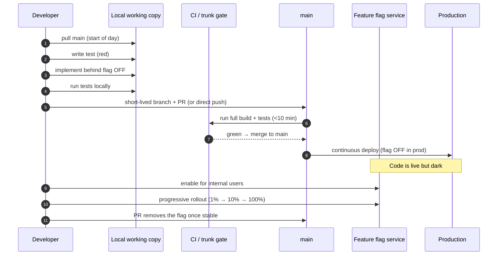

# Trunk-Based Development

## Why This Exists

**Problem.** Long-lived branches are an integration debt. Every day a branch lives away from `main`, the diff between them grows, the cost of merge grows non-linearly, and the probability of a *semantic* conflict (no textual overlap, but two changes that break each other) compounds. By the time you merge, you are not reviewing a feature — you are excavating an archaeology site. Symptoms: "merge hell" sprints, week-long rebases, integration bugs that only surface at release time, "works on my branch" syndrome, hotfix branches that themselves develop sub-branches, and release managers acting as full-time human merge-conflict resolvers.

**Key insight.** Branches don't isolate work — they *defer* integration. The work still has to be reconciled; you've just postponed it to the worst possible moment (right before release, under pressure, with stale context). Trunk-Based Development (TBD) flips the equation: integrate continuously into a single shared trunk (`main`), keep branches *short-lived* (hours, at most a couple of days), and use **feature flags** rather than branches to hide incomplete work in production. The cost of merging a 4-hour-old change is near-zero; the cost of merging a 4-week-old branch is super-linear in time.

**Reach for this when:**
- You ship more than once a week (or want to).
- You have a CI pipeline that runs in under ~10 minutes and is trustworthy (low flake rate).
- Your team is co-located in time on the same trunk (one repo, one main branch).
- DORA metrics matter to you — TBD is one of the 24 capabilities the State of DevOps research links to elite delivery performance.
- "Continuous Integration" actually means continuous (every dev pushes to trunk daily), not "we run Jenkins on PRs".

**Don't reach for this when:**
- You ship signed firmware, certified medical devices, or other artifacts where each release goes through weeks of out-of-band qualification — you genuinely need release branches that live for months.
- You have an open-source project with hundreds of untrusted contributors — fork-and-pull-request workflows assume long-lived forks by design.
- Your CI is unreliable (>5% flake rate) or slow (>20 min). Fix that first; TBD without trustworthy CI is just chaos with extra steps.
- You don't yet have a feature-flag infrastructure (or feature toggles in code), and the next change is a multi-week structural rewrite. Build the flag system first, then adopt TBD.

## Diagrams

### Trunk-Based vs Gitflow at the branch level



### Day in the life of a TBD developer



## Core Practices

### 1. Short-Lived Branches (or no branches at all)

Hammant distinguishes two flavors:

- **"Trunk-based without branches"** — every developer commits directly to `main`, gated by pre-commit hooks, mandatory tests, and (often) pair programming. Used by Google's monorepo and historically Facebook.
- **"Trunk-based with short-lived feature branches"** — branches exist but are measured in *hours*, max 1–2 days, and reviewed via PR. This is what most teams adopting TBD actually do.

The hard rule: **a branch should never live longer than the time between two CI runs of `main`**. If `main` builds every commit and you haven't merged in 3 days, you have already accumulated 3 days of unverified integration risk.

```bash
# A TBD-friendly branch lifecycle (bash)
git checkout main
git pull --rebase                                # always start from latest trunk
git checkout -b feat/checkout-latency-fix        # short, scoped, descriptive
# ... write a failing test, make it pass, commit ...
git rebase main                                  # keep linear, catch drift early
git push -u origin feat/checkout-latency-fix
# open PR -> CI runs -> reviewer approves -> merge (squash) -> branch deleted
# elapsed wall-clock time target: < 1 working day
```

### 2. Feature Flags for Incomplete Work

The substitute for long-lived branches is **dark launching behind a flag**. Code merges to `main` and ships to production *off*. You then turn it on progressively.

A minimal in-process flag (Python):

```python
# flags.py — keep the flag plumbing dumb. Real systems use LaunchDarkly, Unleash,
# Statsig, or a homegrown service backed by a config store with hot reload.

from dataclasses import dataclass
from typing import Callable, Dict, Any
import hashlib
import os

@dataclass(frozen=True)
class FlagContext:
    user_id: str
    env: str           # "prod", "staging", "dev"
    attributes: Dict[str, Any]

class FlagStore:
    """Reads flag state from a hot-reloadable config source.
    In production this is a service call (with local cache + circuit breaker).
    The contract: never throw — a flag failure must default to OFF."""

    def __init__(self, source: Callable[[], Dict[str, dict]]):
        self._source = source

    def is_enabled(self, key: str, ctx: FlagContext) -> bool:
        try:
            cfg = self._source().get(key)
            if not cfg or not cfg.get("enabled", False):
                return False
            # Percentage rollout: stable hash on (key, user_id) so the same user
            # gets a stable answer across requests — critical for UX consistency
            # and for A/B test integrity.
            pct = cfg.get("rollout_pct", 0)
            if pct >= 100:
                return True
            if pct <= 0:
                return False
            h = hashlib.sha256(f"{key}:{ctx.user_id}".encode()).digest()
            bucket = int.from_bytes(h[:4], "big") % 100
            return bucket < pct
        except Exception:
            # Fail closed. A flag system outage must not page you at 3am.
            return False

# Usage in product code:
# if flags.is_enabled("checkout.new_pricing_engine", ctx):
#     return new_pricing(cart)
# return legacy_pricing(cart)
```

**Flag hygiene** is non-negotiable — flags are technical debt with a half-life:

- Every flag is created with an **owner** and an **expiry date** (issue ticket).
- "Release flags" (gating an unfinished feature) must be removed within ~2 weeks of 100% rollout. Both the flag check and the dead branch in code.
- "Ops flags" (kill-switches, regional toggles) are permanent — but tagged differently so you don't conflate them.
- A weekly job (or CI step) lists flags older than N days and files cleanup tickets.

### 3. Branch by Abstraction (when a flag isn't enough)

For changes too large to hide behind a single boolean — e.g., swapping a payment provider, replacing an ORM — use **branch by abstraction**, not a long-lived branch.

```typescript
// Step 1: Introduce a seam (interface) over the existing implementation.
interface PaymentGateway {
  charge(req: ChargeRequest): Promise<ChargeResult>;
}

class StripeGateway implements PaymentGateway { /* existing */ }

// Step 2: Add the new implementation alongside the old one. Both compile, both
// ship to production. Neither is wired up yet.
class AdyenGateway implements PaymentGateway { /* new, behind a flag */ }

// Step 3: A factory + flag picks the implementation per request.
function gatewayFor(ctx: FlagContext, flags: FlagStore): PaymentGateway {
  return flags.isEnabled("payments.use_adyen", ctx)
    ? new AdyenGateway()
    : new StripeGateway();
}

// Step 4: Migrate consumers one at a time, on trunk, behind the flag.
// Step 5: Roll the flag from 0% -> 100%, watch metrics, then delete StripeGateway
// and the flag.
```

Every step is a small PR, every step ships to `main`, every step is reversible. No branch lives for more than a day.

### 4. CI Signal as the Trunk Gate

TBD is impossible without a CI pipeline that **the team trusts and respects**. The contract:

- CI runs on every push to `main` *and* every PR.
- If `main` is red, **stopping the line is the team's top priority** — no new merges until it's green. (Andon-cord rule, borrowed from Toyota.)
- Build + test must complete in <10 min for the inner loop. Beyond that, developers context-switch and stop watching.
- **Flake rate < 1%**. A flaky test is worse than no test — it teaches the team to ignore CI signal, which kills TBD.
- Pre-merge CI must include: compile, unit tests, integration tests against real-or-faithful dependencies, static analysis, security scan.

```yaml
# .github/workflows/trunk-gate.yml — minimum viable trunk gate.
# Real teams add: coverage delta, perf regression, SCA, container scan, etc.
name: trunk-gate

on:
  pull_request:
    branches: [main]
  push:
    branches: [main]

concurrency:
  group: trunk-gate-${{ github.ref }}
  cancel-in-progress: true

jobs:
  build-and-test:
    runs-on: ubuntu-latest
    timeout-minutes: 10        # hard cap: protect the inner loop
    steps:
      - uses: actions/checkout@v4
      - uses: actions/setup-node@v4
        with: { node-version: '20', cache: 'npm' }
      - run: npm ci
      - run: npm run lint
      - run: npm run typecheck
      - run: npm test -- --maxWorkers=2 --reporters=default --reporters=jest-junit
      - run: npm run test:integration
      - name: Block on flaky tests
        # If a test was retried to pass, fail the run anyway. Flake-tolerance
        # is the single fastest way to destroy trunk-based development.
        run: ./scripts/fail-if-retried.sh
```

### 5. Release Strategy

TBD doesn't mean "every commit goes to production unverified". It means *trunk is always releasable*. Two common shapes:

- **Continuous Deployment.** Every green commit on `main` deploys to production automatically (often through canary/progressive rollout). Feature flags carry the risk of incomplete work.
- **Release branches cut from trunk.** At release time, branch `release/1.42.x` from trunk. Cherry-pick *only* hotfixes back. Branch lives weeks at most, dies after the release. Used when you ship versioned artifacts (mobile apps, on-prem software).

Critical rule: **commits flow trunk → release branch, never the other way around for features**. Hotfixes are the exception and must be cherry-picked back to trunk immediately.

## Trade-offs

| Benefit | Cost |
|---|---|
| Near-zero merge cost; "merge hell" disappears | Requires real CI discipline — slow or flaky CI poisons the model |
| Integration bugs surface in hours, not at release | Demands feature-flag infrastructure (build, buy, or homegrown) |
| Smaller PRs → faster, better reviews | Reviewers must context-switch more often; needs review SLA culture |
| Always-releasable trunk enables continuous delivery | Forces discipline around backwards-compatible schema/API changes |
| Strong DORA correlation: elite-performer practice | Cultural shift — engineers used to "my branch" feel exposed |
| Bisect / `git blame` are linear and useful | Squash-merge debates: lose granularity vs. clean history |
| Hotfixes are trivial (cherry-pick from trunk) | Long-running refactors require branch-by-abstraction skill |
| Encourages small, well-scoped changes | Large architectural rewrites need explicit multi-step planning |

## Common Pitfalls

- **"TBD without flags."** Team adopts short branches but has no flag system. Half-finished features ship to production and break things. The flag plumbing is *load-bearing* — build it before you sprint.
- **The flag graveyard.** Flags are added but never removed. After 18 months the codebase has 400 flags, every code path has 6 nested `if`s, and nobody can reason about which combinations are even reachable. Enforce expiry via tooling.
- **Flake-tolerant CI.** "Just retry it, it's flaky" → developers stop watching CI → trunk goes red for hours → next merge piles on top of broken trunk. Treat flakes as P1 bugs.
- **Long PR review SLAs.** A PR that sits in review for 3 days is a long-lived branch wearing a disguise. Set a team SLA (e.g., 4 working hours) and measure it.
- **Big-bang refactors as one PR.** "I'll just rewrite the auth layer in one branch." A week later it's 8,000 lines, unreviewable, and conflicts with everything. Use branch-by-abstraction.
- **Schema migrations that aren't backwards-compatible.** TBD requires that `main` is always deployable. A migration that drops a column the running code reads will break this. Use **expand/contract** (add column → dual-write → backfill → switch reads → remove old column), each step a separate PR.
- **Treating `develop` as trunk.** Gitflow's `develop` branch is not trunk. It's a long-lived integration branch that diverges from `main`. If you have both, you don't have TBD.
- **Release branches that backflow.** Someone fixes a bug *only* on the release branch and forgets to forward-port. Three months later the same bug ships in v1.43. Tooling (or a checklist) must enforce: every release-branch commit is cherry-picked from trunk.
- **No canary / progressive rollout.** Continuous deployment without progressive exposure is just "deploy to 100% and pray". Pair TBD with canary, gradual rollouts, and automated rollback on SLO breach.
- **"We do TBD" but the lead engineer's branch is 3 weeks old.** Cultural — the loudest engineer's habits set the team's actual norm. Make branch age visible (a dashboard of open branches by age is brutally effective).

## Decision Table

| Situation | Use TBD | Use Gitflow | Use GitHub Flow | Use Release Trains |
|---|---|---|---|---|
| SaaS web app, deploy multiple times/day | **Yes** | No | Acceptable (close to TBD) | No |
| Versioned mobile app shipping every 2 weeks | Yes (with release branches) | Acceptable | No | Yes |
| Open-source project, untrusted contributors | Hybrid (TBD on core, fork-PR for outside) | No | **Yes** | No |
| On-prem enterprise software, 6-month releases | Yes for `main`, long-lived release branches | **Yes** | No | Yes |
| Embedded firmware with weeks of certification | Trunk for development; certified release branches | **Yes** | No | Yes |
| 5-person startup, no CI yet | Build CI first, then TBD | No | Yes (interim) | No |
| Hundreds of contributors in a monorepo | **Yes** (Google/Meta model) | No | No | No |
| Highly regulated finance, 4-eyes per merge | TBD with mandatory PR review | Acceptable | Acceptable | Acceptable |
| Library/SDK with semantic versioning | TBD on `main`, branch per major | Acceptable | No | Yes |

## References

- Paul Hammant — *Trunk-Based Development* (canonical reference site, patterns, anti-patterns, case studies) — https://trunkbaseddevelopment.com/
- Paul Hammant — *Branch by Abstraction* — https://martinfowler.com/bliki/BranchByAbstraction.html
- Martin Fowler — *Patterns for Managing Source Code Branches* — https://martinfowler.com/articles/branching-patterns.html
- Martin Fowler — *Feature Toggles (a.k.a. Feature Flags)* (Pete Hodgson) — https://martinfowler.com/articles/feature-toggles.html
- Martin Fowler — *Continuous Integration* — https://martinfowler.com/articles/continuousIntegration.html
- DORA / Google Cloud — *State of DevOps* reports (2018–2024). TBD listed as one of the 24 capabilities driving elite software delivery performance — https://dora.dev/research/
- Forsgren, Humble, Kim — *Accelerate: The Science of Lean Software and DevOps* (IT Revolution, 2018). Ch. 4 covers TBD as a measured capability.
- Humble & Farley — *Continuous Delivery* (Addison-Wesley, 2010). Ch. 14 — Advanced Version Control.
- Vincent Driessen — *A successful Git branching model* (the Gitflow original — useful as the *contrast* to TBD; Driessen has since added a note that it's not for web/SaaS) — https://nvie.com/posts/a-successful-git-branching-model/
- GitHub — *Understanding the GitHub flow* — https://docs.github.com/en/get-started/using-github/github-flow
- Google Engineering — *Why Google Stores Billions of Lines of Code in a Single Repository* (Potvin & Levenberg, CACM 2016) — https://research.google/pubs/why-google-stores-billions-of-lines-of-code-in-a-single-repository/
- Google SRE Workbook — Ch. *Canarying Releases* — https://sre.google/workbook/canarying-releases/
- Google SRE Book — Ch. *Release Engineering* — https://sre.google/sre-book/release-engineering/
- AWS Builders' Library — *Going faster with continuous delivery* — https://aws.amazon.com/builders-library/going-faster-with-continuous-delivery/
- AWS Builders' Library — *Automating safe, hands-off deployments* — https://aws.amazon.com/builders-library/automating-safe-hands-off-deployments/
- Atlassian — *Trunk-based development* (concise overview with comparison) — https://www.atlassian.com/continuous-delivery/continuous-integration/trunk-based-development
- LaunchDarkly — *Effective Feature Management* (free e-book; flag lifecycle + governance) — https://launchdarkly.com/effective-feature-management-ebook/
- Designing Data-Intensive Applications (Kleppmann, O'Reilly 2017) — Ch. 4 *Encoding and Evolution* (backwards-compatible schema changes — essential for "trunk is always releasable").

## See Also

- `../../reliability/feature-flags/` — flag types (release / experiment / ops / permission), rollout strategies, and flag-debt management
- `../code-review/` — PR sizing, review SLAs, and review patterns that make small-PR culture work
- `../../reliability/observability/` — the SLO + alerting backbone that makes continuous deployment safe
