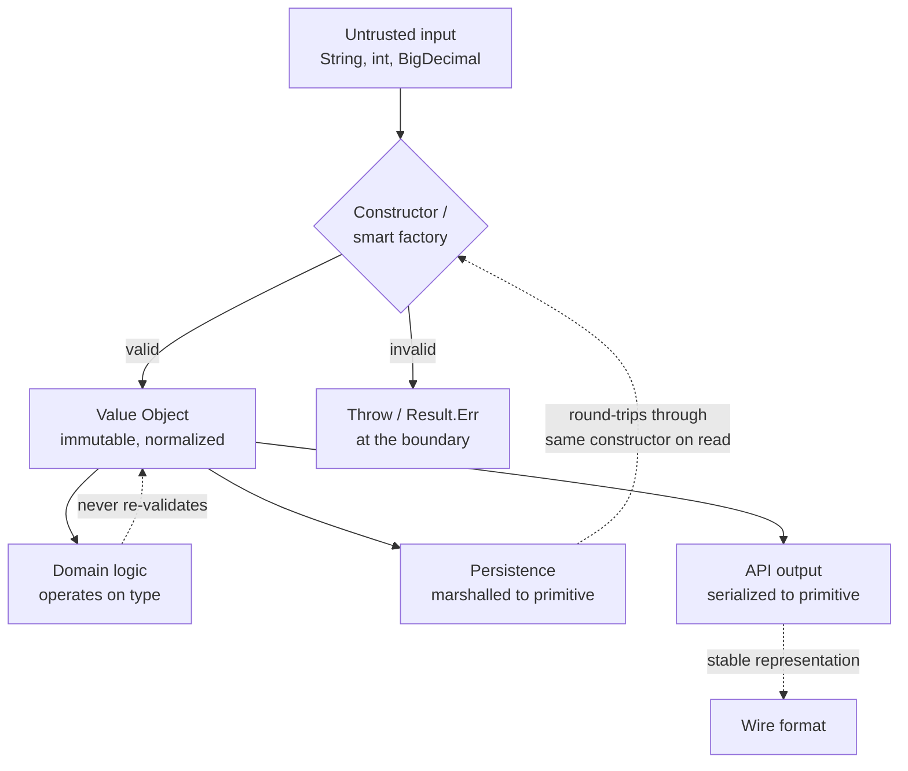
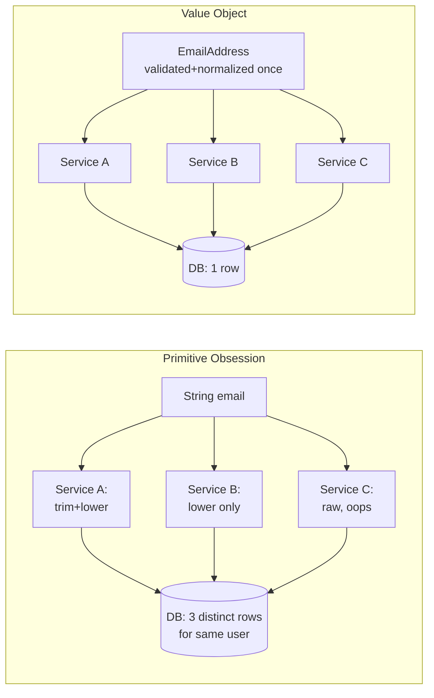

# Value Objects

## Why This Exists

**Problem.** Domain code drowns in primitives. `String email`, `BigDecimal amount`, `int userId`, `long timestamp`, `String currency`. The type system protects nothing. Validation is duplicated at every controller, sprinkled across services, and re-run on every read. Two `String` arguments at a call site can be swapped silently. `Money + Money` of different currencies sums to garbage. `email.trim().toLowerCase()` lives in 14 places, drifts in 3, and one of them forgets to NFC-normalize so the same user logs in twice with two distinct rows.

**Key insight.** A `String` is a pile of bytes; an `EmailAddress` is a *concept*. The concept has invariants (must contain `@`, normalized case, length bounded), an identity rule (equality by value, not by reference), and a small surface of legal operations. Encoding the concept as a type — constructed once, validated once, immutable thereafter — moves the bug from runtime to *construction time*, and from every layer to *one layer*. Eric Evans calls these **Value Objects** in *Domain-Driven Design*; Joshua Bloch calls a near-cousin "minimize mutability" in *Effective Java* item 17; Martin Fowler calls the inverse anti-pattern **Primitive Obsession**.

**Reach for this when:**
- A primitive (string/int/decimal) recurs across modules with the same validation rules.
- Two same-typed parameters are adjacent at a call site (`transfer(long from, long to, BigDecimal amount)`).
- Domain operations are illegal on the primitive (`amount * tax * fxRate` silently mixes currencies).
- Equality is by content (two `Money(100, USD)` should be equal regardless of object identity).
- You want compile-time prevention of "wrong kind of ID" bugs without runtime wrappers in hot paths.

**Don't reach for this when:**
- The value has a lifecycle and identity that persists through state changes — that's an **Entity**, not a Value Object (a `User` with the same email is still the same user; a `Money(100, USD)` *is* the value).
- The primitive is genuinely opaque (a hash, a UUID with no rules) and never mixed up with another primitive — wrapping it just adds noise.
- You're inside a tight numeric kernel (matrix multiply, codec) where allocation cost dominates and the type is enforced by external invariants.
- You're writing throwaway scripts. The cost-benefit only pays off when the type is referenced in ≥3 places.

## Diagrams





## Core Patterns

### 1. The canonical shape (any language)

A Value Object has **five** properties. Miss any one and you've built something else:

1. **Immutable.** No setters. Mutation returns a new instance.
2. **Equality by value.** `a.equals(b)` iff all components equal. `hashCode` consistent with equals.
3. **Self-validating.** Constructor rejects invalid state. There is no "not-yet-valid" instance.
4. **Side-effect free operators.** `add`, `withCurrency`, `concat` return new instances; they don't mutate.
5. **Replaceable, not editable.** You don't change a `Money(100, USD)`; you replace the reference.

### 2. Java — `record` (16+) is the right default

```java
import java.math.BigDecimal;
import java.math.RoundingMode;
import java.util.Currency;
import java.util.Objects;

public record Money(BigDecimal amount, Currency currency) {

    // Compact constructor — runs after field assignment, before exit.
    // Validation + normalization happens here. Once.
    public Money {
        Objects.requireNonNull(amount, "amount");
        Objects.requireNonNull(currency, "currency");
        // Normalize scale so equals() is sane: $1.00 == $1.000
        amount = amount.setScale(currency.getDefaultFractionDigits(), RoundingMode.UNNECESSARY);
    }

    public static Money of(String amount, String isoCurrency) {
        return new Money(new BigDecimal(amount), Currency.getInstance(isoCurrency));
    }

    public Money plus(Money other) {
        // Reject mixed-currency arithmetic at runtime — the type system
        // can't express "same currency" without phantom types.
        if (!currency.equals(other.currency)) {
            throw new IllegalArgumentException(
                "Cannot add %s + %s — convert first".formatted(currency, other.currency));
        }
        return new Money(amount.add(other.amount), currency);
    }

    public Money times(BigDecimal factor) {
        return new Money(
            amount.multiply(factor).setScale(currency.getDefaultFractionDigits(), RoundingMode.HALF_EVEN),
            currency);
    }

    public boolean isNegative() { return amount.signum() < 0; }
}
```

**Why `record` and not a class:** records auto-generate `equals`, `hashCode`, `toString`, accessors, and a canonical constructor. The compact constructor is the one place validation belongs. You cannot accidentally add a setter — records have none.

**Why `BigDecimal` and not `double`:** `0.1 + 0.2 != 0.3` in IEEE 754. Money in `double` is a Jira ticket waiting to happen. See *Effective Java* item 60.

### 3. C# — `record struct` for stack-allocated value semantics

```csharp
public readonly record struct Money(decimal Amount, string CurrencyCode)
{
    public Money
    {
        if (string.IsNullOrWhiteSpace(CurrencyCode) || CurrencyCode.Length != 3)
            throw new ArgumentException("ISO 4217 code required", nameof(CurrencyCode));
        CurrencyCode = CurrencyCode.ToUpperInvariant();
        // decimal is base-10 — safe for money. Don't use double/float.
    }

    public Money Plus(Money other) =>
        CurrencyCode == other.CurrencyCode
            ? this with { Amount = Amount + other.Amount }
            : throw new InvalidOperationException($"Currency mismatch: {CurrencyCode} vs {other.CurrencyCode}");
}
```

**`readonly record struct`** gives you (a) value-based equality, (b) `with`-expression for non-destructive update, (c) stack allocation for zero-GC pressure in hot paths, (d) compile-time immutability. This is the closest mainstream language gets to the ideal.

### 4. TypeScript — branded (nominal) types for zero-cost IDs

TS structural typing happily allows `userId: string` to flow into `orderId: string`. A **brand** restores nominality at compile time with zero runtime cost.

```typescript
// Phantom brand: only exists in the type system.
type Brand<T, B> = T & { readonly __brand: B };

export type UserId  = Brand<string, "UserId">;
export type OrderId = Brand<string, "OrderId">;

// Smart constructors enforce invariants AND issue the brand.
export function UserId(raw: string): UserId {
    if (!/^usr_[A-Za-z0-9]{16}$/.test(raw)) {
        throw new Error(`invalid UserId: ${raw}`);
    }
    return raw as UserId;
}

export function OrderId(raw: string): OrderId {
    if (!/^ord_[A-Za-z0-9]{16}$/.test(raw)) {
        throw new Error(`invalid OrderId: ${raw}`);
    }
    return raw as OrderId;
}

// Now this is a compile error:
function cancelOrder(o: OrderId) { /* ... */ }
const u = UserId("usr_abc1234567890123");
// cancelOrder(u);  // ← TS2345: UserId is not assignable to OrderId
```

For richer values, use a class with private constructor + static factory:

```typescript
export class EmailAddress {
    private constructor(public readonly value: string) {}

    static parse(raw: string): EmailAddress {
        const trimmed = raw.trim();
        // Don't ship your own email regex. Use a vetted library
        // (e.g. validator.js isEmail) or RFC 5322 + 5321 limits.
        if (trimmed.length === 0 || trimmed.length > 254) {
            throw new Error("email length invalid");
        }
        const [local, domain] = trimmed.split("@");
        if (!local || !domain) throw new Error("email missing @");
        // Normalization: lowercase domain (case-insensitive per RFC 5321),
        // preserve local-part case (technically case-sensitive per RFC 5321,
        // but most providers fold it — pick a policy and document it).
        return new EmailAddress(`${local}@${domain.toLowerCase()}`);
    }

    equals(other: EmailAddress): boolean { return this.value === other.value; }
    toJSON(): string { return this.value; }
}
```

### 5. Python — `frozen` dataclass + `__post_init__`

```python
from dataclasses import dataclass
from decimal import Decimal, ROUND_HALF_EVEN
from typing import Self

@dataclass(frozen=True, slots=True)
class Money:
    amount: Decimal
    currency: str  # ISO 4217

    def __post_init__(self) -> None:
        if not isinstance(self.amount, Decimal):
            # frozen=True means we use object.__setattr__ to coerce
            object.__setattr__(self, "amount", Decimal(str(self.amount)))
        if len(self.currency) != 3 or not self.currency.isalpha():
            raise ValueError(f"bad ISO 4217 code: {self.currency!r}")
        object.__setattr__(self, "currency", self.currency.upper())
        # Quantize to currency precision (USD: 2dp, JPY: 0dp, BHD: 3dp)
        precision = _PRECISION.get(self.currency, 2)
        q = Decimal(10) ** -precision
        object.__setattr__(self, "amount",
                           self.amount.quantize(q, rounding=ROUND_HALF_EVEN))

    def __add__(self, other: "Money") -> "Money":
        if self.currency != other.currency:
            raise ValueError(f"{self.currency} + {other.currency}")
        return Money(self.amount + other.amount, self.currency)

_PRECISION = {"JPY": 0, "BHD": 3, "USD": 2, "EUR": 2}
```

`frozen=True` gives equality + immutability + `__hash__`. `slots=True` saves ~40% memory and bans attribute injection. Using `Decimal` from strings avoids `float` rounding. **Never use `float` for money.**

### 6. Go — small struct, value receiver, no setter

Go has no `record`, but the convention is mature: **export only constructors**, use value receivers, and never expose a mutating method.

```go
package money

import (
    "errors"
    "fmt"
    "math/big"
)

type Money struct {
    amount   *big.Int  // minor units (e.g. cents for USD, sen for JPY-no, fils for BHD)
    currency string    // ISO 4217
}

func New(amountMinor int64, currency string) (Money, error) {
    if len(currency) != 3 {
        return Money{}, fmt.Errorf("invalid ISO 4217: %q", currency)
    }
    return Money{amount: big.NewInt(amountMinor), currency: currency}, nil
}

// Value receiver → callers cannot mutate.
func (m Money) Plus(other Money) (Money, error) {
    if m.currency != other.currency {
        return Money{}, errors.New("currency mismatch")
    }
    sum := new(big.Int).Add(m.amount, other.amount)
    return Money{amount: sum, currency: m.currency}, nil
}

func (m Money) Equal(other Money) bool {
    return m.currency == other.currency && m.amount.Cmp(other.amount) == 0
}
```

**Don't expose `*Money` in APIs** — pointer receivers invite mutation and break value semantics. Pass `Money` by value; it's small (24 bytes) and Go is fine with that.

### 7. Rust — `#[derive(...)]` and the newtype pattern

```rust
#[derive(Debug, Clone, Copy, PartialEq, Eq, Hash)]
pub struct UserId(u64);

impl UserId {
    pub fn new(id: u64) -> Result<Self, &'static str> {
        if id == 0 { return Err("UserId must be nonzero"); }
        Ok(UserId(id))
    }
    pub fn raw(&self) -> u64 { self.0 }
}

#[derive(Debug, Clone, PartialEq, Eq, Hash)]
pub struct EmailAddress(String);

impl EmailAddress {
    pub fn parse(raw: &str) -> Result<Self, EmailError> {
        let trimmed = raw.trim();
        if trimmed.is_empty() || trimmed.len() > 254 {
            return Err(EmailError::Length);
        }
        let (local, domain) = trimmed.split_once('@').ok_or(EmailError::NoAt)?;
        if local.is_empty() || domain.is_empty() {
            return Err(EmailError::Empty);
        }
        Ok(EmailAddress(format!("{}@{}", local, domain.to_lowercase())))
    }
}
```

The newtype pattern (a tuple struct wrapping one field) is **Rust's idiomatic value object**. `UserId(u64)` is a distinct type from `OrderId(u64)` and the compiler enforces it. With `Copy` it's free at the call site; without `Copy` (heap-backed) you pay one move.

### 8. Ranges and intervals

A frequent value object that catches off-by-one bugs:

```java
public record DateRange(LocalDate startInclusive, LocalDate endExclusive) {
    public DateRange {
        Objects.requireNonNull(startInclusive);
        Objects.requireNonNull(endExclusive);
        if (!endExclusive.isAfter(startInclusive)) {
            throw new IllegalArgumentException(
                "end must be > start (got %s..%s)".formatted(startInclusive, endExclusive));
        }
    }

    public boolean contains(LocalDate d) {
        return !d.isBefore(startInclusive) && d.isBefore(endExclusive);
    }

    public boolean overlaps(DateRange other) {
        return startInclusive.isBefore(other.endExclusive)
            && other.startInclusive.isBefore(endExclusive);
    }

    public Duration length() {
        return Duration.between(startInclusive.atStartOfDay(), endExclusive.atStartOfDay());
    }
}
```

Half-open `[start, end)` is the convention that composes — adjacent ranges don't overlap, lengths subtract cleanly. This is the same convention as `Iterator<T>::end()` in C++ STL and Python's `range()`.

### 9. Persistence: round-trip through the constructor

The number-one mistake: bypassing the constructor on read. ORM hydration, JSON deserialization, and Protobuf decoding all love to skip your validation.

```java
// JPA — use AttributeConverter so the constructor runs on hydration.
@Converter(autoApply = true)
public class EmailConverter implements AttributeConverter<EmailAddress, String> {
    public String convertToDatabaseColumn(EmailAddress e) { return e == null ? null : e.value(); }
    public EmailAddress convertToEntityAttribute(String s) { return s == null ? null : EmailAddress.parse(s); }
}
```

```typescript
// Zod — parse, don't validate.
import { z } from "zod";
const Email = z.string().email().transform(s => EmailAddress.parse(s));
```

If your storage layer hydrates raw strings into a field typed as `EmailAddress`, you have a `EmailAddress` that was never validated. That's a footgun bigger than the one you tried to remove.

## Trade-offs

| Benefit | Cost |
|---|---|
| Invariants enforced at one boundary, never re-checked downstream | Allocation per construction (matters in hot loops; usually doesn't) |
| Compile-time prevention of swapped-argument bugs (with branding/newtypes) | More types to name, document, and locate; IDE noise |
| Equality and hashing become "obvious" — no custom comparators | ORM/serializer integration requires explicit converters |
| Domain operations live with the type, not scattered across services | Refactor cost when the invariant changes (every persisted blob may need migration) |
| Test fixtures become smaller and more meaningful (`Money.of("10.00", "USD")`) | Naive constructors that throw can cascade exceptions through controllers; prefer `Result`/`Either` at API edges |
| Logs/toString are self-describing | Wrapping primitives can confuse debuggers and `console.log` output |
| Refactoring is mechanical: change the type once | If the value object is over-rich (50 methods), it becomes a god-object — extract sub-VOs |

## Common Pitfalls

- **Mutable internals.** A `record Order(List<LineItem> items)` looks immutable but the list isn't. Wrap in `List.copyOf()` in the compact constructor, or use an immutable collection (Guava `ImmutableList`, Kotlin `persistentListOf`).
- **`equals` based on a generated ID.** That makes it an Entity, not a VO. VOs compare by *all* their content. If you find yourself adding `id` to a value object, you've crossed the line.
- **Bypassing the constructor.** Jackson, Hibernate, Protobuf, and `@JsonCreator`-less paths can all instantiate via reflection and skip your validation. Always test round-trip serialization with malformed input. Audit every framework that creates instances.
- **Using `float`/`double` for money.** `0.1 + 0.2 == 0.30000000000000004`. Use `BigDecimal` (Java), `decimal` (C#), `Decimal` (Python), `*big.Int` minor units (Go), `rust_decimal` (Rust). Twitter, Knight Capital, and countless retail systems have lost money to this exact bug.
- **String comparison without normalization.** Email `Foo@Bar.com` vs `foo@bar.com`. Username `José` (NFC) vs `José` (NFD). URLs with trailing slash. Pick a normalization, apply it in the constructor, document it. See Unicode UAX #15.
- **Validation regex copied from Stack Overflow.** Email regex from 2008 doesn't accept `+` aliases or IDN domains. Use a real library or accept "looks plausible + we'll verify by sending mail".
- **Exposing internals via getter that returns a mutable reference.** `record Polygon(List<Point> vertices)` → `polygon.vertices().add(...)` mutates the polygon. Defensive copy on construction *and* on access, or use truly immutable collections.
- **Throwing `IllegalArgumentException` from constructors at API boundaries.** Stack traces leak validation logic; clients get HTTP 500 instead of 400. Use `Result<T,E>` / `Either` / `Optional` factories at the boundary, throw inside the domain.
- **Phantom-typing without a smart constructor.** `id as UserId` is a lie if you didn't validate. The brand is a *promise*; the constructor is the only place that promise is kept.
- **Currency arithmetic across different scales.** `BigDecimal(1.00) + BigDecimal(1.000)` are equal in `compareTo` but not `equals`. Quantize in the constructor.
- **Time zones inside the value.** A `Timestamp(instant, tz)` where the tz is part of equality means `now() at UTC` ≠ `same instant at JST`. Decide: are you modeling a wall-clock event (with tz) or an instant (UTC only)? Don't smuggle ambiguity.

## Decision Table

| Situation | Use | Don't use |
|---|---|---|
| Currency-aware amount in a domain | `Money` value object with `BigDecimal`/`decimal` + ISO code | `double amount`, `String currency` parameters |
| User identifier passed across 5+ functions | Branded `UserId` / newtype | Raw `string`/`long` |
| Address with country-specific validation | `PostalAddress` value object with country-tagged validators | Free-form `String` and per-call regex |
| Email/phone with normalization rules | Value object with `parse` factory | `String` + scattered `.trim().toLowerCase()` |
| Date interval `[start, end)` | `DateRange` value object with `overlaps`/`contains` | Two `LocalDate` parameters |
| Hot inner-loop primitive (image pixel) | Raw primitive or struct of primitives | A heap-allocated `Pixel` class |
| Lifecycle: same logical thing across state changes | **Entity** (mutable, identity-based) | Value Object |
| Cryptographic key bytes | Newtype with constant-time-equality + zeroizing destructor | Raw `byte[]` |
| Config flag `bool isEnabled` | Probably keep it primitive | Wrapping every bool is over-engineering |
| Coordinates `(lat, lon)` | `GeoPoint` value object with bounds-checked constructor | Two `double` parameters |
| Percentage / ratio | `Percentage` value object (0..100) or `Ratio` (0..1) — pick one and stick to it | Raw `double` that ambiguously could be either |

## References

- Eric Evans — *Domain-Driven Design: Tackling Complexity in the Heart of Software*, Addison-Wesley 2003. Chapters 5–6 ("A Model Expressed in Software" and "The Life Cycle of a Domain Object") define Value Objects and contrast with Entities.
- Vaughn Vernon — *Implementing Domain-Driven Design*, Addison-Wesley 2013. Chapter 6 "Value Objects" — practical guidance, persistence, and side-effect-free behavior.
- Martin Fowler — Primitive Obsession (refactoring smell) — https://refactoring.guru/smells/primitive-obsession
- Martin Fowler — Value Object — https://martinfowler.com/bliki/ValueObject.html
- Martin Fowler — *Refactoring* (2nd ed.), Addison-Wesley 2018. "Replace Primitive with Object" — https://refactoring.com/catalog/replacePrimitiveWithObject.html
- Joshua Bloch — *Effective Java* (3rd ed.), Addison-Wesley 2018. Item 17 "Minimize mutability"; Item 60 "Avoid float and double if exact answers are required"; Item 50 "Make defensive copies when needed".
- JEP 395 — Records (Java 16) — https://openjdk.org/jeps/395
- Microsoft — Records in C# — https://learn.microsoft.com/dotnet/csharp/language-reference/builtin-types/record
- Microsoft — `decimal` type — https://learn.microsoft.com/dotnet/csharp/language-reference/builtin-types/floating-point-numeric-types#characteristics-of-the-floating-point-types
- TypeScript — Branded types pattern (community canonical write-up) — https://egghead.io/blog/using-branded-types-in-typescript
- Python — `dataclasses.dataclass(frozen=True)` — https://docs.python.org/3/library/dataclasses.html
- Rust — Newtype pattern — *The Rust Programming Language* — https://doc.rust-lang.org/book/ch19-04-advanced-types.html#using-the-newtype-pattern-for-type-safety-and-abstraction
- Go — Effective Go: methods and value receivers — https://go.dev/doc/effective_go#methods
- IEEE 754 floating-point — *What Every Computer Scientist Should Know About Floating-Point Arithmetic* (Goldberg, 1991) — https://docs.oracle.com/cd/E19957-01/806-3568/ncg_goldberg.html
- ISO 4217 currency codes — https://www.iso.org/iso-4217-currency-codes.html
- RFC 5321 / RFC 5322 — SMTP & Internet Message Format (email syntax) — https://www.rfc-editor.org/rfc/rfc5321 / https://www.rfc-editor.org/rfc/rfc5322
- Unicode UAX #15 — Normalization Forms — https://unicode.org/reports/tr15/
- Pat Helland — *Immutability Changes Everything* — ACM Queue 2015 — https://queue.acm.org/detail.cfm?id=2884038
- DDIA (Kleppmann, O'Reilly 2017) — ch. 4 "Encoding and Evolution" on the cost of bypassing schemas/types when persisting domain objects.

## See Also

- [../ddd/](../ddd/) — Value Objects are one of the four DDD tactical patterns (alongside Entities, Aggregates, Domain Events).
- [../aggregates/](../aggregates/) — aggregates are usually composed of Entities + Value Objects; the boundary matters.
- [../code-smells/](../code-smells/) — Primitive Obsession is the smell value objects fix.
- [../refactoring-catalog/](../refactoring-catalog/) — *Replace Primitive with Object* and *Extract Class* are the canonical moves.
- [../anti-patterns/](../anti-patterns/) — anemic-domain-model and primitive-obsession both push back against value-object thinking.
- [../property-based-testing/](../property-based-testing/) — value-object invariants are property tests' best friend (commutativity, identity, idempotency).
- [../../data-systems/schema-evolution/](../../data-systems/schema-evolution/) — value objects often round-trip through wire formats; Avro/Protobuf encoding rules apply.
