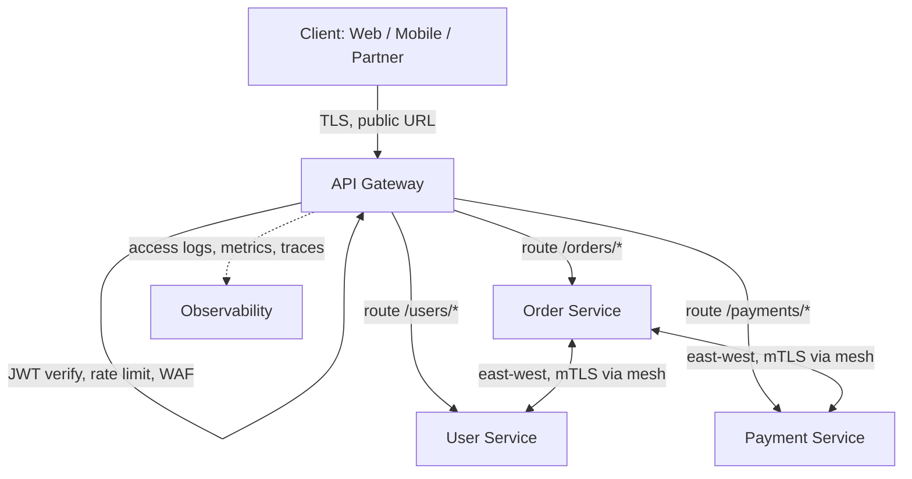
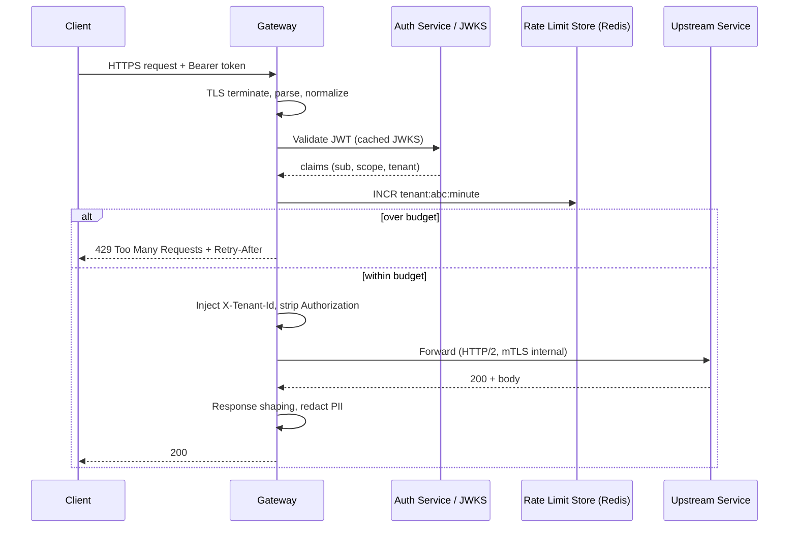
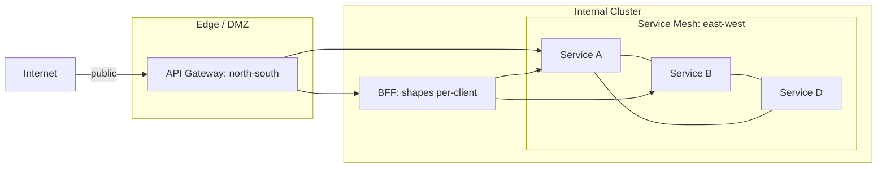

# API Gateway

## Why This Exists

**Problem.** A microservice fleet exposes dozens of HTTP/gRPC endpoints. Every client (web, mobile, partner) needs auth, rate limiting, TLS, retries, a sane URL surface, and protection from malformed inputs. If each service implements those concerns, you end up with N inconsistent implementations of JWT validation, N copies of the CORS config, and N places where an attacker can find a hole. Worse, public DNS and SSL certs leak service-internal topology — renaming a service breaks every client.

**Key insight.** Cross-cutting **north-south** concerns (the traffic crossing your trust boundary) are best terminated at a single, well-instrumented hop *outside* the service. The gateway is the **edge contract**: it owns the public URL space, the auth model, the rate-limit budget, and the observability seam. Services behind it can be small, trust-internal, and freely refactored. The gateway is **not** where you put business logic — that's the canonical anti-pattern (see "Gateway smell").

**Reach for this when:**
- You expose more than a few services to external clients and want **one TLS termination, one WAF, one JWT verifier**.
- You need **per-route or per-tenant rate limiting** without redeploying services.
- You want **canary, blue/green, or weighted routing** at the edge for safe rollouts.
- You need **request/response transformation** (legacy XML→JSON, header injection, PII redaction) at the boundary.
- Compliance demands a **single audit log** of every external request.
- You want services to live on a private network and only the gateway in the DMZ.

**Don't reach for this when:**
- All your traffic is **service-to-service inside the cluster** — that's a [service mesh](#vs-service-mesh) problem.
- You need **client-shape-specific** payloads (mobile vs web) — that's a [BFF](#vs-bff), and you may want both (gateway → BFF → services).
- You have **one service** and one client — a gateway is overhead. A reverse proxy or ALB is enough.
- You're tempted to put **business rules, joins, or DB calls** in the gateway. Stop. Build a service.

## Diagrams

### North-south traffic flow



### Request lifecycle inside the gateway



### Where the gateway sits vs mesh vs BFF



## Core responsibilities (and how to implement them right)

A real gateway does five things well. Do **all five** in your gateway, or you'll re-add them piecemeal in services later.

### 1. Routing

Route by host, path, method, header, or weighted target. Routing config should be **declarative and reloadable** without dropping connections.

```yaml
# Envoy route config (excerpt) — runs as a sidecar or standalone
# https://www.envoyproxy.io/docs/envoy/latest/configuration/http/http_conn_man/route_config
route_config:
  name: public_routes
  virtual_hosts:
  - name: api
    domains: ["api.example.com"]
    routes:
    # Canary: 5% of /orders to v2
    - match: { prefix: "/orders/" }
      route:
        weighted_clusters:
          clusters:
          - name: orders_v1
            weight: 95
          - name: orders_v2
            weight: 5
    - match: { prefix: "/users/" }
      route: { cluster: users_v1, timeout: 2s, retry_policy: { retry_on: "5xx,reset", num_retries: 2 } }
    - match: { prefix: "/payments/" }
      route: { cluster: payments_v1, timeout: 5s }  # NO retries — non-idempotent
```

**Rules of thumb.**
- **Don't retry non-idempotent calls** (POST /payments) at the gateway. Retry GETs, PUTs with idempotency keys, and only after you understand downstream behavior. AWS Builders' Library: *Timeouts, retries, and backoff with jitter*.
- Set **per-route timeouts shorter than the client's timeout** so the gateway, not the client, owns the failure.
- Prefer **HTTP/2 to upstreams** to coalesce connections. Connection storms on a popular upstream are a real outage source.

### 2. Authentication and authorization

Verify identity at the edge, then **stamp a trusted internal header** (e.g. `X-Tenant-Id`, `X-User-Id`, `X-Scopes`) and **strip the original `Authorization`**. Services trust the header because they only accept traffic from the gateway (network policy or mTLS).

```lua
-- Kong custom plugin: validate JWT, inject tenant header, strip Authorization
-- https://docs.konghq.com/gateway/latest/plugin-development/
local jwt = require "resty.jwt"
local jwks = require "internal.jwks_cache"  -- caches keys, refreshes on rotation

local M = { PRIORITY = 1000, VERSION = "1.0" }

function M:access(conf)
  local auth = kong.request.get_header("authorization")
  if not auth then return kong.response.exit(401, { msg = "missing token" }) end

  local token = auth:match("^Bearer%s+(.+)$")
  local key = jwks.get(conf.issuer)  -- cached JWKS, NOT a fetch per-request
  local verified = jwt:verify(key, token)
  if not verified.verified then
    return kong.response.exit(401, { msg = "invalid token", reason = verified.reason })
  end

  local claims = verified.payload
  if claims.exp and claims.exp < ngx.time() then
    return kong.response.exit(401, { msg = "expired" })
  end

  -- Inject trusted internal context, strip the bearer
  kong.service.request.set_header("X-Tenant-Id", claims.tenant)
  kong.service.request.set_header("X-User-Id", claims.sub)
  kong.service.request.set_header("X-Scopes", table.concat(claims.scopes or {}, ","))
  kong.service.request.clear_header("Authorization")
end

return M
```

**Critical pitfalls.**
- **Cache JWKS.** Fetching the issuer's keys per-request will melt your auth provider during a traffic spike. Cache for 10 min, refresh in background.
- **Strip the bearer before forwarding.** Otherwise an upstream service can replay it elsewhere — privilege escalation by accident.
- **Validate `aud` and `iss`.** Token from the right issuer for the wrong audience is still a forgery. (BSRS ch. 5 — Identities.)
- **Don't put authorization (RBAC/ABAC policy) in the gateway** unless the policy is purely route-level. Resource-level policy belongs in services that own the data.

### 3. Rate limiting and quota

Two separable concerns:
- **Throttling** — protect the system from overload (req/sec per route or per upstream).
- **Quota** — fair-share across tenants/customers, enforce SLA tiers (req/day per API key).

Implement with a **token bucket or sliding window** in a shared store (Redis). Local-only counters fail when you have N gateway replicas.

```python
# Pseudo-code: sliding-window rate limit in a custom Envoy ext_authz / Lua filter
# Real impl: use envoy.filters.http.local_ratelimit (per-process, in-memory) for burst,
# plus envoy.filters.http.ratelimit (RLS service backed by Redis) for global tenant quota.
# https://www.envoyproxy.io/docs/envoy/latest/configuration/http/http_filters/rate_limit_filter
def check_rate_limit(redis, tenant_id, limit_per_min):
    now = time.time()
    key = f"rl:{tenant_id}:{int(now // 60)}"
    # Atomic INCR + EXPIRE in a Lua script — never INCR then EXPIRE in two round trips
    count = redis.eval(INCR_AND_EXPIRE_LUA, 1, key, 70)
    if count > limit_per_min:
        retry_after = 60 - (now % 60)
        return RateLimitResult(allowed=False, retry_after=int(retry_after))
    return RateLimitResult(allowed=True)
```

**Pitfalls.**
- **Don't skip `Retry-After`.** Clients with retry logic will hammer you forever. SRE Workbook ch. 22 — Managing Load.
- **Two-tier limits.** Per-IP (defends against scrapers) + per-tenant (defends against runaway customer code). Single-dimension limits are a noisy-neighbor problem waiting to happen.
- **Fail open vs closed.** If Redis dies, do you 503 everything or let traffic through? Default to **fail open at the edge** (with a hard local cap) — losing quota enforcement is recoverable; losing the API isn't.

### 4. Request / response shaping

Header rewrites, body transformations, schema validation, PII redaction. Done at the edge, this is leverage. Done in services, it's duplication.

```yaml
# AWS API Gateway request validator — reject bad JSON before it reaches Lambda
# https://docs.aws.amazon.com/apigateway/latest/developerguide/api-gateway-method-request-validation.html
RequestValidator:
  Type: AWS::ApiGateway::RequestValidator
  Properties:
    ValidateRequestBody: true
    ValidateRequestParameters: true
RequestModel:
  $schema: "http://json-schema.org/draft-04/schema#"
  type: object
  required: [order_id, amount_cents, currency]
  properties:
    order_id:    { type: string, pattern: "^ord_[a-zA-Z0-9]{16}$" }
    amount_cents:{ type: integer, minimum: 1, maximum: 10000000 }
    currency:    { type: string, enum: [USD, EUR, GBP, JPY] }
```

**Anti-pattern: business logic in the gateway.** Translating a field name (`customer_id` → `userId`) is shaping. **Computing tax**, **deciding fraud**, **looking up inventory**, **enriching from a DB** — that's a service. The smell:

- Gateway config grows beyond a few hundred lines.
- A deploy of "the gateway" requires product-team review.
- You've added a script engine (Groovy, Lua, JS) and people are writing if/else trees in it.
- Outages start with "we changed the gateway transform and now…".

If any of those are true, build a thin **edge service** behind the gateway and put logic there. The gateway routes to it.

### 5. Observability

Every request crosses the gateway exactly once — so it's the **canonical place to emit access logs, metrics, and trace headers**. If the gateway is the only thing emitting structured logs, you can still answer "what happened to this user's request" — you can't always say that of internal services.

```yaml
# Envoy access log: structured JSON, propagate W3C trace context
# https://www.envoyproxy.io/docs/envoy/latest/configuration/observability/access_log/access_log
access_log:
- name: envoy.access_loggers.stdout
  typed_config:
    "@type": type.googleapis.com/envoy.extensions.access_loggers.stream.v3.StdoutAccessLog
    log_format:
      json_format:
        ts: "%START_TIME%"
        method: "%REQ(:METHOD)%"
        path: "%REQ(X-ENVOY-ORIGINAL-PATH?:PATH)%"
        status: "%RESPONSE_CODE%"
        upstream: "%UPSTREAM_HOST%"
        duration_ms: "%DURATION%"
        request_id: "%REQ(X-REQUEST-ID)%"
        trace_id: "%REQ(TRACEPARENT)%"
        tenant: "%REQ(X-TENANT-ID)%"
        user_agent: "%REQ(USER-AGENT)%"
        ua_bytes_in: "%BYTES_RECEIVED%"
        ua_bytes_out: "%BYTES_SENT%"
        # 'response_flags' surfaces Envoy reasons — UH (no healthy upstream), UT (timeout), DC (downstream conn term)
        response_flags: "%RESPONSE_FLAGS%"
tracing:
  provider:
    name: envoy.tracers.zipkin
    typed_config:
      "@type": type.googleapis.com/envoy.config.trace.v3.ZipkinConfig
      collector_cluster: zipkin
      collector_endpoint: "/api/v2/spans"
      collector_endpoint_version: HTTP_JSON
```

**RED metrics at the edge** (Rate / Errors / Duration), broken down by route and tenant, are usually your **best leading indicator**. If gateway p99 spikes but no upstream's p99 does, the problem is connection pool exhaustion, JWKS fetch storm, or rate-limit-store latency — diagnose the gateway itself.

## The four common gateways — when to pick which

### Kong (Lua on OpenResty/Nginx)

- **Strengths.** Plugin ecosystem (50+ official, hundreds of community), DB-less mode (declarative YAML), good UX for ops teams. Strong Kubernetes Ingress controller.
- **Weaknesses.** Lua plugins for hot paths can be slower than native filters; admin DB (Postgres) is a stateful component you have to run unless you go DB-less; advanced routing (gRPC, complex transforms) sometimes needs custom plugins.
- **Pick when.** You want a batteries-included gateway with a UI, your traffic is mostly REST, and you have ops capacity to run it.

### Envoy (CNCF, C++)

- **Strengths.** First-class HTTP/2, gRPC, gRPC-Web, xDS dynamic config, raw performance, observability (RED metrics, response flags). Same data plane used by Istio, Consul Connect, AWS App Mesh, Google Cloud Service Mesh. Very rich filter chain.
- **Weaknesses.** Configuration is verbose and unforgiving — most teams run it via a control plane (Istio, Contour, Gloo, Emissary) rather than hand-writing YAML. Steeper learning curve.
- **Pick when.** You need top-tier performance and observability, you're already in a service-mesh world (so the gateway and mesh share a data plane), or you're doing heavy gRPC.

### AWS API Gateway (REST or HTTP API)

- **Strengths.** Fully managed, IAM-native, tight Lambda integration, WAF, usage plans + API keys built-in. **HTTP API** variant is much cheaper and faster than the older REST flavor.
- **Weaknesses.** Pricing scales with requests — high-throughput public APIs get expensive. **Hard 30-second integration timeout** for synchronous calls (29s for REST). Limited transformation power compared to Kong/Envoy. Cold starts (custom authorizers as Lambda).
- **Pick when.** You're already on AWS, traffic is moderate, you want zero ops, and you're not doing very long-lived requests or heavy WS at scale. Use **HTTP API** unless you need REST-only features (request validators with full schema, API keys with usage plans). See AWS docs: *Choosing between REST APIs and HTTP APIs*.

### Nginx (or OpenResty)

- **Strengths.** Battle-tested, fast, ubiquitous, low memory, great as a TLS terminator and L7 load balancer. With OpenResty / Lua you can extend it.
- **Weaknesses.** Reload semantics (`nginx -s reload` forks workers) make dynamic config painful at scale. Plugin/control-plane story is weak compared to Envoy/Kong (Kong is essentially "Nginx + plugins + control plane"). Telemetry is basic without extensions.
- **Pick when.** You want the simplest possible reverse proxy, your config is mostly static, or you're using it as the TLS terminator in front of something fancier.

## vs Service mesh

Both proxy traffic. They solve different problems.

| Axis | API Gateway | Service Mesh (Istio, Linkerd, Consul) |
|---|---|---|
| Direction | **North-south** (client ↔ cluster) | **East-west** (service ↔ service) |
| Trust boundary | Crosses it | Inside it |
| Authn | JWT / OAuth / API key | mTLS workload identity (SPIFFE/SPIRE) |
| Authz | Coarse, route-level | Fine, per-RPC, often Rego/AuthorizationPolicy |
| Rate limit | Per-tenant, per-API-key | Per-service, defensive |
| Topology | One (or a few) instances at the edge | Sidecar (or per-node) on every pod |
| Failure domain | Edge — losing it is a public outage | Cluster-wide — losing the control plane silently degrades |

You usually want **both**: a gateway at the edge, mesh inside. Some Envoy-based stacks (Istio + ingress gateway, Consul Connect + API Gateway) ship a unified data plane so you only learn one config language.

## vs BFF (Backend-For-Frontend)

A **BFF** is a thin server tailored to one client (iOS BFF, web BFF, partner BFF). It composes calls to backend services, shapes payloads to that client's exact needs, and may add client-specific caching.

- **API Gateway** is **client-agnostic**. It doesn't know your iOS app needs a flat object instead of nested.
- **BFF** is **client-specific** code, written by the team that owns that client.

Common architecture: `Client → Gateway (auth, rate limit, TLS) → BFF (shape, compose) → Services`. Don't make the gateway do BFF's job — your transforms will become a programming language nobody owns. Sam Newman wrote the canonical piece (see References).

## Trade-offs

| Benefit | Cost |
|---|---|
| Single place for TLS, auth, rate limit, WAF | New SPOF — gateway down ⇒ all north-south traffic down. Run N replicas behind a load balancer. |
| Stable public URL surface decoupled from internal topology | Adds a network hop — typically **2–10 ms p50** of added latency, more if filters are heavy. |
| Centralized observability (every request seen once) | Gateway logs/metrics become high-cardinality and expensive at scale; needs sampling. |
| Services can stay small, internal-only, polyglot | Gateway config becomes a critical, shared artifact — needs ownership, review, and a rollback plan. |
| Easy canary, weighted routing, header-based routing | Easy to **abuse**: people add business logic in transforms; review gateway PRs like service code. |
| One JWT verifier, one JWKS cache | If JWKS fetch fails on cold start, **everything 401s**. Pre-warm and cache aggressively. |
| Per-tenant rate limits without service code changes | Rate-limit store (Redis) becomes load-bearing — its outage caps your throughput or fails open. |
| Strip internal headers, redact PII before leaving cluster | Misconfigured stripping has leaked tokens, internal IPs, and stack traces in real incidents. |

## Common Pitfalls

- **Business logic creeping into transforms.** Today it's a header rename. Six months later it's a Groovy script computing pricing. Hard rule: **no DB calls, no fan-out, no domain logic in the gateway**. If you need composition, build a service or a BFF.
- **The retry storm.** Gateway retries POSTs (or non-idempotent endpoints), an upstream blip becomes a thundering herd, the upstream falls over harder, gateway retries more. *AWS Builders' Library — Timeouts, retries, and backoff with jitter*. Use **jittered exponential backoff**, set a **token-bucket retry budget**, and **never retry non-idempotent operations** by default.
- **JWKS fetch storm.** Cold gateway, every request fetches the issuer's keys. Or you set TTL=0. Or your auth provider rate-limits you and **all auth fails**. Cache JWKS in memory, refresh in background, fall back to last-known-good on issuer outage.
- **TLS termination without re-encryption to upstreams.** Inside a multi-tenant cluster, plaintext between gateway and services means a compromised pod can sniff. Use mTLS to upstreams (mesh handles it) or at least TLS.
- **Single rate-limit dimension.** Per-IP only — one bad tenant behind a corporate NAT melts the system. Per-tenant only — a botnet hitting `/login` from millions of IPs sails through. Use **both**.
- **Letting the gateway own state.** Sticky sessions, in-memory caches, anything that means "the same client must hit the same gateway pod." This breaks on a deploy or a node failure. Push state to Redis or to the service.
- **Public-facing 5xx with internal stack traces.** Default-deny error verbosity at the edge. Map upstream 5xx to a sanitized response. Log the detail; don't ship it.
- **Wildcard CORS at the gateway because "the frontend was broken".** `Access-Control-Allow-Origin: *` with `Allow-Credentials: true` is a CSRF foot-gun. Maintain an explicit allowlist.
- **No shed-load policy.** When upstream is failing, the gateway happily forwards. Implement **circuit breakers** (Envoy `outlier_detection`, Kong `proxy-cache` + circuit breaker plugins) so a sick upstream gets short-circuited to 503 instead of holding connections open. SRE book ch. 22 — Addressing Cascading Failures.
- **AWS API Gateway's 30-second timeout, discovered in production.** REST API caps at 29s, HTTP API at 30s. Long-running requests must move to async (SQS + status endpoint) or a different fronting layer (ALB → Fargate/EC2).
- **Config drift between environments.** Dev uses YAML, prod uses the GUI, staging diverged. Treat gateway config as **code in git**, deploy via the same pipeline as services, never click-edit prod.
- **No request-id propagation.** No way to correlate a 502 the customer saw with the upstream timeout in a service log. Generate `X-Request-Id` at the gateway and force it into every log line and W3C `traceparent` header.

## Decision Table

| Situation | Pick |
|---|---|
| Public REST/HTTP APIs, on AWS, moderate scale | **AWS API Gateway (HTTP API)** for cost; REST API only if you need request validators/usage plans |
| Heavy gRPC / streaming / mesh-adjacent | **Envoy** (often via Istio/Contour/Gloo) |
| Want plugins, UI, ops simplicity, on-prem or multi-cloud | **Kong** |
| Need only TLS termination + simple L7 routing | **Nginx** (or an ALB / GCLB) |
| Internal east-west traffic between services | **Service mesh**, not a gateway |
| Per-client payload shaping (iOS vs web differ) | **BFF** behind the gateway |
| Composing 4 service calls into one client response | **BFF** or composition service — *not* the gateway |
| Single service, single client, small scale | **Reverse proxy / ALB** — gateway is overkill |
| Need OAuth2 token issuance | **Identity provider** (Auth0, Cognito, Keycloak) — gateway *verifies*, doesn't *mint* |
| Long-running connections (>30s, WebSocket at high scale) | Envoy/Nginx in front of a stateful service tier; not API Gateway REST |
| You're tempted to put business logic in the gateway | **Build a service**. The gateway routes to it. |
| Multi-region failover / global edge | Gateway behind a global load balancer (Route 53, Cloud Load Balancer, Cloudflare); or use a managed edge (CloudFront + API Gateway, Cloudflare Workers) |

## References

- Envoy Project — *Envoy Proxy Architecture & HTTP filters* — https://www.envoyproxy.io/docs/envoy/latest/intro/arch_overview/intro/intro
- Kong, Inc. — *Kong Gateway documentation* — https://docs.konghq.com/gateway/
- AWS — *Amazon API Gateway Developer Guide* — https://docs.aws.amazon.com/apigateway/latest/developerguide/welcome.html
- AWS — *Choosing between REST APIs and HTTP APIs* — https://docs.aws.amazon.com/apigateway/latest/developerguide/http-api-vs-rest.html
- AWS Builders' Library — Marc Brooker, *Timeouts, retries, and backoff with jitter* — https://aws.amazon.com/builders-library/timeouts-retries-and-backoff-with-jitter/
- AWS Builders' Library — *Avoiding fallback in distributed systems* — https://aws.amazon.com/builders-library/avoiding-fallback-in-distributed-systems/
- AWS Builders' Library — *Using load shedding to avoid overload* — https://aws.amazon.com/builders-library/using-load-shedding-to-avoid-overload/
- Google SRE Book — ch. 22, *Addressing Cascading Failures* — https://sre.google/sre-book/addressing-cascading-failures/
- Google SRE Workbook — ch. 22, *Managing Load* — https://sre.google/workbook/managing-load/
- Google — *Building Secure and Reliable Systems*, ch. 5 (Identities) — https://sre.google/books/building-secure-reliable-systems/
- Sam Newman — *Backends For Frontends pattern* — https://samnewman.io/patterns/architectural/bff/
- Martin Fowler / Phil Calçado — *The Back-end for Front-end Pattern (BFF)* — https://philcalcado.com/2015/09/18/the_back_end_for_front_end_pattern_bff.html
- Chris Richardson — *Microservices Patterns: API Gateway pattern* — https://microservices.io/patterns/apigateway.html
- Nginx — *NGINX Microservices Reference Architecture* — https://www.nginx.com/blog/microservices-reference-architecture-nginx-fabric-model/
- IETF RFC 6749 — *The OAuth 2.0 Authorization Framework* — https://datatracker.ietf.org/doc/html/rfc6749
- IETF RFC 7519 — *JSON Web Token (JWT)* — https://datatracker.ietf.org/doc/html/rfc7519
- IETF RFC 6585 — *HTTP Status Code 429 (Too Many Requests) and Retry-After* — https://datatracker.ietf.org/doc/html/rfc6585
- W3C — *Trace Context (traceparent header)* — https://www.w3.org/TR/trace-context/
- Kleppmann — *Designing Data-Intensive Applications*, ch. 4 (Encoding & Evolution) and ch. 8 (Trouble with Distributed Systems) — for why versioned wire formats matter at the gateway
- Xu — *System Design Interview Vol. 1*, ch. 4 (Designing a Rate Limiter) — for token-bucket vs sliding-window mechanics

## See Also

- `../../architecture-patterns/service-mesh/` — east-west mTLS, retries, and authorization between services
- `../grpc/` — when to terminate gRPC at the gateway vs pass through
- `../websockets/` — long-lived connections and gateway implications
- `../../reliability/circuit-breaker/` — outlier detection, half-open, budget retries
- `../../reliability/rate-limiting/` — token bucket vs sliding window vs leaky bucket
- `../../reliability/load-shedding/` — when 503-ing fast is the correct answer
- `../../performance/tracing/` — propagating `traceparent` from the edge
- `../../reliability/observability/` — request-id propagation, sampling at scale
- `../idempotency/` — why retries at the gateway require idempotency keys
