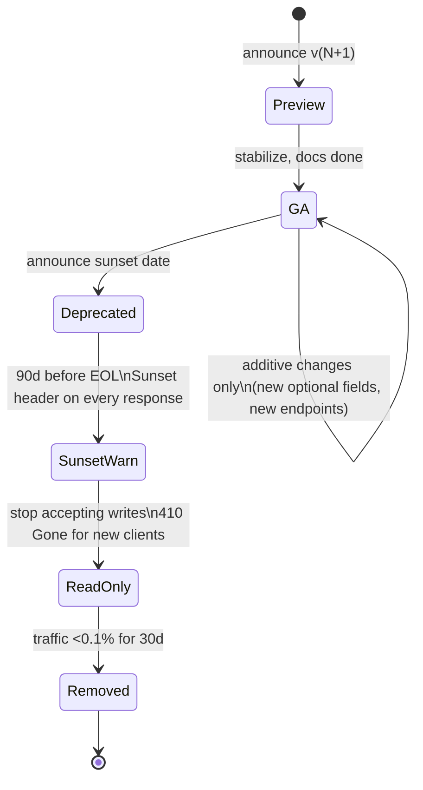
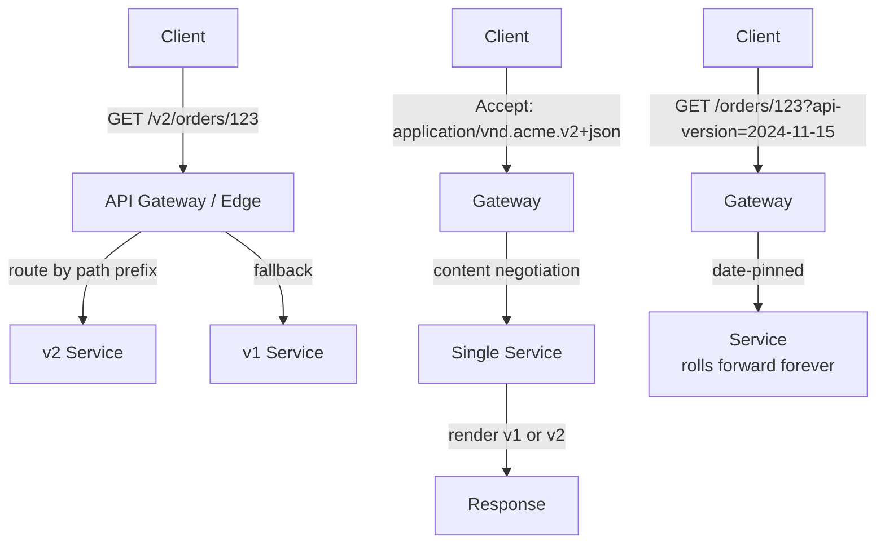

# API Versioning

## Why This Exists

**Problem.** APIs have consumers you don't control. Mobile apps live on phones for years. Partners integrate once and forget. Internal services depend on contracts you only half-document. Every change is potentially breaking — and "breaking" is defined by *the consumer's parser*, not your intent. Adding a required field, narrowing a type, changing an error code, or even reordering JSON keys in a poorly-written client can cause a 3 AM page.

**Key insight.** Versioning is not about putting `/v1` in a URL. It's a **contract evolution strategy**: how you communicate change, how long you support old behavior, and who is allowed to break whom. The URL prefix is the cheapest, most visible *signal* of that strategy — but the strategy itself is the discipline of additive evolution, deprecation lifecycles, and contract tests. Pick the *strategy* first; the wire format is downstream of it.

The dominant industry view (Stripe, AWS, GitHub, Google) is: **prefer additive, non-breaking evolution forever; reserve major versions for genuine model breaks; never delete fields without a deprecation window measured in months or years.**

**Reach for this when:**
- You're designing a public or partner-facing API and need to commit to a stability story.
- A client you can't force-upgrade (mobile, IoT, embedded, third-party) consumes the API.
- Two teams own producer and consumer of an internal API and keep breaking each other on deploy.
- You're sunsetting an endpoint and need a defensible deprecation timeline.
- You're choosing between `/v2/users` and `Accept: application/vnd.acme.v2+json`.

**Don't reach for this when:**
- It's a single-team, single-deployable internal RPC where producer and consumer ship together — versioning is overhead. Use schema-on-deploy.
- You haven't shipped v1 yet — design v1 well; don't pre-plan v7.
- The "API" is actually a database, message format, or storage schema. Different problem (schema evolution; see `../../data-systems/schema-evolution/`).

## Diagrams

### Deprecation lifecycle (state machine)



### Where the version lives — request flow



## Strategies in Practice

### 1. URL path versioning — `/v1/users`, `/v2/users`

The most common, most visible, easiest to debug with `curl`. Used by Twitter, Stripe (sort of — see below), GitHub (`/v3`), Kubernetes (`/api/v1`, `/apis/apps/v1`).

```python
# FastAPI — clean URL prefix routing
from fastapi import FastAPI, APIRouter

app = FastAPI()

v1 = APIRouter(prefix="/v1", tags=["v1"])
v2 = APIRouter(prefix="/v2", tags=["v2"])

@v1.get("/users/{user_id}")
def get_user_v1(user_id: str):
    # Original shape: flat
    return {"id": user_id, "name": "Ada", "email": "ada@example.com"}

@v2.get("/users/{user_id}")
def get_user_v2(user_id: str):
    # v2 splits name into structured object — a BREAKING change
    return {
        "id": user_id,
        "name": {"given": "Ada", "family": "Lovelace"},
        "contact": {"email": "ada@example.com"},
    }

app.include_router(v1)
app.include_router(v2)
```

**When the URL strategy hurts.** Every endpoint must be duplicated or routed through a translation layer. Two URLs for the "same" resource break HATEOAS / hypermedia idealism (Roy Fielding's original critique). Caches keyed by URL get split. Most teams accept this and move on.

### 2. Header-based — custom or `Accept` content negotiation

GitHub historically used `Accept: application/vnd.github.v3+json`. Atom Publishing Protocol (RFC 5023) and HATEOAS purists prefer this — version is metadata about the *representation*, not the *resource*.

```python
# FastAPI — content negotiation via Accept header
from fastapi import FastAPI, Header, HTTPException
import re

app = FastAPI()

VERSION_RE = re.compile(r"application/vnd\.acme\.v(?P<v>\d+)\+json")

def parse_version(accept: str | None) -> int:
    if not accept:
        return 1  # default to v1 — risky; see pitfalls
    m = VERSION_RE.search(accept)
    if not m:
        raise HTTPException(406, "Unsupported media type")
    return int(m.group("v"))

@app.get("/users/{user_id}")
def get_user(user_id: str, accept: str = Header(default=None)):
    version = parse_version(accept)
    if version == 1:
        return {"id": user_id, "name": "Ada"}
    if version == 2:
        return {"id": user_id, "name": {"given": "Ada", "family": "Lovelace"}}
    raise HTTPException(406, f"Version {version} not supported")
```

**When the header strategy hurts.** Invisible in browser URLs and casual `curl` usage. Caches and CDNs need `Vary: Accept` configured correctly or you serve v1 to v2 clients (one of the most-debugged outages in this space). Harder for ops to grep. GitHub itself moved away from it for v4 (GraphQL).

### 3. Date-based query parameter — `?api-version=2024-11-15`

Stripe, Microsoft Azure, AWS (in some services), and Shopify use this. Each call carries a date; the server picks the schema active at that date. New clients pick a date once at integration time; the server "rolls forward" forever, transforming new internal models down to old wire formats.

```python
# Stripe-style: every change has a release date; server transforms responses backward
from datetime import date

CHANGES: list[tuple[date, callable]] = [
    # Each entry: (effective_date, downgrade_function)
    # Downgrades are applied to responses if the client's pinned version is BEFORE this date
    (date(2024, 6, 1), lambda obj: {**obj, "name": f"{obj['name']['given']} {obj['name']['family']}"}),
    (date(2024, 11, 15), lambda obj: {k: v for k, v in obj.items() if k != "preferred_locale"}),
]

def render_for_version(canonical: dict, client_version: date) -> dict:
    out = canonical
    # Apply every downgrade whose effective date is AFTER the client's pin —
    # i.e. roll the response BACK to what the client expects.
    for effective_date, downgrade in CHANGES:
        if client_version < effective_date:
            out = downgrade(out)
    return out
```

The runtime cost is real (every response goes through a chain of transforms), but the operational benefit is enormous: one codebase, no `if version == 1` branching, predictable migration story for customers.

Stripe's engineering blog ["APIs as infrastructure: future-proofing Stripe with versioning"](https://stripe.com/blog/api-versioning) is the canonical writeup.

### 4. Additive evolution (no version bump)

The boring, correct default. **Most changes should not require a version bump at all.** If you can:

- Add a new optional field to a response.
- Add a new endpoint.
- Add a new optional query parameter.
- Add a new enum value (controversial — see pitfalls).
- Loosen a constraint (was 1-100, now 1-1000).

...do it without bumping. This is the [Robustness Principle](https://datatracker.ietf.org/doc/html/rfc1122#page-12) ("be conservative in what you send, liberal in what you accept") applied to APIs.

What counts as **breaking**:

| Change | Breaking? |
|---|---|
| Add optional response field | No (unless client uses strict schema validation) |
| Add required request field | **Yes** |
| Remove field | **Yes** |
| Rename field | **Yes** |
| Tighten validation (was optional → now required) | **Yes** |
| Change field type (`string` → `int`) | **Yes** |
| Change semantic meaning of existing field | **Yes** (silent bug — worst kind) |
| Add new enum value | Yes for clients that exhaustively switch; gray area |
| Add new HTTP error code | Gray area; safe if old codes still work |

The "new enum value" case is the famous Stripe/Google footnote: documented enum lists are a **closed-world assumption** the client builds. Always document enums as open ("more values may be added in the future; treat unknown as `OTHER`"). Protobuf made this explicit with `UNKNOWN = 0;`.

## Versioning the Code: SemVer for APIs

Semantic Versioning (SemVer 2.0.0 — Tom Preston-Werner) maps awkwardly to HTTP APIs. The convention most teams settle on:

- **Major (X.0.0)** — incompatible wire-format break. Bumps the URL prefix or media type.
- **Minor (1.X.0)** — additive change. New optional fields, new endpoints. No version bump in the URL.
- **Patch (1.0.X)** — bug fix; behavior change only where the old behavior was wrong. Document loudly.

The mismatch: HTTP APIs rarely advertise minor/patch in the URL or content type. So in practice, the URL holds the major version, and minor/patch live in the changelog. Document the mapping explicitly: "URL path `/v2` corresponds to OpenAPI document `acme-api-2.x.y.yaml`."

## Deprecation Lifecycle

A real lifecycle, not a wish:

1. **Announce.** Blog post, changelog entry, email to known integrators. Set a sunset date — **at least 6 months out** for partner APIs, **12-24 months** for public APIs you charge for, **30+ days** for internal-only.
2. **Mark.** Every response from the deprecated endpoint gets the `Deprecation` and `Sunset` HTTP headers ([RFC 8594](https://datatracker.ietf.org/doc/html/rfc8594) for `Sunset`; [draft-ietf-httpapi-deprecation-header](https://datatracker.ietf.org/doc/draft-ietf-httpapi-deprecation-header/) for `Deprecation`).

   ```http
   HTTP/1.1 200 OK
   Deprecation: Sat, 01 Mar 2025 00:00:00 GMT
   Sunset: Mon, 01 Sep 2025 00:00:00 GMT
   Link: <https://api.acme.com/docs/migrating-to-v2>; rel="deprecation"
   ```

3. **Track.** You MUST have per-consumer usage telemetry on the deprecated endpoint. If you can't tell who's still calling it, you can't sunset it. (See `../../reliability/observability/`.)
4. **Outreach.** Email/page the top remaining users individually. Most successful sunsets are 90% telemetry + 10% personal email.
5. **Brownout.** Optionally, return 503 for short windows (e.g. 1 hour every Friday) to surface clients that aren't watching headers. AWS does this.
6. **Read-only.** Endpoint stops accepting writes; reads continue.
7. **Remove.** Return 410 Gone with a Link header to migration docs. Do **not** silently 404 — that's debuggable as "DNS issue" for hours.

The biggest cause of failed sunsets is announcing a date and then not enforcing it. If you ship "deprecated for 5 years," your replacement API is also deprecated for 5 years. Pick a date, hold it.

## Consumer-Driven Contract Testing (Pact)

The version label only tells you what you *promised*. Contract tests tell you what consumers *actually rely on*. Without them, you'll ship "non-breaking" changes that break someone because they parsed your response field-by-field with `Decoder.failOnUnknown = true`.

[Pact](https://docs.pact.io/) is the dominant tool. The model:

1. Each **consumer** writes a test that mocks the provider and records its expectations as a **pact file** (JSON).
2. The pact file is published to a **broker** (e.g. PactFlow).
3. The **provider** runs every published pact against its real implementation in CI. If a pact fails, the provider knows exactly which consumer they're about to break.

```javascript
// Consumer side (Node.js / Jest) — what we expect from the orders service
import { PactV3, MatchersV3 } from "@pact-foundation/pact";

const provider = new PactV3({
  consumer: "checkout-ui",
  provider: "orders-service",
});

test("fetches order by id", async () => {
  await provider
    .given("an order 123 exists for user u-1")
    .uponReceiving("a request for order 123")
    .withRequest({
      method: "GET",
      path: "/v2/orders/123",
      headers: { Accept: "application/json" },
    })
    .willRespondWith({
      status: 200,
      headers: { "Content-Type": "application/json" },
      body: {
        id: MatchersV3.string("123"),
        // We DON'T pin "name" shape — only fields we read.
        // This is the crucial discipline: contract = what consumer reads, not full response.
        total_cents: MatchersV3.integer(4200),
        currency: MatchersV3.regex(/^[A-Z]{3}$/, "USD"),
      },
    });

  await provider.executeTest(async (mock) => {
    const order = await fetchOrder(mock.url, "123");
    expect(order.totalCents).toBe(4200);
  });
});
```

```ruby
# Provider side (Ruby) — verify all consumer pacts against the real service
require "pact/provider/rspec"

Pact.service_provider "orders-service" do
  app { Rails.application }
  honours_pacts_from_pact_broker do
    pact_broker_base_url "https://pact-broker.acme.internal"
    # Verify pacts from all consumers tagged "main" — fail CI if any break.
  end
end
```

The shift in mindset: a contract is **what consumers read**, not what providers send. A field nobody reads can change shape with no consequence. A field one obscure consumer relies on is load-bearing. Pact makes that visible.

The `can-i-deploy` CLI is the operational payoff:

```bash
# Before deploying provider v1.4.7, ask the broker:
# "Are all consumers compatible with this version?"
pact-broker can-i-deploy \
  --pacticipant orders-service \
  --version 1.4.7 \
  --to-environment production
# Exit 0 → deploy; non-zero → block.
```

This is the closest the API world gets to "compile-time" cross-service safety.

## The "No Breaking Changes Ever" Position

Some shops (notably Stripe, Linear, parts of AWS) hold a stronger line: **never break, ever**. Major versions are reserved for once-a-decade events. Every model change is handled by additive fields plus server-side transforms keyed on a date pin.

**When this works:**
- High-trust customer relationships where breakage = churn.
- Engineering org large enough to absorb the transform-chain complexity.
- Domain models that admit additive evolution (most CRUD does).

**When it doesn't:**
- Genuine paradigm shifts (REST → GraphQL, sync → async events).
- Security/correctness fixes where old behavior is harmful (e.g. tax calculation bug).
- Internal APIs where the ceremony exceeds the cost of a coordinated cutover.

The honest middle ground: **default to additive forever; reserve major bumps for cases where additive would create more confusion than break.** When in doubt, additive.

## Trade-offs

| Benefit | Cost |
|---|---|
| URL path versioning is grep-able and ops-friendly | Doubles routing complexity; splits caches |
| Header/content-negotiation is HATEOAS-pure | Invisible in URLs, requires `Vary` discipline, harder to debug |
| Date-pinned versioning gives infinite backward compat | Transform chain grows monotonically; cognitive load on server team |
| Additive-only evolution avoids version bumps | Schema bloats with optional fields nobody understands; "tombstone" fields linger |
| Pact contract tests catch real breakage early | Requires broker infrastructure + cultural buy-in from both teams |
| SemVer signals intent clearly | HTTP doesn't carry minor/patch natively; mapping is convention only |
| Long deprecation windows protect customers | Old code paths must be maintained, tested, and secured for years |
| Strict deprecation enforcement migrates customers fast | Breakage tickets, support load, occasional churn |
| New version (`/v2`) lets you redesign freely | Two implementations to maintain until v1 is fully drained |

## Common Pitfalls

- **Adding a new required field to v1 because "it's small."** It's not small. Every existing client now gets 400s. There is no such thing as a non-breaking required-field addition.
- **Default-to-v1 when no version specified.** Looks friendly. Means clients that forget the version get pinned to v1 forever and migration becomes impossible. Better: require explicit version, or default to *latest stable* with a strong warning header.
- **Cache keyed by URL but version in header without `Vary: Accept`.** Classic outage: CDN caches the v1 response, then a v2 client hits the same URL and gets v1. CloudFront, Varnish, Fastly all need `Vary` configured. Test with `curl -H 'Accept: ...'` against the CDN, not the origin.
- **Treating enum addition as non-breaking.** Some clients have `switch (status) { case A: ... case B: ... default: throw }`. Document open enums explicitly, or ship every enum value into the SDK as soon as it's added.
- **No telemetry on the deprecated endpoint.** You announce sunset, the date arrives, you flip the switch, and discover three Fortune-500 customers were still calling it. Always instrument first.
- **`/v2` for what should have been an additive field.** Bumping major versions has real cost; reserve it. If you can model the change as `?include=new_field` or a new endpoint, do that.
- **Dropping the version after one release.** "We'll just merge v1 and v2 once everyone's migrated." Schedule slips. Two years later you're still maintaining both because one customer never migrated and pays $2M/year.
- **Versioning errors and HTTP status codes inconsistently with the body.** A v2 endpoint returning v1-shaped error envelopes confuses every SDK auto-generator.
- **Letting the "version" creep into business logic.** `if request.api_version == 2 and request.user.tier == "pro"`. Now your version is also a feature flag and you'll never delete it. Keep version dispatch at the edge (router or controller); business logic should see canonical models only.
- **No machine-readable changelog.** Humans don't read CHANGELOG.md. Ship an OpenAPI/AsyncAPI diff at every release; SDK generators consume it. Stripe's [openapi repo](https://github.com/stripe/openapi) is the gold standard.
- **Ignoring the `Sunset` header in your own SDK.** If your SDK doesn't surface deprecation warnings to *its* users (the developers writing apps against it), the warning never reaches anyone who can act.

## Decision Table

| Situation | Strategy |
|---|---|
| Public API, third-party integrators, mobile clients | URL path (`/v1`, `/v2`) + additive evolution + 12mo+ deprecation |
| SaaS API where you charge customers | Date-pinned (`?api-version=2024-11-15`) — Stripe model — server transforms forever |
| Internal microservice, both teams in same org | Additive-only + Pact contract tests; no URL version bump |
| Single-team, single-deployable | No versioning; deploy producer + consumer atomically |
| Hypermedia / HATEOAS-strict design | Content negotiation (`Accept` header) — but only if you can enforce `Vary` everywhere |
| GraphQL API | Field-level deprecation (`@deprecated`); no version at all (Apollo / GitHub v4 model) |
| gRPC / Protobuf | Field numbers + reserved tags; major version in package name (`acme.orders.v1`); no URL |
| AsyncAPI / event streams | Schema registry (Avro/Protobuf) + compatibility modes (BACKWARD/FORWARD/FULL); see `../../data-systems/schema-evolution/` |
| Need to ship a paradigm shift (REST → GraphQL, etc.) | New base path + parallel run + multi-year deprecation of old |
| Bug fix that changes response shape | Patch the bug, document loudly, monitor 4xx/5xx; don't bump version unless contract tests fail |
| Security fix where old behavior leaks data | Force breaking change immediately on all versions; ignore deprecation policy |

## References

- Roy Fielding — *REST APIs must be hypertext-driven* — https://roy.gbiv.com/untangled/2008/rest-apis-must-be-hypertext-driven
- Tom Preston-Werner — *Semantic Versioning 2.0.0* — https://semver.org/
- IETF RFC 8594 — *The Sunset HTTP Header Field* — https://datatracker.ietf.org/doc/html/rfc8594
- IETF Internet-Draft — *The Deprecation HTTP Response Header Field* — https://datatracker.ietf.org/doc/draft-ietf-httpapi-deprecation-header/
- IETF RFC 9110 — *HTTP Semantics* (Vary, content negotiation) — https://datatracker.ietf.org/doc/html/rfc9110
- IETF RFC 1122 — Robustness Principle ("be conservative in what you send…") — https://datatracker.ietf.org/doc/html/rfc1122
- Stripe Engineering — *APIs as infrastructure: future-proofing Stripe with versioning* — https://stripe.com/blog/api-versioning
- Brandur Leach — *APIs as infrastructure* (deeper dive) — https://brandur.org/api-versioning
- Google Cloud — *API Design Guide: Versioning* — https://cloud.google.com/apis/design/versioning
- Microsoft — *REST API Guidelines: Versioning* — https://github.com/microsoft/api-guidelines/blob/vNext/Guidelines.md#12-versioning
- Zalando — *RESTful API Guidelines: Compatibility* — https://opensource.zalando.com/restful-api-guidelines/#compatibility
- Pact — *Consumer-Driven Contracts documentation* — https://docs.pact.io/
- Ian Robinson — *Consumer-Driven Contracts: A Service Evolution Pattern* (martinfowler.com) — https://martinfowler.com/articles/consumerDrivenContracts.html
- Martin Fowler — *Tolerant Reader* — https://martinfowler.com/bliki/TolerantReader.html
- AWS Builders' Library — *Going faster with continuous delivery* (deployment safety, applies to API rollouts) — https://aws.amazon.com/builders-library/going-faster-with-continuous-delivery/
- Martin Kleppmann — *Designing Data-Intensive Applications*, ch. 4 *Encoding and Evolution* (the canonical treatment of forward/backward compat).
- Google SRE Workbook, ch. 16 *Canarying Releases* — https://sre.google/workbook/canarying-releases/ (relevant when rolling out v2 alongside v1).
- GitHub Engineering — *Move to GraphQL: API v4* (case study in dropping URL versioning) — https://github.blog/2016-09-14-the-github-graphql-api/
- Apollo GraphQL — *Schema deprecation and evolution* — https://www.apollographql.com/docs/apollo-server/schema/schema/#field-deprecation

## See Also

- `../SKILL.md` — REST resource modeling, idempotency, error envelopes; pick this before you pick a version strategy
- `../grpc/` — Protobuf field numbers, reserved tags, package-level versioning
- `../graphql/` — Field-level deprecation (`@deprecated`) as an alternative to whole-API versions
- `../../data-systems/schema-evolution/` — Avro/Protobuf compatibility modes; the database/event analog of API versioning
- `../../reliability/feature-flags/` — Don't conflate flags with versions; when to use which
- `../../reliability/observability/` — Per-consumer telemetry needed to safely sunset deprecated endpoints
- `../webhooks/` — Webhook payload versioning has its own quirks (you can't ask the receiver for a version header)
