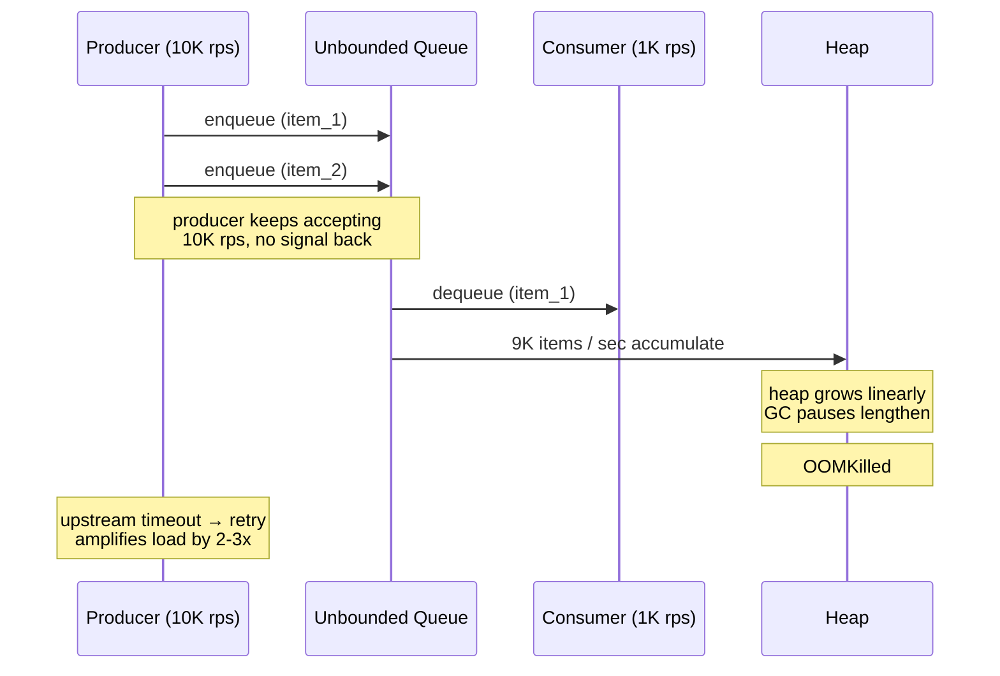
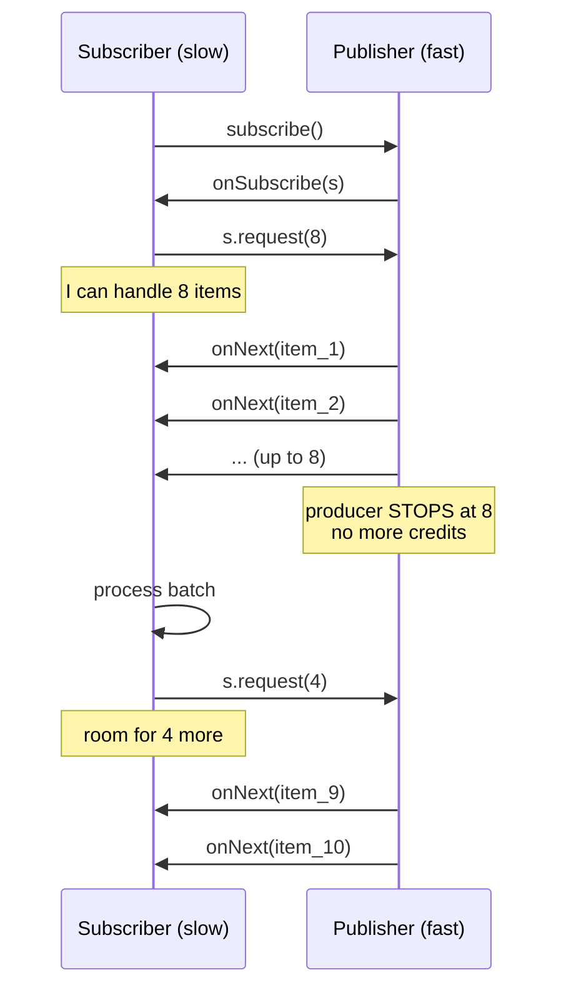
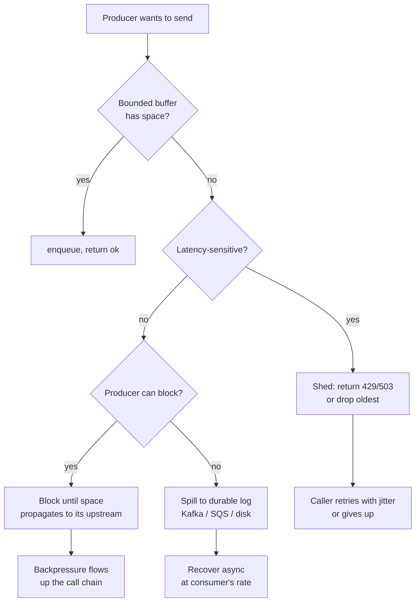

# Backpressure

## Why This Exists

**Problem.** Producers and consumers run at different rates. When the producer is faster, work piles up *somewhere* — in a queue, a socket buffer, a thread pool, a Kafka topic, the OS page cache. If that "somewhere" is unbounded, you have a **memory leak with extra steps**: latency grows linearly with queue depth, GC pauses lengthen, the OOM killer eventually arrives, and on the way down you get duplicate work from upstream retries that thought you were dead.

**Key insight.** Backpressure is not a feature you bolt on after load testing — it is the *absence* of an unbounded buffer. Every unbounded `queue.put()`, `channel <-`, `list.append`, `kafka.send()` without `max.in.flight`, or `fetch(...)` without a concurrency limit is a place where backpressure has been silently disabled. As Kevlin Henney puts it: **"Buffering is not flow control."** Or in Tony Hickson's phrasing from the Reactive Streams design discussions: *"Asynchronous boundaries without backpressure are just nicely-decorated denial of service."*

The fix is always the same shape: **the slow side must signal the fast side to slow down**, and the fast side must have a defined behavior when it cannot. The signal can be a return value (`false` from `offer`), a credit (HTTP/2 WINDOW_UPDATE), a blocking call (TCP `write()`), an explicit demand request (`Subscription.request(n)`), or a 429 status code. The defined behavior is one of: **block, drop, redirect, or fail fast**. Anything else — silently buffering, infinite retries, "we'll just add more memory" — is the anti-pattern.

**Reach for this when:**
- Designing any pipeline with an async boundary (queue, channel, broker, network hop).
- A service has cascading failure incidents where a slow downstream took out healthy upstream replicas.
- Queue depth metrics climb monotonically and never recover without a restart.
- You're seeing high latency *without* high CPU — a classic queueing-delay signature.
- Building a streaming system (Kafka consumer, Flink job, gRPC streaming RPC, Server-Sent Events).
- Choosing between synchronous and async APIs at a service boundary.

**Don't reach for this when:**
- The work is genuinely bursty but bounded — a fixed batch of 10K items finishing in seconds doesn't need a credit protocol; a bounded in-memory queue is enough.
- The consumer is *always* faster than the producer (e.g., a CDC stream into a warm cache). You still want a bounded buffer as a safety net, but elaborate flow control is overkill.
- Hard real-time deadlines where dropping is correct and signaling latency would itself violate the SLO. Use shedding directly.

---

## Diagrams

### The anti-pattern: unbounded buffer



### Credit-based flow control (Reactive Streams / gRPC)



### Decision flow when consumer is saturated



---

## Core Patterns

### 1. The bounded queue — the foundation

The simplest, most under-used pattern. Replace every `queue.Queue()` with `queue.Queue(maxsize=N)`. The choice of N is engineering: large enough to absorb microbursts, small enough that worst-case latency = `N / consumer_rate` is acceptable. Little's Law: **L = λW**. Pick two, the third follows.

```python
import queue
import threading
import time
from dataclasses import dataclass

# Bounded queue. maxsize chosen so worst-case wait = 100 / 50 rps = 2s.
WORK = queue.Queue(maxsize=100)

@dataclass
class Item:
    id: int
    payload: bytes

def producer(stop):
    i = 0
    while not stop.is_set():
        item = Item(i, b"x" * 1024)
        # offer() semantics — DO NOT use put() without timeout.
        # put() blocks forever and hides the backpressure signal in a thread stall.
        try:
            WORK.put(item, timeout=0.5)
        except queue.Full:
            # Explicit decision: shed. Emit metric so we *see* the backpressure.
            metrics.increment("producer.shed", tags={"queue": "work"})
            # Optionally: spill to durable store, slow down, or return 429 to caller.
        i += 1

def consumer(stop):
    while not stop.is_set():
        try:
            item = WORK.get(timeout=0.5)
        except queue.Empty:
            continue
        process(item)
        WORK.task_done()
```

**The lesson is in the comments.** `put()` without a timeout is a unbounded-buffer-in-disguise: it converts queue pressure into thread-stall pressure, which is harder to observe. Always use `put(timeout=...)` or `put_nowait()` and decide *explicitly* what happens on `Full`.

### 2. Reactive Streams — the credit protocol, formalized

Reactive Streams (https://www.reactive-streams.org/) is a JVM specification (now also TCK-tested in JS, .NET) defining four interfaces and a contract for non-blocking backpressure. The idea: subscribers tell publishers *exactly how many items they can handle right now* via `Subscription.request(n)`. The publisher MUST NOT emit more than the cumulative requested count.

```java
// Java Flow API (java.util.concurrent.Flow, JDK 9+, same shape as Reactive Streams)
import java.util.concurrent.Flow.*;
import java.util.concurrent.SubmissionPublisher;

public class CreditBasedExample {
    static class SlowSubscriber implements Subscriber<String> {
        private Subscription sub;
        private static final int BATCH = 8;
        private int remaining = 0;

        public void onSubscribe(Subscription s) {
            this.sub = s;
            this.remaining = BATCH;
            s.request(BATCH);            // initial credit
        }

        public void onNext(String item) {
            process(item);                // may take 50ms
            if (--remaining == 0) {
                remaining = BATCH;
                sub.request(BATCH);       // refill credits AFTER work is done
            }
        }

        public void onError(Throwable t) { log.error("upstream failed", t); }
        public void onComplete()          { log.info("done"); }

        private void process(String s) { /* ... */ }
    }

    public static void main(String[] args) throws Exception {
        // SubmissionPublisher buffers up to maxBufferCapacity; submit() blocks
        // (or returns lag) when buffer is full — backpressure all the way back.
        try (var pub = new SubmissionPublisher<String>(
                ForkJoinPool.commonPool(), /*maxBufferCapacity=*/ 256)) {
            pub.subscribe(new SlowSubscriber());
            for (int i = 0; i < 10_000; i++) {
                // submit() returns the estimated lag, or blocks if buffer full.
                // offer() with a drop handler is the alternative.
                pub.submit("item-" + i);
            }
        }
    }
}
```

The contract bears repeating: **the publisher MUST NOT emit more than the requested count**, and the subscriber MUST NOT call `request(n)` until it can actually process n items. Project Reactor, RxJava 3, Akka Streams, and Mutiny all implement this spec; switching libraries doesn't change the shape.

### 3. HTTP/2 and gRPC — credit-based flow control on the wire

HTTP/2 ships with credit-based flow control built into the protocol (RFC 7540 §5.2, retained in HTTP/3 / RFC 9114). Each stream and the whole connection have a flow-control window. Receivers send `WINDOW_UPDATE` frames to grant the sender more bytes. If the receiver stops sending updates, the sender stalls — backpressure on the wire, no application code required.

gRPC inherits this. For *unary* calls it rarely matters. For **server-streaming / client-streaming / bidi-streaming**, it is the entire reason you can stream gigabytes without buffering them. But — and this is the subtle part — the application has to actually *read* slowly to engage the protocol-level backpressure. If your gRPC handler is `for await (const msg of call) { queue.push(msg) }` into an unbounded queue, you've defeated it.

```go
// gRPC server-streaming in Go — backpressure works because we send synchronously.
func (s *server) Tail(req *pb.TailRequest, stream pb.LogService_TailServer) error {
    sub := s.broker.subscribe(req.Topic)
    defer sub.close()

    for {
        select {
        case <-stream.Context().Done():
            return stream.Context().Err()
        case ev := <-sub.events:
            // stream.Send blocks when the HTTP/2 flow-control window is exhausted.
            // This propagates the slow client all the way back to our broker subscription.
            // DO NOT spawn a goroutine per event — that re-introduces unbounded buffering.
            if err := stream.Send(ev); err != nil {
                return err
            }
        }
    }
}
```

```typescript
// gRPC-Web / Node.js client side — pull, don't push.
import { credentials } from "@grpc/grpc-js";

const client = new LogServiceClient("localhost:50051", credentials.createInsecure());
const call = client.tail({ topic: "orders" });

call.on("data", (msg) => {
  // If processMsg is slow and we keep accepting events, we leak.
  // pause()/resume() engages the flow-control window.
  call.pause();
  processMsg(msg).then(() => call.resume());
});

call.on("error", (err) => log.error(err));
call.on("end",   ()    => log.info("server closed"));
```

### 4. TCP — the original credit protocol

Before Reactive Streams existed, TCP had been doing this since 1981 (RFC 793, refined in RFC 9293). TCP's receive window (rwnd) is exactly a credit. Every ACK carries a window size; the sender must not transmit more than that. A blocking `write(2)` on a full send buffer is *the* canonical backpressure signal: the kernel telling your app "the network can't take any more, slow down." Most modern backpressure designs are TCP rediscovered at the application layer.

The corollary: **non-blocking sockets without an application-level credit scheme are a backpressure regression**. If you `epoll` and queue every event into an unbounded application queue, you've turned TCP's bounded receive window into your application's unbounded heap.

### 5. Kafka — backpressure via consumer pull and bounded producer

Kafka's design is famously **pull-based on the consumer side** — the consumer asks for `max.poll.records` and processes them; if it's slow, it polls less often and lag grows in the broker (which is durable and bounded by retention). The producer side is where teams most often disable backpressure by accident:

```properties
# WRONG — disables backpressure entirely.
# When the broker is slow or the in-flight buffer fills, the producer will buffer
# in memory until OOM. (buffer.memory defaults to 32MB, so it's bounded, but
# block.on.buffer.full=false means it throws — many apps catch and retry, defeating it.)
acks=1
max.block.ms=0
buffer.memory=33554432

# RIGHT — make the producer block (i.e., apply backpressure) when the broker can't keep up.
acks=all
max.block.ms=60000          # block up to 60s, then throw. Caller decides what to do.
buffer.memory=33554432
max.in.flight.requests.per.connection=5
enable.idempotence=true     # so the block-then-retry doesn't dup
linger.ms=10                # batch — improves throughput, reduces broker pressure
compression.type=lz4
```

The `max.block.ms` knob is the entire backpressure contract for a Kafka producer. Set it to a finite value, catch the `TimeoutException`, and *decide* what to do — shed, write to a dead-letter store, or fail the upstream request with 503. Setting it to `Long.MAX_VALUE` is the unbounded-buffer anti-pattern wearing a Kafka hat.

### 6. Load shedding — when there is no slower path

Sometimes you cannot block (latency budget too tight) and cannot spill (no durable store available, or the work is no longer valuable). You shed. AWS Builders' Library "Using load shedding to avoid overload" (https://aws.amazon.com/builders-library/using-load-shedding-to-avoid-overload/) is the definitive read here. Two essential ideas:

- **Shed before you saturate**, not after. A queue at 95% depth is *already* in trouble. Shed at 70-80%.
- **Shed the right thing.** Drop oldest (LIFO becomes effective FIFO under load — counterintuitive but correct: by the time you process a 30-second-old request, the client has already retried). Drop low-priority. Drop work whose deadline has expired.

```python
import time
from collections import deque

class DeadlinePropagatingQueue:
    """Drop work whose client-deadline has already passed.
    Saves the consumer from doing work no one will read.

    See: Cindy Sridharan — 'On the false illusion of fairness in queueing systems'.
    """
    def __init__(self, maxsize):
        self._q = deque(maxlen=maxsize)
        self._maxsize = maxsize

    def offer(self, item, deadline_ms):
        if len(self._q) >= self._maxsize:
            # Bounded by maxlen; deque drops oldest. Emit shed metric.
            metrics.increment("queue.shed.full")
            return False
        self._q.append((deadline_ms, item))
        return True

    def take(self):
        now = time.monotonic_ns() // 1_000_000
        while self._q:
            deadline, item = self._q.popleft()
            if deadline < now:
                # Caller has already given up. Don't waste capacity.
                metrics.increment("queue.shed.expired")
                continue
            return item
        return None
```

Pair this with **adaptive concurrency** (Netflix's concurrency-limits library, or AIMD à la TCP): measure observed latency, reduce in-flight cap when latency rises, increase when it stabilizes. This makes shedding a function of *current* system state, not a static threshold someone set six months ago.

### 7. Server-side: 429 / 503 with Retry-After

At the HTTP layer, the standard backpressure signal is `429 Too Many Requests` (RFC 6585) or `503 Service Unavailable` with a `Retry-After` header. The contract is: the *client* is responsible for honoring the signal. Real-world clients are not always well-behaved — assume retries will arrive anyway and protect yourself with an admission control layer (token bucket, leaky bucket, concurrency limiter) at the edge.

```python
# FastAPI example — token-bucket admission control with explicit Retry-After.
from fastapi import FastAPI, Request, HTTPException
from starlette.responses import Response
import asyncio, time

class TokenBucket:
    def __init__(self, rate_per_sec, burst):
        self.rate = rate_per_sec
        self.burst = burst
        self.tokens = burst
        self.last = time.monotonic()
        self.lock = asyncio.Lock()

    async def take(self):
        async with self.lock:
            now = time.monotonic()
            self.tokens = min(self.burst, self.tokens + (now - self.last) * self.rate)
            self.last = now
            if self.tokens >= 1:
                self.tokens -= 1
                return 0.0
            # Fractional seconds until 1 token regenerates.
            return (1 - self.tokens) / self.rate

bucket = TokenBucket(rate_per_sec=200, burst=400)
app = FastAPI()

@app.middleware("http")
async def shed(request: Request, call_next):
    wait = await bucket.take()
    if wait > 0:
        # Tell well-behaved clients exactly when to come back.
        # Add jitter at the *client*, not here, so we don't synchronize retries.
        return Response(
            status_code=429,
            headers={"Retry-After": f"{wait:.2f}"},
            content=b'{"error":"rate_limited"}',
        )
    return await call_next(request)
```

---

## Trade-offs

| Pattern | Benefit | Cost |
|---|---|---|
| **Bounded queue + block** | Simple, correct, propagates pressure upstream | Producer thread parks; can deadlock if cycle exists in graph |
| **Bounded queue + shed** | Bounded latency, no deadlock | Lost work — must be acceptable or recoverable upstream |
| **Credit-based (Reactive Streams)** | Precise per-subscriber pacing; works across async boundary | Complex to implement correctly; subtle bugs around `request(n)` cancellation |
| **HTTP/2 / gRPC flow control** | Free with the protocol; works on the wire | App must actually pull slowly; easy to defeat with internal unbounded queue |
| **Kafka pull + retention** | Producer fully decoupled; consumer lag is observable | Storage cost; lag can mask broken consumers for hours |
| **Load shedding (429)** | Bounded latency under any load; preserves headroom for healthy traffic | Requires honest clients (or edge enforcement); shed work is gone |
| **Adaptive concurrency (AIMD)** | Auto-tunes to current capacity; survives downstream degradation | Slow to react to step-change load; can oscillate |
| **Spill to durable log** | Absorbs huge bursts; consumer recovers async | Adds storage + a second processing path; ordering / dedup concerns |
| **Drop oldest** | Fresh data wins; matches user behavior (they retried) | Surprising for batch / "must process every event" semantics |
| **Drop newest (tail-drop)** | Trivial; preserves in-flight work | Stale data wins; bad for live dashboards / metrics |

---

## Common Pitfalls

- **`queue.put()` with no timeout.** Looks like blocking flow control. Actually masks the backpressure signal as a stuck thread, which your dashboards probably don't alarm on. Always set a timeout and handle `Full` explicitly.
- **Unbounded `Channel(Channel.UNLIMITED)` / `make(chan T)` with no buffer cap.** Same anti-pattern, different language. Go's unbuffered channels actually *are* backpressuring (sender blocks); buffered channels with large capacity often are not.
- **`async`/`await` without a semaphore.** Spawning N coroutines for N requests with `asyncio.gather` will happily open N database connections. Wrap with `asyncio.Semaphore(concurrency_limit)` or use a worker-pool pattern.
- **Buffering "to handle bursts" without bounding.** Bursts are bounded by the upstream's own rate-limit; if you don't know that rate, your buffer is unbounded by definition. Calculate `max_burst = upstream_rate_limit × burst_window`; size accordingly.
- **Retries without backpressure-awareness.** A client retrying on timeout while the server is overloaded *amplifies* load — the classic retry storm. Use deadline propagation, exponential backoff with jitter, and circuit breakers (see `../../reliability/circuit-breaker/`).
- **Log shipping defeating itself.** A logger that buffers to disk when the log-aggregator is slow → disk fills → application crashes. Either bound the buffer and shed (drop logs), or block the application (acceptable for some). Don't let the observability pipeline kill the system being observed.
- **gRPC server reading messages into a goroutine pool.** This converts protocol-level flow control into application-level unbounded buffering. The `recv` loop must do the work, or hand to a *bounded* worker pool.
- **Consumer parallelism > broker partition count.** No backpressure benefit; extra consumers idle. Worse: they hold connections / resources for no throughput gain.
- **Ignoring the slow consumer in pub/sub.** A slow subscriber can either hold up all subscribers (head-of-line blocking) or be silently dropped (Redis pub/sub). Decide which, and document it.
- **Treating a TCP `write()` blocking as a bug.** It's not — it's the OS doing the right thing. Wrapping it in `setNonBlocking + queue.append` *introduces* the bug.
- **Auto-scaling instead of backpressure.** Horizontal autoscaling is too slow (minutes) to respond to second-scale load spikes, and downstream dependencies (databases) often can't scale at all. Backpressure works in milliseconds; use both.
- **The "we'll just add memory" school.** Vertical scaling does not eliminate the unbounded-buffer anti-pattern; it only delays the OOM. The latency degradation hits long before memory runs out.

---

## Decision Table

| Situation | Use this | Not this | Why |
|---|---|---|---|
| In-process producer/consumer, both yours | Bounded `queue.Queue(maxsize=N)` with timeout | Unbounded queue / list | Simplest correct primitive; visible signal |
| Async pipeline within one JVM/Node process | Reactive Streams (Reactor / RxJS) | Custom buffer + thread pool | Spec-defined cancellation, error propagation, request semantics |
| Service-to-service streaming | gRPC bidi streaming with synchronous Send | WebSocket + JSON over your own buffer | HTTP/2 flow control is free and tested |
| Cross-team, durable boundary | Kafka with bounded `max.block.ms` | Synchronous HTTP RPC | Decouples lifecycles; absorbs deploys / restarts |
| Edge / public API under DDoS-shaped load | Token bucket + 429 with Retry-After | Try to scale to absorb it | Adversarial load is not bounded by application logic |
| Internal RPC mesh, latency-critical | Adaptive concurrency limiter (AIMD) | Static thread pool size | Capacity changes with downstream health |
| Bursty input, variable consumer rate | Spill to durable log + bounded in-memory queue | Larger in-memory queue | Memory is not the right buffer for hour-scale bursts |
| Real-time telemetry / metrics | Drop-newest or sample | Block the producer | Producer is the system being observed; blocking it is worse than dropping |
| Bank transfer / payment processing | Block + retry, never drop | Drop on full queue | Correctness > latency; durable spill required |
| UI event stream (mouse moves) | Drop / debounce / coalesce | Buffer all events | User cares about *latest* state, not history |

---

## References

- Roland Kuhn et al. — *Reactive Streams Specification 1.0.4* — https://www.reactive-streams.org/
- IETF — *RFC 9113: HTTP/2* (flow control §5.2) — https://datatracker.ietf.org/doc/html/rfc9113
- IETF — *RFC 9293: Transmission Control Protocol* (window management) — https://datatracker.ietf.org/doc/html/rfc9293
- IETF — *RFC 6585: Additional HTTP Status Codes* (429 Too Many Requests) — https://datatracker.ietf.org/doc/html/rfc6585
- gRPC — *Flow Control* — https://grpc.io/docs/what-is-grpc/core-concepts/#flow-control
- Apache Kafka — *Producer Configs* (`max.block.ms`, `buffer.memory`) — https://kafka.apache.org/documentation/#producerconfigs
- AWS Builders' Library — Marc Brooker, *Using Load Shedding to Avoid Overload* — https://aws.amazon.com/builders-library/using-load-shedding-to-avoid-overload/
- AWS Builders' Library — David Yanacek, *Timeouts, Retries, and Backoff with Jitter* — https://aws.amazon.com/builders-library/timeouts-retries-and-backoff-with-jitter/
- Google SRE Book — *Handling Overload* (ch. 21) — https://sre.google/sre-book/handling-overload/
- Google SRE Book — *Addressing Cascading Failures* (ch. 22) — https://sre.google/sre-book/addressing-cascading-failures/
- Google SRE Workbook — *Managing Load* (ch. 11) — https://sre.google/workbook/managing-load/
- Martin Kleppmann — *Designing Data-Intensive Applications*, ch. 11 (*Stream Processing*, "Backpressure" sub-section) — O'Reilly, 2017
- Netflix Tech Blog — Eran Landau, *Performance Under Load* (concurrency-limits / AIMD) — https://netflixtechblog.medium.com/performance-under-load-3e6fa9a60581
- Netflix — *concurrency-limits* (Java) — https://github.com/Netflix/concurrency-limits
- Kevlin Henney — *Programming with GUTs / Cargo Cult Software Engineering* talks (recurring "buffering is not flow control" theme) — https://www.youtube.com/results?search_query=kevlin+henney+backpressure
- Tony Hickson, Roland Kuhn, Viktor Klang et al. — *Reactive Streams* mailing-list archive (rationale for credit-based design) — https://groups.google.com/g/reactive-streams-io
- Cindy Sridharan — *Reliable, Scalable, Maintainable* notes on backpressure & queueing — https://copyconstruct.medium.com/
- Adrian Colyer (the morning paper) — *Adaptive concurrency control* paper summary — https://blog.acolyer.org/
- Pat Helland — *Idempotence Is Not a Medical Condition* (relevance to retries that don't dup under backpressure) — https://queue.acm.org/detail.cfm?id=2187821
- Lightbend / Akka — *Streams: Backpressure Explained* — https://doc.akka.io/docs/akka/current/stream/stream-flows-and-basics.html#back-pressure-explained

---

## See Also

- `../message-queues/` — durable queues as the spillover destination when in-memory backpressure isn't enough
- `../pub-sub/` — fan-out semantics where slow-subscriber policy is the backpressure decision
- `../../data-systems/stream-processing/` — Kafka, Pulsar, Kinesis-shaped systems where backpressure is built into the consumer-pull model
- `../grpc/` — wire-level flow control details and streaming RPC patterns
- `../../reliability/circuit-breaker/` — the complementary pattern: stop *calling* a saturated downstream entirely
- `../../reliability/load-shedding/` — admission control and shedding policy in depth
- `../../reliability/timeouts/` — deadline propagation as input to "should I bother processing this?"
- `../../performance/use-red-methods/` — measuring queue depth, saturation, and lag so backpressure is visible
