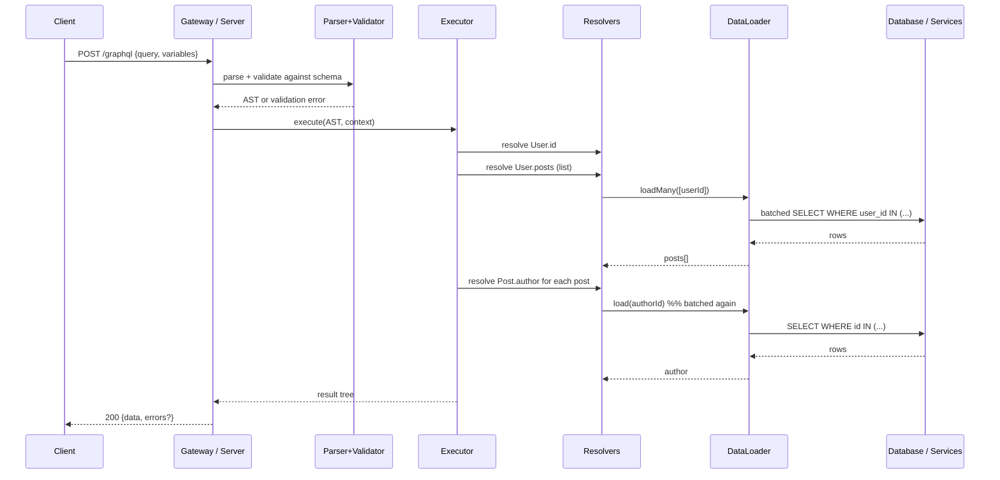
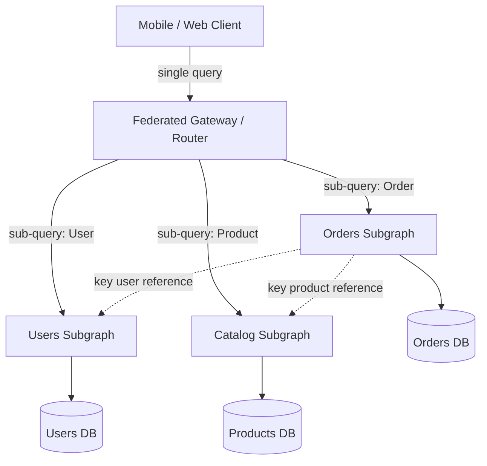
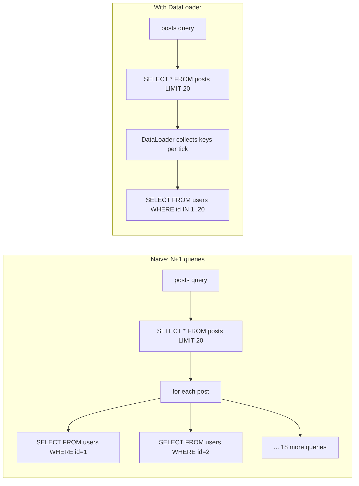

# GraphQL

## Why This Exists

**Problem.** REST APIs optimize for resources, not screens. A mobile home screen needs `user.name`, `user.avatar`, `user.unreadCount`, the top 3 `user.friends.recentPosts.title`, and one `featured.banner`. With REST that's 5 round-trips, 4× over-fetching, and a versioning nightmare as each client diverges. Backend teams ship `/v2/users-with-friends-and-posts-for-mobile-home` and the API surface metastasizes.

**Key insight.** Let the **client describe the shape it wants**; let the server expose a **typed graph** of fields with resolvers. Decouple the wire format from the storage layout. This trades a flat HTTP cache (free CDN wins) for fewer round-trips, no client-driven versioning, and one schema across all consumers. The trade is real and frequently misunderstood — GraphQL is **not** a free lunch over REST.

**Reach for this when:**
- **Many clients with divergent needs** — iOS, Android, web, partner SDKs all hit the same backend and want different fields.
- **Mobile networks** — round-trips dominate latency; one fat query beats six skinny ones.
- **Schema-first product teams** — frontend can mock against the schema while backend builds resolvers.
- **Aggregation across services** — GraphQL gateway / federation can stitch a unified graph from microservices.
- **Rapidly evolving product surface** — adding a field is non-breaking; deprecating is gradual via `@deprecated`.

**Don't reach for this when:**
- **Service-to-service RPC at high throughput** — use gRPC/Protobuf. GraphQL parsing, validation, and resolver dispatch overhead is wasted when both sides are machines under your control.
- **CDN/HTTP caching is the win** — public REST + ETags + `Cache-Control` is hard to beat for read-heavy public APIs (think GitHub's REST API for repo metadata).
- **Tiny one-client API** — schema, codegen, and tooling overhead exceeds the savings. Just build REST.
- **File uploads / streaming binary** — possible via multipart spec, but awkward; use signed S3 URLs + REST.
- **Strict bandwidth-constrained payloads** — GraphQL responses are JSON; gRPC + Protobuf is 5–10× smaller.

## Diagrams

### Query lifecycle



### Federation topology



### N+1 vs DataLoader



## Schema Design

GraphQL schemas are **typed contracts**. Design them like API contracts, not like database tables.

```graphql
# schema.graphql — the canonical artifact. Generate code FROM this.

scalar DateTime
scalar URL

type Query {
  "Get a user by ID. Returns null if not found (do not throw)."
  user(id: ID!): User
  "Cursor-paginated feed. Use cursors, not offsets — see Common Pitfalls."
  feed(first: Int = 20, after: String): PostConnection!
  me: User  # implicit auth context
}

type Mutation {
  createPost(input: CreatePostInput!): CreatePostPayload!
  deletePost(id: ID!): DeletePostPayload!
}

type Subscription {
  postAdded(channelId: ID!): Post!
}

# Relay-style connection — supports forward pagination and metadata.
type PostConnection {
  edges: [PostEdge!]!
  pageInfo: PageInfo!
  totalCount: Int  # nullable: counting can be expensive
}
type PostEdge {
  node: Post!
  cursor: String!
}
type PageInfo {
  hasNextPage: Boolean!
  endCursor: String
}

type User {
  id: ID!
  handle: String!
  displayName: String!
  avatarUrl: URL
  posts(first: Int = 10, after: String): PostConnection!
  createdAt: DateTime!
}

type Post {
  id: ID!
  author: User!          # ! means non-null. Resolver MUST return a User.
  title: String!
  body: String!
  publishedAt: DateTime
}

# Inputs are separate types — never reuse output types as inputs.
input CreatePostInput {
  title: String!
  body: String!
  channelId: ID!
}

# Mutations return a payload type — leaves room to add fields without breaking.
type CreatePostPayload {
  post: Post
  userErrors: [UserError!]!  # business errors, NOT GraphQL errors
}

type UserError {
  field: [String!]    # path into input that failed
  message: String!
  code: ErrorCode!
}

enum ErrorCode {
  TITLE_TOO_LONG
  CHANNEL_NOT_FOUND
  RATE_LIMITED
}
```

**Schema design rules** (these are what differentiate junior from senior GraphQL):

- **Nullable by default; non-null (`!`) when you can guarantee it.** A non-null field that throws bubbles the error up the tree and nulls out the parent — losing data the client could have rendered. See "Errors" below.
- **Mutations return payload types, not the bare entity.** `CreatePostPayload` lets you add `userErrors`, `clientMutationId`, future side-effects without breaking clients.
- **Separate input types from output types.** Don't reuse `User` as `UserInput`. They evolve differently.
- **Use Relay-style cursor connections for lists.** Offset pagination breaks under concurrent inserts and is a perf landmine on large tables.
- **Two error channels: GraphQL errors (transport) and `userErrors` (business).** "Title too long" is not an error — it's a result. Reserve `errors[]` for parse failures, auth failures, network failures.
- **Don't expose your DB schema 1:1.** The graph should reflect the domain, not the storage. Resolvers are the seam.

## Resolvers (TypeScript / Apollo Server)

```typescript
// resolvers.ts
import DataLoader from 'dataloader';
import type { Pool } from 'pg';

// Context is built per-request. Loaders MUST be per-request — never global —
// or cache poisoning across users will leak data.
export interface Ctx {
  db: Pool;
  userId: string | null;
  loaders: {
    userById: DataLoader<string, User | null>;
    postsByAuthorId: DataLoader<string, Post[]>;
  };
}

export function makeContext(db: Pool, userId: string | null): Ctx {
  return {
    db,
    userId,
    loaders: {
      userById: new DataLoader(async (ids: readonly string[]) => {
        // Single batched query for all user IDs requested in this tick.
        const { rows } = await db.query(
          'SELECT id, handle, display_name, avatar_url, created_at FROM users WHERE id = ANY($1)',
          [ids],
        );
        const byId = new Map(rows.map(r => [r.id, mapUser(r)]));
        // CRITICAL: return results in the SAME ORDER as the keys requested,
        // with null for misses. DataLoader contract demands this.
        return ids.map(id => byId.get(id) ?? null);
      }),
      postsByAuthorId: new DataLoader(async (authorIds: readonly string[]) => {
        const { rows } = await db.query(
          'SELECT id, author_id, title, body, published_at FROM posts WHERE author_id = ANY($1) ORDER BY published_at DESC',
          [authorIds],
        );
        // Group rows by author. DataLoader expects one result per key.
        const byAuthor = new Map<string, Post[]>(authorIds.map(id => [id, []]));
        for (const r of rows) byAuthor.get(r.author_id)!.push(mapPost(r));
        return authorIds.map(id => byAuthor.get(id) ?? []);
      }),
    },
  };
}

export const resolvers = {
  Query: {
    user: (_: unknown, { id }: { id: string }, ctx: Ctx) =>
      ctx.loaders.userById.load(id),
    me: (_: unknown, __: unknown, ctx: Ctx) =>
      ctx.userId ? ctx.loaders.userById.load(ctx.userId) : null,
    feed: async (_: unknown, args: FeedArgs, ctx: Ctx) => {
      // Cursor pagination — cursor is opaque base64(timestamp:id) so clients
      // can't reverse-engineer offsets and we can change the implementation.
      const limit = Math.min(args.first ?? 20, 100); // cap to prevent abuse
      const after = args.after ? decodeCursor(args.after) : null;
      const rows = await fetchFeedPage(ctx.db, limit + 1, after);
      const hasNextPage = rows.length > limit;
      const page = rows.slice(0, limit);
      return {
        edges: page.map(p => ({ node: p, cursor: encodeCursor(p) })),
        pageInfo: {
          hasNextPage,
          endCursor: page.length ? encodeCursor(page[page.length - 1]) : null,
        },
      };
    },
  },

  // Field resolvers — invoked once per parent. WITHOUT DataLoader, Post.author
  // would issue one query per post. WITH it, all author IDs are batched into
  // a single SELECT ... WHERE id IN (...).
  Post: {
    author: (post: Post, _: unknown, ctx: Ctx) =>
      ctx.loaders.userById.load(post.authorId),
  },

  User: {
    posts: async (user: User, args: PostArgs, ctx: Ctx) => {
      // For one-to-many we use a different loader keyed by author id.
      const all = await ctx.loaders.postsByAuthorId.load(user.id);
      return paginate(all, args);
    },
  },

  Mutation: {
    createPost: async (_: unknown, { input }: { input: CreatePostInput }, ctx: Ctx) => {
      if (!ctx.userId) {
        // GraphQL transport error — surfaced in `errors[]`.
        throw new GraphQLError('Not authenticated', { extensions: { code: 'UNAUTHENTICATED' } });
      }
      // Business validation → userErrors, not thrown errors.
      const userErrors: UserError[] = [];
      if (input.title.length > 200) {
        userErrors.push({ field: ['title'], message: 'Title too long', code: 'TITLE_TOO_LONG' });
      }
      if (userErrors.length) return { post: null, userErrors };

      const post = await insertPost(ctx.db, ctx.userId, input);
      return { post, userErrors: [] };
    },
  },
};
```

**Why DataLoader works.** It exploits the JavaScript event loop: calls to `.load(key)` within the same tick are coalesced into a single batch fn invocation. The contract is unforgiving — return results in the same order as keys, one per key, or you'll silently corrupt responses across requests.

## The N+1 Problem (in detail)

This is the **single biggest operational footgun in GraphQL**. A query like:

```graphql
query { feed(first: 20) { edges { node { author { handle } } } } }
```

Naively executes:
1. `SELECT * FROM posts ORDER BY published_at DESC LIMIT 20` (1 query)
2. For each of 20 posts: `SELECT * FROM users WHERE id = $authorId` (20 queries)

**21 queries for one HTTP request.** Now imagine `author { posts(first: 5) { author { ... } } }` — the cardinality multiplies. Production databases die from this.

**Fixes, in order of preference:**

1. **DataLoader / per-request batching** — converts N+1 into N+1-batched-into-1. Default for any GraphQL service.
2. **Eager-loading at the root resolver** — for known shapes, `JOIN` the data up front. Tools like `join-monster`, `Prisma`, or `Hasura` parse the GraphQL AST and generate a single SQL query. Powerful but opaque; debugging the generated SQL is a skill in itself.
3. **Look-ahead / projection** — inspect `info.fieldNodes` to see what the client asked for, then fetch only those columns/relations.
4. **Server-side query cost analysis + rejection** — block expensive queries at validation time (see "Persisted Queries" and `graphql-cost-analysis`).

**The DataLoader caveat:** it caches within one request only. Across requests there is no built-in cache. For cross-request caching you need Redis or a CDN — both of which have their own pitfalls (see "Caching is hard").

## Caching is Hard (the dirty secret)

REST gets HTTP caching for free: `GET /users/42` with `Cache-Control: max-age=60` and `ETag`. CloudFront, Varnish, browser cache, all work. **GraphQL gets none of this** out of the box because:

- Every query is `POST /graphql` with a body. CDNs key on URL, not body.
- Every response shape is unique to the client query. No two queries return the same JSON.
- A single response mixes data from many entities with different cacheability.

**Workarounds, with honest trade-offs:**

| Strategy | How it works | Cost |
|---|---|---|
| **Persisted queries** | Client sends a query hash; server looks up the registered query. Now you can `GET /graphql?id=abc123&vars=...` and CDN-cache it. | Requires build-time query registration; non-trivial tooling. |
| **APQ (Automatic Persisted Queries)** | First request sends the full query + hash; server caches it. Subsequent clients send only the hash. | Cold cache miss + retry; doesn't help CDN unless combined with GET. |
| **Apollo Client cache** | Normalized cache keyed by `__typename:id`. Subsequent queries hit local cache. | Client-side only — doesn't reduce server load. |
| **Response cache (server-side)** | Hash query + variables → cache JSON in Redis. | Hard to invalidate; per-user data leaks if you're not careful. Tag-based invalidation (Apollo Server response cache plugin) helps. |
| **Field-level / per-resolver cache** | Cache resolver outputs by entity ID. | Fine-grained, but only useful for hot fields. |
| **CDN with persisted queries + GET** | The honest answer for public read-heavy GraphQL. | Requires GET support, query registry, signed URLs for auth-scoped data. |

**War story.** A team migrated a high-traffic product page from REST + CDN to GraphQL and saw origin load 30× because their CDN hit-rate dropped from 95% to 0%. They rolled back, then re-rolled-out with persisted queries + GET — six months of work. **Plan for caching before you ship.**

## Persisted Queries

Persisted queries solve four problems at once: caching, security, payload size, and observability.

```typescript
// Build-time: extract all queries from your client app and write a manifest.
// graphql-codegen, relay-compiler, or apollo-tooling do this.
//
// manifest.json:
// {
//   "abc123...": "query Feed($first: Int!, $after: String) { feed(first: $first, after: $after) { ... } }",
//   "def456...": "query User($id: ID!) { user(id: $id) { ... } }"
// }

// Server-side enforcement:
const manifest: Map<string, string> = loadManifest('./manifest.json');

app.use('/graphql', (req, res, next) => {
  const { id, query, variables } = req.body;
  if (process.env.NODE_ENV === 'production' && !id) {
    return res.status(400).json({ error: 'Persisted queries required' });
  }
  if (id) {
    const persisted = manifest.get(id);
    if (!persisted) return res.status(400).json({ error: 'Unknown query id' });
    req.body.query = persisted;
  }
  next();
});
```

**Wins:**
- **Smaller requests** — clients send a 64-char hash, not 4KB of GraphQL.
- **Query allowlist** — attackers can't probe your schema with arbitrary deep queries.
- **CDN-cacheable** — `GET /graphql?id=abc&vars={...}` is just a URL.
- **Static analysis** — you know every query that will ever run; you can audit cost, plan indices.

**Costs:**
- Tooling burden — codegen pipeline, manifest distribution, version skew between client and server deploys.
- Ad-hoc tooling (GraphiQL, Insomnia) needs a dev mode that bypasses the allowlist.

## Federation, Mesh, Hasura

Once you have multiple teams owning different domains, you don't want one monolithic GraphQL server. Three patterns dominate:

### Apollo Federation (subgraph composition)

```graphql
# users-subgraph
type User @key(fields: "id") {
  id: ID!
  handle: String!
  displayName: String!
}

# orders-subgraph
extend type User @key(fields: "id") {
  id: ID! @external
  orders: [Order!]!  # this team owns User.orders
}
type Order @key(fields: "id") {
  id: ID!
  userId: ID!
  total: Money!
}
```

The **router** composes a single supergraph schema, plans queries across subgraphs, and resolves `@key` references via entity-resolution (`_entities` queries). Teams ship subgraphs independently, each owning fields on shared types.

**When this works well.** Many teams, clear domain ownership, schema review process to prevent shape conflicts.

**When this hurts.** Cross-subgraph N+1 — a query touching User + Order + Product fans out as three subgraph round-trips per page; without query plan caching the router becomes the bottleneck. **Cascading failures** are real: subgraph A goes down, the router 500s for any query touching A even if the client only wanted B. Mitigate with `@requires` discipline, partial responses, and circuit breakers per subgraph.

### GraphQL Mesh

Wraps existing REST/gRPC/SOAP/OpenAPI sources and presents them as a unified GraphQL schema. Useful for **incremental migration** when you have a legacy API zoo and don't want to rewrite everything. Cost: you inherit the underlying APIs' inefficiencies and can't optimize at the data layer.

### Hasura / PostGraphile (auto-generated from DB)

Reads your Postgres schema, generates a GraphQL API with row-level permissions and auto-generated resolvers that produce optimal SQL (single query for nested selections, no N+1).

**When this works.** Internal tools, admin panels, MVPs, CRUD-heavy apps where the DB schema *is* the API.

**When it hurts.** Public APIs where you want the GraphQL schema to abstract storage. Once you start adding business logic via Postgres functions, you've reinvented stored procedures and your data team will not thank you.

## Subscriptions

GraphQL subscriptions are real-time push, typically over WebSocket (`graphql-ws` protocol) or SSE.

```typescript
// subscription resolver — uses an event bus (Redis Pub/Sub, Kafka, NATS)
import { PubSub } from 'graphql-subscriptions';
const pubsub = new PubSub();

const resolvers = {
  Subscription: {
    postAdded: {
      subscribe: (_: unknown, { channelId }: { channelId: string }) =>
        pubsub.asyncIterator(`POST_ADDED:${channelId}`),
    },
  },
  Mutation: {
    createPost: async (_, { input }, ctx) => {
      const post = await insertPost(ctx.db, ctx.userId, input);
      // Fan out to subscribers
      await pubsub.publish(`POST_ADDED:${input.channelId}`, { postAdded: post });
      return { post, userErrors: [] };
    },
  },
};
```

**Realities:**
- WebSocket connections are stateful; horizontal scaling needs a shared pub/sub bus (Redis isn't enough at scale — see Kafka / NATS).
- Subscriptions don't get free DataLoader batching; each fired event resolves independently.
- Authentication must be checked on subscribe AND on every emit (permissions can change).
- **Often, you don't need subscriptions.** Long-poll or SSE is simpler. Use subscriptions only for genuinely real-time UX (chat, live cursors, trading).

## Security & Cost Control

A naked GraphQL endpoint is a DoS vector. Mitigations every production server needs:

```typescript
import depthLimit from 'graphql-depth-limit';
import costAnalysis from 'graphql-cost-analysis';

const server = new ApolloServer({
  schema,
  validationRules: [
    depthLimit(10),                       // reject queries deeper than 10
    costAnalysis({ maximumCost: 1000 }),  // reject expensive queries
  ],
  // Disable introspection in production unless you're explicitly public
  introspection: process.env.NODE_ENV !== 'production',
});
```

- **Depth limiting** — block `user { posts { author { posts { author { ... } } } } }` recursion attacks.
- **Cost analysis** — annotate fields with cost; reject queries above a threshold.
- **Pagination caps** — never trust client `first: N` arguments; cap server-side.
- **Persisted queries** in production — the strongest defense.
- **Disable introspection** unless your API is intentionally public.
- **Rate limit by query complexity, not request count** — one expensive query >> 100 cheap ones.
- **Auth at the resolver/field level** — middleware can't enforce field-level perms; use `graphql-shield` or hand-rolled directives.

## Trade-offs

| Benefit | Cost |
|---|---|
| Clients fetch exactly the fields they need (no over-fetching) | Server pays parse + validate + plan cost on every request |
| One endpoint, many clients, no v2/v3 endpoint sprawl | Schema becomes a contract you can't easily break — deprecation is forever |
| Strong typing end-to-end via codegen | Build pipeline complexity (schema → types → client SDK) |
| Easy to add fields without breaking clients | Easy to add fields without realizing they fan out 5 N+1s |
| Single round-trip for complex screens | Single huge request blocks on the slowest field |
| Federation enables team autonomy | Federation router becomes a critical path for everything |
| Subscriptions / real-time built into the spec | WebSocket scaling is non-trivial; often overkill |
| Self-documenting via introspection | Introspection is also a security surface in production |
| Strong client tooling (Apollo, Relay, urql) | Client cache normalization has its own footguns (cache eviction, stale data) |

## Common Pitfalls

- **N+1 with no DataLoader.** Ship to prod, watch the DB CPU pin to 100%, page on-call. Always wire DataLoader from day one even if you only have one resolver.
- **Global DataLoader instead of per-request.** Cache poisoning: user A's loader returns user B's data because the loader was singleton. Per-request, always.
- **Non-null fields that throw.** `User.posts: [Post!]!` — a null in the array bubbles up the entire query result. One bad post → empty feed. Make it `[Post!]` or `[Post]` and let the client handle nulls.
- **Offset pagination on big tables.** `OFFSET 100000` gets slower the deeper you page. Use cursors keyed on indexed columns.
- **Returning `Int!` for IDs that can exceed 2^53.** GraphQL `Int` is 32-bit signed. Use `ID` (string) or a custom `BigInt` scalar.
- **No depth/cost limit, public endpoint.** Attacker sends a 50-deep recursive query, server explodes.
- **Subscription auth bypass.** Auth checked at WebSocket connect, never re-checked on emit. User logs out, still receives messages.
- **Mutating queries via `Query` instead of `Mutation`.** `Query` fields can be parallelized; `Mutation` runs serially. Putting writes in queries causes lost updates.
- **Errors in `errors[]` for business logic.** Client sees `errors: [{message: "Title too long"}]` and shows a stack-trace banner. Use `userErrors`.
- **CDN caching `POST /graphql` and serving the wrong user's data.** Public GraphQL caching requires persisted queries + GET + careful auth header handling.
- **Federation with cross-subgraph cycles.** Subgraph A `@key`s into B which `@requires` from A which... query plan blows up. Keep subgraphs acyclic.
- **Schema as ORM.** Auto-generating GraphQL from your DB exposes every column. Now you're stuck with `created_at` named lowercase forever, and a schema migration breaks every client.
- **Forgetting that GraphQL responses are always 200.** A query with `errors[]` still returns HTTP 200. Monitoring on HTTP status alone misses everything.
- **Ignoring observability.** APM tools that group by URL see all GraphQL traffic as one endpoint. Use operation name + persisted query ID for traces. Apollo Studio, Hive, or OpenTelemetry instrumentation are not optional.

## Decision Table

| Situation | Use | Why |
|---|---|---|
| Mobile app + web app + partner SDK against same backend | **GraphQL** | One schema, varied response shapes, no per-client endpoints |
| Public read-heavy API, CDN-friendly, simple resources | **REST + ETags** | Free HTTP caching wins; GraphQL caching is a tax |
| Service-to-service in a microservice mesh, high QPS | **gRPC** | Smaller payloads, codegen, streaming, no GraphQL overhead |
| Internal admin UI / data exploration over Postgres | **Hasura / PostGraphile** | Auto-generated, RLS-backed, no resolver code |
| Federated org, many teams, shared graph | **Apollo Federation** | Subgraph autonomy + unified API |
| Wrapping legacy REST/SOAP for unified clients | **GraphQL Mesh** | Incremental migration without rewrites |
| Real-time chat, live cursors | **GraphQL subscriptions** OR plain WebSocket | Subs if you're already in GraphQL; raw WS if simpler |
| File upload heavy | **REST + signed S3 URLs** | GraphQL multipart is awkward; pre-signed URLs are battle-tested |
| Tiny one-client API, no roadmap of clients | **REST** | GraphQL tooling overhead exceeds the win |
| You need HTTP caching AND GraphQL | **Persisted queries + GET + CDN** | Only path to CDN-cacheable GraphQL |
| Query cost is unbounded / exposed to internet | **Persisted query allowlist** | Block ad-hoc queries; only ship registered ones |

## References

- Lee Byron et al. — *GraphQL Specification* — https://spec.graphql.org/
- Lee Byron — *GraphQL: A data query language* (Facebook engineering, 2015) — https://engineering.fb.com/2015/09/14/core-infra/graphql-a-data-query-language/
- Apollo — *Apollo Federation Specification* — https://www.apollographql.com/docs/federation/
- Apollo — *Server caching and persisted queries* — https://www.apollographql.com/docs/apollo-server/performance/cache-backends/
- Facebook — *DataLoader (batching & caching layer)* — https://github.com/graphql/dataloader
- Relay — *Cursor Connections Specification* — https://relay.dev/graphql/connections.htm
- Hasura — *Architecture & query compilation* — https://hasura.io/docs/latest/getting-started/overview/
- The GraphQL Foundation — *Best practices* — https://graphql.org/learn/best-practices/
- Marc-André Giroux — *Production Ready GraphQL* (book, self-published) — https://book.productionreadygraphql.com/
- Principled GraphQL — *Apollo's set of design principles* — https://principledgraphql.com/
- OWASP — *GraphQL Cheat Sheet* — https://cheatsheetseries.owasp.org/cheatsheets/GraphQL_Cheat_Sheet.html
- Martin Kleppmann — *Designing Data-Intensive Applications* (DDIA), ch. 2 "Data Models and Query Languages" and ch. 4 "Encoding and Evolution" — schema evolution, RPC vs query languages
- Google SRE — *Site Reliability Engineering*, ch. 22 "Addressing Cascading Failures" — https://sre.google/sre-book/addressing-cascading-failures/ — directly relevant to federated graph fan-out failures
- AWS Builders' Library — *Caching challenges and strategies* — https://aws.amazon.com/builders-library/caching-challenges-and-strategies/
- Sasha Solomon (Twitter) — *Migrating from REST to GraphQL at Twitter* — talks: https://www.youtube.com/results?search_query=sasha+solomon+graphql+twitter
- The Guild — *Persisted Operations and security* — https://the-guild.dev/graphql/yoga-server/docs/features/persisted-operations

## See Also

- `../rest/` — REST API design, when caching and resource-orientation win
- `../grpc/` — gRPC for service-to-service RPC; the right call for internal high-QPS APIs
- `../websockets/` — raw WebSocket patterns; alternative to subscriptions
- `../api-versioning/` — schema evolution, deprecation strategies (GraphQL never versions URLs but still has breaking changes)
- `../../data-systems/key-value/` — server-side response caching for GraphQL
- `../../performance/tracing/` — tracing GraphQL operations across federated subgraphs
