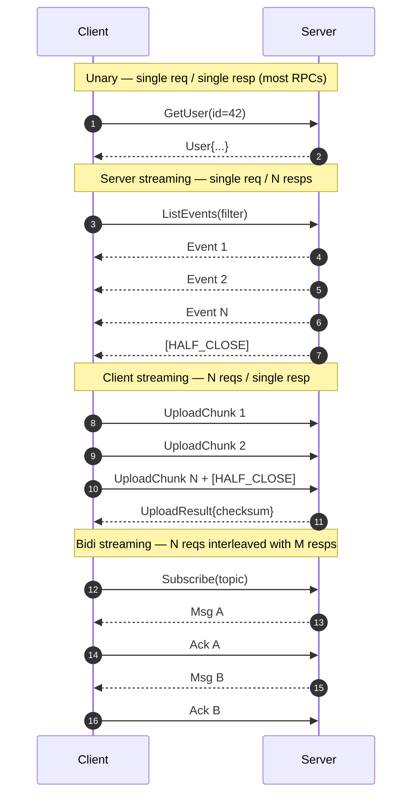
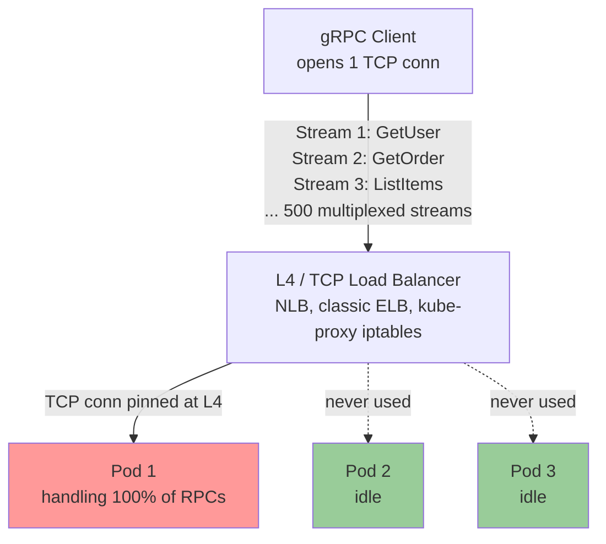

# gRPC

## Why This Exists

**Problem.** REST/JSON over HTTP/1.1 has three taxes that hurt at scale: (1) text encoding burns CPU and bandwidth, (2) head-of-line blocking on a single TCP connection serializes requests, (3) contracts live in tribal knowledge or hand-maintained OpenAPI that drifts. For internal service-to-service traffic — where both sides are owned by the same org, polyglot is common, and latency budgets are tight — these costs compound.

**Key insight.** gRPC is **HTTP/2 + Protobuf + a code generator**. HTTP/2 gives you binary framing, header compression (HPACK), and **multiplexed streams over one TCP connection**. Protobuf gives you a versioned schema, compact wire format, and forward/backward compatibility rules. The codegen turns `.proto` files into typed clients/servers in 11+ languages. The combination eliminates "is the contract a doc, a Postman collection, or a Slack thread?" problems and makes streaming a first-class citizen rather than an afterthought (WebSockets, SSE, long-poll).

**Reach for this when:**
- Service-to-service RPC inside a cluster or VPC where you control both ends.
- You need typed, versioned contracts across polyglot services (Go ↔ Java ↔ Python).
- You need streaming: server push, client batch upload, bidirectional chat/sync.
- Latency-sensitive paths where JSON parsing or HTTP/1.1 overhead matters (mobile backends, ML inference fan-out, telemetry pipelines).
- You want generated clients with deadlines, retries, and tracing built in.

**Don't reach for this when:**
- **Public APIs consumed by unknown third parties.** REST/JSON wins on tooling, debuggability, and the long tail of clients.
- **Browsers without a proxy.** Browsers can't speak full gRPC (no access to HTTP/2 trailers, no raw TCP). You need gRPC-Web + Envoy/grpc-web proxy. If the only browser need is "fetch some JSON", just use REST.
- **Naive L4 load balancers in front of long-lived connections.** HTTP/2 multiplexing means one TCP connection carries hundreds of RPCs — an L4 LB pins all of them to one backend. See "Load Balancing Pitfalls" below before deploying.
- **Human-debuggable in curl.** You can use `grpcurl`, but it's a step harder than `curl -v`.
- **Fire-and-forget at massive scale.** A pub/sub bus (Kafka, SQS, NATS) decouples better than RPC.

## Diagrams

### The four streaming modes



### Why naive L4 load balancing breaks gRPC



**Fix:** L7 (HTTP/2-aware) load balancing — Envoy, Linkerd, NGINX with `grpc_pass`, ALB with HTTP/2 target group, or **client-side LB** with DNS/xDS resolution (round-robin, ring-hash, least-request). See "Load Balancing Pitfalls" below.

### Deadline propagation across services


A deadline is an **absolute wall-clock instant**, not a relative timeout. Each hop subtracts time spent and may reserve slack. When the deadline expires, **every downstream call is cancelled simultaneously** — no orphaned work.

## The Contract: Protobuf

Always start with the `.proto`. It is the source of truth; the generated code is disposable.

```protobuf
// users/v1/users.proto
syntax = "proto3";

package users.v1;

option go_package = "github.com/acme/api/users/v1;usersv1";
option java_package = "com.acme.api.users.v1";
option java_multiple_files = true;

import "google/protobuf/timestamp.proto";
import "google/protobuf/field_mask.proto";

service UserService {
  // Unary: standard request/response.
  rpc GetUser(GetUserRequest) returns (User);

  // Server streaming: server pushes a stream of events.
  rpc WatchUserEvents(WatchUserEventsRequest) returns (stream UserEvent);

  // Client streaming: client uploads many chunks, server returns a summary.
  rpc UploadAvatar(stream UploadAvatarRequest) returns (UploadAvatarResponse);

  // Bidi: chat-like, both sides stream independently.
  rpc Sync(stream SyncRequest) returns (stream SyncResponse);
}

message User {
  string id = 1;
  string email = 2;
  string display_name = 3;
  google.protobuf.Timestamp created_at = 4;

  // RESERVED FIELD: was `phone_number = 5;` removed in v1.4.0.
  // Do NOT reuse field number 5 — older clients still send it on this wire.
  reserved 5;
  reserved "phone_number";
}

message GetUserRequest {
  string id = 1;
  // Use FieldMask for partial reads — saves bandwidth on hot paths.
  google.protobuf.FieldMask read_mask = 2;
}

message WatchUserEventsRequest {
  string user_id = 1;
  // Resume token for at-least-once delivery on reconnect.
  string cursor = 2;
}

message UserEvent {
  string event_id = 1;
  oneof payload {
    UserCreated created = 2;
    UserUpdated updated = 3;
    UserDeleted deleted = 4;
  }
}
message UserCreated { User user = 1; }
message UserUpdated { User user = 1; google.protobuf.FieldMask changed = 2; }
message UserDeleted { string id = 1; }
```

### Compatibility rules that actually matter

| Action | Wire-compatible? | Notes |
|---|---|---|
| Add a new field with a new tag number | Yes | Old clients ignore unknown fields. |
| Remove a field | Yes, **if you `reserved` the tag number AND name** | Otherwise someone reuses the tag and corrupts old data. |
| Rename a field (same tag) | Yes on the wire | Source-breaking; coordinate codegen consumers. |
| Change `int32` ↔ `int64` | Yes for positive values; **no for negatives** | Sign-extension differs. Just don't. |
| Change `string` ↔ `bytes` | Yes | Both wire type 2. |
| Change `optional` ↔ `repeated` | **No** | Wire format differs; ancient bug. |
| Change `oneof` membership | **No** | Adding a field to a `oneof` that wasn't in it before silently clears other set fields on read. |
| Change a singular field into `oneof` | **No** | Same problem. |

**Rule of thumb:** *Only ever add fields. Reserve before delete. Never reuse tag numbers.* Treat your `.proto` like a database schema migration — append-only.

## Server (Go) — the boring stuff done right

```go
package main

import (
    "context"
    "errors"
    "log/slog"
    "net"
    "os"
    "os/signal"
    "syscall"
    "time"

    "google.golang.org/grpc"
    "google.golang.org/grpc/codes"
    "google.golang.org/grpc/health"
    healthpb "google.golang.org/grpc/health/grpc_health_v1"
    "google.golang.org/grpc/keepalive"
    "google.golang.org/grpc/reflection"
    "google.golang.org/grpc/status"

    usersv1 "github.com/acme/api/users/v1"
)

type userServer struct {
    usersv1.UnimplementedUserServiceServer
    store UserStore
    log   *slog.Logger
}

func (s *userServer) GetUser(ctx context.Context, req *usersv1.GetUserRequest) (*usersv1.User, error) {
    // Always honor the client's deadline. ctx already carries it.
    if req.GetId() == "" {
        return nil, status.Error(codes.InvalidArgument, "id is required")
    }
    u, err := s.store.Get(ctx, req.GetId())
    switch {
    case errors.Is(err, ErrNotFound):
        return nil, status.Errorf(codes.NotFound, "user %q not found", req.GetId())
    case err != nil:
        s.log.ErrorContext(ctx, "store.Get failed", "err", err)
        return nil, status.Error(codes.Internal, "internal error") // never leak err.Error() to clients
    }
    return u, nil
}

// Server-streaming RPC. Respect ctx; flush on every event.
func (s *userServer) WatchUserEvents(req *usersv1.WatchUserEventsRequest, stream usersv1.UserService_WatchUserEventsServer) error {
    sub, err := s.store.Subscribe(stream.Context(), req.GetUserId(), req.GetCursor())
    if err != nil {
        return status.Errorf(codes.FailedPrecondition, "subscribe: %v", err)
    }
    defer sub.Close()

    for {
        select {
        case <-stream.Context().Done():
            // Client cancelled or deadline exceeded.
            return stream.Context().Err()
        case ev, ok := <-sub.C():
            if !ok {
                return nil // Server closed; clean EOF.
            }
            if err := stream.Send(ev); err != nil {
                return err // RPC layer wraps appropriately.
            }
        }
    }
}

func main() {
    log := slog.New(slog.NewJSONHandler(os.Stdout, nil))

    lis, err := net.Listen("tcp", ":50051")
    if err != nil {
        log.Error("listen failed", "err", err); os.Exit(1)
    }

    srv := grpc.NewServer(
        grpc.ChainUnaryInterceptor(
            recoveryInterceptor(log),
            loggingInterceptor(log),
            authInterceptor(),
            // Order matters: recovery outermost, then logging, then auth.
        ),
        grpc.ChainStreamInterceptor(
            recoveryStreamInterceptor(log),
        ),
        // Defend against half-open connections — without these,
        // a load balancer outage can leave servers holding dead conns.
        grpc.KeepaliveParams(keepalive.ServerParameters{
            MaxConnectionIdle:     5 * time.Minute,
            MaxConnectionAge:      30 * time.Minute, // forces clients to redial -> rebalances
            MaxConnectionAgeGrace: 30 * time.Second,
            Time:                  20 * time.Second, // ping every 20s if idle
            Timeout:               5 * time.Second,
        }),
        grpc.KeepaliveEnforcementPolicy(keepalive.EnforcementPolicy{
            MinTime:             10 * time.Second,
            PermitWithoutStream: true,
        }),
        grpc.MaxRecvMsgSize(8 * 1024 * 1024), // default 4 MiB is often too small
    )

    usersv1.RegisterUserServiceServer(srv, &userServer{ /* ... */ })

    // Health checks: standard grpc.health.v1 service. Probes use this.
    hs := health.NewServer()
    hs.SetServingStatus("", healthpb.HealthCheckResponse_SERVING)
    healthpb.RegisterHealthServer(srv, hs)

    // Reflection: enable in dev/staging for grpcurl. Disable in prod
    // if your proto leaks internal structure you don't want to expose.
    reflection.Register(srv)

    // Graceful shutdown — drain in-flight RPCs before exit.
    go func() {
        sig := make(chan os.Signal, 1)
        signal.Notify(sig, syscall.SIGINT, syscall.SIGTERM)
        <-sig
        log.Info("shutting down")
        hs.SetServingStatus("", healthpb.HealthCheckResponse_NOT_SERVING)
        // Flip health to NOT_SERVING first so LB stops sending new traffic,
        // then GracefulStop. Order is critical for zero-error rollouts.
        time.Sleep(2 * time.Second)
        srv.GracefulStop()
    }()

    log.Info("listening", "addr", lis.Addr())
    if err := srv.Serve(lis); err != nil {
        log.Error("serve failed", "err", err); os.Exit(1)
    }
}
```

## Client — deadlines, retries, connection lifecycle

```go
// Single, long-lived ClientConn. Do NOT create one per request.
// grpc.NewClient (formerly Dial) is cheap to call but expensive to actually use:
// it manages a connection pool internally, keepalives, and resolution.
conn, err := grpc.NewClient(
    "dns:///users.svc.cluster.local:50051",
    grpc.WithTransportCredentials(insecure.NewCredentials()), // mTLS in prod
    grpc.WithDefaultServiceConfig(`{
      "loadBalancingConfig": [{"round_robin":{}}],
      "methodConfig": [{
        "name": [{"service": "users.v1.UserService"}],
        "timeout": "2s",
        "retryPolicy": {
          "maxAttempts": 4,
          "initialBackoff": "0.1s",
          "maxBackoff": "1s",
          "backoffMultiplier": 2.0,
          "retryableStatusCodes": ["UNAVAILABLE", "RESOURCE_EXHAUSTED"]
        }
      }]
    }`),
    grpc.WithKeepaliveParams(keepalive.ClientParameters{
        Time:                10 * time.Second,
        Timeout:             3 * time.Second,
        PermitWithoutStream: true,
    }),
)
if err != nil { /* handle */ }
defer conn.Close()

client := usersv1.NewUserServiceClient(conn)

// ALWAYS attach a deadline. A missing deadline is the #1 cause of
// resource exhaustion in gRPC outages.
ctx, cancel := context.WithTimeout(context.Background(), 500*time.Millisecond)
defer cancel()

u, err := client.GetUser(ctx, &usersv1.GetUserRequest{Id: "u_42"})
if err != nil {
    st, _ := status.FromError(err)
    switch st.Code() {
    case codes.NotFound:        // expected; not an error to log loudly
    case codes.DeadlineExceeded: // budget blown — propagate
    case codes.Unavailable:     // transient; retry per service config
    default:                    // unexpected
    }
}
```

### Retry policy — the dangerous knob

gRPC's built-in retries are great until they're not. Three rules:

1. **Only retry idempotent methods.** Mark them in your `.proto` with a comment (`// idempotent`) and only enable retry policy for those services/methods.
2. **Never retry on `INTERNAL`, `INVALID_ARGUMENT`, or `PERMISSION_DENIED`.** These are deterministic — retrying just amplifies load.
3. **Cap `maxAttempts` and use exponential backoff with jitter.** Without jitter, retries from many clients synchronize into a thundering herd that DDoSes your recovering service. The official retry policy supports `backoffMultiplier` but **not jitter directly** — for serious cases, implement client-side retry with jitter via interceptor.

## Interceptors (a.k.a. middleware)

Interceptors are the universal extension point: auth, logging, metrics, tracing, retries, rate limiting, panic recovery. Two flavors: **unary** and **streaming**, each with **client** and **server** variants — four total.

```go
// Server-side unary interceptor: extracts auth, attaches to context.
func authInterceptor() grpc.UnaryServerInterceptor {
    return func(ctx context.Context, req any, info *grpc.UnaryServerInfo, handler grpc.UnaryHandler) (any, error) {
        // Health and reflection bypass auth.
        if strings.HasPrefix(info.FullMethod, "/grpc.health.") ||
           strings.HasPrefix(info.FullMethod, "/grpc.reflection.") {
            return handler(ctx, req)
        }
        md, _ := metadata.FromIncomingContext(ctx)
        tokens := md.Get("authorization")
        if len(tokens) == 0 {
            return nil, status.Error(codes.Unauthenticated, "missing token")
        }
        principal, err := verifyToken(tokens[0])
        if err != nil {
            return nil, status.Error(codes.Unauthenticated, "invalid token")
        }
        ctx = context.WithValue(ctx, principalKey{}, principal)
        return handler(ctx, req)
    }
}

// Recovery interceptor — turn panics into INTERNAL errors, not crashes.
func recoveryInterceptor(log *slog.Logger) grpc.UnaryServerInterceptor {
    return func(ctx context.Context, req any, info *grpc.UnaryServerInfo, handler grpc.UnaryHandler) (resp any, err error) {
        defer func() {
            if r := recover(); r != nil {
                log.ErrorContext(ctx, "panic in handler",
                    "method", info.FullMethod, "panic", r, "stack", string(debug.Stack()))
                err = status.Error(codes.Internal, "internal error")
            }
        }()
        return handler(ctx, req)
    }
}
```

**Order matters.** Chain outermost-to-innermost: recovery → logging → tracing → metrics → auth → ratelimit → handler. Recovery first so a panic in any other interceptor still produces a clean error. Auth before rate-limit if you want per-user limits; reverse if you want anonymous-DDoS protection.

## Reflection

`grpc.reflection.v1alpha.ServerReflection` lets clients enumerate services and message types over the wire. With it, you can use `grpcurl` without a `.proto` file:

```bash
# Enumerate services
grpcurl -plaintext localhost:50051 list

# Describe a method
grpcurl -plaintext localhost:50051 describe users.v1.UserService.GetUser

# Call it
grpcurl -plaintext -d '{"id":"u_42"}' localhost:50051 users.v1.UserService/GetUser
```

**Production posture:** enable reflection in dev/staging unconditionally. In prod, gate it behind an internal-only listener or disable it on services exposed to untrusted networks — your `.proto` may reveal field names, deprecated APIs, or internal structure you'd rather not advertise.

## gRPC-Web — talking to gRPC from a browser

Browsers cannot speak full HTTP/2 gRPC: they have no way to send/receive HTTP/2 trailers (where gRPC puts the status code), and `fetch`/`XMLHttpRequest` don't expose the necessary frame APIs. **gRPC-Web is a different wire format** that frames messages over HTTP/1.1 or HTTP/2 in a browser-friendly way, with status carried in a special trailer-frame in the body.

You need a proxy to translate. Two main options:

| Proxy | When |
|---|---|
| **Envoy + grpc-web filter** | You already run Envoy as a sidecar / edge. Most production-grade option. |
| **grpcwebproxy** (standalone) | Quick local dev or a single-service deployment without a service mesh. |
| **In-process** (Go: `improbable-eng/grpc-web`, ConnectRPC) | One process serves both gRPC and gRPC-Web. Simplest if you control the server. |

### Limitations vs. full gRPC

- **No client-streaming or bidi-streaming** in the original gRPC-Web spec (some libs added partial support over fetch streams). Server-streaming works.
- **No HTTP/2 trailers** ⇒ slightly different framing; can't reuse hand-tuned HTTP/2 ALB rules.
- **CORS** must be configured at the proxy.

### ConnectRPC alternative

If most of your clients are browsers, look at **Connect** (buf.build): it's protocol-compatible with gRPC and gRPC-Web, but also speaks Connect's own JSON-or-Protobuf-over-HTTP/1.1 format that's curl-friendly. Same `.proto`, same codegen, no Envoy needed. Good middle ground when you want gRPC's contract discipline without the operational tax.

## Load Balancing Pitfalls

This is where teams get hurt. **HTTP/2 multiplexes hundreds of RPCs onto one long-lived TCP connection.** An L4 (TCP) load balancer makes its decision once, when the connection is established — every subsequent RPC over that connection lands on the same backend. Result: one pod gets 100% of a noisy client's traffic; scaling out doesn't help.

### Options, in order of operational cost

| Option | How | Pros | Cons |
|---|---|---|---|
| **L7 proxy LB** | Envoy, NGINX (`grpc_pass`), Linkerd, Istio, ALB w/ HTTP/2 target group | Per-RPC distribution; works with any client | Extra hop; mTLS terminates here |
| **Client-side LB** | gRPC client resolves all backends via DNS/xDS, picks a sub-conn per RPC (round_robin, ring_hash) | Zero extra hops; precise control | Every client needs SD/discovery config; harder cross-language consistency |
| **Headless Service + DNS** (Kubernetes) | `clusterIP: None`, gRPC client uses `dns:///svc` resolver | Simple; works with `round_robin` policy | DNS TTLs cause slow rebalancing on scale events |
| **Service mesh (xDS)** | Istio, Linkerd, gRPC-xDS | Dynamic, weighted, locality-aware | Operational overhead of running the mesh |
| **`MaxConnectionAge` on server** | Force periodic redial | Cheap defense-in-depth even with L4 LB | Doesn't fix steady-state imbalance, only convergence after scale events |

### Symptoms you missed this

- **One pod's CPU pinned at 100% while others are idle.** Classic.
- **Scaling the deployment up does nothing — latency stays the same.**
- **Rolling deploy briefly fixes it, then it drifts back.** Old conns survive; new conns rebalance once.
- **Behind AWS NLB:** every client gets stuck on the first chosen backend until the conn dies. Fix: ALB w/ HTTP/2 target group (L7), or Envoy in front, or client-side LB.

### Quick diagnostic

```bash
# On each pod, check active streams. Big imbalance = your LB problem.
kubectl exec pod-1 -- ss -tn 'state established' | wc -l
kubectl exec pod-2 -- ss -tn 'state established' | wc -l
# In gRPC server logs, count distinct peer addresses per minute.
```

## gRPC vs REST — a real comparison

| Concern | gRPC | REST/JSON |
|---|---|---|
| Wire size | ~3-10x smaller (Protobuf) | Verbose (JSON) |
| CPU per request | Lower (binary parse) | Higher (JSON parse + validate) |
| Latency over HTTP/2 multiplex | Lower (no HoL blocking) | Higher unless you also use HTTP/2 |
| Streaming | First-class, four modes | SSE / WebSockets bolt-on |
| Browser support | Needs gRPC-Web + proxy | Native |
| Tooling for ad-hoc debugging | `grpcurl`, BloomRPC, Postman (recently) | `curl`, every tool ever |
| Schema evolution | Append-only Protobuf rules | OpenAPI + discipline |
| Cacheability via HTTP intermediaries | Poor (POST + binary body) | Excellent (GET + ETag/Cache-Control) |
| Polyglot codegen quality | Excellent (11+ languages) | Good (OpenAPI generators are uneven) |
| Idempotency / retry semantics | Per-method service config | HTTP method semantics (GET/PUT idempotent) |
| LB story | Tricky (must be L7 / client-side) | Simple (any LB works on HTTP/1.1) |

## Trade-offs

| Benefit | Cost |
|---|---|
| Strongly typed, versioned contracts (Protobuf) | Schema discipline required; wire-compat rules are non-obvious; tag-number reuse silently corrupts data |
| Compact binary wire format | Not human-readable; debugging needs `grpcurl` or reflection |
| HTTP/2 multiplexing → low latency | L4 LBs break load distribution; need L7 / client-side LB |
| Streaming as first-class | Streaming is genuinely harder to reason about than request/response; backpressure, half-close, and cancellation are subtle |
| Deadlines propagate end-to-end | Every hop must honor `ctx`; one careless `context.Background()` orphans work |
| Generated clients in 11+ languages | Codegen toolchain (`buf`, `protoc`, plugins) becomes a build dependency for every consumer |
| Built-in retries via service config | Easy to misconfigure; retries on non-idempotent methods cause duplicate side effects |
| First-class auth via metadata + interceptors | mTLS / JWT setup is more work than a REST API key on a header |
| Reflection makes services self-describing | Leaks internal structure if exposed to untrusted networks |
| One TCP connection per peer | A single misbehaving client can exhaust a server's stream limit (`MAX_CONCURRENT_STREAMS`) |

## Common Pitfalls

- **Reusing tag numbers after deletion.** You delete `phone_number = 5;`, six months later add `country_code = 5;`. Old clients still send phone numbers on tag 5; they get parsed as country codes. Always `reserved 5;` and `reserved "phone_number";` at the same time.
- **`context.Background()` in handlers.** Cancellation never propagates. The downstream call keeps running after the upstream client gave up. Always pass the incoming `ctx` through.
- **No deadline on the entry point.** A client without a deadline is a resource leak waiting to happen. Set defaults in the client constructor; enforce a max in a server-side interceptor that rejects requests with no deadline (or imposes one).
- **Treating `Unavailable` retries as free.** With `maxAttempts: 5` and exponential backoff, a degraded backend sees 5x its normal load from retries alone. Half its capacity then goes to failed retries → it gets worse → more retries → metastable failure. Cap retries; combine with circuit breakers.
- **Naive L4 LB pinning all traffic to one pod.** See "Load Balancing Pitfalls". Symptom: one pod hot, others cold, scaling does nothing.
- **`MAX_CONCURRENT_STREAMS` too low (default 100).** A few greedy clients fill the limit and other clients see `RESOURCE_EXHAUSTED`. Raise the server cap or shard clients across connections.
- **Sending huge messages.** Default `MaxRecvMsgSize` is 4 MiB. Sending a 10 MiB message returns `ResourceExhausted`. Either chunk via client-streaming or raise the limit on **both sides** (server + client).
- **Leaking errors via `status.Errorf(codes.Internal, "%v", err)`.** This sends your stack trace, file paths, or internal hostnames to clients. Log internally; return a generic message externally.
- **Forgetting to close streams.** Server streams that never call `return` keep goroutines pinned. Always select on `stream.Context().Done()`.
- **Bidi streaming without flow control / backpressure.** A slow consumer fills HTTP/2 flow-control windows, and `Send` blocks indefinitely, holding goroutines. Use bounded channels and `ctx`-aware sends.
- **Shipping reflection to public-internet endpoints.** Anyone with `grpcurl` can enumerate your API surface, including deprecated and internal methods. Disable in prod or gate by network policy.
- **`oneof` evolution.** Adding a field to an existing `oneof` silently clears any other field in that oneof when an old reader sees a new value. Treat `oneof` as a closed set or version it.
- **Mismatched keepalives.** Client pings every 10s; server's `EnforcementPolicy.MinTime` is 30s ⇒ server kills the connection with `ENHANCE_YOUR_CALM` / `GOAWAY`. Coordinate these two settings.
- **Using `WaitForReady` everywhere.** `WaitForReady=true` means an RPC blocks until the connection is up rather than failing fast. Useful for batch jobs, *deadly* for user-facing latency budgets — your 99th percentile becomes "however long the LB DNS takes to resolve."

## Decision Table

| Situation | Pick |
|---|---|
| Internal service-to-service, polyglot, latency-sensitive | gRPC over HTTP/2 with mTLS, client-side LB |
| Public API for unknown third-party developers | REST/JSON + OpenAPI |
| Browser → backend, no proxy infrastructure | REST/JSON or Connect |
| Browser → backend, you already run Envoy/Istio | gRPC-Web through Envoy |
| Mobile app → backend, latency and battery matter | gRPC (HTTP/2 saves radio wakeups) or Connect |
| Need server push to many clients | gRPC server-streaming, or SSE if HTTP/1.1 only |
| Bidirectional, low-latency (chat, presence, sync) | gRPC bidi-streaming or WebSockets |
| Decoupled async processing, retries, fan-out | Message bus (Kafka, SQS, NATS) — not RPC |
| RPC inside one binary, same language | Direct function calls; gRPC is overkill |
| Needs to be cacheable by CDN / browser | REST GETs with cache headers |
| Needs human-debuggable in `curl` without installs | REST/JSON or Connect (HTTP/1.1 + JSON mode) |
| Enormous payloads (multi-GB) | Stream over gRPC client-streaming, or signed S3 URL + small RPC |
| Idempotency-critical writes (payments) | REST with `Idempotency-Key` header **or** gRPC with explicit idempotency-key field; either way, server must dedupe — protocol doesn't save you |

## References

- gRPC — "Core concepts, architecture and lifecycle" — https://grpc.io/docs/what-is-grpc/core-concepts/
- gRPC — "Authentication" — https://grpc.io/docs/guides/auth/
- gRPC — "Deadlines" — https://grpc.io/blog/deadlines/
- gRPC — "Retry Design" (proposal A6) — https://github.com/grpc/proposal/blob/master/A6-client-retries.md
- gRPC — "gRPC Load Balancing" (proposal A27 / blog) — https://grpc.io/blog/grpc-load-balancing/
- gRPC — "gRPC-Web Spec" — https://github.com/grpc/grpc/blob/master/doc/PROTOCOL-WEB.md
- gRPC — "Health Checking Protocol" — https://github.com/grpc/grpc/blob/master/doc/health-checking.md
- gRPC — "Status codes and their use" — https://grpc.github.io/grpc/core/md_doc_statuscodes.html
- Protocol Buffers — "Language Guide (proto3)" — https://protobuf.dev/programming-guides/proto3/
- Protocol Buffers — "Rules for Updating Messages" — https://protobuf.dev/programming-guides/proto3/#updating
- IETF RFC 9113 — "HTTP/2" (June 2022; obsoletes RFC 7540) — https://datatracker.ietf.org/doc/html/rfc9113
- IETF RFC 7541 — "HPACK: Header Compression for HTTP/2" — https://datatracker.ietf.org/doc/html/rfc7541
- Envoy — "gRPC-Web filter" — https://www.envoyproxy.io/docs/envoy/latest/configuration/http/http_filters/grpc_web_filter
- Buf — "Connect protocol" — https://connectrpc.com/docs/protocol/
- Google — "Site Reliability Engineering" — ch. 22 "Addressing Cascading Failures" (retries, deadlines) — https://sre.google/sre-book/addressing-cascading-failures/
- Google — "The Site Reliability Workbook" — ch. 8 "Managing Load" (load balancing, draining) — https://sre.google/workbook/managing-load/
- Kleppmann, M. — *Designing Data-Intensive Applications* — ch. 4 "Encoding and Evolution" (Protobuf vs Avro vs Thrift compatibility rules), O'Reilly 2017
- AWS Builders' Library — "Timeouts, retries, and backoff with jitter" — https://aws.amazon.com/builders-library/timeouts-retries-and-backoff-with-jitter/
- AWS Builders' Library — "Avoiding fallback in distributed systems" — https://aws.amazon.com/builders-library/avoiding-fallback-in-distributed-systems/

## See Also

- `../graphql/` — alternative for client-driven query shapes
- `../websockets/` — when bidi streaming but no codegen / contract needed
- `../../architecture-patterns/service-mesh/` — Envoy/Istio/Linkerd, where gRPC LB and mTLS often live
- `../../reliability/retries-backoff/` — jitter, budgets, circuit breakers
- `../../reliability/timeouts/` — deadline propagation patterns
- `../../performance/tracing/` — propagating trace context via gRPC metadata
- `../../security/mtls/` — mutual TLS for service-to-service auth
- `../kafka-patterns/` — when async pub/sub beats sync RPC
