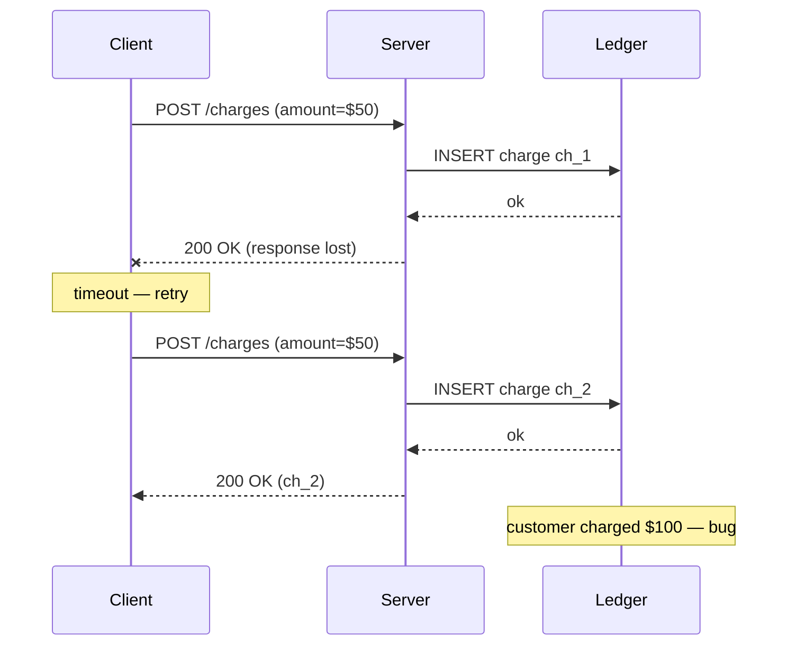
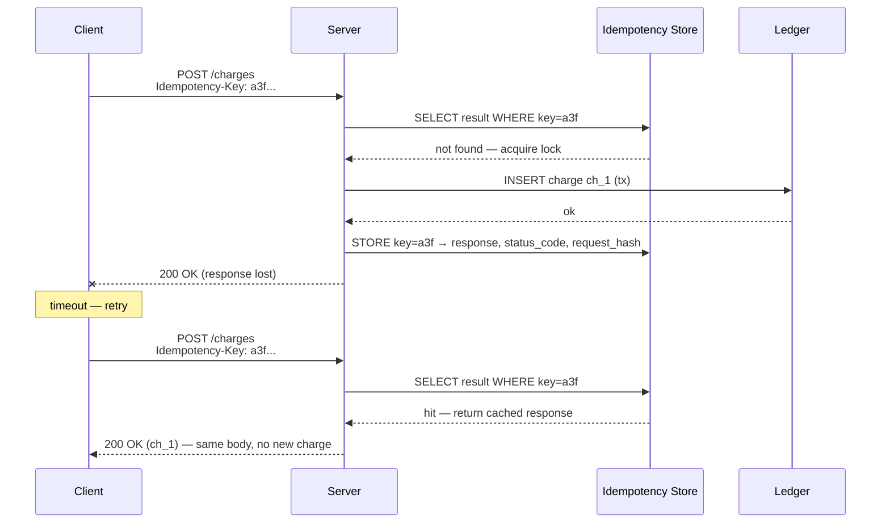
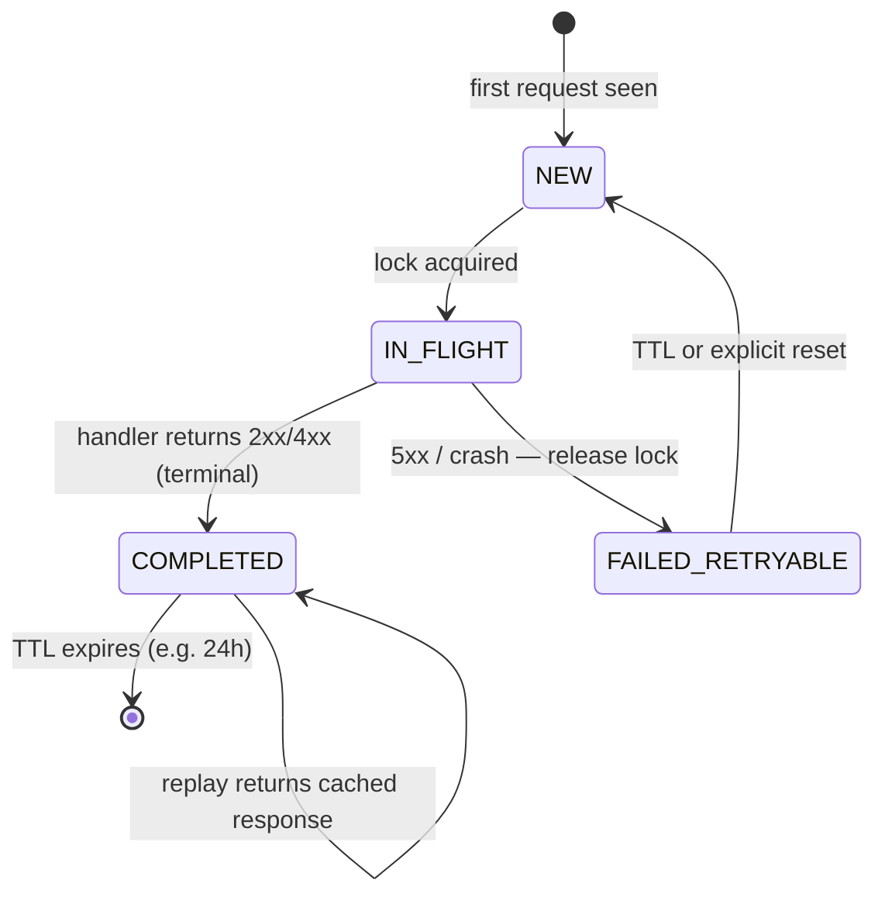
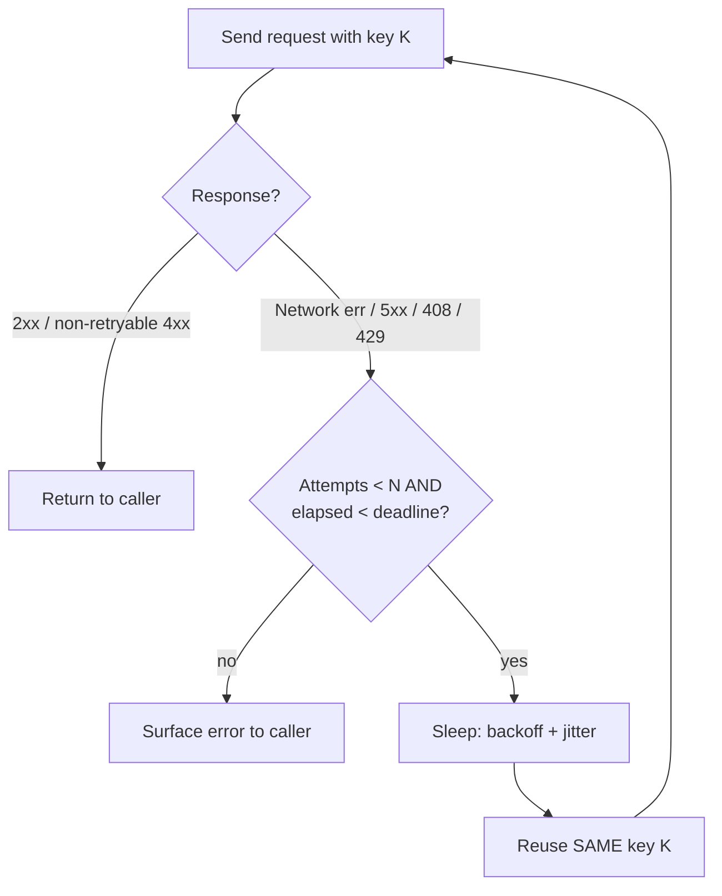

# Idempotency

## Why This Exists

**Problem.** Networks fail in the middle. The client sends a request, the server processes it, then the response is lost on the way back. The client retries. Now the operation runs twice. In a payment API this means two charges; in a "send email" API two emails; in an inventory decrement two items deducted. Distributed systems are at-least-once by default — exactly-once is a property you engineer, not one you get for free.

**Key insight.** *Idempotency = the property that f(x) = f(f(x)) = f(f(f(x)))*. Applied to APIs: the same logical request, replayed any number of times, produces the same observable outcome (same response, same side effects, same final state). The way you achieve this is almost always by giving every request a **unique key the server can use to recognize a retry**, then storing the *result* of the first execution against that key so retries return the cached result instead of re-executing the side effect.

**Reach for this when:**
- The operation has a side effect (charge a card, write to a ledger, send a message, allocate inventory, mutate external state).
- The transport is unreliable — HTTP over the public internet, mobile, cross-region, queue-driven workers, webhooks.
- You want to enable safe **automatic retries** anywhere — client SDKs, gateways, service meshes, message brokers.
- You're building a public API where third-party integrators will inevitably retry incorrectly.

**Don't reach for this when:**
- The operation is naturally idempotent already (PUT a full resource, DELETE by id, GET).
- It's an internal-only RPC inside a single trust boundary where you can guarantee single-shot delivery (rare — usually a fantasy).
- The cost of storing the dedup index dwarfs the cost of the duplicate (extremely cheap idempotent reads, e.g. cache lookups).

## Diagrams

### The duplicate-side-effect failure mode



### Idempotency key flow (Stripe pattern)



### State machine for a request keyed by idempotency-key



## HTTP method semantics — the baseline

RFC 9110 §9.2.2 defines idempotency for HTTP methods. Memorize this table; teams get it wrong constantly.

| Method  | Safe? | Idempotent? | Cacheable? | Notes |
|---------|-------|-------------|------------|-------|
| GET     | yes   | yes         | yes        | No side effects expected at all |
| HEAD    | yes   | yes         | yes        | Same as GET, no body |
| OPTIONS | yes   | yes         | no         | |
| PUT     | no    | **yes**     | no         | Replaces the resource — same body → same state |
| DELETE  | no    | **yes**     | no         | Re-deleting a deleted resource is still "deleted" |
| POST    | no    | **no**      | rarely     | The dangerous one — creates new resources by default |
| PATCH   | no    | **no***     | no         | *Idempotent only if the patch document is absolute (e.g. JSON Merge Patch with full replacement); arbitrary diffs are not |

**The trap:** "GET is idempotent" does *not* mean your handler must be side-effect-free of all kinds — analytics increments, audit logs, last-accessed timestamps are common. It means the *resource state observable to the client* doesn't change. Don't rate-limit or charge on GET.

**The other trap:** PUT being idempotent only holds if the server stores the request as-is. If your PUT handler does `count = count + body.delta`, you've made it non-idempotent — that's a counter, not a PUT.

## Idempotency keys — the Stripe pattern

For POST endpoints (create-style operations), the standard solution is **client-supplied idempotency keys**. The client generates a UUID per logical operation and sends it in an `Idempotency-Key` HTTP header. The server stores `(key → response, status, request_fingerprint)` for some TTL (Stripe uses 24h). Any retry within the window returns the saved response verbatim.

### Server-side handler — Python / Postgres

```python
# Realistic idempotent POST handler.
# Storage: Postgres table with a unique index on idempotency_key.
# Locking: SELECT ... FOR UPDATE NOWAIT to detect concurrent retries.

import hashlib, json
from datetime import datetime, timedelta
from psycopg2.errors import LockNotAvailable, UniqueViolation

IDEMPOTENCY_TTL = timedelta(hours=24)

def fingerprint(body: dict) -> str:
    # Canonical JSON so {a:1,b:2} == {b:2,a:1}
    return hashlib.sha256(
        json.dumps(body, sort_keys=True, separators=(",", ":")).encode()
    ).hexdigest()

def handle_charge(request, conn):
    key = request.headers.get("Idempotency-Key")
    if not key:
        # Stripe makes this optional but STRONGLY recommended.
        # Some teams require it for write endpoints — pick a posture and document it.
        return execute_charge(request, conn)

    body_fp = fingerprint(request.json)

    with conn.transaction():
        cur = conn.cursor()
        # 1. Try to claim the key. UNIQUE constraint prevents two concurrent inserts.
        try:
            cur.execute("""
                INSERT INTO idempotency_keys
                  (key, request_fingerprint, status, created_at)
                VALUES (%s, %s, 'in_flight', now())
            """, (key, body_fp))
        except UniqueViolation:
            # Key exists — either in-flight (concurrent retry) or completed.
            cur.execute("""
                SELECT status, request_fingerprint, response_body, response_status
                  FROM idempotency_keys
                 WHERE key = %s AND created_at > now() - %s
                 FOR UPDATE NOWAIT
            """, (key, IDEMPOTENCY_TTL))
            row = cur.fetchone()
            if not row:
                # Expired — treat as new. Restart with fresh INSERT.
                return retry_handle_charge(request, conn)

            status, stored_fp, resp_body, resp_status = row
            # 2. Critical: same key + different body = client bug. Reject HARD.
            if stored_fp != body_fp:
                return 422, {"error": "idempotency_key_reused_with_different_payload"}

            if status == "completed":
                # 3. Replay the saved response byte-for-byte.
                return resp_status, resp_body

            if status == "in_flight":
                # Concurrent request still processing. Stripe returns 409.
                return 409, {"error": "request_in_flight"}

        # 4. We won the race — execute the side effect inside the same tx.
        # If the tx aborts, the idempotency_keys row rolls back too — retries get a clean slate.
        result_status, result_body = execute_charge(request, conn)

        cur.execute("""
            UPDATE idempotency_keys
               SET status = 'completed',
                   response_body = %s,
                   response_status = %s,
                   completed_at = now()
             WHERE key = %s
        """, (json.dumps(result_body), result_status, key))

    return result_status, result_body
```

**Why every line matters:**
- **Canonical fingerprint.** Two semantically-equal JSON bodies must hash the same. Use sorted-key, no-whitespace JSON. Otherwise a benign client retry that re-serializes the body looks like a new request.
- **UNIQUE constraint as the lock.** Don't roll your own `SELECT then INSERT` — that's a TOCTOU race. Let the database enforce mutual exclusion.
- **Different-body rejection.** If a client sends key=K with body B1, then key=K with body B2, that is *always* a bug. Refuse loudly with 422 — silently picking one is how you ship "your $50 charge is now $5000" incidents.
- **TTL.** Don't keep keys forever. 24 hours is the Stripe default; tune to your retry envelope. Long enough that all reasonable retries (including human "I'll try again tomorrow") hit; short enough that a bad client UUID generator can recover.
- **Same transaction.** The idempotency record and the business side effect commit together. If they live in different stores you've reintroduced the partial-failure problem you were trying to solve. (See: outbox pattern in `../../data-systems/outbox/`.)

### Client-side retry with idempotency

```python
import uuid, time, requests
from requests.exceptions import RequestException

def charge_with_retry(amount: int, source: str) -> dict:
    # CRITICAL: generate the key ONCE per logical operation, outside the retry loop.
    # If you regenerate per attempt you've defeated the entire mechanism.
    idempotency_key = str(uuid.uuid4())

    backoff = 0.5
    for attempt in range(6):
        try:
            r = requests.post(
                "https://api.example.com/v1/charges",
                json={"amount": amount, "source": source},
                headers={"Idempotency-Key": idempotency_key},
                timeout=(3.05, 10),  # connect, read
            )
            # 4xx (except 409 in_flight, 429 rate-limit) — don't retry.
            if 400 <= r.status_code < 500 and r.status_code not in (408, 409, 429):
                r.raise_for_status()
            if r.status_code < 500 and r.status_code != 409:
                return r.json()
        except RequestException:
            pass  # network — definitely retry

        time.sleep(backoff + random.uniform(0, backoff))  # full jitter
        backoff = min(backoff * 2, 30)

    raise RuntimeError("charge failed after retries")
```

## Conditional writes — idempotency for updates

For *update* operations (mutating an existing resource), the better tool is often **optimistic concurrency** via `If-Match` / version numbers. This handles a different problem — concurrent writes — but composes with idempotency keys.

```http
GET /v1/orders/ord_42
ETag: "v17"

PUT /v1/orders/ord_42
If-Match: "v17"
Content-Type: application/json

{ "status": "shipped" }
```

Server logic:

```sql
UPDATE orders
   SET status = 'shipped', version = version + 1
 WHERE id = 'ord_42' AND version = 17
RETURNING version;
```

If 0 rows returned → respond `412 Precondition Failed`. The client must re-GET, reconcile, and retry with the new ETag.

**Why this is idempotent:** replaying the same `If-Match: "v17"` PUT either succeeds once (now version=18, subsequent retries 412) or fails. The terminal state is deterministic. Compare to a blind PUT, which would happily overwrite a concurrent change made between the client's GET and PUT.

| Pattern | Solves | Idempotent? | When |
|---------|--------|-------------|------|
| Idempotency-Key header | Duplicate **creates** | Yes (cached response) | POST /charges, POST /messages |
| If-Match / version | Duplicate **updates**, lost-update race | Yes (CAS semantics) | PUT/PATCH on mutable resource |
| ETag + If-None-Match | Cheap **reads**, cache validation | N/A (read) | GET with caching |
| Natural keys (e.g. order_number) | App-layer dedup | Yes via UNIQUE | When client owns the id |

DDIA ch. 7 ("Transactions") and ch. 9 ("Consistency and Consensus") cover the consistency model these compose into.

## Making a non-idempotent operation idempotent

You can almost always retrofit idempotency. The mental move: **find the smallest unit of state-change and gate it behind a unique key.**

### Recipe 1 — UNIQUE constraint on a natural key

If the operation has a natural unique identifier (order number, message id, transaction reference), put a UNIQUE index on it and let duplicates fail at the database. Catch the unique-violation, look up the existing row, return its representation.

```sql
CREATE UNIQUE INDEX orders_external_ref_idx ON orders (external_ref);

-- Insert; if duplicate, return existing.
INSERT INTO orders (external_ref, customer_id, total_cents)
VALUES ('cust-9-2026-001', 9, 4200)
ON CONFLICT (external_ref) DO UPDATE SET external_ref = EXCLUDED.external_ref
RETURNING id, status, total_cents;
```

The `DO UPDATE SET col = EXCLUDED.col` is a no-op trick to make `RETURNING` work for both insert and conflict. Postgres-specific.

### Recipe 2 — token-based "consume once"

For non-replayable side effects (sending an email, calling an external API), wrap the action in a token whose first observation marks it consumed.

```python
def send_welcome_email(user_id: int, token: str):
    # token is opaque; client (or upstream worker) generates one per logical send.
    with conn.transaction():
        cur = conn.cursor()
        cur.execute("""
            INSERT INTO email_send_tokens (token, user_id, sent_at)
            VALUES (%s, %s, now())
            ON CONFLICT (token) DO NOTHING
            RETURNING token
        """, (token, user_id))
        if cur.rowcount == 0:
            return  # already sent — silent success
        # Side effect runs only on first observation.
        ses_client.send_email(...)
```

**The honest caveat.** Even this isn't truly exactly-once. If the SES call succeeds but the transaction commit fails afterward, the next retry sees no token and sends again. To get closer to exactly-once you need either (a) a transactional outbox + idempotent receiver downstream, or (b) the external call itself supports an idempotency key you pass through. There is no magic — see Pat Helland, "Life Beyond Distributed Transactions."

### Recipe 3 — split into idempotent steps

Operations like "create user, charge card, send email" are inherently non-atomic across services. The fix is a **saga**: each step is individually idempotent, and you record progress in a state machine. Retry-from-checkpoint is then safe. See `../../architecture-patterns/saga/` and `../../data-systems/outbox/`.

## Idempotency pairs with retries — and only with idempotency

Retry policies (exponential backoff + jitter, circuit breakers, hedged requests) are built into every modern client SDK. **Their correctness assumes the operation is idempotent.** AWS SDKs retry POSTs by default for transient errors — but they only do so on operations the AWS team has marked idempotent in their service model.

The contract a system must commit to:

1. **Server publishes** which endpoints are idempotent and how to invoke them safely (which header, which key format, what TTL).
2. **Client retries** transient failures (network errors, 5xx, 408, 429) using the *same* idempotency key.
3. **Client does not retry** non-transient 4xx (except 408, 409, 429).
4. **Both sides agree** on a TTL and a max retry budget so a slow human-driven retry doesn't fall outside the dedup window.



Without idempotency, retries are how you turn a single transient blip into a thundering herd that double-charges customers.

## Deduplication windows — getting the TTL right

The dedup window is the period after first execution during which the server still recognizes a key as "seen." Choose by:

- **Client retry envelope.** Most SDKs cap retries at minutes. If yours allows hours (e.g. "user closed laptop, opens it tomorrow, app retries the queued send"), TTL must cover that.
- **Storage cost.** Dedup table grows linearly with traffic. At 10k POST/s × 86400s × 24h × 200 bytes/row = ~17 TB/day. Garbage-collect aggressively.
- **Risk asymmetry.** A duplicate charge is catastrophic; a duplicate "get balance" is not. Calibrate per endpoint.

Stripe documents 24h. AWS SQS message-deduplication is 5 minutes (configurable up to 5 min in FIFO queues — anything beyond that requires app-level dedup). Kafka exactly-once semantics use a producer-id + sequence-number window scoped to the producer session.

## Trade-offs

| Benefit | Cost |
|---------|------|
| Safe automatic retries everywhere | Every write endpoint needs an idempotency store + GC + monitoring |
| Mobile/flaky-network clients become reliable | Clients must generate UUIDs correctly, persist them across crashes |
| Enables aggressive timeouts (because retry is safe) | Adds 1 round trip / 1 DB lookup per request — minor latency |
| Postpones/eliminates "manual reconciliation" tooling | TTL choice is hard; bad choice → false dedup or storage blowup |
| Composable with at-least-once messaging (SQS, Kafka) | Doesn't give true exactly-once across system boundaries |
| Documented contract third-party integrators can target | Auditing/proving idempotency under all crash sequences is hard |
| Cheap to add to greenfield APIs | Retrofitting onto existing non-idempotent endpoints is a migration |

## Common Pitfalls

- **Regenerating the idempotency key on each retry.** Defeats the entire mechanism. Generate once per *logical* operation, persist on the client if the operation might span process restarts.
- **Same key, different body, server silently picks one.** Catastrophic. Always reject with 422 — the client has a bug and needs to know.
- **Caching only successful responses.** If the first attempt returned 400 ("invalid card"), retries should also return 400, not re-execute and possibly charge a now-valid card. Cache *terminal* responses (any 2xx, 4xx) — only release the key on 5xx/timeout.
- **Idempotency record in a different transaction than the side effect.** Crash between the two and you've stored "completed" with no actual charge, or charged with no record. Same DB, same tx, or use a coordinated 2-phase pattern (outbox).
- **TTL shorter than the client's max retry interval.** Client retries after window expires, sees a fresh key, re-executes. Make TTL > max client backoff schedule + headroom.
- **Allowing GET to mutate.** "It's just a counter" — and now it can't be safely retried, prefetched, or load-tested. RFC 9110 §9.2.1 is not optional.
- **PATCH treated as idempotent without verifying the patch document.** `{"op": "increment", "field": "count"}` is *not* idempotent. JSON Patch (RFC 6902) `add`/`remove`/`replace` with absolute values are; `move`/`copy`/`test` semantics differ.
- **Idempotency-key per HTTP request instead of per logical op.** Some HTTP libraries auto-retry 5xx and generate a new key each time. Audit your client stack.
- **Webhook receivers without dedup.** Senders (Stripe, GitHub, etc.) deliver at-least-once. If your receiver doesn't dedup on event-id, you'll process the same webhook 2-5 times during normal operation. This is the #1 source of duplicate-side-effect bugs in webhook-driven systems.
- **Forgetting hot-key contention.** If `idempotency_key` is your only dedup mechanism and a buggy client hammers the same key 10k times/sec, you have a row-level lock storm. Cap requests/key and shed early.
- **Ignoring clock skew when TTL is computed client-side.** Always TTL on the server clock.
- **"We don't need this — our endpoints are internal."** Your service mesh retries. Your load balancer retries. Your worker pool retries. Internal != single-shot.

## Decision Table

| Situation | Use | Why not the alternative |
|-----------|-----|-------------------------|
| Public POST creating a resource (charge, order, message) | Idempotency-Key header (Stripe pattern) | Natural keys leak app structure to clients; PUT-with-id forces clients to mint server ids |
| Update to existing resource with possible concurrent writers | If-Match / ETag (optimistic concurrency) | Idempotency-Key alone doesn't prevent lost-update; you need both |
| Client knows the id ahead of time (e.g. uploaded file checksum) | PUT to `/files/{sha256}` | Saves a server round trip; PUT is naturally idempotent |
| Async job kicked off by a queue message | Dedup on message-id at the worker | Idempotency-Key is HTTP-shaped; messaging needs receiver-side dedup |
| One-shot side effect (send email, push notification) | Token-consume pattern + UNIQUE constraint | Stripe-style key cache works too but the token model maps cleanly to "exactly one observation" |
| Multi-step workflow across services | Saga + idempotent steps + outbox | Single idempotency key can't span service boundaries safely |
| Read-only endpoint | Just use GET | Idempotency-Key adds storage cost for no benefit |
| Stream processor (Kafka/Kinesis) | Producer idempotence + transactional consumer offsets | HTTP-style keys don't apply; the framework owns this |
| Internal RPC inside one trust boundary | Still add idempotency keys for create-style ops | "It won't happen here" — it will, the moment you add a retry |
| You need "exactly once" globally across systems | Accept that this is impossible; build idempotent receivers + outbox + dedup at every hop | True exactly-once requires distributed consensus per-operation, prohibitively expensive |

## References

- Brandur Leclerc / Stripe Engineering — "Designing robust and predictable APIs with idempotency" — https://stripe.com/blog/idempotency
- Stripe API Reference — "Idempotent requests" — https://docs.stripe.com/api/idempotent_requests
- IETF RFC 9110 — "HTTP Semantics" §9.2 (Common Method Properties: Safe, Idempotent) — https://www.rfc-editor.org/rfc/rfc9110.html#name-common-method-properties
- IETF Draft — Jenness/Nottingham, "The Idempotency-Key HTTP Header Field" — https://datatracker.ietf.org/doc/draft-ietf-httpapi-idempotency-key-header/
- IETF RFC 6902 — "JavaScript Object Notation (JSON) Patch" — https://www.rfc-editor.org/rfc/rfc6902
- IETF RFC 7232 — "HTTP Conditional Requests" (If-Match, ETag) — https://www.rfc-editor.org/rfc/rfc7232
- Pat Helland — "Life Beyond Distributed Transactions: An Apostate's Opinion" (CIDR 2007) — https://www.ics.uci.edu/~cs223/papers/cidr07p15.pdf
- Pat Helland — "Idempotence Is Not a Medical Condition" (ACM Queue, 2012) — https://queue.acm.org/detail.cfm?id=2187821
- Marc Brooker (AWS) — "Timeouts, retries, and backoff with jitter" — AWS Builders' Library — https://aws.amazon.com/builders-library/timeouts-retries-and-backoff-with-jitter/
- AWS Builders' Library — "Challenges with distributed systems" — https://aws.amazon.com/builders-library/challenges-with-distributed-systems/
- AWS — "Making retries safe with idempotent APIs" — https://aws.amazon.com/builders-library/making-retries-safe-with-idempotent-APIs/
- Kleppmann — *Designing Data-Intensive Applications* — ch. 7 "Transactions" (idempotence and exactly-once), ch. 8 "The Trouble with Distributed Systems," ch. 11 "Stream Processing" (idempotent receivers)
- Beyer et al. — *Site Reliability Engineering* — ch. 22 "Addressing Cascading Failures" (retry amplification) — https://sre.google/sre-book/addressing-cascading-failures/
- Google SRE Workbook — ch. "Managing Load" — https://sre.google/workbook/managing-load/
- Confluent — "Exactly-Once Semantics in Apache Kafka" — https://www.confluent.io/blog/exactly-once-semantics-are-possible-heres-how-apache-kafka-does-it/
- AWS SQS — "Exactly-once processing" (FIFO + content-based dedup) — https://docs.aws.amazon.com/AWSSimpleQueueService/latest/SQSDeveloperGuide/FIFO-queues-exactly-once-processing.html
- Adrian Colyer / The Morning Paper — coverage of "Life beyond distributed transactions, an apostate's opinion" — https://blog.acolyer.org/2014/11/20/life-beyond-distributed-transactions-an-apostates-opinion/
- Martin Fowler — "Patterns of Enterprise Application Architecture" — Optimistic Offline Lock pattern

## See Also

- `../../data-systems/outbox/` — durable, atomic side-effect publication; the partner pattern for crossing service boundaries idempotently
- `../../architecture-patterns/saga/` — long-lived workflows built from idempotent steps + compensations
- `../webhooks/` — at-least-once delivery; receivers MUST dedup on event id
- `../api-versioning/` — how idempotency contract evolves across versions
- `../../reliability/circuit-breaker/` — pairs with retries to prevent retry storms
