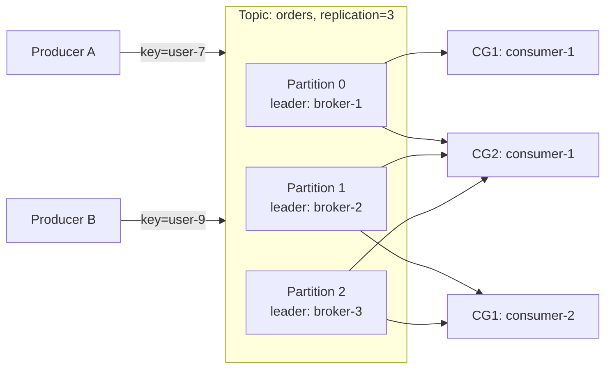
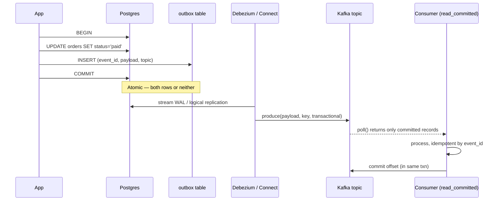
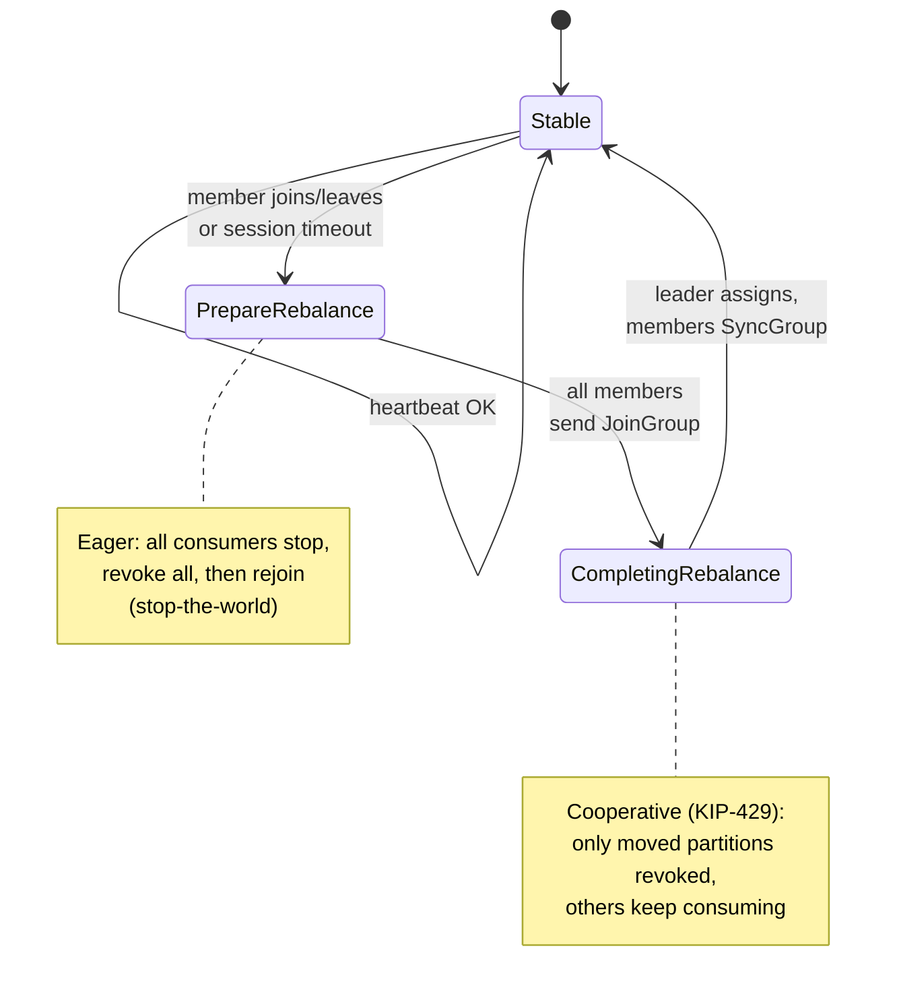

# Kafka Patterns

## Why This Exists

**Problem.** Distributed systems need a durable, replayable, ordered log to decouple producers from consumers, fan out events to many subscribers, and survive process restarts without losing data. Naive use of Kafka — wrong partition key, default producer config, ad-hoc consumer groups, dual writes to DB + topic — produces duplicates, out-of-order events, hot partitions, infinite rebalance storms, and silent data loss during broker failover.

**Key insight.** Kafka is **a partitioned, replicated, append-only commit log**, not a message queue. Order is guaranteed *only within a partition*. Delivery is *at-least-once by default* — exactly-once requires explicit opt-in (idempotent producers + transactions) **and** consumer cooperation (read-committed isolation, transactional offset commits). Almost every Kafka pain you've felt traces back to ignoring one of those three facts: the partition is the unit of order, retries cause duplicates unless you opt in, and the consumer must close the loop.

**Reach for this when:**
- You're designing a new event-driven service and need to pick partition count, key, and retention.
- You need to publish DB changes to Kafka without losing or duplicating events (transactional outbox / CDC).
- You're debugging consumer lag, rebalance storms, ISR shrink, or "where did my message go?"
- You need exactly-once payment processing, billing, or financial events.
- You're tuning producer/consumer configs for throughput vs latency vs durability.

**Don't reach for this when:**
- You need request/response RPC — use gRPC or HTTP. Kafka is fire-and-forget.
- You need low-latency (<5ms) point-to-point messaging — use Redis Streams or NATS.
- You need short-lived task queues with priorities and per-message TTL — use SQS, RabbitMQ, or a job queue (Celery, Sidekiq).
- Your throughput is <100 msg/sec and you have <3 consumers — Kafka's operational cost dwarfs the value.
- You need cross-region synchronous writes — Kafka replication is async; use Spanner, CockroachDB, or DynamoDB Global Tables.

---

## Diagrams

### Topic, partitions, consumer groups



Each partition is consumed by **exactly one** consumer per group. Two groups (CG1, CG2) consume the same topic independently — fan-out via groups, parallelism via partitions.

### Exactly-once write path with transactional outbox



The outbox makes the **DB the source of truth**. Dual-write (write to DB, then write to Kafka) is the #1 way to corrupt event streams — process crash between the two writes silently drops events.

### Rebalance protocol (cooperative, KIP-429)



Eager rebalance = stop-the-world. Cooperative rebalance (default since Kafka 2.4 / Streams 2.4, broker-side `partition.assignment.strategy=CooperativeStickyAssignor`) is the modern default — set it.

---

## Topic and Partition Design

The decisions you make at topic-creation time are nearly impossible to undo. **Repartitioning a busy topic is the most expensive operation in your Kafka lifecycle** — you typically create a new topic, dual-write, replay, cut consumers over, and decommission. Plan up front.

### How to choose partition count

**The bound:** partition count caps your *consumer parallelism within a group*. 12 partitions = at most 12 active consumers in one group. More consumers than partitions sit idle.

**Rule of thumb (Confluent):** target partition throughput. If your peak topic throughput is `T` MB/s and a single partition can handle `p` MB/s on your hardware (typically 10–50 MB/s for produce, 5–20 MB/s for a single consumer doing real work), then `partitions ≥ T/p`. Round up generously — **over-partitioning is cheap, under-partitioning is fatal**. But not infinite: each partition has open files, replication overhead, and controller metadata. Modern Kafka (KRaft) handles 200k+ partitions per cluster, but per-broker should stay under ~4000 leader partitions.

**Default starting point for a new topic:** 12 or 24 partitions. Power-of-many divisors so you can scale consumers smoothly (1, 2, 3, 4, 6, 12 consumers all evenly assigned).

### How to choose the partition key

The key determines:
1. **Order guarantees** — same key always lands on the same partition, so events for that key are strictly ordered.
2. **Co-location** — events that must be processed together must share a key.
3. **Hot partitions** — a skewed key distribution melts one broker.

**Pick a key with:**
- High cardinality (millions of distinct values) so load spreads.
- Natural locality (orders for `user_id` should stay together so the consumer can update user state in order).
- No "default" or "system" value that gets >5% of traffic. (`null` keys are randomly assigned, which is fine if you don't need ordering.)

**Anti-pattern:** keying on `tenant_id` when one tenant is 50× larger than the rest. The whale tenant's partition saturates one consumer thread; the rest sit idle. Fix: use a composite key like `tenant_id + entity_id` if order across the tenant isn't required, or shard the whale tenant onto a dedicated topic.

### Retention and cleanup policy

Two policies, mutually exclusive per topic:

- `cleanup.policy=delete` (default): retain by `retention.ms` (default 7 days) or `retention.bytes`. Old segments deleted. Use for **event streams** (clicks, metrics, transient commands).
- `cleanup.policy=compact`: keep the latest value per key forever. Use for **stateful snapshots** (current user profile, current order status). Tombstone with `null` value to delete a key.
- `cleanup.policy=compact,delete`: compaction + a maximum age. Use for **CDC topics** where you also want to bound disk.

```bash
# Event log: 30-day retention, no compaction
kafka-topics --create --topic clicks \
  --partitions 24 --replication-factor 3 \
  --config cleanup.policy=delete \
  --config retention.ms=2592000000 \
  --config min.insync.replicas=2

# Snapshot table: compacted, 7-day grace before tombstones are purged
kafka-topics --create --topic user-profile \
  --partitions 12 --replication-factor 3 \
  --config cleanup.policy=compact \
  --config min.cleanable.dirty.ratio=0.1 \
  --config delete.retention.ms=604800000 \
  --config min.insync.replicas=2
```

`min.insync.replicas=2` with `replication.factor=3` is the standard durability config: tolerates one broker loss without losing writes (when producer uses `acks=all`).

---

## Producer: Durability and Idempotency

### The three producer configs that matter

```properties
# Durability — never lose an acknowledged write
acks=all                          # wait for all in-sync replicas
enable.idempotence=true           # dedupe on retry within a session
max.in.flight.requests.per.connection=5  # OK with idempotence enabled
retries=2147483647                # retry forever (idempotence makes it safe)
delivery.timeout.ms=120000        # cap total time including retries

# Throughput
linger.ms=10                      # wait up to 10ms to batch
batch.size=131072                 # 128KB batches
compression.type=zstd             # zstd > snappy > gzip for most workloads

# Memory backpressure
buffer.memory=67108864            # 64MB total, send() blocks when full
max.block.ms=60000                # how long send() blocks before throwing
```

**`acks=all` + `enable.idempotence=true` + `min.insync.replicas=2`** is the durability triad. Anything weaker risks losing acknowledged writes during failover. The Confluent docs are emphatic: `acks=1` is "fire and pray" — the leader can ack and crash before replicating.

### Idempotent producer — what it actually does

When you set `enable.idempotence=true`, the producer:
1. Asks the broker for a `producer_id` (PID) on first connect.
2. Stamps every batch with `(PID, partition, sequence_number)`.
3. The broker tracks the last 5 sequence numbers per (PID, partition) and **rejects duplicates** silently.

This eliminates duplicates from **producer retries within a single session**. It does NOT help if your application crashes and restarts — you get a new PID, and a record you sent (but never got an ack for) might be written twice. To survive that, you need **transactions**.

### Transactions — exactly-once across multiple partitions and consumer offsets

```java
Properties props = new Properties();
props.put("bootstrap.servers", "broker:9092");
props.put("enable.idempotence", "true");
props.put("transactional.id", "payment-processor-shard-7"); // STABLE per app instance
props.put("acks", "all");

KafkaProducer<String, String> producer = new KafkaProducer<>(props);
producer.initTransactions(); // fences any zombie producer with same txn.id

try {
    producer.beginTransaction();
    producer.send(new ProducerRecord<>("payments", paymentId, paymentJson));
    producer.send(new ProducerRecord<>("audit-log", paymentId, auditJson));

    // If this is a consume-process-produce loop, also commit consumer offsets
    // atomically with the produces:
    Map<TopicPartition, OffsetAndMetadata> offsets = currentOffsets();
    producer.sendOffsetsToTransaction(offsets, consumerGroupMetadata);

    producer.commitTransaction();
} catch (ProducerFencedException e) {
    // Another instance with same transactional.id took over — exit, don't retry
    producer.close();
    System.exit(1);
} catch (KafkaException e) {
    producer.abortTransaction();
}
```

Critical points:
- `transactional.id` must be **stable per logical producer** (e.g., per shard, per pod with stable identity from a StatefulSet). Random UUIDs defeat zombie fencing.
- Consumers must set `isolation.level=read_committed` to skip aborted records.
- Transactions cost ~2–10ms latency overhead and ~3% throughput. Don't wrap every record in its own transaction; batch.
- A transaction can span multiple topics/partitions on the **same cluster** only.

---

## Consumer: Groups, Offsets, and Lag

### How offset commits actually work

The consumer's job is to (a) poll records, (b) process them, (c) commit the offset of the last processed record. Three modes:

```python
# Mode 1: auto-commit (DON'T use in production)
# Commits offsets every auto.commit.interval.ms regardless of processing state.
# If process crashes after commit but before processing → DATA LOSS.
# If process crashes after processing but before commit → DUPLICATE.
consumer = KafkaConsumer('orders',
    enable_auto_commit=True,           # default — turn this off
    auto_commit_interval_ms=5000)

# Mode 2: synchronous commit after processing (at-least-once, safe default)
consumer = KafkaConsumer('orders',
    bootstrap_servers='broker:9092',
    group_id='order-processor',
    enable_auto_commit=False,
    isolation_level='read_committed',
    max_poll_records=500,
    max_poll_interval_ms=300000)       # heartbeat-independent processing budget

for batch in consumer:
    for record in batch:
        process(record)                # MUST be idempotent
    consumer.commit()                  # blocks until broker acks

# Mode 3: async commit + sync on shutdown (higher throughput)
try:
    while running:
        records = consumer.poll(timeout_ms=1000)
        for tp, msgs in records.items():
            for msg in msgs:
                process(msg)
        consumer.commit_async(callback=on_commit_failure)
finally:
    try:
        consumer.commit()              # final sync commit on graceful shutdown
    finally:
        consumer.close()
```

### `max.poll.interval.ms` — the silent killer

The single most common consumer bug: processing one batch takes longer than `max.poll.interval.ms` (default 5 minutes). The broker assumes the consumer is dead, kicks it out of the group, **rebalance fires**, partitions reassigned, the original consumer eventually finishes processing and tries to commit — `CommitFailedException`. Now you're stuck in a rebalance loop.

Fix: either (a) reduce `max.poll.records` so each batch fits in the budget, or (b) increase `max.poll.interval.ms` (up to 10–15 min), or (c) move slow processing to a thread pool and call `consumer.pause()/resume()` on partitions you can't keep up with.

### Consumer lag — what it really means

`consumer_lag = log_end_offset - committed_offset` per partition. Lag is healthy if it's bounded and oscillating around a steady value. Lag is a problem when:
- **Lag grows unbounded** → consumer is slower than producer. Add consumers (up to partition count), profile processing, or shed load upstream.
- **Lag spikes on one partition only** → hot partition (skewed key) or one consumer is wedged. Check thread state, GC, downstream service.
- **Lag drops to zero then jumps to millions** → consumer was kicked out, rebalance reset offsets, or someone replayed the topic.

Monitor lag with Burrow, Cruise Control, or Confluent Control Center. Alert on **time-based lag** (`lag_seconds = lag / produce_rate`) not raw offset count — 10k offsets is catastrophic for a 10/sec topic and trivial for a 1M/sec topic.

---

## Exactly-Once Semantics: The Honest Version

Kafka's "exactly-once" is exactly-once **within Kafka**: from a Kafka topic, through a stream processor, to another Kafka topic, with offsets committed atomically. End-to-end exactly-once with external systems (databases, payment gateways, REST APIs) requires **idempotent consumers** — the consumer must dedupe by event_id when it writes downstream.

**The four-part recipe for exactly-once across services:**

1. **Producer side:** transactional outbox (DB writes event + business state in one ACID txn; CDC publishes the event). Or idempotent producer + transactions with `transactional.id` stable per shard.
2. **Topic config:** `min.insync.replicas=2`, `replication.factor=3`, `unclean.leader.election.enable=false` (don't promote out-of-sync replicas — that loses committed writes).
3. **Consumer side:** `isolation.level=read_committed`, manual commits *after* processing succeeds, `enable.auto.commit=false`.
4. **Downstream side:** every event carries a unique `event_id` (UUID, or `(producer_id, sequence)`); the consumer's downstream write is idempotent on `event_id` (e.g., `INSERT ... ON CONFLICT (event_id) DO NOTHING` or upsert by primary key).

If you skip step 4, Kafka's "exactly-once" still gives you duplicates downstream during consumer crashes between processing and commit. There is no way around this — it's the **two-generals problem** wearing a Kafka hat.

---

## Transactional Outbox Pattern

The dual-write problem: your service updates Postgres AND publishes to Kafka. If the second step fails, the system is inconsistent. If you do them in a try/catch, the catch block can't atomically roll back the DB write. Outbox solves this.

```sql
-- Migration
CREATE TABLE outbox (
    id           BIGSERIAL PRIMARY KEY,
    aggregate_id TEXT NOT NULL,
    event_type   TEXT NOT NULL,
    topic        TEXT NOT NULL,
    payload      JSONB NOT NULL,
    headers      JSONB,
    created_at   TIMESTAMPTZ NOT NULL DEFAULT now()
);
CREATE INDEX outbox_unpublished ON outbox (id);  -- CDC reads in order
```

```python
# Service code — single transaction, no dual write
def place_order(order):
    with db.transaction():
        db.execute("INSERT INTO orders (...) VALUES (...)", order)
        db.execute("""
            INSERT INTO outbox (aggregate_id, event_type, topic, payload)
            VALUES (%s, 'OrderPlaced', 'orders', %s)
        """, (order.id, json.dumps(order.to_event())))
    # No Kafka call here. CDC handles publication.
```

Then run **Debezium** (or Confluent Connect with the Outbox SMT) reading the Postgres WAL via logical replication, transforming outbox rows into Kafka records keyed by `aggregate_id`. The CDC connector tracks its own offset in `__debezium_offsets`, so it's exactly-once from DB → Kafka (with idempotent producer). Combined with read-committed consumers and idempotent downstream writes, you get end-to-end exactly-once.

**Why this beats "publish then commit"** — the WAL is the linearizable source of truth. The event cannot exist without the row, and the row cannot exist without the event. The CDC connector handles retries and deduplication. You avoid the application-level race condition entirely.

**When NOT to use outbox:** if your event volume is much higher than your DB transaction volume (e.g., emitting metrics from inside a hot loop), the outbox table becomes a bottleneck. Use direct Kafka producer with `acks=all` + idempotence, accept at-least-once, and dedupe downstream.

---

## Log Compaction Deep Dive

Compaction keeps the latest value per key forever, asynchronously deleting older versions. This makes a topic into a **changelog** — replay it from offset 0 and you reconstruct current state.

```
Before compaction (offsets):
  0: (user-1, {name: Alice, plan: free})
  1: (user-2, {name: Bob,   plan: free})
  2: (user-1, {name: Alice, plan: pro})
  3: (user-3, {name: Carol, plan: free})
  4: (user-1, null)                          <-- tombstone, deletes user-1
  5: (user-2, {name: Bob,   plan: pro})

After compaction (cleaner runs in background):
  3: (user-3, {name: Carol, plan: free})
  4: (user-1, null)
  5: (user-2, {name: Bob,   plan: pro})
```

Key configs:
- `min.cleanable.dirty.ratio` (default 0.5) — only compact a partition when 50% of bytes are stale. Lower = more aggressive (more CPU). For high-churn keys, set to 0.1.
- `min.compaction.lag.ms` — minimum age before a record can be compacted. Set to your longest consumer SLA so slow consumers don't miss intermediate states.
- `delete.retention.ms` (default 24h) — how long tombstones survive after compaction. Consumers must consume within this window or they'll miss the delete.
- `segment.ms` — active segment is never compacted; rotate it on time so compaction can run.

**Use compaction for:** Kafka Streams state store backups (KTable changelog), CDC snapshot topics, configuration distribution, slow-changing dimensions.

**Don't use compaction for:** event logs (you want every event), high-cardinality keys with low churn (compaction never runs effectively), topics where you need bounded total size — combine with `cleanup.policy=compact,delete`.

---

## Tiered Storage (KIP-405, Kafka 3.6+)

Tiered storage decouples hot data (recent, on broker disk) from cold data (older, on S3/GCS/blob). Brokers stream local segments to remote storage; consumers reading old offsets transparently fetch from remote. Available GA in Apache Kafka 3.9 and Confluent Cloud earlier.

**What it buys you:**
- Effectively unlimited retention without scaling broker disks.
- Faster broker recovery (less local data to re-replicate after a node loss).
- Cheaper long-term storage (S3 standard ≈ $23/TB/month vs EBS gp3 ≈ $80/TB/month).

**What it costs:**
- Cold reads have higher first-byte latency (100ms–1s vs <10ms hot).
- Operational complexity: another moving part, IAM policies, lifecycle config.
- Replays from cold storage can saturate egress bandwidth.

**Configure per-topic:**
```bash
kafka-configs --alter --entity-type topics --entity-name events \
  --add-config 'remote.storage.enable=true,local.retention.ms=86400000,retention.ms=31536000000'
# Local: 1 day hot. Remote: 1 year cold.
```

Don't tier compacted topics (KIP-950 in progress); don't tier topics where reads are uniformly distributed across the entire history.

---

## Trade-offs

| Benefit | Cost |
|---|---|
| Replayable durable log decouples producers/consumers | Requires schema discipline (Avro/Protobuf + Schema Registry) — naive JSON breaks consumers silently |
| Horizontal scaling via partitions | Partition count is sticky; repartitioning needs a new topic + dual-write |
| At-least-once is cheap and reliable | At-least-once means **duplicates** unless consumers are idempotent |
| Exactly-once via transactions | ~3% throughput hit, +2–10ms latency, complexity (txn.id management, fencing) |
| Idempotent producer (free, just enable it) | Only dedupes within one producer session; app crash defeats it |
| Compaction → infinite retention for snapshots | Cleaner overhead, tombstone window gotchas, segment churn |
| Tiered storage → cheap long retention | Cold reads slow; vendor lock-in (S3/Azure/GCS); tooling immature |
| Consumer groups → automatic load balancing | Rebalances stop processing; misconfig → rebalance storms |
| Strong ordering per partition | No global ordering across a topic; dependency between keys forbidden |
| `acks=all` + `min.insync.replicas=2` → no data loss on single broker failure | Producer blocks if 2 of 3 replicas down (availability vs durability — choose) |

---

## Common Pitfalls

- **Dual writes to DB and Kafka.** Update the DB, then `producer.send()`. The process crashes between. Now your DB and topic disagree forever. **Fix:** transactional outbox, or use Kafka as the source of truth and CDC into the DB.

- **Random UUID partition keys "for distribution."** Wrecks ordering. Now `OrderPlaced(id=42)` and `OrderPaid(id=42)` land on different partitions, get processed by different consumers, and the "paid" event arrives before the "placed" event in your downstream view. **Fix:** key on the aggregate id (`order_id`, `user_id`), accept that some keys are hotter, monitor partition skew.

- **`max.poll.interval.ms` shorter than worst-case batch processing.** Consumer takes 6 minutes to process a 500-record batch. Default is 5 min. Broker kicks it out. Rebalance. Repeat forever. **Fix:** lower `max.poll.records`, or raise `max.poll.interval.ms`, or process async with backpressure.

- **`acks=1` because "it's faster."** Leader acks, then crashes before replicating. Followers elect a new leader from older log. The acknowledged write is gone. **Fix:** `acks=all` is the only safe setting for durable workloads. It's typically only 5–15% slower with proper batching.

- **`unclean.leader.election.enable=true`.** When all in-sync replicas are down, broker promotes an out-of-sync replica to leader. You silently lose the most recent committed messages. **Fix:** set `false` cluster-wide. Accept temporary unavailability over silent data loss.

- **Poison pill with no DLQ.** One malformed record causes the consumer to throw on every poll. Lag explodes. **Fix:** wrap deserialization, route bad records to a dead-letter topic with full context (offset, partition, exception, raw bytes), continue processing.

- **Rebalance storms during deploys.** Rolling deploy of 12 consumers takes 30 min because every restart triggers a full eager rebalance. **Fix:** use cooperative incremental rebalance (`partition.assignment.strategy=org.apache.kafka.clients.consumer.CooperativeStickyAssignor`), and use Kafka 2.4+ static membership with `group.instance.id` so brief restarts don't trigger reassignment.

- **ISR shrink alarms ignored.** A follower falls behind, gets removed from ISR, alarm fires, on-call dismisses it. Now `min.insync.replicas=2` produces start failing. **Fix:** investigate ISR shrink immediately — usually disk full, GC pause, or network partition. Tune `replica.lag.time.max.ms` if your workload has natural bursts.

- **Forgetting `enable.idempotence=true` is now default in newer clients.** Pre-3.0 it was off. Old config templates copy-pasted into new services. **Fix:** explicitly set it; use Schema Registry to version configs.

- **Single consumer group consuming from both source and sink topics.** Causes infinite loops in stream processors. **Fix:** distinct group ids per topology; use Kafka Streams which handles this for you.

- **Schema evolution without compatibility checks.** Producer adds a required field; consumers using the old schema crash on every record. **Fix:** Confluent Schema Registry with `BACKWARD` (or `FULL`) compatibility enforcement; CI check on schema PRs.

- **Letting consumer offsets expire.** `offsets.retention.minutes` (default 7 days). Consumer goes offline for 8 days, comes back, offsets gone, `auto.offset.reset=latest` skips a week of data — or `=earliest` reprocesses everything. **Fix:** raise retention, or have the consumer commit periodic heartbeats even when idle.

---

## Decision Table

| Situation | Use | Don't use |
|---|---|---|
| Event-driven microservices, durable, replayable | **Kafka with topic per event type** | RabbitMQ (lacks replay, partition ordering) |
| Low-latency request/response | gRPC, HTTP | Kafka (fire-and-forget, no return path) |
| <100 msg/sec, simple task queue | SQS, Redis Streams | Kafka (operational overhead too high) |
| Need exactly-once payment, billing | **Idempotent producer + txn + outbox + idempotent consumer** | Plain `acks=1` producer |
| Need DB → Kafka without dual-write | **Transactional outbox + Debezium CDC** | App-level "publish then commit" |
| Need current state per key, replayable | **Compacted topic** (`cleanup.policy=compact`) | Delete-retention topic + external snapshot store |
| Need 1-year+ retention, cost-sensitive | **Tiered storage** (Kafka 3.9+) or topic mirror to S3 (Pinterest Secor, Confluent S3 Sink) | Bigger broker disks |
| High-throughput stream processing within Kafka | **Kafka Streams** or ksqlDB | Pull-based consumer + custom state |
| Cross-cluster replication | MirrorMaker 2 or Confluent Cluster Linking | Manual consume-and-produce |
| Sub-millisecond pub/sub | Redis Streams, NATS JetStream | Kafka (~5ms floor with batching) |
| Strict global ordering across all events | Single-partition topic (limits throughput to ~50 MB/s) | Multi-partition topic (only per-key order) |
| Per-message TTL or priority | RabbitMQ, ActiveMQ | Kafka (offset-based, no per-msg TTL) |

---

## References

- Apache Kafka — Documentation — https://kafka.apache.org/documentation/
- Apache Kafka — Designing Producers, Consumers, Streams — https://kafka.apache.org/documentation/#design
- Confluent — Kafka Design Patterns — https://developer.confluent.io/patterns/
- Confluent — Idempotent Producer — https://docs.confluent.io/platform/current/installation/configuration/producer-configs.html#enable-idempotence
- Confluent — Transactions in Apache Kafka — https://www.confluent.io/blog/transactions-apache-kafka/
- Confluent — Exactly-Once Semantics Are Possible: Here's How Apache Kafka Does It — https://www.confluent.io/blog/exactly-once-semantics-are-possible-heres-how-apache-kafka-does-it/
- Confluent — Log Compaction — https://docs.confluent.io/kafka/design/log_compaction.html
- Confluent — Tiered Storage — https://docs.confluent.io/platform/current/kafka/tiered-storage.html
- KIP-98 — Exactly-Once Delivery and Transactional Messaging — https://cwiki.apache.org/confluence/display/KAFKA/KIP-98+-+Exactly+Once+Delivery+and+Transactional+Messaging
- KIP-405 — Kafka Tiered Storage — https://cwiki.apache.org/confluence/display/KAFKA/KIP-405%3A+Kafka+Tiered+Storage
- KIP-429 — Cooperative Incremental Rebalance — https://cwiki.apache.org/confluence/display/KAFKA/KIP-429%3A+Kafka+Consumer+Incremental+Rebalance+Protocol
- Confluent — Cooperative Rebalance in Kafka Streams — https://www.confluent.io/blog/cooperative-rebalancing-in-kafka-streams-consumer-ksqldb/
- Debezium — Outbox Pattern — https://debezium.io/documentation/reference/stable/transformations/outbox-event-router.html
- Chris Richardson — Pattern: Transactional Outbox — https://microservices.io/patterns/data/transactional-outbox.html
- Pat Helland — Life Beyond Distributed Transactions: An Apostate's Opinion (CIDR 2007 / ACM Queue) — https://queue.acm.org/detail.cfm?id=3025012
- Jay Kreps — The Log: What every software engineer should know about real-time data's unifying abstraction — https://engineering.linkedin.com/distributed-systems/log-what-every-software-engineer-should-know-about-real-time-datas-unifying
- Martin Kleppmann — Designing Data-Intensive Applications, ch. 11 "Stream Processing" and ch. 5 "Replication" (O'Reilly, 2017)
- Martin Kleppmann — Using logs to build a solid data infrastructure (or: why dual writes are a bad idea) — https://martin.kleppmann.com/2015/05/27/logs-for-data-infrastructure.html
- Confluent — Kafka Reliability — https://docs.confluent.io/kafka/design/replication.html
- Adrian Colyer / The Morning Paper — Kafka, a Distributed Messaging System for Log Processing (Kreps et al., NetDB 2011) — https://blog.acolyer.org/2014/12/15/kafka-a-distributed-messaging-system-for-log-processing/
- Gwen Shapira, Todd Palino, Rajini Sivaram, Krit Petty — Kafka: The Definitive Guide, 2nd ed. (O'Reilly, 2021)
- Tyler Akidau — Streaming Systems (O'Reilly, 2018), ch. 5 "Exactly-Once and Side Effects"
- Site Reliability Engineering (Beyer et al.) — ch. 22 "Addressing Cascading Failures" — https://sre.google/sre-book/addressing-cascading-failures/

---

## See Also

- ../event-driven-architecture/ — when to use events vs commands vs RPC; choreography vs orchestration.
- ../message-queues/ — RabbitMQ, SQS, NATS comparisons; when not to use Kafka.
- ../change-data-capture/ — Debezium, logical replication, CDC topologies.
- ../grpc-patterns/ — synchronous RPC alternative; deadlines, retries, circuit breakers.
- ../webhooks/ — outbound integration with idempotency and retries.
- ../../data-systems/streaming-processing/ — Kafka Streams, Flink, ksqlDB pipelines and watermarking.
- ../../data-systems/idempotency/ — idempotency keys, dedupe stores, exactly-once at the application layer.
- ../../data-systems/distributed-transactions/ — sagas, 2PC, why outbox beats both for event publishing.
- ../../reliability/backpressure/ — pause/resume, bounded queues, shedding load upstream.
- ../../reliability/retries-and-timeouts/ — retry budgets, jitter, deadline propagation across consumers.
- ../../observability/slos-and-error-budgets/ — defining SLOs on consumer lag and end-to-end event latency.
- ../../patterns/saga-pattern/ — multi-step distributed transactions over event topics.
