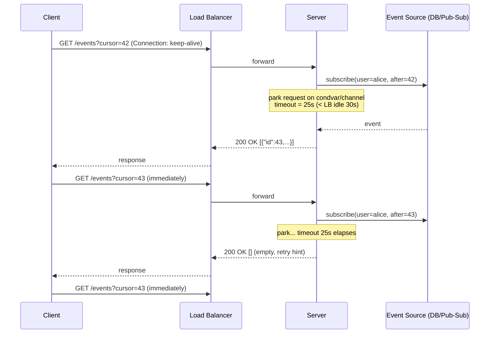
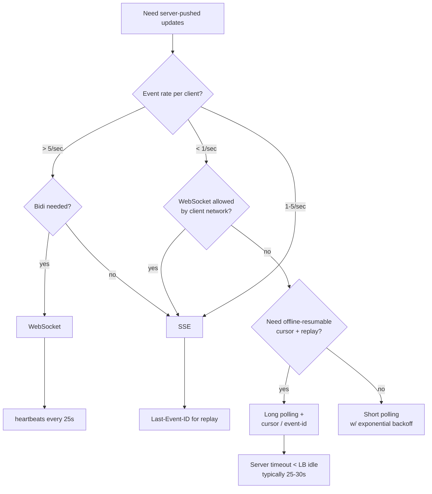
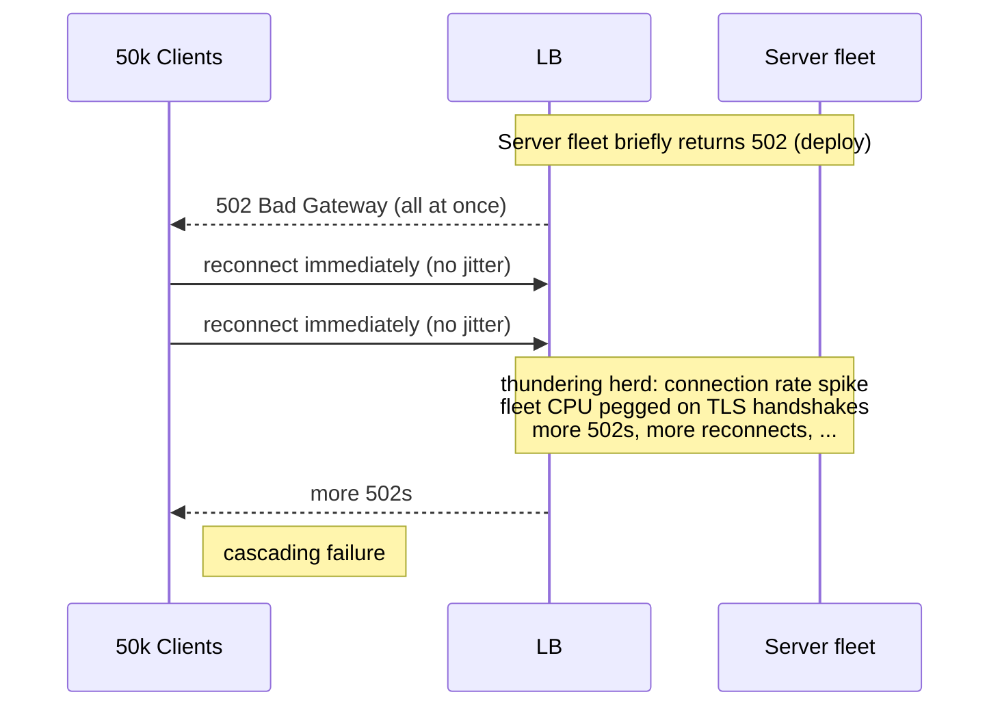

# Long Polling

## Why This Exists

**Problem.** A client wants to be *notified* when something happens server-side (a new chat message, a job completing, a price changing). The naive answer — short polling — burns CPU and bandwidth: 95%+ of requests return "nothing new." The modern answer — WebSockets or SSE — fails in the real world surprisingly often: corporate proxies strip the `Upgrade: websocket` header, IDS appliances drop idle TCP, mobile carriers NAT-timeout long-lived connections, AWS ALB has a 4000-connection-per-target soft limit you'll hit before you expect to, and a sizeable fraction of enterprise users sit behind a forward proxy that only speaks HTTP/1.1 request/response.

Long polling is the **lowest-common-denominator push channel**: a plain HTTP GET that the *server* refuses to answer until either (a) data is available, or (b) a timeout fires. It looks like a normal request to every middlebox between client and server, because it *is* a normal request — just a slow one.

**Key insight.** Move the wait from the client to the server. The client always has exactly one in-flight request; the server holds it open (parked on a condition variable, channel, or pub/sub subscription) until there's something to say. The cost is one held-open TCP socket and one parked goroutine/thread/event-loop slot per connected user — but you pay zero "are we there yet?" round-trips.

**Reach for this when:**
- WebSockets are blocked or unreliable in your client environment (enterprise/health/finance with strict proxies, Kiosk browsers, embedded WebViews on old Android).
- You need bidirectional-feeling messaging but your gateway/CDN doesn't support WS (older CloudFront origins, some API Gateway REST configurations, F5 BIG-IP without explicit WS profile).
- Your event rate per client is low (< ~1 event/second average). Long polling is *fine* at low rates and miserable at high rates — at high rates you're just paying the request-overhead tax repeatedly.
- You want a no-state-on-server-restart channel: each held request is independent.
- You're integrating with something that *requires* it: Slack RTM (deprecated but still around), Facebook Messenger Platform's classic delivery, Atlassian Connect lifecycle, many corporate webhook-receiver patterns.

**Don't reach for this when:**
- You have **high event rates** (> 5/sec/client) → use SSE or WebSockets; long polling becomes a request loop.
- You need **true bidirectional** (client streams to server) → WebSockets. Long polling is server→client only; client→server still needs separate POSTs.
- You need **sub-100ms latency** consistently → the round-trip on each event delivery (close, reconnect, server-side cursor lookup, hold) adds up.
- Your **client count × hold-time** exceeds your connection budget. 100k clients × 30s hold = 100k concurrent connections, which is fine for Go/Node/Erlang, fatal for thread-per-request servers (Tomcat default, Apache prefork).
- You're behind an LB that won't let you raise the **idle timeout** above 60s — you'll be reconnecting too often to be useful.

---

## Diagrams

### Hold-the-request model



### Polling style decision



### Reconnect storm anti-pattern



---

## Core Patterns

### 1. Server-side hold with a cursor (Go)

This is the canonical shape: subscribe to a channel for the user, park until either an event arrives or a timeout fires, return whatever's queued (which may be empty — that's fine).

```go
// handler.go
package events

import (
    "context"
    "encoding/json"
    "net/http"
    "strconv"
    "time"
)

const (
    // CRITICAL: server timeout MUST be less than the smallest middlebox idle timeout
    // on the path (LB, reverse proxy, NAT). ALB default is 60s; we use 25s so the
    // *server* always wins the race and returns a clean 200, not a TCP RST from the LB.
    serverHoldTimeout = 25 * time.Second
)

type Event struct {
    ID   int64           `json:"id"`
    Kind string          `json:"kind"`
    Body json.RawMessage `json:"body"`
}

type Hub interface {
    // Since returns events with id > cursor, blocking up to ctx.Deadline.
    // Returns ([], nil) on timeout — empty array is a normal response.
    Since(ctx context.Context, userID string, cursor int64) ([]Event, error)
}

func LongPollHandler(hub Hub) http.HandlerFunc {
    return func(w http.ResponseWriter, r *http.Request) {
        userID := r.Context().Value("uid").(string)
        cursor, _ := strconv.ParseInt(r.URL.Query().Get("cursor"), 10, 64)

        // Bound the hold. Use the request context so client disconnect cancels promptly.
        ctx, cancel := context.WithTimeout(r.Context(), serverHoldTimeout)
        defer cancel()

        events, err := hub.Since(ctx, userID, cursor)
        if err != nil && ctx.Err() == nil {
            // Real error, not just timeout
            http.Error(w, "internal", http.StatusInternalServerError)
            return
        }

        // Always return 200 + JSON, even on empty. Clients distinguish "nothing yet"
        // (empty array, same cursor) from "go away" (4xx/5xx).
        w.Header().Set("Content-Type", "application/json")
        w.Header().Set("Cache-Control", "no-store")
        // Hint to client: how long to wait before reconnecting on empty.
        // 0 = reconnect immediately. Increase to back off under load.
        w.Header().Set("X-Poll-Interval", "0")

        next := cursor
        if len(events) > 0 {
            next = events[len(events)-1].ID
        }
        json.NewEncoder(w).Encode(map[string]any{
            "events": events,
            "cursor": next,
        })
    }
}
```

### 2. Hub: park-on-channel implementation

The "park" is just a buffered channel per subscriber, fed by whatever produces events (DB CDC, Redis pub/sub, NATS, internal in-memory queue). The trick is delivering events that arrived *between* polls — that's what the cursor is for.

```go
type memHub struct {
    mu      sync.Mutex
    log     []Event              // bounded ring; events evicted after retention window
    waiters map[string][]chan struct{} // userID -> sleepers
}

func (h *memHub) Publish(userID string, ev Event) {
    h.mu.Lock()
    h.log = append(h.log, ev)
    // Wake all waiters for this user. They'll re-check the log under lock.
    for _, ch := range h.waiters[userID] {
        select { case ch <- struct{}{}: default: } // non-blocking
    }
    delete(h.waiters, userID) // one-shot wake
    h.mu.Unlock()
}

func (h *memHub) Since(ctx context.Context, userID string, cursor int64) ([]Event, error) {
    for {
        h.mu.Lock()
        // Fast path: events already past the cursor — return immediately.
        var out []Event
        for _, e := range h.log {
            if e.ID > cursor && belongsTo(e, userID) {
                out = append(out, e)
            }
        }
        if len(out) > 0 {
            h.mu.Unlock()
            return out, nil
        }
        // Slow path: register a waiter, drop the lock, sleep until wake or timeout.
        wake := make(chan struct{}, 1)
        h.waiters[userID] = append(h.waiters[userID], wake)
        h.mu.Unlock()

        select {
        case <-wake:
            // loop and re-scan; another producer raced us
        case <-ctx.Done():
            // Timeout or client disconnect. De-register politely.
            h.mu.Lock()
            h.waiters[userID] = without(h.waiters[userID], wake)
            h.mu.Unlock()
            return nil, nil // empty result is normal on timeout
        }
    }
}
```

> **Subtle point.** Notice the loop after the wake. A waiter cannot trust that "I was woken, therefore there's an event for me" — the producer holds the lock, *then* signals, but the waiter must re-acquire the lock and re-scan. This is the standard condition-variable discipline; getting it wrong gives you lost wakeups.

### 3. Client: reconnect with jitter and capped backoff (TypeScript)

The single biggest operational hazard of long polling is the **reconnect storm**: a transient blip causes every client to reconnect simultaneously, and your fleet eats it.

```ts
// long-poll-client.ts
type Event = { id: number; kind: string; body: unknown };

interface PollOptions {
  url: string;
  onEvent: (ev: Event) => void;
  // Initial backoff in ms. Doubles on each consecutive failure, capped.
  initialBackoffMs?: number;
  maxBackoffMs?: number;
  // Hard cap on consecutive failures before we give up and surface to UX.
  maxFailures?: number;
}

export async function startLongPoll(opts: PollOptions, abort: AbortSignal) {
  let cursor = 0;
  let failures = 0;
  const initial = opts.initialBackoffMs ?? 500;
  const max = opts.maxBackoffMs ?? 30_000;
  const maxFailures = opts.maxFailures ?? 10;

  while (!abort.aborted) {
    try {
      // Per-request timeout slightly LONGER than the server's hold timeout, so
      // the server always wins the race and we get a 200, not a fetch abort.
      const reqAbort = new AbortController();
      const t = setTimeout(() => reqAbort.abort(), 35_000); // server holds 25s

      const res = await fetch(`${opts.url}?cursor=${cursor}`, {
        signal: anySignal([abort, reqAbort.signal]),
        // credentials, headers, etc. omitted
      });
      clearTimeout(t);

      if (res.status === 401) throw new FatalError("auth expired");
      if (res.status === 429) {
        // Server is shedding load. Honor Retry-After.
        const retryAfter = Number(res.headers.get("Retry-After") ?? 5);
        await sleep(retryAfter * 1000);
        continue;
      }
      if (!res.ok) throw new Error(`HTTP ${res.status}`);

      const { events, cursor: next } = await res.json();
      cursor = next;
      failures = 0; // reset on any successful response, including empty
      for (const e of events) opts.onEvent(e);

      // If response was empty, the server already waited ~25s — reconnect
      // immediately. No client-side delay needed.
      // If response had events, also reconnect immediately to drain queue.
    } catch (err) {
      if (abort.aborted) return;
      if (err instanceof FatalError) {
        // Don't loop on auth failure — surface to the user.
        opts.onEvent({ id: -1, kind: "__fatal__", body: String(err) });
        return;
      }
      failures++;
      if (failures >= maxFailures) {
        opts.onEvent({ id: -1, kind: "__giveup__", body: { failures } });
        return;
      }
      // EXPONENTIAL BACKOFF + FULL JITTER (Marc Brooker / AWS Architecture Blog).
      // Without jitter, every client retries on the same wallclock tick.
      const base = Math.min(max, initial * 2 ** (failures - 1));
      const delay = Math.random() * base; // full jitter
      await sleep(delay);
    }
  }
}

function sleep(ms: number) {
  return new Promise((r) => setTimeout(r, ms));
}
```

> **Why "full jitter" and not "equal jitter" or "decorrelated jitter"?** All three are fine. Full jitter (`random(0, base)`) is the simplest and lowest variance for the server fleet. See AWS Architecture Blog "Exponential Backoff and Jitter" — citation in References.

### 4. The cursor: at-least-once delivery and dedup

Long polling without a cursor is broken: if the response goes 200 OK to the LB but the TCP push to the client fails, the client retries with no record of what was delivered, and the next response duplicates events. Always:

1. **Server emits an event ID** (monotonic per stream — DB sequence, Kafka offset, NATS sequence, ULID).
2. **Client persists the last seen cursor** before processing the events (or after — pick one and document the at-least-once vs. at-most-once tradeoff).
3. **Client sends the cursor on every poll.**
4. **Consumers downstream of `onEvent` must be idempotent** — long polling guarantees at-least-once at best.

```python
# Python/aiohttp version of the server side, for completeness
import asyncio
from aiohttp import web

HOLD = 25.0  # seconds; less than the LB idle (60s on ALB default)

async def long_poll(request: web.Request) -> web.Response:
    user = request["user"]
    cursor = int(request.query.get("cursor", 0))
    hub: Hub = request.app["hub"]

    try:
        events = await asyncio.wait_for(
            hub.since(user, cursor),
            timeout=HOLD,
        )
    except asyncio.TimeoutError:
        events = []

    next_cursor = events[-1].id if events else cursor
    return web.json_response(
        {"events": [e.to_dict() for e in events], "cursor": next_cursor},
        headers={"Cache-Control": "no-store"},
    )
```

### 5. Connection budget math

Before you ship, do the arithmetic:

```
concurrent_held_connections ≈ active_clients × (hold_time / (hold_time + processing_time))
```

For 100k active clients, hold=25s, response processing ~0ms:
`100k × 25 / 25 = 100k concurrent open sockets`.

- Linux: bump `nofile` rlimit to 1M (`ulimit -n`); `net.core.somaxconn` and `net.ipv4.tcp_max_syn_backlog`.
- ALB: each target supports ~5k concurrent (soft limit, raisable). Plan target count accordingly.
- NLB: no per-target connection limit but watch ephemeral port exhaustion if NLB sits behind a NAT.
- Server runtime: **goroutines (Go), virtual threads (Java 21+), libuv (Node), Erlang processes — fine.** Thread-per-request (classic Tomcat/Servlet, Apache prefork) — DO NOT use long polling on these without async servlets / Servlet 3.1 async API; you'll exhaust the thread pool at 200 concurrent users.

---

## Trade-offs

| Benefit | Cost |
|---|---|
| Works through every HTTP-aware middlebox; no Upgrade negotiation | One held connection per active client |
| Server can deliver events near-instantly (no polling-interval floor) | Latency floor still ~RTT × 2 per event (close + reconnect + reach hub) |
| Trivially load-balanced — each request is independent | Sticky-sessions complicate horizontal scale; without them, hub must be cross-node (Redis pub/sub etc.) |
| Stateless server restarts — just drop in-flight holds, clients reconnect | Reconnect storm on fleet bounce if no jitter |
| Backpressure is automatic — slow clients hold their socket, get fewer events | At-least-once: clients must dedup |
| Plays nicely with HTTP/2 multiplexing (one TCP, many polls) | HTTP/1.1 keeps the TCP connection occupied — high-concurrency clients need many sockets |
| No special CDN / WAF config | CDN caching MUST be disabled for the poll endpoint (`Cache-Control: no-store`) |
| Resumable via cursor; offline clients catch up on reconnect | Server must retain event log long enough for the worst-case offline window |
| Easier debugging than WS — just `curl` it | Per-request auth cost (TLS resumption helps; HTTP/2 helps more) |

---

## Common Pitfalls

- **LB idle timeout > server hold timeout.** Classic. Server holds 60s, ALB closes at 60s, client gets a TCP RST and a generic network error instead of a clean 200-empty. Always: **server timeout strictly less than every middlebox idle timeout on the path.** Default ALB is 60s, default ELB Classic is 60s, default Nginx `proxy_read_timeout` is 60s, default API Gateway HTTP API is 30s integration timeout. Pick the minimum, subtract a safety margin, that's your hold.
- **No jitter on reconnect.** Deploy at noon, every client reconnects at exactly noon, gateway CPU pegs on TLS handshakes, more 502s, more synchronized reconnects → cascading failure. **Always full-jitter your backoff.**
- **Returning 204 No Content on empty.** Some clients (and some HTTP/2 stacks) treat 204 differently from 200-with-empty-body. Just return `200 [] cursor=N`. It's boring and works.
- **Forgetting `Cache-Control: no-store`.** A misconfigured CDN happily caches your "no events" response for 60s and now nobody gets events. Or worse: caches Alice's events and serves them to Bob.
- **Thread-per-request server.** Tomcat 8 default config: 200 max threads. Long poll: 200 connected users → exhaustion. Use Servlet async API, virtual threads (JDK 21+), or a different server.
- **Holding the DB connection during the wait.** A naive `SELECT … FOR UPDATE WAIT` style hold pins a DB connection per client. Hold a *channel*/*queue* subscription instead; only touch the DB when there's actually something to fetch.
- **No client disconnect detection.** Server holds forever, client has long since closed the tab; the goroutine/thread leaks. Use `request.Context()` (Go) / `req.on('close')` (Node) / async `CancellationToken` (.NET) to abort the wait.
- **Cursor that isn't monotonic.** Using a UUIDv4 as a cursor — congratulations, you can't say "events after this one." Use a sequence, ULID, or Kafka offset. If you must use UUIDs, pair them with a timestamp.
- **At-most-once interpretation.** Treating a 200 from the server as "I saw it" without persisting the cursor means a client crash mid-processing replays nothing. Treating cursor-advance-before-process means a crash drops events. Pick one explicitly.
- **Stale event log.** Client offline for 6 hours, comes back, asks for cursor=42. Your in-memory log only retains the last 5 minutes. You either send a "you must reconnect from scratch" sentinel (and clients re-fetch full state) or persist further back. Don't pretend this case won't happen.
- **HTTP/1.1 head-of-line blocking.** Browser-based clients are limited to 6 connections per origin. If long-poll occupies one full-time, the user's other requests share the remaining 5. Use HTTP/2 to multiplex.
- **Treating the reconnect interval as zero on errors.** Empty 200 → reconnect immediately is correct. 5xx → reconnect immediately is a denial-of-service against your own backend.
- **Authentication in the URL.** Logs leak. Tokens in `Authorization` header; signed cookies for browser flows.
- **Forgetting to test with a real corporate proxy.** Your dev laptop on home wifi will pass tests that fail on a Citrix-fronted enterprise desktop. Find a friend in IT.

---

## Decision Table

| You need | Long polling | Short polling | SSE | WebSocket | gRPC streaming |
|---|---|---|---|---|---|
| Server-pushed events, low rate, anywhere on the internet | **YES** | bandwidth waste | YES if not blocked | YES if not blocked | unlikely from browsers |
| Bidi (client streams to server too) | no (use POST + LP) | no | no | **YES** | **YES** |
| Sub-100ms median latency, > 5 events/sec | mediocre | terrible | **YES** | **YES** | **YES** |
| Resumable on reconnect with replay | YES (cursor) | YES (cursor) | YES (`Last-Event-ID`) | DIY | DIY |
| Survives strict corporate proxies / IDS | **YES** | **YES** | usually | often blocked | often blocked |
| Browser-native | YES | YES | **YES** (`EventSource`) | YES | no (gRPC-Web limited) |
| Mobile battery friendly | OK if hold long | bad | OK | best (idle TCP) | best |
| Server resource per idle client | one held HTTP req | none between polls | one open TCP | one open TCP | one open HTTP/2 stream |
| Supports CDN/edge caching | no | yes | no | no | no |
| Bidirectional middleware (WAF, mTLS) friendly | **YES** | **YES** | YES | mixed | mixed |
| Survives `Connection: close` enterprise proxies | **YES** | **YES** | sometimes | rarely | rarely |
| You can't change the LB / API gateway config | **YES** | **YES** | maybe | rarely | rarely |
| Need server-to-server notification with low op cost | overkill | overkill | OK | OK | **YES** |

---

## References

- Roy Fielding et al. — RFC 9110: HTTP Semantics — https://www.rfc-editor.org/rfc/rfc9110
- Salvatore Loreto et al. — RFC 6202: Known Issues and Best Practices for the Use of Long Polling and Streaming in Bidirectional HTTP — https://www.rfc-editor.org/rfc/rfc6202 (the canonical document on this technique; read it)
- Ian Hickson — HTML Living Standard, Server-Sent Events section — https://html.spec.whatwg.org/multipage/server-sent-events.html
- Ian Fette, Alexey Melnikov — RFC 6455: The WebSocket Protocol — https://www.rfc-editor.org/rfc/rfc6455
- Marc Brooker (AWS) — "Exponential Backoff and Jitter" — https://aws.amazon.com/blogs/architecture/exponential-backoff-and-jitter/
- AWS Builders' Library — "Timeouts, retries, and backoff with jitter" (Marc Brooker) — https://aws.amazon.com/builders-library/timeouts-retries-and-backoff-with-jitter/
- AWS Builders' Library — "Avoiding fallback in distributed systems" — https://aws.amazon.com/builders-library/avoiding-fallback-in-distributed-systems/
- Google SRE Book — Chapter 22, "Addressing Cascading Failures" — https://sre.google/sre-book/addressing-cascading-failures/
- Google SRE Book — Chapter 25, "Data Processing Pipelines" (for at-least-once / cursor reasoning) — https://sre.google/sre-book/data-processing-pipelines/
- Google SRE Workbook — Chapter 11, "Managing Load" — https://sre.google/workbook/managing-load/
- Martin Kleppmann — *Designing Data-Intensive Applications* — Chapter 11, "Stream Processing" (event log + cursor semantics map directly onto long polling)
- Martin Kleppmann — *Designing Data-Intensive Applications* — Chapter 8, "The Trouble with Distributed Systems" (network behavior, partial failure)
- Pat Helland — "Idempotence Is Not a Medical Condition" (ACM Queue) — https://queue.acm.org/detail.cfm?id=2187821 (why your `onEvent` handler must be idempotent under at-least-once)
- Mozilla Developer Network — "Using server-sent events" — https://developer.mozilla.org/en-US/docs/Web/API/Server-sent_events/Using_server-sent_events
- Cloudflare blog — "WebSockets, caution required!" — https://blog.cloudflare.com/websockets-caution-required/ (why corporate environments break WS)
- Adam Wiggins — "The Twelve-Factor App" — https://12factor.net/processes (stateless processes argument applies cleanly to long-poll handlers)
- Alex Xu — *System Design Interview Vol. 1* — Chapter on real-time chat / notification design

---

## See Also

- `../websockets/` — when long polling isn't enough and the network allows persistent upgrades
- `../sse/` — server-sent events: the simpler one-way streaming alternative
- `../webhooks/` — when *both* sides have public endpoints, flip the direction of push
- `../../reliability/circuit-breaker/` — what a reconnect storm becomes if you ignore it
- `../../reliability/load-shedding/` — what to do when the held-connection budget is exceeded
- `../../architecture-patterns/event-sourcing/` — the cursor + log model generalized
