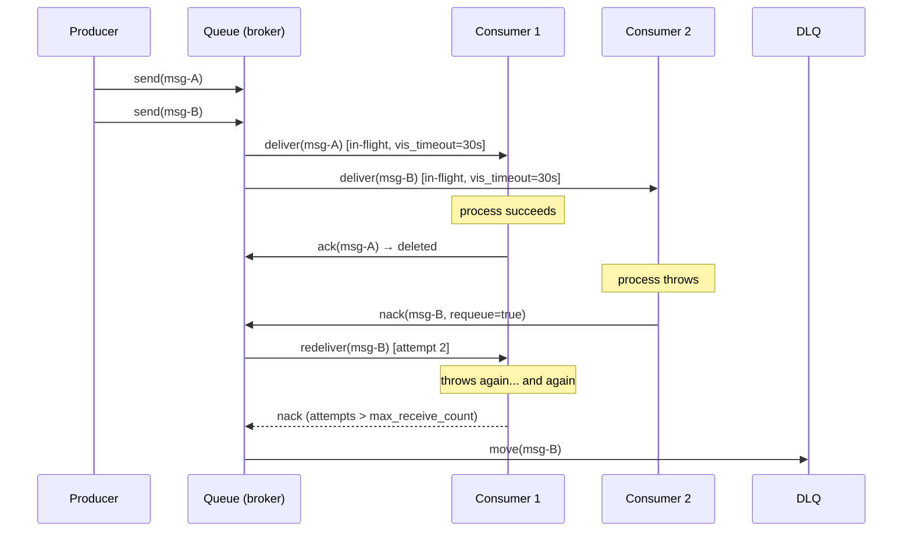
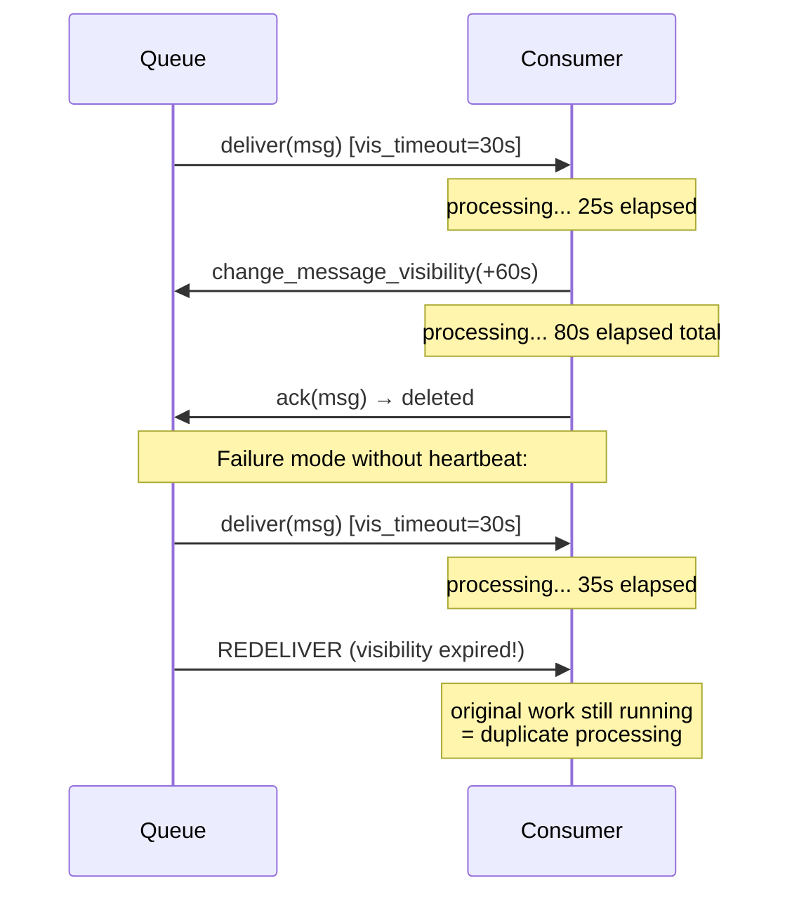
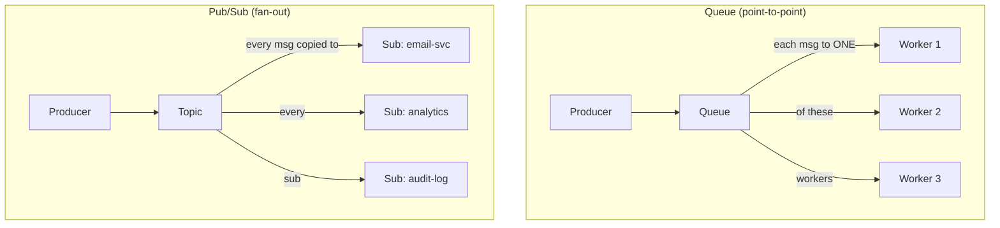

# Message Queues

## Why This Exists

**Problem.** A producer needs to hand off work to a consumer without blocking on it, and the system must survive the consumer crashing mid-process, the producer outpacing the consumer, the network partitioning, or a single message being so toxic it kills every worker that touches it. Synchronous RPC fails all of these. A naive in-memory queue fails the first three.

**Key insight.** A message queue is a **durable, transactional buffer with ack/nack semantics**. Each message is delivered to exactly one consumer in a competing-consumers group; the broker holds the message in an "in-flight" state until the consumer acknowledges success or the lease expires. This converts producer/consumer coupling into two independent failure domains glued together by a broker that is the only thing that has to be reliable.

The four primitives that matter, in order of importance:

1. **Acknowledgement** — the consumer tells the broker "I'm done, delete it." Without ack, the broker assumes failure and redelivers.
2. **Visibility timeout / ack deadline** — once a message is dispatched, it's hidden from other consumers until either acked or the timeout expires (then it becomes visible again).
3. **Dead-letter queue (DLQ)** — after N redeliveries, the message is exiled to a separate queue so it stops blocking the main queue. Operators triage from there.
4. **At-least-once delivery** — the only honest default. Exactly-once is a marketing term in distributed systems; the queue gives you at-least-once and you make your handler idempotent.

**Reach for this when:**
- You need work distribution across N stateless workers (image resizing, email sending, webhook delivery, batch jobs).
- Producer rate is bursty and consumer rate is steady — the queue absorbs the burst.
- The consumer might crash and you must not lose the work.
- Order within a single logical entity matters but global ordering doesn't (use FIFO queues with `MessageGroupId`).
- You want backpressure: queue depth tells the producer (or autoscaler) the consumer is falling behind.

**Don't reach for this when:**
- You need fan-out to many consumer types ("on user signup: email, analytics, CRM, audit"). That's pub/sub — use SNS, EventBridge, Kafka topics, or RabbitMQ fanout exchanges. A queue is one consumer group; subscribing N consumers to the same queue means each message goes to *one* of them, not all.
- You need message replay or long-term retention. Kafka, Kinesis, Pulsar with tiered storage. Queues delete on ack and typically retain undelivered messages for 4–14 days max.
- You need strict global ordering at high throughput. SQS FIFO caps at 300 msg/s per group (3000 with batching). Kafka with a single partition gives you ordering, but you've now built a queue out of a log.
- Sub-millisecond latency end-to-end. A broker hop adds 1–10 ms minimum; in-process channels or RPC are faster.
- The work is so cheap and the consumer so reliable that the broker overhead exceeds the work itself.

## Diagrams

### The competing-consumers pattern with ack/nack



### Visibility timeout — what happens when the consumer is slow



### Queue vs pub/sub — same broker, different topology



## Core patterns

### 1. Idempotent consumer (the only safe default)

At-least-once delivery means **your handler will be called more than once for the same message**. Build the handler to make this a no-op on retries.

```python
# Python — SQS consumer with idempotency via a dedup table
import boto3
import json
import psycopg2
from psycopg2.errors import UniqueViolation

sqs = boto3.client("sqs")
QUEUE_URL = "https://sqs.us-east-1.amazonaws.com/123/orders"

def process_order(conn, msg):
    body = json.loads(msg["Body"])
    # The producer MUST set MessageDeduplicationId or include
    # a stable business key. Receipt handle changes per delivery,
    # so it cannot be the dedup key.
    dedup_key = body["order_id"]

    with conn.cursor() as cur:
        try:
            # Insert into dedup table FIRST, in same txn as the side effect.
            # If we crash after the side effect but before the ack, the next
            # delivery hits this UniqueViolation and we ack without re-charging.
            cur.execute(
                "INSERT INTO processed_orders (order_id, processed_at) "
                "VALUES (%s, now())",
                (dedup_key,),
            )
            charge_card(body["amount"], body["card_token"])  # the real side effect
            conn.commit()
        except UniqueViolation:
            conn.rollback()
            # Already processed — safe to ack and move on.
            return

while True:
    resp = sqs.receive_message(
        QueueUrl=QUEUE_URL,
        MaxNumberOfMessages=10,
        WaitTimeSeconds=20,        # long polling — fewer empty receives
        VisibilityTimeout=60,      # tune to p99 of process_order
    )
    for msg in resp.get("Messages", []):
        try:
            with psycopg2.connect(...) as conn:
                process_order(conn, msg)
            sqs.delete_message(
                QueueUrl=QUEUE_URL,
                ReceiptHandle=msg["ReceiptHandle"],
            )
        except Exception as e:
            # DON'T delete. Let visibility timeout expire and SQS will redeliver.
            # After redrive policy's max_receive_count, it'll go to DLQ automatically.
            log.exception("processing failed; will be redelivered", extra={"msg_id": msg["MessageId"]})
```

**Why dedup-row-then-side-effect, not the other way around:** if you charge the card first and then crash before inserting the dedup row, the next delivery charges again. Inserting the dedup row first means the worst case is a successful insert with no charge — the operator sees an order marked processed but no charge, which is detectable; double-charges are usually not.

For side effects to external systems that don't share your DB transaction (charging Stripe, sending email), you cannot get true atomicity. Use the **outbox pattern** (write the intent to a DB table in the producer's transaction, and a separate relay reads the outbox and publishes to the queue) or rely on the external system's idempotency keys (Stripe's `Idempotency-Key` header, SES message IDs).

### 2. Heartbeat / extend visibility for long jobs

If your handler can take longer than the visibility timeout, you have three choices: increase the timeout, extend it mid-processing, or shard the work. Extending is usually best because it adapts to actual runtime instead of worst-case.

```go
// Go — SQS long-running worker with visibility extension
package main

import (
    "context"
    "log"
    "time"

    "github.com/aws/aws-sdk-go-v2/service/sqs"
    "github.com/aws/aws-sdk-go-v2/service/sqs/types"
)

const (
    initialVisibility = 60 * time.Second
    extendBy          = 60 * time.Second
    extendInterval    = 45 * time.Second // extend BEFORE expiry
)

func processWithHeartbeat(ctx context.Context, client *sqs.Client, queueURL string, msg types.Message) error {
    ctx, cancel := context.WithCancel(ctx)
    defer cancel()

    // Heartbeat goroutine extends visibility until the work completes or fails.
    go func() {
        t := time.NewTicker(extendInterval)
        defer t.Stop()
        for {
            select {
            case <-ctx.Done():
                return
            case <-t.C:
                _, err := client.ChangeMessageVisibility(ctx, &sqs.ChangeMessageVisibilityInput{
                    QueueUrl:          &queueURL,
                    ReceiptHandle:     msg.ReceiptHandle,
                    VisibilityTimeout: int32(extendBy.Seconds()),
                })
                if err != nil {
                    // Heartbeat failed. The message will become visible and be redelivered.
                    // We must abort our work or risk duplicate processing.
                    log.Printf("heartbeat failed, aborting: %v", err)
                    cancel()
                    return
                }
            }
        }
    }()

    // The actual work. MUST honor ctx cancellation.
    return doExpensiveWork(ctx, *msg.Body)
}
```

**Trap:** if your work doesn't honor `ctx.Done()`, the heartbeat goroutine cancelling won't actually stop it, and you'll get duplicate processing when the message is redelivered. Always plumb context through.

### 3. Dead-letter queue with redrive policy

DLQs catch poison messages — ones that fail every time, usually due to a bug, schema mismatch, or unrecoverable downstream state. Without a DLQ, a single bad message can block the queue (head-of-line blocking) or burn CPU forever in a redelivery loop.

```yaml
# AWS CDK / CloudFormation — SQS with DLQ redrive
Resources:
  OrdersDLQ:
    Type: AWS::SQS::Queue
    Properties:
      QueueName: orders-dlq
      MessageRetentionPeriod: 1209600   # 14 days, the max — give ops time

  OrdersQueue:
    Type: AWS::SQS::Queue
    Properties:
      QueueName: orders
      VisibilityTimeout: 60
      MessageRetentionPeriod: 345600    # 4 days
      RedrivePolicy:
        deadLetterTargetArn: !GetAtt OrdersDLQ.Arn
        maxReceiveCount: 5              # 5 attempts, then exile
```

**Tuning `maxReceiveCount`:** too low (1–2) and transient failures (a brief downstream blip) push valid work to the DLQ. Too high (50+) and a poison message wastes consumer cycles for hours. **5–10 is the usual sweet spot** for an idempotent handler with exponential backoff or a steady visibility timeout.

**Always alarm on DLQ depth.** A non-zero DLQ is a bug or a downstream incident. Wire `ApproximateNumberOfMessagesVisible > 0` to your pager. Do not redrive blind — read a sample first, find the root cause, fix the consumer, then redrive.

### 4. Queue depth as a backpressure / autoscaling signal

The "right" number of consumers is the one that keeps queue depth flat or trending down. Use depth and oldest-message-age as autoscaling signals.

```yaml
# Kubernetes HPA via KEDA — scale workers on SQS depth
apiVersion: keda.sh/v1alpha1
kind: ScaledObject
metadata:
  name: order-worker
spec:
  scaleTargetRef:
    name: order-worker-deployment
  minReplicaCount: 2
  maxReplicaCount: 50
  triggers:
    - type: aws-sqs-queue
      metadata:
        queueURL: https://sqs.us-east-1.amazonaws.com/123/orders
        queueLength: "30"        # target ~30 msgs in flight per pod
        awsRegion: us-east-1
        identityOwner: pod
```

**Why depth and not CPU:** CPU goes to 100% on a tight handler regardless of how much work is queued. Depth tracks the actual demand. Pair with `ApproximateAgeOfOldestMessage` — if oldest age grows while depth is flat, your consumers are processing but falling behind, which means you need to scale out **or** you have a poison message stalling a partition (FIFO).

## Broker-by-broker quick reference

### SQS (Amazon)

- Fully managed, no broker to run. Standard or FIFO.
- **Standard:** at-least-once, best-effort ordering, near-unlimited throughput. Use this 90% of the time.
- **FIFO:** exactly-once *receipt* (5-min dedup window), strict order within `MessageGroupId`. 300 msg/s per group, 3000 with batching. Use when ordering per-entity matters (per-user, per-account).
- Long polling (`WaitTimeSeconds=20`) is free and dramatically reduces empty receives. **Always use it.**
- Max message size: 256 KB. For larger, use the SQS Extended Client Library (S3 pointer) or just put the payload in S3 and send the key.
- DLQ via redrive policy is native — no extra infrastructure.
- Cost: pay per request and per GB transferred. ~$0.40 per million requests (standard).

### RabbitMQ

- Self-hosted (or AmazonMQ for managed). AMQP 0.9.1 protocol.
- Routing model is exchanges (direct, topic, fanout, headers) → bindings → queues. More flexible than SQS but more to operate.
- **Per-message acks** (`basic.ack`, `basic.nack`, `basic.reject`). `nack` with `requeue=true` puts it back at the head, which causes redelivery storms with poison messages — prefer `requeue=false` plus a DLX (dead-letter exchange).
- **Quorum queues** (Raft-based, since 3.8) are the modern default. Classic mirrored queues are deprecated.
- Lazy queues page to disk eagerly — use them when queues can grow large.
- **Prefetch (QoS):** set `basic.qos(prefetch_count=N)` per consumer. Default of "unlimited" causes one greedy consumer to grab everything. Start at `prefetch=10–50` for small jobs, `prefetch=1` for long jobs.

```python
# Python (pika) — RabbitMQ consumer with prefetch and DLX
import pika

conn = pika.BlockingConnection(pika.URLParameters("amqp://localhost"))
ch = conn.channel()

# Main queue with DLX configured
ch.queue_declare(
    queue="orders",
    durable=True,
    arguments={
        "x-dead-letter-exchange": "orders-dlx",
        "x-dead-letter-routing-key": "orders.failed",
        "x-delivery-limit": 5,                # quorum queue equivalent of maxReceiveCount
        "x-queue-type": "quorum",
    },
)
ch.basic_qos(prefetch_count=20)  # don't grab more than 20 unacked at once

def on_message(ch, method, props, body):
    try:
        process(body)
        ch.basic_ack(method.delivery_tag)
    except TransientError:
        ch.basic_nack(method.delivery_tag, requeue=True)   # try again
    except PermanentError:
        ch.basic_nack(method.delivery_tag, requeue=False)  # → DLX

ch.basic_consume(queue="orders", on_message_callback=on_message)
ch.start_consuming()
```

### Azure Service Bus

- Managed broker, AMQP 1.0. Queues + topics-with-subscriptions in one product.
- **Peek-lock vs receive-and-delete:** peek-lock is the sane default (equivalent to ack/nack). Receive-and-delete is at-most-once (rare use case).
- **Lock duration** is the visibility timeout equivalent (max 5 min, but you can renew). `MaxAutoLockRenewalDuration` in the SDK auto-renews up to a cap.
- Native **scheduled messages** (deliver at time T) and **deferred messages** (set aside, fetch later by sequence number) — useful for delayed retries without a separate scheduler.
- Sessions = `MessageGroupId` equivalent for FIFO-per-key.
- Premium tier supports message size up to 100 MB; Standard caps at 256 KB.

### ActiveMQ (Classic and Artemis)

- Self-hosted. Classic supports OpenWire, STOMP, AMQP, MQTT. Artemis is the modern rewrite (faster, journal-based).
- **JMS-first** semantics — strong fit for Java/Spring shops with existing JMS code.
- Ack modes: `AUTO_ACKNOWLEDGE`, `CLIENT_ACKNOWLEDGE`, `SESSION_TRANSACTED`, `INDIVIDUAL_ACKNOWLEDGE`. The first is dangerous (acks on receipt, not on processing) — almost always use `CLIENT_ACKNOWLEDGE` or transacted sessions.
- DLQ is automatic for messages that exceed `maximumRedeliveries` (default 6).
- Operationally heavier than RabbitMQ for similar functionality. Most greenfield projects pick RabbitMQ, Kafka, or a managed cloud broker instead.

## Trade-offs

| Benefit | Cost |
|---|---|
| Producer/consumer decoupling — each can fail independently | Extra infrastructure to operate (or a managed-service bill) |
| Burst absorption — queue smooths spikes | Latency floor of a broker round-trip (1–10 ms) |
| At-least-once durability — work is not lost on crash | Handler MUST be idempotent; this is non-trivial design work |
| Backpressure signal via queue depth | If consumers can't keep up, queue grows until retention expires and you start losing work |
| DLQ isolates poison messages | DLQ requires its own monitoring + ops process; "set and forget" means rotting messages |
| Competing consumers scale horizontally | Strict global ordering is incompatible with this — pick one |
| Visibility timeout prevents lost work on crash | Wrong timeout → either redelivery storms (too short) or slow failure recovery (too long) |
| Cheap to set up (especially SQS) | Hard to migrate later — message schemas are de facto APIs across teams |

## Common Pitfalls

- **Acking before processing.** "auto-ack" or `AUTO_ACKNOWLEDGE` mode acks on receipt. The consumer crashes mid-process → message is gone forever. Always ack *after* the side effect commits.
- **Non-idempotent handlers.** "We'll handle exactly-once with FIFO." FIFO's dedup is a 5-minute receipt window — if your retry happens 6 minutes later (because the visibility timeout was huge or DLQ was redriven), you process twice. Idempotency at the handler is the only durable solution.
- **Visibility timeout shorter than p99 processing time.** Slow handler doesn't finish in time → broker redelivers → second consumer starts the work → first consumer finishes and acks → second consumer also finishes → duplicate side effects, or a unique-constraint violation. Measure p99 of your handler and set timeout to 2–3× that, or use heartbeating.
- **Visibility timeout dramatically longer than processing time.** Consumer crashes hard (OOM, kernel panic) → message stays invisible for 30 minutes → big latency stall. Tune to actual p99 + headroom.
- **Treating a queue as pub/sub.** Subscribing two services to the same SQS queue means each message goes to one of them, randomly. The other service silently misses half the messages. Use SNS→SQS fan-out, EventBridge, or RabbitMQ topic exchanges.
- **Treating a queue as Kafka.** Once acked, the message is gone. You can't replay yesterday's traffic against a new version of the consumer. If you need replay, you need a log (Kafka, Kinesis, Pulsar).
- **No DLQ alarm.** Messages pile up in the DLQ for weeks; nobody notices. Then someone "redrives" the DLQ during an unrelated incident and floods the main queue with stale or now-invalid messages.
- **Redriving a DLQ blind.** Always sample, root-cause, fix the consumer, *then* redrive. Otherwise you'll redrive into the same failure and burn through `maxReceiveCount` again.
- **Unbounded prefetch in RabbitMQ.** One consumer grabs 10,000 messages, others starve, and if it crashes you've lost (well, requeued, but with massive head-of-line blocking). Set `prefetch_count` per consumer.
- **Putting large payloads on the queue.** 256 KB ceilings hurt. Use S3/blob storage and send the pointer. Bonus: you can re-process by re-emitting the same pointer.
- **Cross-region producers writing to a single-region queue.** Inter-region latency dominates. Queue the message regionally and replicate downstream, or use a globally-distributed broker (EventBridge global endpoints, multi-region SNS→SQS).
- **Mixing message types in one queue.** "We'll route by `event_type` field." Now a slow `image-resize` message blocks `send-email` messages behind it. One queue per workload class.
- **Trusting the producer's clock for ordering.** Clocks skew. If order matters, use FIFO `MessageGroupId` plus a monotonic per-group sequence number generated server-side (or use a log).
- **Forgetting to delete the message after success in SQS.** SQS doesn't ack — you call `DeleteMessage` after success. Forgetting means redelivery after the visibility timeout.
- **Long polling not enabled.** SQS short-polling burns money on empty receives and adds latency. Set `WaitTimeSeconds=20`.

## Decision Table

| Situation | Choose | Why |
|---|---|---|
| Hand off background work, AWS-native, no ops appetite | **SQS Standard** | Managed, cheap, infinite scale, native DLQ |
| Per-user/per-account ordering, low-medium throughput | **SQS FIFO** or **Service Bus sessions** | Order per `MessageGroupId`, dedup window |
| Java/Spring shop with existing JMS, need rich routing | **ActiveMQ Artemis** or **RabbitMQ** | JMS support, mature ecosystem |
| Multi-language shop, complex routing, self-hosted OK | **RabbitMQ** (quorum queues) | AMQP 0.9.1, exchanges/bindings, broad client support |
| Azure-native, want scheduled + deferred messages built in | **Azure Service Bus** | First-class scheduling, sessions, dead-lettering |
| Need to replay history or fan out to many consumer types | **Kafka / Kinesis / Pulsar** (not a queue) | Log-based, retains messages, multiple consumer groups |
| Strict global ordering at high throughput | **Kafka with single partition** (and accept the throughput cap) | Queues either don't guarantee order or can't scale per group |
| Multi-cast to N service types on one event | **SNS→SQS** or **EventBridge** or **RabbitMQ fanout** | Pub/sub, not point-to-point |
| Sub-millisecond latency, in-process | **Channels / actors / direct RPC** | A broker hop is too slow |
| Cross-cloud, vendor-neutral | **RabbitMQ** or **Kafka** self-hosted | No cloud lock-in |
| Tiny scale, "I just need a buffer" | **Redis Streams** or **Redis lists with BLPOP** | Already running Redis? Done. (But: limited durability guarantees vs. dedicated brokers) |
| Need request/response over a queue | **RabbitMQ RPC pattern** with `reply_to` | Not ideal — consider gRPC instead unless you need durability |

### Queue vs Pub/Sub vs Log — the canonical confusion

| Property | Queue (SQS, RabbitMQ queue) | Pub/Sub (SNS, EventBridge, RabbitMQ fanout) | Log (Kafka, Kinesis) |
|---|---|---|---|
| Delivery topology | One message → one consumer in a group | One message → every subscriber | One message → every consumer group, replayable |
| Retention after delivery | Deleted on ack | Best-effort, often no retention | Retained for configured period (hours to forever) |
| Consumer add-after-the-fact | New consumer sees only future messages | Same | New consumer can replay from offset 0 |
| Ordering | Per-group (FIFO) or none | Generally none | Per-partition |
| Throughput ceiling | Very high (Standard SQS effectively unbounded) | High | Very high (partitions scale linearly) |
| Operational complexity | Low (managed) to medium | Low | High (rebalances, partitions, retention tuning) |
| Mental model | Worker pool | Event bus | Distributed commit log |

## References

- Kleppmann, Martin — *Designing Data-Intensive Applications* — ch. 11 "Stream Processing", esp. "Messaging Systems" and "Brokered vs Direct Messaging" — https://dataintensive.net/
- Helland, Pat — *Idempotence Is Not a Medical Condition* (Communications of the ACM, 2012) — https://queue.acm.org/detail.cfm?id=2187821
- Helland, Pat — *Life Beyond Distributed Transactions* — https://queue.acm.org/detail.cfm?id=3025012
- Amazon — *AWS Builders' Library: Avoiding insurmountable queue backlogs* (David Yanacek) — https://aws.amazon.com/builders-library/avoiding-insurmountable-queue-backlogs/
- Amazon — *AWS Builders' Library: Avoiding fallback in distributed systems* — https://aws.amazon.com/builders-library/avoiding-fallback-in-distributed-systems/
- Amazon — *SQS Developer Guide: visibility timeout, redrive policy, DLQ* — https://docs.aws.amazon.com/AWSSimpleQueueService/latest/SQSDeveloperGuide/sqs-visibility-timeout.html
- Amazon — *SQS FIFO queues — exactly-once processing* — https://docs.aws.amazon.com/AWSSimpleQueueService/latest/SQSDeveloperGuide/FIFO-queues.html
- Pivotal / VMware — *RabbitMQ Quorum Queues* — https://www.rabbitmq.com/quorum-queues.html
- Pivotal / VMware — *RabbitMQ Reliability Guide (publisher confirms, consumer acks)* — https://www.rabbitmq.com/reliability.html
- Pivotal / VMware — *RabbitMQ Consumer Prefetch* — https://www.rabbitmq.com/consumer-prefetch.html
- Microsoft — *Azure Service Bus messaging overview* — https://learn.microsoft.com/azure/service-bus-messaging/service-bus-messaging-overview
- Microsoft — *Azure Service Bus message transfers, locks, and settlement* — https://learn.microsoft.com/azure/service-bus-messaging/message-transfers-locks-settlement
- Apache — *ActiveMQ Artemis User Manual* — https://activemq.apache.org/components/artemis/documentation/
- Hohpe, Gregor & Woolf, Bobby — *Enterprise Integration Patterns* (Competing Consumers, Dead Letter Channel, Idempotent Receiver) — https://www.enterpriseintegrationpatterns.com/
- Google SRE Book — ch. 22 "Addressing Cascading Failures" — https://sre.google/sre-book/addressing-cascading-failures/
- Google SRE Workbook — ch. 8 "On-Call" and ch. 11 "Managing Load" — https://sre.google/workbook/managing-load/
- Fowler, Martin — *What do you mean by "Event-Driven"?* — https://martinfowler.com/articles/201701-event-driven.html
- Microservices.io — *Transactional Outbox pattern* (Chris Richardson) — https://microservices.io/patterns/data/transactional-outbox.html
- KEDA — *Scaling Kubernetes workloads from queue depth* — https://keda.sh/docs/scalers/aws-sqs/

## See Also

- `../pub-sub/` — when one event needs to fan out to many consumer types
- `../../architecture-patterns/event-driven/` — broader architectural pattern that uses queues as the transport
- `../webhooks/` — push delivery to external systems, often backed by an internal queue
- `../idempotency/` — the discipline that makes at-least-once delivery safe
- `../../reliability/retries-backoff/` — how producers and consumers should handle transient failures
- `../../reliability/circuit-breaker/` — protecting downstreams when queue depth signals overload
