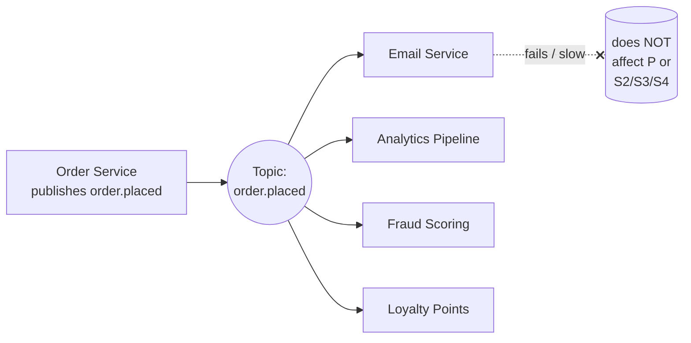
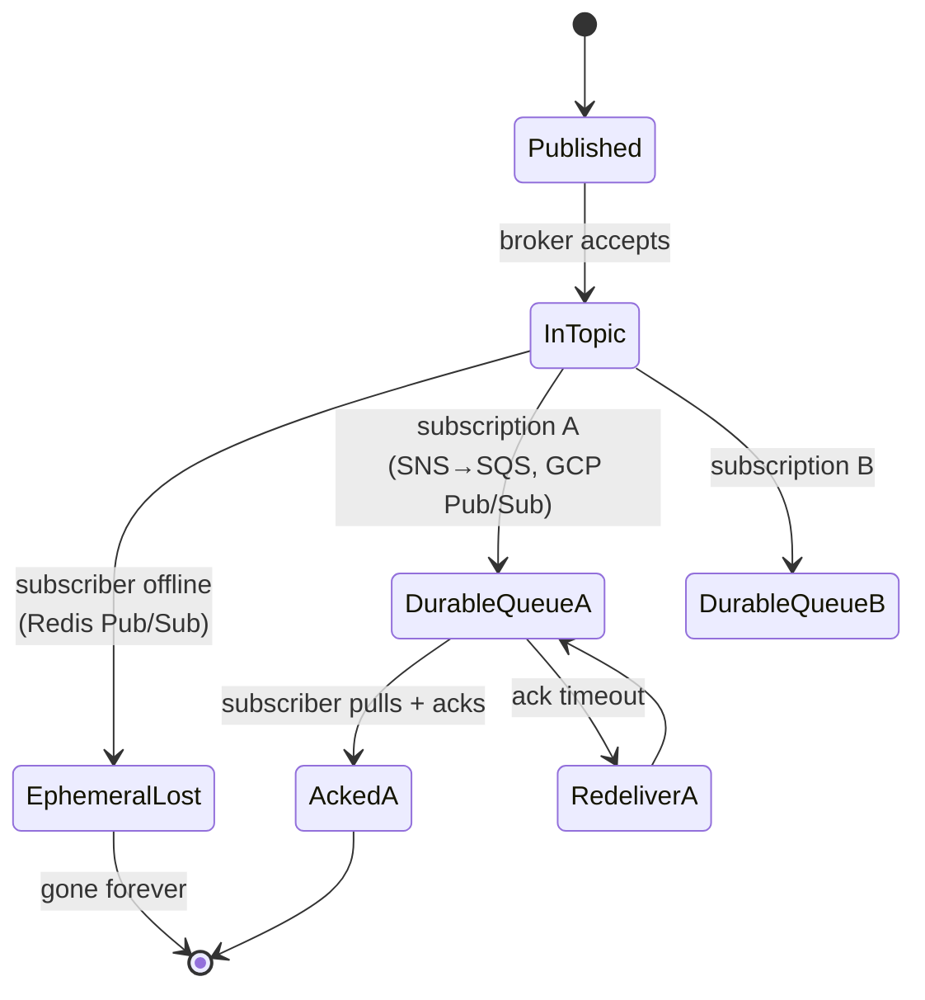
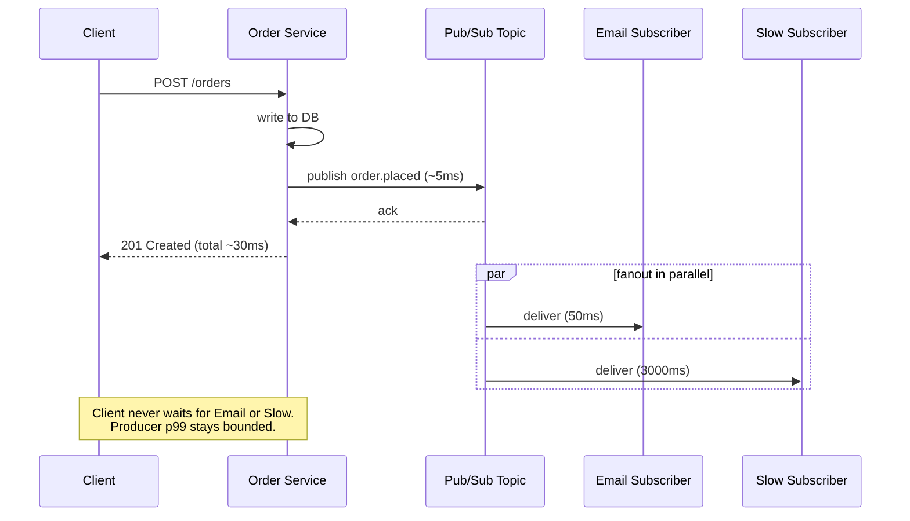

# Pub/Sub (Publish-Subscribe Messaging)

## Why This Exists

**Problem.** Direct service-to-service calls force the producer to know every consumer. Every new use case (`order.placed` should also trigger fraud-scoring, loyalty-point accrual, warehouse pre-allocation, marketing-pixel firing, data-lake ingestion) means another deploy of the order service. The producer's tail latency and availability now equals the *worst* of all downstream services. When the email service is slow, checkout slows. When analytics is down, checkout 500s.

**Key insight.** *The producer should not know who is listening.* A message is published to a logical **topic**; the broker fans it out to whatever subscribers exist at that moment. Adding consumer N+1 is a subscription change — no producer code touched. Producer latency becomes the latency of writing to the broker, decoupled from any subscriber's processing time.

This is **n-of-n delivery semantics** (one message → N independent consumers each get a copy), as opposed to **competing consumers / work queue** (one message → exactly one of N workers processes it). The two patterns look superficially similar but have fundamentally different durability, ordering, and failure behavior. Mixing them up is one of the top three sources of distributed-system bugs.

**Reach for this when:**
- You have an *event* (something happened) that ≥2 unrelated systems care about, and you expect that list to grow.
- The producer should fire-and-forget — it can't wait for, or be hurt by, slow subscribers.
- Subscribers can tolerate independent processing (no cross-consumer ordering / transactional guarantees).
- You want to add new consumers without redeploying producers.
- Use cases: cache invalidation, audit logging, denormalized read-model updates, notifications/email/SMS, webhooks, analytics streaming, "thing changed" broadcasts.

**Don't reach for this when:**
- You need a *response* — that's RPC, not pub/sub. (Use REST/gRPC, or request/reply over a queue with correlation IDs.)
- You need exactly-one consumer to process each message (load-balancing) — that's a **work queue** (SQS, RabbitMQ work queue, Kafka with single consumer group).
- You need strict global ordering and replay over months — that's a **log** (Kafka, Pulsar, Kinesis). Pub/Sub topics are usually ephemeral; logs are explicitly durable and seekable.
- You need transactional dual-write semantics ("write to DB *and* publish atomically") — use the **outbox pattern** (see `../../data-systems/outbox/`), not a naked publish.
- The "event" is actually a command ("charge this card"). Commands have one logical owner; events have many readers. Misnaming commands as events leads to multiple subscribers double-acting on a single intent.

## Diagrams

### Fanout topology



Each subscriber gets its **own copy** of the message. A failure in one subscriber doesn't block others. The producer's latency budget is "write to broker" — not "wait for fanout to complete."

### Push vs pull, durable vs ephemeral



**Durable subscription** = each subscription has its own server-side queue/cursor; messages survive subscriber downtime until acked or TTL expires. **Ephemeral subscription** = if you weren't connected when the message was published, it never existed for you. Redis Pub/Sub is ephemeral. SNS-only is ephemeral. SNS→SQS is durable. GCP Pub/Sub is durable by default. Kafka is durable (log-based). *This single property determines whether your system silently loses data after a deploy.*

### Producer side latency decoupling



## Core Patterns and Code

### 1. AWS SNS — topic with multiple SQS queue subscribers

The canonical durable fanout on AWS. **SNS alone is push-only and ephemeral** — if your HTTP/Lambda subscriber is down, SNS retries with exponential backoff and then drops to a Dead Letter Queue (DLQ) you must configure. **The robust pattern is SNS → SQS per subscriber**, where SQS provides the durable per-consumer buffer.

```python
# producer.py
import boto3, json, uuid
sns = boto3.client("sns")

def publish_order_placed(order):
    sns.publish(
        TopicArn="arn:aws:sns:us-east-1:111122223333:order-events",
        Message=json.dumps({
            "event_id": str(uuid.uuid4()),       # for idempotency at consumer
            "event_type": "order.placed",
            "schema_version": 1,                 # ALWAYS version your schema
            "occurred_at": order["created_at"],  # event time, not delivery time
            "order_id": order["id"],
            "customer_id": order["customer_id"],
            "amount_cents": order["amount_cents"],
        }),
        # MessageAttributes drive subscription FILTER POLICIES — keep filterable
        # fields here so subscribers receive only what they need.
        MessageAttributes={
            "event_type": {"DataType": "String", "StringValue": "order.placed"},
            "country":    {"DataType": "String", "StringValue": order["country"]},
        },
    )
```

```yaml
# infra (CDK / Terraform sketch). Each subscriber owns its own SQS queue + DLQ.
# This is the WHOLE point: Email Service can be down for 2h and lose nothing.
TopicArn: order-events
Subscriptions:
  - Endpoint: email-svc-queue           # SQS
    FilterPolicy: { event_type: ["order.placed", "order.cancelled"] }
    RedrivePolicy: { deadLetterTargetArn: email-svc-dlq, maxReceiveCount: 5 }
  - Endpoint: analytics-svc-queue
    FilterPolicy: { event_type: [{"prefix": "order."}] }     # all order.* events
  - Endpoint: fraud-svc-queue
    FilterPolicy: { event_type: ["order.placed"], country: [{"anything-but": ["KP","IR"]}] }
```

```python
# consumer.py — at-least-once. You MUST be idempotent.
import boto3, json
sqs = boto3.client("sqs")
QUEUE_URL = "..."

def run():
    while True:
        resp = sqs.receive_message(
            QueueUrl=QUEUE_URL,
            MaxNumberOfMessages=10,
            WaitTimeSeconds=20,        # long-poll. NEVER set this to 0 (busy-loop, $$$)
            VisibilityTimeout=60,      # must be > worst-case processing time
        )
        for msg in resp.get("Messages", []):
            try:
                envelope = json.loads(msg["Body"])
                event = json.loads(envelope["Message"])  # SNS wraps the payload
                handle(event)
                sqs.delete_message(QueueUrl=QUEUE_URL, ReceiptHandle=msg["ReceiptHandle"])
            except Exception:
                # DO NOT delete -> message becomes visible again after VisibilityTimeout
                # and is redelivered. After maxReceiveCount it goes to DLQ.
                log.exception("processing failed, will redeliver")

def handle(event):
    # Idempotency key: SNS may deliver the same event_id more than once,
    # AND your own retry on partial failure also re-runs this handler.
    if seen_recently(event["event_id"]):
        return
    with db.transaction():
        do_work(event)
        mark_seen(event["event_id"], ttl_days=14)
```

### 2. GCP Pub/Sub — durable subscriptions, push or pull

GCP Pub/Sub gets the model right out of the box: a **topic** has N **subscriptions**, each subscription is its own durable cursor. Messages persist (default 7 days, max 31) until every subscription acks or TTL expires. Each subscription can independently choose push (HTTP POST) or pull (streaming).

```python
# producer
from google.cloud import pubsub_v1
publisher = pubsub_v1.PublisherClient()
topic = publisher.topic_path("my-proj", "order-events")

def publish(event: dict):
    data = json.dumps(event).encode("utf-8")
    future = publisher.publish(
        topic, data,
        event_type=event["event_type"],
        # Ordering key: messages with the same key are delivered in order
        # to a single subscriber. WARNING: enabling ordering on a subscription
        # disables parallel pull from multiple workers for that key, capping throughput.
        ordering_key=event.get("aggregate_id", ""),
    )
    return future.result(timeout=30)  # blocks; raises on publish failure
```

```python
# pull subscriber with explicit ack
from google.cloud import pubsub_v1
subscriber = pubsub_v1.SubscriberClient()
sub_path = subscriber.subscription_path("my-proj", "email-svc-sub")

def callback(message):
    try:
        event = json.loads(message.data)
        handle(event)
        message.ack()
    except TransientError:
        message.nack()        # immediate redelivery (or follow ack-deadline)
    except PoisonError:
        log.error("poison message %s", message.message_id)
        message.ack()         # acks AND your DLQ subscription separately captures it
                              # OR configure a DeadLetterPolicy on the subscription:
                              # max_delivery_attempts=5 -> auto-route to DLQ topic.

streaming = subscriber.subscribe(sub_path, callback=callback)
streaming.result()
```

Subscription-level features that matter:
- `messageRetentionDuration` — how long unacked messages live (up to 31 days).
- `enableExactlyOnceDelivery` — *strong* dedup within a small window. Throughput drops; do not assume cross-replica exactly-once. Still be idempotent.
- `deadLetterPolicy` — auto-publish to a DLQ topic after N delivery attempts.
- `retryPolicy` — exponential backoff between redeliveries.
- `filter` — server-side attribute filter so the subscription only receives matching messages (saves egress).

### 3. Redis Pub/Sub — ephemeral, in-memory, fire-and-forget

Redis `PUBLISH`/`SUBSCRIBE` is the simplest possible pub/sub. **Subscribers must be connected at publish time. Messages are not buffered. Delivery is at-most-once. The broker has zero durability for pub/sub.** A SUBSCRIBE client that drops its connection for 50ms loses every message published in that window — silently.

```python
# Use only when message loss is genuinely OK:
# - WebSocket / SSE fanout for live UI updates
# - Best-effort cache invalidation between local processes
# - Real-time chat presence ("user typing")
# DO NOT use for: payments, orders, anything where loss = data corruption.

import redis
r = redis.Redis()

# publisher
r.publish("price-updates", json.dumps({"sku": "X1", "price": 1999}))

# subscriber
pubsub = r.pubsub()
pubsub.subscribe("price-updates")
for msg in pubsub.listen():
    if msg["type"] == "message":
        update_in_memory_cache(json.loads(msg["data"]))
```

If you want durability on Redis, use **Redis Streams** (`XADD`/`XREADGROUP`) — that's a Kafka-like log, *not* pub/sub. Different data structure, different command family, different semantics. (See `../../data-systems/event-logs/`.)

### 4. Filter at the broker, not at the subscriber

A common anti-pattern: every subscriber receives every event and filters in code. This wastes egress, CPU, and ack-deadline budget. All major brokers support server-side filtering — use it.

```python
# SNS subscription filter policy (JSON)
{
  "event_type": ["order.placed", "order.cancelled"],
  "amount_cents": [{"numeric": [">", 50000]}]   # only high-value orders
}
```

```python
# GCP Pub/Sub subscription filter
filter = 'attributes.event_type = "order.placed" AND attributes.country != "KP"'
```

Server-side filtering reduces cost (delivered messages × bytes) and dramatically improves consumer health (fewer wake-ups, fewer trivial acks, less risk of lag-induced redelivery storms).

## Delivery Semantics, Bluntly

| Semantic | What it actually means | Where you find it |
|---|---|---|
| **At-most-once** | Each message delivered 0 or 1 times. Lossy on subscriber outage. Cheap, fast. | Redis Pub/Sub. UDP-style. |
| **At-least-once** | Each message delivered 1+ times. **Duplicates WILL happen** — every retry, every visibility timeout, every broker rebalance. Idempotency is not optional. | SNS+SQS, GCP Pub/Sub (default), Kafka (default), RabbitMQ with ack. |
| **Effectively-once** | At-least-once + idempotent consumer + dedup store. The only honest "exactly-once" you'll get in production. | What you build on top. |
| **"Exactly-once"** | A vendor feature that is real but narrowly scoped — usually within one broker and one consumer group, with throughput penalty. Does not extend to your downstream side effects (writes to your DB, calls to a payment API). | Kafka EOS for stream-to-stream; GCP Pub/Sub `enableExactlyOnceDelivery`. |

**The rule:** assume at-least-once. Make every consumer idempotent. Persist a `processed_event_ids` set with TTL ≥ broker retention. If you can't make a side effect idempotent natively (e.g., `POST /charge`), use an idempotency key on that downstream call.

## Pub/Sub vs Kafka (topic + consumer group)

These two get confused constantly because Kafka also has topics and subscribers. They are **fundamentally different abstractions**:

| Aspect | Pub/Sub broker (SNS, GCP, Redis) | Kafka / Pulsar / Kinesis (log) |
|---|---|---|
| Storage model | Per-subscription queue. Once acked, gone. | **Append-only log.** All consumers read the same persisted log via offsets. |
| Replay | No. Acked = unrecoverable. | Yes. Rewind offset to any retained point (days/weeks/forever). |
| New consumer joining | Sees only messages after subscribe. | Can read from offset 0 — get the entire history. |
| Ordering | Best-effort or per-key (with throughput cost). | Strict per-partition ordering. |
| Throughput per topic | Massive horizontal fanout, modest single-stream throughput. | Massive single-stream throughput via partitions. |
| Good fit | Notifications, fanout to N independent services. | Event sourcing, stream processing, high-volume analytics, source-of-truth event log. |
| Operational cost | Low (managed, pay-per-message). | Higher (cluster, partitions, rebalances, ZK/KRaft). |
| Mental model | "Broadcast and forget." | "Replicated, replayable transaction log." |

**Kafka with N consumer groups *is* fanout** — each consumer group is effectively a subscription with its own offset. But you also got: replay, strict ordering per partition, multi-day retention, the ability to bootstrap a brand-new service against historical events. If you need any of that, Kafka. If you just need "tell N services that a thing happened," a managed pub/sub is simpler and cheaper.

A useful heuristic: **if losing the last 7 days of events would force you to do a manual reconciliation job, you needed Kafka, not SNS.**

## Pub/Sub vs Message Queue (SQS, RabbitMQ work queue)

This is the other classic confusion. They look similar — there's a broker, there are messages, there are consumers — but the semantics are inverted:

| Aspect | Pub/Sub (fanout) | Message Queue (work distribution) |
|---|---|---|
| Delivery | Each message → **all** subscribers | Each message → **exactly one** worker |
| Add a consumer | More copies delivered | More throughput, same total work |
| Mental model | Newsletter / radio broadcast | Task list / work pool |
| Native AWS | SNS | SQS |
| Native GCP | Pub/Sub topic | Pub/Sub subscription used by competing pullers |
| Native RabbitMQ | Exchange (fanout type) | Queue with multiple consumers |
| Question it answers | "Who all should know?" | "Who's available to do this?" |

In practice, modern systems combine them: **SNS topic (fanout) → N SQS queues (one per service) → workers within a service compete on that queue**. Fanout *between* services, work-distribution *within* a service.

## Trade-offs

| Benefit | Cost |
|---|---|
| Producer is decoupled from consumer count, identity, availability, latency. | Operational complexity: you now run/depend on a broker. Debugging "where did my event go?" requires tracing across topic + per-subscription queue + DLQ. |
| Add new consumers without producer changes. | Schema discipline becomes critical. Every consumer reads the same payload — a careless field rename breaks N services. Need schema registry, versioning, additive-only migrations. |
| Failure isolation: one bad subscriber doesn't poison others. | At-least-once forces idempotency everywhere. Every consumer needs a dedup store. |
| Cheap horizontal fanout (broker does the copying). | Fanout amplifies cost — 1 publish × 10 subscribers × 1KB = 10KB of egress + 10 acks. At scale, server-side filtering is mandatory. |
| Async = better tail latency for the user-facing path. | "Eventually consistent" UX surprises: the order is created but the email/receipt/loyalty-points show up seconds later. You need to design for this in the UI. |
| Easy to spin up new analytics/audit pipelines on existing topics. | Ephemeral topics (Redis, SNS-only) silently lose data on consumer outages. Easy to misconfigure durability. |
| No back-pressure on producer from slow consumers. | No back-pressure on producer from slow consumers. *(Same property, opposite sign.)* Lag on a single consumer can grow unbounded; you need lag alerting per subscription. |
| Topic = stable contract. | Topic = stable contract. Renaming or repartitioning a topic is an org-wide migration. |

## Common Pitfalls

- **Treating SNS as durable.** SNS-only delivery (HTTP/Lambda subscribers, no SQS in front) drops to DLQ — and *if you didn't configure a DLQ, drops on the floor* — after retries exhaust. Always SNS → SQS for any subscriber that mustn't lose events.
- **Treating Redis Pub/Sub as a queue.** A subscriber rolling-deploy = 100% message loss during the rollout window. We've seen this cause silent data divergence in caches that took months to detect.
- **No idempotency.** "It's exactly-once, the docs say so." It isn't. Network partitions, broker rebalances, consumer crashes after side-effect-before-ack — all produce duplicates. Build the dedup store on day one.
- **Naked publish from inside a DB transaction.** `tx.commit(); publisher.publish(event)` — the commit succeeds, the publish fails (network blip), event is lost forever. Or the inverse: publish succeeds, commit fails, event refers to nonexistent state. Use the **outbox pattern** (write event row in same tx, separate publisher reads outbox).
- **Filtering in the consumer instead of the broker.** A subscriber receiving 100x the events it cares about, paying 100x egress, struggling to keep up. Always set a server-side filter policy.
- **Sharing one consumer across two unrelated event types.** When type A has a poison message, type B is also blocked behind it. Per-event-type subscriptions (or per-event-type queues fed by filters) isolate failure.
- **`VisibilityTimeout` (or `ackDeadline`) shorter than processing time.** Message becomes visible mid-processing, gets redelivered to a *second* worker, both finish, you have a duplicate side effect. Pick the timeout > p99 processing time and renew the lease for long jobs.
- **Unbounded consumer lag with no alarm.** Pub/Sub broker is happy to retain weeks of unacked messages on a stuck subscription. Then your consumer comes back, processes a 6-hour-old "send password reset" email at 3am. Alert on `oldest_unacked_message_age` per subscription.
- **No DLQ, or a DLQ no one watches.** A DLQ is not a feature, it's an obligation. Alarm on DLQ depth > 0; have a runbook for triage and replay.
- **Coupling on payload structure across teams without a contract.** Pub/Sub topics are an integration surface. Treat the schema as a public API: registry, version field, additive-only changes, deprecation windows. CloudEvents spec is a fine baseline.
- **Using a message broker as a database.** "Just keep the events in the topic forever, we'll re-derive state from them" — this is event sourcing, and it works, but on a managed pub/sub with 7-day retention it ends in tears. Use Kafka/Pulsar/Kinesis or an actual event store for that.
- **Ordering assumptions.** "Surely `order.placed` arrives before `order.cancelled`." Without an ordering key (and the throughput cost that brings), no — different partitions, different retries, network reordering. Design consumers to handle out-of-order events (last-write-wins by `occurred_at`, or state machines that can absorb either order).
- **Hot fanout amplification.** A single high-volume topic with 50 subscribers each doing a synchronous downstream API call = 50× the API call rate. Quotas on those downstream services were sized for the producer's rate, not 50× it.

## Decision Table

| Need | Pick | Why |
|---|---|---|
| Notify N teams that a domain event happened, will add more teams over time | SNS→SQS / GCP Pub/Sub | Canonical durable fanout. New subscribers = config change. |
| Fanout to UI clients in real time, message loss tolerable | Redis Pub/Sub / WebSocket pub/sub | Lowest latency, simplest ops, ephemeral fits the use case. |
| Need replay, full event history for new consumers, strict ordering | Kafka / Pulsar / Kinesis | Log-based, replayable, partition ordering. |
| Need exactly one worker per task, work distribution | SQS / RabbitMQ work queue / Celery | Competing consumers, not fanout. |
| Need request → response | REST / gRPC, or queue with reply-to + correlation ID | Pub/Sub is one-way by design. |
| Need transactional "DB write + publish" | Outbox + relay → pub/sub | Naked publish creates lost-event or phantom-event bugs. |
| Microservice notification within the same VPC, low volume | SNS→SQS or GCP Pub/Sub | Managed, cheap, durable, no cluster to run. |
| 1M+ events/sec, multi-week retention, stream processing | Kafka / Kinesis | Pub/Sub broker pricing/limits hurt; logs are designed for this. |
| Cross-region fanout | SNS cross-region subscriptions, or topic mirror | Broker handles replication; your code shouldn't. |
| Strict ordering of all messages on a topic | Kafka single-partition / GCP ordering keys | Pub/Sub fanout brokers don't promise this without explicit ordering keys, and even then per-key only. |
| You want every subscriber to be able to see the last hour of events on bootstrap | Kafka with retention / event store | Pub/Sub delivers from "now" forward — bootstrap won't get history. |

## References

- Kleppmann — *Designing Data-Intensive Applications* — ch. 11 ("Stream Processing"), especially "Messaging Systems," "Direct messaging vs message brokers," "Logs vs traditional messaging." The single best 30 pages on this topic. — https://dataintensive.net/
- Hohpe & Woolf — *Enterprise Integration Patterns* — Publish-Subscribe Channel, Message Filter, Durable Subscriber, Dead Letter Channel patterns. — https://www.enterpriseintegrationpatterns.com/patterns/messaging/PublishSubscribeChannel.html
- AWS — *SNS Developer Guide — Fanout to SQS queues* — https://docs.aws.amazon.com/sns/latest/dg/sns-sqs-as-subscriber.html
- AWS — *SNS Subscription Filter Policies* — https://docs.aws.amazon.com/sns/latest/dg/sns-subscription-filter-policies.html
- AWS Builders' Library — *Avoiding overload in distributed systems by putting the smaller service in control* — https://aws.amazon.com/builders-library/avoiding-overload-in-distributed-systems-by-putting-the-smaller-service-in-control/
- AWS Builders' Library — *Reliability, constant work, and a good cup of coffee* (back-pressure intuition) — https://aws.amazon.com/builders-library/reliability-and-constant-work/
- Google Cloud — *Pub/Sub overview* — https://cloud.google.com/pubsub/docs/overview
- Google Cloud — *Pub/Sub: Choosing subscription type (push vs pull)* — https://cloud.google.com/pubsub/docs/subscriber
- Google Cloud — *Exactly-once delivery* — https://cloud.google.com/pubsub/docs/exactly-once-delivery
- Google SRE Book — ch. 22 *Addressing Cascading Failures* — https://sre.google/sre-book/addressing-cascading-failures/
- Google SRE Workbook — *Managing Load* — https://sre.google/workbook/managing-load/
- Redis — *Pub/Sub documentation* (note the explicit "fire-and-forget" semantics) — https://redis.io/docs/latest/develop/interact/pubsub/
- Redis — *Streams* (the durable alternative when you reach for Pub/Sub but actually need a log) — https://redis.io/docs/latest/develop/data-types/streams/
- Apache Kafka — *Documentation: Consumer groups and topic subscription* — https://kafka.apache.org/documentation/#intro_consumers
- Confluent — *Exactly-Once Semantics in Kafka — what it actually guarantees* — https://www.confluent.io/blog/exactly-once-semantics-are-possible-heres-how-apache-kafka-does-it/
- Pat Helland — *Data on the Outside vs. Data on the Inside* (the foundational paper for thinking about events as immutable facts crossing service boundaries) — https://www.cidrdb.org/cidr2005/papers/P12.pdf
- Pat Helland — *Life beyond Distributed Transactions: an Apostate's Opinion* — https://queue.acm.org/detail.cfm?id=3025012
- Martin Fowler — *What do you mean by "Event-Driven"?* — https://martinfowler.com/articles/201701-event-driven.html
- Martin Fowler — *Event Sourcing* — https://martinfowler.com/eaaDev/EventSourcing.html
- CloudEvents — *Specification v1.0* (interop schema for events across providers) — https://github.com/cloudevents/spec
- The Morning Paper / Adrian Colyer — coverage of *Kafka, a Distributed Messaging System for Log Processing* (Kreps et al.) — https://blog.acolyer.org/2015/01/19/kafka-a-distributed-messaging-system-for-log-processing/
- Tyler Treat — *You Cannot Have Exactly-Once Delivery* — https://bravenewgeek.com/you-cannot-have-exactly-once-delivery/

## See Also

- `../message-queues/` — work distribution (one message → one worker), the sibling pattern most often confused with pub/sub.
- `../../data-systems/outbox/` — the only correct way to publish events from inside a DB transaction.
- `../idempotency/` — how to actually handle at-least-once delivery without duplicate side effects.
- `../webhooks/` — pub/sub's external-facing cousin: how to notify *third parties* you don't control.
- `../../architecture-patterns/event-sourcing/` — when the event log *is* the source of truth, not a side channel.
- `../backpressure/` — what happens when one subscriber can't keep up with the topic.
- `../../reliability/circuit-breaker/` — protecting subscribers from cascading downstream failure on the consumer side.
- `../../reliability/retries-backoff/` — the retry policy that drives at-least-once duplication in the first place.
