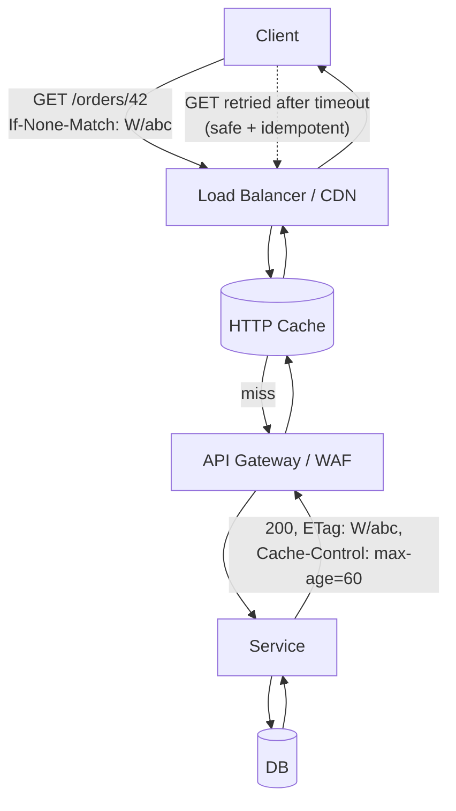
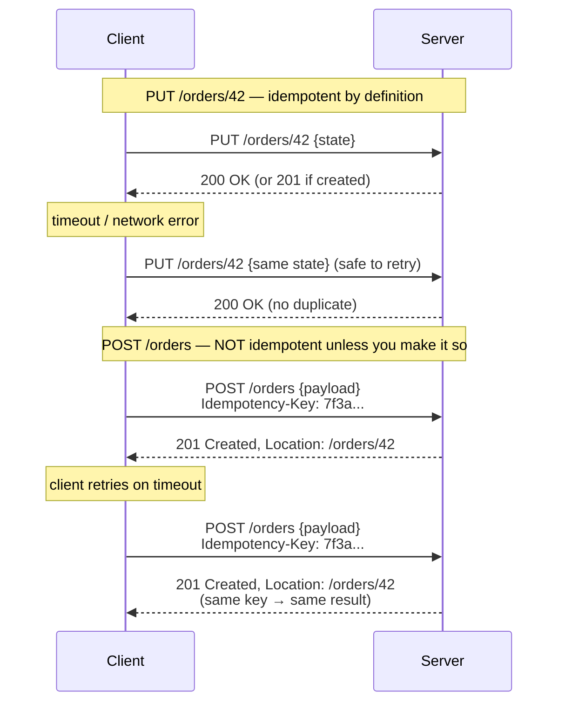
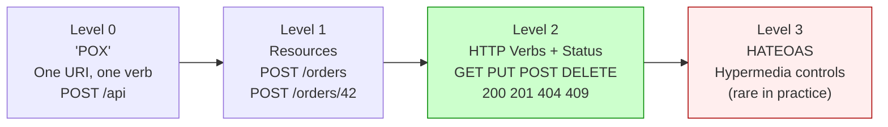

# REST: Resource-Oriented HTTP APIs

## Why This Exists

**Problem.** HTTP is a transport. Everyone uses it. But "we have a REST API" can mean anything from a thoughtful resource model with cacheable GETs and idempotent PUTs to a pile of `POST /api/doStuff` endpoints that happen to speak JSON. The first kind composes with caches, proxies, retries, and codegen. The second is RPC wearing a tie, and breaks every time the network does.

**Key insight.** REST's leverage comes from the **uniform interface**: a small, fixed set of verbs (`GET`, `PUT`, `POST`, `DELETE`, `PATCH`, `HEAD`, `OPTIONS`) operating on **resources** identified by URIs, with semantics defined by RFCs — *not* by you. When you honor those semantics (idempotency, safety, cacheability, status codes), the entire HTTP ecosystem works for free: CDN caching, browser back/forward, retry middleware, OpenAPI client generation, observability tools, load balancers, WAFs. When you violate them, every layer becomes adversarial.

**Reach for this when:**
- Designing public, partner, or cross-team APIs where clients you don't control will call you.
- The resource model is stable and entity-shaped (users, orders, invoices, files).
- You want CDN/proxy caching, browser-friendly URLs, and broad client-tool support.
- You need machine-readable contracts (OpenAPI) for codegen, mocking, and gateway routing.

**Don't reach for this when:**
- The interaction is fundamentally action-oriented and stateful (e.g., trading, gameplay, real-time collaboration) — gRPC, WebSockets, or a CQRS command bus fit better.
- You need streaming, full-duplex, or sub-millisecond latency over many small calls — gRPC/HTTP-2 with protobuf, or SSE/WebSockets.
- The schema changes per request and the "resource" framing is a stretch — GraphQL or RPC.
- You're in a tightly coupled internal mesh where service-to-service contracts are owned by one team — gRPC + protobuf gives stronger typing.

---

## Diagrams

### The uniform interface in one picture



### Idempotency on writes (PUT vs POST)



### Richardson Maturity Model



The dirty secret: **Level 2 is what the industry actually ships.** Level 3 (HATEOAS) is the original "REST" per Fielding's dissertation, but the cost/benefit rarely lands for typical JSON APIs. More on this below.

---

## The Verbs and What They Promise

The semantics are defined by **RFC 9110** (HTTP Semantics, supersedes RFC 7231). Two properties matter most:

- **Safe**: the method does not modify server state (logging/analytics don't count). Caches and crawlers may issue these freely.
- **Idempotent**: making the request N≥1 times has the same effect as making it once. Clients (and proxies) may retry on network failures without fear.

| Method   | Safe | Idempotent | Cacheable | Has body (req) | Typical use                                     |
|----------|------|------------|-----------|----------------|-------------------------------------------------|
| `GET`    | yes  | yes        | yes       | no*            | Read a resource or collection                   |
| `HEAD`   | yes  | yes        | yes       | no             | Like GET, headers only — health/ETag checks    |
| `OPTIONS`| yes  | yes        | no        | no             | CORS preflight, capability discovery            |
| `PUT`    | no   | yes        | no        | yes            | Replace a resource at a known URI               |
| `DELETE` | no   | yes        | no        | no             | Remove a resource                               |
| `POST`   | no   | **no**     | rarely    | yes            | Create child resource, or non-idempotent action |
| `PATCH`  | no   | no**       | no        | yes            | Partial update (RFC 5789)                       |

\* `GET` with a body is technically allowed by RFC 9110 but proxies, caches, and SDKs routinely mishandle it. **Don't.**
\** `PATCH` *can* be idempotent if the patch document is absolute (e.g., JSON Merge Patch with explicit fields) but the spec doesn't require it. JSON Patch with `{"op":"add"}` to an array is *not* idempotent.

### What status codes actually mean

The categories are load-bearing:

- **2xx**: it worked. `200 OK` (general), `201 Created` (with `Location:` header), `202 Accepted` (async), `204 No Content` (success, empty body — useful for DELETE/PUT).
- **3xx**: redirect or "no change". `301`/`308` permanent, `302`/`307` temporary, `304 Not Modified` (conditional GET hit).
- **4xx**: client's fault. `400` malformed, `401` not authenticated, `403` authenticated but forbidden, `404` not found, `405` method not allowed (include `Allow:` header), `409` conflict (state collision), `410` gone (permanent), `412` precondition failed, `415` unsupported media type, `422` semantically invalid (popular but not in original RFC; now in RFC 9110), `429` too many requests (include `Retry-After:`).
- **5xx**: server's fault. `500` generic, `502` bad gateway (upstream broke), `503` service unavailable (overloaded; `Retry-After:`), `504` upstream timeout.

The 4xx/5xx split is operationally critical: **5xx is a retry signal; 4xx is not.** Mixing them up makes load balancers and clients hammer you for bugs you caused, or give up on transient failures you'd recover from.

---

## Resource Modeling: Nouns, Not Verbs

The cardinal rule: **URIs name things, methods do things.** If your URI contains a verb, you're almost always doing it wrong.

### Bad → Good

| Antipattern                           | Better                                              |
|---------------------------------------|-----------------------------------------------------|
| `POST /createUser`                    | `POST /users` → `201 Created, Location: /users/42`  |
| `GET /getUser?id=42`                  | `GET /users/42`                                     |
| `POST /users/42/delete`               | `DELETE /users/42`                                  |
| `POST /users/42/changeEmail`          | `PATCH /users/42` body `{"email": "..."}`           |
| `POST /search?q=...`                  | `GET /search?q=...` (cacheable, idempotent)         |
| `GET /users/42/orders/recent`         | `GET /users/42/orders?since=2026-01-01&limit=20`    |

### When the action genuinely isn't a CRUD-shaped resource

Some operations don't fit "create/read/update/delete a noun." Don't force them. Two common escape hatches:

1. **Treat the action as a resource of its own.** `POST /password-reset-requests`, `POST /shipments/42/cancellations`, `POST /transfers`. The "thing" is the request/event/transaction, which is a noun.
2. **Sub-resource for state.** Instead of `POST /orders/42/cancel`, model it as `PUT /orders/42/status` with `{"value":"cancelled"}`, or `POST /orders/42:cancel` (Google AIP-136 "custom verb" style). This is a *concession*, not the default.

Google's [AIP-136](https://google.aip.dev/136) explicitly carves out `:verb` syntax for the cases REST nouns can't handle elegantly (e.g., `:undelete`, `:batchGet`). The colon makes it visually distinct from a sub-resource and signals "this is an operation, not a child entity."

### Plural vs singular

Use **plural collection names** uniformly (`/users`, `/orders`, `/invoices/42/lines`). Mixing singular and plural creates nothing but bugs and bikeshedding. Singletons (e.g., the current user's profile) get a fixed name: `GET /me`, `GET /settings`.

### Pagination, filtering, sorting

Query string for everything that isn't part of the resource identity:

```
GET /orders?status=pending&since=2026-01-01&limit=50&cursor=eyJpZCI6MTIzfQ
```

Prefer **cursor pagination** over `?page=N&size=K` for any collection that grows or sorts on a mutable field. Offset pagination skips/duplicates rows under concurrent writes and gets pathologically slow on large tables. ([Use the index, Luke!](https://use-the-index-luke.com/no-offset))

---

## Idempotency: The Most Important Word in This Document

A retry-safe API is the difference between "we charged the customer twice and now finance is angry" and "the network blipped, the client retried, nothing happened."

**RFC 9110 says PUT and DELETE are idempotent. POST and PATCH are not.** That's the contract. Build accordingly.

### Idempotent PUT: replace by full state

```http
PUT /users/42 HTTP/1.1
Content-Type: application/json
If-Match: "v17"

{"id": 42, "email": "alice@example.com", "name": "Alice"}
```

- Client sends the **complete desired state** at a known URI.
- `If-Match` (optimistic concurrency) prevents lost updates: server returns `412 Precondition Failed` if the ETag has changed.
- Retrying the same PUT yields the same result (modulo the precondition).

### Non-idempotent POST made idempotent: the Idempotency-Key pattern

This is the pattern Stripe popularized and AWS, Adyen, and others have standardized on:

```http
POST /charges HTTP/1.1
Idempotency-Key: 7f3a9e8c-4b1d-4f7a-9e2c-8a1b3c5d7e9f
Content-Type: application/json

{"amount": 1999, "currency": "USD", "source": "tok_..."}
```

Server-side (pseudo-Python):

```python
def post_charges(req: Request) -> Response:
    key = req.headers.get("Idempotency-Key")
    if not key:
        # Optionally require it for write endpoints that handle money
        return Response(400, {"error": "Idempotency-Key required"})

    body_hash = sha256(canonical_json(req.body))

    # Atomic insert; conflict = key already used
    record = idempotency_store.try_insert(
        key=key,
        body_hash=body_hash,
        status="in_progress",
        ttl_hours=24,
    )

    if record.existed:
        if record.body_hash != body_hash:
            # Same key, different payload — refuse, don't silently overwrite.
            return Response(422, {"error": "Idempotency-Key reused with different body"})
        if record.status == "in_progress":
            # First request still running; ask client to retry.
            return Response(409, {"error": "in progress"}, headers={"Retry-After": "2"})
        # Replay the stored response verbatim (status, headers, body).
        return record.response

    try:
        result = process_charge(req.body)            # the actual side effect
        resp = Response(201, result, headers={"Location": f"/charges/{result.id}"})
    except DomainError as e:
        resp = Response(422, {"error": str(e)})

    idempotency_store.finish(key=key, response=resp, status="done")
    return resp
```

Notes from production:
- **Store the response, not just "done."** Replay bit-for-bit, including the resource ID. Otherwise the second `201` returns a *different* `Location:` than the first.
- **Hash the body.** Same key with different body is almost always a client bug — fail fast.
- **Bound the TTL.** 24h is typical. Don't keep idempotency records forever; that table grows without limit.
- **Treat "in progress" as retryable.** 409 + `Retry-After` is more honest than blocking the request thread.

References: [Stripe API: Idempotent Requests](https://stripe.com/docs/api/idempotent_requests), [AWS Builders' Library — Making retries safe with idempotent APIs](https://aws.amazon.com/builders-library/making-retries-safe-with-idempotent-APIs/).

### What about exactly-once?

You can't have it across an unreliable network. You can have **at-least-once delivery + idempotent processing** = effectively-once *outcomes*. That's the whole game. (See DDIA ch. 8 — "The Trouble with Distributed Systems," and ch. 9 — "Consistency and Consensus.")

---

## OpenAPI: Your Contract is Code

If your API isn't described in **[OpenAPI](https://spec.openapis.org/oas/latest.html)** (formerly Swagger; current 3.1, aligned with JSON Schema 2020-12), you're paying tax on every client integration, every mock server, every gateway config, every doc page.

### Minimal but real example

```yaml
openapi: 3.1.0
info:
  title: Orders API
  version: 1.4.0
servers:
  - url: https://api.example.com/v1
paths:
  /orders:
    get:
      summary: List orders
      parameters:
        - { name: status,  in: query, schema: { type: string, enum: [pending, paid, cancelled] } }
        - { name: limit,   in: query, schema: { type: integer, minimum: 1, maximum: 200, default: 50 } }
        - { name: cursor,  in: query, schema: { type: string } }
      responses:
        '200':
          description: OK
          headers:
            ETag: { schema: { type: string } }
          content:
            application/json:
              schema: { $ref: '#/components/schemas/OrderPage' }
    post:
      summary: Create an order
      parameters:
        - name: Idempotency-Key
          in: header
          required: true
          schema: { type: string, format: uuid }
      requestBody:
        required: true
        content:
          application/json:
            schema: { $ref: '#/components/schemas/OrderCreate' }
      responses:
        '201':
          description: Created
          headers:
            Location: { schema: { type: string, format: uri } }
          content:
            application/json:
              schema: { $ref: '#/components/schemas/Order' }
        '409': { $ref: '#/components/responses/Conflict' }
        '422': { $ref: '#/components/responses/UnprocessableEntity' }

  /orders/{id}:
    parameters:
      - { name: id, in: path, required: true, schema: { type: string } }
    get:
      responses:
        '200':
          description: OK
          headers:
            ETag: { schema: { type: string } }
            Cache-Control: { schema: { type: string } }
          content:
            application/json:
              schema: { $ref: '#/components/schemas/Order' }
        '304': { description: Not Modified }
        '404': { $ref: '#/components/responses/NotFound' }
    put:
      parameters:
        - name: If-Match
          in: header
          required: true
          schema: { type: string }
      requestBody:
        required: true
        content:
          application/json:
            schema: { $ref: '#/components/schemas/OrderReplace' }
      responses:
        '200': { description: Updated }
        '412': { $ref: '#/components/responses/PreconditionFailed' }
    delete:
      responses:
        '204': { description: Deleted }
        '404': { $ref: '#/components/responses/NotFound' }

components:
  schemas:
    Order:
      type: object
      required: [id, status, total]
      properties:
        id:     { type: string }
        status: { type: string, enum: [pending, paid, cancelled] }
        total:  { type: integer, description: minor units }
    Problem:        # RFC 7807 problem+json
      type: object
      properties:
        type:     { type: string, format: uri }
        title:    { type: string }
        status:   { type: integer }
        detail:   { type: string }
        instance: { type: string }
  responses:
    NotFound:
      description: Not Found
      content: { application/problem+json: { schema: { $ref: '#/components/schemas/Problem' } } }
    Conflict:
      description: Conflict
      content: { application/problem+json: { schema: { $ref: '#/components/schemas/Problem' } } }
    UnprocessableEntity:
      description: Unprocessable Entity
      content: { application/problem+json: { schema: { $ref: '#/components/schemas/Problem' } } }
    PreconditionFailed:
      description: Precondition Failed
      content: { application/problem+json: { schema: { $ref: '#/components/schemas/Problem' } } }
```

What this gets you for free:
- **Codegen**: clients in 30+ languages via [openapi-generator](https://openapi-generator.tech/) or vendor SDK pipelines.
- **Validation**: request/response validation middleware (Spring, FastAPI, Connexion, gateway plugins).
- **Mocks**: Prism, MSW, Postman, AWS API Gateway mock integrations — all consume OpenAPI directly.
- **Docs**: Redoc / Swagger UI / Stoplight render straight from the spec.
- **Diff/lint**: Spectral (style rules), oasdiff (breaking-change detection in CI).

**Spec-first vs code-first.** Both work. Spec-first wins when multiple consumers (mobile, web, partners) need the contract before the server exists. Code-first (annotate handlers, generate spec) wins when one team owns both ends. Either way, **the spec is the contract**, not the server's actual behavior — drift is the failure mode, and Spectral + contract tests are how you catch it.

### Errors: use RFC 7807 `problem+json`

Don't invent a 17th error envelope. [RFC 7807](https://datatracker.ietf.org/doc/html/rfc7807) (now [RFC 9457](https://datatracker.ietf.org/doc/html/rfc9457)) is small and good:

```json
HTTP/1.1 422 Unprocessable Entity
Content-Type: application/problem+json

{
  "type": "https://errors.example.com/order/insufficient-funds",
  "title": "Insufficient funds",
  "status": 422,
  "detail": "Account balance 12.34 is less than amount due 50.00",
  "instance": "/orders/42",
  "balance": "12.34",
  "due": "50.00"
}
```

The `type` URI dereferences to docs. Extension members (`balance`, `due`) are allowed and machine-parseable.

---

## HATEOAS and Why (Almost) No One Does It

Roy Fielding's 2008 blog post ["REST APIs must be hypertext-driven"](https://roy.gbiv.com/untangled/2008/rest-apis-must-be-hypertext-driven) was a polite way of saying *what you people are calling REST is not REST*. Real REST (Level 3) means clients navigate the API by following links the server returns, like a browser navigating HTML. There's no out-of-band knowledge of URIs — the entry point and the media type are all the client knows.

In hypermedia form (HAL, JSON:API, Siren, Collection+JSON):

```json
{
  "id": 42,
  "status": "pending",
  "total": 1999,
  "_links": {
    "self":   { "href": "/orders/42" },
    "cancel": { "href": "/orders/42/cancellation", "method": "POST" },
    "pay":    { "href": "/orders/42/payment",      "method": "POST" }
  }
}
```

The promise: clients become resilient to URI changes; affordances are discoverable; the API can evolve without breaking codegen.

### Why it didn't win

- **Most consumers are programmatic, not browsers.** A mobile app or partner integration knows the URI structure at compile time and *wants* the type safety of a generated client. Hypermedia-driven traversal is overhead with no payoff.
- **OpenAPI ate its lunch.** Out-of-band machine-readable contracts (OpenAPI/JSON Schema) deliver evolvability and codegen better than in-band hypermedia for most use cases.
- **Tooling is thin.** HAL has clients; JSON:API has more; Siren is niche. None compares to the OpenAPI ecosystem.
- **The discoverability promise rarely cashes out.** Real evolution is constrained by versioning policy and customer compatibility, not by URI flexibility.

**When HATEOAS *does* fit:** workflow APIs where the next legal action depends on state (e.g., `/order/42` returns a `cancel` link only when status is `pending`); long-running browseable resources for human + machine consumers; APIs that need *very* long-lived stability without versioning. Otherwise: Level 2 + OpenAPI is the pragmatic optimum.

Martin Fowler's [Richardson Maturity Model](https://martinfowler.com/articles/richardson-maturity-model.html) is the canonical explanation; he and Fielding agree on the levels but disagree (politely) on whether Level 2 deserves the "REST" name. The industry has voted with its feet: Level 2 is "REST" in practice.

---

## Caching: The Free Performance You're Probably Leaving on the Table

REST's cacheability is not folklore — it's mechanical. Honor it and your CDN is doing real work; ignore it and every request hits origin.

```http
GET /products/42 HTTP/1.1

HTTP/1.1 200 OK
Cache-Control: public, max-age=300, stale-while-revalidate=60
ETag: W/"v17-2026-06-05"
Vary: Accept, Accept-Encoding
Content-Type: application/json
```

Subsequent request:

```http
GET /products/42 HTTP/1.1
If-None-Match: W/"v17-2026-06-05"

HTTP/1.1 304 Not Modified
ETag: W/"v17-2026-06-05"
```

Rules of thumb:
- `Cache-Control` is the modern knob; ignore `Pragma` and `Expires` for new APIs.
- `public` allows shared caches (CDN, proxy); `private` restricts to the user agent.
- `max-age` is a TTL; `stale-while-revalidate` lets caches serve stale while they refresh in the background — good for tail latency.
- `ETag` enables conditional requests (`If-None-Match` / `If-Match`). Strong (`"abc"`) vs weak (`W/"abc"`): use weak unless byte-identity matters.
- `Vary` lists request headers that affect the response. **Forgetting `Vary: Authorization` is how user A sees user B's data through a shared cache.** This is a real, recurring incident class.

Don't cache `POST` (it's not cacheable per spec, even though some intermediaries try). Don't put auth tokens in URIs (they end up in cache keys, logs, referrers).

---

## Versioning: Pick One and Live With It

Three options, each with a real cost:

1. **URI path** — `/v1/orders`, `/v2/orders`. Ugly but unambiguous. Easy to route at the gateway. Universally understood. **Most common in the wild.**
2. **Custom header / `Accept` media type** — `Accept: application/vnd.example.order.v2+json`. Pure per Fielding ("the URI identifies the resource, not the representation"). Harder to test from a browser; harder to debug.
3. **Query param** — `?version=2`. Easy. Pollutes cache keys. Easy to forget. Mostly avoid.

Whichever you pick, the **real** versioning advice is: **version as little as possible**. Add fields, don't remove them. Add endpoints, don't change semantics. Treat unknown fields as ignorable on read. Use feature flags and deprecation headers (`Deprecation: true`, `Sunset: <date>` per [RFC 8594](https://datatracker.ietf.org/doc/html/rfc8594)) for a long, public deprecation window. Most services that "needed" v2 actually needed discipline on v1.

---

## REST vs RPC vs GraphQL vs gRPC

These aren't direct competitors — each fits different shapes:

| Style       | Wire           | Schema           | Strengths                                                          | Weaknesses                                                  |
|-------------|----------------|------------------|--------------------------------------------------------------------|-------------------------------------------------------------|
| REST/HTTP   | HTTP/1.1, 2, 3 | OpenAPI/JSON     | Universal tooling, caching, browser-native, partner-friendly       | Verbose, N+1, no streaming, weak typing without OpenAPI     |
| gRPC        | HTTP/2 + protobuf | .proto         | Strong typing, codegen, streaming, low latency, compact            | Browser story (gRPC-Web), CDN hostility, opaque on the wire |
| GraphQL     | HTTP POST + GQL  | SDL/JSON Schema| One round-trip per screen, client-driven shape, evolvable          | Caching is hard, query cost analysis required, complexity   |
| RPC over HTTP (JSON-RPC, SOAP) | HTTP | varies | Familiar to RPC mindset                                       | Loses HTTP semantics (caching, idempotency, status codes)   |
| Async (Kafka, SQS, EventBridge) | broker | schema-registry | Decoupling, fan-out, durability                            | Different mental model entirely; not request/response       |

REST shines for **cross-organizational, long-lived, entity-shaped** APIs. gRPC shines for **internal, high-throughput, action-shaped** service meshes. GraphQL shines when **clients vary widely and over-fetching/under-fetching is the bottleneck**. None is "better" — they fit different problems.

Beware the "REST-ish" trap: a JSON-over-HTTP API that uses POST for everything, returns 200 with `{"error":...}` on failures, and has no caching is RPC with extra steps. Either go RPC properly (gRPC, JSON-RPC) and get strong typing, or commit to REST and get the HTTP ecosystem.

---

## Common Antipatterns (Real War Stories)

- **Verbs in the URI.** `POST /createUser`, `POST /users/42/setEmail`. Symptoms: Swagger pages full of duplicate verbs; clients can't generate cleanly; gateway routing rules sprawl. Fix: nouns + verbs (`POST /users`, `PATCH /users/42`).
- **GET with side effects.** "Click this link to confirm your subscription." Then a corporate email scanner GETs every link and silently confirms everyone. Real incident, multiple companies. Fix: confirmation is a `POST` from a form (or a token-gated GET that requires explicit user action *and* a second-factor `POST`).
- **POST for reads.** "We needed to send a complex filter so we POST a JSON body to `/search`." Now your reads aren't cacheable, can't be retried safely, and break the back button. Fix: `GET /search?...` with proper query params, or POST to a `/searches` resource that returns a `Location:` to a cacheable result.
- **200 OK with `{"error": ...}`.** Status code lies. Load balancers, retry middleware, and observability tooling all key off the status code. Now they can't tell success from failure. Fix: use the right 4xx/5xx; put detail in `application/problem+json`.
- **Duplicate charges from POST retries.** Client times out on `POST /payments`, retries; server processed both; customer is charged twice. Fix: `Idempotency-Key` header, server-side dedup table.
- **Cascading failures from missing 5xx vs 4xx discipline.** Service returns 500 for "user not found"; clients retry forever; thundering herd. Fix: 404 is *not* retryable; 503 is. Pick correctly.
- **Cache poisoning via missing `Vary`.** User-specific response cached at CDN without `Vary: Authorization` or `Cache-Control: private`. Other users see it. Severity-1, every time.
- **Lost updates from no concurrency control.** Two clients both `GET`, edit, `PUT`. Last write wins, first edit is gone, no audit trail. Fix: ETags + `If-Match` (optimistic) or row-versioning in the DB.
- **`PUT` that creates with server-assigned IDs.** `PUT /users` (no id) is meaningless — PUT requires a known target URI. Use `POST /users` for create with server-assigned ID; reserve `PUT /users/{client-chosen-id}` for upsert with client-controlled IDs.
- **Pagination without stable ordering.** `?page=2&size=20` over a table sorted by `created_at` while rows are being inserted. Some rows appear twice; some never appear. Fix: cursor pagination with a tiebreaker (e.g., `(created_at, id)`).
- **Treating `PATCH` as "send a partial JSON object."** Without specifying [JSON Patch (RFC 6902)](https://datatracker.ietf.org/doc/html/rfc6902) or [JSON Merge Patch (RFC 7396)](https://datatracker.ietf.org/doc/html/rfc7396), nobody knows how to clear a field (`null` vs absent). Pick one explicitly and document it.
- **Auth tokens in query strings.** They land in CDN logs, browser history, referrer headers, and webserver access logs. Use `Authorization:` header.
- **N+1 round-trips designed in.** `GET /orders/42` returns `{customer_id: ...}`; client then fetches `/customers/...`. Fix: support `?expand=customer` or sparse fieldsets, or move to GraphQL if this is the dominant pattern.

---

## Trade-offs

| Benefit                                                    | Cost                                                                  |
|------------------------------------------------------------|------------------------------------------------------------------------|
| Universal tooling: every language, every gateway, every CDN | Verbose on the wire vs binary protocols (gRPC, Avro)                  |
| HTTP semantics give you caching, retries, idempotency free | You must honor the contract; violating it breaks the ecosystem        |
| Browser-native; debuggable with curl/devtools              | No native streaming; chatty for screen-shaped data                    |
| OpenAPI gives spec-first contracts and free codegen        | Drift between spec and implementation requires CI discipline           |
| Stateless: any server can serve any request                | Every request carries auth/context — overhead vs sticky stateful conns |
| Resource model maps cleanly to entities                    | Action-shaped APIs (workflows, RPC) feel forced                       |
| Loose coupling; clients survive minor server changes       | Strong typing requires extra work (OpenAPI/JSON Schema validation)    |
| Caches absorb read traffic at the edge                     | Cache invalidation is a hard problem; `Vary` mistakes leak data       |

---

## Decision Table

| Situation                                                | Use                                | Rationale                                                            |
|----------------------------------------------------------|------------------------------------|----------------------------------------------------------------------|
| Public/partner API, entity-shaped, broad client base     | REST + OpenAPI (Level 2)           | Tooling, cacheability, partner familiarity                           |
| Internal service mesh, high QPS, strong typing           | gRPC                               | Codegen, streaming, low latency, schema enforcement                  |
| Mobile/web client with widely varying data needs          | GraphQL                            | Avoid over-fetching, single round-trip per screen                    |
| Workflow API where next action depends on state          | REST Level 3 (HATEOAS) — *consider* | Affordances naturally hypermedia                                     |
| Action-shaped, can't model as resource                   | REST custom verb (`:action`) or RPC | Don't twist a noun into existence                                    |
| Real-time, full-duplex, push-from-server                 | WebSockets / SSE                    | HTTP request/response is the wrong shape                             |
| Long-running operation                                   | `202 Accepted` + `/operations/{id}` polling, or webhooks | Don't hold an HTTP connection for minutes                            |
| Bulk operation across many resources                     | `POST /bulk:operation` w/ Idempotency-Key | RFC doesn't cover atomicity across resources; design explicitly      |
| Need browser cacheability for reads                      | `GET` with `Cache-Control` + `ETag`| The whole HTTP cache hierarchy works for free                        |
| Money / external side-effects on writes                  | `Idempotency-Key` header (POST/PATCH) + dedup store | Retries are inevitable; design for them                              |
| Read-your-writes guarantees                              | Out of band (sticky session, replica lag tracking) | REST doesn't define consistency; that's a system property            |

---

## References

- IETF — RFC 9110 (HTTP Semantics) — https://datatracker.ietf.org/doc/html/rfc9110
- IETF — RFC 9111 (HTTP Caching) — https://datatracker.ietf.org/doc/html/rfc9111
- IETF — RFC 9457 (Problem Details for HTTP APIs) — https://datatracker.ietf.org/doc/html/rfc9457
- IETF — RFC 5789 (PATCH Method for HTTP) — https://datatracker.ietf.org/doc/html/rfc5789
- IETF — RFC 6902 (JSON Patch) — https://datatracker.ietf.org/doc/html/rfc6902
- IETF — RFC 7396 (JSON Merge Patch) — https://datatracker.ietf.org/doc/html/rfc7396
- IETF — RFC 8594 (Sunset HTTP Header) — https://datatracker.ietf.org/doc/html/rfc8594
- Roy Fielding — Architectural Styles and the Design of Network-based Software Architectures (Ch. 5: REST) — https://ics.uci.edu/~fielding/pubs/dissertation/rest_arch_style.htm
- Roy Fielding — REST APIs must be hypertext-driven — https://roy.gbiv.com/untangled/2008/rest-apis-must-be-hypertext-driven
- Martin Fowler — Richardson Maturity Model — https://martinfowler.com/articles/richardson-maturity-model.html
- OpenAPI Initiative — OpenAPI Specification 3.1 — https://spec.openapis.org/oas/latest.html
- AWS Builders' Library — Making retries safe with idempotent APIs — https://aws.amazon.com/builders-library/making-retries-safe-with-idempotent-APIs/
- AWS Builders' Library — Timeouts, retries, and backoff with jitter — https://aws.amazon.com/builders-library/timeouts-retries-and-backoff-with-jitter/
- Stripe — Idempotent Requests — https://stripe.com/docs/api/idempotent_requests
- Google — API Improvement Proposals (AIPs) — https://google.aip.dev/
- Microsoft — REST API Guidelines — https://github.com/microsoft/api-guidelines
- Zalando — RESTful API and Event Guidelines — https://opensource.zalando.com/restful-api-guidelines/
- Mark Nottingham — Caching Tutorial — https://www.mnot.net/cache_docs/
- Markus Winand — Use the Index, Luke! (No Offset / pagination) — https://use-the-index-luke.com/no-offset
- Kleppmann — Designing Data-Intensive Applications — Ch. 4 ("Encoding and Evolution") for schema/wire-format trade-offs; Ch. 8–9 for retries, idempotency, and consistency
- Google SRE Book — Ch. 22 "Addressing Cascading Failures" — https://sre.google/sre-book/addressing-cascading-failures/
- Google SRE Workbook — Ch. 8 "Implementing SLOs" (latency targets for APIs) — https://sre.google/workbook/implementing-slos/

---

## See Also

- `../grpc/` — when typing, streaming, and inter-service throughput beat REST's universality
- `../graphql/` — when clients drive query shape and N+1 is the dominant pain
- `../webhooks/` — server-to-client push on top of REST conventions
- `../api-versioning/` — long-form on path/header/media-type versioning trade-offs
- `../../reliability/retries-backoff/` — exponential backoff, jitter, retry budgets
- `../../reliability/circuit-breaker/` — protecting upstreams from retry storms
