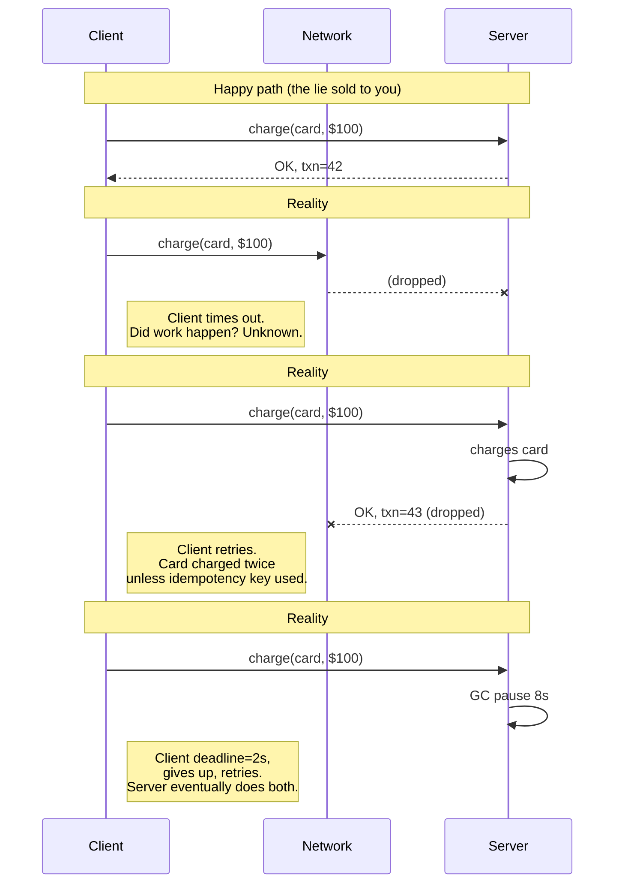
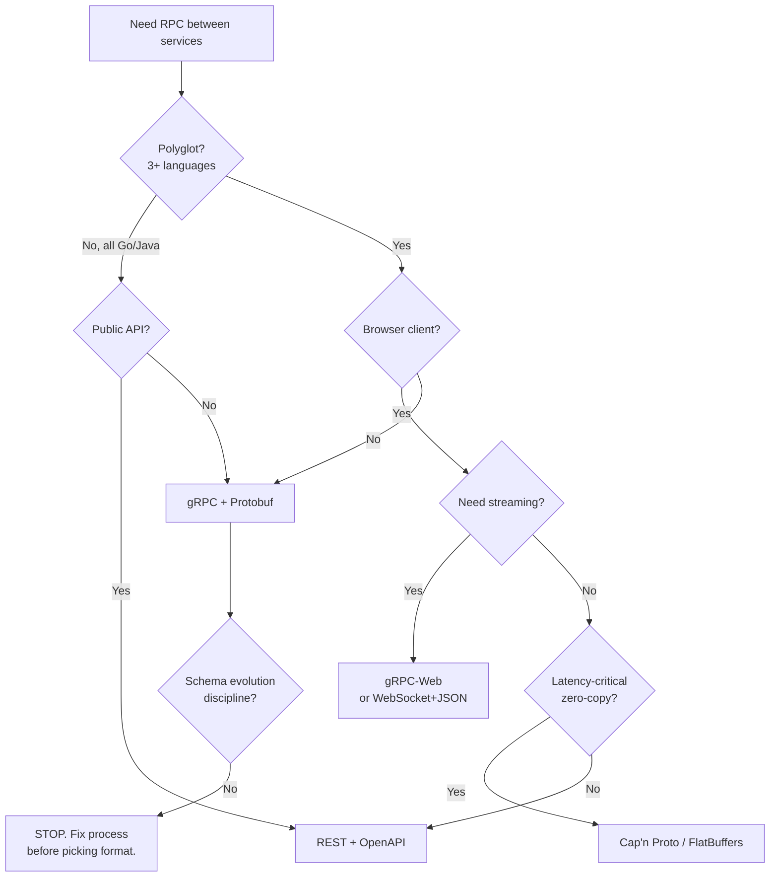

# RPC (Generic)

## Why This Exists

**Problem.** Distributed systems pretend remote calls are like local ones. They are not. A local call cannot fail partway, cannot be invoked twice without you knowing, cannot take 90 seconds because a switch dropped a packet, and cannot return after the caller has timed out and moved on. RPC frameworks paper over this — until the network forces the abstraction to leak, usually at 3am.

**Key insight.** The choice of RPC stack is mostly a choice about three things: **schema evolution** (can I deploy server v2 while clients still speak v1?), **failure semantics** (what does a timeout mean — did the work happen or not?), and **the cost ceiling** (how many CPU cycles per RPC, how many bytes on the wire, how many round-trips before first byte). Everything else — IDL syntax, codegen ergonomics, language coverage — is secondary.

**Reach for this when:**
- You are designing inter-service communication and need to pick a framework (gRPC vs REST vs Thrift vs JSON-RPC).
- You are debugging cascading timeouts, retry storms, or "phantom writes" caused by retries.
- You are writing a `.proto` / `.thrift` / `.capnp` schema and need to know which field-numbering and default-value rules will bite you in two years.
- You need to explain to a teammate why "just call it like a function" is the wrong mental model.

**Don't reach for this when:**
- You need long-lived bidirectional streams with browser clients → see `../websockets/` (or gRPC-Web with caveats).
- The two services live in the same process → use a function call. Seriously.

---

## Diagrams

### The lie: "RPC is a function call"



### Wire-format decision flow



---

## The Eight Fallacies (Deutsch / Gosling, 1994–97)

Every RPC bug you will ever see is a violation of one of these. Print this and tape it to your monitor.

1. **The network is reliable.** It isn't. Packets drop. Connections half-close. TCP RST arrives mid-stream.
2. **Latency is zero.** A cross-AZ call is ~1ms. Cross-region is 60–200ms. A p99 spike is 10× the median.
3. **Bandwidth is infinite.** You will saturate a 10 Gbps NIC by accident, usually with logs or unbounded fan-out.
4. **The network is secure.** mTLS or you're shipping plaintext credentials over a "private" VPC that isn't.
5. **Topology doesn't change.** Pods restart. DNS TTLs lie. Load balancers fail open.
6. **There is one administrator.** There are dozens. Someone changed the firewall.
7. **Transport cost is zero.** Serialization costs CPU. JSON parsing dominates many "fast" services.
8. **The network is homogeneous.** MTU varies. TLS terminators add latency. Some hops do deep packet inspection.

Waldo et al. (1994) — *A Note on Distributed Computing* — added the deeper claim: **you cannot paper over partial failure with syntactic transparency.** Every RPC framework that has tried (CORBA, Java RMI, DCOM) has produced systems that fail catastrophically when the network misbehaves. gRPC is honest about this — it forces you to handle `DEADLINE_EXCEEDED` and `UNAVAILABLE`. Earlier frameworks pretended these did not exist.

---

## Wire formats compared

### Protobuf (gRPC)

```protobuf
// payments.proto — schema-first, tag numbers are forever
syntax = "proto3";
package payments.v1;

service Payments {
  rpc Charge(ChargeRequest) returns (ChargeResponse);
  rpc StreamReceipts(StreamReceiptsRequest) returns (stream Receipt);
}

message ChargeRequest {
  // Tag numbers 1-15 are 1 byte on the wire — reserve them for hot fields.
  string idempotency_key = 1;          // REQUIRED in practice; protobuf has no "required"
  string card_token      = 2;
  int64  amount_minor    = 3;          // cents, never float for money
  string currency        = 4;          // ISO 4217
  // reserved 5;  <-- if you ever delete a field, RESERVE its tag forever
  map<string, string> metadata = 6;
}

message ChargeResponse {
  string transaction_id = 1;
  Status status = 2;
  enum Status {
    STATUS_UNSPECIFIED = 0;            // proto3 enums MUST have a 0 default
    SUCCEEDED = 1;
    DECLINED = 2;
    PENDING = 3;
  }
}
```

**Why it dominates:**
- Tag-numbered fields → adding/removing fields is non-breaking if you follow the rules (never reuse a tag, never change a tag's type).
- Codegen for ~12 mainstream languages.
- HTTP/2 multiplexing → no head-of-line blocking at the connection layer.
- Built-in deadline propagation, cancellation, flow control.

**Where it bites:**
- Proto3 dropped `required`/`optional` distinction (mostly), so "is this field set?" becomes ambiguous for scalars. Use `optional` keyword (re-added in proto3.15+) or wrapper types (`google.protobuf.StringValue`) when presence matters.
- Default-zero is indistinguishable from "not set" for scalars. A `bool active = 5` defaulting to `false` is the source of countless production incidents.
- Browser support requires gRPC-Web proxy (Envoy) — extra hop, no client streaming.
- Schema registry / breaking-change linting (e.g., [Buf](https://buf.build/)) is essentially mandatory at scale; without it, someone *will* renumber a field.

### Thrift (Apache / Facebook)

```thrift
// payments.thrift — older, but still battle-tested at Meta, LinkedIn, Pinterest
namespace java com.example.payments

struct ChargeRequest {
  1: required string idempotencyKey,
  2: required string cardToken,
  3: required i64    amountMinor,
  4: required string currency,
  6: optional map<string, string> metadata,
}

enum Status {
  SUCCEEDED = 1,
  DECLINED  = 2,
  PENDING   = 3,
}

service Payments {
  ChargeResponse charge(1: ChargeRequest req) throws (1: PaymentException e);
}
```

**Why pick it:**
- Has true `required` and `optional` (so presence is unambiguous).
- Multiple transports (binary, compact, JSON) and protocols (framed, buffered) — flexible for legacy.
- Apache Thrift + Finagle (Twitter/X) is excellent for backpressure/retry policies.

**Where it bites:**
- `required` is a footgun. If a server removes a `required` field, every client crashes on deserialize. In 2014 Facebook's Thrift team published guidance: *never use `required` in new schemas.* The whole proto3 "no required" decision was downstream of this lesson.
- Smaller ecosystem than gRPC today. New language bindings lag.
- HTTP/2 support is bolt-on; native Thrift transport doesn't multiplex like gRPC.

### Cap'n Proto

```capnp
# payments.capnp — zero-copy, no parse step
@0xbf5147cbbecf40c1;

struct ChargeRequest {
  idempotencyKey @0 :Text;
  cardToken      @1 :Text;
  amountMinor    @2 :Int64;
  currency       @3 :Text;
  metadata       @4 :List(Entry);

  struct Entry {
    key   @0 :Text;
    value @1 :Text;
  }
}

interface Payments {
  charge @0 (req :ChargeRequest) -> (resp :ChargeResponse);
}
```

**Why pick it:**
- **Zero-copy.** The serialized bytes ARE the in-memory layout. No `parse()` step. Reading a field is a pointer dereference. Microsecond-level RPC.
- Designed by Kenton Varda, the protobuf v2 author — fixes things he regretted.
- Capability-based RPC (object references travel over the wire) — eliminates many round-trips for chained calls (the "promise pipelining" pattern).

**Where it bites:**
- Smaller community. Less polyglot tooling. Production usage is real but niche (Cloudflare Workers internals, Sandstorm).
- The zero-copy invariant means you cannot validate fields cheaply — a malicious sender can craft pathological pointer cycles. Trust boundary discipline matters.
- No built-in HTTP/2 transport story; you bring your own.

### JSON-RPC

```json
// JSON-RPC 2.0 over HTTP — boring, debuggable, slow
// Request
{
  "jsonrpc": "2.0",
  "method": "payments.charge",
  "params": {
    "idempotency_key": "ord_9f2a",
    "card_token": "tok_visa_4242",
    "amount_minor": 10000,
    "currency": "USD"
  },
  "id": "req-1"
}

// Response
{
  "jsonrpc": "2.0",
  "result": { "transaction_id": "txn_42", "status": "SUCCEEDED" },
  "id": "req-1"
}

// Error
{
  "jsonrpc": "2.0",
  "error": { "code": -32000, "message": "card declined", "data": {...} },
  "id": "req-1"
}
```

**Why pick it:**
- Trivially debuggable — `curl` + `jq` works.
- No codegen step. No schema registry. No `protoc` in your CI.
- Used heavily in blockchain (Ethereum), language servers (LSP is JSON-RPC), and internal tooling.

**Where it bites:**
- **No schema** by default. Field typos go undetected until runtime. You need JSON Schema or OpenAPI on the side.
- Verbose on the wire (3–10× larger than protobuf for the same payload).
- JSON parsing dominates CPU at high RPS. A microservice doing 50k RPS spends real money parsing braces.
- No built-in streaming, deadlines, or cancellation. You bolt on HTTP/2 + SSE or WebSockets and reinvent gRPC poorly.

### MessagePack-RPC

```python
# msgpack-rpc — JSON-RPC's binary cousin
import msgpack

# Wire format: [type, msgid, method, params]
request = msgpack.packb([0, 1, "payments.charge", [
    "ord_9f2a", "tok_visa_4242", 10000, "USD"
]])
# → ~40 bytes vs ~140 for equivalent JSON
```

**Why pick it:**
- 2–5× smaller than JSON, similar parsing cost to JSON.
- Schemaless like JSON, so no codegen.
- Popular in Ruby/Python ecosystems and embedded systems where JSON is too fat.

**Where it bites:**
- Same schemalessness footguns as JSON-RPC (field renames are silent breakage).
- Fragmented client implementations — different libraries handle nil/None and integer widths differently.
- Less popular than protobuf/JSON; smaller community = fewer eyes on bugs.

---

## A correct RPC client (Go, gRPC) — what production code looks like

```go
package payments

import (
    "context"
    "crypto/tls"
    "errors"
    "time"

    "github.com/cenkalti/backoff/v4"
    "google.golang.org/grpc"
    "google.golang.org/grpc/codes"
    "google.golang.org/grpc/credentials"
    "google.golang.org/grpc/keepalive"
    "google.golang.org/grpc/status"

    pb "example.com/payments/v1"
)

// Connection-level config matters more than most teams realize.
// These defaults mean "fail fast and surface partial failure honestly."
func Dial(addr string) (*grpc.ClientConn, error) {
    return grpc.Dial(addr,
        grpc.WithTransportCredentials(credentials.NewTLS(&tls.Config{MinVersion: tls.VersionTLS13})),
        grpc.WithKeepaliveParams(keepalive.ClientParameters{
            Time:                10 * time.Second, // ping if idle this long
            Timeout:             3 * time.Second,  // close conn if no pong
            PermitWithoutStream: true,
        }),
        // Block until first SubConn is ready, but with a bounded deadline at the call site.
        grpc.WithDefaultServiceConfig(`{
            "loadBalancingPolicy": "round_robin",
            "methodConfig": [{
                "name": [{"service": "payments.v1.Payments"}],
                "retryPolicy": {
                    "maxAttempts": 3,
                    "initialBackoff": "0.1s",
                    "maxBackoff": "1s",
                    "backoffMultiplier": 2.0,
                    "retryableStatusCodes": ["UNAVAILABLE"]
                }
            }]
        }`),
    )
}

// Charge is idempotent at the application layer — server MUST dedupe by IdempotencyKey.
// We retry only on UNAVAILABLE (server unreachable). DEADLINE_EXCEEDED is NOT retried
// here because the work may have completed; the caller's outer layer decides.
func Charge(ctx context.Context, client pb.PaymentsClient, req *pb.ChargeRequest) (*pb.ChargeResponse, error) {
    if req.IdempotencyKey == "" {
        return nil, errors.New("idempotency_key required: every retry must reuse it")
    }

    // Per-call deadline. NEVER call without one — deadline-less RPCs are how
    // you build a queue at the server that buries every request behind a slow one.
    callCtx, cancel := context.WithTimeout(ctx, 2*time.Second)
    defer cancel()

    var resp *pb.ChargeResponse
    op := func() error {
        var err error
        resp, err = client.Charge(callCtx, req)
        if err == nil {
            return nil
        }
        st, _ := status.FromError(err)
        switch st.Code() {
        case codes.Unavailable, codes.ResourceExhausted:
            return err // retry
        default:
            return backoff.Permanent(err) // do not retry
        }
    }
    bo := backoff.WithContext(backoff.NewExponentialBackOff(), callCtx)
    if err := backoff.Retry(op, bo); err != nil {
        return nil, err
    }
    return resp, nil
}
```

**What is non-obvious here:**
- **Deadline propagation.** gRPC propagates `ctx`'s deadline as a header. The server can use it to abort early instead of doing work the caller has already given up on. Without this, you build [the metastable failure pattern](https://sigops.org/s/conferences/hotos/2021/papers/hotos21-s11-bronson.pdf) where every server is busy on requests no one is waiting for.
- **Retry only on `UNAVAILABLE`.** This is the only code that *guarantees* the server didn't see the request. `DEADLINE_EXCEEDED` and `UNKNOWN` mean "maybe it happened" — retry only with idempotency keys.
- **Idempotency key required at compile-of-call time.** Make it a function-signature requirement. Lint for it.
- **Keepalive aggressive.** Default gRPC settings happily use a half-open TCP connection for minutes. Aggressive keepalive surfaces network partitions in seconds.

---

## A correct RPC server (Python, gRPC) — deadline-aware, idempotent

```python
import grpc
import time
from concurrent import futures
from typing import Optional

import payments_pb2 as pb
import payments_pb2_grpc as pb_grpc

class PaymentsServicer(pb_grpc.PaymentsServicer):
    def __init__(self, idempotency_store, charger):
        self._idem = idempotency_store    # e.g. Redis with 24h TTL
        self._charger = charger

    def Charge(self, request: pb.ChargeRequest, context: grpc.ServicerContext) -> pb.ChargeResponse:
        # 1. Surface and respect caller deadline.
        deadline = context.time_remaining()
        if deadline is not None and deadline < 0.05:
            # Less than 50ms left — refuse to start. Better to fail fast than
            # do work the caller has abandoned.
            context.abort(grpc.StatusCode.DEADLINE_EXCEEDED, "deadline too tight")

        # 2. Idempotency check FIRST, before any side effects.
        key = request.idempotency_key
        if not key:
            context.abort(grpc.StatusCode.INVALID_ARGUMENT, "idempotency_key required")

        cached = self._idem.get(key)
        if cached is not None:
            # Returning the cached response makes a retry safe even if the
            # client retried after our reply was dropped.
            return cached

        # 3. Validate inputs before touching the card network.
        if request.amount_minor <= 0:
            context.abort(grpc.StatusCode.INVALID_ARGUMENT, "amount must be positive")

        # 4. Do the work. Pass the remaining deadline DOWN to the card network call —
        #    don't let downstream calls outlive the caller.
        try:
            txn_id = self._charger.charge(
                token=request.card_token,
                amount=request.amount_minor,
                timeout=context.time_remaining() - 0.1,  # leave 100ms slack
            )
        except CardDeclined as e:
            # Cache the decline too — retries should get the same answer.
            resp = pb.ChargeResponse(status=pb.ChargeResponse.DECLINED)
            self._idem.set(key, resp, ttl=86400)
            return resp
        except UpstreamTimeout:
            # Don't cache. We don't know if the charge happened. The caller's
            # retry will hit us again; we'll retry the upstream lookup-by-key.
            context.abort(grpc.StatusCode.DEADLINE_EXCEEDED, "card network timeout")

        resp = pb.ChargeResponse(transaction_id=txn_id, status=pb.ChargeResponse.SUCCEEDED)
        self._idem.set(key, resp, ttl=86400)
        return resp


def serve():
    server = grpc.server(
        futures.ThreadPoolExecutor(max_workers=64),
        options=[
            ("grpc.keepalive_time_ms", 10_000),
            ("grpc.keepalive_timeout_ms", 3_000),
            # Cap concurrent streams per connection to prevent one chatty
            # client from starving others.
            ("grpc.max_concurrent_streams", 100),
            # Reject messages > 4MiB by default; raise only with a reason.
            ("grpc.max_receive_message_length", 4 * 1024 * 1024),
        ],
    )
    pb_grpc.add_PaymentsServicer_to_server(PaymentsServicer(...), server)
    server.add_secure_port("0.0.0.0:50051", grpc.ssl_server_credentials([...]))
    server.start()
    server.wait_for_termination()
```

---

## Schema evolution rules (apply to ALL formats; enforce in CI)

These are the rules that, when violated, cause the "Tuesday afternoon, half the fleet can't deserialize responses" incident.

| Change | Protobuf | Thrift | Cap'n Proto | JSON-RPC |
|---|---|---|---|---|
| Add new optional field | Safe | Safe (if `optional`) | Safe | Safe |
| Add new required field | N/A (no `required`) | **BREAKING** | Safe (no required) | Document it; runtime break |
| Remove a field | Safe IF tag reserved | **BREAKING** for `required` | Safe IF id reserved | Silent break in clients |
| Rename a field | Safe (tag is identity) | Safe (id is identity) | Safe (id is identity) | **BREAKING** |
| Change a field's type | **BREAKING** | **BREAKING** | **BREAKING** | Often silent corruption |
| Reuse a tag/id | **DATA CORRUPTION** | **DATA CORRUPTION** | **DATA CORRUPTION** | N/A |
| Add enum value | Safe; old code falls to UNKNOWN | Safe (with care) | Safe | Safe |
| Make scalar `optional` | Subtle: presence semantics change | Subtle | Safe | N/A |

**Tooling to enforce these:** [Buf](https://buf.build/docs/breaking/overview/) for protobuf, [Thrift Validator](https://github.com/airbnb/airbnb.io) projects, schema-registry (Confluent) for Kafka payloads.

---

## Trade-offs

| Benefit | Cost |
|---|---|
| **Strongly-typed contracts** (Protobuf/Thrift/Cap'n Proto) catch field typos at compile time. | Codegen step in CI; polyglot teams must coordinate version bumps. |
| **Binary wire format** is 3–10× smaller and 5–20× faster to parse than JSON. | Not human-readable; debugging requires `grpcurl`, `protoc --decode`, or Wireshark plugins. |
| **HTTP/2 multiplexing** (gRPC) eliminates head-of-line blocking and gives you streaming for free. | Browsers can't speak gRPC natively; you need gRPC-Web + Envoy proxy hop. |
| **Deadline propagation** means upstream cancellations cascade — work is shed early. | Every service must respect deadlines or the chain breaks (one bad actor = cascading queueing). |
| **Schema-first design** forces you to think about data before code. | Schema review becomes a bottleneck; large orgs need a schema registry or it devolves. |
| **Codegen across N languages** lets a Go server talk to a Python client to a Kotlin Android app. | The lowest-common-denominator client library is usually the one you're stuck with. |
| **JSON-RPC** is trivially debuggable and zero-tooling. | No schema means breaking changes ship silently; CPU costs at high RPS are real money. |
| **Cap'n Proto zero-copy** gives you sub-microsecond serialization. | Smaller ecosystem; trust boundary requires extra validation. |
| **Synchronous request-response model** matches developer mental model. | Encourages tight temporal coupling; one slow service degrades everyone upstream. Consider events. |

---

## Common Pitfalls

- **Calling RPC without a deadline.** The default `context.Background()` or no-timeout JSON HTTP call means a 30-second TCP retransmit is your effective timeout. Build the queue at the server, watch p99 latency become unbounded. *Fix:* every call site enforces a deadline; lint for it.

- **Retrying on `DEADLINE_EXCEEDED`.** The work may have completed. Without an idempotency key, this is how you get duplicate charges, double-sent emails, or two database rows where there should be one. *Fix:* retry only on `UNAVAILABLE`; require idempotency keys for any state-changing call; cache responses by key on the server.

- **Reusing a protobuf tag number after deletion.** Field 5 was `bool active`. You delete it, ship, then add `int32 user_count = 5` six months later. Old clients reading new responses interpret integers as bools. Silent corruption. *Fix:* always `reserved 5;` after deletion. Buf-lint enforces this.

- **`required` in Thrift / required-by-convention in proto3.** A required field that gets removed nukes every old client. Production rule, written in blood at Facebook: never mark a field required.

- **Using float for money.** `0.1 + 0.2 != 0.3`. Use `int64` minor units (cents) or a decimal type. RPC schemas inherit the bug if you encode floats.

- **Connection per request.** Re-establishing TLS for every gRPC call eats more time than your handler spends doing work. *Fix:* reuse `ClientConn`; one per service per process is plenty.

- **Unbounded streaming.** A server-streaming RPC that emits forever with no flow control will OOM the client (or vice versa). gRPC's HTTP/2 has flow control; use it. Set `MaxConcurrentStreams`. Bound message sizes.

- **Defaulting `enum FOO_UNSPECIFIED = 0`** and then writing `if msg.status == FOO_A`. You forgot the unspecified case. *Fix:* exhaustive-switch lint; treat unspecified as a hard error or explicit fallback.

- **Single global deadline for fan-out.** If parent has 1s and you fan out to 5 children, each child must NOT inherit "1s remaining" if they run sequentially. Slice the budget. Better: fan out in parallel.

- **Health-check endpoint that does real work.** Load balancers ping it every second. If it hits the database, your DB takes a constant beating. *Fix:* gRPC health protocol (`/grpc.health.v1.Health/Check`) returns SERVING based on a periodic background probe, not a per-call check.

- **Mixing transports in a tracing context.** A gRPC call followed by a Kafka publish must propagate the same trace ID and (if synchronous-feeling) the deadline. Otherwise distributed traces are full of orphaned spans.

- **Backward compatibility tested only in staging.** Prod has v1, v2, and v3 clients live simultaneously during a deploy. Test that v3 server handles v1 client *and* v1 server handles v3 client (forward and backward). Most teams test only forward.

---

## Decision Table

| If you need… | Pick | Avoid |
|---|---|---|
| Inter-service calls in a polyglot microservice fleet | **gRPC + Protobuf** | JSON-RPC (CPU cost), CORBA (don't) |
| Public, cacheable, hypermedia API | **REST + OpenAPI** | gRPC (browser pain, not cache-friendly) |
| Browser → backend with streaming, no proxy hop | **WebSocket + JSON or Protobuf** | gRPC-Web for client streaming (unsupported) |
| Sub-millisecond serialization, in-process or hot-path | **Cap'n Proto** or FlatBuffers | JSON-RPC, Protobuf |
| Smallest wire size, schemaless, ecosystem already on JSON | **MessagePack-RPC** | JSON-RPC at high RPS |
| Maximum debuggability, low RPS internal tools, blockchain-style | **JSON-RPC 2.0** | Protobuf (codegen overhead) |
| Java/Scala monoculture (esp. Twitter/X-style fleets) | **Thrift + Finagle** | gRPC if Finagle's retry/backpressure is the value-add |
| Fire-and-forget, no caller waiting | **Message queue, not RPC** | Any synchronous RPC |
| Long-running async job (>30s) | **Submit-and-poll, or callback** | Long-deadline gRPC (head-of-line blocking) |
| Strict latency budget across many hops | **gRPC with deadline propagation + budget slicing** | Any framework without deadlines |
| Cross-org, untrusted-client API surface | **REST + OAuth + careful schema** | gRPC (harder to reason about untrusted streaming) |

---

## When you should stop using RPC entirely

The strongest signal you've outgrown synchronous RPC: **you keep adding retry policies, circuit breakers, and bulkheads, and outages still cascade.** That is the system telling you the temporal coupling is the problem, not the resilience tooling.

Replacements:
- **Events / message queues** — see `../message-queues/`. Producer doesn't wait for consumer. Consumer can be down for an hour without taking the producer with it.
- **Sagas / orchestration** — see `../../architecture-patterns/saga/`. Multi-step business workflows shouldn't be a chain of synchronous RPCs.

Don't read this as "RPC bad." Read it as: RPC is the right answer when the caller genuinely cannot proceed without the response, and is the wrong answer otherwise.

---

## References

- Waldo, Wyant, Wollrath, Kendall — *A Note on Distributed Computing* (Sun Labs TR-94-29, 1994) — https://web.archive.org/web/20130116080253/http://research.sun.com/techrep/1994/smli_tr-94-29.pdf
- Deutsch & Gosling — *The Eight Fallacies of Distributed Computing* — https://en.wikipedia.org/wiki/Fallacies_of_distributed_computing (canonical list; original 1994 Sun memo)
- Google — *gRPC Documentation* — https://grpc.io/docs/
- Google — *Protocol Buffers Language Guide (proto3)* — https://protobuf.dev/programming-guides/proto3/
- Google — *API Design Guide — Errors* — https://cloud.google.com/apis/design/errors
- Apache Thrift — *Thrift: Scalable Cross-Language Services Implementation* (Slee, Agarwal, Kwiatkowski, 2007) — https://thrift.apache.org/static/files/thrift-20070401.pdf
- Kenton Varda — *Cap'n Proto* — https://capnproto.org/ (and the *Cap'n Proto vs Protobuf* comparison: https://capnproto.org/news/2014-06-17-capnproto-flatbuffers-sbe.html)
- JSON-RPC 2.0 Specification — https://www.jsonrpc.org/specification
- MessagePack-RPC Specification — https://github.com/msgpack-rpc/msgpack-rpc/blob/master/spec.md
- Kleppmann — *Designing Data-Intensive Applications* (O'Reilly, 2017) — ch. 4 *Encoding and Evolution* (Protobuf/Thrift/Avro tradeoffs), ch. 8 *The Trouble with Distributed Systems*
- Beyer et al. — *Site Reliability Engineering* — ch. 22 *Addressing Cascading Failures* — https://sre.google/sre-book/addressing-cascading-failures/
- Beyer et al. — *Site Reliability Engineering* — ch. 21 *Handling Overload* — https://sre.google/sre-book/handling-overload/
- AWS Builders' Library — *Timeouts, retries, and backoff with jitter* (Marc Brooker) — https://aws.amazon.com/builders-library/timeouts-retries-and-backoff-with-jitter/
- AWS Builders' Library — *Avoiding insurmountable queue backlogs* — https://aws.amazon.com/builders-library/avoiding-insurmountable-queue-backlogs/
- Bronson, Aghayev, Charapko, Zhu — *Metastable Failures in Distributed Systems* (HotOS '21) — https://sigops.org/s/conferences/hotos/2021/papers/hotos21-s11-bronson.pdf
- Buf — *Breaking change rules for Protobuf* — https://buf.build/docs/breaking/rules/
- Pat Helland — *Life Beyond Distributed Transactions* (CIDR 2007) — https://www.ics.uci.edu/~cs223/papers/cidr07p15.pdf
- Martin Fowler — *Microservices and the First Law of Distributed Objects* — https://martinfowler.com/bliki/FirstLaw.html
- Cindy Sridharan — *Testing Microservices, the sane way* — https://copyconstruct.medium.com/testing-microservices-the-sane-way-9bb31d158c16

---

## See Also

- `../graphql/` — when clients need flexible projection of a backend domain (and you want one round-trip instead of N).
- `../message-queues/` — when you should not be doing RPC at all (fire-and-forget, decoupled producers/consumers).
- `../websockets/` — bidirectional, long-lived browser ↔ server.
- `../../reliability/circuit-breaker/` — the resilience pattern every RPC client needs.
- `../../reliability/retries-backoff/` — exponential backoff, jitter, retry budgets.
- `../../reliability/timeouts/` — deadline propagation, budget slicing.
- `../../architecture-patterns/saga/` — multi-step workflows that shouldn't be RPC chains.
- `../../performance/tracing/` — making sense of RPC chains in production.
- `../../security/mtls/` — authenticating service-to-service RPC.
- `../../data-systems/schema-evolution/` — the deeper treatment of forward/backward compatibility.
